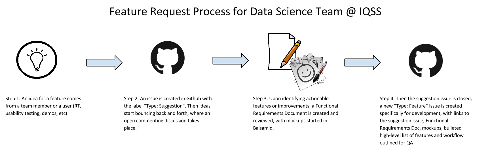

# Contributing to Dataverse

Thank you for your interest in contributing to Dataverse! We welcome contributions of ideas, bug reports, documentation, code, and more!

## Ideas/Feature Requests

Your idea or feature request might already be captured in the collection of [Dataverse issues] but if not, the best way to bring it to the community's attention is by posting on the [dataverse-community Google Group][]. You're also welcome make some noise in the [#dataverse IRC channel][] or cram your idea into 140 characters and mention [@dataverseorg][] on Twitter.

Once an idea/feature request has been received by the Dataverse Development Team the process outlined in the image below happens.

A [Functional Requirements Document (FRD for short)] [] is where we outline the use cases, requirements, user interface workflows, and any questions we have before development of a feature begins. All FRDs are publicly available through a link that is added to the github issue for the idea/feature request. Once an FRD has been completed and reviewed, low fidelity mockups are created using [Balsamiq] [] so we know what the user interface and user experience will be once the feature is developed. The mockups are also publicly available through a link added to the github issue for the idea/feature request. Please feel free to comment on any FRDs and mockups!  

To review FRDs for Dataverse, you can access them in this [Functional Requirements Document folder on Google Drive].

See also our [Community and Support][] page.

[#dataverse IRC channel]: http://webchat.freenode.net/?channels=dataverse
[Dataverse issues]: https://github.com/IQSS/dataverse/issues
[@dataverseorg]: http://twitter.com/dataverseorg
[Community and Support]: http://datascience.iq.harvard.edu/dataverse/support
[Functional Requirements Document (FRD for short)]: https://docs.google.com/document/d/1PRyAlP6zlUlUuHfgyUezzuaVQ4JnapvgtGWo0o7tLEs/edit?usp=sharing
[Balsamiq]: https://iqssharvard.mybalsamiq.com/projects
[Functional Requirements Document folder on Google Drive]: https://drive.google.com/folderview?id=0B3_V6vFxEcx-fl92ek92OG1nTmhQenBRX1Z4OVJBLXpURmh2d2RyX1NZRUp6YktaYUU5YTA&usp=sharing

## Bug Reports/Issues

An issue is a bug (a feature is no longer behaving the way it should) or a feature (something new to Dataverse that helps users complete tasks). You can browse the Dataverse [issue tracker] on GitHub by open or closed issues or by milestones.

[issue tracker]: https://github.com/IQSS/dataverse/issues

Before submitting an issue, please search the existing issues by using the search bar at the top of the page. If there is an existing issue that matches the issue you want to report, please add a comment to it.

If there is no pre-existing issue, please click on the "New Issue" button, log in, and write in what the issue is (unless it is a security issue which should be reported privately to security@dataverse.org). Someone on the Dataverse development team will appropriately tag and assign it to a member of the Dataverse development team.

## Writing an Issue

For the subject of an issue, please start it by writing the feature or functionality it relates to, i.e.-Create Account: or Dataset Page:. In the body of the issue, please outline the issue you are reporting with as much detail as possible. In order for the Dataverse development team to best respond to the issue, we need as much information about the issue as you can provide.

### Issue Labels

- **Component**: specifies the part of Dataverse the issue relates to
- **Priority**:
  - **Critical**: needs to be fixed right away, prevents a user from completing a task
  - **High**: it’s a priority to be completed for the assigned milestone
  - **Medium**: planned for that milestone, but if needed, it can be re-considered
- **Status**:
  - **In Dev**: being developed
  - **In QA**: testing to make sure it is behaving as wanted
- **Type**:
  - **Bug**
  - **Feature**
  - **Suggestion**

### Issue Attachments

You can attach an image or screenshot by dragging and dropping, selecting them, or pasting from the clipboard. This file must be a [supported image format] such as PNG, GIF or JPG; otherwise you will have to include a URL that points to the file in question.

[supported image format]: https://help.github.com/articles/issue-attachments

## Milestones
  - **In Review**: milestone for issues that are being reviewed for future releases
  - **In Design**: milestone for issues that are being designed (FRDs, mockups, technical specifications, etc happen during this milestone). This is a way to see what we are working on for future releases
  - **Candidate** candidate for [version] means that it is only under consideration. A developer works on issues that have been tagged with a particular milestone before dipping into the corresponding "candidate for" milestone. Usually are "nice to have" features or bug fixes for a release if there is time left after the primary work is done.

## Documentation

The source for the documentation at http://guides.dataverse.org is in the GitHub repo under the "[doc][]" folder. If you find a typo or inaccuracy or something to clarify, please send us a pull request!

## Code/Pull Requests

To get started developing code for Dataverse, please read our Developer Guide at http://guides.dataverse.org/en/latest/developers

[doc]: https://github.com/IQSS/dataverse/tree/master/doc/sphinx-guides/source

Before you start coding, please reach out to us either on our [dataverse-community Google Group][], [IRC][], or via support@dataverse.org to make sure the effort is well coordinated and we avoid merge conflicts.

[dataverse-community Google Group]: https://groups.google.com/group/dataverse-community
[IRC]: http://irclog.iq.harvard.edu/dataverse/today

If your pull request is not assigned to anyone in a timely manner, please reach out. The assignee is responsible for evaluating the pull request and deciding whether or not to merge it in. Please try to make it easy to merge in pull requests. Tests are great. :)
