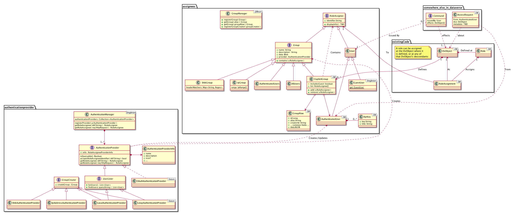

# Pluggable Authentication and Authorization

## System goals

> Go from (User, DvObject, Request) to a set of permissions

> For DvObject - who holds what permissions

## Concepts
<dl>
    <dt>DvObject</dt>
    <dd>Short for "Dataverse Object". One of Dataverse, Dataset, or Data File.</dd>
    <dt>Role</dt>
    <dd>Assumed by assignees on a given <code>DvObject</code>. A role entitles its assignees to a set of permissions.</dd>
    <dt>Assignee</dt>
    <dd>A user of a group. An entity that can be assigned a role on a given <code>DvObject</code>.</dd>
    <dt>User</dt>
    <dd>A type of Assignee. An entity that can issue commands. Normally refers to a real person, but can also refer to a group (e.g. <code>GuestUser</code>).</dd>
    <dt>Group</dt>
    <dd>A set of Assignees. A group may hold explicit reference to its content (e.g. the <code>ExplicitGroup</code> class). A group may also use logic do determine membership (e.g. an <code>IPGroup</code> will look at the IP address the request is coming from, <code>AuthenticatedUsers</code> will check that the user is not a <code>GuestUser</code> instance, a Shibboleth group will match against Shibb headers in the HTTP request).  
    A Group is a type of Assignee. This means that groups can contain other groups, which makes them a powerful user management tool.</dd>
</dl>

## Notes About the Design
* Invariant - there's always a user
    - Required for auditing, logging, etc.
    - Required for the Command Architecture
* The design is inspired by JDBC
    * Each identity provider has its own "Driver", but all conform to the same high-level interface.
    * Assignees have "URL"s, the first part of which identifies the `RoleAssigneeProvider` that created the user.
* A single user object object might refer to a group of actual people (specifically, `GuestUser`). 
    - Single physical person is referred by `AuthenticatedUser`
    - A `GuestUser` is a regular user, and can be a member of a group, either explicitly (i.e. inclusion in an `ExplicitGroup` or some other group hierarchy) or via other request headers (e.g. guest accessing Dataverse from an IP address included in an `IpGroup` ).
* All groups live in the DB.
* All authenticated users live in the DB as well. Users whose information is maintained on other systems (e.g. Shibboleth, ActiveDirectory) might have their cached information updated when they log in.
* For authenticated users from other systems, group memberships are never cached on the Dataverse side, to avoid stale data (as in, user removed from institute directory but still has institute permission on Dataverse).
    - A `RoleAssigneeProvider` may or may not allow Dataverse to issue queries about group memberships of individual users. Users coming from providers that allow such queries will have easier time using API keys, as their group memberships could be validated without them logging in.
* One cannot go from a user to all the groups said user belongs to. Example: IP group membership is determined at *query* time and based on IP address, not on user id.
* The mapping between the user generated by the `AuthenticationProvider` to the `AuthenticatedUser` is done using a lookup table, mapping from the user's id (a jdbc url-like string) to an `AuthenticatedUser.id`. In the long run, this will allow multiple logins to map to the same internal system user (e.g. a login with Shibboleth or a Mendeley username ends up with the same user).
    - Multiple logins are not planned for 4.0
* All types of groups and users are equal (i.e, Nothing special about Local Users, except that this user provider is bundled with the system)
    - In particular, `DatabaseUser` is not a subclass of `AuthenticatedUser`. This allows the internal database-backed assignee provider package to evolve independently of the standard cached assignees. `DatabaseUser`s are associated with an `AuthenticatedUser` using the regular lookup table.
* DvObject access request are sent from `AutehnticatedUser`s. The "to" field is inferred - everyone that has a `Permission.GrantPermissions` permission on said DvObject.
* To disable account creation by users, sys admins may turn off the `LocalAuthenticationProvider` module.

## Issues
* The permission set of an API key might be different from its owner permission set, in case some of the permissions come from group memberships that cannot be validated by the system at the time of the call.
    - e.g. Shibboleth group membership cannot be dynamically queried (in 4.0), thus membership in local groups that relies on Shibboleth' member-of headers cannot be validated. As this is a security issue, we err on the safe side and assume the user owning the key is not a group member.
    - This is only a problem with assignee providers that don't allow Dataverse to query group memberships. So, does not apply to `DatabaseUserProvider`. Might apply to Shibboleth and LDAP.
    - Temporary Workaround: Including the user in an `ExplicitGroup` when needed. Note that this will create stale data in the system, and would mean managing user's memberships in the institution directory as well as in Dataverse.
    - Solution: Use query-able directories

## What does "Pluggability" means for Dataverse 4.0
* Pull-request based (not full .jar based plugins in a `plugin` directory)
* No "special cases" for different user providers at the back end (*including database schema*)
* UI can have special cases (JSF + backing beans) for each user provider.
    - Hopefully, UI will be incorporated into the plug-ins in later versions
* Groups are stored in the `Groups` table. Common fields, defined at the interface level, are normal database fields. Each row holds a reference to an `RoleAssigneeProvider`. Implementation specific data goes in a blob field (e.g. an `IpGroup` can store a JSON string there, with the ranges).

## Activities
### Get the permissions of a User `u` on DvObject `d` when accessing from IP address `a`:
1. Get all the global groups `u` is member of when accessing from `a`. Call that `Gg(u)` 
2. `permissions `&larr; &empty;
3. `dvObj` &larr; `d`
2. repeat:
    3. `permissions = permissions U permissions( roles(dvObj, u) )`
    3. `permissions = permissions U permissions( roles(dvObj, Gg(u)) )`
    3. `permissions = permissions U permissions( roles(dvObj, explicit_groups(dvObj,u)) )`
    4. If `dvObj` is a permission root, output `permissions`
    4. else, `dvObj` &larr; `parent(dvObj)`

## Diagrams
### Class Diagram:
See all involved classes

###User login process

Note that Dataverse 4.0 will ship with an internal identity provider, for which the authentication process will be simpler. However, it will follow the same semantics. 

###Loading groups
This diagram shows how groups are loaded. Note how the system handles the `RoleAssigneeProvier`s' different data structures in an a opaque way - as far as the system knows, these are just strings that should be passed to the provider.

