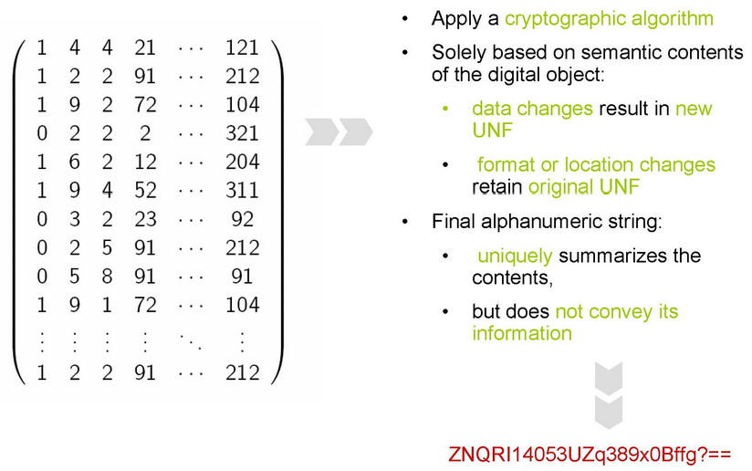

Universal Numerical Fingerprint (UNF)
++++++++++++++++++++++++++++

    Fig.1 UNF: used to uniquely identify and verify data.

The Universal Numerical Fingerprint (UNF) portion of the citation standard for data sets uses a specific algorithm to compute the approximated semantic content of a digital object. This approximated content is then put into a normalized (or canonicalized) form, and a hash function is used to compute a unique fingerprint for the resulting normalized, approximated object. The resulting hash (a string of characters) is thus independent of the storage medium and format of the object. Version 3 of the UNF algorithm was implemented, using R code, by the Project prior to implementation of Dataverse software version 2.0. With the release of Dataverse software version 2.0, UNF version 5 is implemented and uses Java code. If a Dataset was created in a Dataverse installation using software prior to version 2.0, the UNF calculations for that Dataset and all subsettable files comply with UNF version 3 standards. After the Dataverse on which such Datasets are hosted is updated to software version 2.0 or later, all new Datasets and subsettable files contributed to that Dataverse software installation will comply with UNF version 5 standards. If a new subsettable file is uploaded to an existing Dataset for which the UNF was calculated using version 3 standards, the new file's UNF is calculated using version 5 of the standard and a new UNF also is calculated for the Dataset using version 5.

Learn more:
Micah Altman, Jeff Gill and Michael McDonald, 2003, `Numerical Issues in Statistical Computing for the Social Scientist <http://datascience.iq.harvard.edu/publications/numerical-issues-statistical-computing-social-scientist>`_, New York: John Wiley. 
