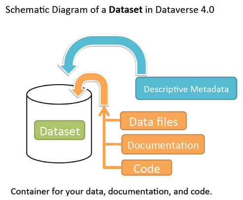

Dataset & File Management
+++++++++++++++++++++++++++++

A dataset in Dataverse is a container for your data, documentation, code, and the metadata describing this Dataset.

|image1|

New Dataset
====================

#. Navigate to the dataverse in which you want to add a dataset (or in the "root" dataverse). 
#. Click on the "Add Data" button and select "New Dataset" in the dropdown menu.
#. To quickly get started, enter at minimum all the required fields with an asterisk (e.g., the Dataset Title, Author, 
   Description, etc)
#. Scroll down to "Files" tab and click on "Select Files to Add" to add all the relevant files to your Dataset. 
   You can also upload your files directly from your Dropbox. **Tip:** You can drag and drop your files from your desktop,
   directly into the upload widget. Your file will appear below the "Select Files to Add" button where you can add a
   description of the file.
#. Click the "Add Dataset" button when you are done. Your unpublished dataset is now created. 

Note: You can add additional metadata once you have completed the initial dataset creation by going to Edit Dataset. 

Edit Dataset
==================

Go to your dataset page and click on the "Edit Dataset" button. There you will have two options where you can either edit:

- Files (Upload or Edit Data): to add or edit files in this dataset.
- Metadata: to add/edit metadata including additional metadata than was not previously available during Dataset Creation.

Publish Dataset
====================

When you publish a dataset, you make it available to the public so that other users can
browse or search for it. Once your dataset is ready to go public, go to your dataset page and click on the 
"Publish" button on the right hand side of the page. A pop-up will appear to confirm that you are ready to actually 
Publish since once a dataset is made public it can no longer be unpublished. 

Whenever you edit your dataset, you are able to publish a new version of the dataset. The publish dataset button will reappear whenever you edit the metadata of the dataset or add a file.

Note: Prior to publishing your dataset the Data Citation will indicate that this is a draft but the "DRAFT VERSION" text
will be removed as soon as you Publish.

