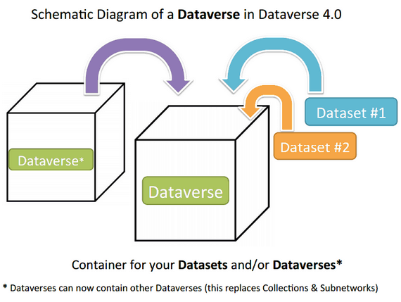

Dataverse Management
++++++++++++++++++++++++++++

A dataverse is a container for datasets (research data, code, documentation, and metadata) and other dataverses, 
which can be setup for individual researchers, departments, journals and organizations.

|image1|

Once a user creates a dataverse they, by default, become the
administrator of that dataverse. The dataverse administrator has access
to manage the settings described in this guide.

Create a Dataverse (within the "root" Dataverse)
===================================================

Creating a dataverse is easy but first you must be a registered user (see Create Account).

#. Once you are logged in click on the "Add Data" button and in the dropdown menu select "Create Dataverse".
#. Once on the "New Dataverse" page fill in the following fields:
    * Enter the name of your dataverse.
    * **Alias**: This is an abbreviation, usually lower-case, that becomes part of the URL for the new dataverse. Special characters (~,\`, !, @, #, $, %, ^, &, and \*) and spaces are not allowed. **Note**: if you change the Dataverse URL field, the URL for your Dataverse changes (http//.../dv/'url'), which affects links to this page.
    * **E-mail**: This is the email address you will receive notifications for, for this particular dataverse.
    * **Affiliation**: Add any Affiliation that can be associated to this particular dataverse (e.g., project name, institute name, department name, journal name, etc). This is automatically filled out if you have added an affiliation for your user account.
    * **Description**: Provide a description of this dataverse (max. 1000 characters). This will display on the home page of your dataverse and in the search result list.
    * **Choose the sets of Metadata Elements for datasets in this dataverse**: by default the metadata elements will be from the host dataverse that this new dataverse is created in. Dataverse offers metadata standards for multiple domains. To learn more about the metadata standards in Dataverse please check out the appendix (insert link here)
    * **Select facets for this dataverse**: by default the facets that will appear on your dataverse landing page will be from the host dataverse that this new dataverse was created in. The facets are simply metadata fields that can be used to help others easily find dataverses and datasets within this dataverse. You can select as many facets as you would like.
#. Selected metadata elements are also used to pick which metadata fields you would like to use for creating templates for your datasets. Metadata fields can be hidden, or selected as required or optional. Once you have selected all the fields you would like to use, you can create your template(s) after you finish creating your dataverse.
#.. Click "Create Dataverse" button and you're done! 

\*Required fields are denoted by a red asterisk.

Edit Dataverse 
=================

To edit your dataverse, navigate to your dataverse homepage and select the "Edit Dataverse" button, 
where you will be presented with the following editing options. 

- **General Information**: edit name, host dataverse, alias, email, 
  description, affilitation, Metadata Elements, and facets for your dataverse.
- **Theme + Widgets**: upload a logo for your dataverse, add a link to your department or personal website, and select colors for your dataverse in order to brand it. Also, you can get code to add to your website to have your dataverse display on it.
- **Featured Dataverses**: if you have one or more dataverses, you can use this option to show them at the top of your dataverse page to help others easily find interesting or important dataverses
- **Permissions**: give Dataverse users permissions to your dataverse, i.e.-can edit datasets, and see which users already have which permissions for your dataverse
- **Dataset Templates**: these are useful when you have several datasets that have the same information in multiple metadata fields that you would prefer not to have to keep manually typing in
- **Delete Dataverse**: you are able to delete your dataverse as long as it is not published and does not have any draft datasets 

Publish Your Dataverse
=================================================================

Once your dataverse is ready to go public, go to your dataverse page, click on the "Publish" button on the right 
hand side of the page. A pop-up will appear to confirm that you are ready to actually Publish, since once a dataverse
is made public it can no longer be unpublished.

