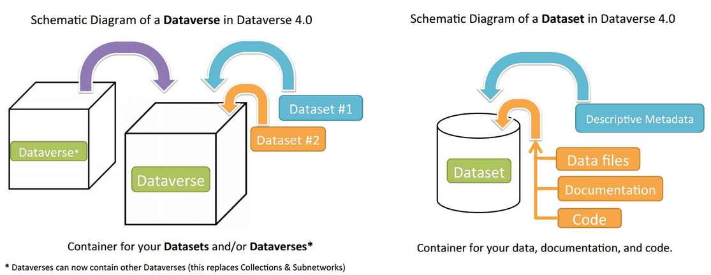

Dataverse Administration
++++++++++++++++++++++++++++

A dataverse is a container for Datasets and dataverses, and is the home for an individual
scholar's, project's, journal's or organization's data.

|image1|

Once a user creates a dataverse they, by default, become the
administrator of that dataverse. The dataverse administrator has access
to manage the settings described in this guide.

Create a Dataverse (within the "root" Dataverse)
===================================================

Creating a dataverse is easy but first you must be a registered user (see Create Account).

#. Once you are logged in click on the "Add Data" button and in the dropdown menu select "Create Dataverse".
#. Once on the "New Dataverse" page fill in the following fields:
    * Enter the name of your Dataverse.
    * **Host Dataverse**: select which dataverse you would like this new dataverse to belong to. By default it will be a child dataverse of the parent you clicked from.
    * **Dataverse Alias**: This is an abbreviation, usually lower-case, that becomes part of the URL for the new dataverse. Special characters (~,\`, !, @, #, $, %, ^, &, and \*) and spaces are not allowed. **Note**: if you change the Dataverse Alias field, the URL for your Dataverse changes (http//.../dv/'alias'), which affects links to this page.
    * **Contact E-mail**: This is the email address you will receive notifications for this particular Dataverse... [wouldn't it be your account email address by default?]
    * **Affiliation**: Add any Affiliation that can be associated to this particular dataverse (e.g., project name, institute name, department name, journal name, etc).
    * **Description**: Provide a description of this dataverse (max. 1000 characters). This will display on the home page of your dataverse and in the search result list.
    * **Choose the sets of Metadata Elements for datasets in this Dataverse**: by default the metadata elements will be from the host dataverse that this new dataverse is created in.
3. Click "Create Dataverse" button and you're done! An email will be sent to you with more information, including the URL to access your new dataverse.

\*Required information can vary depending on site policy. Required fields are noted with a red asterisk.

Edit Dataverse 
=================

To edit your Dataverse, navigate to your Dataverse homepage and select the "Edit Dataverse" button. 

- **General Information**: edit name, host dataverse, alias, email, description, and affilitation for your dataverse.
- **Roles + Permissions** for this particular dataverse
- **Setup**: Edit the Metadata elements and Facets you want to associate with your dataverse. Note: facets will appear in the order shown on the list.

Publish Your Dataverse
=================================================================

Once your dataverse is ready to go public, go to your dataverse page, click on the "Private" button on the right 
hand side of the page which should indicate: 
"This dataverse is Private. To make it public click 'Publish dataverse' link."

**Important Note**: Once a dataverse is made public it can no longer be un-published.

