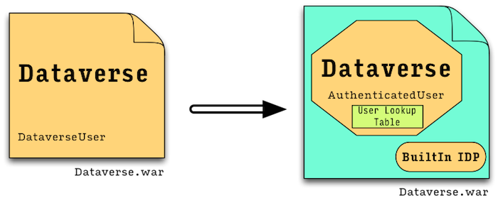

# Merge Party
Welcome to the merge party! This document is intended to give a short overview of why we need this party, when was it changed and how to change it. There's much work to do, so we'll keep it short, hopefully.

## What Just Happened
In order to allow users to log into Dataverse using credentials from other systems (e.g. institutional Shibboleth server), we had to refactor out the internal user management sub-system (formerly known as "DataverseUser") and introduce a new user system. The existing system was taken out of Dataverse but kept in the .war file, as we also need to support standalone instances.

Put another way, we now ship Dataverse and a small identity provider in the released .war file. Here's a diagram:



Since this is the equivalent of turning a chocolate chip cookie into a butter cookie and chocolate bar, much of the system's code was affected (a.k.a ripple effect). Hence the merge party.

The internal user object, the one that submits commands to the command engine, is now of type `edu.harvard.iq.dataverse.authorization.users.User`. Currently there are two subclasses of it: `GuestUser`, which does not live in the DB, and `AuthenticatedUser`, which does. Both can issue commands, have roles assigned to them, etc. The existence of the `GuestUser` class allows us to keep the invariant *the system always has a User*.

From a merge standpoint, this means that code that previously referenced `DataverseUser` needs to reference `User` now. If you know for sure an activity cannot ever be done by a guest user, you can reference `AuthenticatedUser`, and have the compiler impose this limitation for you at compile time (yay!).

Most of these changes have been done by Michael/Phil - otherwise, the `auth` branch would not compile.

The guest user does not live in the database so it does not have an id. Moreover, JPA classes cannot link directly to it\*. But have no fear - all users (and, really, all `RoleAssignee`s, which are users or groups) have an identifier. When you need to reference a user (and later, a group) just use the identifier (it's of type `String`). When needing to convert an identifier to a user, call `RoleAssigneeServiceBean.getRoleAssignee( identifier )` in the general case, or `AuthenticationServiceBean.getAuthenticatedUser(identifier)` if you're certain the identifier is of an authenticated user.


\* We have debated this for a while, since we could have created a dummy record, like we've done so far. We went with this solution, as it is cleaner, can't be messed up by SQL scripts, and will make even more sense once groups arrive.

## How to Fix

While merging, you will encounter this situation:

```java
    <<<<<<< HEAD
    code with new functionality or bug fixes, that uses the old user system
    =======
    code with old functionality that uses the new user system
    >>>>>>> origin
```

So, there's no "keep the latest code and remove the old one" here - there is some real merging to be done.

For example, we go from this:
```java
@GET
@Path("{id}/versions")
public Response listVersions( @PathParam("id") Long id, @QueryParam("key") String apiKey ) {
    DataverseUser u = userSvc.findByUserName(apiKey);
    if ( u == null ) return errorResponse( Status.UNAUTHORIZED, "Invalid apikey '" + apiKey + "'");
```

To this:
```java
@GET
@Path("{id}/versions")
public Response listVersions( @PathParam("id") Long id, @QueryParam("key") String apiKey ) {
    User u = builtinUserSvc.findByIdentifier(apiKey);
    if ( u == null ) return errorResponse( Status.UNAUTHORIZED, "Invalid apikey '" + apiKey + "'");
```

Testing for guest-ness of the user has changed as well. Before, when we had a dummy guest user, we used 

```xml
<ui:fragment rendered="#{dataverseSession.user.guest}">
```

Now, we can query the user object about it's authentication state. So te code becomes:

```xml
<ui:fragment rendered="#{!dataverseSession.user.authenticated}">
```
Note that before we were asking `isGuest` and now we ask `isAuthenticated`, so the logic is reversed and we need to add a not operator. Sorry about that.

### Tools

`git ls-files --unmerged`: show which files have not been merged

## Other Added Things

### Settings bean
Settings (in `edu.harvard.iq.dataverse.settings`) are where the application stores its more complex, admin-editable configuration. Technically, its a persistent `Map<String,String>`, that can be accessed via API (`edu.harvard.iq.dataverse.api.Admin`, on path `{server}/api/s/settings`). Currently used for the signup mechanism.

### Admin API
Accessible under url `{server}/api/s/`, API calls to this bean should be editing configurations, allowing full indexing and more. The idea behind putting all of them under the `/s/` path is that we can later block these calls using a filter. This way, we could, say, allow access from localhost only. Or, we could block this completely based on some environment variable.

### `setup-all.sh` script
A new script that sets up the users and the dataverses, sets the system up for built-in signup, and then indexes the dataverses using solr. Requires the [jq utility](http://stedolan.github.io/jq/). On Macs with [homebrew](http://brew.sh) installed, getting this utility is a `brew install jq` command away.


## Undoing the undoing the merge
When merging back to master, we need to undo commit 8ae3e6a482b87b52a1745bb06f340875803d2c5b (a.k.a 8ae3e6a), which is the commit that undid the erroneous merge.
More at http://www.christianengvall.se/undo-pushed-merge-git/
