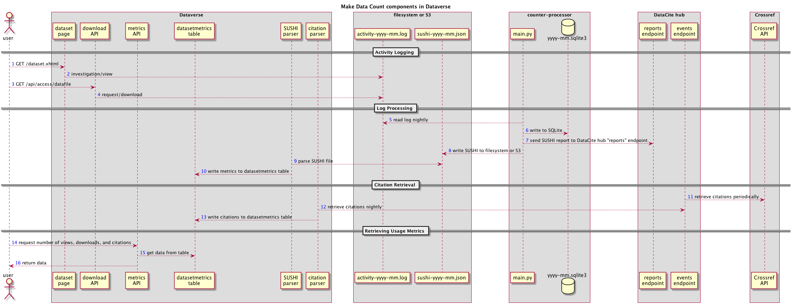

Make Data Count
===============

`Make Data Count`_ is a project to collect and standardize metrics on data use, especially views, downloads, and citations. The Dataverse Software can integrate Make Data Count to collect and display usage metrics including counts of dataset views, file downloads, and dataset citations.

.. contents:: Contents:
	:local:

Introduction
------------

`Make Data Count`_ is part of a broader Research Data Alliance (RDA) `Data Usage Metrics Working Group`_ which helped to produce a specification called the `COUNTER Code of Practice for Research Data`_ (`PDF`_, `HTML`_) that the Dataverse Software makes every effort to comply with. The Code of Practice (CoP) is built on top of existing standards such as COUNTER and SUSHI that come out of the article publishing world.  The Make Data Count project has emphasized that they would like feedback on the code of practice. You can keep up to date on the Make Data Count project by subscribing to their `newsletter`_.

Architecture
------------

Dataverse installations who would like support for Make Data Count must install `Counter Processor`_, a Python project created by California Digital Library (CDL) which is part of the Make Data Count project and which runs the software in production as part of their `DASH`_ data sharing platform.

.. _Counter Processor: https://github.com/CDLUC3/counter-processor
.. _DASH: https://cdluc3.github.io/dash/

The diagram below shows how Counter Processor interacts with your Dataverse installation and the DataCite hub, once configured. Dataverse installations using Handles rather than DOIs should note the limitations in the next section of this page.

|makedatacount_components|

The most important takeaways from the diagram are:

- Once enabled, your Dataverse installation will log activity (views and downloads) to a specialized date-stamped file.
- You should run Counter Processor once a day to create reports in SUSHI (JSON) format that are saved to disk for your Dataverse installation to process and that are sent to the DataCite hub.
- You should set up a cron job to have your Dataverse installation process the daily SUSHI reports, updating the Dataverse installation database with the latest metrics.
- You should set up a cron job to have your Dataverse installation pull the latest list of citations for each dataset on a periodic basis, perhaps weekly or daily. These citations come from Crossref via the DataCite hub.
- APIs are available in the Dataverse Software to retrieve Make Data Count metrics: views, downloads, and citations.

Limitations for Dataverse Installations Using Handles Rather Than DOIs
----------------------------------------------------------------------

Data repositories using Handles and other identifiers are not supported by Make Data Count but in the notes_ following a July 2018 webinar, you can see the Make Data Count project's response on this topic. In short, the DataCite hub does not want to receive reports for non-DOI datasets. Additionally, citations are only available from the DataCite hub for datasets that have DOIs. See also the table below.

+---------------------+---------------+------------------+
|                     | DOIs          | Handles          |
+=====================+===============+==================+
| **Out of the box**  | Classic       | Classic          |
|                     | download      | download         |
|                     | counts        | counts           |
+---------------------+---------------+------------------+
| **Make Data Count** | MDC views,    | MDC views,       |
|                     | MDC downloads,| MDC downloads    |
|                     | MDC citations |                  |
+---------------------+---------------+------------------+

This being said, the Dataverse Software usage logging can still generate logs and process those logs with Counter Processor to create json that details usage on a dataset level. Dataverse installations can ingest this locally generated json.

When editing the ``counter-processor-config.yaml`` file mentioned below, make sure that the ``upload_to_hub`` boolean is set to ``False``.

Configuring Your Dataverse Installation for Make Data Count Views and Downloads
-------------------------------------------------------------------------------

If you haven't already, follow the steps for installing Counter Processor in the :doc:`/installation/prerequisites` section of the Installation Guide.

Enable Logging for Make Data Count
~~~~~~~~~~~~~~~~~~~~~~~~~~~~~~~~~~

To make your Dataverse installation log dataset usage (views and downloads) for Make Data Count, you must set the ``:MDCLogPath`` database setting. See :ref:`:MDCLogPath` for details.

If you wish to start logging in advance of setting up other components, or wish to log without display MDC metrics for any other reason, you can set the optional ``:DisplayMDCMetrics`` database setting to false. See :ref:`:DisplayMDCMetrics` for details.

After you have your first day of logs, you can process them the next day.

Enable or Disable Display of Make Data Count Metrics
~~~~~~~~~~~~~~~~~~~~~~~~~~~~~~~~~~~~~~~~~~~~~~~~~~~~

By default, when MDC logging is enabled (when ``:MDCLogPath`` is set), your Dataverse installation will display MDC metrics instead of it's internal (legacy) metrics. You can avoid this (e.g. to collect MDC metrics for some period of time before starting to display them) by setting ``:DisplayMDCMetrics`` to false.

The following discussion assumes ``:MDCLogPath`` has been set to ``/usr/local/payara6/glassfish/domains/domain1/logs/mdc``
You can also decide to display MDC metrics along with Dataverse's traditional download counts from the time before MDC was enabled. To do this, set the :ref:`:MDCStartDate` to when you started MDC logging.

Configure Counter Processor
~~~~~~~~~~~~~~~~~~~~~~~~~~~

* First, become the "counter" Unix user.

  * ``sudo su - counter``

* Change to the directory where you installed Counter Processor.

  * ``cd /usr/local/counter-processor-0.1.04``

* Download :download:`counter-processor-config.yaml <../_static/admin/counter-processor-config.yaml>` to ``/usr/local/counter-processor-0.1.04``.

* Edit the config file and pay particular attention to the FIXME lines.

  * ``vim counter-processor-config.yaml``

Populate Views and Downloads for the First Time
~~~~~~~~~~~~~~~~~~~~~~~~~~~~~~~~~~~~~~~~~~~~~~~

Soon we will be setting up a cron job to run nightly but we start with a single successful configuration and manual run of Counter Processor and calls to your Dataverse installation's APIs. (The scripts discussed in the next section automate the steps described here, including creating empty log files if you're starting mid-month.) 

* Change to the directory where you installed Counter Processor.

  * ``cd /usr/local/counter-processor-0.1.04``

* If you are running Counter Processor for the first time in the middle of a month, you will need create blank log files for the previous days. e.g.:

  * ``cd /usr/local/payara6/glassfish/domains/domain1/logs/mdc``

  * ``touch counter_2019-02-01.log``
  
  * ``...``
  
  * ``touch counter_2019-02-20.log``
 
* Run Counter Processor.

  * ``CONFIG_FILE=counter-processor-config.yaml python39 main.py``

  * A JSON file in SUSHI format will be created in the directory you specified under "output_file" in the config file.

* Populate views and downloads for your datasets based on the SUSHI JSON file. The "/tmp" directory is used in the example below.

  * ``curl -X POST "http://localhost:8080/api/admin/makeDataCount/addUsageMetricsFromSushiReport?reportOnDisk=/tmp/make-data-count-report.json"``

* Verify that views and downloads are available via API.

  * Now that views and downloads have been recorded in the Dataverse installation's database, you should make sure you can retrieve them from a dataset or two. Use the :ref:`Dataset Metrics <dataset-metrics-api>` endpoints in the :doc:`/api/native-api` section of the API Guide.

Populate Views and Downloads Nightly
~~~~~~~~~~~~~~~~~~~~~~~~~~~~~~~~~~~~

Running ``main.py`` to create the SUSHI JSON file and the subsequent calling of the Dataverse Software API to process it should be added as a cron job.

The Dataverse Software provides example scripts that run the steps to process new accesses and uploads and update your Dataverse installation's database :download:`counter_daily.sh <../_static/util/counter_daily.sh>` and to retrieve citations for all Datasets from DataCite :download:`counter_weekly.sh <../_static/util/counter_weekly.sh>`. These scripts should be configured for your environment and can be run manually or as cron jobs.

Sending Usage Metrics to the DataCite Hub
~~~~~~~~~~~~~~~~~~~~~~~~~~~~~~~~~~~~~~~~~

Once you are satisfied with your testing, you should contact support@datacite.org for your JSON Web Token and change "upload_to_hub" to "True" in the config file. The next time you run ``main.py`` the following metrics will be sent to the DataCite hub for each published dataset:

- Views ("investigations" in COUNTER)
- Downloads ("requests" in COUNTER)

.. _MDC-updateCitationsForDataset:

Configuring Your Dataverse Installation for Make Data Count Citations
---------------------------------------------------------------------

Please note: as explained in the note above about limitations, this feature is not available to Dataverse installations that use Handles.

To configure your Dataverse installation to pull citations from the test vs.
production DataCite server see :ref:`dataverse.pid.datacite.rest-api-url` in
the Installation Guide.

Please note that in the curl example, Bash environment variables are used with the idea that you can set a few environment variables and copy and paste the examples as is. For example, "$DOI" could become "doi:10.5072/FK2/BL2IBM" by issuing the following export command from Bash:

``export DOI="doi:10.5072/FK2/BL2IBM"``

To confirm that the environment variable was set properly, you can use echo like this:

``echo $DOI``

On some periodic basis (perhaps weekly) you should call the following curl command for each published dataset to update the list of citations that have been made for that dataset.

``curl -X POST "http://localhost:8080/api/admin/makeDataCount/:persistentId/updateCitationsForDataset?persistentId=$DOI"``

Citations will be retrieved for each published dataset and recorded in the your Dataverse installation's database.

For how to get the citations out of your Dataverse installation, see "Retrieving Citations for a Dataset" under :ref:`Dataset Metrics <dataset-metrics-api>` in the :doc:`/api/native-api` section of the API Guide.
  
Please note that while the Dataverse Software has a metadata field for "Related Dataset" this information is not currently sent as a citation to Crossref.

Retrieving Make Data Count Metrics from the DataCite Hub
--------------------------------------------------------

The following metrics can be downloaded directly from the DataCite hub (see https://support.datacite.org/docs/eventdata-guide) for datasets hosted by Dataverse installations that have been configured to send these metrics to the hub:

- Total Views for a Dataset
- Unique Views for a Dataset
- Total Downloads for a Dataset
- Downloads for a Dataset
- Citations for a Dataset (via Crossref)

Retrieving Make Data Count Metrics from a Dataverse Installation
----------------------------------------------------------------

The Dataverse Software API endpoints for retrieving Make Data Count metrics are described below under :ref:`Dataset Metrics <dataset-metrics-api>` in the :doc:`/api/native-api` section of the API Guide.

Please note that it is also possible to retrieve metrics from the DataCite hub itself via https://api.datacite.org

.. _notes: https://docs.google.com/document/d/1b1itytDVDsI_Ni2LoxrG887YGt0zDc96tpyJEgBN9Q8/
.. _newsletter: https://makedatacount.org/contact/
.. _COUNTER Code of Practice for Research Data: https://makedatacount.org/counter-code-of-practice-for-research-data/
.. _PDF: https://doi.org/10.7287/peerj.preprints.26505v1
.. _HTML: https://www.projectcounter.org/code-of-practice-rd-sections/foreword/
.. _Make Data Count: https://makedatacount.org
.. _Data Usage Metrics Working Group: https://www.rd-alliance.org/groups/data-usage-metrics-wg

