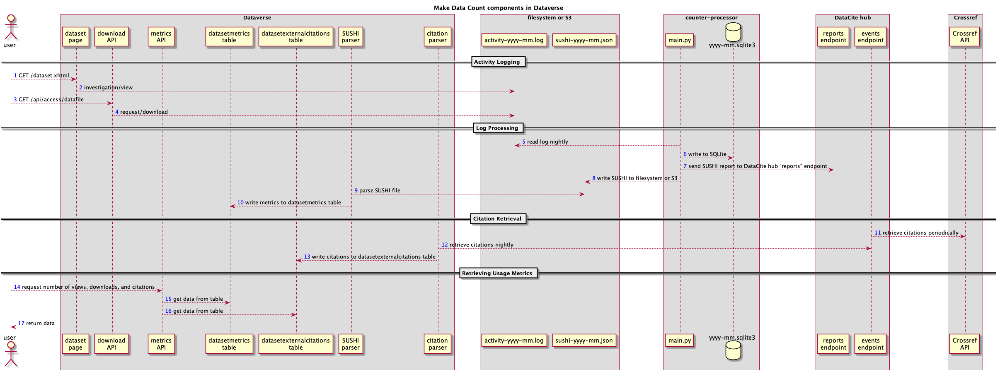

Make Data Count
===============

`Make Data Count`_ is a project to collect and standardize metrics on data use. They are part of a broader Research Data Alliance (RDA) `Data Usage Metrics Working Group`_ that they helped launch and they publish a `newsletter`_.

.. _Make Data Count: https://makedatacount.org
.. _Data Usage Metrics Working Group: https://www.rd-alliance.org/groups/data-usage-metrics-wg
.. _newsletter: https://makedatacount.org/contact/

.. contents:: Contents:
	:local:

Introduction
------------

All installations of Dataverse that use DOIs as persistent identifiers are encouraged to send data usage metrics to the "open hub" operated by DataCite for Make Data Count.

Data repositories using Handles and other identifiers are not supported by Make Data Count but in the notes_ following a July 2018 webinar, you can see the project's response on this topic.

.. _notes: https://docs.google.com/document/d/1b1itytDVDsI_Ni2LoxrG887YGt0zDc96tpyJEgBN9Q8/

Make Data Count is built on top of existing standards such as COUNTER and SUSHI that come out of the article publishing world. To meet the needs of the data publishing world, Make Data Count created the `COUNTER Code of Practice for Research Data`_ (`PDF`_, `HTML`_), which is the standard that Dataverse implements. The Make Data Count project has emphasized that they would like feedback on the code of practice.

.. _COUNTER Code of Practice for Research Data: https://makedatacount.org/counter-code-of-practice-for-research-data/
.. _PDF: https://doi.org/10.7287/peerj.preprints.26505v1
.. _HTML: https://www.projectcounter.org/code-of-practice-rd-sections/foreword/

Architecture
------------

There are many components involved in Dataverse's architecture for Make Data Count as shown in the diagram below.

|makedatacount_components|

Sending Metrics from Dataverse to the DataCite Hub
--------------------------------------------------

To make Dataverse log dataset usage (views and downloads) for Make Data Count, you must set the ``:MDCLogPath`` database setting. See the :doc:`/installation/config` section of the Installation Guide for details.

To configure Dataverse to send the metrics to the DataCite hub, you must set up a cron job to call the following API endpoint:

``curl -X POST http://localhost:8080/api/admin/makeDataCount/sendToHub``

The following metrics will be sent for each published dataset:

- Views ("investigations" in COUNTER)
- Downloads ("requests" in COUNTER)
- Citations ("relatedIdentifier" based on "Related Dataset")

Retrieving Make Data Count Metrics from the DataCite Hub
--------------------------------------------------------

The following metrics can be downloaded directly from the DataCite hub (see https://support.datacite.org/docs/eventdata-guide) for datasets hosted by Dataverse installations that have been configured to send these metrics to the hub:

- Total Views for a Dataset
- Unique Views for a Dataset
- Total Downloads for a Dataset
- Downloads for a Dataset
- Citations for a Dataset (via Crossref)

Retrieving Make Data Count Metrics from Dataverse
-------------------------------------------------

Dataverse users might find it more convenient to retrieve Make Data Count metrics from their installation of Dataverse rather the DataCite hub.

The Dataverse API endpoints for retrieving Make Data Count metrics are described below. Please note that in the curl examples, Bash environment variables are used with the idea that you can set a few environment variables and copy and paste the examples as is. For example, "$DV_BASE_URL" could become "https://demo.dataverse.org" by issuing the following ``export`` command from Bash:

``export DV_BASE_URL=https://demo.dataverse.org``

To confirm that the environment variable was set properly, you can use ``echo`` like this:

``echo $DV_BASE_URL``

Retrieving Total Views for a Dataset
+++++++++++++++++++++++++++++++++++++++++++++++++

``curl "$DV_BASE_URL/api/datasets/:persistentId/makeDataCount/viewsTotal?persistentId=$DOI"``

Retrieving Unique Views for a Dataset
+++++++++++++++++++++++++++++++++++++++++++++++++

``curl "$DV_BASE_URL/api/datasets/:persistentId/makeDataCount/viewsUnique?persistentId=$DOI"``

Retrieving Total Downloads for a Dataset
+++++++++++++++++++++++++++++++++++++++++++++++++

``curl "$DV_BASE_URL/api/datasets/:persistentId/makeDataCount/downloadsTotal?persistentId=$DOI"``

Retrieving Unique Downloads for a Dataset
+++++++++++++++++++++++++++++++++++++++++++++++++

``curl "$DV_BASE_URL/api/datasets/:persistentId/makeDataCount/downloadsTotal?persistentId=$DOI"``

Retrieving Citations for a Dataset
+++++++++++++++++++++++++++++++++++++++++++++++++

``curl "$DV_BASE_URL/api/datasets/:persistentId/makeDataCount/citations?persistentId=$DOI"``

