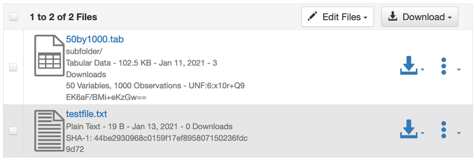
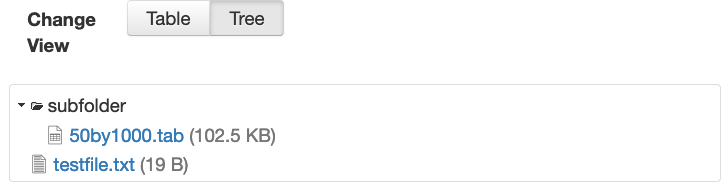
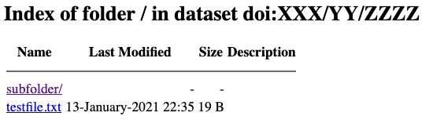
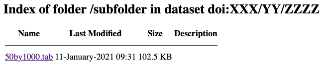

Native API
==========

The Dataverse Software exposes most of its GUI functionality via a REST-based API. This section describes that functionality. Most API endpoints require an API token that can be passed as the ``X-Dataverse-key`` HTTP header or in the URL as the ``key`` query parameter.

.. note:: |CORS| Some API endpoint allow CORS_ (cross-origin resource sharing), which makes them usable from scripts running in web browsers. These endpoints are marked with a *CORS* badge.

.. note:: Bash environment variables shown below. The idea is that you can "export" these environment variables before copying and pasting the commands that use them. For example, you can set ``$SERVER_URL`` by running ``export SERVER_URL="https://demo.dataverse.org"`` in your Bash shell. To check if the environment variable was set properly, you can "echo" it (e.g. ``echo $SERVER_URL``). See also :ref:`curl-examples-and-environment-variables`.

.. _CORS: https://www.w3.org/TR/cors/

.. warning:: The Dataverse Software's API is versioned at the URI - all API calls may include the version number like so: ``https://server-address/api/v1/...``. Omitting the ``v1`` part would default to the latest API version (currently 1). When writing scripts/applications that will be used for a long time, make sure to specify the API version, so they don't break when the API is upgraded.

.. contents:: |toctitle|
    :local:

Dataverse Collections
---------------------

.. _create-dataverse-api:

Create a Dataverse Collection
~~~~~~~~~~~~~~~~~~~~~~~~~~~~~

A Dataverse collection is a container for datasets and other Dataverse collections as explained in the :doc:`/user/dataverse-management` section of the User Guide.

The steps for creating a Dataverse collection are:

- Prepare a JSON file containing the name, description, etc, of the Dataverse collection you'd like to create.
- Figure out the alias or database id of the "parent" Dataverse collection into which you will be creating your new Dataverse collection.
- Execute a curl command or equivalent.

Download :download:`dataverse-complete.json <../_static/api/dataverse-complete.json>` file and modify it to suit your needs. The fields ``name``, ``alias``, and ``dataverseContacts`` are required. The controlled vocabulary for ``dataverseType`` is the following:

- ``DEPARTMENT``
- ``JOURNALS``
- ``LABORATORY``
- ``ORGANIZATIONS_INSTITUTIONS``
- ``RESEARCHERS``
- ``RESEARCH_GROUP``
- ``RESEARCH_PROJECTS``
- ``TEACHING_COURSES``
- ``UNCATEGORIZED``

.. literalinclude:: ../_static/api/dataverse-complete.json

The curl command below assumes you have kept the name "dataverse-complete.json" and that this file is in your current working directory.

Next you need to figure out the alias or database id of the "parent" Dataverse collection into which you will be creating your new Dataverse collection. Out of the box the top level Dataverse collection has an alias of "root" and a database id of "1" but your installation may vary. The easiest way to determine the alias of your root Dataverse collection is to click "Advanced Search" and look at the URL. You may also choose a parent under the root.

.. note:: See :ref:`curl-examples-and-environment-variables` if you are unfamiliar with the use of ``export`` below.

.. code-block:: bash

  export API_TOKEN=xxxxxxxx-xxxx-xxxx-xxxx-xxxxxxxxxxxx
  export SERVER_URL=https://demo.dataverse.org
  export PARENT=root

  curl -H "X-Dataverse-key:$API_TOKEN" -X POST "$SERVER_URL/api/dataverses/$PARENT" --upload-file dataverse-complete.json

The fully expanded example above (without environment variables) looks like this:

.. code-block:: bash

  curl -H "X-Dataverse-key:xxxxxxxx-xxxx-xxxx-xxxx-xxxxxxxxxxxx" -X POST "https://demo.dataverse.org/api/dataverses/root" --upload-file dataverse-complete.json

You should expect an HTTP 200 response and JSON beginning with "status":"OK" followed by a representation of the newly-created Dataverse collection.

The request JSON supports an optional ``metadataBlocks`` object, with the following supported sub-objects:

- ``metadataBlockNames``: The names of the metadata blocks you want to add to the Dataverse collection.
- ``inputLevels``: The names of the fields in each metadata block for which you want to add a custom configuration regarding their inclusion or requirement when creating and editing datasets in the new Dataverse collection. Note that if the corresponding metadata blocks names are not specified in the ``metadataBlockNames``` field, they will be added automatically to the Dataverse collection.
- ``facetIds``: The names of the fields to use as facets for browsing datasets and collections in the new Dataverse collection. Note that the order of the facets is defined by their order in the provided JSON array.

To obtain an example of how these objects are included in the JSON file, download :download:`dataverse-complete-optional-params.json <../_static/api/dataverse-complete-optional-params.json>` file and modify it to suit your needs.

.. _update-dataverse-api:

Update a Dataverse Collection
~~~~~~~~~~~~~~~~~~~~~~~~~~~~~

Updates an existing Dataverse collection using a JSON file following the same structure as the one used in the API for the creation. (see :ref:`create-dataverse-api`).

The steps for updating a Dataverse collection are:

- Prepare a JSON file containing the fields for the properties you want to update. You do not need to include all the properties, only the ones you want to update.
- Execute a curl command or equivalent.

As an example, you can download :download:`dataverse-complete.json <../_static/api/dataverse-complete.json>` file and modify it to suit your needs. The controlled vocabulary for ``dataverseType`` is the following:

- ``DEPARTMENT``
- ``JOURNALS``
- ``LABORATORY``
- ``ORGANIZATIONS_INSTITUTIONS``
- ``RESEARCHERS``
- ``RESEARCH_GROUP``
- ``RESEARCH_PROJECTS``
- ``TEACHING_COURSES``
- ``UNCATEGORIZED``

The curl command below assumes you are using the name "dataverse-complete.json" and that this file is in your current working directory.

Next you need to figure out the alias or database id of the Dataverse collection you want to update.

.. code-block:: bash

  export API_TOKEN=xxxxxxxx-xxxx-xxxx-xxxx-xxxxxxxxxxxx
  export SERVER_URL=https://demo.dataverse.org
  export DV_ALIAS=dvAlias

  curl -H "X-Dataverse-key:$API_TOKEN" -X PUT "$SERVER_URL/api/dataverses/$DV_ALIAS" --upload-file dataverse-complete.json

The fully expanded example above (without environment variables) looks like this:

.. code-block:: bash

  curl -H "X-Dataverse-key:xxxxxxxx-xxxx-xxxx-xxxx-xxxxxxxxxxxx" -X PUT "https://demo.dataverse.org/api/dataverses/dvAlias" --upload-file dataverse-complete.json

You should expect an HTTP 200 response and JSON beginning with "status":"OK" followed by a representation of the updated Dataverse collection.

Same as in :ref:`create-dataverse-api`, the request JSON supports an optional ``metadataBlocks`` object, with the following supported sub-objects:

- ``metadataBlockNames``: The names of the metadata blocks to be assigned to the Dataverse collection.
- ``inputLevels``: The names of the fields in each metadata block for which you want to add a custom configuration regarding their inclusion or requirement when creating and editing datasets in the Dataverse collection. Note that if the corresponding metadata blocks names are not specified in the ``metadataBlockNames``` field, they will be added automatically to the Dataverse collection.
- ``facetIds``: The names of the fields to use as facets for browsing datasets and collections in the Dataverse collection. Note that the order of the facets is defined by their order in the provided JSON array.

Note that setting any of these fields overwrites the previous configuration.

When it comes to omitting these fields in the JSON:

- Omitting ``facetIds`` or ``metadataBlockNames`` causes no change to the Dataverse collection. To delete the current configuration and inherit the corresponding configuration from its parent include the flag ``inheritFacetsFromParent`` and/or ``inheritMetadataBlocksFromParent`` respectively.
- Omitting ``inputLevels`` causes no change to the Dataverse collection. Including the flag ``inheritMetadataBlocksFromParent`` will cause the custom ``inputLevels`` to be deleted and inherited from the parent.
- Omitting the entire ``metadataBlocks`` object in the request JSON would cause no change to the ``inputLevels``, ``facetIds`` or ``metadataBlockNames`` of the Dataverse collection.

To obtain an example of how these objects are included in the JSON file, download :download:`dataverse-complete-optional-params.json <../_static/api/dataverse-complete-optional-params.json>` file and modify it to suit your needs.

To force the configurations to be deleted and inherited from the parent's configuration include the following ``metadataBlocks`` object in your JSON

.. code-block:: json

  "metadataBlocks": {
    "inheritMetadataBlocksFromParent": true,
    "inheritFacetsFromParent": true
  }

.. note:: Including both the list ``metadataBlockNames`` and the flag ``"inheritMetadataBlocksFromParent": true`` will result in an error being returned {"status": "ERROR", "message": "Metadata block can not contain both metadataBlockNames and inheritMetadataBlocksFromParent: true"}. The same is true for ``facetIds`` and ``inheritFacetsFromParent``.

See also :ref:`collection-attributes-api`.

.. _view-dataverse:

View a Dataverse Collection
~~~~~~~~~~~~~~~~~~~~~~~~~~~

|CORS| View a JSON representation of the Dataverse collection identified by ``$id``. ``$id`` can be the database ID of the Dataverse collection, its alias, or the special value ``:root`` for the root Dataverse collection.

To view a published Dataverse collection:

.. code-block:: bash

  export SERVER_URL=https://demo.dataverse.org
  export ID=root

  curl "$SERVER_URL/api/dataverses/$ID"

The fully expanded example above (without environment variables) looks like this:

.. code-block:: bash

  curl "https://demo.dataverse.org/api/dataverses/root"

If you want to include the Dataverse collections that this collection is part of, you must set ``returnOwners`` query parameter to ``true``.

Usage example:

.. code-block:: bash

  curl "https://demo.dataverse.org/api/dataverses/root?returnOwners=true"

If you want to include the child count of the Dataverse, which represents the number of dataverses, datasets, or files within the dataverse, you must set ``returnChildCount`` query parameter to ``true``. Please note that this count is for direct children only. It doesn't count children of subdataverses.

Usage example:

.. code-block:: bash

  curl "https://demo.dataverse.org/api/dataverses/root?returnChildCount=true"


To view an unpublished Dataverse collection:

.. code-block:: bash

  export API_TOKEN=xxxxxxxx-xxxx-xxxx-xxxx-xxxxxxxxxxxx
  export SERVER_URL=https://demo.dataverse.org
  export ID=root

  curl -H "X-Dataverse-key:$API_TOKEN" "$SERVER_URL/api/dataverses/$ID"

The fully expanded example above (without environment variables) looks like this:

.. code-block:: bash

  curl -H "X-Dataverse-key:xxxxxxxx-xxxx-xxxx-xxxx-xxxxxxxxxxxx" "https://demo.dataverse.org/api/dataverses/root"

Delete a Dataverse Collection
~~~~~~~~~~~~~~~~~~~~~~~~~~~~~

Before you may delete a Dataverse collection you must first delete or move all of its contents elsewhere.

Deletes the Dataverse collection whose database ID or alias is given:

.. code-block:: bash

  export API_TOKEN=xxxxxxxx-xxxx-xxxx-xxxx-xxxxxxxxxxxx
  export SERVER_URL=https://demo.dataverse.org
  export ID=root

  curl -H "X-Dataverse-key:$API_TOKEN" -X DELETE "$SERVER_URL/api/dataverses/$ID"

The fully expanded example above (without environment variables) looks like this:

.. code-block:: bash

  curl -H "X-Dataverse-key:xxxxxxxx-xxxx-xxxx-xxxx-xxxxxxxxxxxx" -X DELETE "https://demo.dataverse.org/api/dataverses/root"

.. _show-contents-of-a-dataverse-api:

Show Contents of a Dataverse Collection
~~~~~~~~~~~~~~~~~~~~~~~~~~~~~~~~~~~~~~~

|CORS| Lists all the Dataverse collections and datasets directly under a Dataverse collection (direct children only, not recursive) specified by database id or alias. If you pass your API token and have access, unpublished Dataverse collections and datasets will be included in the response. The list will be ordered by database id within type of object. That is, all Dataverse collections will be listed first and ordered by database id, then all datasets will be listed ordered by database id.

.. note:: See :ref:`curl-examples-and-environment-variables` if you are unfamiliar with the use of ``export`` below.

.. code-block:: bash

  export API_TOKEN=xxxxxxxx-xxxx-xxxx-xxxx-xxxxxxxxxxxx
  export SERVER_URL=https://demo.dataverse.org
  export ID=root

  curl -H "X-Dataverse-key:$API_TOKEN" "$SERVER_URL/api/dataverses/$ID/contents"

The fully expanded example above (without environment variables) looks like this:

.. code-block:: bash

  curl -H "X-Dataverse-key:xxxxxxxx-xxxx-xxxx-xxxx-xxxxxxxxxxxx" "https://demo.dataverse.org/api/dataverses/root/contents"

Report the data (file) size of a Dataverse Collection
~~~~~~~~~~~~~~~~~~~~~~~~~~~~~~~~~~~~~~~~~~~~~~~~~~~~~

Shows the combined size in bytes of all the files uploaded into the Dataverse collection ``id``:

.. code-block:: bash

  export API_TOKEN=xxxxxxxx-xxxx-xxxx-xxxx-xxxxxxxxxxxx
  export SERVER_URL=https://demo.dataverse.org
  export ID=root

  curl -H "X-Dataverse-key:$API_TOKEN" "$SERVER_URL/api/dataverses/$ID/storagesize"

The fully expanded example above (without environment variables) looks like this:

.. code-block:: bash

  curl -H "X-Dataverse-key:xxxxxxxx-xxxx-xxxx-xxxx-xxxxxxxxxxxx" "https://demo.dataverse.org/api/dataverses/root/storagesize"

The size of published and unpublished files will be summed both in the Dataverse collection specified and beneath all its sub-collections, recursively. 
By default, only the archival files are counted - i.e., the files uploaded by users (plus the tab-delimited versions generated for tabular data files on ingest). If the optional argument ``includeCached=true`` is specified, the API will also add the sizes of all the extra files generated and cached by the Dataverse installation - the resized thumbnail versions for image files, the metadata exports for published datasets, etc. 

List Roles Defined in a Dataverse Collection
~~~~~~~~~~~~~~~~~~~~~~~~~~~~~~~~~~~~~~~~~~~~

All the roles defined directly in the Dataverse collection identified by ``id``:

.. code-block:: bash

  export API_TOKEN=xxxxxxxx-xxxx-xxxx-xxxx-xxxxxxxxxxxx
  export SERVER_URL=https://demo.dataverse.org
  export ID=root

  curl -H "X-Dataverse-key:$API_TOKEN" "$SERVER_URL/api/dataverses/$ID/roles"

The fully expanded example above (without environment variables) looks like this:

.. code-block:: bash

  curl -H "X-Dataverse-key:xxxxxxxx-xxxx-xxxx-xxxx-xxxxxxxxxxxx" "https://demo.dataverse.org/api/dataverses/root/roles"

List Facets Configured for a Dataverse Collection
~~~~~~~~~~~~~~~~~~~~~~~~~~~~~~~~~~~~~~~~~~~~~~~~~

|CORS| List all the facets for a given Dataverse collection ``id``:

.. code-block:: bash

  export API_TOKEN=xxxxxxxx-xxxx-xxxx-xxxx-xxxxxxxxxxxx
  export SERVER_URL=https://demo.dataverse.org
  export ID=root

  curl -H "X-Dataverse-key:$API_TOKEN" "$SERVER_URL/api/dataverses/$ID/facets"

The fully expanded example above (without environment variables) looks like this:

.. code-block:: bash

  curl -H "X-Dataverse-key:xxxxxxxx-xxxx-xxxx-xxxx-xxxxxxxxxxxx" "https://demo.dataverse.org/api/dataverses/root/facets"

By default, this endpoint will return an array including the facet names. If more detailed information is needed, we can set the query parameter ``returnDetails`` to ``true``, which will return the display name and id in addition to the name for each facet:

.. code-block:: bash

  export API_TOKEN=xxxxxxxx-xxxx-xxxx-xxxx-xxxxxxxxxxxx
  export SERVER_URL=https://demo.dataverse.org
  export ID=root

  curl -H "X-Dataverse-key:$API_TOKEN" "$SERVER_URL/api/dataverses/$ID/facets?returnDetails=true"

The fully expanded example above (without environment variables) looks like this:

.. code-block:: bash

  curl -H "X-Dataverse-key:xxxxxxxx-xxxx-xxxx-xxxx-xxxxxxxxxxxx" "https://demo.dataverse.org/api/dataverses/root/facets?returnDetails=true"

Set Facets for a Dataverse Collection
~~~~~~~~~~~~~~~~~~~~~~~~~~~~~~~~~~~~~

Assign search facets for a given Dataverse collection identified by ``id``:

.. code-block:: bash

  export API_TOKEN=xxxxxxxx-xxxx-xxxx-xxxx-xxxxxxxxxxxx
  export SERVER_URL=https://demo.dataverse.org
  export ID=root

  curl -H "X-Dataverse-key:$API_TOKEN" -X POST "$SERVER_URL/api/dataverses/$ID/facets" --upload-file dataverse-facets.json

The fully expanded example above (without environment variables) looks like this:

.. code-block:: bash

  curl -H "X-Dataverse-key:xxxxxxxx-xxxx-xxxx-xxxx-xxxxxxxxxxxx" -X POST "https://demo.dataverse.org/api/dataverses/root/facets" --upload-file dataverse-facets.json

Where :download:`dataverse-facets.json <../_static/api/dataverse-facets.json>` contains a JSON encoded list of metadata keys (e.g. ``["authorName","authorAffiliation"]``).

.. _metadata-block-facet-api:

List Metadata Block Facets Configured for a Dataverse Collection
~~~~~~~~~~~~~~~~~~~~~~~~~~~~~~~~~~~~~~~~~~~~~~~~~~~~~~~~~~~~~~~~

|CORS| List the metadata block facet configuration with all the metadata block configured for a given Dataverse collection ``id``:

.. code-block:: bash

  export API_TOKEN=xxxxxxxx-xxxx-xxxx-xxxx-xxxxxxxxxxxx
  export SERVER_URL=https://demo.dataverse.org
  export ID=root

  curl -H "X-Dataverse-key:$API_TOKEN" "$SERVER_URL/api/dataverses/$ID/metadatablockfacets"

The fully expanded example above (without environment variables) looks like this:

.. code-block:: bash

  curl -H "X-Dataverse-key:xxxxxxxx-xxxx-xxxx-xxxx-xxxxxxxxxxxx" "https://demo.dataverse.org/api/dataverses/root/metadatablockfacets"

List Field Type Input Levels Configured for a Dataverse Collection
~~~~~~~~~~~~~~~~~~~~~~~~~~~~~~~~~~~~~~~~~~~~~~~~~~~~~~~~~~~~~~~~~~

|CORS| List the dataverse field type input levels configured for a given Dataverse collection ``id``:

.. code-block:: bash

  export API_TOKEN=xxxxxxxx-xxxx-xxxx-xxxx-xxxxxxxxxxxx
  export SERVER_URL=https://demo.dataverse.org
  export ID=root

  curl -H "X-Dataverse-key:$API_TOKEN" "$SERVER_URL/api/dataverses/$ID/inputLevels"

The fully expanded example above (without environment variables) looks like this:

.. code-block:: bash

  curl -H "X-Dataverse-key:xxxxxxxx-xxxx-xxxx-xxxx-xxxxxxxxxxxx" "https://demo.dataverse.org/api/dataverses/root/inputLevels"

Set Metadata Block Facets for a Dataverse Collection
~~~~~~~~~~~~~~~~~~~~~~~~~~~~~~~~~~~~~~~~~~~~~~~~~~~~

Sets the metadata blocks that will appear in the ``Dataset Features`` facet category for a given Dataverse collection identified by ``id``.

In order to set or clear the metadata blocks for a collection, you must first :ref:`set the metadata block facet root to true<metadata-block-facet-root-api>`.

To clear the metadata blocks set by a parent collection, submit an empty array (e.g. ``[]``):

.. code-block:: bash

  export API_TOKEN=xxxxxxxx-xxxx-xxxx-xxxx-xxxxxxxxxxxx
  export SERVER_URL=https://demo.dataverse.org
  export ID=root

  curl -H "X-Dataverse-key:$API_TOKEN" -X POST -H "Content-type:application/json" "$SERVER_URL/api/dataverses/$ID/metadatablockfacets" --upload-file metadata-block-facets.json

The fully expanded example above (without environment variables) looks like this:

.. code-block:: bash

  curl -H "X-Dataverse-key:xxxxxxxx-xxxx-xxxx-xxxx-xxxxxxxxxxxx" -X POST -H "Content-type:application/json" "https://demo.dataverse.org/api/dataverses/root/metadatablockfacets" --upload-file metadata-block-facets.json

Where :download:`metadata-block-facets.json <../_static/api/metadata-block-facets.json>` contains a JSON encoded list of metadata block names (e.g. ``["socialscience","geospatial"]``). This endpoint supports an empty list (e.g. ``[]``)

.. _metadata-block-facet-root-api:

Configure a Dataverse Collection to Inherit Its Metadata Block Facets from Its Parent
~~~~~~~~~~~~~~~~~~~~~~~~~~~~~~~~~~~~~~~~~~~~~~~~~~~~~~~~~~~~~~~~~~~~~~~~~~~~~~~~~~~~~

Set whether the Dataverse collection is a metadata block facet root, or does it uses its parent metadata block facets. Possible values are ``true`` and ``false`` (both are valid JSON expressions).

When updating the root to false, it will clear any metadata block facets from the collection. When updating to true, it will copy the metadata block facets from the parent collection:

.. code-block:: bash

  export API_TOKEN=xxxxxxxx-xxxx-xxxx-xxxx-xxxxxxxxxxxx
  export SERVER_URL=https://demo.dataverse.org
  export ID=root

  curl -H "X-Dataverse-key:$API_TOKEN" -X POST -H "Content-type:application/json" "$SERVER_URL/api/dataverses/$ID/metadatablockfacets/isRoot" -d 'true'

The fully expanded example above (without environment variables) looks like this:

.. code-block:: bash

  curl -H "X-Dataverse-key:xxxxxxxx-xxxx-xxxx-xxxx-xxxxxxxxxxxx" -X POST -H "Content-type:application/json" "https://demo.dataverse.org/api/dataverses/root/metadatablockfacets/isRoot" -d 'true'

.. _create-role-in-collection:

Create a New Role in a Dataverse Collection
~~~~~~~~~~~~~~~~~~~~~~~~~~~~~~~~~~~~~~~~~~~

Creates a new role under Dataverse collection ``id``. Needs a json file with the role description:

.. code-block:: bash

  export API_TOKEN=xxxxxxxx-xxxx-xxxx-xxxx-xxxxxxxxxxxx
  export SERVER_URL=https://demo.dataverse.org
  export ID=root

  curl -H "X-Dataverse-key:$API_TOKEN" -H "Content-type:application/json" -X POST "$SERVER_URL/api/dataverses/$ID/roles" --upload-file roles.json

The fully expanded example above (without environment variables) looks like this:

.. code-block:: bash

  curl -H "X-Dataverse-key:xxxxxxxx-xxxx-xxxx-xxxx-xxxxxxxxxxxx" -H "Content-type:application/json" -X POST "https://demo.dataverse.org/api/dataverses/root/roles" --upload-file roles.json

For ``roles.json`` see :ref:`json-representation-of-a-role`

.. note:: Only a Dataverse installation account with superuser permissions is allowed to create roles in a Dataverse Collection.

.. _list-role-assignments-on-a-dataverse-api:

List Role Assignments in a Dataverse Collection
~~~~~~~~~~~~~~~~~~~~~~~~~~~~~~~~~~~~~~~~~~~~~~~

List all the role assignments at the given Dataverse collection:

.. code-block:: bash

  export API_TOKEN=xxxxxxxx-xxxx-xxxx-xxxx-xxxxxxxxxxxx
  export SERVER_URL=https://demo.dataverse.org
  export ID=root

  curl -H "X-Dataverse-key:$API_TOKEN" "$SERVER_URL/api/dataverses/$ID/assignments"

The fully expanded example above (without environment variables) looks like this:

.. code-block:: bash

  curl -H "X-Dataverse-key:xxxxxxxx-xxxx-xxxx-xxxx-xxxxxxxxxxxx" "https://demo.dataverse.org/api/dataverses/root/assignments"

Assign Default Role to User Creating a Dataset in a Dataverse Collection
~~~~~~~~~~~~~~~~~~~~~~~~~~~~~~~~~~~~~~~~~~~~~~~~~~~~~~~~~~~~~~~~~~~~~~~~

Assign a default role to a user creating a dataset in a Dataverse collection ``id`` where ``roleAlias`` is the database alias of the role to be assigned:

.. code-block:: bash

  export API_TOKEN=xxxxxxxx-xxxx-xxxx-xxxx-xxxxxxxxxxxx
  export SERVER_URL=https://demo.dataverse.org
  export ID=root
  export ROLE_ALIAS=curator

  curl -H "X-Dataverse-key:$API_TOKEN" -X PUT "$SERVER_URL/api/dataverses/$ID/defaultContributorRole/$ROLE_ALIAS"

The fully expanded example above (without environment variables) looks like this:

.. code-block:: bash

  curl -H "X-Dataverse-key:xxxxxxxx-xxxx-xxxx-xxxx-xxxxxxxxxxxx" -X PUT "https://demo.dataverse.org/api/dataverses/root/defaultContributorRole/curator"

Note: You may use "none" as the ``ROLE_ALIAS``. This will prevent a user who creates a dataset from having any role on that dataset. It is not recommended for Dataverse collections with human contributors.

.. _assign-role-on-a-dataverse-api:

Assign a New Role on a Dataverse Collection
~~~~~~~~~~~~~~~~~~~~~~~~~~~~~~~~~~~~~~~~~~~

Assigns a new role, based on the POSTed JSON:

.. code-block:: bash

  export API_TOKEN=xxxxxxxx-xxxx-xxxx-xxxx-xxxxxxxxxxxx
  export SERVER_URL=https://demo.dataverse.org
  export ID=root

  curl -H "X-Dataverse-key:$API_TOKEN" -X POST -H "Content-Type: application/json" "$SERVER_URL/api/dataverses/$ID/assignments" --upload-file role.json

The fully expanded example above (without environment variables) looks like this:

.. code-block:: bash

  curl -H "X-Dataverse-key:xxxxxxxx-xxxx-xxxx-xxxx-xxxxxxxxxxxx" -X POST -H "Content-Type: application/json" "https://demo.dataverse.org/api/dataverses/root/assignments" --upload-file role.json

POSTed JSON example (the content of ``role.json`` file)::

  {
    "assignee": "@uma",
    "role": "curator"
  }

.. _revoke-role-on-a-dataverse-api:

Delete Role Assignment from a Dataverse Collection
~~~~~~~~~~~~~~~~~~~~~~~~~~~~~~~~~~~~~~~~~~~~~~~~~~

Delete the assignment whose id is ``$id``:

.. code-block:: bash

  export API_TOKEN=xxxxxxxx-xxxx-xxxx-xxxx-xxxxxxxxxxxx
  export SERVER_URL=https://demo.dataverse.org
  export ID=root
  export ASSIGNMENT_ID=6

  curl -H "X-Dataverse-key:$API_TOKEN" -X DELETE "$SERVER_URL/api/dataverses/$ID/assignments/$ASSIGNMENT_ID"

The fully expanded example above (without environment variables) looks like this:

.. code-block:: bash

  curl -H "X-Dataverse-key:xxxxxxxx-xxxx-xxxx-xxxx-xxxxxxxxxxxx" -X DELETE "https://demo.dataverse.org/api/dataverses/root/assignments/6"

.. _list-metadata-blocks-for-a-collection:

List Metadata Blocks Defined on a Dataverse Collection
~~~~~~~~~~~~~~~~~~~~~~~~~~~~~~~~~~~~~~~~~~~~~~~~~~~~~~

|CORS| Get the metadata blocks defined on a Dataverse collection which determine which field are available to authors when they create and edit datasets within that Dataverse collection. This feature is described in :ref:`general-information` section of Dataverse Collection Management of the User Guide.

Please note that an API token is only required if the Dataverse collection has not been published.

.. note:: See :ref:`curl-examples-and-environment-variables` if you are unfamiliar with the use of ``export`` below.

.. code-block:: bash

  export API_TOKEN=xxxxxxxx-xxxx-xxxx-xxxx-xxxxxxxxxxxx
  export SERVER_URL=https://demo.dataverse.org
  export ID=root

  curl -H "X-Dataverse-key:$API_TOKEN" "$SERVER_URL/api/dataverses/$ID/metadatablocks"

The fully expanded example above (without environment variables) looks like this:

.. code-block:: bash

  curl -H "X-Dataverse-key:xxxxxxxx-xxxx-xxxx-xxxx-xxxxxxxxxxxx" "https://demo.dataverse.org/api/dataverses/root/metadatablocks"

This endpoint supports the following optional query parameters:

- ``returnDatasetFieldTypes``: Whether or not to return the dataset field types present in each metadata block. If not set, the default value is false.
- ``onlyDisplayedOnCreate``: Whether or not to return only the metadata blocks that are displayed on dataset creation. If ``returnDatasetFieldTypes`` is true, only the dataset field types shown on dataset creation will be returned within each metadata block. If not set, the default value is false.
- ``datasetType``: Optionally return additional fields from metadata blocks that are linked with a particular dataset type (see :ref:`dataset-types` in the User Guide). Pass a single dataset type as a string. For a list of dataset types you can pass, see :ref:`api-list-dataset-types`.

An example using the optional query parameters is presented below:

.. code-block:: bash

  export API_TOKEN=xxxxxxxx-xxxx-xxxx-xxxx-xxxxxxxxxxxx
  export SERVER_URL=https://demo.dataverse.org
  export ID=root
  export DATASET_TYPE=software

  curl -H "X-Dataverse-key:$API_TOKEN" "$SERVER_URL/api/dataverses/$ID/metadatablocks?returnDatasetFieldTypes=true&onlyDisplayedOnCreate=true&datasetType=$DATASET_TYPE"

The fully expanded example above (without environment variables) looks like this:

.. code-block:: bash

  curl -H "X-Dataverse-key:xxxxxxxx-xxxx-xxxx-xxxx-xxxxxxxxxxxx" "https://demo.dataverse.org/api/dataverses/root/metadatablocks?returnDatasetFieldTypes=true&onlyDisplayedOnCreate=true&datasetType=software"

.. _define-metadata-blocks-for-a-dataverse-collection:

Define Metadata Blocks for a Dataverse Collection
~~~~~~~~~~~~~~~~~~~~~~~~~~~~~~~~~~~~~~~~~~~~~~~~~

You can define the metadata blocks available to authors within a Dataverse collection.

The metadata blocks that are available with a default Dataverse installation are in :download:`define-metadatablocks.json <../_static/api/define-metadatablocks.json>` (also shown below) and you should download this file and edit it to meet your needs. Please note that the "citation" metadata block is required. You must have "EditDataverse" permission on the Dataverse collection.

.. literalinclude:: ../_static/api/define-metadatablocks.json

.. note:: See :ref:`curl-examples-and-environment-variables` if you are unfamiliar with the use of ``export`` below.

.. code-block:: bash

  export API_TOKEN=xxxxxxxx-xxxx-xxxx-xxxx-xxxxxxxxxxxx
  export SERVER_URL=https://demo.dataverse.org
  export ID=root

  curl -H "X-Dataverse-key:$API_TOKEN" -X POST "$SERVER_URL/api/dataverses/$ID/metadatablocks" -H \"Content-type:application/json\" --upload-file define-metadatablocks.json

The fully expanded example above (without environment variables) looks like this:

.. code-block:: bash

  curl -H "X-Dataverse-key:xxxxxxxx-xxxx-xxxx-xxxx-xxxxxxxxxxxx" -X POST -H "Content-type:application/json" --upload-file define-metadatablocks.json "https://demo.dataverse.org/api/dataverses/root/metadatablocks"

An alternative to defining metadata blocks at a collection level is to create and use a dataset type. See :ref:`api-link-dataset-type`.

Determine if a Dataverse Collection Inherits Its Metadata Blocks from Its Parent
~~~~~~~~~~~~~~~~~~~~~~~~~~~~~~~~~~~~~~~~~~~~~~~~~~~~~~~~~~~~~~~~~~~~~~~~~~~~~~~~

Get whether the Dataverse collection is a metadata block root, or does it uses its parent blocks:

.. code-block:: bash

  export API_TOKEN=xxxxxxxx-xxxx-xxxx-xxxx-xxxxxxxxxxxx
  export SERVER_URL=https://demo.dataverse.org
  export ID=root

  curl -H "X-Dataverse-key:$API_TOKEN" "$SERVER_URL/api/dataverses/$ID/metadatablocks/isRoot"

The fully expanded example above (without environment variables) looks like this:

.. code-block:: bash

  curl -H "X-Dataverse-key:xxxxxxxx-xxxx-xxxx-xxxx-xxxxxxxxxxxx" "https://demo.dataverse.org/api/dataverses/root/metadatablocks/isRoot"

Configure a Dataverse Collection to Inherit Its Metadata Blocks from Its Parent
~~~~~~~~~~~~~~~~~~~~~~~~~~~~~~~~~~~~~~~~~~~~~~~~~~~~~~~~~~~~~~~~~~~~~~~~~~~~~~~

Set whether the Dataverse collection is a metadata block root, or does it uses its parent blocks. Possible
values are ``true`` and ``false`` (both are valid JSON expressions):

.. code-block:: bash

  export API_TOKEN=xxxxxxxx-xxxx-xxxx-xxxx-xxxxxxxxxxxx
  export SERVER_URL=https://demo.dataverse.org
  export ID=root

  curl -H "X-Dataverse-key:$API_TOKEN" -X PUT "$SERVER_URL/api/dataverses/$ID/metadatablocks/isRoot"

The fully expanded example above (without environment variables) looks like this:

.. code-block:: bash

  curl -H "X-Dataverse-key:xxxxxxxx-xxxx-xxxx-xxxx-xxxxxxxxxxxx" -X PUT "https://demo.dataverse.org/api/dataverses/root/metadatablocks/isRoot"

.. note:: Previous endpoints ``$SERVER/api/dataverses/$id/metadatablocks/:isRoot`` and ``POST https://$SERVER/api/dataverses/$id/metadatablocks/:isRoot?key=$apiKey`` are deprecated, but supported.

.. _get-dataset-json-schema:

Retrieve a Dataset JSON Schema for a Collection
~~~~~~~~~~~~~~~~~~~~~~~~~~~~~~~~~~~~~~~~~~~~~~~

Retrieves a JSON schema customized for a given collection in order to validate a dataset JSON file prior to creating the dataset:

.. code-block:: bash

  export API_TOKEN=xxxxxxxx-xxxx-xxxx-xxxx-xxxxxxxxxxxx
  export SERVER_URL=https://demo.dataverse.org
  export ID=root

  curl -H "X-Dataverse-key:$API_TOKEN" "$SERVER_URL/api/dataverses/$ID/datasetSchema"

The fully expanded example above (without environment variables) looks like this:

.. code-block:: bash

  curl -H "X-Dataverse-key:xxxxxxxx-xxxx-xxxx-xxxx-xxxxxxxxxxxx" "https://demo.dataverse.org/api/dataverses/root/datasetSchema"

Note: you must have "Add Dataset" permission in the given collection to invoke this endpoint.

While it is recommended to download a copy of the JSON Schema from the collection (as above) to account for any fields that have been marked as required, you can also download a minimal :download:`dataset-schema.json <../_static/api/dataset-schema.json>` to get a sense of the schema when no customizations have been made.

.. _validate-dataset-json:

Validate Dataset JSON File for a Collection
~~~~~~~~~~~~~~~~~~~~~~~~~~~~~~~~~~~~~~~~~~~

Validates a dataset JSON file customized for a given collection prior to creating the dataset.

The validation tests for:

- JSON formatting
- required fields
- typeClass must follow these rules:

  - if multiple = true then value must be a list
  - if typeClass = ``primitive`` the value object is a String or a List of Strings depending on the multiple flag
  - if typeClass = ``compound`` the value object is a FieldDTO or a List of FieldDTOs depending on the multiple flag
  - if typeClass = ``controlledVocabulary`` the values are checked against the list of allowed values stored in the database
  - typeName validations (child objects with their required and allowed typeNames are configured automatically by the database schema). Examples include:

    - dsDescription validation includes checks for typeName = ``dsDescriptionValue`` (required) and ``dsDescriptionDate`` (optional)
    - datasetContact validation includes checks for typeName = ``datasetContactName`` (required) and ``datasetContactEmail``; ``datasetContactAffiliation`` (optional)

.. code-block:: bash

  export API_TOKEN=xxxxxxxx-xxxx-xxxx-xxxx-xxxxxxxxxxxx
  export SERVER_URL=https://demo.dataverse.org
  export ID=root

  curl -H "X-Dataverse-key:$API_TOKEN" -X POST "$SERVER_URL/api/dataverses/$ID/validateDatasetJson" -H 'Content-type:application/json' --upload-file dataset.json

The fully expanded example above (without environment variables) looks like this:

.. code-block:: bash

  curl -H "X-Dataverse-key:xxxxxxxx-xxxx-xxxx-xxxx-xxxxxxxxxxxx" -X POST "https://demo.dataverse.org/api/dataverses/root/validateDatasetJson" -H 'Content-type:application/json' --upload-file dataset.json

Note: you must have "Add Dataset" permission in the given collection to invoke this endpoint.

.. _featured-collections:

List Featured Collections for a Dataverse Collection
~~~~~~~~~~~~~~~~~~~~~~~~~~~~~~~~~~~~~~~~~~~~~~~~~~~~

The response is a JSON array of the alias strings of the featured collections of a given Dataverse collection identified by ``id``:

.. code-block:: bash

  export API_TOKEN=xxxxxxxx-xxxx-xxxx-xxxx-xxxxxxxxxxxx
  export SERVER_URL=https://demo.dataverse.org
  export ID=root

  curl -H "X-Dataverse-key:$API_TOKEN" -X GET "$SERVER_URL/api/dataverses/$ID/featured" 

The fully expanded example above (without environment variables) looks like this:

.. code-block:: bash

  curl -H "X-Dataverse-key:xxxxxxxx-xxxx-xxxx-xxxx-xxxxxxxxxxxx" -X GET "https://demo.dataverse.org/api/dataverses/root/featured" 


Set Featured Collections for a Dataverse Collection
~~~~~~~~~~~~~~~~~~~~~~~~~~~~~~~~~~~~~~~~~~~~~~~~~~~

Add featured collections to a given Dataverse collection identified by ``id``:

.. code-block:: bash

  export API_TOKEN=xxxxxxxx-xxxx-xxxx-xxxx-xxxxxxxxxxxx
  export SERVER_URL=https://demo.dataverse.org
  export ID=root

  curl -H "X-Dataverse-key:$API_TOKEN" -X POST "$SERVER_URL/api/dataverses/$ID/featured" --upload-file collection-alias.json

The fully expanded example above (without environment variables) looks like this:

.. code-block:: bash

  curl -H "X-Dataverse-key:xxxxxxxx-xxxx-xxxx-xxxx-xxxxxxxxxxxx" -X POST "https://demo.dataverse.org/api/dataverses/root/featured" --upload-file collection-alias.json

Where collection-alias.json contains a JSON encoded list of collections aliases to be featured (e.g. ``["collection1-alias","collection2-alias"]``).

Note: You must have "Edit Dataverse" permission in the given Dataverse to invoke this endpoint. You may only feature collections that are published and owned by or linked to the featuring collection. Also, using this endpoint will only add new featured collections it will not remove collections that have already been featured.

Remove Featured Collections from a Dataverse Collection
~~~~~~~~~~~~~~~~~~~~~~~~~~~~~~~~~~~~~~~~~~~~~~~~~~~~~~~

Remove featured collections from a given Dataverse collection identified by ``id``:

.. code-block:: bash

  export API_TOKEN=xxxxxxxx-xxxx-xxxx-xxxx-xxxxxxxxxxxx
  export SERVER_URL=https://demo.dataverse.org
  export ID=root

  curl -H "X-Dataverse-key:$API_TOKEN" -X DELETE "$SERVER_URL/api/dataverses/$ID/featured" 

The fully expanded example above (without environment variables) looks like this:

.. code-block:: bash

  curl -H "X-Dataverse-key:xxxxxxxx-xxxx-xxxx-xxxx-xxxxxxxxxxxx" -X DELETE "https://demo.dataverse.org/api/dataverses/root/featured" 

Note: You must have "Edit Dataverse" permission in the given Dataverse to invoke this endpoint.

Get User Permissions on a Dataverse
~~~~~~~~~~~~~~~~~~~~~~~~~~~~~~~~~~~

This API call returns the permissions that the calling user has on a particular dataverse.

In particular, the user permissions that this API call checks, returned as booleans, are the following:

* Can add a dataverse
* Can add a dataset
* Can view the unpublished dataverse
* Can edit the dataverse
* Can manage the dataverse permissions
* Can publish the dataverse
* Can delete the dataverse

.. code-block:: bash

  export API_TOKEN=xxxxxxxx-xxxx-xxxx-xxxx-xxxxxxxxxxxx
  export SERVER_URL=https://demo.dataverse.org
  export ID=root

  curl -H "X-Dataverse-key: $API_TOKEN" -X GET "$SERVER_URL/api/dataverses/$ID/userPermissions"

.. _create-dataset-command:

Create a Dataset in a Dataverse Collection
~~~~~~~~~~~~~~~~~~~~~~~~~~~~~~~~~~~~~~~~~~

A dataset is a container for files as explained in the :doc:`/user/dataset-management` section of the User Guide.

To create a dataset, you must supply a JSON file that contains at least the following required metadata fields:

- Title
- Author Name
- Point of Contact Email
- Description Text
- Subject

.. _api-create-dataset-incomplete:

Submit Incomplete Dataset
^^^^^^^^^^^^^^^^^^^^^^^^^

**Note:** This feature requires :ref:`dataverse.api.allow-incomplete-metadata` to be enabled and your Solr
Schema to be up-to-date with the ``datasetValid`` field. If not done yet with the version upgrade, you will
also need to reindex all dataset after enabling the :ref:`dataverse.api.allow-incomplete-metadata` feature.

Providing a ``.../datasets?doNotValidate=true`` query parameter turns off the validation of metadata.
In this situation, only the "Author Name" is required, except for the case when the setting :ref:`:MetadataLanguages`
is configured and the value of "Dataset Metadata Language" setting of a collection is left with the default
"Chosen at Dataset Creation" value. In that case, a language that is a part of the :ref:`:MetadataLanguages` list must be
declared in the incomplete dataset.

For example, a minimal JSON file, without the language specification, would look like this:

.. code-block:: json
  :name: dataset-incomplete.json

  {
    "datasetVersion": {
      "metadataBlocks": {
        "citation": {
          "fields": [
            {
              "value": [
                {
                  "authorName": {
                    "value": "Finch, Fiona",
                    "typeClass": "primitive",
                    "multiple": false,
                    "typeName": "authorName"
                  }
                }
              ],
              "typeClass": "compound",
              "multiple": true,
              "typeName": "author"
            }
          ],
          "displayName": "Citation Metadata"
        }
      }
    }
  }

The following is an example HTTP call with deactivated validation:

.. code-block:: bash

  export API_TOKEN=xxxxxxxx-xxxx-xxxx-xxxx-xxxxxxxxxxxx
  export PARENT=root
  export SERVER_URL=https://demo.dataverse.org

  curl -H "X-Dataverse-key:$API_TOKEN" -X POST "$SERVER_URL/api/dataverses/$PARENT/datasets?doNotValidate=true" --upload-file dataset-incomplete.json -H 'Content-type:application/json'

**Note:** You may learn about an instance's support for deposition of incomplete datasets via :ref:`info-incomplete-metadata`.

.. _api-create-dataset:

Submit Dataset
^^^^^^^^^^^^^^

As a starting point, you can download :download:`dataset-finch1.json <../../../../scripts/search/tests/data/dataset-finch1.json>` and modify it to meet your needs. (:download:`dataset-finch1_fr.json <../../../../scripts/api/data/dataset-finch1_fr.json>` is a variant of this file that includes setting the metadata language (see :ref:`:MetadataLanguages`) to French (fr). In addition to this minimal example, you can download :download:`dataset-create-new-all-default-fields.json <../../../../scripts/api/data/dataset-create-new-all-default-fields.json>` which populates all of the metadata fields that ship with a Dataverse installation.)

The curl command below assumes you have kept the name "dataset-finch1.json" and that this file is in your current working directory.

Next you need to figure out the alias or database id of the "parent" Dataverse collection into which you will be creating your new dataset. Out of the box the top level Dataverse collection has an alias of "root" and a database id of "1" but your installation may vary. The easiest way to determine the alias of your root Dataverse collection is to click "Advanced Search" and look at the URL. You may also choose a parent Dataverse collection under the root Dataverse collection.

.. note:: See :ref:`curl-examples-and-environment-variables` if you are unfamiliar with the use of ``export`` below.

.. code-block:: bash

  export API_TOKEN=xxxxxxxx-xxxx-xxxx-xxxx-xxxxxxxxxxxx
  export PARENT=root
  export SERVER_URL=https://demo.dataverse.org

  curl -H "X-Dataverse-key:$API_TOKEN" -X POST "$SERVER_URL/api/dataverses/$PARENT/datasets" --upload-file dataset-finch1.json -H 'Content-type:application/json'

The fully expanded example above (without the environment variables) looks like this:

.. code-block:: bash

  curl -H "X-Dataverse-key:xxxxxxxx-xxxx-xxxx-xxxx-xxxxxxxxxxxx" -X POST "https://demo.dataverse.org/api/dataverses/root/datasets" --upload-file "dataset-finch1.json" -H 'Content-type:application/json'

You should expect an HTTP 200 ("OK") response and JSON indicating the database ID and Persistent ID (PID such as DOI or Handle) that has been assigned to your newly created dataset.

.. note:: Only a Dataverse installation account with superuser permissions is allowed to include files when creating a dataset via this API. Adding files this way only adds their file metadata to the database, you will need to manually add the physical files to the file system.

.. _api-create-dataset-with-type:

Create a Dataset with a Dataset Type (Software, etc.)
^^^^^^^^^^^^^^^^^^^^^^^^^^^^^^^^^^^^^^^^^^^^^^^^^^^^^

By default, datasets are given the type "dataset" but if your installation had added additional types (see :ref:`api-add-dataset-type`), you can specify the type.

Follow :ref:`api-create-dataset` as normal but include a line like ``"datasetType": "software"`` in your JSON. You can check which types are supported by your installation using the :ref:`api-list-dataset-types` API endpoint.

Here is an example JSON file for reference: :download:`dataset-create-software.json <../_static/api/dataset-create-software.json>`.

See also :ref:`dataset-types`.

.. _api-import-dataset:

Import a Dataset into a Dataverse Collection
~~~~~~~~~~~~~~~~~~~~~~~~~~~~~~~~~~~~~~~~~~~~

.. note:: This action requires a Dataverse installation account with super-user permissions.

To import a dataset with an existing persistent identifier (PID), the dataset's metadata should be prepared in Dataverse installation's native JSON format. The PID is provided as a parameter at the URL. The following line imports a dataset with the PID ``PERSISTENT_IDENTIFIER`` to the Dataverse installation, and then releases it:

.. code-block:: bash

  export API_TOKEN=xxxxxxxx-xxxx-xxxx-xxxx-xxxxxxxxxxxx
  export SERVER_URL=https://demo.dataverse.org
  export DATAVERSE_ID=root
  export PERSISTENT_IDENTIFIER=doi:ZZ7/MOSEISLEYDB94

  curl -H "X-Dataverse-key:$API_TOKEN" -X POST "$SERVER_URL/api/dataverses/$DATAVERSE_ID/datasets/:import?pid=$PERSISTENT_IDENTIFIER&release=yes" --upload-file dataset.json

The fully expanded example above (without environment variables) looks like this:

.. code-block:: bash

    curl -H "X-Dataverse-key:xxxxxxxx-xxxx-xxxx-xxxx-xxxxxxxxxxxx" -X POST "https://demo.dataverse.org/api/dataverses/root/datasets/:import?pid=doi:ZZ7/MOSEISLEYDB94&release=yes" --upload-file dataset.json

The ``pid`` parameter holds a persistent identifier (such as a DOI or Handle). The import will fail if no PID is provided, or if the provided PID fails validation.

The optional ``release`` parameter tells the Dataverse installation to immediately publish the dataset. If the parameter is changed to ``no``, the imported dataset will remain in ``DRAFT`` status.

The JSON format is the same as that supported by the native API's :ref:`create dataset command<create-dataset-command>`, although it also allows packages.  For example:

.. literalinclude:: ../../../../scripts/api/data/dataset-package-files.json

Before calling the API, make sure the data files referenced by the ``POST``\ ed JSON are placed in the dataset directory with filenames matching their specified storage identifiers. In installations using POSIX storage, these files must be made readable by the app server user.

.. tip:: If possible, it's best to avoid spaces and special characters in the storage identifier in order to avoid potential portability problems. The storage identifier corresponds with the filesystem name (or bucket identifier) of the data file, so these characters may cause unpredictability with filesystem tools.

.. warning:: 
  
  * This API does not cover staging files (with correct contents, checksums, sizes, etc.) in the corresponding places in the Dataverse installation's filestore.
  * This API endpoint does not support importing *files'* persistent identifiers.
  * A Dataverse installation can only import datasets with a valid PID that is managed by one of the PID providers that said installation is configured for.

.. _import-dataset-with-type:

Import a Dataset with a Dataset Type (Software, etc.)
^^^^^^^^^^^^^^^^^^^^^^^^^^^^^^^^^^^^^^^^^^^^^^^^^^^^^

By default, datasets are given the type "dataset" but if your installation had added additional types (see :ref:`api-add-dataset-type`), you can specify the type.

The same native JSON file as above under :ref:`api-create-dataset-with-type` can be used when importing a dataset.

A file like this is the only difference. Otherwise, follow :ref:`api-import-dataset` as normal.

See also :ref:`dataset-types`.

Import a Dataset into a Dataverse Installation with a DDI file
~~~~~~~~~~~~~~~~~~~~~~~~~~~~~~~~~~~~~~~~~~~~~~~~~~~~~~~~~~~~~~

.. note:: This action requires a Dataverse installation account with super-user permissions.

To import a dataset with an existing persistent identifier (PID), you have to provide the PID as a parameter at the URL. The following line imports a dataset with the PID ``PERSISTENT_IDENTIFIER`` to the Dataverse installation, and then releases it:

.. code-block:: bash

  export API_TOKEN=xxxxxxxx-xxxx-xxxx-xxxx-xxxxxxxxxxxx
  export SERVER_URL=https://demo.dataverse.org
  export DATAVERSE_ID=root
  export PERSISTENT_IDENTIFIER=doi:ZZ7/MOSEISLEYDB94

  curl -H "X-Dataverse-key:$API_TOKEN" -X POST "$SERVER_URL/api/dataverses/$DATAVERSE_ID/datasets/:importddi?pid=$PERSISTENT_IDENTIFIER&release=yes" --upload-file ddi_dataset.xml

The fully expanded example above (without environment variables) looks like this:

.. code-block:: bash

  curl -H "X-Dataverse-key:xxxxxxxx-xxxx-xxxx-xxxx-xxxxxxxxxxxx" -X POST "https://demo.dataverse.org/api/dataverses/root/datasets/:importddi?pid=doi:ZZ7/MOSEISLEYDB94&release=yes" --upload-file ddi_dataset.xml

The optional ``pid`` parameter holds a persistent identifier (such as a DOI or Handle). The import will fail if the provided PID fails validation.

The optional ``release`` parameter tells the Dataverse installation to immediately publish the dataset. If the parameter is changed to ``no``, the imported dataset will remain in ``DRAFT`` status.

The file is a DDI XML file. A sample DDI XML file may be downloaded here: :download:`ddi_dataset.xml <../_static/api/ddi_dataset.xml>`

Note that DDI XML does not have a field that corresponds to the "Subject" field in Dataverse. Therefore the "Import DDI" API endpoint populates the "Subject" field with ``N/A``. To update the "Subject" field one will need to call the :ref:`edit-dataset-metadata-api` API with a JSON file that contains an update to "Subject" such as :download:`subject-update-metadata.json <../_static/api/subject-update-metadata.json>`. Alternatively, the web interface can be used to add a subject.

.. warning::

  * This API does not handle files related to the DDI file.
  * A Dataverse installation can only import datasets with a valid PID that is managed by one of the PID providers that said installation is configured for.

.. _publish-dataverse-api:

Publish a Dataverse Collection
~~~~~~~~~~~~~~~~~~~~~~~~~~~~~~

In order to publish a Dataverse collection, you must know either its "alias" (which the GUI calls an "identifier") or its database ID.

.. note:: See :ref:`curl-examples-and-environment-variables` if you are unfamiliar with the use of ``export`` below.

.. code-block:: bash

  export API_TOKEN=xxxxxxxx-xxxx-xxxx-xxxx-xxxxxxxxxxxx
  export SERVER_URL=https://demo.dataverse.org
  export ID=root

  curl -H "X-Dataverse-key:$API_TOKEN" -X POST "$SERVER_URL/api/dataverses/$ID/actions/:publish"

The fully expanded example above (without environment variables) looks like this:

.. code-block:: bash

  curl -H "X-Dataverse-key:xxxxxxxx-xxxx-xxxx-xxxx-xxxxxxxxxxxx" -X POST "https://demo.dataverse.org/api/dataverses/root/actions/:publish"

You should expect a 200 ("OK") response and JSON output.

.. _download-guestbook-api:

Retrieve Guestbook Responses for a Dataverse Collection
~~~~~~~~~~~~~~~~~~~~~~~~~~~~~~~~~~~~~~~~~~~~~~~~~~~~~~~

For more about guestbooks, see :ref:`dataset-guestbooks` in the User Guide.

In order to retrieve the Guestbook Responses for a Dataverse collection, you must know either its "alias" (which the GUI calls an "identifier") or its database ID. If the Dataverse collection has more than one guestbook you may provide the id of a single guestbook as an optional parameter. If no guestbook id is provided the results returned will be the same as pressing the "Download All Responses" button on the Manage Dataset Guestbook page. If the guestbook id is provided then only those responses from that guestbook will be included.  The FILENAME parameter is optional, and if it is not included, the responses will be displayed in the console.

.. note:: See :ref:`curl-examples-and-environment-variables` if you are unfamiliar with the use of ``export`` below.

.. code-block:: bash

  export API_TOKEN=xxxxxxxx-xxxx-xxxx-xxxx-xxxxxxxxxxxx
  export SERVER_URL=https://demo.dataverse.org
  export ID=root
  export GUESTBOOK_ID=1
  export FILENAME=myResponses.csv 

  curl -H  "X-Dataverse-key:$API_TOKEN" "$SERVER_URL/api/dataverses/$ID/guestbookResponses?guestbookId=$GUESTBOOK_ID" -o $FILENAME

The fully expanded example above (without environment variables) looks like this:

.. code-block:: bash

  curl -H "X-Dataverse-key:xxxxxxxx-xxxx-xxxx-xxxx-xxxxxxxxxxxx" "https://demo.dataverse.org/api/dataverses/root/guestbookResponses?guestbookId=1" -o myResponses.csv

.. _collection-attributes-api:
  
Change Collection Attributes
~~~~~~~~~~~~~~~~~~~~~~~~~~~~

.. code-block:: 

  curl -X PUT -H "X-Dataverse-key:$API_TOKEN" "$SERVER_URL/api/dataverses/$ID/attribute/$ATTRIBUTE?value=$VALUE"

The following attributes are supported:

* ``alias``  Collection alias
* ``name`` Name
* ``description`` Description
* ``affiliation`` Affiliation
* ``filePIDsEnabled`` ("true" or "false") Restricted to use by superusers and only when the :ref:`:AllowEnablingFilePIDsPerCollection <:AllowEnablingFilePIDsPerCollection>` setting is true. Enables or disables registration of file-level PIDs in datasets within the collection (overriding the instance-wide setting).
* ``requireFilesToPublishDataset`` ("true" or "false") Restricted to use by superusers. Defines if Dataset needs files in order to be published.  If not set the determination will be made through inheritance by checking the owners of this collection. Publishing by a superusers will not be blocked.

See also :ref:`update-dataverse-api`.

.. _collection-storage-quotas:

Update Collection Input Levels
~~~~~~~~~~~~~~~~~~~~~~~~~~~~~~

Updates the dataset field type input levels in a collection.

Please note that this endpoint overwrites all the input levels of the collection page, so if you want to keep the existing ones, you will need to add them to the JSON request body.

If one of the input levels corresponds to a dataset field type belonging to a metadata block that does not exist in the collection, the metadata block will be added to the collection.

This endpoint expects a JSON with the following format::

  [
    {
      "datasetFieldTypeName": "datasetFieldTypeName1",
      "required": true,
      "include": true,
      "displayOnCreate": null
    },
    {
      "datasetFieldTypeName": "datasetFieldTypeName2",
      "required": true,
      "include": true,
      "displayOnCreate": true
    }
  ]

.. note::
   Required fields will always be displayed regardless of their displayOnCreate setting, as this is necessary for dataset creation.
   When displayOnCreate is null, the field's default display behavior is used.

Parameters:

- ``datasetFieldTypeName``: Name of the metadata field
- ``required``: Whether the field is required (boolean)
- ``include``: Whether the field is included (boolean)
- ``displayOnCreate`` (optional): Whether the field is displayed during dataset creation, even when not required (boolean)

.. code-block:: bash

  export API_TOKEN=xxxxxxxx-xxxx-xxxx-xxxx-xxxxxxxxxxxx
  export SERVER_URL=https://demo.dataverse.org
  export ID=root
  export JSON='[{"datasetFieldTypeName":"geographicCoverage", "required":true, "include":true}, {"datasetFieldTypeName":"country", "required":true, "include":true}]'

  curl -X PUT -H "X-Dataverse-key: $API_TOKEN" -H "Content-Type:application/json" "$SERVER_URL/api/dataverses/$ID/inputLevels" -d "$JSON"

The fully expanded example above (without environment variables) looks like this:

.. code-block:: bash

  curl -X PUT -H "X-Dataverse-key:xxxxxxxx-xxxx-xxxx-xxxx-xxxxxxxxxxxx" -H "Content-Type:application/json" "https://demo.dataverse.org/api/dataverses/root/inputLevels" -d '[{"datasetFieldTypeName":"geographicCoverage", "required":true, "include":false}, {"datasetFieldTypeName":"country", "required":true, "include":false}]'

Collection Storage Quotas
~~~~~~~~~~~~~~~~~~~~~~~~~

.. code-block:: 

  curl -H "X-Dataverse-key:$API_TOKEN" "$SERVER_URL/api/dataverses/$ID/storage/quota"

Will output the storage quota allocated (in bytes), or a message indicating that the quota is not defined for the specific collection. The user identified by the API token must have the ``Manage`` permission on the collection. 


To set or change the storage allocation quota for a collection:

.. code-block:: 

  curl -X PUT -H "X-Dataverse-key:$API_TOKEN" "$SERVER_URL/api/dataverses/$ID/storage/quota/$SIZE_IN_BYTES"

This is API is superuser-only.
  

To delete a storage quota configured for a collection:

.. code-block:: 

  curl -X DELETE -H "X-Dataverse-key:$API_TOKEN" "$SERVER_URL/api/dataverses/$ID/storage/quota"

This is API is superuser-only.

Use the ``/settings`` API to enable or disable the enforcement of storage quotas that are defined across the instance via the following setting. For example,

.. code-block:: 

   curl -X PUT -d 'true' http://localhost:8080/api/admin/settings/:UseStorageQuotas

List All Collection Featured Items
~~~~~~~~~~~~~~~~~~~~~~~~~~~~~~~~~~

List the featured items configured for a given Dataverse collection ``id``:

.. code-block:: bash

  export API_TOKEN=xxxxxxxx-xxxx-xxxx-xxxx-xxxxxxxxxxxx
  export SERVER_URL=https://demo.dataverse.org
  export ID=root

  curl -H "X-Dataverse-key:$API_TOKEN" "$SERVER_URL/api/dataverses/$ID/featuredItems"

The fully expanded example above (without environment variables) looks like this:

.. code-block:: bash

  curl -H "X-Dataverse-key:xxxxxxxx-xxxx-xxxx-xxxx-xxxxxxxxxxxx" "https://demo.dataverse.org/api/dataverses/root/featuredItems"

Update All Collection Featured Items
~~~~~~~~~~~~~~~~~~~~~~~~~~~~~~~~~~~~

Updates all featured items in the given Dataverse collection ``id``.

The data sent to the endpoint represents the desired final state of the featured items in the Dataverse collection and overwrites any existing featured items configuration.

The parameters ``id``, ``content``, ``displayOrder``, and ``fileName`` must be specified as many times as the number of items we want to add or update. The order in which these parameters are repeated must match to ensure they correspond to the same featured item.

The ``file`` parameter must be specified for each image we want to attach to featured items. Note that images can be shared between featured items, so ``fileName`` can have the same value in different featured items.

The ``id`` parameter must be ``0`` for new items or set to the item's identifier for updates. The ``fileName`` parameter should be empty to exclude an image or match the name of a file sent in a ``file`` parameter to set a new image. ``keepFile`` must always be set to ``false``, unless it's an update to a featured item where we want to preserve the existing image, if one exists.

Note that any existing featured item not included in the call with its associated identifier and corresponding properties will be removed from the collection.

The following example creates two featured items, with an image assigned to the second one:

.. code-block:: bash

    export API_TOKEN=xxxxxxxx-xxxx-xxxx-xxxx-xxxxxxxxxxxx
    export SERVER_URL=https://demo.dataverse.org
    export ID=root

    export FIRST_ITEM_CONTENT='Content 1'
    export FIRST_ITEM_DISPLAY_ORDER=1

    export SECOND_ITEM_IMAGE_FILENAME='image.png'
    export SECOND_ITEM_CONTENT='Content 2'
    export SECOND_ITEM_DISPLAY_ORDER=2

    curl -H "X-Dataverse-key:$API_TOKEN" \
         -X PUT \
         -F "id=0" -F "id=0" \
         -F "content=$FIRST_ITEM_CONTENT" -F "content=$SECOND_ITEM_CONTENT" \
         -F "displayOrder=$FIRST_ITEM_DISPLAY_ORDER" -F "displayOrder=$SECOND_ITEM_DISPLAY_ORDER" \
         -F "fileName=" -F "fileName=$SECOND_ITEM_IMAGE_FILENAME" \
         -F "keepFile=false" -F "keepFile=false" \
         -F "file=@$SECOND_ITEM_IMAGE_FILENAME" \
         "$SERVER_URL/api/dataverses/$ID/featuredItems"


The fully expanded example above (without environment variables) looks like this:

.. code-block:: bash

    curl -H "X-Dataverse-key:xxxxxxxx-xxxx-xxxx-xxxx-xxxxxxxxxxxx" \
         -X PUT \
         -F "id=0" -F "id=0" \
         -F "content=Content 1" -F "content=Content 2" \
         -F "displayOrder=1" -F "displayOrder=2" \
         -F "fileName=" -F "fileName=image.png" \
         -F "keepFile=false" -F "keepFile=false" \
         -F "file=@image.png" \
         "https://demo.dataverse.org/api/dataverses/root/featuredItems"

The following example creates one featured item and updates a second one, keeping the existing image it may have had:

.. code-block:: bash

    curl -H "X-Dataverse-key:xxxxxxxx-xxxx-xxxx-xxxx-xxxxxxxxxxxx" \
         -X PUT \
         -F "id=0" -F "id=1" \
         -F "content=Content 1" -F "content=Updated content 2" \
         -F "displayOrder=1" -F "displayOrder=2" \
         -F "fileName=" -F "fileName=" \
         -F "keepFile=false" -F "keepFile=true" \
         "https://demo.dataverse.org/api/dataverses/root/featuredItems"

Delete All Collection Featured Items
~~~~~~~~~~~~~~~~~~~~~~~~~~~~~~~~~~~~

Deletes the featured items configured for a given Dataverse collection ``id``:

.. code-block:: bash

  export API_TOKEN=xxxxxxxx-xxxx-xxxx-xxxx-xxxxxxxxxxxx
  export SERVER_URL=https://demo.dataverse.org
  export ID=root

  curl -H "X-Dataverse-key: $API_TOKEN" -X DELETE "$SERVER_URL/api/dataverses/$ID/featuredItems"

The fully expanded example above (without environment variables) looks like this:

.. code-block:: bash

  curl -H "X-Dataverse-key:xxxxxxxx-xxxx-xxxx-xxxx-xxxxxxxxxxxx" -X DELETE "https://demo.dataverse.org/api/dataverses/root/featuredItems"

Create a Collection Featured Item
~~~~~~~~~~~~~~~~~~~~~~~~~~~~~~~~~

Creates a featured item in the given Dataverse collection ``id``:

.. code-block:: bash

  export API_TOKEN=xxxxxxxx-xxxx-xxxx-xxxx-xxxxxxxxxxxx
  export IMAGE_FILENAME='image.png'
  export CONTENT='Content for featured item.'
  export DISPLAY_ORDER=1
  export SERVER_URL=https://demo.dataverse.org
  export ID=root

  curl -H "X-Dataverse-key:$API_TOKEN" -X POST -F "file=@$IMAGE_FILENAME" -F "content=$CONTENT" -F "displayOrder=$DISPLAY_ORDER" "$SERVER_URL/api/dataverses/$ID/featuredItems"

The fully expanded example above (without environment variables) looks like this:

.. code-block:: bash

  curl -H "X-Dataverse-key:xxxxxxxx-xxxx-xxxx-xxxx-xxxxxxxxxxxx" -X POST -F "file=@image.png" -F "content=Content for featured item." -F "displayOrder=1" "https://demo.dataverse.org/api/dataverses/root/featuredItems"

A featured item may or may not contain an image. If you wish to create it without an image, omit the file parameter in the request.

Update a Collection Featured Item
~~~~~~~~~~~~~~~~~~~~~~~~~~~~~~~~~

Updates a featured item given its ``id``:

.. code-block:: bash

  export API_TOKEN=xxxxxxxx-xxxx-xxxx-xxxx-xxxxxxxxxxxx
  export IMAGE_FILENAME='image.png'
  export CONTENT='Content for featured item.'
  export DISPLAY_ORDER=1
  export SERVER_URL=https://demo.dataverse.org
  export ID=1

  curl -H "X-Dataverse-key:$API_TOKEN" -X PUT -F "file=@$IMAGE_FILENAME" -F "content=$CONTENT" -F "displayOrder=$DISPLAY_ORDER" "$SERVER_URL/api/dataverseFeaturedItems/$ID"

The fully expanded example above (without environment variables) looks like this:

.. code-block:: bash

  curl -H "X-Dataverse-key:xxxxxxxx-xxxx-xxxx-xxxx-xxxxxxxxxxxx" -X PUT -F "file=@image.png" -F "content=Content for featured item." -F "displayOrder=1" "https://demo.dataverse.org/api/dataverseFeaturedItems/1"

``content`` and ``displayOrder`` must always be provided; otherwise, an error will occur. Use the ``file`` parameter to set a new image for the featured item. To keep the existing image, omit ``file`` and send ``keepFile=true``. To remove the image, omit the file parameter.

Updating the featured item keeping the existing image:

.. code-block:: bash

  curl -H "X-Dataverse-key:xxxxxxxx-xxxx-xxxx-xxxx-xxxxxxxxxxxx" -X PUT -F "keepFile=true" -F "content=Content for featured item." -F "displayOrder=1" "https://demo.dataverse.org/api/dataverseFeaturedItems/1"

Updating the featured item removing the existing image:

.. code-block:: bash

  curl -H "X-Dataverse-key:xxxxxxxx-xxxx-xxxx-xxxx-xxxxxxxxxxxx" -X PUT -F "content=Content for featured item." -F "displayOrder=1" "https://demo.dataverse.org/api/dataverseFeaturedItems/1"

Delete a Collection Featured Item
~~~~~~~~~~~~~~~~~~~~~~~~~~~~~~~~~

Deletes a featured item given its ``id``:

.. code-block:: bash

  export API_TOKEN=xxxxxxxx-xxxx-xxxx-xxxx-xxxxxxxxxxxx
  export SERVER_URL=https://demo.dataverse.org
  export ID=1

  curl -H "X-Dataverse-key:$API_TOKEN" -X DELETE "$SERVER_URL/api/dataverseFeaturedItems/$ID"

The fully expanded example above (without environment variables) looks like this:

.. code-block:: bash

  curl -H "X-Dataverse-key:xxxxxxxx-xxxx-xxxx-xxxx-xxxxxxxxxxxx" -X DELETE "https://demo.dataverse.org/api/dataverseFeaturedItems/1"

Get a Collection Featured Item Image
~~~~~~~~~~~~~~~~~~~~~~~~~~~~~~~~~~~~

Returns the image of a featured item if one is assigned, given the featured item ``id``:

.. code-block:: bash

  export API_TOKEN=xxxxxxxx-xxxx-xxxx-xxxx-xxxxxxxxxxxx
  export SERVER_URL=https://demo.dataverse.org
  export ID=1

  curl -H "X-Dataverse-key:$API_TOKEN" -X GET "$SERVER_URL/api/access/dataverseFeaturedItemImage/{ID}"

The fully expanded example above (without environment variables) looks like this:

.. code-block:: bash

  curl -H "X-Dataverse-key:xxxxxxxx-xxxx-xxxx-xxxx-xxxxxxxxxxxx" -X GET "https://demo.dataverse.org/api/access/dataverseFeaturedItemImage/1"

Datasets
--------

**Note** Creation of new datasets is done with a ``POST`` onto a Dataverse collection. See the Dataverse Collections section above.

.. _dataset-version-specifiers:

Dataset Version Specifiers
~~~~~~~~~~~~~~~~~~~~~~~~~~

In all commands below, dataset versions can be referred to as:

* ``:draft``  the draft version, if any
* ``:latest`` either a draft (if exists) or the latest published version.
* ``:latest-published`` the latest published version
* ``x.y`` a specific version, where ``x`` is the major version number and ``y`` is the minor version number.
* ``x`` same as ``x.0``

Get JSON Representation of a Dataset
~~~~~~~~~~~~~~~~~~~~~~~~~~~~~~~~~~~~

.. note:: Datasets can be accessed using persistent identifiers. This is done by passing the constant ``:persistentId`` where the numeric id of the dataset is expected, and then passing the actual persistent id as a query parameter with the name ``persistentId``.

Example: Getting the dataset whose DOI is *10.5072/FK2/J8SJZB*:

.. code-block:: bash

  export SERVER_URL=https://demo.dataverse.org
  export PERSISTENT_IDENTIFIER=doi:10.5072/FK2/J8SJZB

  curl -H "X-Dataverse-key:$API_TOKEN" "$SERVER_URL/api/datasets/:persistentId/?persistentId=$PERSISTENT_IDENTIFIER"

The fully expanded example above (without environment variables) looks like this:

.. code-block:: bash

  curl -H "X-Dataverse-key:$API_TOKEN" "https://demo.dataverse.org/api/datasets/:persistentId/?persistentId=doi:10.5072/FK2/J8SJZB"

Getting its draft version:

.. code-block:: bash

  export SERVER_URL=https://demo.dataverse.org
  export PERSISTENT_IDENTIFIER=doi:10.5072/FK2/J8SJZB

  curl -H "X-Dataverse-key:$API_TOKEN" "https://$SERVER/api/datasets/:persistentId/versions/:draft?persistentId=$PERSISTENT_IDENTIFIER"

The fully expanded example above (without environment variables) looks like this:

.. code-block:: bash

  curl -H "X-Dataverse-key:$API_TOKEN" "https://demo.dataverse.org/api/datasets/:persistentId/versions/:draft?persistentId=doi:10.5072/FK2/J8SJZB"

|CORS| Show the dataset whose database id is passed:

.. code-block:: bash

  export SERVER_URL=https://demo.dataverse.org
  export ID=24

  curl "$SERVER_URL/api/datasets/$ID"

The fully expanded example above (without environment variables) looks like this:

.. code-block:: bash

  curl "https://demo.dataverse.org/api/datasets/24"

The dataset id can be extracted from the response retrieved from the API which uses the persistent identifier (``/api/datasets/:persistentId/?persistentId=$PERSISTENT_IDENTIFIER``).

If you want to include the Dataverse collections that this dataset is part of, you must set ``returnOwners`` query parameter to ``true``.

Usage example:

.. code-block:: bash

  curl "https://demo.dataverse.org/api/datasets/24?returnOwners=true"

List Versions of a Dataset
~~~~~~~~~~~~~~~~~~~~~~~~~~

|CORS| List versions of the dataset:

.. code-block:: bash

  export SERVER_URL=https://demo.dataverse.org
  export ID=24

  curl "$SERVER_URL/api/datasets/$ID/versions"

The fully expanded example above (without environment variables) looks like this:

.. code-block:: bash

  curl "https://demo.dataverse.org/api/datasets/24/versions"

It returns a list of versions with their metadata, and file list:

.. code-block:: bash

  {
    "status": "OK",
    "data": [
      {
        "id": 7,
        "datasetId": 24,
        "datasetPersistentId": "doi:10.5072/FK2/U6AEZM",
        "storageIdentifier": "file://10.5072/FK2/U6AEZM",
        "versionNumber": 2,
        "versionMinorNumber": 0,
        "versionState": "RELEASED",
        "lastUpdateTime": "2015-04-20T09:58:35Z",
        "releaseTime": "2015-04-20T09:58:35Z",
        "createTime": "2015-04-20T09:57:32Z",
        "license": {
          "name": "CC0 1.0",
          "uri": "http://creativecommons.org/publicdomain/zero/1.0",
          "iconUri": "https://licensebuttons.net/p/zero/1.0/88x31.png",
          "rightsIdentifier": "CC0",
          "rightsIdentifierScheme": "Creative Commons",
          "schemeUri": "https://creativecommons.org/",
          "languageCode": "en",
        },
        "termsOfAccess": "You need to request for access.",
        "fileAccessRequest": true,
        "metadataBlocks": {...},
        "files": [...]
      },
      {
        "id": 6,
        "datasetId": 24,
        "datasetPersistentId": "doi:10.5072/FK2/U6AEZM",
        "storageIdentifier": "file://10.5072/FK2/U6AEZM",
        "versionNumber": 1,
        "versionMinorNumber": 0,
        "versionState": "RELEASED",
        "UNF": "UNF:6:y4dtFxWhBaPM9K/jlPPuqg==",
        "lastUpdateTime": "2015-04-20T09:56:34Z",
        "releaseTime": "2015-04-20T09:56:34Z",
        "createTime": "2015-04-20T09:43:45Z",
        "license": {
          "name": "CC0 1.0",
          "uri": "http://creativecommons.org/publicdomain/zero/1.0",
          "iconUri": "https://licensebuttons.net/p/zero/1.0/88x31.png",
          "rightsIdentifier": "CC0",
          "rightsIdentifierScheme": "Creative Commons",
          "schemeUri": "https://creativecommons.org/",
          "languageCode": "en",
        },
        "termsOfAccess": "You need to request for access.",
        "fileAccessRequest": true,
        "metadataBlocks": {...},
        "files": [...]
      }
    ]
  }

The optional ``excludeFiles`` parameter specifies whether the files should be listed in the output. It defaults to ``true``, preserving backward compatibility. (Note that for a dataset with a large number of versions and/or files having the files included can dramatically increase the volume of the output). A separate ``/files`` API can be used for listing the files, or a subset thereof in a given version. 

The optional ``excludeMetadataBlocks`` parameter specifies whether the metadata blocks should be listed in the output. It defaults to ``false``, preserving backward compatibility. (Note that for a dataset with a large number of versions and/or metadata blocks having the metadata blocks included can dramatically increase the volume of the output).

The optional ``offset`` and ``limit`` parameters can be used to specify the range of the versions list to be shown. This can be used to paginate through the list in a dataset with a large number of versions.


Get Version of a Dataset
~~~~~~~~~~~~~~~~~~~~~~~~

|CORS| Show a version of the dataset. The output includes any metadata blocks the dataset might have:

.. code-block:: bash

  export SERVER_URL=https://demo.dataverse.org
  export ID=24
  export VERSION=1.0

  curl "$SERVER_URL/api/datasets/$ID/versions/$VERSION?excludeFiles=false"

The fully expanded example above (without environment variables) looks like this:

.. code-block:: bash

  curl "https://demo.dataverse.org/api/datasets/24/versions/1.0?excludeFiles=false"

The optional ``excludeFiles`` parameter specifies whether the files should be listed in the output (defaults to ``true``). Note that a separate ``/files`` API can be used for listing the files, or a subset thereof in a given version. 

.. code-block:: bash

  curl "https://demo.dataverse.org/api/datasets/24/versions/1.0?excludeMetadataBlocks=false"

The optional ``excludeMetadataBlocks`` parameter specifies whether the metadata blocks should be listed in the output (defaults to ``false``).


By default, deaccessioned dataset versions are not included in the search when applying the :latest or :latest-published identifiers. Additionally, when filtering by a specific version tag, you will get a "not found" error if the version is deaccessioned and you do not enable the ``includeDeaccessioned`` option described below.

If you want to include deaccessioned dataset versions, you must set ``includeDeaccessioned`` query parameter to ``true``.

Usage example:

.. code-block:: bash

  curl "https://demo.dataverse.org/api/datasets/24/versions/1.0?includeDeaccessioned=true"

If you want to include the Dataverse collections that this dataset version is part of, you must set ``returnOwners`` query parameter to ``true``.

Usage example:

.. code-block:: bash

  curl "https://demo.dataverse.org/api/datasets/24/versions/1.0?returnOwners=true"

.. _export-dataset-metadata-api:

Export Metadata of a Dataset in Various Formats
~~~~~~~~~~~~~~~~~~~~~~~~~~~~~~~~~~~~~~~~~~~~~~~

|CORS| Export the metadata of the current published version of a dataset in various formats.

To get a list of available formats, see :ref:`available-exporters` and :ref:`get-export-formats`.

See also :ref:`batch-exports-through-the-api` and the note below:

.. code-block:: bash

  export SERVER_URL=https://demo.dataverse.org
  export PERSISTENT_IDENTIFIER=doi:10.5072/FK2/J8SJZB
  export METADATA_FORMAT=ddi

  curl "$SERVER_URL/api/datasets/export?exporter=$METADATA_FORMAT&persistentId=$PERSISTENT_IDENTIFIER"

The fully expanded example above (without environment variables) looks like this:

.. code-block:: bash

  curl "https://demo.dataverse.org/api/datasets/export?exporter=ddi&persistentId=doi:10.5072/FK2/J8SJZB"

.. _available-exporters:

Available Dataset Metadata Exporters
^^^^^^^^^^^^^^^^^^^^^^^^^^^^^^^^^^^^

The following dataset metadata exporters ship with Dataverse:

- ``Datacite``
- ``dataverse_json``
- ``dcterms``
- ``ddi``
- ``oai_datacite``
- ``oai_dc``
- ``oai_ddi``
- ``OAI_ORE``
- ``schema.org``

These are the strings to pass as ``$METADATA_FORMAT`` in the examples above. Descriptive names for each format can be found under :ref:`metadata-export-formats` in the User Guide.

Additional exporters can be enabled, as described under :ref:`external-exporters` in the Installation Guide. The machine-readable name/identifier for each external exporter can be found under :ref:`inventory-of-external-exporters`. If you are interested in creating your own exporter, see :doc:`/developers/metadataexport`.

To discover the machine-readable name of exporters (e.g. ``ddi``) that have been enabled on the installation of Dataverse you are using see :ref:`get-export-formats`. Alternatively, you can use the Signposting "linkset" API documented under :ref:`signposting-api`.

To discover the machine-readable name of exporters generally, check :ref:`inventory-of-external-exporters` or ``getFormatName`` in the exporter's source code.

Schema.org JSON-LD
^^^^^^^^^^^^^^^^^^

Please note that the ``schema.org`` format has changed in backwards-incompatible ways after Dataverse 4.9.4:

- "description" was a single string and now it is an array of strings.
- "citation" was an array of strings and now it is an array of objects.

Both forms are valid according to Google's Structured Data Testing Tool at https://search.google.com/structured-data/testing-tool . Schema.org JSON-LD is an evolving standard that permits a great deal of flexibility. For example, https://schema.org/docs/gs.html#schemaorg_expected indicates that even when objects are expected, it's ok to just use text. As with all metadata export formats, we will try to keep the Schema.org JSON-LD format backward-compatible to make integrations more stable, despite the flexibility that's afforded by the standard.

The standard has further evolved into a format called Croissant. For details, see :ref:`schema.org-head` in the Admin Guide.

The ``schema.org`` format changed after Dataverse 6.4 as well. Previously its content type was "application/json" but now it is "application/ld+json".

List Files in a Dataset
~~~~~~~~~~~~~~~~~~~~~~~

|CORS| Lists all the file metadata, for the given dataset and version:

.. code-block:: bash

  export SERVER_URL=https://demo.dataverse.org
  export ID=24
  export VERSION=1.0

  curl "$SERVER_URL/api/datasets/$ID/versions/$VERSION/files"

The fully expanded example above (without environment variables) looks like this:

.. code-block:: bash
 
  curl "https://demo.dataverse.org/api/datasets/24/versions/1.0/files"

This endpoint supports optional pagination, through the ``limit`` and ``offset`` query parameters.

To aid in pagination the JSON response also includes the total number of rows (totalCount) available.

Usage example:

.. code-block:: bash

  curl "https://demo.dataverse.org/api/datasets/24/versions/1.0/files?limit=10&offset=20"

Category name filtering is also optionally supported. To return files to which the requested category has been added.

Usage example:

.. code-block:: bash

  curl "https://demo.dataverse.org/api/datasets/24/versions/1.0/files?categoryName=Data"

Tabular tag name filtering is also optionally supported. To return files to which the requested tabular tag has been added.

Usage example:

.. code-block:: bash

  curl "https://demo.dataverse.org/api/datasets/24/versions/1.0/files?tabularTagName=Survey"

Content type filtering is also optionally supported. To return files matching the requested content type.

Usage example:

.. code-block:: bash

  curl "https://demo.dataverse.org/api/datasets/24/versions/1.0/files?contentType=image/png"

Filtering by search text is also optionally supported. The search will be applied to the labels and descriptions of the dataset files, to return the files that contain the text searched in one of such fields.

Usage example:

.. code-block:: bash

  curl "https://demo.dataverse.org/api/datasets/24/versions/1.0/files?searchText=word"

File access filtering is also optionally supported. In particular, by the following possible values:

* ``Public``
* ``Restricted``
* ``EmbargoedThenRestricted``
* ``EmbargoedThenPublic``
* ``RetentionPeriodExpired``

If no filter is specified, the files will match all of the above categories.

Usage example:

.. code-block:: bash

  curl "https://demo.dataverse.org/api/datasets/24/versions/1.0/files?accessStatus=Public"

Ordering criteria for sorting the results is also optionally supported. In particular, by the following possible values:

* ``NameAZ`` (Default)
* ``NameZA``
* ``Newest``
* ``Oldest``
* ``Size``
* ``Type``

Usage example:

.. code-block:: bash

  curl "https://demo.dataverse.org/api/datasets/24/versions/1.0/files?orderCriteria=Newest"

Please note that both filtering and ordering criteria values are case sensitive and must be correctly typed for the endpoint to recognize them.

By default, deaccessioned dataset versions are not included in the search when applying the :latest or :latest-published identifiers. Additionally, when filtering by a specific version tag, you will get a "not found" error if the version is deaccessioned and you do not enable the ``includeDeaccessioned`` option described below.

If you want to include deaccessioned dataset versions, you must set ``includeDeaccessioned`` query parameter to ``true``.

Usage example:

.. code-block:: bash

  curl "https://demo.dataverse.org/api/datasets/24/versions/1.0/files?includeDeaccessioned=true"

.. note:: Keep in mind that you can combine all of the above query parameters depending on the results you are looking for.

Get File Counts in a Dataset
~~~~~~~~~~~~~~~~~~~~~~~~~~~~

Get file counts, for the given dataset and version.

The returned file counts are based on different criteria:

- Total (The total file count)
- Per content type
- Per category name
- Per tabular tag name
- Per access status (Possible values: Public, Restricted, EmbargoedThenRestricted, EmbargoedThenPublic, RetentionPeriodExpired)

.. code-block:: bash

  export SERVER_URL=https://demo.dataverse.org
  export ID=24
  export VERSION=1.0

  curl "$SERVER_URL/api/datasets/$ID/versions/$VERSION/files/counts"

The fully expanded example above (without environment variables) looks like this:

.. code-block:: bash

  curl "https://demo.dataverse.org/api/datasets/24/versions/1.0/files/counts"

Category name filtering is optionally supported. To return counts only for files to which the requested category has been added.

Usage example:

.. code-block:: bash

  curl "https://demo.dataverse.org/api/datasets/24/versions/1.0/files/counts?categoryName=Data"

Tabular tag name filtering is also optionally supported. To return counts only for files to which the requested tabular tag has been added.

Usage example:

.. code-block:: bash

  curl "https://demo.dataverse.org/api/datasets/24/versions/1.0/files/counts?tabularTagName=Survey"

Content type filtering is also optionally supported. To return counts only for files matching the requested content type.

Usage example:

.. code-block:: bash

  curl "https://demo.dataverse.org/api/datasets/24/versions/1.0/files/counts?contentType=image/png"

Filtering by search text is also optionally supported. The search will be applied to the labels and descriptions of the dataset files, to return counts only for files that contain the text searched in one of such fields.

Usage example:

.. code-block:: bash

  curl "https://demo.dataverse.org/api/datasets/24/versions/1.0/files/counts?searchText=word"

File access filtering is also optionally supported. In particular, by the following possible values:

* ``Public``
* ``Restricted``
* ``EmbargoedThenRestricted``
* ``EmbargoedThenPublic``
* ``RetentionPeriodExpired``

If no filter is specified, the files will match all of the above categories.

Usage example:

.. code-block:: bash

  curl "https://demo.dataverse.org/api/datasets/24/versions/1.0/files/counts?accessStatus=Public"

By default, deaccessioned dataset versions are not supported by this endpoint and will be ignored in the search when applying the :latest or :latest-published identifiers. Additionally, when filtering by a specific version tag, you will get a not found error if the version is deaccessioned and you do not enable the option described below.

If you want to include deaccessioned dataset versions, you must specify this through the ``includeDeaccessioned`` query parameter.

Usage example:

.. code-block:: bash

  curl "https://demo.dataverse.org/api/datasets/24/versions/1.0/files/counts?includeDeaccessioned=true"

Please note that filtering values are case sensitive and must be correctly typed for the endpoint to recognize them.

Keep in mind that you can combine all of the above query parameters depending on the results you are looking for.

View Dataset Files and Folders as a Directory Index
~~~~~~~~~~~~~~~~~~~~~~~~~~~~~~~~~~~~~~~~~~~~~~~~~~~

|CORS| Provides a *crawlable* view of files and folders within the given dataset and version:

.. code-block:: bash

  curl "$SERVER_URL/api/datasets/${ID}/dirindex/"
  # or
  curl "${SERVER_URL}/api/datasets/:persistentId/dirindex?persistentId=doi:${PERSISTENT_ID}"


Optional parameters:

* ``folder`` - A subfolder within the dataset (default: top-level view of the dataset)
* ``version`` - Specifies the version (default: latest published version)
* ``original=true`` - Download original versions of ingested tabular files. 
  
This API outputs a simple html listing, based on the standard Apache
directory index, with Access API download links for individual files,
and recursive calls to the API above for sub-folders.

Using this API, ``wget --recursive`` (or a similar crawling client) can
be used to download all the files in a dataset, preserving the file
names and folder structure; without having to use the download-as-zip
API. In addition to being faster (zipping is a relatively
resource-intensive operation on the server side), this process can be
restarted if interrupted (with ``wget --continue`` or equivalent) -
unlike zipped multi-file downloads that always have to start from the
beginning.

On a system that uses S3 with download redirects, the individual file
downloads will be handled by S3 directly, without having to be proxied
through the Dataverse application.

For example, if you have a dataset version with 2 files, one with the folder named "subfolder":

|image1|



or, as viewed as a tree on the dataset page:

|image2|



The output of the API for the top-level folder (``/api/datasets/{dataset}/dirindex/``) will be as follows:

|image3|



with the underlying html source:

.. code-block:: html

    <!DOCTYPE HTML PUBLIC "-//W3C//DTD HTML 3.2 Final//EN">
    <html><head><title>Index of folder /</title></head>
    <body><h1>Index of folder / in dataset doi:XXX/YY/ZZZZ (v. MM)</h1>
    <table>
    <tr><th>Name</th><th>Last Modified</th><th>Size</th><th>Description</th></tr>
    <tr><th colspan="4"><hr></th></tr>
    <tr><td><a href="/api/datasets/NNNN/dirindex/?folder=subfolder">subfolder/</a></td><td align="right"> - </td><td align="right"> - </td><td align="right">&nbsp;</td></tr>
    <tr><td><a href="/api/access/datafile/KKKK">testfile.txt</a></td><td align="right">13-January-2021 22:35</td><td align="right">19 B</td><td align="right">&nbsp;</td></tr>
    </table></body></html>

The ``/dirindex/?folder=subfolder`` link above will produce the following view:

|image4|



with the html source as follows:

.. code-block:: html

    <!DOCTYPE HTML PUBLIC "-//W3C//DTD HTML 3.2 Final//EN">
    <html><head><title>Index of folder /subfolder</title></head>
    <body><h1>Index of folder /subfolder in dataset doi:XXX/YY/ZZZZ (v. MM)</h1>
    <table>
    <tr><th>Name</th><th>Last Modified</th><th>Size</th><th>Description</th></tr>
    <tr><th colspan="4"><hr></th></tr>
    <tr><td><a href="/api/access/datafile/subfolder/LLLL">50by1000.tab</a></td><td align="right">11-January-2021 09:31</td><td align="right">102.5 KB</td><td align="right">&nbsp;</td></tr>
    </table></body></html>

An example of a ``wget`` command line for crawling ("recursive downloading") of the files and folders in a dataset: 

.. code-block:: bash

  wget -r -e robots=off -nH --cut-dirs=3 --content-disposition https://demo.dataverse.org/api/datasets/${ID}/dirindex/
  # or
  wget -r -e robots=off -nH --cut-dirs=3 --content-disposition https://demo.dataverse.org/api/datasets/:persistentId/dirindex?persistentId=doi:${PERSISTENT_ID}

.. note:: In addition to the files and folders in the dataset, the command line above will also save the directory index of each folder, in a separate folder "dirindex".

List All Metadata Blocks for a Dataset
~~~~~~~~~~~~~~~~~~~~~~~~~~~~~~~~~~~~~~

|CORS| Lists all the metadata blocks and their content, for the given dataset and version:

.. code-block:: bash

  export SERVER_URL=https://demo.dataverse.org
  export ID=24
  export VERSION=1.0

  curl "$SERVER_URL/api/datasets/$ID/versions/$VERSION/metadata"

The fully expanded example above (without environment variables) looks like this:

.. code-block:: bash

  curl "https://demo.dataverse.org/api/datasets/24/versions/1.0/metadata"

List Single Metadata Block for a Dataset
~~~~~~~~~~~~~~~~~~~~~~~~~~~~~~~~~~~~~~~~

|CORS| Lists the metadata block named `METADATA_BLOCK`, for the given dataset and version:

.. code-block:: bash

  export SERVER_URL=https://demo.dataverse.org
  export ID=24
  export VERSION=1.0
  export METADATA_BLOCK=citation

  curl "$SERVER_URL/api/datasets/$ID/versions/$VERSION/metadata/$METADATA_BLOCK"

The fully expanded example above (without environment variables) looks like this:

.. code-block:: bash

  curl "https://demo.dataverse.org/api/datasets/24/versions/1.0/metadata/citation"

Compare Versions of a Dataset
~~~~~~~~~~~~~~~~~~~~~~~~~~~~~

Returns a list of fields that have changed between 2 Dataset versions within the Metadata and Terms of Access. Also includes the files that have been added or removed as well as files that have been modified.
When compare includes an unpublished/draft version the api token must be associated with a user having view unpublished privileges
An error will be returned if VERSION0 was not created before VERSION1

.. code-block:: bash

  export SERVER_URL=https://demo.dataverse.org
  export ID=24
  export VERSION0=1.0
  export VERSION1=:draft

  curl "$SERVER_URL/api/datasets/$ID/versions/$VERSION0/compare/$VERSION1"

The fully expanded example above (without environment variables) looks like this:

.. code-block:: bash

  curl "https://demo.dataverse.org/api/datasets/24/versions/:latest-published/compare/:draft"

By default, deaccessioned dataset versions are not included in the search when applying the :latest or :latest-published identifiers. Additionally, when filtering by a specific version tag, you will get a "not found" error if the version is deaccessioned and you do not enable the ``includeDeaccessioned`` option described below.

If you want to include deaccessioned dataset versions, you must set ``includeDeaccessioned`` query parameter to ``true``.

Usage example:

.. code-block:: bash

   curl "https://demo.dataverse.org/api/datasets/24/versions/:latest-published/compare/:draft?includeDeaccessioned=true"


Get Versions of a Dataset with Summary of Changes
~~~~~~~~~~~~~~~~~~~~~~~~~~~~~~~~~~~~~~~~~~~~~~~~~

Returns a list of versions for a given dataset including a summary of differences between consecutive versions where available. Draft versions will only
be available to users who have permission to view unpublished drafts. The api token is optional.

.. code-block:: bash

  export API_TOKEN=xxxxxxxx-xxxx-xxxx-xxxx-xxxxxxxxxxxx
  export SERVER_URL=https://demo.dataverse.org
  export PERSISTENT_IDENTIFIER=doi:10.5072/FK2/BCCP9Z

  curl -H "X-Dataverse-key: $API_TOKEN" -X PUT "$SERVER_URL/api/datasets/:persistentId/versions/compareSummary?persistentId=$PERSISTENT_IDENTIFIER"

The fully expanded example above (without environment variables) looks like this:

.. code-block:: bash

  curl -H "X-Dataverse-key: xxxxxxxx-xxxx-xxxx-xxxx-xxxxxxxxxxxx" -X PUT "https://demo.dataverse.org/api/datasets/:persistentId/versions/compareSummary?persistentId=doi:10.5072/FK2/BCCP9Z"


Update Metadata For a Dataset
~~~~~~~~~~~~~~~~~~~~~~~~~~~~~

Updates the metadata for a dataset. If a draft of the dataset already exists, the metadata of that draft is overwritten; otherwise, a new draft is created with this metadata.

You must download a JSON representation of the dataset, edit the JSON you download, and then send the updated JSON to the Dataverse installation.

For example, after making your edits, your JSON file might look like :download:`dataset-update-metadata.json <../_static/api/dataset-update-metadata.json>` which you would send to the Dataverse installation like this:

.. code-block:: bash

  export API_TOKEN=xxxxxxxx-xxxx-xxxx-xxxx-xxxxxxxxxxxx
  export SERVER_URL=https://demo.dataverse.org
  export PERSISTENT_IDENTIFIER=doi:10.5072/FK2/BCCP9Z

  curl -H "X-Dataverse-key: $API_TOKEN" -X PUT "$SERVER_URL/api/datasets/:persistentId/versions/:draft?persistentId=$PERSISTENT_IDENTIFIER" --upload-file dataset-update-metadata.json

The fully expanded example above (without environment variables) looks like this:

.. code-block:: bash

  curl -H "X-Dataverse-key: xxxxxxxx-xxxx-xxxx-xxxx-xxxxxxxxxxxx" -X PUT "https://demo.dataverse.org/api/datasets/:persistentId/versions/:draft?persistentId=doi:10.5072/FK2/BCCP9Z" --upload-file dataset-update-metadata.json

Note that in the example JSON file above, there are only two JSON objects with the ``license`` and ``metadataBlocks`` keys respectively. When you download a representation of your latest dataset version in JSON format, these objects will be nested inside another object called ``data`` in the API response. Note that there may be more objects in there, in addition to the ``license`` and ``metadataBlocks`` that you may need to preserve and re-import as well. Basically, you need everything in there except for the ``files``. This can be achived by downloading the metadata and selecting the sections you need with a JSON tool such as ``jq``, like this:

.. code-block:: bash

  export API_TOKEN=xxxxxxxx-xxxx-xxxx-xxxx-xxxxxxxxxxxx
  export SERVER_URL=https://demo.dataverse.org
  export PERSISTENT_IDENTIFIER=doi:10.5072/FK2/BCCP9Z

  curl -H "X-Dataverse-key: $API_TOKEN" "$SERVER_URL/api/datasets/:persistentId/versions/:latest?persistentId=$PERSISTENT_IDENTIFIER" | jq '.data | del(.files)' > dataset-update-metadata.json
  
The fully expanded example above (without environment variables) looks like this:

.. code-block:: bash

  curl -H "X-Dataverse-key: xxxxxxxx-xxxx-xxxx-xxxx-xxxxxxxxxxxx" "https://demo.dataverse.org/api/datasets/:persistentId/versions/:latest?persistentId=doi:10.5072/FK2/BCCP9Z" | jq '.data | {metadataBlocks: .metadataBlocks}' > dataset-update-metadata.json


Now you can edit the JSON produced by the command above with a text editor of your choice. For example, with ``vi`` in the example below.

Note that you don't need to edit the top-level fields such as ``versionNumber``, ``minorVersonNumber``, ``versionState`` or any of the time stamps - these will be automatically updated as needed by the API::

    vi dataset-update-metadata.json

Now that you've made edits to the metadata in your JSON file, you can send it to a Dataverse installation as described above.

.. _edit-dataset-metadata-api:

Edit Dataset Metadata
~~~~~~~~~~~~~~~~~~~~~

Alternatively to replacing an entire dataset version with its JSON representation you may add data to dataset fields that are blank or accept multiple values with the following:

.. code-block:: bash

  export API_TOKEN=xxxxxxxx-xxxx-xxxx-xxxx-xxxxxxxxxxxx
  export SERVER_URL=https://demo.dataverse.org
  export PERSISTENT_IDENTIFIER=doi:10.5072/FK2/BCCP9Z

  curl -H "X-Dataverse-key: $API_TOKEN" -X PUT "$SERVER_URL/api/datasets/:persistentId/editMetadata/?persistentId=$PERSISTENT_IDENTIFIER" --upload-file dataset-add-metadata.json

The fully expanded example above (without environment variables) looks like this:

.. code-block:: bash

  curl -H "X-Dataverse-key: xxxxxxxx-xxxx-xxxx-xxxx-xxxxxxxxxxxx" -X PUT "https://demo.dataverse.org/api/datasets/:persistentId/editMetadata/?persistentId=doi:10.5072/FK2/BCCP9Z" --upload-file dataset-add-metadata.json

You may also replace existing metadata in dataset fields with the following (adding the parameter replace=true):

.. code-block:: bash

  export API_TOKEN=xxxxxxxx-xxxx-xxxx-xxxx-xxxxxxxxxxxx
  export SERVER_URL=https://demo.dataverse.org
  export PERSISTENT_IDENTIFIER=doi:10.5072/FK2/BCCP9Z

  curl -H "X-Dataverse-key: $API_TOKEN" -X PUT "$SERVER_URL/api/datasets/:persistentId/editMetadata?persistentId=$PERSISTENT_IDENTIFIER&replace=true" --upload-file dataset-update-metadata.json

The fully expanded example above (without environment variables) looks like this:

.. code-block:: bash

  curl -H "X-Dataverse-key: xxxxxxxx-xxxx-xxxx-xxxx-xxxxxxxxxxxx" -X PUT "https://demo.dataverse.org/api/datasets/:persistentId/editMetadata/?persistentId=doi:10.5072/FK2/BCCP9Z&replace=true" --upload-file dataset-update-metadata.json

For these edits your JSON file need only include those dataset fields which you would like to edit. A sample JSON file may be downloaded here: :download:`dataset-edit-metadata-sample.json <../_static/api/dataset-edit-metadata-sample.json>` 

This endpoint also allows removing fields, as long as they are not required by the dataset. To remove a field, send an empty value (``""``) for individual fields. For multiple fields, send an empty array (``[]``). A sample JSON file for removing fields may be downloaded here: :download:`dataset-edit-metadata-delete-fields-sample.json <../_static/api/dataset-edit-metadata-delete-fields-sample.json>`

If another user updates the dataset version metadata before you send the update request, data inconsistencies may occur. To prevent this, you can use the optional ``sourceInternalVersionNumber`` query parameter. This parameter must include the internal version number corresponding to the dataset version being updated. Note that internal version numbers increase sequentially with each version update.

If this parameter is provided, the update will proceed only if the internal version number remains unchanged. Otherwise, the request will fail with an error.

Example using ``sourceInternalVersionNumber``:

.. code-block:: bash

  export API_TOKEN=xxxxxxxx-xxxx-xxxx-xxxx-xxxxxxxxxxxx
  export SERVER_URL=https://demo.dataverse.org
  export PERSISTENT_IDENTIFIER=doi:10.5072/FK2/BCCP9Z
  export SOURCE_INTERNAL_VERSION_NUMBER=5

  curl -H "X-Dataverse-key: $API_TOKEN" -X PUT "$SERVER_URL/api/datasets/:persistentId/editMetadata?persistentId=$PERSISTENT_IDENTIFIER&replace=true&sourceInternalVersionNumber=$SOURCE_INTERNAL_VERSION_NUMBER" --upload-file dataset-update-metadata.json

The fully expanded example above (without environment variables) looks like this:

.. code-block:: bash

  curl -H "X-Dataverse-key: xxxxxxxx-xxxx-xxxx-xxxx-xxxxxxxxxxxx" -X PUT "https://demo.dataverse.org/api/datasets/:persistentId/editMetadata/?persistentId=doi:10.5072/FK2/BCCP9Z&replace=true&sourceInternalVersionNumber=5" --upload-file dataset-update-metadata.json


Delete Dataset Metadata
~~~~~~~~~~~~~~~~~~~~~~~

You may delete some of the metadata of a dataset version by supplying a file with a JSON representation of dataset fields that you would like to delete with the following:

.. code-block:: bash

  export API_TOKEN=xxxxxxxx-xxxx-xxxx-xxxx-xxxxxxxxxxxx
  export SERVER_URL=https://demo.dataverse.org
  export PERSISTENT_IDENTIFIER=doi:10.5072/FK2/BCCP9Z

  curl -H "X-Dataverse-key: $API_TOKEN" -X PUT "$SERVER_URL/api/datasets/:persistentId/deleteMetadata/?persistentId=$PERSISTENT_IDENTIFIER" --upload-file dataset-delete-author-metadata.json

The fully expanded example above (without environment variables) looks like this:

.. code-block:: bash

  curl -H "X-Dataverse-key: xxxxxxxx-xxxx-xxxx-xxxx-xxxxxxxxxxxx" -X PUT "https://demo.dataverse.org/api/datasets/:persistentId/deleteMetadata/?persistentId=doi:10.5072/FK2/BCCP9Z" --upload-file dataset-delete-author-metadata.json

For these deletes your JSON file must include an exact match of those dataset fields which you would like to delete. A sample JSON file may be downloaded here: :download:`dataset-delete-author-metadata.json <../_static/api/dataset-delete-author-metadata.json>` 

.. _publish-dataset-api:

Publish a Dataset
~~~~~~~~~~~~~~~~~

When publishing a dataset it's good to be aware of the Dataverse Software's versioning system, which is described in the :doc:`/user/dataset-management` section of the User Guide.

If this is the first version of the dataset, its version number will be set to ``1.0``. Otherwise, the new dataset version number is determined by the most recent version number and the ``type`` parameter. Passing ``type=minor`` increases the minor version number (2.3 is updated to 2.4). Passing ``type=major`` increases the major version number (2.3 is updated to 3.0). (Superusers can pass ``type=updatecurrent`` to update metadata without changing the version number.)

This call also supports an optional boolean query parameter: ``assureIsIndexed``. If true, the call will fail with a 409 ("CONFLICT") response if the dataset is awaiting re-indexing. If indexing occurs during publishing it could cause the publish request to fail, after a 202 response has been received. Using this parameter allows the caller to wait for indexing to occur and avoid this possibility. It is most useful in situations where edits are made immediately before publication.

.. note:: See :ref:`curl-examples-and-environment-variables` if you are unfamiliar with the use of ``export`` below.

.. code-block:: bash

  export API_TOKEN=xxxxxxxx-xxxx-xxxx-xxxx-xxxxxxxxxxxx
  export SERVER_URL=https://demo.dataverse.org
  export PERSISTENT_ID=doi:10.5072/FK2/J8SJZB
  export MAJOR_OR_MINOR=major

  curl -H "X-Dataverse-key: $API_TOKEN" -X POST "$SERVER_URL/api/datasets/:persistentId/actions/:publish?persistentId=$PERSISTENT_ID&type=$MAJOR_OR_MINOR"

The fully expanded example above (without environment variables) looks like this:

.. code-block:: bash

  curl -H "X-Dataverse-key: xxxxxxxx-xxxx-xxxx-xxxx-xxxxxxxxxxxx" -X POST "https://demo.dataverse.org/api/datasets/:persistentId/actions/:publish?persistentId=doi:10.5072/FK2/J8SJZB&type=major"

The quotes around the URL are required because there is more than one query parameter separated by an ampersand (``&``), which has special meaning to Unix shells such as Bash. Putting the ``&`` in quotes ensures that "type" is interpreted as one of the query parameters.

You should expect JSON output and a 200 ("OK") response in most cases. If you receive a 202 ("ACCEPTED") response, this is normal for installations that have workflows configured. Workflows are described in the :doc:`/developers/workflows` section of the Developer Guide. A 409 ("CONFLICT") response is also possible if you set ``assureIsIndexed=true``. (In this case, one could then repeat the call until a 200/202 response is sent.)

.. note:: POST should be used to publish a dataset. GET is supported for backward compatibility but is deprecated and may be removed: https://github.com/IQSS/dataverse/issues/2431

Delete Dataset Draft
~~~~~~~~~~~~~~~~~~~~

Deletes the draft version of dataset ``$ID``. Only the draft version can be deleted:

.. code-block:: bash

  export API_TOKEN=xxxxxxxx-xxxx-xxxx-xxxx-xxxxxxxxxxxx
  export SERVER_URL=https://demo.dataverse.org
  export ID=24

  curl -H "X-Dataverse-key: $API_TOKEN" -X DELETE "$SERVER_URL/api/datasets/$ID/versions/:draft"

The fully expanded example above (without environment variables) looks like this:

.. code-block:: bash

  curl -H "X-Dataverse-key: xxxxxxxx-xxxx-xxxx-xxxx-xxxxxxxxxxxx" -X DELETE "https://demo.dataverse.org/api/datasets/24/versions/:draft"

Deaccession Dataset
~~~~~~~~~~~~~~~~~~~

Given a version of a dataset, updates its status to deaccessioned.

The JSON body required to deaccession a dataset (``deaccession.json``) looks like this::

  {
    "deaccessionReason": "Description of the deaccession reason.",
    "deaccessionForwardURL": "https://demo.dataverse.org"
  }


Note that the field ``deaccessionForwardURL`` is optional.

.. code-block:: bash

  export API_TOKEN=xxxxxxxx-xxxx-xxxx-xxxx-xxxxxxxxxxxx
  export SERVER_URL=https://demo.dataverse.org
  export ID=24
  export VERSIONID=1.0
  export FILE_PATH=deaccession.json

  curl -H "X-Dataverse-key:$API_TOKEN" -X POST "$SERVER_URL/api/datasets/$ID/versions/$VERSIONID/deaccession" -H "Content-type:application/json" --upload-file $FILE_PATH

The fully expanded example above (without environment variables) looks like this:

.. code-block:: bash

  curl -H "X-Dataverse-key:xxxxxxxx-xxxx-xxxx-xxxx-xxxxxxxxxxxx" -X POST "https://demo.dataverse.org/api/datasets/24/versions/1.0/deaccession" -H "Content-type:application/json" --upload-file deaccession.json

.. note:: You cannot deaccession a dataset more than once. If you call this endpoint twice for the same dataset version, you will get a not found error on the second call, since the dataset you are looking for will no longer be published since it is already deaccessioned.

.. _set-citation-date-field:

Set Citation Date Field Type for a Dataset
~~~~~~~~~~~~~~~~~~~~~~~~~~~~~~~~~~~~~~~~~~

Sets the dataset citation date field type for a given dataset. ``:publicationDate`` is the default. 
Note that the dataset citation date field type must be a date field. This change applies to all versions of the dataset that have an entry for the new date field. It also applies to all file citations in the dataset. 

.. code-block:: bash

  export API_TOKEN=xxxxxxxx-xxxx-xxxx-xxxx-xxxxxxxxxxxx
  export SERVER_URL=https://demo.dataverse.org
  export PERSISTENT_IDENTIFIER=doi:10.5072/FK2/J8SJZB
  export DATASET_FIELD_TYPE_NAME=dateOfDeposit

  curl -H "X-Dataverse-key: $API_TOKEN" -X PUT "$SERVER_URL/api/datasets/:persistentId/citationdate?persistentId=$PERSISTENT_IDENTIFIER" --data "$DATASET_FIELD_TYPE_NAME"

The fully expanded example above (without environment variables) looks like this:

.. code-block:: bash

  curl -H "X-Dataverse-key: xxxxxxxx-xxxx-xxxx-xxxx-xxxxxxxxxxxx" -X PUT "https://demo.dataverse.org/api/datasets/:persistentId/citationdate?persistentId=doi:10.5072/FK2/J8SJZB" --data "dateOfDeposit"

Revert Citation Date Field Type to Default for Dataset
~~~~~~~~~~~~~~~~~~~~~~~~~~~~~~~~~~~~~~~~~~~~~~~~~~~~~~

Restores the default citation date field type, ``:publicationDate``, for a given dataset.

.. code-block:: bash

  export API_TOKEN=xxxxxxxx-xxxx-xxxx-xxxx-xxxxxxxxxxxx
  export SERVER_URL=https://demo.dataverse.org
  export PERSISTENT_IDENTIFIER=doi:10.5072/FK2/J8SJZB

  curl -H "X-Dataverse-key: $API_TOKEN" -X DELETE "$SERVER_URL/api/datasets/:persistentId/citationdate?persistentId=$PERSISTENT_IDENTIFIER"

The fully expanded example above (without environment variables) looks like this:

.. code-block:: bash

  curl -H "X-Dataverse-key: xxxxxxxx-xxxx-xxxx-xxxx-xxxxxxxxxxxx" -X DELETE "https://demo.dataverse.org/api/datasets/:persistentId/citationdate?persistentId=doi:10.5072/FK2/J8SJZB"

.. _list-roles-on-a-dataset-api:

List Role Assignments in a Dataset
~~~~~~~~~~~~~~~~~~~~~~~~~~~~~~~~~~

Lists all role assignments on a given dataset:

.. code-block:: bash

  export API_TOKEN=xxxxxxxx-xxxx-xxxx-xxxx-xxxxxxxxxxxx
  export SERVER_URL=https://demo.dataverse.org
  export ID=2347

  curl -H "X-Dataverse-key:$API_TOKEN" "$SERVER_URL/api/datasets/$ID/assignments"

The fully expanded example above (without environment variables) looks like this:

.. code-block:: bash

  curl -H "X-Dataverse-key:xxxxxxxx-xxxx-xxxx-xxxx-xxxxxxxxxxxx"  "https://demo.dataverse.org/api/datasets/2347/assignments"
  
.. _assign-role-on-a-dataset-api:

Assign a New Role on a Dataset
~~~~~~~~~~~~~~~~~~~~~~~~~~~~~~

Assigns a new role, based on the POSTed JSON:

.. code-block:: bash

  export API_TOKEN=xxxxxxxx-xxxx-xxxx-xxxx-xxxxxxxxxxxx
  export SERVER_URL=https://demo.dataverse.org
  export ID=2347

  curl -H "X-Dataverse-key:$API_TOKEN" -X POST -H "Content-Type: application/json" "$SERVER_URL/api/datasets/$ID/assignments" --upload-file role.json

The fully expanded example above (without environment variables) looks like this:

.. code-block:: bash

  curl -H "X-Dataverse-key:xxxxxxxx-xxxx-xxxx-xxxx-xxxxxxxxxxxx" -X POST -H "Content-Type: application/json" "https://demo.dataverse.org/api/datasets/2347/assignments" --upload-file role.json

POSTed JSON example (the content of ``role.json`` file)::

  {
    "assignee": "@uma",
    "role": "curator"
  }
  
.. _revoke-role-on-a-dataset-api:

Delete Role Assignment from a Dataset
~~~~~~~~~~~~~~~~~~~~~~~~~~~~~~~~~~~~~

Delete the assignment whose id is ``$id``:

.. code-block:: bash

  export API_TOKEN=xxxxxxxx-xxxx-xxxx-xxxx-xxxxxxxxxxxx
  export SERVER_URL=https://demo.dataverse.org
  export ID=2347
  export ASSIGNMENT_ID=6

  curl -H "X-Dataverse-key:$API_TOKEN" -X DELETE "$SERVER_URL/api/datasets/$ID/assignments/$ASSIGNMENT_ID"

The fully expanded example above (without environment variables) looks like this:

.. code-block:: bash

  curl -H "X-Dataverse-key:xxxxxxxx-xxxx-xxxx-xxxx-xxxxxxxxxxxx" -X DELETE "https://demo.dataverse.org/api/datasets/2347/assignments/6"


Create a Preview URL for a Dataset
~~~~~~~~~~~~~~~~~~~~~~~~~~~~~~~~~~

Create a Preview URL (must be able to manage dataset permissions):

.. code-block:: bash

  export API_TOKEN=xxxxxxxx-xxxx-xxxx-xxxx-xxxxxxxxxxxx
  export SERVER_URL=https://demo.dataverse.org
  export ID=24

  curl -H "X-Dataverse-key: $API_TOKEN" -X POST "$SERVER_URL/api/datasets/$ID/previewUrl"

The fully expanded example above (without environment variables) looks like this:

.. code-block:: bash

  curl -H "X-Dataverse-key: xxxxxxxx-xxxx-xxxx-xxxx-xxxxxxxxxxxx" -X POST "https://demo.dataverse.org/api/datasets/24/previewUrl"
  
If Anonymized Access has been enabled on a Dataverse installation (see the :ref:`:AnonymizedFieldTypeNames` setting), an optional 'anonymizedAccess' query parameter is allowed.
Setting anonymizedAccess=true in your call will create a PreviewURL that only allows an anonymized view of the Dataset (see :ref:`previewUrl`).

.. code-block:: bash

  curl -H "X-Dataverse-key: xxxxxxxx-xxxx-xxxx-xxxx-xxxxxxxxxxxx" -X POST "https://demo.dataverse.org/api/datasets/24/previewUrl?anonymizedAccess=true"

Note: Previous endpoints with privateUrl instead of previewUrl are deprecated, but supported.

Get the Preview URL for a Dataset
~~~~~~~~~~~~~~~~~~~~~~~~~~~~~~~~~

Get a Preview URL from a dataset (if available):

.. code-block:: bash

  export API_TOKEN=xxxxxxxx-xxxx-xxxx-xxxx-xxxxxxxxxxxx
  export SERVER_URL=https://demo.dataverse.org
  export ID=24

  curl -H "X-Dataverse-key: $API_TOKEN" "$SERVER_URL/api/datasets/$ID/previewUrl"

The fully expanded example above (without environment variables) looks like this:

.. code-block:: bash

  curl -H "X-Dataverse-key: xxxxxxxx-xxxx-xxxx-xxxx-xxxxxxxxxxxx" "https://demo.dataverse.org/api/datasets/24/previewUrl"

Delete the Preview URL from a Dataset
~~~~~~~~~~~~~~~~~~~~~~~~~~~~~~~~~~~~~

Delete a Preview URL from a dataset (if it exists):

.. code-block:: bash

  export API_TOKEN=xxxxxxxx-xxxx-xxxx-xxxx-xxxxxxxxxxxx
  export SERVER_URL=https://demo.dataverse.org
  export ID=24

  curl -H "X-Dataverse-key: $API_TOKEN" -X DELETE "$SERVER_URL/api/datasets/$ID/previewUrl"

The fully expanded example above (without environment variables) looks like this:

.. code-block:: bash

  curl -H "X-Dataverse-key: xxxxxxxx-xxxx-xxxx-xxxx-xxxxxxxxxxxx" -X DELETE "https://demo.dataverse.org/api/datasets/24/previewUrl"

.. _add-file-api: 

Add a File to a Dataset
~~~~~~~~~~~~~~~~~~~~~~~

When adding a file to a dataset, you can optionally specify the following:

- A description of the file.
- The "File Path" of the file, indicating which folder the file should be uploaded to within the dataset.
- Whether or not the file is restricted.
- Whether or not the file skips :doc:`tabular ingest </user/tabulardataingest/index>`. If the ``tabIngest`` parameter is not specified, it defaults to ``true``.

Note that when a Dataverse installation is configured to use S3 storage with direct upload enabled, there is API support to send a file directly to S3. This is more complex and is described in the :doc:`/developers/s3-direct-upload-api` guide.
 
In the curl example below, all of the above are specified but they are optional.

.. note:: See :ref:`curl-examples-and-environment-variables` if you are unfamiliar with the use of ``export`` below.

.. code-block:: bash

  export API_TOKEN=xxxxxxxx-xxxx-xxxx-xxxx-xxxxxxxxxxxx
  export FILENAME='data.tsv'
  export SERVER_URL=https://demo.dataverse.org
  export PERSISTENT_ID=doi:10.5072/FK2/J8SJZB

  curl -H "X-Dataverse-key:$API_TOKEN" -X POST -F "file=@$FILENAME" -F 'jsonData={"description":"My description.","directoryLabel":"data/subdir1","categories":["Data"], "restrict":"false", "tabIngest":"false"}' "$SERVER_URL/api/datasets/:persistentId/add?persistentId=$PERSISTENT_ID"

The fully expanded example above (without environment variables) looks like this:

.. code-block:: bash

  curl -H "X-Dataverse-key:xxxxxxxx-xxxx-xxxx-xxxx-xxxxxxxxxxxx" -X POST -F file=@data.tsv -F 'jsonData={"description":"My description.","directoryLabel":"data/subdir1","categories":["Data"], "restrict":"false", "tabIngest":"false"}' "https://demo.dataverse.org/api/datasets/:persistentId/add?persistentId=doi:10.5072/FK2/J8SJZB"

You should expect a 201 ("CREATED") response and JSON indicating the database id that has been assigned to your newly uploaded file.

Please note that it's possible to "trick" a Dataverse installation into giving a file a content type (MIME type) of your choosing. For example, you can make a text file be treated like a video file with ``-F 'file=@README.txt;type=video/mpeg4'``, for example. If the Dataverse installation does not properly detect a file type, specifying the content type via API like this a potential workaround.

The curl syntax above to upload a file is tricky and a Python version is provided below. (Please note that it depends on libraries such as "requests" that you may need to install but this task is out of scope for this guide.) Here are some parameters you can set in the script:

* ``dataverse_server`` - e.g. https://demo.dataverse.org
* ``api_key`` - See the top of this document for a description
* ``persistentId`` - Example: ``doi:10.5072/FK2/6XACVA``
* ``dataset_id`` - Database id of the dataset

In practice, you only need one the ``dataset_id`` or the ``persistentId``. The example below shows both uses.

.. code-block:: python

    from datetime import datetime
    import json
    import requests  # http://docs.python-requests.org/en/master/

    # --------------------------------------------------
    # Update the 4 params below to run this code
    # --------------------------------------------------
    dataverse_server = 'https://your dataverse installation' # no trailing slash
    api_key = 'api key'
    dataset_id = 1  # database id of the dataset
    persistentId = 'doi:10.5072/FK2/6XACVA' # doi or hdl of the dataset

    # --------------------------------------------------
    # Prepare "file"
    # --------------------------------------------------
    file_content = 'content: %s' % datetime.now()
    files = {'file': ('sample_file.txt', file_content)}

    # --------------------------------------------------
    # Using a "jsonData" parameter, add optional description + file tags
    # --------------------------------------------------
    params = dict(description='Blue skies!',
                categories=['Lily', 'Rosemary', 'Jack of Hearts'])

    params_as_json_string = json.dumps(params)

    payload = dict(jsonData=params_as_json_string)

    # --------------------------------------------------
    # Add file using the Dataset's id
    # --------------------------------------------------
    url_dataset_id = '%s/api/datasets/%s/add?key=%s' % (dataverse_server, dataset_id, api_key)

    # -------------------
    # Make the request
    # -------------------
    print '-' * 40
    print 'making request: %s' % url_dataset_id
    r = requests.post(url_dataset_id, data=payload, files=files)

    # -------------------
    # Print the response
    # -------------------
    print '-' * 40
    print r.json()
    print r.status_code

    # --------------------------------------------------
    # Add file using the Dataset's persistentId (e.g. doi, hdl, etc)
    # --------------------------------------------------
    url_persistent_id = '%s/api/datasets/:persistentId/add?persistentId=%s&key=%s' % (dataverse_server, persistentId, api_key)

    # -------------------
    # Update the file content to avoid a duplicate file error
    # -------------------
    file_content = 'content2: %s' % datetime.now()
    files = {'file': ('sample_file2.txt', file_content)}


    # -------------------
    # Make the request
    # -------------------
    print '-' * 40
    print 'making request: %s' % url_persistent_id
    r = requests.post(url_persistent_id, data=payload, files=files)

    # -------------------
    # Print the response
    # -------------------
    print '-' * 40
    print r.json()
    print r.status_code

.. _add-remote-file-api:
    
Add a Remote File to a Dataset
~~~~~~~~~~~~~~~~~~~~~~~~~~~~~~

If your Dataverse installation has been configured to support :ref:`trusted-remote-storage`
you can add files from remote URLs to datasets. These remote files appear in your Dataverse
installation as if they were ordinary files but are stored remotely.

The location of the remote file is specified in the ``storageIdentifier`` field in JSON you supply.
The base URL of the file is contained in the "store" (e.g. "trsa" in the example below) and is followed by the
path to the file (e.g. "themes/custom...").

In the JSON example below, all fields are required except for ``description``. Other optional fields are shown under :ref:`add-file-api`.

.. code-block:: bash

  export API_TOKEN=xxxxxxxx-xxxx-xxxx-xxxx-xxxxxxxxxxxx
  export SERVER_URL=https://demo.dataverse.org
  export PERSISTENT_ID=doi:10.5072/FK2/J8SJZB
  export JSON_DATA='{"description":"A remote image.","storageIdentifier":"trsa://themes/custom/qdr/images/CoreTrustSeal-logo-transparent.png","checksumType":"MD5","md5Hash":"509ef88afa907eaf2c17c1c8d8fde77e","label":"testlogo.png","fileName":"testlogo.png","mimeType":"image/png"}'

  curl -H "X-Dataverse-key: $API_TOKEN" -X POST "$SERVER_URL/api/datasets/:persistentId/add?persistentId=$PERSISTENT_ID" -F "jsonData=$JSON_DATA"

The fully expanded example above (without environment variables) looks like this:

.. code-block:: bash

  curl -H "X-Dataverse-key: xxxxxxxx-xxxx-xxxx-xxxx-xxxxxxxxxxxx" -X POST "https://demo.dataverse.org/api/datasets/:persistentId/add?persistentId=doi:10.5072/FK2/J8SJZB" -F 'jsonData={"description":"A remote image.","storageIdentifier":"trsa://themes/custom/qdr/images/CoreTrustSeal-logo-transparent.png","checksumType":"MD5","md5Hash":"509ef88afa907eaf2c17c1c8d8fde77e","label":"testlogo.png","fileName":"testlogo.png","mimeType":"image/png"}'

Update File Metadata
~~~~~~~~~~~~~~~~~~~~

Updates metadata for one or more files in a dataset. This API call allows you to modify file-level metadata without the need to replace the actual file content.

.. code-block:: bash

  export API_TOKEN=xxxxxxxx-xxxx-xxxx-xxxx-xxxxxxxxxxxx
  export SERVER_URL=https://demo.dataverse.org
  export PERSISTENT_ID=doi:10.5072/FK2/J8SJZB

  curl -H "X-Dataverse-key:$API_TOKEN" -X POST "$SERVER_URL/api/datasets/:persistentId/files/metadata?persistentId=$PERSISTENT_ID" --upload-file file-metadata-update.json

The fully expanded example above (without environment variables) looks like this:

.. code-block:: bash

  curl -H "X-Dataverse-key:xxxxxxxx-xxxx-xxxx-xxxx-xxxxxxxxxxxx" -X POST "https://demo.dataverse.org/api/datasets/:persistentId/files/metadata?:persistentId=doi:10.5072/FK2/J8SJZB" --upload-file file-metadata-update.json

The ``file-metadata-update.json`` file should contain a JSON array of objects, each representing a file to be updated. Here's an example structure:

.. code-block:: json

  [
    {
      "dataFileId": 42,
      "label": "Updated File Name",
      "directoryLabel": "data/",
      "description": "Updated file description",
      "restricted": false,
      "categories": ["Documentation", "Data"],
      "provFreeForm": "Updated provenance information"
    },
    {
      "dataFileId": 43,
      "label": "Another Updated File",
      "description": "Another updated description",
      "restricted": true
    }
  ]

Each object in the array must include the ``dataFileId`` field to identify the file. Other fields are optional and will only be updated if included.

The API will return a JSON object with information about the update operation, including any errors that occurred during the process.

Note: This API call requires appropriate permissions to edit the dataset and its files.

.. _cleanup-storage-api:

Cleanup Storage of a Dataset
~~~~~~~~~~~~~~~~~~~~~~~~~~~~

This is an experimental feature and should be tested on your system before using it in production.
Also, make sure that your backups are up-to-date before using this on production servers.
It is advised to first call this method with the ``dryrun`` parameter set to ``true`` before actually deleting the files.
This will allow you to manually inspect the files that would be deleted if that parameter is set to ``false`` or is omitted (a list of the files that would be deleted is provided in the response).

If your Dataverse installation has been configured to support direct uploads, or in some other situations,
you could end up with some files in the storage of a dataset that are not linked to that dataset directly. Most commonly, this could
happen when an upload fails in the middle of a transfer, i.e. if a user does a UI direct upload and leaves the page without hitting cancel or save,
Dataverse doesn't know and doesn't clean up the files. Similarly in the direct upload API, if the final /addFiles call isn't done, the files are abandoned. 

All the files stored in the Dataset storage location that are not in the file list of that Dataset (and follow the naming pattern of the dataset files) can be removed, as shown in the example below.

.. code-block:: bash

  export API_TOKEN=xxxxxxxx-xxxx-xxxx-xxxx-xxxxxxxxxxxx
  export SERVER_URL=https://demo.dataverse.org
  export PERSISTENT_ID=doi:10.5072/FK2/J8SJZB
  export DRYRUN=true

  curl -H "X-Dataverse-key: $API_TOKEN" -X GET "$SERVER_URL/api/datasets/:persistentId/cleanStorage?persistentId=$PERSISTENT_ID&dryrun=$DRYRUN"

The fully expanded example above (without environment variables) looks like this:

.. code-block:: bash

  curl -H "X-Dataverse-key: xxxxxxxx-xxxx-xxxx-xxxx-xxxxxxxxxxxx" -X GET "https://demo.dataverse.org/api/datasets/:persistentId/cleanStorage?persistentId=doi:10.5072/FK2/J8SJZB&dryrun=true"

Adding Files To a Dataset via Other Tools
~~~~~~~~~~~~~~~~~~~~~~~~~~~~~~~~~~~~~~~~~

In some circumstances, it may be useful to move or copy files into Dataverse's storage manually or via external tools and then add then to a dataset (i.e. without involving Dataverse in the file transfer itself). 
Two API calls are available for this use case to add files to a dataset or to replace files that were already in the dataset.
These calls were developed as part of Dataverse's direct upload mechanism and are detailed in :doc:`/developers/s3-direct-upload-api`.

Report the data (file) size of a Dataset
~~~~~~~~~~~~~~~~~~~~~~~~~~~~~~~~~~~~~~~~

Shows the combined size in bytes of all the files uploaded into the dataset ``id``.

.. code-block:: bash

  export API_TOKEN=xxxxxxxx-xxxx-xxxx-xxxx-xxxxxxxxxxxx
  export SERVER_URL=https://demo.dataverse.org
  export ID=24

  curl -H "X-Dataverse-key:$API_TOKEN" "$SERVER_URL/api/datasets/$ID/storagesize"

The fully expanded example above (without environment variables) looks like this:

.. code-block:: bash

  curl -H "X-Dataverse-key:xxxxxxxx-xxxx-xxxx-xxxx-xxxxxxxxxxxx" "https://demo.dataverse.org/api/datasets/24/storagesize"

The size of published and unpublished files will be summed in the dataset specified. 
By default, only the archival files are counted - i.e., the files uploaded by users (plus the tab-delimited versions generated for tabular data files on ingest). If the optional argument ``includeCached=true`` is specified, the API will also add the sizes of all the extra files generated and cached by the Dataverse installation - the resized thumbnail versions for image files, the metadata exports for published datasets, etc. Because this deals with unpublished files the token supplied must have permission to view unpublished drafts. 


Get the size of Downloading all the files of a Dataset Version
~~~~~~~~~~~~~~~~~~~~~~~~~~~~~~~~~~~~~~~~~~~~~~~~~~~~~~~~~~~~~~

Shows the combined size in bytes of all the files available for download from version ``versionId`` of dataset ``id``.

.. code-block:: bash

  export API_TOKEN=xxxxxxxx-xxxx-xxxx-xxxx-xxxxxxxxxxxx
  export SERVER_URL=https://demo.dataverse.org
  export ID=24
  export VERSIONID=1.0

  curl -H "X-Dataverse-key:$API_TOKEN" "$SERVER_URL/api/datasets/$ID/versions/$VERSIONID/downloadsize"

The fully expanded example above (without environment variables) looks like this:

.. code-block:: bash

  curl -H "X-Dataverse-key:xxxxxxxx-xxxx-xxxx-xxxx-xxxxxxxxxxxx" "https://demo.dataverse.org/api/datasets/24/versions/1.0/downloadsize"

The size of all files available for download will be returned. 
If :draft is passed as versionId the token supplied must have permission to view unpublished drafts. A token is not required for published datasets. Also restricted files will be included in this total regardless of whether the user has access to download the restricted file(s).

There is an optional query parameter ``mode`` which applies a filter criteria to the operation. This parameter supports the following values:

* ``All`` (Default): Includes both archival and original sizes for tabular files
* ``Archival``: Includes only the archival size for tabular files
* ``Original``: Includes only the original size for tabular files

Usage example:

.. code-block:: bash

  curl -H "X-Dataverse-key:xxxxxxxx-xxxx-xxxx-xxxx-xxxxxxxxxxxx" "https://demo.dataverse.org/api/datasets/24/versions/1.0/downloadsize?mode=Archival"

Category name filtering is also optionally supported. To return the size of all files available for download matching the requested category name.

Usage example:

.. code-block:: bash

  curl "https://demo.dataverse.org/api/datasets/24/versions/1.0/downloadsize?categoryName=Data"

Tabular tag name filtering is also optionally supported. To return the size of all files available for download for which the requested tabular tag has been added.

Usage example:

.. code-block:: bash

  curl "https://demo.dataverse.org/api/datasets/24/versions/1.0/downloadsize?tabularTagName=Survey"

Content type filtering is also optionally supported. To return the size of all files available for download matching the requested content type.

Usage example:

.. code-block:: bash

  curl "https://demo.dataverse.org/api/datasets/24/versions/1.0/downloadsize?contentType=image/png"

Filtering by search text is also optionally supported. The search will be applied to the labels and descriptions of the dataset files, to return the size of all files available for download that contain the text searched in one of such fields.

Usage example:

.. code-block:: bash

  curl "https://demo.dataverse.org/api/datasets/24/versions/1.0/downloadsize?searchText=word"

File access filtering is also optionally supported. In particular, by the following possible values:

* ``Public``
* ``Restricted``
* ``EmbargoedThenRestricted``
* ``EmbargoedThenPublic``
* ``RetentionPeriodExpired``

If no filter is specified, the files will match all of the above categories.

Please note that filtering query parameters are case sensitive and must be correctly typed for the endpoint to recognize them.

By default, deaccessioned dataset versions are not included in the search when applying the :latest or :latest-published identifiers. Additionally, when filtering by a specific version tag, you will get a "not found" error if the version is deaccessioned and you do not enable the ``includeDeaccessioned`` option described below.

If you want to include deaccessioned dataset versions, you must set ``includeDeaccessioned`` query parameter to ``true``.

Usage example:

.. code-block:: bash

  curl "https://demo.dataverse.org/api/datasets/24/versions/1.0/downloadsize?includeDeaccessioned=true"

.. note:: Keep in mind that you can combine all of the above query parameters depending on the results you are looking for.

Get the Download count of a Dataset
~~~~~~~~~~~~~~~~~~~~~~~~~~~~~~~~~~~

Shows the total number of downloads requested for a dataset. If MDC is enabled the count will be limited to the time before MDC start if the optional `includeMDC` parameter is not included or set to False.
Setting `includeMDC` to True will ignore the `:MDCStartDate` setting and return a total count.

.. code-block:: bash

  API_TOKEN='xxxxxxxx-xxxx-xxxx-xxxx-xxxxxxxxxxxx'
  export DATASET_ID=1
  export includeMDC=True

  curl -s -H "X-Dataverse-key:$API_TOKEN" -X GET http://localhost:8080/api/datasets/$DATASET_ID/download/count
  curl -s -H "X-Dataverse-key:$API_TOKEN" -X GET http://localhost:8080/api/datasets/$DATASET_ID/download/count?includeMDC=true

The fully expanded example above (without environment variables) looks like this:

.. code-block:: bash

  curl -H "X-Dataverse-key:xxxxxxxx-xxxx-xxxx-xxxx-xxxxxxxxxxxx" "https://demo.dataverse.org/api/datasets/1/download/count?includeMDC=False"


Submit a Dataset for Review
~~~~~~~~~~~~~~~~~~~~~~~~~~~

When dataset authors do not have permission to publish directly, they can click the "Submit for Review" button in the web interface (see :doc:`/user/dataset-management`), or perform the equivalent operation via API:

.. code-block:: bash

  export API_TOKEN=xxxxxxxx-xxxx-xxxx-xxxx-xxxxxxxxxxxx
  export SERVER_URL=https://demo.dataverse.org
  export PERSISTENT_ID=doi:10.5072/FK2/J8SJZB

  curl -H "X-Dataverse-key: $API_TOKEN" -X POST "$SERVER_URL/api/datasets/:persistentId/submitForReview?persistentId=$PERSISTENT_ID"

The fully expanded example above (without environment variables) looks like this:

.. code-block:: bash

  curl -H "X-Dataverse-key: xxxxxxxx-xxxx-xxxx-xxxx-xxxxxxxxxxxx" -X POST "https://demo.dataverse.org/api/datasets/:persistentId/submitForReview?persistentId=doi:10.5072/FK2/J8SJZB"

The people who need to review the dataset (often curators or journal editors) can check their notifications periodically via API to see if any new datasets have been submitted for review and need their attention. See the :ref:`Notifications` section for details. Alternatively, these curators can simply check their email or notifications to know when datasets have been submitted (or resubmitted) for review.

.. _return-a-dataset:

Return a Dataset to Author
~~~~~~~~~~~~~~~~~~~~~~~~~~

After the curators or journal editors have reviewed a dataset that has been submitted for review (see "Submit for Review", above) they can either choose to publish the dataset (see the ``:publish`` "action" above) or return the dataset to its authors. In the web interface there is a "Return to Author" button (see :doc:`/user/dataset-management`).  The same operation can be done via this API call.

Here's how curators can send a "reason for return" to the dataset authors. First, the curator creates a JSON file that contains the reason for return:

.. literalinclude:: ../_static/api/reason-for-return.json

In the example below, the curator has saved the JSON file as :download:`reason-for-return.json <../_static/api/reason-for-return.json>` in their current working directory. Then, the curator sends this JSON file to the ``returnToAuthor`` API endpoint like this:

.. code-block:: bash

  export API_TOKEN=xxxxxxxx-xxxx-xxxx-xxxx-xxxxxxxxxxxx
  export SERVER_URL=https://demo.dataverse.org
  export PERSISTENT_ID=doi:10.5072/FK2/J8SJZB

  curl -H "X-Dataverse-key: $API_TOKEN" -X POST "$SERVER_URL/api/datasets/:persistentId/returnToAuthor?persistentId=$PERSISTENT_ID" -H "Content-type: application/json" -d @reason-for-return.json

The fully expanded example above (without environment variables) looks like this:

.. code-block:: bash

  curl -H "X-Dataverse-key: xxxxxxxx-xxxx-xxxx-xxxx-xxxxxxxxxxxx" -X POST "https://demo.dataverse.org/api/datasets/:persistentId/returnToAuthor?persistentId=doi:10.5072/FK2/J8SJZB" -H "Content-type: application/json" -d @reason-for-return.json

The review process can sometimes resemble a tennis match, with the authors submitting and resubmitting the dataset over and over until the curators are satisfied. Each time the curators send a "reason for return" via API, that reason is sent by email and is persisted into the database, stored at the dataset version level.
Note the reason is required, unless the `disable-return-to-author-reason` feature flag has been set (see :ref:`feature-flags`). Reason is a free text field and could be as simple as "The author would like to modify his dataset", "Files are missing", "Nothing to report" or "A curation report with comments and suggestions/instructions will follow in another email" that suits your situation.

The :ref:`send-feedback-admin` Admin only API call may be useful as a way to move the conversation to email. However, note that these emails go to contacts (versus authors) and there is no database record of the email contents. (:ref:`dataverse.mail.cc-support-on-contact-email` will send a copy of these emails to the support email address which would provide a record.)
The :ref:`send-feedback` API call may be useful as a way to move the conversation to email. However, note that these emails go to contacts (versus authors) and there is no database record of the email contents. (:ref:`dataverse.mail.cc-support-on-contact-email` will send a copy of these emails to the support email address which would provide a record.)

Link a Dataset
~~~~~~~~~~~~~~

Creates a link between a dataset and a Dataverse collection (see :ref:`dataset-linking` section of Dataverse Collection Management in the User Guide for more information):

.. code-block:: bash

  export API_TOKEN=xxxxxxxx-xxxx-xxxx-xxxx-xxxxxxxxxxxx
  export SERVER_URL=https://demo.dataverse.org
  export DATASET_ID=24
  export DATAVERSE_ID=test

  curl -H "X-Dataverse-key: $API_TOKEN" -X PUT "$SERVER_URL/api/datasets/$DATASET_ID/link/$DATAVERSE_ID"

The fully expanded example above (without environment variables) looks like this:

.. code-block:: bash

  curl -H "X-Dataverse-key: xxxxxxxx-xxxx-xxxx-xxxx-xxxxxxxxxxxx" -X PUT "https://demo.dataverse.org/api/datasets/24/link/test"

Dataset Locks
~~~~~~~~~~~~~

Manage Locks on a Specific Dataset
^^^^^^^^^^^^^^^^^^^^^^^^^^^^^^^^^^

To check if a dataset is locked:

.. code-block:: bash

  export SERVER_URL=https://demo.dataverse.org
  export ID=24

  curl "$SERVER_URL/api/datasets/$ID/locks"

The fully expanded example above (without environment variables) looks like this:

.. code-block:: bash

  curl "https://demo.dataverse.org/api/datasets/24/locks"

Optionally, you can check if there's a lock of a specific type on the dataset:

.. code-block:: bash

  export SERVER_URL=https://demo.dataverse.org
  export ID=24
  export LOCK_TYPE=Ingest

  curl "$SERVER_URL/api/datasets/$ID/locks?type=$LOCK_TYPE"

The fully expanded example above (without environment variables) looks like this:

.. code-block:: bash

  curl "https://demo.dataverse.org/api/datasets/24/locks?type=Ingest"

Currently implemented lock types are ``Ingest``, ``Workflow``, ``InReview``, ``DcmUpload`` (deprecated), ``finalizePublication``, ``EditInProgress`` and ``FileValidationFailed``.

The API will output the list of locks, for example:: 

  {"status":"OK","data":
    [
      {
        "lockType":"Ingest",
        "date":"Fri Aug 17 15:05:51 EDT 2018",
        "user":"dataverseAdmin",
        "dataset":"doi:12.34567/FK2/ABCDEF"
      },
      {
        "lockType":"Workflow",
        "date":"Fri Aug 17 15:02:00 EDT 2018",
        "user":"dataverseAdmin",
        "dataset":"doi:12.34567/FK2/ABCDEF"
      }
    ]
  }

If the dataset is not locked (or if there is no lock of the requested type), the API will return an empty list. 

The following API end point will lock a Dataset with a lock of specified type. Note that this requires “superuser” credentials:

.. code-block:: bash

  export API_TOKEN=xxxxxxxx-xxxx-xxxx-xxxx-xxxxxxxxxxxx
  export SERVER_URL=https://demo.dataverse.org
  export ID=24
  export LOCK_TYPE=Ingest

  curl -H "X-Dataverse-key: $API_TOKEN" -X POST "$SERVER_URL/api/datasets/$ID/lock/$LOCK_TYPE"

The fully expanded example above (without environment variables) looks like this:

.. code-block:: bash

  curl -H "X-Dataverse-key: xxxxxxxx-xxxx-xxxx-xxxx-xxxxxxxxxxxx" -X POST "https://demo.dataverse.org/api/datasets/24/lock/Ingest"

Use the following API to unlock the dataset, by deleting all the locks currently on the dataset. Note that this requires “superuser” credentials:

.. code-block:: bash

  export API_TOKEN=xxxxxxxx-xxxx-xxxx-xxxx-xxxxxxxxxxxx
  export SERVER_URL=https://demo.dataverse.org
  export ID=24

  curl -H "X-Dataverse-key: $API_TOKEN" -X DELETE "$SERVER_URL/api/datasets/$ID/locks"

The fully expanded example above (without environment variables) looks like this:

.. code-block:: bash

  curl -H "X-Dataverse-key: xxxxxxxx-xxxx-xxxx-xxxx-xxxxxxxxxxxx" -X DELETE "https://demo.dataverse.org/api/datasets/24/locks"

Or, to delete a lock of the type specified only. Note that this requires “superuser” credentials:

.. code-block:: bash

  export API_TOKEN=xxxxxxxx-xxxx-xxxx-xxxx-xxxxxxxxxxxx
  export SERVER_URL=https://demo.dataverse.org
  export ID=24
  export LOCK_TYPE=finalizePublication

  curl -H "X-Dataverse-key: $API_TOKEN" -X DELETE "$SERVER_URL/api/datasets/$ID/locks?type=$LOCK_TYPE"

The fully expanded example above (without environment variables) looks like this:

.. code-block:: bash

  curl -H "X-Dataverse-key: xxxxxxxx-xxxx-xxxx-xxxx-xxxxxxxxxxxx" -X DELETE "https://demo.dataverse.org/api/datasets/24/locks?type=finalizePublication"

If the dataset is not locked (or if there is no lock of the specified type), the API will exit with a warning message.

(Note that the API calls above all support both the database id and persistent identifier notation for referencing the dataset)

List Locks Across All Datasets
^^^^^^^^^^^^^^^^^^^^^^^^^^^^^^

Note that this API requires “superuser” credentials. You must supply the ``X-Dataverse-key`` header with the api token of an admin user (as in the example below).

The output of this API is formatted identically to the API that lists the locks for a specific dataset, as in one of the examples above. 

Use the following API to list ALL the locks on all the datasets in your installation:

  ``/api/datasets/locks``

The listing can be filtered by specific lock type **and/or** user, using the following *optional* query parameters:

* ``userIdentifier`` - To list the locks owned by a specific user
* ``type`` - To list the locks of the type specified. If the supplied value does not match a known lock type, the API will return an error and a list of valid lock types. As of writing this, the implemented lock types are ``Ingest``, ``Workflow``, ``InReview``, ``DcmUpload`` (deprecated), ``finalizePublication``, ``EditInProgress`` and ``FileValidationFailed``.

For example:

.. code-block:: bash

  curl -H "X-Dataverse-key: xxx" "http://localhost:8080/api/datasets/locks?type=Ingest&userIdentifier=davis4ever"


.. _dataset-metrics-api:

Dataset Metrics
~~~~~~~~~~~~~~~

Please note that these dataset level metrics are only available if support for Make Data Count has been enabled in your Dataverse installation. See the :ref:`Dataset Metrics <dataset-metrics-user>` in the :doc:`/user/dataset-management` section of the User Guide and the :doc:`/admin/make-data-count` section of the Admin Guide for details.

.. note:: See :ref:`curl-examples-and-environment-variables` if you are unfamiliar with the use of ``export`` below.

.. code-block:: bash

  export SERVER_URL=https://demo.dataverse.org

To confirm that the environment variable was set properly, you can use ``echo`` like this:

.. code-block:: bash

  echo $SERVER_URL

Please note that for each of these endpoints except the "citations" endpoint, you can optionally pass the query parameter "country" with a two letter code (e.g. "country=us") and you can specify a particular month by adding it in yyyy-mm format after the requested metric (e.g. "viewsTotal/2019-02").

Retrieving Total Views for a Dataset
^^^^^^^^^^^^^^^^^^^^^^^^^^^^^^^^^^^^

Please note that "viewsTotal" is a combination of "viewsTotalRegular" and "viewsTotalMachine" which can be requested separately.

.. code-block:: bash

  export SERVER_URL=https://demo.dataverse.org
  export PERSISTENT_ID=doi:10.5072/FK2/J8SJZB

  curl "$SERVER_URL/api/datasets/:persistentId/makeDataCount/viewsTotal?persistentId=$PERSISTENT_ID"

The fully expanded example above (without environment variables) looks like this:

.. code-block:: bash

  curl "https://demo.dataverse.org/api/datasets/:persistentId/makeDataCount/viewsTotal?persistentId=10.5072/FK2/J8SJZB"

Retrieving Unique Views for a Dataset
^^^^^^^^^^^^^^^^^^^^^^^^^^^^^^^^^^^^^

Please note that "viewsUnique" is a combination of "viewsUniqueRegular" and "viewsUniqueMachine" which can be requested separately.

.. code-block:: bash

  export SERVER_URL=https://demo.dataverse.org
  export PERSISTENT_ID=doi:10.5072/FK2/J8SJZB

  curl "$SERVER_URL/api/datasets/:persistentId/makeDataCount/viewsUnique?persistentId=$PERSISTENT_ID"

The fully expanded example above (without environment variables) looks like this:

.. code-block:: bash

  curl "https://demo.dataverse.org/api/datasets/:persistentId/makeDataCount/viewsUnique?persistentId=10.5072/FK2/J8SJZB"

Retrieving Total Downloads for a Dataset
^^^^^^^^^^^^^^^^^^^^^^^^^^^^^^^^^^^^^^^^

Please note that "downloadsTotal" is a combination of "downloadsTotalRegular" and "downloadsTotalMachine" which can be requested separately.

.. code-block:: bash

  export SERVER_URL=https://demo.dataverse.org
  export PERSISTENT_ID=doi:10.5072/FK2/J8SJZB

  curl "$SERVER_URL/api/datasets/:persistentId/makeDataCount/downloadsTotal?persistentId=$PERSISTENT_ID"

The fully expanded example above (without environment variables) looks like this:

.. code-block:: bash

  curl "https://demo.dataverse.org/api/datasets/:persistentId/makeDataCount/downloadsTotal?persistentId=10.5072/FK2/J8SJZB"

Retrieving Unique Downloads for a Dataset
^^^^^^^^^^^^^^^^^^^^^^^^^^^^^^^^^^^^^^^^^

Please note that "downloadsUnique" is a combination of "downloadsUniqueRegular" and "downloadsUniqueMachine" which can be requested separately.

.. code-block:: bash

  export SERVER_URL=https://demo.dataverse.org
  export PERSISTENT_ID=doi:10.5072/FK2/J8SJZB

  curl "$SERVER_URL/api/datasets/:persistentId/makeDataCount/downloadsUnique?persistentId=$PERSISTENT_ID"

The fully expanded example above (without environment variables) looks like this:

.. code-block:: bash

  curl "https://demo.dataverse.org/api/datasets/:persistentId/makeDataCount/downloadsUnique?persistentId=10.5072/FK2/J8SJZB"

Retrieving Citations for a Dataset
^^^^^^^^^^^^^^^^^^^^^^^^^^^^^^^^^^

.. code-block:: bash

  export SERVER_URL=https://demo.dataverse.org
  export PERSISTENT_ID=doi:10.5072/FK2/J8SJZB

  curl "$SERVER_URL/api/datasets/:persistentId/makeDataCount/citations?persistentId=$PERSISTENT_ID"

The fully expanded example above (without environment variables) looks like this:

.. code-block:: bash

  curl "https://demo.dataverse.org/api/datasets/:persistentId/makeDataCount/citations?persistentId=10.5072/FK2/J8SJZB"

Delete Unpublished Dataset
~~~~~~~~~~~~~~~~~~~~~~~~~~

Delete the dataset whose id is passed:

.. code-block:: bash

  export API_TOKEN=xxxxxxxx-xxxx-xxxx-xxxx-xxxxxxxxxxxx
  export SERVER_URL=https://demo.dataverse.org
  export ID=24

  curl -H "X-Dataverse-key: $API_TOKEN" -X DELETE "$SERVER_URL/api/datasets/$ID"

The fully expanded example above (without environment variables) looks like this:

.. code-block:: bash

  curl -H "X-Dataverse-key: xxxxxxxx-xxxx-xxxx-xxxx-xxxxxxxxxxxx" -X DELETE "https://demo.dataverse.org/api/datasets/24"

Delete Published Dataset
~~~~~~~~~~~~~~~~~~~~~~~~

Normally published datasets should not be deleted, but there exists a "destroy" API endpoint for superusers which will act on a dataset given a persistent ID or dataset database ID:

.. code-block:: bash

  export API_TOKEN=xxxxxxxx-xxxx-xxxx-xxxx-xxxxxxxxxxxx
  export SERVER_URL=https://demo.dataverse.org
  export PERSISTENT_ID=doi:10.5072/FK2/AAA000

  curl -H "X-Dataverse-key: $API_TOKEN" -X DELETE "$SERVER_URL/api/datasets/:persistentId/destroy/?persistentId=$PERSISTENT_ID"

The fully expanded example above (without environment variables) looks like this:

.. code-block:: bash

  curl -H "X-Dataverse-key: xxxxxxxx-xxxx-xxxx-xxxx-xxxxxxxxxxxx" -X DELETE "https://demo.dataverse.org/api/datasets/:persistentId/destroy/?persistentId=doi:10.5072/FK2/AAA000"

Delete with dataset identifier:

.. code-block:: bash

  export API_TOKEN=xxxxxxxx-xxxx-xxxx-xxxx-xxxxxxxxxxxx
  export SERVER_URL=https://demo.dataverse.org
  export ID=24

  curl -H "X-Dataverse-key: $API_TOKEN" -X DELETE "$SERVER_URL/api/datasets/$ID/destroy"

The fully expanded example above (without environment variables) looks like this:

.. code-block:: bash

  curl -H "X-Dataverse-key: xxxxxxxx-xxxx-xxxx-xxxx-xxxxxxxxxxxx" -X DELETE "https://demo.dataverse.org/api/datasets/24/destroy"
  
Calling the destroy endpoint is permanent and irreversible. It will remove the dataset and its datafiles, then re-index the parent Dataverse collection in Solr. This endpoint requires the API token of a superuser.

Configure a Dataset to Use a Specific File Store
~~~~~~~~~~~~~~~~~~~~~~~~~~~~~~~~~~~~~~~~~~~~~~~~

``/api/datasets/$dataset-id/storageDriver`` can be used to check, configure or reset the designated file store (storage driver) for a dataset. Please see the :doc:`/admin/dataverses-datasets` section of the guide for more information on this API.

View the Timestamps on a Dataset
~~~~~~~~~~~~~~~~~~~~~~~~~~~~~~~~

``/api/datasets/$dataset-id/timestamps`` can be used to view timestamps associated with various events in the dataset's lifecycle. For published datasets, this API call provides the ``createTime``, ``publicationTime``, ``lastMetadataExportTime`` and ``lastMajorVersionReleaseTime``, as well as two booleans - ``hasStaleIndex`` and ``hasStalePermissionIndex`` - which, if false, indicate the Dataverse displays for the dataset are up-to-date. The response is ``application/json`` with the timestamps included in the returned ``data`` object.

When called by a user who can view the draft version of the dataset, additional timestamps are reported: ``lastUpdateTime``, ``lastIndexTime``, ``lastPermissionUpdateTime``, and ``globalIdCreateTime``.

One use case where this API call could be useful is in allowing an external application to poll and wait for changes being made by the Dataverse software or other external tool to complete prior to continuing its own processing.

Set an Embargo on Files in a Dataset
~~~~~~~~~~~~~~~~~~~~~~~~~~~~~~~~~~~~

``/api/datasets/$dataset-id/files/actions/:set-embargo`` can be used to set an embargo on one or more files in a dataset. Embargoes can be set on files that are only in a draft dataset version (and are not in any previously published version) by anyone who can edit the dataset. The same API call can be used by a superuser to add an embargo to files that have already been released as part of a previously published dataset version. 

The API call requires a Json body that includes the embargo's end date (dateAvailable), a short reason (optional), and a list of the fileIds that the embargo should be set on. The dateAvailable must be after the current date and the duration (dateAvailable - today's date) must be less than the value specified by the :ref:`:MaxEmbargoDurationInMonths` setting. All files listed must be in the specified dataset. For example: 

.. code-block:: bash

  export API_TOKEN=xxxxxxxx-xxxx-xxxx-xxxx-xxxxxxxxxxxx
  export SERVER_URL=https://demo.dataverse.org
  export PERSISTENT_IDENTIFIER=doi:10.5072/FK2/7U7YBV
  export JSON='{"dateAvailable":"2021-10-20", "reason":"Standard project embargo", "fileIds":[300,301,302]}'

  curl -H "X-Dataverse-key: $API_TOKEN" -H "Content-Type:application/json" "$SERVER_URL/api/datasets/:persistentId/files/actions/:set-embargo?persistentId=$PERSISTENT_IDENTIFIER" -d "$JSON"

Remove an Embargo on Files in a Dataset
~~~~~~~~~~~~~~~~~~~~~~~~~~~~~~~~~~~~~~~

``/api/datasets/$dataset-id/files/actions/:unset-embargo`` can be used to remove an embargo on one or more files in a dataset. Embargoes can be removed from files that are only in a draft dataset version (and are not in any previously published version) by anyone who can edit the dataset. The same API call can be used by a superuser to remove embargos from files that have already been released as part of a previously published dataset version.

The API call requires a Json body that includes the list of the fileIds that the embargo should be removed from. All files listed must be in the specified dataset. For example: 

.. code-block:: bash

  export API_TOKEN=xxxxxxxx-xxxx-xxxx-xxxx-xxxxxxxxxxxx
  export SERVER_URL=https://demo.dataverse.org
  export PERSISTENT_IDENTIFIER=doi:10.5072/FK2/7U7YBV
  export JSON='{"fileIds":[300,301]}'

  curl -H "X-Dataverse-key: $API_TOKEN" -H "Content-Type:application/json" "$SERVER_URL/api/datasets/:persistentId/files/actions/:unset-embargo?persistentId=$PERSISTENT_IDENTIFIER" -d "$JSON"

Set a Retention Period on Files in a Dataset
~~~~~~~~~~~~~~~~~~~~~~~~~~~~~~~~~~~~~~~~~~~~

``/api/datasets/$dataset-id/files/actions/:set-retention`` can be used to set a retention period on one or more files in a dataset. Retention periods can be set on files that are only in a draft dataset version (and are not in any previously published version) by anyone who can edit the dataset. The same API call can be used by a superuser to add a retention period to files that have already been released as part of a previously published dataset version.

The API call requires a Json body that includes the retention period's end date (dateUnavailable), a short reason (optional), and a list of the fileIds that the retention period should be set on. The dateUnavailable must be after the current date and the duration (dateUnavailable - today's date) must be larger than the value specified by the :ref:`:MinRetentionDurationInMonths` setting. All files listed must be in the specified dataset. For example:

.. code-block:: bash

  export API_TOKEN=xxxxxxxx-xxxx-xxxx-xxxx-xxxxxxxxxxxx
  export SERVER_URL=https://demo.dataverse.org
  export PERSISTENT_IDENTIFIER=doi:10.5072/FK2/7U7YBV
  export JSON='{"dateUnavailable":"2051-12-31", "reason":"Standard project retention period", "fileIds":[300,301,302]}'

  curl -H "X-Dataverse-key: $API_TOKEN" -H "Content-Type:application/json" "$SERVER_URL/api/datasets/:persistentId/files/actions/:set-retention?persistentId=$PERSISTENT_IDENTIFIER" -d "$JSON"

Remove a Retention Period on Files in a Dataset
~~~~~~~~~~~~~~~~~~~~~~~~~~~~~~~~~~~~~~~~~~~~~~~

``/api/datasets/$dataset-id/files/actions/:unset-retention`` can be used to remove a retention period on one or more files in a dataset. Retention periods can be removed from files that are only in a draft dataset version (and are not in any previously published version) by anyone who can edit the dataset. The same API call can be used by a superuser to remove retention periods from files that have already been released as part of a previously published dataset version.

The API call requires a Json body that includes the list of the fileIds that the retention period should be removed from. All files listed must be in the specified dataset. For example:

.. code-block:: bash

  export API_TOKEN=xxxxxxxx-xxxx-xxxx-xxxx-xxxxxxxxxxxx
  export SERVER_URL=https://demo.dataverse.org
  export PERSISTENT_IDENTIFIER=doi:10.5072/FK2/7U7YBV
  export JSON='{"fileIds":[300,301]}'

  curl -H "X-Dataverse-key: $API_TOKEN" -H "Content-Type:application/json" "$SERVER_URL/api/datasets/:persistentId/files/actions/:unset-retention?persistentId=$PERSISTENT_IDENTIFIER" -d "$JSON"
  
.. _Archival Status API:

Get the Archival Status of a Dataset By Version
~~~~~~~~~~~~~~~~~~~~~~~~~~~~~~~~~~~~~~~~~~~~~~~

Archival :ref:`BagIt Export` is an optional feature that may be configured for a Dataverse installation. When that is enabled, this API call be used to retrieve the status. Note that this requires "superuser" credentials.

``GET /api/datasets/$dataset-id/$version/archivalStatus`` returns the archival status of the specified dataset version.

The response is a JSON object that will contain a "status" which may be "success", "pending", or "failure" and a "message" which is archive system specific. For "success" the message should provide an identifier or link to the archival copy. For example:

.. code-block:: bash

  export API_TOKEN=xxxxxxxx-xxxx-xxxx-xxxx-xxxxxxxxxxxx
  export SERVER_URL=https://demo.dataverse.org
  export PERSISTENT_IDENTIFIER=doi:10.5072/FK2/7U7YBV
  export VERSION=1.0

  curl -H "X-Dataverse-key: $API_TOKEN" -H "Accept:application/json" "$SERVER_URL/api/datasets/:persistentId/$VERSION/archivalStatus?persistentId=$PERSISTENT_IDENTIFIER"
  
Set the Archival Status of a Dataset By Version
~~~~~~~~~~~~~~~~~~~~~~~~~~~~~~~~~~~~~~~~~~~~~~~

Archiving is an optional feature that may be configured for a Dataverse installation. When that is enabled, this API call be used to set the status. Note that this is intended to be used by the archival system and requires "superuser" credentials.

``PUT /api/datasets/$dataset-id/$version/archivalStatus`` sets the archival status of the specified dataset version.

The body is a JSON object that must contain a "status" which may be "success", "pending", or "failure" and a "message" which is archive system specific. For "success" the message should provide an identifier or link to the archival copy. For example:

.. code-block:: bash

  export API_TOKEN=xxxxxxxx-xxxx-xxxx-xxxx-xxxxxxxxxxxx
  export SERVER_URL=https://demo.dataverse.org
  export PERSISTENT_IDENTIFIER=doi:10.5072/FK2/7U7YBV
  export VERSION=1.0
  export JSON='{"status":"failure","message":"Something went wrong"}'

  curl -H "X-Dataverse-key: $API_TOKEN" -H "Content-Type:application/json" -X PUT "$SERVER_URL/api/datasets/:persistentId/$VERSION/archivalStatus?persistentId=$PERSISTENT_IDENTIFIER" -d "$JSON"
  
Note that if the configured archiver only supports archiving a single version, the call may return 409 CONFLICT if/when another version already has a non-null status.

Delete the Archival Status of a Dataset By Version
~~~~~~~~~~~~~~~~~~~~~~~~~~~~~~~~~~~~~~~~~~~~~~~~~~

Archiving is an optional feature that may be configured for a Dataverse installation. When that is enabled, this API call be used to delete the status. Note that this is intended to be used by the archival system and requires "superuser" credentials.

``DELETE /api/datasets/$dataset-id/$version/archivalStatus`` deletes the archival status of the specified dataset version.

.. code-block:: bash

  export API_TOKEN=xxxxxxxx-xxxx-xxxx-xxxx-xxxxxxxxxxxx
  export SERVER_URL=https://demo.dataverse.org
  export PERSISTENT_IDENTIFIER=doi:10.5072/FK2/7U7YBV
  export VERSION=1.0

  curl -H "X-Dataverse-key: $API_TOKEN" -X DELETE "$SERVER_URL/api/datasets/:persistentId/$VERSION/archivalStatus?persistentId=$PERSISTENT_IDENTIFIER"
  
Get External Tool Parameters
~~~~~~~~~~~~~~~~~~~~~~~~~~~~

This API call is intended as a callback that can be used by :doc:`/installation/external-tools` to retrieve signed Urls  necessary for their interaction with Dataverse.
It can be called directly as well.

The response is a JSON object described in the :doc:`/api/external-tools` section of the API guide.

.. code-block:: bash

  export API_TOKEN=xxxxxxxx-xxxx-xxxx-xxxx-xxxxxxxxxxxx
  export SERVER_URL=https://demo.dataverse.org
  export PERSISTENT_IDENTIFIER=doi:10.5072/FK2/7U7YBV
  export VERSION=1.0
  export TOOL_ID=1

  curl -H "X-Dataverse-key: $API_TOKEN" -H "Accept:application/json" "$SERVER_URL/api/datasets/:persistentId/versions/$VERSION/toolparams/$TOOL_ID?persistentId=$PERSISTENT_IDENTIFIER"

.. _signposting-api:

Retrieve Signposting Information
~~~~~~~~~~~~~~~~~~~~~~~~~~~~~~~~

Dataverse supports :ref:`discovery-sign-posting` as a discovery mechanism.
Signposting involves the addition of a `Link <https://tools.ietf.org/html/rfc5988>`__ HTTP header providing summary information on GET and HEAD requests to retrieve the dataset page and a separate /linkset API call to retrieve additional information.

Signposting Link HTTP Header
^^^^^^^^^^^^^^^^^^^^^^^^^^^^

Here is an example of a HTTP "Link" header from a GET or HEAD request for a dataset landing page:

``Link: <https://doi.org/10.5072/FK2/YD5QDG>;rel="cite-as", <https://doi.org/10.5072/FK2/YD5QDG>;rel="describedby";type="application/vnd.citationstyles.csl+json",<https://demo.dataverse.org/api/datasets/export?exporter=OAI_ORE&persistentId=doi:10.5072/FK2/YD5QDG>;rel="describedby";type="application/json",<https://demo.dataverse.org/api/datasets/export?exporter=Datacite&persistentId=doi:10.5072/FK2/YD5QDG>;rel="describedby";type="application/xml",<https://demo.dataverse.org/api/datasets/export?exporter=oai_dc&persistentId=doi:10.5072/FK2/YD5QDG>;rel="describedby";type="application/xml",<https://demo.dataverse.org/api/datasets/export?exporter=oai_datacite&persistentId=doi:10.5072/FK2/YD5QDG>;rel="describedby";type="application/xml",<https://demo.dataverse.org/api/datasets/export?exporter=schema.org&persistentId=doi:10.5072/FK2/YD5QDG>;rel="describedby";type="application/ld+json",<https://demo.dataverse.org/api/datasets/export?exporter=ddi&persistentId=doi:10.5072/FK2/YD5QDG>;rel="describedby";type="application/xml",<https://demo.dataverse.org/api/datasets/export?exporter=dcterms&persistentId=doi:10.5072/FK2/YD5QDG>;rel="describedby";type="application/xml",<https://demo.dataverse.org/api/datasets/export?exporter=html&persistentId=doi:10.5072/FK2/YD5QDG>;rel="describedby";type="text/html",<https://demo.dataverse.org/api/datasets/export?exporter=dataverse_json&persistentId=doi:10.5072/FK2/YD5QDG>;rel="describedby";type="application/json",<https://demo.dataverse.org/api/datasets/export?exporter=oai_ddi&persistentId=doi:10.5072/FK2/YD5QDG>;rel="describedby";type="application/xml", <https://schema.org/AboutPage>;rel="type",<https://schema.org/Dataset>;rel="type", <http://creativecommons.org/publicdomain/zero/1.0>;rel="license", <https://demo.dataverse.org/api/datasets/:persistentId/versions/1.0/linkset?persistentId=doi:10.5072/FK2/YD5QDG> ; rel="linkset";type="application/linkset+json"``

The URL for linkset information (described below) is discoverable under the ``rel="linkset";type="application/linkset+json`` entry in the "Link" header, such as in the example above.

Signposting Linkset API Endpoint
^^^^^^^^^^^^^^^^^^^^^^^^^^^^^^^^

The reponse includes a JSON object conforming to the `Signposting <https://signposting.org>`__ specification. As part of this conformance, unlike most Dataverse API responses, the output is not wrapped in a ``{"status":"OK","data":{`` object.
Signposting is not supported for draft dataset versions.

Like :ref:`get-export-formats`, this API can be used to get URLs to dataset metadata export formats, but with URLs for the dataset in question.

.. code-block:: bash

  export SERVER_URL=https://demo.dataverse.org
  export PERSISTENT_IDENTIFIER=doi:10.5072/FK2/YD5QDG
  export VERSION=1.0

  curl -H "Accept:application/json" "$SERVER_URL/api/datasets/:persistentId/versions/$VERSION/linkset?persistentId=$PERSISTENT_IDENTIFIER"

Get Dataset By Preview URL Token
~~~~~~~~~~~~~~~~~~~~~~~~~~~~~~~~

.. code-block:: bash

  export SERVER_URL=https://demo.dataverse.org
  export PREVIEW_URL_TOKEN=a56444bc-7697-4711-8964-e0577f055fd2

  curl "$SERVER_URL/api/datasets/privateUrlDatasetVersion/$PREVIEW_URL_TOKEN"

If you want to include the Dataverse collections that this dataset is part of, you must set ``returnOwners`` query parameter to ``true``.

Usage example:

.. code-block:: bash

  curl "https://demo.dataverse.org/api/datasets/previewUrlDatasetVersion/a56444bc-7697-4711-8964-e0577f055fd2?returnOwners=true"


.. _get-citation:

Get Citation
~~~~~~~~~~~~

This API call returns the dataset citation as seen on the dataset page, wrapped as a JSON object, with the value in the "data" sub-object's "message" key.

.. code-block:: bash

  export SERVER_URL=https://demo.dataverse.org
  export PERSISTENT_IDENTIFIER=doi:10.5072/FK2/YD5QDG
  export VERSION=1.0

  curl -H "Accept:application/json" "$SERVER_URL/api/datasets/:persistentId/versions/$VERSION/citation?persistentId=$PERSISTENT_IDENTIFIER"

See :ref:`dataset-version-specifiers` for how to specify a version. By default, deaccessioned dataset versions are not included in the search when applying the :latest or :latest-published identifiers. Additionally, when filtering by a specific version tag, you will get a "not found" error if the version is deaccessioned and you do not enable the ``includeDeaccessioned`` option described below.

If you want to include deaccessioned dataset versions, you must set ``includeDeaccessioned`` query parameter to ``true``.

Usage example:

.. code-block:: bash

  curl -H "Accept:application/json" "$SERVER_URL/api/datasets/:persistentId/versions/$VERSION/citation?persistentId=$PERSISTENT_IDENTIFIER&includeDeaccessioned=true"

Get Citation In Other Formats
~~~~~~~~~~~~~~~~~~~~~~~~~~~~~

Dataverse can also generate dataset citations in "EndNote", "RIS", "BibTeX", and "CSLJson" formats.
Unlike the call above, which wraps the result in JSON, this API call sends the raw format with the appropriate content-type (EndNote is XML, RIS and BibTeX are plain text, and CSLJson is JSON). ("Internal" is also a valid value, returning the same content as the above call as HTML).
This API call adds a format parameter in the API call which can be any of the values listed above.

Usage example:

.. code-block:: bash

  export SERVER_URL=https://demo.dataverse.org
  export PERSISTENT_IDENTIFIER=doi:10.5072/FK2/YD5QDG
  export VERSION=1.0
  export FORMAT=EndNote

  curl "$SERVER_URL/api/datasets/:persistentId/versions/$VERSION/citation/$FORMAT?persistentId=$PERSISTENT_IDENTIFIER"

By default, deaccessioned dataset versions are not included in the search when applying the :latest or :latest-published identifiers. Additionally, when filtering by a specific version tag, you will get a "not found" error if the version is deaccessioned and you do not enable the ``includeDeaccessioned`` option described below.

If you want to include deaccessioned dataset versions, you must set ``includeDeaccessioned`` query parameter to ``true``.

Usage example:

.. code-block:: bash

  curl "$SERVER_URL/api/datasets/:persistentId/versions/$VERSION/citation/$FORMAT?persistentId=$PERSISTENT_IDENTIFIER&includeDeaccessioned=true"


Get Citation by Preview URL Token
~~~~~~~~~~~~~~~~~~~~~~~~~~~~~~~~~

.. code-block:: bash

  export SERVER_URL=https://demo.dataverse.org
  export PREVIEW_URL_TOKEN=a56444bc-7697-4711-8964-e0577f055fd2

  curl "$SERVER_URL/api/datasets/previewUrlDatasetVersion/$PREVIEW_URL_TOKEN/citation"

.. _get-dataset-summary-field-names:

Get Summary Field Names
~~~~~~~~~~~~~~~~~~~~~~~

See :ref:`:CustomDatasetSummaryFields` in the Installation Guide for how the list of dataset fields that summarize a dataset can be customized. Here's how to list them:

.. code-block:: bash

  export SERVER_URL=https://demo.dataverse.org

  curl "$SERVER_URL/api/datasets/summaryFieldNames"

.. _guestbook-at-request-api:
  
Configure When a Dataset Guestbook Appears (If Enabled)
~~~~~~~~~~~~~~~~~~~~~~~~~~~~~~~~~~~~~~~~~~~~~~~~~~~~~~~

By default, users are asked to fill out a configured Guestbook when they down download files from a dataset. If enabled for a given Dataverse instance (see XYZ), users may instead be asked to fill out a Guestbook only when they request access to restricted files.
This is configured by a global default, collection-level settings, or directly at the dataset level via these API calls (superuser access is required to make changes).

To see the current choice for this dataset:

.. code-block:: bash

  export SERVER_URL=https://demo.dataverse.org
  export PERSISTENT_IDENTIFIER=doi:10.5072/FK2/YD5QDG

  curl "$SERVER_URL/api/datasets/:persistentId/guestbookEntryAtRequest?persistentId=$PERSISTENT_IDENTIFIER"
  
  
  The response will be true (guestbook displays when making a request), false (guestbook displays at download), or will indicate that the dataset inherits one of these settings.

To set the behavior for this dataset:

.. code-block:: bash

  export API_TOKEN=xxxxxxxx-xxxx-xxxx-xxxx-xxxxxxxxxxxx
  export SERVER_URL=https://demo.dataverse.org
  export PERSISTENT_IDENTIFIER=doi:10.5072/FK2/YD5QDG

  curl -X PUT -H "X-Dataverse-key:$API_TOKEN" -H Content-type:application/json -d true "$SERVER_URL/api/datasets/:persistentId/guestbookEntryAtRequest?persistentId=$PERSISTENT_IDENTIFIER"


  This example uses true to set the behavior to guestbook at request. Note that this call will return a 403/Forbidden response if guestbook at request functionality is not enabled for this Dataverse instance.
  
The API can also be used to reset the dataset to use the default/inherited value:

.. code-block:: bash

  export API_TOKEN=xxxxxxxx-xxxx-xxxx-xxxx-xxxxxxxxxxxx
  export SERVER_URL=https://demo.dataverse.org
  export PERSISTENT_IDENTIFIER=doi:10.5072/FK2/YD5QDG

  curl -X DELETE -H "X-Dataverse-key:$API_TOKEN" -H Content-type:application/json "$SERVER_URL/api/datasets/:persistentId/guestbookEntryAtRequest?persistentId=$PERSISTENT_IDENTIFIER"

Get User Permissions on a Dataset
~~~~~~~~~~~~~~~~~~~~~~~~~~~~~~~~~

This API call returns the permissions that the calling user has on a particular dataset.

In particular, the user permissions that this API call checks, returned as booleans, are the following:

* Can view the unpublished dataset
* Can edit the dataset
* Can publish the dataset
* Can manage the dataset permissions
* Can delete the dataset draft

.. code-block:: bash

  export API_TOKEN=xxxxxxxx-xxxx-xxxx-xxxx-xxxxxxxxxxxx
  export SERVER_URL=https://demo.dataverse.org
  export ID=24

  curl -H "X-Dataverse-key: $API_TOKEN" -X GET "$SERVER_URL/api/datasets/$ID/userPermissions"

Know If a User Can Download at Least One File from a Dataset Version
~~~~~~~~~~~~~~~~~~~~~~~~~~~~~~~~~~~~~~~~~~~~~~~~~~~~~~~~~~~~~~~~~~~~

This API endpoint indicates if the calling user can download at least one file from a dataset version. Note that permissions based on :ref:`shib-groups` are not considered.

.. code-block:: bash

  export SERVER_URL=https://demo.dataverse.org
  export ID=24
  export VERSION=1.0

  curl -H "X-Dataverse-key: $API_TOKEN" -X GET "$SERVER_URL/api/datasets/$ID/versions/$VERSION/canDownloadAtLeastOneFile"

The fully expanded example above (without environment variables) looks like this:

.. code-block:: bash

  curl -H "X-Dataverse-key:xxxxxxxx-xxxx-xxxx-xxxx-xxxxxxxxxxxx" "https://demo.dataverse.org/api/datasets/24/versions/1.0/canDownloadAtLeastOneFile"

.. _dataset-pid-generator:

Configure The PID Generator a Dataset Uses (If Enabled)
~~~~~~~~~~~~~~~~~~~~~~~~~~~~~~~~~~~~~~~~~~~~~~~~~~~~~~~

Dataverse can be configured to use multiple PID Providers (see the :ref:`pids-configuration` section for more information).
When there are multiple PID Providers and File PIDs are enabled, it is possible to set which provider will be used to generate (mint) those PIDs.
While it usually makes sense to use the same PID Provider that manages the dataset PID, there are cases, specifically if the PID Provider for the dataset PID cannot generate
other PIDs with the same authority/shoulder, etc. as in the dataset PID, where another Provider is needed. Dataverse has a set of API calls to see what PID provider will be
used to generate datafile PIDs and, as a superuser, to change it (to a new one or back to a default).

To see the current choice for this dataset:

.. code-block:: bash

  export SERVER_URL=https://demo.dataverse.org
  export PERSISTENT_IDENTIFIER=doi:10.5072/FK2/YD5QDG

  curl "$SERVER_URL/api/datasets/:persistentId/pidGenerator?persistentId=$PERSISTENT_IDENTIFIER"
  
The response will be the id of the PID Provider that will be used. Details of that provider's configration can be obtained via the :ref:`pids-providers-api`.

To set the behavior for this dataset:

.. code-block:: bash

  export API_TOKEN=xxxxxxxx-xxxx-xxxx-xxxx-xxxxxxxxxxxx
  export SERVER_URL=https://demo.dataverse.org
  export PERSISTENT_IDENTIFIER=doi:10.5072/FK2/YD5QDG
  export GENERATOR_ID=perma1

  curl -X PUT -H "X-Dataverse-key:$API_TOKEN" -H Content-type:application/json -d $GENERATOR_ID "$SERVER_URL/api/datasets/:persistentId/pidGenerator?persistentId=$PERSISTENT_IDENTIFIER"


The PID Provider id used must be one of the those configured - see :ref:`pids-providers-api`.
The return status code may be 200/OK, 401/403 if an api key is not sent or the user is not a superuser, or 404 if the dataset or PID provider are not found.
Note that using a PIDProvider that generates DEPENDENT datafile PIDs that doesn't share the dataset PID's protocol/authority/separator/shoulder is not supported. (INDEPENDENT should be used in this case see the :ref:`pids-configuration` section for more information).
  
The API can also be used to reset the dataset to use the default/inherited value:

.. code-block:: bash

  export API_TOKEN=xxxxxxxx-xxxx-xxxx-xxxx-xxxxxxxxxxxx
  export SERVER_URL=https://demo.dataverse.org
  export PERSISTENT_IDENTIFIER=doi:10.5072/FK2/YD5QDG

  curl -X DELETE -H "X-Dataverse-key:$API_TOKEN" -H Content-type:application/json "$SERVER_URL/api/datasets/:persistentId/pidGenerator?persistentId=$PERSISTENT_IDENTIFIER"

The default will always be the same provider as for the dataset PID if that provider can generate new PIDs, and will be the PID Provider set for the collection or the global default otherwise.

Reconcile the PID of a Dataset (If Multiple PID Providers Are Enabled)
~~~~~~~~~~~~~~~~~~~~~~~~~~~~~~~~~~~~~~~~~~~~~~~~~~~~~~~~~~~~~~~~~~~~~~~

Dataverse supports configuration with multiple Persistent Identifier (PID) providers (refer to the :ref:`pids-configuration` section for further details).
This API endpoint assigns new PIDs to a draft Dataset - and, if applicable, to its Datafiles (cf. :ref:`:AllowEnablingFilePIDsPerCollection <:AllowEnablingFilePIDsPerCollection>`) —
using the currently configured PIDProvider. In cases where the active PIDProvider differs from the one initially used to mint the dataset’s original PID, this API call facilitates reconciliation.
It ensures consistency by reassigning a PID that aligns with the current provider’s specifications. More specifically, for a draft dataset,
a new PID is minted through the active provider, and the previously assigned PID is preserved as an alternativePersistentIdentifier.
The same procedure applies to associated datafiles, provided that DataFile PIDs are enabled. (Note: If the currently configured PID provider is identical to the one originally used, this API call has no effect. )

The API is restricted to superusers and to datasets that have not already been published. (It does not make any changes to any PID Provider.)
Warning: This change does not affect the storage repository, where the old PID is still
used in the name of where files are stored for the dataset. If you want to remove the PID from the name used in storage, you could manually
move the files offline and remove the old identifier from the database (by setting storagelocationdesignator to false for the old identifier
in the alternativepersistentidentifier table). However, this step is not required for Dataverse to function correctly.

To reconcile the PID of a dataset:

.. code-block:: bash

  export API_TOKEN=xxxxxxxx-xxxx-xxxx-xxxx-xxxxxxxxxxxx
  export SERVER_URL=https://demo.dataverse.org
  export PERSISTENT_IDENTIFIER=doi:10.5072/FK2/YD5QDG

  curl -X PUT -H "X-Dataverse-key:$API_TOKEN" "$SERVER_URL/api/datasets/:persistentId/pidReconcile?persistentId=$PERSISTENT_IDENTIFIER"

.. _api-dataset-types:

Dataset Types
~~~~~~~~~~~~~

See :ref:`dataset-types` in the User Guide for an overview of the feature.

.. note:: See :ref:`curl-examples-and-environment-variables` if you are unfamiliar with the use of ``export`` below.

.. _api-list-dataset-types:

List Dataset Types
^^^^^^^^^^^^^^^^^^

Show which dataset types are available.

.. code-block:: bash

  export SERVER_URL=https://demo.dataverse.org

  curl "$SERVER_URL/api/datasets/datasetTypes"

The fully expanded example above (without environment variables) looks like this:

.. code-block:: bash

  curl "https://demo.dataverse.org/api/datasets/datasetTypes"

.. _api-list-dataset-type:

Get Dataset Type
^^^^^^^^^^^^^^^^

Show a dataset type by passing either its database id (e.g. "2") or its name (e.g. "software").

.. code-block:: bash

  export SERVER_URL=https://demo.dataverse.org
  export TYPE=software

  curl $SERVER_URL/api/datasets/datasetTypes/$TYPE"

The fully expanded example above (without environment variables) looks like this:

.. code-block:: bash

  curl "https://demo.dataverse.org/api/datasets/datasetTypes/software"

.. _api-add-dataset-type:

Add Dataset Type
^^^^^^^^^^^^^^^^

Note: Before you add any types of your own, there should be a single type called "dataset". If you add "software" or "workflow", these types will be sent to DataCite (if you use DataCite). Otherwise, the only functionality you gain currently from adding types is an entry in the "Dataset Type" facet but be advised that if you add a type other than "software" or "workflow", you will need to add your new type to your Bundle.properties file for it to appear in Title Case rather than lower case in the "Dataset Type" facet.

With all that said, we'll add a "software" type in the example below. This API endpoint is superuser only. The "name" of a type cannot be only digits. Note that this endpoint also allows you to add metadata blocks and available licenses for your new dataset type by adding "linkedMetadataBlocks" and/or "availableLicenses" arrays to your JSON.

.. code-block:: bash

  export API_TOKEN=xxxxxxxx-xxxx-xxxx-xxxx-xxxxxxxxxxxx
  export SERVER_URL=https://demo.dataverse.org
  export JSON='{"name":"software","linkedMetadataBlocks":["codeMeta20"],"availableLicenses":["MIT", "Apache-2.0"]}'

  curl -H "X-Dataverse-key:$API_TOKEN" -H "Content-Type: application/json" "$SERVER_URL/api/datasets/datasetTypes" -X POST -d $JSON

The fully expanded example above (without environment variables) looks like this:

.. code-block:: bash

  curl -H "X-Dataverse-key:xxxxxxxx-xxxx-xxxx-xxxx-xxxxxxxxxxxx" -H "Content-Type: application/json" "https://demo.dataverse.org/api/datasets/datasetTypes" -X POST -d '{"name":"software","linkedMetadataBlocks":["codeMeta20"],"availableLicenses":["MIT", "Apache-2.0"]}'

.. _api-delete-dataset-type:

Delete Dataset Type
^^^^^^^^^^^^^^^^^^^

Superuser only.

.. code-block:: bash

  export API_TOKEN=xxxxxxxx-xxxx-xxxx-xxxx-xxxxxxxxxxxx
  export SERVER_URL=https://demo.dataverse.org
  export TYPE_ID=3

  curl -H "X-Dataverse-key:$API_TOKEN" -X DELETE "$SERVER_URL/api/datasets/datasetTypes/$TYPE_ID"

The fully expanded example above (without environment variables) looks like this:

.. code-block:: bash

  curl -H "X-Dataverse-key:xxxxxxxx-xxxx-xxxx-xxxx-xxxxxxxxxxxx" -X DELETE "https://demo.dataverse.org/api/datasets/datasetTypes/3"

.. _api-link-dataset-type:

Link Dataset Type with Metadata Blocks
^^^^^^^^^^^^^^^^^^^^^^^^^^^^^^^^^^^^^^

Linking a dataset type with one or more metadata blocks results in additional fields from those blocks appearing in the output from the :ref:`list-metadata-blocks-for-a-collection` API endpoint. The new frontend for Dataverse (https://github.com/IQSS/dataverse-frontend) uses the JSON output from this API endpoint to construct the page that users see when creating or editing a dataset. Once the frontend has been updated to pass in the dataset type (https://github.com/IQSS/dataverse-client-javascript/issues/210), specifying a dataset type in this way can be an alternative way to display additional metadata fields than the traditional method, which is to enable a metadata block at the collection level (see :ref:`define-metadata-blocks-for-a-dataverse-collection`).

For example, a superuser could create a type called "software" and link it to the "CodeMeta" metadata block (this example is below). Then, once the new frontend allows it, the user can specify that they want to create a dataset of type software and see the additional metadata fields from the CodeMeta block when creating or editing their dataset.

This API endpoint is for superusers only.

.. code-block:: bash

  export API_TOKEN=xxxxxxxx-xxxx-xxxx-xxxx-xxxxxxxxxxxx
  export SERVER_URL=https://demo.dataverse.org
  export TYPE=software
  export JSON='["codeMeta20"]'

  curl -H "X-Dataverse-key:$API_TOKEN" -H "Content-Type: application/json" "$SERVER_URL/api/datasets/datasetTypes/$TYPE" -X PUT -d $JSON

The fully expanded example above (without environment variables) looks like this:

.. code-block:: bash

  curl -H "X-Dataverse-key:xxxxxxxx-xxxx-xxxx-xxxx-xxxxxxxxxxxx" -H "Content-Type: application/json" "https://demo.dataverse.org/api/datasets/datasetTypes/software" -X PUT -d '["codeMeta20"]'

To update the blocks that are linked, send an array with those blocks.

To remove all links to blocks, send an empty array.

Set Available Licenses for a Dataset Type
^^^^^^^^^^^^^^^^^^^^^^^^^^^^^^^^^^^^^^^^^

With this API a superuser may limit the available licenses for a dataset of a given type to a subset of those available in the installation.

For example, a superuser could create a type called "software" and limit the available licenses to only "MIT" and "Apache-2.0".

This API endpoint is for superusers only.

.. code-block:: bash

  export API_TOKEN=xxxxxxxx-xxxx-xxxx-xxxx-xxxxxxxxxxxx
  export SERVER_URL=https://demo.dataverse.org
  export TYPE=software
  export JSON='["MIT", "Apache-2.0"]'

  curl -H "X-Dataverse-key:$API_TOKEN" -H "Content-Type: application/json" "$SERVER_URL/api/datasets/datasetTypes/$TYPE/licenses" -X PUT -d $JSON

The fully expanded example above (without environment variables) looks like this:

.. code-block:: bash

  curl -H "X-Dataverse-key:xxxxxxxx-xxxx-xxxx-xxxx-xxxxxxxxxxxx" -H "Content-Type: application/json" "https://demo.dataverse.org/api/datasets/datasetTypes/software/licenses" -X PUT -d '["MIT", "Apache-2.0"]'

To update the licenses available, send an array with those licenses.

To remove all links to licenses, send an empty array. If no licenses are set then the default is all active licenses in the installation.

.. _api-dataset-version-note:

Dataset Version Notes
~~~~~~~~~~~~~~~~~~~~~

Intended as :ref:`provenance` information about why the version was created/how it differs from the prior version

Depositors who can edit the dataset and curators can add a version note for the draft version. Superusers can add/delete version notes for any version.

Version notes can be retrieved via the following, with authorization required to see a note on the :draft version

.. code-block:: bash

  export API_TOKEN=xxxxxxxx-xxxx-xxxx-xxxx-xxxxxxxxxxxx
  export SERVER_URL=https://demo.dataverse.org
  export ID=3
  export VERSION=:draft

  curl -H "X-Dataverse-key:$API_TOKEN" "$SERVER_URL/api/datasets/$ID/versions/$VERSION/versionNote"

The fully expanded example above (without environment variables) looks like this:

.. code-block:: bash

  curl -H "X-Dataverse-key:xxxxxxxx-xxxx-xxxx-xxxx-xxxxxxxxxxxx" "https://demo.dataverse.org/api/datasets/3/versions/:draft/versionNote"

Notes can be set with:

.. code-block:: bash

  export API_TOKEN=xxxxxxxx-xxxx-xxxx-xxxx-xxxxxxxxxxxx
  export SERVER_URL=https://demo.dataverse.org
  export ID=3
  export VERSION=:draft
  export NOTE=Files updated to correct typos

  curl -H "X-Dataverse-key:$API_TOKEN" -X PUT -d "$NOTE" "$SERVER_URL/api/datasets/$ID/versions/$VERSION/versionNote"

The fully expanded example above (without environment variables) looks like this:

.. code-block:: bash

  curl -H "X-Dataverse-key:xxxxxxxx-xxxx-xxxx-xxxx-xxxxxxxxxxxx" -X PUT -d "Files updated to correct typos" "https://demo.dataverse.org/api/datasets/3/versions/:draft/versionNote"

And deleted via:

.. code-block:: bash

  export API_TOKEN=xxxxxxxx-xxxx-xxxx-xxxx-xxxxxxxxxxxx
  export SERVER_URL=https://demo.dataverse.org
  export ID=3
  export VERSION=2.0

  curl -H "X-Dataverse-key:$API_TOKEN" -X DELETE "$SERVER_URL/api/datasets/$ID/versions/$VERSION/versionNote"

The fully expanded example above (without environment variables) looks like this:

.. code-block:: bash

  curl -H "X-Dataverse-key:xxxxxxxx-xxxx-xxxx-xxxx-xxxxxxxxxxxx" -X DELETE "https://demo.dataverse.org/api/datasets/3/versions/2.0/versionNote"

Delete Files from a Dataset
~~~~~~~~~~~~~~~~~~~~~~~~~~~

Delete files from a dataset. This API call allows you to delete multiple files from a dataset in a single operation.

.. code-block:: bash

  export API_TOKEN=xxxxxxxx-xxxx-xxxx-xxxx-xxxxxxxxxxxx
  export SERVER_URL=https://demo.dataverse.org
  export PERSISTENT_IDENTIFIER=doi:10.5072/FK2ABCDEF

  curl -H "X-Dataverse-key:$API_TOKEN" -X PUT "$SERVER_URL/api/datasets/:persistentId/deleteFiles?persistentId=$PERSISTENT_IDENTIFIER" \
  -H "Content-Type: application/json" \
  -d '{"fileIds": [1, 2, 3]}'

The fully expanded example above (without environment variables) looks like this:

.. code-block:: bash

  curl -H "X-Dataverse-key:xxxxxxxx-xxxx-xxxx-xxxx-xxxxxxxxxxxx" -X PUT "https://demo.dataverse.org/api/datasets/:persistentId/deleteFiles?persistentId=doi:10.5072/FK2ABCDEF" \
  -H "Content-Type: application/json" \
  -d '{"fileIds": [1, 2, 3]}'

The ``fileIds`` in the JSON payload should be an array of file IDs that you want to delete from the dataset.

You must have the appropriate permissions to delete files from the dataset.

Upon success, the API will return a JSON response with a success message and the number of files deleted.

The API call will report a 400 (BAD REQUEST) error if any of the files specified do not exist or are not in the latest version of the specified dataset.
The ``fileIds`` in the JSON payload should be an array of file IDs that you want to delete from the dataset.


Files
-----

.. _get-json-rep-of-file:

Get JSON Representation of a File
~~~~~~~~~~~~~~~~~~~~~~~~~~~~~~~~~

.. note:: When a file has been assigned a persistent identifier, it can be used in the API. This is done by passing the constant ``:persistentId`` where the numeric id of the file is expected, and then passing the actual persistent id as a query parameter with the name ``persistentId``.

This endpoint returns the file metadata present in the latest dataset version.

Example: Getting the file whose DOI is *10.5072/FK2/J8SJZB*:

.. code-block:: bash

  export SERVER_URL=https://demo.dataverse.org
  export PERSISTENT_IDENTIFIER=doi:10.5072/FK2/J8SJZB
  export API_TOKEN=xxxxxxxx-xxxx-xxxx-xxxx-xxxxxxxxxxxx

  curl -H "X-Dataverse-key:$API_TOKEN" "$SERVER_URL/api/files/:persistentId/?persistentId=$PERSISTENT_IDENTIFIER"

The fully expanded example above (without environment variables) looks like this:

.. code-block:: bash

  curl -H "X-Dataverse-key:xxxxxxxx-xxxx-xxxx-xxxx-xxxxxxxxxxxx" "https://demo.dataverse.org/api/files/:persistentId/?persistentId=doi:10.5072/FK2/J8SJZB"

You may get its draft version of an unpublished file if you pass an api token with view draft permissions:

.. code-block:: bash

  export SERVER_URL=https://demo.dataverse.org
  export PERSISTENT_IDENTIFIER=doi:10.5072/FK2/J8SJZB
  export API_TOKEN=xxxxxxxx-xxxx-xxxx-xxxx-xxxxxxxxxxxx

  curl -H "X-Dataverse-key:$API_TOKEN" "$SERVER/api/files/:persistentId/?persistentId=$PERSISTENT_IDENTIFIER"

The fully expanded example above (without environment variables) looks like this:

.. code-block:: bash

  curl -H "X-Dataverse-key:xxxxxxxx-xxxx-xxxx-xxxx-xxxxxxxxxxxx" "https://demo.dataverse.org/api/files/:persistentId/?persistentId=doi:10.5072/FK2/J8SJZB"


|CORS| Show the file whose id is passed:

.. code-block:: bash

  export SERVER_URL=https://demo.dataverse.org
  export ID=408730

  curl "$SERVER_URL/api/file/$ID"

The fully expanded example above (without environment variables) looks like this:

.. code-block:: bash

  curl "https://demo.dataverse.org/api/files/408730"

You may get its draft version of an published file if you pass an api token with view draft permissions and use the draft path parameter:

.. code-block:: bash

  export SERVER_URL=https://demo.dataverse.org
  export PERSISTENT_IDENTIFIER=doi:10.5072/FK2/J8SJZB
  export API_TOKEN=xxxxxxxx-xxxx-xxxx-xxxx-xxxxxxxxxxxx

  curl -H "X-Dataverse-key:$API_TOKEN" "$SERVER/api/files/:persistentId/draft/?persistentId=$PERSISTENT_IDENTIFIER"

The fully expanded example above (without environment variables) looks like this:

.. code-block:: bash

  curl -H "X-Dataverse-key:xxxxxxxx-xxxx-xxxx-xxxx-xxxxxxxxxxxx" "https://demo.dataverse.org/api/files/:persistentId/draft/?persistentId=doi:10.5072/FK2/J8SJZB"

The file id can be extracted from the response retrieved from the API which uses the persistent identifier (``/api/datasets/:persistentId/?persistentId=$PERSISTENT_IDENTIFIER``).

By default, files from deaccessioned dataset versions are not included in the search. If no accessible dataset draft version exists, the search of the latest published file will ignore dataset deaccessioned versions unless ``includeDeaccessioned`` query parameter is set to ``true``.

Usage example:

.. code-block:: bash

  export SERVER_URL=https://demo.dataverse.org
  export PERSISTENT_IDENTIFIER=doi:10.5072/FK2/J8SJZB
  export API_TOKEN=xxxxxxxx-xxxx-xxxx-xxxx-xxxxxxxxxxxx

  curl -H "X-Dataverse-key:$API_TOKEN" "$SERVER_URL/api/files/:persistentId/?persistentId=$PERSISTENT_IDENTIFIER&includeDeaccessioned=true"

The fully expanded example above (without environment variables) looks like this:

.. code-block:: bash

  curl -H "X-Dataverse-key:xxxxxxxx-xxxx-xxxx-xxxx-xxxxxxxxxxxx" "https://demo.dataverse.org/api/files/:persistentId/?persistentId=doi:10.5072/FK2/J8SJZB&includeDeaccessioned=true"

If you want to include the dataset version of the file in the response, there is an optional parameter for this called ``returnDatasetVersion`` whose default value is ``false``.

Usage example:

.. code-block:: bash

  export SERVER_URL=https://demo.dataverse.org
  export PERSISTENT_IDENTIFIER=doi:10.5072/FK2/J8SJZB
  export API_TOKEN=xxxxxxxx-xxxx-xxxx-xxxx-xxxxxxxxxxxx

  curl -H "X-Dataverse-key:$API_TOKEN" "$SERVER_URL/api/files/:persistentId/?persistentId=$PERSISTENT_IDENTIFIER&returnDatasetVersion=true"

The fully expanded example above (without environment variables) looks like this:

.. code-block:: bash

  curl -H "X-Dataverse-key:xxxxxxxx-xxxx-xxxx-xxxx-xxxxxxxxxxxx" "https://demo.dataverse.org/api/files/:persistentId/?persistentId=doi:10.5072/FK2/J8SJZB&returnDatasetVersion=true"

Get JSON Representation of a File given a Dataset Version
~~~~~~~~~~~~~~~~~~~~~~~~~~~~~~~~~~~~~~~~~~~~~~~~~~~~~~~~~

.. note:: When a file has been assigned a persistent identifier, it can be used in the API. This is done by passing the constant ``:persistentId`` where the numeric id of the file is expected, and then passing the actual persistent id as a query parameter with the name ``persistentId``.

This endpoint returns the file metadata present in the requested dataset version. To specify the dataset version, you can use ``:latest-published``, or ``:latest``, or ``:draft`` or ``1.0`` or any other style listed under :ref:`dataset-version-specifiers`.

Example: Getting the file whose DOI is *10.5072/FK2/J8SJZB* present in the published dataset version ``1.0``:

.. code-block:: bash

  export SERVER_URL=https://demo.dataverse.org
  export PERSISTENT_IDENTIFIER=doi:10.5072/FK2/J8SJZB
  export DATASET_VERSION=1.0
  export API_TOKEN=xxxxxxxx-xxxx-xxxx-xxxx-xxxxxxxxxxxx

  curl -H "X-Dataverse-key:$API_TOKEN" "$SERVER_URL/api/files/:persistentId/versions/$DATASET_VERSION?persistentId=$PERSISTENT_IDENTIFIER"

The fully expanded example above (without environment variables) looks like this:

.. code-block:: bash

  curl -H "X-Dataverse-key:xxxxxxxx-xxxx-xxxx-xxxx-xxxxxxxxxxxx" "https://demo.dataverse.org/api/files/:persistentId/versions/1.0?persistentId=doi:10.5072/FK2/J8SJZB"

You may obtain a not found error depending on whether or not the specified version exists or you have permission to view it.

By default, files from deaccessioned dataset versions are not included in the search unless ``includeDeaccessioned`` query parameter is set to ``true``.

Usage example:

.. code-block:: bash

  export SERVER_URL=https://demo.dataverse.org
  export PERSISTENT_IDENTIFIER=doi:10.5072/FK2/J8SJZB
  export DATASET_VERSION=:latest-published
  export API_TOKEN=xxxxxxxx-xxxx-xxxx-xxxx-xxxxxxxxxxxx

  curl -H "X-Dataverse-key:$API_TOKEN" "$SERVER_URL/api/files/:persistentId/versions/$DATASET_VERSION?persistentId=$PERSISTENT_IDENTIFIER&includeDeaccessioned=true"

The fully expanded example above (without environment variables) looks like this:

.. code-block:: bash

  curl -H "X-Dataverse-key:xxxxxxxx-xxxx-xxxx-xxxx-xxxxxxxxxxxx" "https://demo.dataverse.org/api/files/:persistentId/versions/:latest-published?persistentId=doi:10.5072/FK2/J8SJZB&includeDeaccessioned=true"

If you want to include the dataset version of the file in the response, there is an optional parameter for this called ``returnDatasetVersion`` whose default value is ``false``.

Usage example:

.. code-block:: bash

  export SERVER_URL=https://demo.dataverse.org
  export PERSISTENT_IDENTIFIER=doi:10.5072/FK2/J8SJZB
  export DATASET_VERSION=:draft
  export API_TOKEN=xxxxxxxx-xxxx-xxxx-xxxx-xxxxxxxxxxxx

  curl -H "X-Dataverse-key:$API_TOKEN" "$SERVER_URL/api/files/:persistentId/versions/$DATASET_VERSION?persistentId=$PERSISTENT_IDENTIFIER&returnDatasetVersion=true"

The fully expanded example above (without environment variables) looks like this:

.. code-block:: bash

  curl -H "X-Dataverse-key:xxxxxxxx-xxxx-xxxx-xxxx-xxxxxxxxxxxx" "https://demo.dataverse.org/api/files/:persistentId/versions/:draft?persistentId=doi:10.5072/FK2/J8SJZB&returnDatasetVersion=true"

If you want to include the dataset and collections that the file is part of in the response, there is an optional parameter for this called ``returnOwners`` whose default value is ``false``.

Usage example:

.. code-block:: bash

  export SERVER_URL=https://demo.dataverse.org
  export PERSISTENT_IDENTIFIER=doi:10.5072/FK2/J8SJZB
  export DATASET_VERSION=:draft
  export API_TOKEN=xxxxxxxx-xxxx-xxxx-xxxx-xxxxxxxxxxxx

  curl -H "X-Dataverse-key:$API_TOKEN" "$SERVER_URL/api/files/:persistentId/versions/$DATASET_VERSION?persistentId=$PERSISTENT_IDENTIFIER&returnOwners=true"

The fully expanded example above (without environment variables) looks like this:

.. code-block:: bash

  curl -H "X-Dataverse-key:xxxxxxxx-xxxx-xxxx-xxxx-xxxxxxxxxxxx" "https://demo.dataverse.org/api/files/:persistentId/versions/:draft?persistentId=doi:10.5072/FK2/J8SJZB&returnOwners=true"

Get JSON Representation of a file's versions
~~~~~~~~~~~~~~~~~~~~~~~~~~~~~~~~~~~~~~~~~~~~
Gets a list of versions of a data file showing any changes that affected the file with each version.
The fileIdOrPersistentId can be either "persistentId": "doi:10.5072/FK2/ADMYJF" or "datafileId": 19.

Usage example:

.. code-block:: bash

  export API_TOKEN=xxxxxxxx-xxxx-xxxx-xxxx-xxxxxxxxxxxx
  export SERVER_URL=https://demo.dataverse.org
  export ID=1234
  export PERSISTENT_ID=doi:10.5072/FK2/J8SJZB

  curl -H "X-Dataverse-key: $API_TOKEN" -X GET "$SERVER_URL/api/files/$ID/versionDifferences"
  curl -H "X-Dataverse-key: $API_TOKEN" -X GET "$SERVER_URL/api/files/:persistentId/versionDifferences?persistentId=$PERSISTENT_ID"

The fully expanded example above (without environment variables) looks like this:

.. code-block:: bash

  curl  -X GET "https://demo.dataverse.org/api/files/1234/versionDifferences"
  curl  -X GET "https://demo.dataverse.org/api/files/:persistentId/versionDifferences?persistentId=doi:10.5072/FK2/J8SJZB"

Adding Files
~~~~~~~~~~~~

.. Note:: Files can be added via the native API but the operation is performed on the parent object, which is a dataset. Please see the Datasets_ endpoint above for more information.

Accessing (downloading) files
~~~~~~~~~~~~~~~~~~~~~~~~~~~~~

.. Note:: Access API has its own section in the Guide: :doc:`/api/dataaccess`

**Note** Data Access API calls can now be made using persistent identifiers (in addition to database ids). This is done by passing the constant ``:persistentId`` where the numeric id of the file is expected, and then passing the actual persistent id as a query parameter with the name ``persistentId``.

Example: Getting the file whose DOI is *10.5072/FK2/J8SJZB*

.. code-block:: bash

  export API_TOKEN=xxxxxxxx-xxxx-xxxx-xxxx-xxxxxxxxxxxx
  export SERVER_URL=https://demo.dataverse.org
  export PERSISTENT_ID=doi:10.5072/FK2/J8SJZB

  curl "$SERVER_URL/api/access/datafile/:persistentId/?persistentId=$PERSISTENT_ID"

The fully expanded example above (without environment variables) looks like this:

.. code-block:: bash

  curl "https://demo.dataverse.org/api/access/datafile/:persistentId/?persistentId=doi:10.5072/FK2/J8SJZB"

Note: you can use the combination of cURL's ``-J`` (``--remote-header-name``) and ``-O`` (``--remote-name``) options to save the file in its original file name, such as

.. code-block:: bash

  curl -J -O "https://demo.dataverse.org/api/access/datafile/:persistentId/?persistentId=doi:10.5072/FK2/J8SJZB"

Restrict Files
~~~~~~~~~~~~~~

Restrict or unrestrict an existing file where ``id`` is the database id of the file or ``pid`` is the persistent id (DOI or Handle) of the file to restrict. Note that some Dataverse installations do not allow the ability to restrict files (see :ref:`:PublicInstall`).
Restricting or Unrestricting a file, not in a draft version of the Dataset, will result in a new Draft version being created.
Optionally the API can receive a JSON string with additional parameters related to the ability to request access to the file and the terms of that access.

A curl example using an ``id``

.. code-block:: bash

  export API_TOKEN=xxxxxxxx-xxxx-xxxx-xxxx-xxxxxxxxxxxx
  export SERVER_URL=https://demo.dataverse.org
  export ID=24

  curl -H "X-Dataverse-key:$API_TOKEN" -X PUT -d true "$SERVER_URL/api/files/$ID/restrict"

The fully expanded example above (without environment variables) looks like this:

.. code-block:: bash

  curl -H "X-Dataverse-key:xxxxxxxx-xxxx-xxxx-xxxx-xxxxxxxxxxxx" -X PUT -d true "https://demo.dataverse.org/api/files/24/restrict"

A curl example using a ``pid``

.. code-block:: bash

  export API_TOKEN=xxxxxxxx-xxxx-xxxx-xxxx-xxxxxxxxxxxx
  export SERVER_URL=https://demo.dataverse.org
  export PERSISTENT_ID=doi:10.5072/FK2/AAA000

  curl -H "X-Dataverse-key:$API_TOKEN" -X PUT -d true "$SERVER_URL/api/files/:persistentId/restrict?persistentId=$PERSISTENT_ID"

The fully expanded example above (without environment variables) looks like this:

.. code-block:: bash

  curl -H "X-Dataverse-key:xxxxxxxx-xxxx-xxxx-xxxx-xxxxxxxxxxxx" -X PUT -d true "https://demo.dataverse.org/api/files/:persistentId/restrict?persistentId=doi:10.5072/FK2/AAA000"

Optional JSON string with additional attributes:

.. code-block:: bash

  export API_TOKEN=xxxxxxxx-xxxx-xxxx-xxxx-xxxxxxxxxxxx
  export SERVER_URL=https://demo.dataverse.org
  export ID=24

  curl -H "X-Dataverse-key:$API_TOKEN" -X PUT "$SERVER_URL/api/files/$ID/restrict" \
  -H "Content-Type: application/json" \
  -d '{"restrict": true, "enableAccessRequest":false, "termsOfAccess": "Reason for the restricted access"}'

Note the behavior of the optional parameters:

- If restrict is false then enableAccessRequest and termsOfAccess are ignored
- If restrict is true and enableAccessRequest is false then termsOfAccess is required. A status of CONFLICT (409) will be returned if the termsOfAccess is missing

The enableAccessRequest and termsOfAccess are applied to the Draft version of the Dataset and affect all of the restricted files in said Draft version.

The fully expanded example above (without environment variables) looks like this:

.. code-block:: bash

  curl -H "X-Dataverse-key:xxxxxxxx-xxxx-xxxx-xxxx-xxxxxxxxxxxx" -X PUT "https://demo.dataverse.org/api/files/:persistentId/restrict?persistentId=doi:10.5072/FK2/AAA000" \
  -H "Content-Type: application/json" \
  -d '{"restrict": true, "enableAccessRequest":false, "termsOfAccess": "Reason for the restricted access"}'

.. _file-uningest:

Uningest a File
~~~~~~~~~~~~~~~

Reverse the tabular data ingest process performed on a file where ``ID`` is the database id or ``PERSISTENT_ID`` is the persistent id (DOI or Handle) of the file to process.

Note that this requires "superuser" credentials to undo a successful ingest and remove the variable-level metadata and .tab version of the file.
It can also be used by a user who can publish the dataset to clear the error from an unsuccessful ingest.

A curl example using an ``ID``:

.. code-block:: bash

  export API_TOKEN=xxxxxxxx-xxxx-xxxx-xxxx-xxxxxxxxxxxx
  export SERVER_URL=https://demo.dataverse.org
  export ID=24

  curl -H "X-Dataverse-key:$API_TOKEN" -X POST "$SERVER_URL/api/files/$ID/uningest"

The fully expanded example above (without environment variables) looks like this:

.. code-block:: bash

  curl -H "X-Dataverse-key:xxxxxxxx-xxxx-xxxx-xxxx-xxxxxxxxxxxx" -X POST "https://demo.dataverse.org/api/files/24/uningest"

A curl example using a ``PERSISTENT_ID``:

.. code-block:: bash

  export API_TOKEN=xxxxxxxx-xxxx-xxxx-xxxx-xxxxxxxxxxxx
  export SERVER_URL=https://demo.dataverse.org
  export PERSISTENT_ID=doi:10.5072/FK2/AAA000

  curl -H "X-Dataverse-key:$API_TOKEN" -X POST "$SERVER_URL/api/files/:persistentId/uningest?persistentId=$PERSISTENT_ID"

The fully expanded example above (without environment variables) looks like this:

.. code-block:: bash

  curl -H "X-Dataverse-key:xxxxxxxx-xxxx-xxxx-xxxx-xxxxxxxxxxxx" -X POST "https://demo.dataverse.org/api/files/:persistentId/uningest?persistentId=doi:10.5072/FK2/AAA000"

.. _file-reingest:

Reingest a File
~~~~~~~~~~~~~~~

Attempt to ingest an existing datafile as tabular data. This API can be used on a file that was not ingested as tabular back when it was uploaded. For example, a Stata v.14 file that was uploaded before ingest support for Stata 14 was added (in Dataverse Software v.4.9). It can also be used on a file that failed to ingest due to a bug in the ingest plugin that has since been fixed (hence the name "reingest").

Note that this requires "superuser" credentials.

A curl example using an ``ID``

.. code-block:: bash

  export API_TOKEN=xxxxxxxx-xxxx-xxxx-xxxx-xxxxxxxxxxxx
  export SERVER_URL=https://demo.dataverse.org
  export ID=24

  curl -H "X-Dataverse-key:$API_TOKEN" -X POST "$SERVER_URL/api/files/$ID/reingest"

The fully expanded example above (without environment variables) looks like this:

.. code-block:: bash

  curl -H "X-Dataverse-key:xxxxxxxx-xxxx-xxxx-xxxx-xxxxxxxxxxxx" -X POST "https://demo.dataverse.org/api/files/24/reingest"

A curl example using a ``PERSISTENT_ID``

.. code-block:: bash

  export API_TOKEN=xxxxxxxx-xxxx-xxxx-xxxx-xxxxxxxxxxxx
  export SERVER_URL=https://demo.dataverse.org
  export PERSISTENT_ID=doi:10.5072/FK2/AAA000

  curl -H "X-Dataverse-key:$API_TOKEN" -X POST "$SERVER_URL/api/files/:persistentId/reingest?persistentId=$PERSISTENT_ID"

The fully expanded example above (without environment variables) looks like this:

.. code-block:: bash

  curl -H "X-Dataverse-key:xxxxxxxx-xxxx-xxxx-xxxx-xxxxxxxxxxxx" -X POST "https://demo.dataverse.org/api/files/:persistentId/reingest?persistentId=doi:10.5072/FK2/AAA000"

Note: at present, the API cannot be used on a file that's already successfully ingested as tabular.

.. _redetect-file-type:

Redetect File Type
~~~~~~~~~~~~~~~~~~

The Dataverse Software uses a variety of methods for determining file types (MIME types or content types) and these methods (listed below) are updated periodically. If you have files that have an unknown file type, you can have the Dataverse Software attempt to redetect the file type.

When using the curl command below, you can pass ``dryRun=true`` if you don't want any changes to be saved to the database. Change this to ``dryRun=false`` (or omit it) to save the change.

A curl example using an ``id``

.. code-block:: bash

  export API_TOKEN=xxxxxxxx-xxxx-xxxx-xxxx-xxxxxxxxxxxx
  export SERVER_URL=https://demo.dataverse.org
  export ID=24

  curl -H "X-Dataverse-key:$API_TOKEN" -X POST "$SERVER_URL/api/files/$ID/redetect?dryRun=true"

The fully expanded example above (without environment variables) looks like this:

.. code-block:: bash

  curl -H "X-Dataverse-key:xxxxxxxx-xxxx-xxxx-xxxx-xxxxxxxxxxxx" -X POST "https://demo.dataverse.org/api/files/24/redetect?dryRun=true"

A curl example using a ``pid``

.. code-block:: bash

  export API_TOKEN=xxxxxxxx-xxxx-xxxx-xxxx-xxxxxxxxxxxx
  export SERVER_URL=https://demo.dataverse.org
  export PERSISTENT_ID=doi:10.5072/FK2/AAA000

  curl -H "X-Dataverse-key:$API_TOKEN" -X POST "$SERVER_URL/api/files/:persistentId/redetect?persistentId=$PERSISTENT_ID&dryRun=true"

The fully expanded example above (without environment variables) looks like this:

.. code-block:: bash

  curl -H "X-Dataverse-key:xxxxxxxx-xxxx-xxxx-xxxx-xxxxxxxxxxxx" -X POST "https://demo.dataverse.org/api/files/:persistentId/redetect?persistentId=doi:10.5072/FK2/AAA000&dryRun=true"

Currently the following methods are used to detect file types:

- The file type detected by the browser (or sent via API).
- Custom code that reads the first few bytes. As explained at :ref:`s3-direct-upload-features-disabled`, most of these methods are not utilized during direct upload to S3, since by nature of direct upload Dataverse never sees the contents of the file. However, this code is utilized when the "redetect" API is used.
- JHOVE: https://jhove.openpreservation.org . Note that the same applies about direct upload to S3 and the "redetect" API.
- The file extension (e.g. ".ipybn") is used, defined in a file called ``MimeTypeDetectionByFileExtension.properties``.
- The file name (e.g. "Dockerfile") is used, defined in a file called ``MimeTypeDetectionByFileName.properties``.

.. _extractNcml:

Extract NcML
~~~~~~~~~~~~

As explained in the :ref:`netcdf-and-hdf5` section of the User Guide, when those file types are uploaded, an attempt is made to extract an NcML file from them and store it as an auxiliary file.

This happens automatically but superusers can also manually trigger this NcML extraction process with the API endpoint below.

Note that "true" will be returned if an NcML file was created. "false" will be returned if there was an error or if the NcML file already exists (check server.log for details).

.. code-block:: bash

  export API_TOKEN=xxxxxxxx-xxxx-xxxx-xxxx-xxxxxxxxxxxx
  export SERVER_URL=https://demo.dataverse.org
  export ID=24

  curl -H "X-Dataverse-key:$API_TOKEN" -X POST "$SERVER_URL/api/files/$ID/extractNcml"

The fully expanded example above (without environment variables) looks like this:

.. code-block:: bash

  curl -H "X-Dataverse-key:xxxxxxxx-xxxx-xxxx-xxxx-xxxxxxxxxxxx" -X POST "https://demo.dataverse.org/api/files/24/extractNcml"

A curl example using a PID:

.. code-block:: bash

  export API_TOKEN=xxxxxxxx-xxxx-xxxx-xxxx-xxxxxxxxxxxx
  export SERVER_URL=https://demo.dataverse.org
  export PERSISTENT_ID=doi:10.5072/FK2/AAA000

  curl -H "X-Dataverse-key:$API_TOKEN" -X POST "$SERVER_URL/api/files/:persistentId/extractNcml?persistentId=$PERSISTENT_ID"

The fully expanded example above (without environment variables) looks like this:

.. code-block:: bash

  curl -H "X-Dataverse-key:xxxxxxxx-xxxx-xxxx-xxxx-xxxxxxxxxxxx" -X POST "https://demo.dataverse.org/api/files/:persistentId/extractNcml?persistentId=doi:10.5072/FK2/AAA000"

Replacing Files
~~~~~~~~~~~~~~~

Replace an existing file where ``ID`` is the database id of the file to replace or ``PERSISTENT_ID`` is the persistent id (DOI or Handle) of the file. Requires the ``file`` to be passed as well as a ``jsonString`` expressing the new metadata.  Note that metadata such as description, directoryLabel (File Path) and tags are not carried over from the file being replaced.

Note that when a Dataverse installation is configured to use S3 storage with direct upload enabled, there is API support to send a replacement file directly to S3. This is more complex and is described in the :doc:`/developers/s3-direct-upload-api` guide.

A curl example using an ``ID``

.. code-block:: bash

  export API_TOKEN=xxxxxxxx-xxxx-xxxx-xxxx-xxxxxxxxxxxx
  export SERVER_URL=https://demo.dataverse.org
  export ID=24

  curl -H "X-Dataverse-key:$API_TOKEN" -X POST -F 'file=@file.extension' -F 'jsonData={json}' "$SERVER_URL/api/files/$ID/replace"

The fully expanded example above (without environment variables) looks like this:

.. code-block:: bash

  curl -H "X-Dataverse-key:xxxxxxxx-xxxx-xxxx-xxxx-xxxxxxxxxxxx" -X POST -F 'file=@data.tsv' \
    -F 'jsonData={"description":"My description.","categories":["Data"],"forceReplace":false}' \
    "https://demo.dataverse.org/api/files/24/replace"

A curl example using a ``PERSISTENT_ID``

.. code-block:: bash

  export API_TOKEN=xxxxxxxx-xxxx-xxxx-xxxx-xxxxxxxxxxxx
  export SERVER_URL=https://demo.dataverse.org
  export PERSISTENT_ID=doi:10.5072/FK2/AAA000

  curl -H "X-Dataverse-key:$API_TOKEN" -X POST -F 'file=@file.extension' -F 'jsonData={json}' \
    "$SERVER_URL/api/files/:persistentId/replace?persistentId=$PERSISTENT_ID"

The fully expanded example above (without environment variables) looks like this:

.. code-block:: bash

  curl -H "X-Dataverse-key:xxxxxxxx-xxxx-xxxx-xxxx-xxxxxxxxxxxx" -X POST -F 'file=@data.tsv' \
    -F 'jsonData={"description":"My description.","categories":["Data"],"forceReplace":false}' \
    "https://demo.dataverse.org/api/files/:persistentId/replace?persistentId=doi:10.5072/FK2/AAA000"

Deleting Files
~~~~~~~~~~~~~~

Delete an existing file where ``ID`` is the database id of the file to delete or ``PERSISTENT_ID`` is the persistent id (DOI or Handle, if it exists) of the file.

Note that the behavior of deleting files depends on if the dataset has ever been published or not.

- If the dataset has never been published, the file will be deleted forever.
- If the dataset has published, the file is deleted from the draft (and future published versions).
- If the dataset has published, the deleted file can still be downloaded because it was part of a published version.

A curl example using an ``ID``

.. code-block:: bash

  export API_TOKEN=xxxxxxxx-xxxx-xxxx-xxxx-xxxxxxxxxxxx
  export SERVER_URL=https://demo.dataverse.org
  export ID=24

  curl -H "X-Dataverse-key:$API_TOKEN" -X DELETE "$SERVER_URL/api/files/$ID"

The fully expanded example above (without environment variables) looks like this:

.. code-block:: bash

  curl -H "X-Dataverse-key:xxxxxxxx-xxxx-xxxx-xxxx-xxxxxxxxxxxx" -X DELETE "https://demo.dataverse.org/api/files/24"

A curl example using a ``PERSISTENT_ID``

.. code-block:: bash

  export API_TOKEN=xxxxxxxx-xxxx-xxxx-xxxx-xxxxxxxxxxxx
  export SERVER_URL=https://demo.dataverse.org
  export PERSISTENT_ID=doi:10.5072/FK2/AAA000

  curl -H "X-Dataverse-key:$API_TOKEN" -X DELETE "$SERVER_URL/api/files/:persistentId?persistentId=$PERSISTENT_ID"

The fully expanded example above (without environment variables) looks like this:

.. code-block:: bash

  curl -H "X-Dataverse-key:xxxxxxxx-xxxx-xxxx-xxxx-xxxxxxxxxxxx" -X DELETE "https://demo.dataverse.org/api/files/:persistentId?persistentId=doi:10.5072/FK2/AAA000"

Getting File Metadata
~~~~~~~~~~~~~~~~~~~~~

Provides a json representation of the file metadata for an existing file where ``ID`` is the database id of the file to get metadata from or ``PERSISTENT_ID`` is the persistent id (DOI or Handle) of the file.

A curl example using an ``ID``

.. code-block:: bash

  export API_TOKEN=xxxxxxxx-xxxx-xxxx-xxxx-xxxxxxxxxxxx
  export SERVER_URL=https://demo.dataverse.org
  export ID=24

  curl "$SERVER_URL/api/files/$ID/metadata"

The fully expanded example above (without environment variables) looks like this:

.. code-block:: bash

  curl "https://demo.dataverse.org/api/files/24/metadata"

A curl example using a ``PERSISTENT_ID``

.. code-block:: bash

  export API_TOKEN=xxxxxxxx-xxxx-xxxx-xxxx-xxxxxxxxxxxx
  export SERVER_URL=https://demo.dataverse.org
  export PERSISTENT_ID=doi:10.5072/FK2/AAA000

  curl "$SERVER_URL/api/files/:persistentId/metadata?persistentId=$PERSISTENT_ID"

The fully expanded example above (without environment variables) looks like this:

.. code-block:: bash

  curl "https://demo.dataverse.org/api/files/:persistentId/metadata?persistentId=doi:10.5072/FK2/AAA000"

The current draft can also be viewed if you have permissions and pass your API token

A curl example using an ``ID``

.. code-block:: bash

  export API_TOKEN=xxxxxxxx-xxxx-xxxx-xxxx-xxxxxxxxxxxx
  export SERVER_URL=https://demo.dataverse.org
  export ID=24

  curl -H "X-Dataverse-key:$API_TOKEN" "$SERVER_URL/api/files/$ID/metadata/draft"

The fully expanded example above (without environment variables) looks like this:

.. code-block:: bash

  curl -H "X-Dataverse-key:xxxxxxxx-xxxx-xxxx-xxxx-xxxxxxxxxxxx" "https://demo.dataverse.org/api/files/24/metadata/draft"

A curl example using a ``PERSISTENT_ID``

.. code-block:: bash

  export API_TOKEN=xxxxxxxx-xxxx-xxxx-xxxx-xxxxxxxxxxxx
  export SERVER_URL=https://demo.dataverse.org
  export PERSISTENT_ID=doi:10.5072/FK2/AAA000

  curl -H "X-Dataverse-key:$API_TOKEN" "$SERVER_URL/api/files/:persistentId/metadata/draft?persistentId=$PERSISTENT_ID"

The fully expanded example above (without environment variables) looks like this:

.. code-block:: bash

  curl -H "X-Dataverse-key:xxxxxxxx-xxxx-xxxx-xxxx-xxxxxxxxxxxx" "https://demo.dataverse.org/api/files/:persistentId/metadata/draft?persistentId=doi:10.5072/FK2/AAA000"

Note: The ``id`` returned in the json response is the id of the file metadata version.

Getting File Data Tables
~~~~~~~~~~~~~~~~~~~~~~~~

This endpoint is oriented toward tabular files and provides a JSON representation of the file data tables for an existing tabular file. ``ID`` is the database id of the file to get the data tables from or ``PERSISTENT_ID`` is the persistent id (DOI or Handle) of the file.

A curl example using an ``ID``

.. code-block:: bash

  export API_TOKEN=xxxxxxxx-xxxx-xxxx-xxxx-xxxxxxxxxxxx
  export SERVER_URL=https://demo.dataverse.org
  export ID=24

  curl $SERVER_URL/api/files/$ID/dataTables

The fully expanded example above (without environment variables) looks like this:

.. code-block:: bash

  curl https://demo.dataverse.org/api/files/24/dataTables

A curl example using a ``PERSISTENT_ID``

.. code-block:: bash

  export API_TOKEN=xxxxxxxx-xxxx-xxxx-xxxx-xxxxxxxxxxxx
  export SERVER_URL=https://demo.dataverse.org
  export PERSISTENT_ID=doi:10.5072/FK2/AAA000

  curl "$SERVER_URL/api/files/:persistentId/dataTables?persistentId=$PERSISTENT_ID"

The fully expanded example above (without environment variables) looks like this:

.. code-block:: bash

  curl "https://demo.dataverse.org/api/files/:persistentId/dataTables?persistentId=doi:10.5072/FK2/AAA000"

Note that if the requested file is not tabular, the endpoint will return an error.

.. _file-download-count:

Getting File Download Count
~~~~~~~~~~~~~~~~~~~~~~~~~~~

Provides the download count for a particular file, where ``ID`` is the database id of the file to get the download count from or ``PERSISTENT_ID`` is the persistent id (DOI or Handle) of the file.

A curl example using an ``ID``

.. code-block:: bash

  export API_TOKEN=xxxxxxxx-xxxx-xxxx-xxxx-xxxxxxxxxxxx
  export SERVER_URL=https://demo.dataverse.org
  export ID=24

  curl -H "X-Dataverse-key:$API_TOKEN" -X GET "$SERVER_URL/api/files/$ID/downloadCount"

The fully expanded example above (without environment variables) looks like this:

.. code-block:: bash

  curl -H "X-Dataverse-key:xxxxxxxx-xxxx-xxxx-xxxx-xxxxxxxxxxxx" -X GET "https://demo.dataverse.org/api/files/24/downloadCount"

A curl example using a ``PERSISTENT_ID``

.. code-block:: bash

  export API_TOKEN=xxxxxxxx-xxxx-xxxx-xxxx-xxxxxxxxxxxx
  export SERVER_URL=https://demo.dataverse.org
  export PERSISTENT_ID=doi:10.5072/FK2/AAA000

  curl -H "X-Dataverse-key:$API_TOKEN" -X GET "$SERVER_URL/api/files/:persistentId/downloadCount?persistentId=$PERSISTENT_ID"

The fully expanded example above (without environment variables) looks like this:

.. code-block:: bash

  curl -H "X-Dataverse-key:xxxxxxxx-xxxx-xxxx-xxxx-xxxxxxxxxxxx" -X GET "https://demo.dataverse.org/api/files/:persistentId/downloadCount?persistentId=doi:10.5072/FK2/AAA000"

If you are interested in download counts for multiple files, see :doc:`/api/metrics`.

File Has Been Deleted
~~~~~~~~~~~~~~~~~~~~~

Know if a particular file that existed in a previous version of the dataset no longer exists in the latest version.

A curl example using an ``ID``

.. code-block:: bash

  export API_TOKEN=xxxxxxxx-xxxx-xxxx-xxxx-xxxxxxxxxxxx
  export SERVER_URL=https://demo.dataverse.org
  export ID=24

  curl -H "X-Dataverse-key:$API_TOKEN" -X GET "$SERVER_URL/api/files/$ID/hasBeenDeleted"

The fully expanded example above (without environment variables) looks like this:

.. code-block:: bash

  curl -H "X-Dataverse-key:xxxxxxxx-xxxx-xxxx-xxxx-xxxxxxxxxxxx" -X GET "https://demo.dataverse.org/api/files/24/hasBeenDeleted"

A curl example using a ``PERSISTENT_ID``

.. code-block:: bash

  export API_TOKEN=xxxxxxxx-xxxx-xxxx-xxxx-xxxxxxxxxxxx
  export SERVER_URL=https://demo.dataverse.org
  export PERSISTENT_ID=doi:10.5072/FK2/AAA000

  curl -H "X-Dataverse-key:$API_TOKEN" -X GET "$SERVER_URL/api/files/:persistentId/hasBeenDeleted?persistentId=$PERSISTENT_ID"

The fully expanded example above (without environment variables) looks like this:

.. code-block:: bash

  curl -H "X-Dataverse-key:xxxxxxxx-xxxx-xxxx-xxxx-xxxxxxxxxxxx" -X GET  "https://demo.dataverse.org/api/files/:persistentId/hasBeenDeleted?persistentId=doi:10.5072/FK2/AAA000"

Updating File Metadata
~~~~~~~~~~~~~~~~~~~~~~

Updates the file metadata for an existing file where ``ID`` is the database id of the file to update or ``PERSISTENT_ID`` is the persistent id (DOI or Handle) of the file. Requires a ``jsonString`` expressing the new metadata. No metadata from the previous version of this file will be persisted, so if you want to update a specific field first get the json with the above command and alter the fields you want.

A curl example using an ``ID``

.. code-block:: bash

  export API_TOKEN=xxxxxxxx-xxxx-xxxx-xxxx-xxxxxxxxxxxx
  export SERVER_URL=https://demo.dataverse.org
  export ID=24

  curl -H "X-Dataverse-key:$API_TOKEN" -X POST \
    -F 'jsonData={"description":"My description bbb.","provFreeform":"Test prov freeform","categories":["Data"],"dataFileTags":["Survey"],"restrict":false}' \
    "$SERVER_URL/api/files/$ID/metadata"

The fully expanded example above (without environment variables) looks like this:

.. code-block:: bash

  curl -H "X-Dataverse-key:xxxxxxxx-xxxx-xxxx-xxxx-xxxxxxxxxxxx" -X POST \
    -F 'jsonData={"description":"My description bbb.","provFreeform":"Test prov freeform","categories":["Data"],"dataFileTags":["Survey"],"restrict":false}' \
    "https://demo.dataverse.org/api/files/24/metadata"

A curl example using a ``PERSISTENT_ID``

.. code-block:: bash

  export API_TOKEN=xxxxxxxx-xxxx-xxxx-xxxx-xxxxxxxxxxxx
  export SERVER_URL=https://demo.dataverse.org
  export PERSISTENT_ID=doi:10.5072/FK2/AAA000

  curl -H "X-Dataverse-key:$API_TOKEN" -X POST \
    -F 'jsonData={"description":"My description bbb.","provFreeform":"Test prov freeform","categories":["Data"],"dataFileTags":["Survey"],"restrict":false}' \
    "$SERVER_URL/api/files/:persistentId/metadata?persistentId=$PERSISTENT_ID"

The fully expanded example above (without environment variables) looks like this:

.. code-block:: bash

  curl -H "X-Dataverse-key:xxxxxxxx-xxxx-xxxx-xxxx-xxxxxxxxxxxx" -X POST \
    -F 'jsonData={"description":"My description bbb.","provFreeform":"Test prov freeform","categories":["Data"],"dataFileTags":["Survey"],"restrict":false}' \
    "https://demo.dataverse.org/api/files/:persistentId/metadata?persistentId=doi:10.5072/FK2/AAA000"

Note: To update the 'tabularTags' property of file metadata, use the 'dataFileTags' key when making API requests. This property is used to update the 'tabularTags' of the file metadata.

Also note that dataFileTags are not versioned and changes to these will update the published version of the file.

.. _EditingVariableMetadata:

Updating File Metadata Categories
~~~~~~~~~~~~~~~~~~~~~~~~~~~~~~~~~

Updates the categories for an existing file where ``ID`` is the database id of the file to update or ``PERSISTENT_ID`` is the persistent id (DOI or Handle) of the file. Requires a ``jsonString`` expressing the category names.

The list of "categories" will be added to the existing list unless the optional ``replace=true`` query parameter is included. The inclusion of this parameter will cause the pre-existing categories to be deleted and the new "categories" to be added. Sending an empty list will remove all of the pre-existing categories.

Although updating categories can also be done with the previous endpoint, this has been created to be more practical when it is only necessary to update categories and not other metadata fields.

The JSON representation of file categories (``categories.json``) looks like this::

  {
    "categories": [
      "Data",
      "Custom"
    ]
  }

A curl example using an ``ID``

.. code-block:: bash

  export API_TOKEN=xxxxxxxx-xxxx-xxxx-xxxx-xxxxxxxxxxxx
  export SERVER_URL=https://demo.dataverse.org
  export ID=24
  export FILE_PATH=categories.json

  curl -H "X-Dataverse-key:$API_TOKEN" -X POST \
    "$SERVER_URL/api/files/$ID/metadata/categories" \
    -H "Content-type:application/json" --upload-file $FILE_PATH

The fully expanded example above (without environment variables) looks like this:

.. code-block:: bash

  curl -H "X-Dataverse-key:xxxxxxxx-xxxx-xxxx-xxxx-xxxxxxxxxxxx" -X POST \
    "http://demo.dataverse.org/api/files/24/metadata/categories" \
    -H "Content-type:application/json" --upload-file categories.json
  curl -H "X-Dataverse-key:xxxxxxxx-xxxx-xxxx-xxxx-xxxxxxxxxxxx" -X POST \
    "http://demo.dataverse.org/api/files/24/metadata/categories?replace=true" \
    -H "Content-type:application/json" --upload-file categories.json

A curl example using a ``PERSISTENT_ID``

.. code-block:: bash

  export API_TOKEN=xxxxxxxx-xxxx-xxxx-xxxx-xxxxxxxxxxxx
  export SERVER_URL=https://demo.dataverse.org
  export PERSISTENT_ID=doi:10.5072/FK2/AAA000
  export FILE_PATH=categories.json

  curl -H "X-Dataverse-key:$API_TOKEN" -X POST \
    "$SERVER_URL/api/files/:persistentId/metadata/categories?persistentId=$PERSISTENT_ID" \
    -H "Content-type:application/json" --upload-file $FILE_PATH
  curl -H "X-Dataverse-key:$API_TOKEN" -X POST \
    "$SERVER_URL/api/files/:persistentId/metadata/categories?persistentId=$PERSISTENT_ID&replace=true" \
    -H "Content-type:application/json" --upload-file $FILE_PATH

The fully expanded example above (without environment variables) looks like this:

.. code-block:: bash

  curl -H "X-Dataverse-key:xxxxxxxx-xxxx-xxxx-xxxx-xxxxxxxxxxxx" -X POST \
    "https://demo.dataverse.org/api/files/:persistentId/metadata/categories?persistentId=doi:10.5072/FK2/AAA000" \
    -H "Content-type:application/json" --upload-file categories.json
  curl -H "X-Dataverse-key:xxxxxxxx-xxxx-xxxx-xxxx-xxxxxxxxxxxx" -X POST \
    "https://demo.dataverse.org/api/files/:persistentId/metadata/categories?persistentId=doi:10.5072/FK2/AAA000&replace=true" \
    -H "Content-type:application/json" --upload-file tags.json

Note that if the specified categories do not exist, they will be created.

Updating File Tabular Tags
~~~~~~~~~~~~~~~~~~~~~~~~~~

Updates the tabular tags for an existing tabular file where ``ID`` is the database id of the file to update or ``PERSISTENT_ID`` is the persistent id (DOI or Handle) of the file. Requires a ``jsonString`` expressing the tabular tag names.

The list of "tabularTags" will be added to the existing list unless the optional ``replace=true`` query parameter is included. The inclusion of this parameter will cause the pre-existing tags to be deleted and the "tabularTags" to be added. Sending an empty list will remove all of the pre-existing tags.

The JSON representation of tabular tags (``tags.json``) looks like this::

  {
    "tabularTags": [
      "Survey",
      "Genomics"
    ]
  }

A curl example using an ``ID``

.. code-block:: bash

  export API_TOKEN=xxxxxxxx-xxxx-xxxx-xxxx-xxxxxxxxxxxx
  export SERVER_URL=https://demo.dataverse.org
  export ID=24
  export FILE_PATH=tags.json

  curl -H "X-Dataverse-key:$API_TOKEN" -X POST \
    "$SERVER_URL/api/files/$ID/metadata/tabularTags" \
    -H "Content-type:application/json" --upload-file $FILE_PATH

The fully expanded example above (without environment variables) looks like this:

.. code-block:: bash

  curl -H "X-Dataverse-key:xxxxxxxx-xxxx-xxxx-xxxx-xxxxxxxxxxxx" -X POST \
    "http://demo.dataverse.org/api/files/24/metadata/tabularTags" \
    -H "Content-type:application/json" --upload-file tags.json
  curl -H "X-Dataverse-key:xxxxxxxx-xxxx-xxxx-xxxx-xxxxxxxxxxxx" -X POST \
    "http://demo.dataverse.org/api/files/24/metadata/tabularTags?replace=true" \
    -H "Content-type:application/json" --upload-file tags.json

A curl example using a ``PERSISTENT_ID``

.. code-block:: bash

  export API_TOKEN=xxxxxxxx-xxxx-xxxx-xxxx-xxxxxxxxxxxx
  export SERVER_URL=https://demo.dataverse.org
  export PERSISTENT_ID=doi:10.5072/FK2/AAA000
  export FILE_PATH=tags.json

  curl -H "X-Dataverse-key:$API_TOKEN" -X POST \
    "$SERVER_URL/api/files/:persistentId/metadata/tabularTags?persistentId=$PERSISTENT_ID" \
    -H "Content-type:application/json" --upload-file $FILE_PATH
  curl -H "X-Dataverse-key:$API_TOKEN" -X POST \
    "$SERVER_URL/api/files/:persistentId/metadata/tabularTags?persistentId=$PERSISTENT_ID&replace=true" \
    -H "Content-type:application/json" --upload-file $FILE_PATH

The fully expanded example above (without environment variables) looks like this:

.. code-block:: bash

  curl -H "X-Dataverse-key:xxxxxxxx-xxxx-xxxx-xxxx-xxxxxxxxxxxx" -X POST \
    "https://demo.dataverse.org/api/files/:persistentId/metadata/tabularTags?persistentId=doi:10.5072/FK2/AAA000" \
    -H "Content-type:application/json" --upload-file tags.json
  curl -H "X-Dataverse-key:xxxxxxxx-xxxx-xxxx-xxxx-xxxxxxxxxxxx" -X POST \
    "https://demo.dataverse.org/api/files/:persistentId/metadata/tabularTags?persistentId=doi:10.5072/FK2/AAA000&replace=true" \
    -H "Content-type:application/json" --upload-file tags.json

Note that the specified tabular tags must be valid. The supported tags are:

* ``Survey``
* ``Time Series``
* ``Panel``
* ``Event``
* ``Genomics``
* ``Network``
* ``Geospatial``

Editing Variable Level Metadata
~~~~~~~~~~~~~~~~~~~~~~~~~~~~~~~

Updates variable level metadata using ddi xml ``FILE``, where ``ID`` is file id.

A curl example using an ``ID``

.. code-block:: bash

  export API_TOKEN=xxxxxxxx-xxxx-xxxx-xxxx-xxxxxxxxxxxx
  export SERVER_URL=https://demo.dataverse.org
  export ID=24
  export FILE=dct.xml

  curl -H "X-Dataverse-key:$API_TOKEN" -X PUT "$SERVER_URL/api/edit/$ID" --upload-file $FILE

The fully expanded example above (without environment variables) looks like this:

.. code-block:: bash

  curl -H "X-Dataverse-key:xxxxxxxx-xxxx-xxxx-xxxx-xxxxxxxxxxxx" -X PUT "https://demo.dataverse.org/api/edit/24" --upload-file dct.xml

You can download :download:`dct.xml <../../../../src/test/resources/xml/dct.xml>` from the example above to see what the XML looks like.

Get File Citation as JSON
~~~~~~~~~~~~~~~~~~~~~~~~~

This API is for getting the file citation as it appears on the file landing page. It is formatted in HTML and encoded in JSON.

To specify the version, you can use ``:latest-published`` or ``:draft`` or ``1.0`` or any other style listed under :ref:`dataset-version-specifiers`.

When the dataset version is published, authentication is not required:

.. code-block:: bash

  export SERVER_URL=https://demo.dataverse.org
  export FILE_ID=42
  export DATASET_VERSION=:latest-published

  curl "$SERVER_URL/api/files/$FILE_ID/versions/$DATASET_VERSION/citation"

The fully expanded example above (without environment variables) looks like this:

.. code-block:: bash

  curl "https://demo.dataverse.org/api/files/42/versions/:latest-published/citation"

When the dataset version is a draft or deaccessioned, authentication is required.

By default, deaccessioned dataset versions are not included in the search when applying the :latest or :latest-published identifiers. Additionally, when filtering by a specific version tag, you will get a "unauthorized" error if the version is deaccessioned and you do not enable the ``includeDeaccessioned`` option described below.

If you want to include deaccessioned dataset versions, you must set ``includeDeaccessioned`` query parameter to ``true``.

.. code-block:: bash

  export API_TOKEN=xxxxxxxx-xxxx-xxxx-xxxx-xxxxxxxxxxxx
  export SERVER_URL=https://demo.dataverse.org
  export FILE_ID=42
  export DATASET_VERSION=:draft
  export INCLUDE_DEACCESSIONED=true

  curl -H "X-Dataverse-key:$API_TOKEN" "$SERVER_URL/api/files/$FILE_ID/versions/$DATASET_VERSION/citation?includeDeaccessioned=$INCLUDE_DEACCESSIONED"

The fully expanded example above (without environment variables) looks like this:

.. code-block:: bash

  curl -H "X-Dataverse-key:xxxxxxxx-xxxx-xxxx-xxxx-xxxxxxxxxxxx" "https://demo.dataverse.org/api/files/42/versions/:draft/citation?includeDeaccessioned=true"

If your file has a persistent identifier (PID, such as a DOI), you can pass it using the technique described under :ref:`get-json-rep-of-file`.

This API is not for downloading various citation formats such as EndNote XML, RIS, or BibTeX. This functionality has been requested in https://github.com/IQSS/dataverse/issues/3140 and https://github.com/IQSS/dataverse/issues/9994.

Provenance
~~~~~~~~~~

Get Provenance JSON for an uploaded file
^^^^^^^^^^^^^^^^^^^^^^^^^^^^^^^^^^^^^^^^

A curl example using an ``ID``

.. code-block:: bash

  export API_TOKEN=xxxxxxxx-xxxx-xxxx-xxxx-xxxxxxxxxxxx
  export SERVER_URL=https://demo.dataverse.org
  export ID=24

  curl -H "X-Dataverse-key:$API_TOKEN" "$SERVER_URL/api/files/$ID/prov-json"

The fully expanded example above (without environment variables) looks like this:

.. code-block:: bash

  curl -H "X-Dataverse-key:xxxxxxxx-xxxx-xxxx-xxxx-xxxxxxxxxxxx" "https://demo.dataverse.org/api/files/24/prov-json"

A curl example using a ``PERSISTENT_ID``

.. code-block:: bash

  export API_TOKEN=xxxxxxxx-xxxx-xxxx-xxxx-xxxxxxxxxxxx
  export SERVER_URL=https://demo.dataverse.org
  export PERSISTENT_ID=doi:10.5072/FK2/AAA000

  curl -H "X-Dataverse-key:$API_TOKEN" "$SERVER_URL/api/files/:persistentId/prov-json?persistentId=$PERSISTENT_ID"

The fully expanded example above (without environment variables) looks like this:

.. code-block:: bash

  curl -H "X-Dataverse-key:xxxxxxxx-xxxx-xxxx-xxxx-xxxxxxxxxxxx" "https://demo.dataverse.org/api/files/:persistentId/prov-json?persistentId=doi:10.5072/FK2/AAA000"

Get Provenance Description for an uploaded file
^^^^^^^^^^^^^^^^^^^^^^^^^^^^^^^^^^^^^^^^^^^^^^^

A curl example using an ``ID``

.. code-block:: bash

  export API_TOKEN=xxxxxxxx-xxxx-xxxx-xxxx-xxxxxxxxxxxx
  export SERVER_URL=https://demo.dataverse.org
  export ID=24

  curl -H "X-Dataverse-key:$API_TOKEN" "$SERVER_URL/api/files/$ID/prov-freeform"

The fully expanded example above (without environment variables) looks like this:

.. code-block:: bash

  curl -H "X-Dataverse-key:xxxxxxxx-xxxx-xxxx-xxxx-xxxxxxxxxxxx" "https://demo.dataverse.org/api/files/24/prov-freeform"

A curl example using a ``PERSISTENT_ID``

.. code-block:: bash

  export API_TOKEN=xxxxxxxx-xxxx-xxxx-xxxx-xxxxxxxxxxxx
  export SERVER_URL=https://demo.dataverse.org
  export PERSISTENT_ID=doi:10.5072/FK2/AAA000

  curl -H "X-Dataverse-key:$API_TOKEN" "$SERVER_URL/api/files/:persistentId/prov-freeform?persistentId=$PERSISTENT_ID"

The fully expanded example above (without environment variables) looks like this:

.. code-block:: bash

  curl -H "X-Dataverse-key:xxxxxxxx-xxxx-xxxx-xxxx-xxxxxxxxxxxx" "https://demo.dataverse.org/api/files/:persistentId/prov-freeform?persistentId=doi:10.5072/FK2/AAA000"

Create/Update Provenance JSON and provide related entity name for an uploaded file
^^^^^^^^^^^^^^^^^^^^^^^^^^^^^^^^^^^^^^^^^^^^^^^^^^^^^^^^^^^^^^^^^^^^^^^^^^^^^^^^^^

A curl example using an ``ID``

.. code-block:: bash

  export API_TOKEN=xxxxxxxx-xxxx-xxxx-xxxx-xxxxxxxxxxxx
  export SERVER_URL=https://demo.dataverse.org
  export ID=24
  export ENTITY_NAME="..."
  export FILE_PATH=provenance.json

  curl -H "X-Dataverse-key:$API_TOKEN" -X POST "$SERVER_URL/api/files/$ID/prov-json?entityName=$ENTITY_NAME" -H "Content-type:application/json" --upload-file $FILE_PATH

The fully expanded example above (without environment variables) looks like this:

.. code-block:: bash

  curl -H "X-Dataverse-key:xxxxxxxx-xxxx-xxxx-xxxx-xxxxxxxxxxxx" -X POST "https://demo.dataverse.org/api/files/24/prov-json?entityName=..." -H "Content-type:application/json" --upload-file provenance.json

A curl example using a ``PERSISTENT_ID``

.. code-block:: bash

  export API_TOKEN=xxxxxxxx-xxxx-xxxx-xxxx-xxxxxxxxxxxx
  export SERVER_URL=https://demo.dataverse.org
  export PERSISTENT_ID=doi:10.5072/FK2/AAA000
  export ENTITY_NAME="..."
  export FILE_PATH=provenance.json

  curl -H "X-Dataverse-key:$API_TOKEN" -X POST "$SERVER_URL/api/files/:persistentId/prov-json?persistentId=$PERSISTENT_ID&entityName=$ENTITY_NAME" -H "Content-type:application/json" --upload-file $FILE_PATH

The fully expanded example above (without environment variables) looks like this:

.. code-block:: bash

  curl -H "X-Dataverse-key:xxxxxxxx-xxxx-xxxx-xxxx-xxxxxxxxxxxx" -X POST "https://demo.dataverse.org/api/files/:persistentId/prov-json?persistentId=doi:10.5072/FK2/AAA000&entityName=..." -H "Content-type:application/json" --upload-file provenance.json

Create/Update Provenance Description for an uploaded file
^^^^^^^^^^^^^^^^^^^^^^^^^^^^^^^^^^^^^^^^^^^^^^^^^^^^^^^^^

Requires a JSON file with the description connected to a key named "text"

A curl example using an ``ID``

.. code-block:: bash

  export API_TOKEN=xxxxxxxx-xxxx-xxxx-xxxx-xxxxxxxxxxxx
  export SERVER_URL=https://demo.dataverse.org
  export ID=24
  export FILE_PATH=provenance.json

  curl -H "X-Dataverse-key:$API_TOKEN" -X POST "$SERVER_URL/api/files/$ID/prov-freeform" -H "Content-type:application/json" --upload-file $FILE_PATH

The fully expanded example above (without environment variables) looks like this:

.. code-block:: bash

  curl -H "X-Dataverse-key:xxxxxxxx-xxxx-xxxx-xxxx-xxxxxxxxxxxx" -X POST "https://demo.dataverse.org/api/files/24/prov-freeform" -H "Content-type:application/json" --upload-file provenance.json

A curl example using a ``PERSISTENT_ID``

.. code-block:: bash

  export API_TOKEN=xxxxxxxx-xxxx-xxxx-xxxx-xxxxxxxxxxxx
  export SERVER_URL=https://demo.dataverse.org
  export PERSISTENT_ID=doi:10.5072/FK2/AAA000
  export FILE_PATH=provenance.json

  curl -H "X-Dataverse-key:$API_TOKEN" -X POST "$SERVER_URL/api/files/:persistentId/prov-freeform?persistentId=$PERSISTENT_ID" -H "Content-type:application/json" --upload-file $FILE_PATH

The fully expanded example above (without environment variables) looks like this:

.. code-block:: bash

  curl -H "X-Dataverse-key:xxxxxxxx-xxxx-xxxx-xxxx-xxxxxxxxxxxx" -X POST "https://demo.dataverse.org/api/files/:persistentId/prov-freeform?persistentId=doi:10.5072/FK2/AAA000" -H "Content-type:application/json" --upload-file provenance.json

See a sample JSON file :download:`file-provenance.json <../_static/api/file-provenance.json>` from https://openprovenance.org (c.f. Huynh, Trung Dong and Moreau, Luc (2014) ProvStore: a public provenance repository. At 5th International Provenance and Annotation Workshop (IPAW'14), Cologne, Germany, 09-13 Jun 2014. pp. 275-277).

Delete Provenance JSON for an uploaded file
^^^^^^^^^^^^^^^^^^^^^^^^^^^^^^^^^^^^^^^^^^^

A curl example using an ``ID``

.. code-block:: bash

  export API_TOKEN=xxxxxxxx-xxxx-xxxx-xxxx-xxxxxxxxxxxx
  export SERVER_URL=https://demo.dataverse.org
  export ID=24

  curl -H "X-Dataverse-key:$API_TOKEN" -X DELETE "$SERVER_URL/api/files/$ID/prov-json"

The fully expanded example above (without environment variables) looks like this:

.. code-block:: bash

  curl -H "X-Dataverse-key:xxxxxxxx-xxxx-xxxx-xxxx-xxxxxxxxxxxx" -X DELETE "https://demo.dataverse.org/api/files/24/prov-json"

A curl example using a ``PERSISTENT_ID``

.. code-block:: bash

  export API_TOKEN=xxxxxxxx-xxxx-xxxx-xxxx-xxxxxxxxxxxx
  export SERVER_URL=https://demo.dataverse.org
  export PERSISTENT_ID=doi:10.5072/FK2/AAA000

  curl -H "X-Dataverse-key:$API_TOKEN" -X DELETE "$SERVER_URL/api/files/:persistentId/prov-json?persistentId=$PERSISTENT_ID"

The fully expanded example above (without environment variables) looks like this:

.. code-block:: bash

  curl -H "X-Dataverse-key:xxxxxxxx-xxxx-xxxx-xxxx-xxxxxxxxxxxx" -X DELETE "https://demo.dataverse.org/api/files/:persistentId/prov-json?persistentId=doi:10.5072/FK2/AAA000"

.. _datafile-integrity:

Datafile Integrity
~~~~~~~~~~~~~~~~~~

Starting with the release 4.10 the size of the saved original file (for an ingested tabular datafile) is stored in the database. The following API will retrieve and permanently store the sizes for any already existing saved originals:

.. code-block:: bash

  export SERVER_URL=https://localhost

  curl "$SERVER_URL/api/admin/datafiles/integrity/fixmissingoriginalsizes"

with limit parameter:

.. code-block:: bash

  export SERVER_URL=https://localhost
  export LIMIT=10

  curl "$SERVER_URL/api/admin/datafiles/integrity/fixmissingoriginalsizes?limit=$LIMIT"

The fully expanded example above (without environment variables) looks like this:

.. code-block:: bash

  curl "https://localhost/api/admin/datafiles/integrity/fixmissingoriginalsizes"

with limit parameter:

.. code-block:: bash

  curl "https://localhost/api/admin/datafiles/integrity/fixmissingoriginalsizes?limit=10"

Note the optional "limit" parameter. Without it, the API will attempt to populate the sizes for all the saved originals that don't have them in the database yet. Otherwise it will do so for the first N such datafiles. 

By default, the admin API calls are blocked and can only be called from localhost. See more details in :ref:`:BlockedApiEndpoints <:BlockedApiEndpoints>` and :ref:`:BlockedApiPolicy <:BlockedApiPolicy>` settings in :doc:`/installation/config`.

Get External Tool Parameters
~~~~~~~~~~~~~~~~~~~~~~~~~~~~

This API call is intended as a callback that can be used by :doc:`/installation/external-tools` to retrieve signed Urls  necessary for their interaction with Dataverse.
It can be called directly as well. (Note that the required FILEMETADATA_ID is the "id" returned in the JSON response from the /api/files/$FILE_ID/metadata call.)

The response is a JSON object described in the :doc:`/api/external-tools` section of the API guide.

.. code-block:: bash

  export API_TOKEN=xxxxxxxx-xxxx-xxxx-xxxx-xxxxxxxxxxxx
  export SERVER_URL=https://demo.dataverse.org
  export FILE_ID=3
  export FILEMETADATA_ID=1
  export TOOL_ID=1

  curl -H "X-Dataverse-key: $API_TOKEN" -H "Accept:application/json" "$SERVER_URL/api/files/$FILE_ID/metadata/$FILEMETADATA_ID/toolparams/$TOOL_ID"

.. _get-fixity-algorithm:

Get Fixity Algorithm
~~~~~~~~~~~~~~~~~~~~~~

This API call can be used to discover the configured fixity/checksum algorithm being used by a Dataverse installation (as configured by - :ref:`:FileFixityChecksumAlgorithm`).
Currently, the possible values are MD5, SHA-1, SHA-256, and SHA-512.
This algorithm will be used when the Dataverse software manages a file upload and should be used by external clients uploading files to a Dataverse instance. (Existing files may or may not have checksums with this algorithm.) 

.. code-block:: bash

  export SERVER_URL=https://demo.dataverse.org

  curl "$SERVER_URL/api/files/fixityAlgorithm"


Users Token Management
----------------------

The following endpoints will allow users to manage their API tokens.

Find a Token's Expiration Date
~~~~~~~~~~~~~~~~~~~~~~~~~~~~~~

In order to obtain the expiration date of a token use::

	curl -H "X-Dataverse-key:$API_TOKEN" -X GET "$SERVER_URL/api/users/token"

Recreate a Token
~~~~~~~~~~~~~~~~

In order to obtain a new token use::

	curl -H "X-Dataverse-key:$API_TOKEN" -X POST "$SERVER_URL/api/users/token/recreate"

This endpoint by default will return a response message indicating the user identifier and the new token.

To also include the expiration time in the response message, the query parameter ``returnExpiration`` must be set to true::

	curl -H "X-Dataverse-key:$API_TOKEN" -X POST "$SERVER_URL/api/users/token/recreate?returnExpiration=true"

Delete a Token
~~~~~~~~~~~~~~

In order to delete a token use::

	curl -H "X-Dataverse-key:$API_TOKEN" -X DELETE "$SERVER_URL/api/users/token"
	
	

Builtin Users
-------------

Builtin users are known as "Username/Email and Password" users in the :doc:`/user/account` of the User Guide. The Dataverse installation stores a password (encrypted, of course) for these users, which differs from "remote" users such as Shibboleth or OAuth users where the password is stored elsewhere. See also :ref:`auth-modes` section of Configuration in the Installation Guide. It's a valid configuration of a Dataverse installation to not use builtin users at all.

Create a Builtin User
~~~~~~~~~~~~~~~~~~~~~

For security reasons, builtin users cannot be created via API unless the team who runs the Dataverse installation has populated a database setting called ``BuiltinUsers.KEY``, which is described under :ref:`securing-your-installation` and :ref:`database-settings` sections of Configuration in the Installation Guide. You will need to know the value of ``BuiltinUsers.KEY`` before you can proceed.

To create a builtin user via API, you must first construct a JSON document.  You can download :download:`user-add.json <../_static/api/user-add.json>` or copy the text below as a starting point and edit as necessary.

.. literalinclude:: ../_static/api/user-add.json

Place this ``user-add.json`` file in your current directory and run the following curl command, substituting variables as necessary. Note that both the password of the new user and the value of ``BuiltinUsers.KEY`` are passed as query parameters::

  curl -d @user-add.json -H "Content-type:application/json" "$SERVER_URL/api/builtin-users?password=$NEWUSER_PASSWORD&key=$BUILTIN_USERS_KEY"

Optionally, you may use a third query parameter "sendEmailNotification=false" to explicitly disable sending an email notification to the new user.

Roles
-----

A role is a set of permissions.

.. _json-representation-of-a-role:

JSON Representation of a Role
~~~~~~~~~~~~~~~~~~~~~~~~~~~~~

The JSON representation of a role (``roles.json``) looks like this::

  {
    "alias": "sys1",
    "name": "Restricted System Role",
    "description": "A person who may only add datasets.",
    "permissions": [
      "AddDataset"
    ]
  }

.. note:: alias is constrained to a length of 16 characters

Create Role
~~~~~~~~~~~

Roles can be created globally (:ref:`create-global-role`) or for individual Dataverse collections (:ref:`create-role-in-collection`).

.. _show-role:

Show Role
~~~~~~~~~

You must have ``ManageDataversePermissions`` to be able to show a role that was created using :ref:`create-role-in-collection`. Global roles (:ref:`create-global-role`) can only be shown with a superuser API token.

An example using a role alias:

.. code-block:: bash

  export API_TOKEN=xxxxxxxx-xxxx-xxxx-xxxx-xxxxxxxxxxxx
  export SERVER_URL=https://demo.dataverse.org
  export ALIAS=sys1

  curl -H "X-Dataverse-key:$API_TOKEN" "$SERVER_URL/api/roles/:alias?alias=$ALIAS"

The fully expanded example above (without environment variables) looks like this:

.. code-block:: bash

  curl -H "X-Dataverse-key:xxxxxxxx-xxxx-xxxx-xxxx-xxxxxxxxxxxx" "https://demo.dataverse.org/api/roles/:alias?alias=sys1"

An example using a role id:

.. code-block:: bash

  export API_TOKEN=xxxxxxxx-xxxx-xxxx-xxxx-xxxxxxxxxxxx
  export SERVER_URL=https://demo.dataverse.org
  export ID=11

  curl -H "X-Dataverse-key:$API_TOKEN" "$SERVER_URL/api/roles/$ID"

The fully expanded example above (without environment variables) looks like this:

.. code-block:: bash

  curl -H "X-Dataverse-key:xxxxxxxx-xxxx-xxxx-xxxx-xxxxxxxxxxxx" "https://demo.dataverse.org/api/roles/11"

Delete Role
~~~~~~~~~~~

An example using a role id:

.. code-block:: bash

  export API_TOKEN=xxxxxxxx-xxxx-xxxx-xxxx-xxxxxxxxxxxx
  export SERVER_URL=https://demo.dataverse.org
  export ID=24

  curl -H "X-Dataverse-key:$API_TOKEN" -X DELETE "$SERVER_URL/api/roles/$ID"

The fully expanded example above (without environment variables) looks like this:

.. code-block:: bash

  curl -H "X-Dataverse-key:xxxxxxxx-xxxx-xxxx-xxxx-xxxxxxxxxxxx" -X DELETE "https://demo.dataverse.org/api/roles/24"

An example using a role alias:

.. code-block:: bash

  export API_TOKEN=xxxxxxxx-xxxx-xxxx-xxxx-xxxxxxxxxxxx
  export SERVER_URL=https://demo.dataverse.org
  export ALIAS=sys1

  curl -H "X-Dataverse-key:$API_TOKEN" -X DELETE "$SERVER_URL/api/roles/:alias?alias=$ALIAS"

The fully expanded example above (without environment variables) looks like this:

.. code-block:: bash

  curl -H "X-Dataverse-key:xxxxxxxx-xxxx-xxxx-xxxx-xxxxxxxxxxxx" -X DELETE "https://demo.dataverse.org/api/roles/:alias?alias=sys1"

Explicit Groups
---------------

Create New Explicit Group
~~~~~~~~~~~~~~~~~~~~~~~~~

Explicit groups list their members explicitly. These groups are defined in Dataverse collections, which is why their API endpoint is under ``api/dataverses/$id/``, where ``$id`` is the id of the Dataverse collection.

Create a new explicit group under Dataverse collection ``$id``::

  POST http://$server/api/dataverses/$id/groups

Data being POSTed is json-formatted description of the group::

  {
   "description":"Describe the group here",
   "displayName":"Close Collaborators",
   "aliasInOwner":"ccs"
  }

A curl example:

.. code-block:: bash

  export API_TOKEN=xxxxxxxx-xxxx-xxxx-xxxx-xxxxxxxxxxxx
  export SERVER_URL=https://demo.dataverse.org
  export ID=24

  curl -H "X-Dataverse-key:$API_TOKEN" -X POST "$SERVER_URL/api/dataverses/$ID/groups" --data '{"description":"Describe the group here","displayName":"Close Collaborators", "aliasInOwner":"ccs"}'

The fully expanded example above (without environment variables) looks like this:

.. code-block:: bash

  curl -H "X-Dataverse-key:xxxxxxxx-xxxx-xxxx-xxxx-xxxxxxxxxxxx"  "https://demo.dataverse.org/api/dataverses/24/groups" --data '{"description":"Describe the group here","displayName":"Close Collaborators", "aliasInOwner":"ccs"}'

List Explicit Groups in a Dataverse Collection
~~~~~~~~~~~~~~~~~~~~~~~~~~~~~~~~~~~~~~~~~~~~~~

List explicit groups under Dataverse collection ``ID``. A curl example using an ``ID``:

.. code-block:: bash

  export API_TOKEN=xxxxxxxx-xxxx-xxxx-xxxx-xxxxxxxxxxxx
  export SERVER_URL=https://demo.dataverse.org
  export ID=24

  curl -H "X-Dataverse-key:$API_TOKEN" "$SERVER_URL/api/dataverses/$ID/groups"

The fully expanded example above (without environment variables) looks like this:

.. code-block:: bash

  curl -H "X-Dataverse-key:xxxxxxxx-xxxx-xxxx-xxxx-xxxxxxxxxxxx"  "https://demo.dataverse.org/api/dataverses/24/groups"

Show Single Group in a Dataverse Collection
~~~~~~~~~~~~~~~~~~~~~~~~~~~~~~~~~~~~~~~~~~~

Show group ``$GROUP_ALIAS`` under dataverse ``$DATAVERSE_ID`` and a ``$GROUP_ALIAS``:

.. code-block:: bash

  export API_TOKEN=xxxxxxxx-xxxx-xxxx-xxxx-xxxxxxxxxxxx
  export SERVER_URL=https://demo.dataverse.org
  export GROUP_ALIAS=ccs
  export DATAVERSE_ID=24

  curl -H "X-Dataverse-key:$API_TOKEN" "$SERVER_URL/api/dataverses/$DATAVERSE_ID/groups/$GROUP_ALIAS"

The fully expanded example above (without environment variables) looks like this:

.. code-block:: bash

  curl -H "X-Dataverse-key:xxxxxxxx-xxxx-xxxx-xxxx-xxxxxxxxxxxx"  "https://demo.dataverse.org/api/dataverses/24/groups/ccs"

Update Group in a Dataverse Collection
~~~~~~~~~~~~~~~~~~~~~~~~~~~~~~~~~~~~~~
Show group ``$GROUP_ALIAS`` under dataverse ``$DATAVERSE_ID`` and a ``$GROUP_ALIAS``. The request body is the same as the create group one, except that the group alias cannot be changed. Thus, the field ``aliasInOwner`` is ignored.:

.. code-block:: bash

  export API_TOKEN=xxxxxxxx-xxxx-xxxx-xxxx-xxxxxxxxxxxx
  export SERVER_URL=https://demo.dataverse.org
  export GROUP_ALIAS=ccs
  export DATAVERSE_ID=24

  curl -H "X-Dataverse-key:$API_TOKEN" -X PUT "$SERVER_URL/api/dataverses/$DATAVERSE_ID/groups/$GROUP_ALIAS" --data '{"description":"Describe the group here","displayName":"Close Collaborators"}'

The fully expanded example above (without environment variables) looks like this:

.. code-block:: bash

  curl -H "X-Dataverse-key:xxxxxxxx-xxxx-xxxx-xxxx-xxxxxxxxxxxx" -X PUT "https://demo.dataverse.org/api/dataverses/24/groups/ccs" --data '{"description":"Describe the group here","displayName":"Close Collaborators"}'

Delete Group from a Dataverse Collection
~~~~~~~~~~~~~~~~~~~~~~~~~~~~~~~~~~~~~~~~

Delete group ``$GROUP_ALIAS`` under Dataverse collection ``$DATAVERSE_ID``:

.. code-block:: bash

  export API_TOKEN=xxxxxxxx-xxxx-xxxx-xxxx-xxxxxxxxxxxx
  export SERVER_URL=https://demo.dataverse.org
  export GROUP_ALIAS=ccs
  export DATAVERSE_ID=24

  curl -H "X-Dataverse-key:$API_TOKEN" -X DELETE "$SERVER_URL/api/dataverses/$DATAVERSE_ID/groups/$GROUP_ALIAS"

The fully expanded example above (without environment variables) looks like this:

.. code-block:: bash

  curl -H "X-Dataverse-key:xxxxxxxx-xxxx-xxxx-xxxx-xxxxxxxxxxxx" -X DELETE "https://demo.dataverse.org/api/dataverses/24/groups/ccs"

Add Multiple Role Assignees to an Explicit Group
~~~~~~~~~~~~~~~~~~~~~~~~~~~~~~~~~~~~~~~~~~~~~~~~

Bulk add role assignees to an explicit group. The request body is a JSON array of role assignee identifiers, such as ``@admin``, ``&ip/localhosts`` or ``:authenticated-users``::

  POST http://$server/api/dataverses/$dv/groups/$groupAlias/roleAssignees

Add a Role Assignee to an Explicit Group
~~~~~~~~~~~~~~~~~~~~~~~~~~~~~~~~~~~~~~~~

Add a single role assignee to a group. Request body is ignored::

  PUT http://$server/api/dataverses/$dv/groups/$groupAlias/roleAssignees/$roleAssigneeIdentifier

Remove a Role Assignee from an Explicit Group
~~~~~~~~~~~~~~~~~~~~~~~~~~~~~~~~~~~~~~~~~~~~~

Remove a single role assignee from an explicit group::

  DELETE http://$server/api/dataverses/$dv/groups/$groupAlias/roleAssignees/$roleAssigneeIdentifier

Shibboleth Groups
-----------------

Management of Shibboleth groups via API is documented in the :doc:`/installation/shibboleth` section of the Installation Guide.

.. _info:

Info
----

Show Dataverse Software Version and Build Number
~~~~~~~~~~~~~~~~~~~~~~~~~~~~~~~~~~~~~~~~~~~~~~~~

|CORS| Get the Dataverse installation version. The response contains the version and build numbers:

.. note:: See :ref:`curl-examples-and-environment-variables` if you are unfamiliar with the use of export below.

.. code-block:: bash

  export SERVER_URL=https://demo.dataverse.org

  curl "$SERVER_URL/api/info/version"

The fully expanded example above (without environment variables) looks like this:

.. code-block:: bash

  curl "https://demo.dataverse.org/api/info/version"

Show Dataverse Installation Server Name
~~~~~~~~~~~~~~~~~~~~~~~~~~~~~~~~~~~~~~~

Get the server name. This is useful when a Dataverse installation is composed of multiple app servers behind a load balancer:

.. note:: See :ref:`curl-examples-and-environment-variables` if you are unfamiliar with the use of export below.

.. code-block:: bash

  export SERVER_URL=https://demo.dataverse.org

  curl "$SERVER_URL/api/info/server"

The fully expanded example above (without environment variables) looks like this:

.. code-block:: bash

  curl "https://demo.dataverse.org/api/info/server"

Show Custom Popup Text for Publishing Datasets
~~~~~~~~~~~~~~~~~~~~~~~~~~~~~~~~~~~~~~~~~~~~~~

For now, only the value for the :ref:`:DatasetPublishPopupCustomText` setting from the Configuration section of the Installation Guide is exposed:

.. note:: See :ref:`curl-examples-and-environment-variables` if you are unfamiliar with the use of export below.

.. code-block:: bash

  export SERVER_URL=https://demo.dataverse.org

  curl "$SERVER_URL/api/info/settings/:DatasetPublishPopupCustomText"

The fully expanded example above (without environment variables) looks like this:

.. code-block:: bash

  curl "https://demo.dataverse.org/api/info/settings/:DatasetPublishPopupCustomText"

.. _api-get-app-tou:

Get Application Terms of Use (General Terms of Use)
~~~~~~~~~~~~~~~~~~~~~~~~~~~~~~~~~~~~~~~~~~~~~~~~~~~

In the UI, Application Terms of Use is called "General Terms of Use" and can be seen when you sign up for an account. The terms come from the database setting :ref:`:ApplicationTermsOfUse`. If you have enabled :ref:`i18n` you can pass a two-character language code (e.g. "en") as the ``lang`` parameter.

.. note:: See :ref:`curl-examples-and-environment-variables` if you are unfamiliar with the use of export below.

.. code-block:: bash

  export SERVER_URL=https://demo.dataverse.org
  export LANG=en

  curl "$SERVER_URL/api/info/applicationTermsOfUse?lang=$LANG"

The fully expanded example above (without environment variables) looks like this:

.. code-block:: bash

  curl "https://demo.dataverse.org/api/info/applicationTermsOfUse?lang=en"

Get API Terms of Use URL
~~~~~~~~~~~~~~~~~~~~~~~~

Get API Terms of Use. The response contains the text value inserted as API Terms of use which uses the database setting  ``:ApiTermsOfUse``:

.. note:: See :ref:`curl-examples-and-environment-variables` if you are unfamiliar with the use of export below.

.. code-block:: bash

  export SERVER_URL=https://demo.dataverse.org

  curl "$SERVER_URL/api/info/apiTermsOfUse"

The fully expanded example above (without environment variables) looks like this:

.. code-block:: bash

  curl "https://demo.dataverse.org/api/info/apiTermsOfUse"

.. _info-incomplete-metadata:

Show Support Of Incomplete Metadata Deposition
~~~~~~~~~~~~~~~~~~~~~~~~~~~~~~~~~~~~~~~~~~~~~~

Learn if an instance has been configured to allow deposition of incomplete datasets via the API.
See also :ref:`create-dataset-command` and :ref:`dataverse.api.allow-incomplete-metadata`

.. note:: See :ref:`curl-examples-and-environment-variables` if you are unfamiliar with the use of export below.

.. code-block:: bash

  export SERVER_URL=https://demo.dataverse.org

  curl "$SERVER_URL/api/info/settings/incompleteMetadataViaApi"

The fully expanded example above (without environment variables) looks like this:

.. code-block:: bash

  curl "https://demo.dataverse.org/api/info/settings/incompleteMetadataViaApi"

Get Zip File Download Limit
~~~~~~~~~~~~~~~~~~~~~~~~~~~

Get the configured zip file download limit. The response contains the long value of the limit in bytes.

This limit comes from the database setting :ref:`:ZipDownloadLimit` if set, or the default value if the database setting is not set, which is 104857600 (100MB).

.. note:: See :ref:`curl-examples-and-environment-variables` if you are unfamiliar with the use of export below.

.. code-block:: bash

  export SERVER_URL=https://demo.dataverse.org

  curl "$SERVER_URL/api/info/zipDownloadLimit"

The fully expanded example above (without environment variables) looks like this:

.. code-block:: bash

  curl "https://demo.dataverse.org/api/info/zipDownloadLimit"

Get Maximum Embargo Duration In Months
~~~~~~~~~~~~~~~~~~~~~~~~~~~~~~~~~~~~~~

Get the maximum embargo duration in months, if available, configured through the database setting :ref:`:MaxEmbargoDurationInMonths` from the Configuration section of the Installation Guide.

.. note:: See :ref:`curl-examples-and-environment-variables` if you are unfamiliar with the use of export below.

.. code-block:: bash

  export SERVER_URL=https://demo.dataverse.org

  curl "$SERVER_URL/api/info/settings/:MaxEmbargoDurationInMonths"

The fully expanded example above (without environment variables) looks like this:

.. code-block:: bash

  curl "https://demo.dataverse.org/api/info/settings/:MaxEmbargoDurationInMonths"

.. _get-export-formats:

Get Dataset Metadata Export Formats
~~~~~~~~~~~~~~~~~~~~~~~~~~~~~~~~~~~

Get the available dataset metadata export formats, including formats from external exporters (see :ref:`available-exporters`).

The response contains a JSON object with the available format names as keys (these can be passed to :ref:`export-dataset-metadata-api`), and values as objects with the following properties:

* ``displayName``
* ``mediaType``
* ``isHarvestable``
* ``isVisibleInUserInterface`` (corresponds to isAvailableToUsers)
* ``XMLNameSpace`` (only for XML exporters)
* ``XMLSchemaLocation`` (only for XML exporters)
* ``XMLSchemaVersion`` (only for XML exporters)

.. note:: See :ref:`curl-examples-and-environment-variables` if you are unfamiliar with the use of export below.

.. code-block:: bash

  export SERVER_URL=https://demo.dataverse.org

  curl "$SERVER_URL/api/info/exportFormats"

The fully expanded example above (without environment variables) looks like this:

.. code-block:: bash

  curl "https://demo.dataverse.org/api/info/exportFormats"

.. _metadata-blocks-api:

Metadata Blocks
---------------

See also :ref:`exploring-metadata-blocks`.

Show Info About All Metadata Blocks
~~~~~~~~~~~~~~~~~~~~~~~~~~~~~~~~~~~

|CORS| Lists brief info about all metadata blocks registered in the system.

.. code-block:: bash

  export SERVER_URL=https://demo.dataverse.org

  curl "$SERVER_URL/api/metadatablocks"

The fully expanded example above (without environment variables) looks like this:

.. code-block:: bash

  curl "https://demo.dataverse.org/api/metadatablocks"

This endpoint supports the following optional query parameters:

- ``returnDatasetFieldTypes``: Whether or not to return the dataset field types present in each metadata block. If not set, the default value is false.
- ``onlyDisplayedOnCreate``: Whether or not to return only the metadata blocks that are displayed on dataset creation. If ``returnDatasetFieldTypes`` is true, only the dataset field types shown on dataset creation will be returned within each metadata block. If not set, the default value is false.

An example using the optional query parameters is presented below:

.. code-block:: bash

  export SERVER_URL=https://demo.dataverse.org

  curl "$SERVER_URL/api/metadatablocks?returnDatasetFieldTypes=true&onlyDisplayedOnCreate=true"

The fully expanded example above (without environment variables) looks like this:

.. code-block:: bash

  curl "https://demo.dataverse.org/api/metadatablocks?returnDatasetFieldTypes=true&onlyDisplayedOnCreate=true"

Show Info About Single Metadata Block
~~~~~~~~~~~~~~~~~~~~~~~~~~~~~~~~~~~~~

|CORS| Return data about the block whose ``identifier`` is passed, including allowed controlled vocabulary values. ``identifier`` can either be the block's database id, or its name (i.e. "citation").

.. code-block:: bash

  export SERVER_URL=https://demo.dataverse.org
  export IDENTIFIER=citation

  curl "$SERVER_URL/api/metadatablocks/$IDENTIFIER"

The fully expanded example above (without environment variables) looks like this:

.. code-block:: bash

  curl "https://demo.dataverse.org/api/metadatablocks/citation"

.. _dataset-fields-api:

Dataset Fields
--------------

List All Facetable Dataset Fields
~~~~~~~~~~~~~~~~~~~~~~~~~~~~~~~~~

List all facetable dataset fields defined in the installation.

.. code-block:: bash

  export SERVER_URL=https://demo.dataverse.org

  curl "$SERVER_URL/api/datasetfields/facetables"

The fully expanded example above (without environment variables) looks like this:

.. code-block:: bash

  curl "https://demo.dataverse.org/api/datasetfields/facetables"

.. _setDisplayOnCreate:

Set displayOnCreate for a Dataset Field
~~~~~~~~~~~~~~~~~~~~~~~~~~~~~~~~~~~~~~~

Set displayOnCreate for a dataset field. See also :doc:`/admin/metadatacustomization` in the Admin Guide.

.. code-block:: bash

  export SERVER_URL=http://localhost:8080
  export FIELD=subtitle
  export BOOLEAN=true

  curl -X POST "$SERVER_URL/api/admin/datasetfield/setDisplayOnCreate?datasetFieldType=$FIELD&setDisplayOnCreate=$BOOLEAN"

The fully expanded example above (without environment variables) looks like this:

.. code-block:: bash

  curl -X POST "http://localhost:8080/api/admin/datasetfield/setDisplayOnCreate?datasetFieldType=studyAssayCellType&setDisplayOnCreate=true"

.. _Notifications:

Notifications
-------------

See :ref:`account-notifications` in the User Guide for an overview. For a list of all the notification types mentioned below (e.g. ASSIGNROLE), see :ref:`mute-notifications` in the Admin Guide.

Get All Notifications by User
~~~~~~~~~~~~~~~~~~~~~~~~~~~~~

Each user can get a dump of their notifications by passing in their API token:

.. code-block:: bash

  curl -H "X-Dataverse-key:$API_TOKEN" "$SERVER_URL/api/notifications/all"

Delete Notification by User
~~~~~~~~~~~~~~~~~~~~~~~~~~~

Each user can delete notifications by passing in their API token and specifying notification ID (e.g., 555):

.. code-block:: bash

  export NOTIFICATION_ID=555

  curl -H "X-Dataverse-key:$API_TOKEN" -X DELETE "$SERVER_URL/api/notifications/$NOTIFICATION_ID"

Get All Muted In-app Notifications by User
~~~~~~~~~~~~~~~~~~~~~~~~~~~~~~~~~~~~~~~~~~

Each user can get a list of their muted in-app notification types by passing in their API token:

.. code-block:: bash

  curl -H "X-Dataverse-key:$API_TOKEN" -X GET "$SERVER_URL/api/notifications/mutedNotifications"

Mute In-app Notification by User
~~~~~~~~~~~~~~~~~~~~~~~~~~~~~~~~

Each user can mute in-app notifications by passing in their API token and specifying notification type to be muted (e.g., ASSIGNROLE):

.. code-block:: bash

  export NOTIFICATION_TYPE=ASSIGNROLE

  curl -H "X-Dataverse-key:$API_TOKEN" -X PUT "$SERVER_URL/api/notifications/mutedNotifications/$NOTIFICATION_TYPE"

Unmute In-app Notification by User
~~~~~~~~~~~~~~~~~~~~~~~~~~~~~~~~~~

Each user can unmute in-app notifications by passing in their API token and specifying notification type to be unmuted (e.g., ASSIGNROLE):

.. code-block:: bash

  export NOTIFICATION_TYPE=ASSIGNROLE

  curl -H "X-Dataverse-key:$API_TOKEN" -X DELETE "$SERVER_URL/api/notifications/mutedNotifications/$NOTIFICATION_TYPE"

Get All Muted Email Notifications by User
~~~~~~~~~~~~~~~~~~~~~~~~~~~~~~~~~~~~~~~~~

Each user can get a list of their muted email notification types by passing in their API token:

.. code-block:: bash

  curl -H "X-Dataverse-key:$API_TOKEN" -X GET "$SERVER_URL/api/notifications/mutedEmails"

Mute Email Notification by User
~~~~~~~~~~~~~~~~~~~~~~~~~~~~~~~

Each user can mute email notifications by passing in their API token and specifying notification type to be muted (e.g., ASSIGNROLE):

.. code-block:: bash

  export NOTIFICATION_TYPE=ASSIGNROLE

  curl -H "X-Dataverse-key:$API_TOKEN" -X PUT "$SERVER_URL/api/notifications/mutedEmails/$NOTIFICATION_TYPE"

Unmute Email Notification by User
~~~~~~~~~~~~~~~~~~~~~~~~~~~~~~~~~~

Each user can unmute email notifications by passing in their API token and specifying notification type to be unmuted (e.g., ASSIGNROLE):

.. code-block:: bash

  export NOTIFICATION_TYPE=ASSIGNROLE

  curl -H "X-Dataverse-key:$API_TOKEN" -X DELETE "$SERVER_URL/api/notifications/mutedEmails/$NOTIFICATION_TYPE"

.. _User Information:

User Information
----------------

Get User Information in JSON Format
~~~~~~~~~~~~~~~~~~~~~~~~~~~~~~~~~~~

Each user can get a dump of their basic information in JSON format by passing in their API token::

    curl -H "X-Dataverse-key:$API_TOKEN" "$SERVER_URL/api/users/:me"


Managing Harvesting Server and Sets
-----------------------------------

This API can be used to manage the Harvesting sets that your installation makes available over OAI-PMH. For more information, see the :doc:`/admin/harvestserver` section of the Admin Guide.

List All Harvesting Sets
~~~~~~~~~~~~~~~~~~~~~~~~

Shows all Harvesting Sets defined in the installation::

  GET http://$SERVER/api/harvest/server/oaisets/

List A Specific Harvesting Set
~~~~~~~~~~~~~~~~~~~~~~~~~~~~~~

Shows a Harvesting Set with a defined specname::

  GET http://$SERVER/api/harvest/server/oaisets/$specname

Create a Harvesting Set
~~~~~~~~~~~~~~~~~~~~~~~

To create a harvesting set you must supply a JSON file that contains the following fields: 

- Name: Alpha-numeric may also contain -, _, or %, but no spaces. It must also be unique in the installation.
- Definition: A search query to select the datasets to be harvested. For example, a query containing authorName:YYY would include all datasets where ‘YYY’ is the authorName.
- Description: Text that describes the harvesting set. The description appears in the Manage Harvesting Sets dashboard and in API responses. This field is optional.

An example JSON file would look like this::

  {
   "name":"ffAuthor",
   "definition":"authorName:Finch, Fiona",
   "description":"Fiona Finch’s Datasets"
  }

.. note:: See :ref:`curl-examples-and-environment-variables` if you are unfamiliar with the use of export below.

.. code-block:: bash

  export API_TOKEN=xxxxxxxx-xxxx-xxxx-xxxx-xxxxxxxxxxxx
  export SERVER_URL=https://demo.dataverse.org

  curl -H "X-Dataverse-key:$API_TOKEN" -X POST "$SERVER_URL/api/harvest/server/oaisets/add" --upload-file harvestset-finch.json

The fully expanded example above (without the environment variables) looks like this:

.. code-block:: bash

  curl -H "X-Dataverse-key:xxxxxxxx-xxxx-xxxx-xxxx-xxxxxxxxxxxx" -X POST "https://demo.dataverse.org/api/harvest/server/oaisets/add" --upload-file "harvestset-finch.json"

Only users with superuser permissions may create harvesting sets.

Modify an Existing Harvesting Set
~~~~~~~~~~~~~~~~~~~~~~~~~~~~~~~~~

To modify a harvesting set, you must supply a JSON file that contains one or both of the following fields:

- Definition: A search query to select the datasets to be harvested. For example, a query containing authorName:YYY would include all datasets where ‘YYY’ is the authorName.
- Description: Text that describes the harvesting set. The description appears in the Manage Harvesting Sets dashboard and in API responses. This field is optional.

Note that you may not modify the name of an existing harvesting set.

An example JSON file would look like this::

  {
   "definition":"authorName:Finch, Fiona AND subject:trees",
   "description":"Fiona Finch’s Datasets with subject of trees"
  }

.. note:: See :ref:`curl-examples-and-environment-variables` if you are unfamiliar with the use of export below.

.. code-block:: bash

  export API_TOKEN=xxxxxxxx-xxxx-xxxx-xxxx-xxxxxxxxxxxx
  export SERVER_URL=https://demo.dataverse.org
  export SPECNAME=ffAuthor

  curl -H "X-Dataverse-key:$API_TOKEN" -X PUT "$SERVER_URL/api/harvest/server/oaisets/$SPECNAME" --upload-file modify-harvestset-finch.json

The fully expanded example above (without the environment variables) looks like this:

.. code-block:: bash

  curl -H "X-Dataverse-key:xxxxxxxx-xxxx-xxxx-xxxx-xxxxxxxxxxxx" -X PUT "https://demo.dataverse.org/api/harvest/server/oaisets/ffAuthor" --upload-file "modify-harvestset-finch.json"

Only users with superuser permissions may modify harvesting sets.

Delete an Existing Harvesting Set
~~~~~~~~~~~~~~~~~~~~~~~~~~~~~~~~~

To delete a harvesting set, use the set's database name. For example, to delete an existing harvesting set whose database name is "ffAuthor":

.. code-block:: bash

  export API_TOKEN=xxxxxxxx-xxxx-xxxx-xxxx-xxxxxxxxxxxx
  export SERVER_URL=https://demo.dataverse.org
  export SPECNAME=ffAuthor

  curl -H "X-Dataverse-key:$API_TOKEN" -X DELETE "$SERVER_URL/api/harvest/server/oaisets/$SPECNAME"

The fully expanded example above (without the environment variables) looks like this:

.. code-block:: bash

  curl -H "X-Dataverse-key:xxxxxxxx-xxxx-xxxx-xxxx-xxxxxxxxxxxx" -X DELETE "https://demo.dataverse.org/api/harvest/server/oaisets/ffAuthor"

Only users with superuser permissions may delete harvesting sets.


.. _managing-harvesting-clients-api:

Managing Harvesting Clients
---------------------------

The following API can be used to create and manage "Harvesting Clients". A Harvesting Client is a configuration entry that allows your Dataverse installation to harvest and index metadata from a specific remote location, either regularly, on a configured schedule, or on a one-off basis. For more information, see the :doc:`/admin/harvestclients` section of the Admin Guide.

List All Configured Harvesting Clients
~~~~~~~~~~~~~~~~~~~~~~~~~~~~~~~~~~~~~~

Shows all the harvesting clients configured.

.. note:: See :ref:`curl-examples-and-environment-variables` if you are unfamiliar with the use of export below.

.. code-block:: bash

  export SERVER_URL=https://demo.dataverse.org

  curl "$SERVER_URL/api/harvest/clients"

The fully expanded example above (without the environment variables) looks like this:

.. code-block:: bash

  curl "https://demo.dataverse.org/api/harvest/clients"

Show a Specific Harvesting Client
~~~~~~~~~~~~~~~~~~~~~~~~~~~~~~~~~

Shows a harvesting client by nickname.

.. code-block:: bash

  export SERVER_URL=https://demo.dataverse.org
  export NICKNAME=myclient

  curl "$SERVER_URL/api/harvest/clients/$NICKNAME"

The fully expanded example above (without the environment variables) looks like this:

.. code-block:: bash

  curl "https://demo.dataverse.org/api/harvest/clients/myclient"

The output will look something like the following.

.. code-block:: bash

  {
    "status":"OK",
    {
      "data": {
        "lastDatasetsFailed": "22",
        "lastDatasetsDeleted": "0",
        "metadataFormat": "oai_dc",
        "archiveDescription": "This Dataset is harvested from our partners. Clicking the link will take you directly to the archival source of the data.",
        "archiveUrl": "https://dataverse.foo.edu",
        "harvestUrl": "https://dataverse.foo.edu/oai",
        "style": "dataverse",
        "type": "oai",
        "dataverseAlias": "fooData",
        "nickName": "myClient",
        "sourceName": "",
        "set": "fooSet",
	"useOaiIdentifiersAsPids": false,
	"useListRecords": false,
        "schedule": "none",
        "status": "inActive",
        "lastHarvest": "Thu Oct 13 14:48:57 EDT 2022",
        "lastResult": "SUCCESS",
        "lastSuccessful": "Thu Oct 13 14:48:57 EDT 2022",
        "lastNonEmpty": "Thu Oct 13 14:48:57 EDT 2022",
        "lastDatasetsHarvested": "137"
      }
    }


.. _create-a-harvesting-client:

Create a Harvesting Client
~~~~~~~~~~~~~~~~~~~~~~~~~~
  
To create a harvesting client you must supply a JSON file that describes the configuration, similarly to the output of the GET API above. The following fields are mandatory:

- ``dataverseAlias``: The alias of an existing collection where harvested datasets will be deposited
- ``harvestUrl``: The URL of the remote OAI archive
- ``archiveUrl``: The URL of the remote archive that will be used in the redirect links pointing back to the archival locations of the harvested records. It may or may not be on the same server as the harvestUrl above. If this OAI archive is another Dataverse installation, it will be the same URL as harvestUrl minus the "/oai". For example: https://demo.dataverse.org/ vs. https://demo.dataverse.org/oai
- ``metadataFormat``: A supported metadata format. As of writing this the supported formats are "oai_dc", "oai_ddi" and "dataverse_json".

The following optional fields are supported:

- ``sourceName``: When ``index-harvested-metadata-source`` is enabled (see :ref:`feature-flags`), sourceName will override the nickname in the Metadata Source facet. It can be used to group the content from many harvesting clients under the same name.
- ``archiveDescription``: What the name suggests. If not supplied, will default to "This Dataset is harvested from our partners. Clicking the link will take you directly to the archival source of the data."
- ``set``: The OAI set on the remote server. If not supplied, will default to none, i.e., "harvest everything". (Note: see the note below on using sets when harvesting from DataCite; this is new as of v6.6).
- ``style``: Defaults to "default" - a generic OAI archive. (Make sure to use "dataverse" when configuring harvesting from another Dataverse installation).
- ``schedule``: Defaults to "none" (not scheduled). Two formats are supported, for weekly- and daily-scheduled harvests; examples: ``Weekly, Sat 5 AM``; ``Daily, 11 PM``. Note that if a schedule definition is not formatted exactly as described here, it will be ignored silently and the client will be left unscheduled.
- ``customHeaders``: This can be used to configure this client with a specific HTTP header that will be added to every OAI request. This is to accommodate a use case where the remote server requires this header to supply some form of a token in order to offer some content not available to other clients. See the example below. Multiple headers can be supplied separated by `\\n` - actual "backslash" and "n" characters, not a single "new line" character.
- ``allowHarvestingMissingCVV``: Flag to allow datasets to be harvested with Controlled Vocabulary Values that existed in the originating Dataverse Project but are not in the harvesting Dataverse Project. (Default is false). Currently only settable using API.
- ``useOaiIdentifiersAsPids``: Defaults to false; if set to true, the harvester will attempt to use the identifier from the OAI-PMH record header as the **first choice** for the persistent id of the harvested dataset. When set to false, Dataverse will still attempt to use this identifier, but only if none of the ``<dc:identifier>`` entries in the OAI_DC record contain a valid persistent id (this is new as of v6.5).
- ``useListRecords``: Defaults to false; if set to true, the harvester will attempt to retrieve multiple records in a single pass using the OAI-PMH verb ListRecords. By default, our harvester relies on the combination of ListIdentifiers followed by multiple GetRecord calls for each individual record. Note that this option is required when configuring harvesting from DataCite. (this is new as of v6.6).

Generally, the API will accept the output of the GET version of the API for an existing client as valid input, but some fields will be ignored.
  
You can download this :download:`harvesting-client.json <../_static/api/harvesting-client.json>` file to use as a starting point.

.. literalinclude:: ../_static/api/harvesting-client.json

Something important to keep in mind about this API is that, unlike the harvesting clients GUI, it will create a client with the values supplied without making any attempts to validate them in real time. In other words, for the `harvestUrl` it will accept anything that looks like a well-formed url, without making any OAI calls to verify that the name of the set and/or the metadata format entered are supported by it. This is by design, to give an admin an option to still be able to create a client, in a rare case when it cannot be done via the GUI because of some real time failures in an exchange with an otherwise valid OAI server. This however puts the responsibility on the admin to supply the values already confirmed to be valid. 

.. note:: See :ref:`curl-examples-and-environment-variables` if you are unfamiliar with the use of export below.


``nickName`` in the JSON file and ``$NICKNAME`` in the URL path below is the name identifying the new client. It should be alpha-numeric and may also contain -, _, or %, but no spaces. It must be unique in the installation.

.. code-block:: bash

  export API_TOKEN=xxxxxxxx-xxxx-xxxx-xxxx-xxxxxxxxxxxx
  export SERVER_URL=http://localhost:8080
  export NICKNAME=zenodo

  curl -H "X-Dataverse-key:$API_TOKEN" -X POST -H "Content-Type: application/json" "$SERVER_URL/api/harvest/clients/$NICKNAME" --upload-file harvesting-client.json

The fully expanded example above (without the environment variables) looks like this:

.. code-block:: bash

  curl -H "X-Dataverse-key:xxxxxxxx-xxxx-xxxx-xxxx-xxxxxxxxxxxx" -X POST -H "Content-Type: application/json" "http://localhost:8080/api/harvest/clients/zenodo" --upload-file "harvesting-client.json"

The output will look something like the following.

.. code-block:: bash

  {
    "status": "OK",
    "data": {
      "metadataFormat": "oai_dc",
      "archiveDescription": "Moissonné depuis la collection LMOPS de l'entrepôt Zenodo. En cliquant sur ce jeu de données, vous serez redirigé vers Zenodo.",
      "archiveUrl": "https://zenodo.org",
      "harvestUrl": "https://zenodo.org/oai2d",
      "style": "default",
      "type": "oai",
      "dataverseAlias": "zenodoHarvested",
      "nickName": "zenodo",
      "set": "user-lmops",
      "schedule": "none",
      "status": "inActive",
      "lastHarvest": "N/A",
      "lastSuccessful": "N/A",
      "lastNonEmpty": "N/A",
      "lastDatasetsHarvested": "N/A",
      "lastDatasetsDeleted": "N/A"
    }
  }

Only users with superuser permissions may create or configure harvesting clients.

Modify a Harvesting Client
~~~~~~~~~~~~~~~~~~~~~~~~~~

Similar to the API above, using the same JSON format, but run on an existing client and using the PUT method instead of POST. 

Delete a Harvesting Client
~~~~~~~~~~~~~~~~~~~~~~~~~~

.. code-block:: bash

  export API_TOKEN=xxxxxxxx-xxxx-xxxx-xxxx-xxxxxxxxxxxx
  export SERVER_URL=http://localhost:8080
  export NICKNAME=zenodo

  curl -H "X-Dataverse-key:$API_TOKEN" -X DELETE "$SERVER_URL/api/harvest/clients/$NICKNAME"

The fully expanded example above (without the environment variables) looks like this:

.. code-block:: bash

  curl -H "X-Dataverse-key:xxxxxxxx-xxxx-xxxx-xxxx-xxxxxxxxxxxx" -X DELETE "http://localhost:8080/api/harvest/clients/zenodo"

Only users with superuser permissions may delete harvesting clients.

Harvesting from DataCite
~~~~~~~~~~~~~~~~~~~~~~~~

The following 2 options are **required** when harvesting from DataCite (https://oai.datacite.org/oai):

.. code-block:: bash

  "useOaiIdentifiersAsPids": true,
  "useListRecords": true,

There are two ways the ``set`` parameter can be used when harvesting from DataCite:

- DataCite maintains pre-configured OAI sets for every subscribing institution that registers DOIs with them. This can be used to harvest the entire set of metadata registered by this organization or school, etc. (this is identical to how the set parameter is used with any other standard OAI archive);
- As a unique, proprietary DataCite feature, it can be used to harvest virtually any arbitrary subset of records (potentially spanning different institutions and authorities, etc.). Any query that the DataCite search API understands can be used as an OAI set name (!). For example, the following search query finds one specific dataset:

.. code-block:: bash

  https://api.datacite.org/dois?query=doi:10.7910/DVN/TJCLKP

you can now create a single-record OAI set by using its base64-encoded form as the set name:

.. code-block:: bash

  echo "doi:10.7910/DVN/TJCLKP" | base64
  ZG9pOjEwLjc5MTAvRFZOL1RKQ0xLUAo=

use the encoded string above prefixed by the ``~`` character in your harvesting client configuration:

.. code-block:: bash

  "set": "~ZG9pOjEwLjc5MTAvRFZOL1RKQ0xLUAo="

The following configuration will create a client that will harvest the IQSS dataset specified above on a weekly schedule:

.. code-block:: bash

  {
    "useOaiIdentifiersAsPids": true,
    "useListRecords": true,
    "set": "~ZG9pOjEwLjc5MTAvRFZOL1RKQ0xLUAo=",
    "nickName": "iqssTJCLKP",
    "dataverseAlias": "harvestedCollection",
    "type": "oai",
    "style": "default",
    "harvestUrl": "https://oai.datacite.org/oai",
    "archiveUrl": "https://oai.datacite.org",
    "archiveDescription": "The metadata for this IQSS Dataset was harvested from DataCite. Clicking the dataset link will take you directly to the original archival location, as registered with DataCite.",
    "schedule": "Weekly, Tue 4 AM",
    "metadataFormat": "oai_dc"
  }

The queries can be as complex and/or long as necessary, with sub-queries combined via logical ANDs and ORs. Please keep in mind that white spaces must be encoded as ``%20``. For example, the following query:

.. code-block:: bash

  prefix:10.17603 AND (types.resourceType:Report* OR types.resourceType:Mission*)

must be encoded as follows:

.. code-block:: bash

  echo "prefix:10.17603%20AND%20(types.resourceType:Report*%20OR%20types.resourceType:Mission*)" | base64
  cHJlZml4OjEwLjE3NjAzJTIwQU5EJTIwKHR5cGVzLnJlc291cmNlVHlwZTpSZXBvcnQqJTIwT1IlMjB0eXBlcy5yZXNvdXJjZVR5cGU6TWlzc2lvbiopCg==


.. _pids-api:

PIDs
----

PIDs is short for Persistent IDentifiers. Examples include DOI or Handle. There are some additional PID operations listed in the :doc:`/admin/dataverses-datasets` section of the Admin Guide.

Get Info on a PID
~~~~~~~~~~~~~~~~~

Get information on a PID, especially its "state" such as "draft" or "findable". Currently, this API only works on DataCite DOIs. A superuser API token is required.

.. note:: See :ref:`curl-examples-and-environment-variables` if you are unfamiliar with the use of export below.

.. code-block:: bash

  export API_TOKEN=xxxxxxxx-xxxx-xxxx-xxxx-xxxxxxxxxxxx
  export SERVER_URL=https://demo.dataverse.org
  export PID=doi:10.70122/FK2/9BXT5O

  curl -H "X-Dataverse-key:$API_TOKEN" "$SERVER_URL/api/pids?persistentId=$PID"

The fully expanded example above (without environment variables) looks like this:

.. code-block:: bash

  curl -H "X-Dataverse-key:xxxxxxxx-xxxx-xxxx-xxxx-xxxxxxxxxxxx" "https://demo.dataverse.org/api/pids?persistentId=doi:10.70122/FK2/9BXT5O"

List Unreserved PIDs
~~~~~~~~~~~~~~~~~~~~

Get a list of PIDs that have not been reserved on the PID provider side. This can happen, for example, if a dataset is created while the PID provider is down. A superuser API token is required.

.. note:: See :ref:`curl-examples-and-environment-variables` if you are unfamiliar with the use of export below.

.. code-block:: bash

  export API_TOKEN=xxxxxxxx-xxxx-xxxx-xxxx-xxxxxxxxxxxx
  export SERVER_URL=https://demo.dataverse.org

  curl -H "X-Dataverse-key:$API_TOKEN" "$SERVER_URL/api/pids/unreserved"


The fully expanded example above (without environment variables) looks like this:

.. code-block:: bash

  curl -H "X-Dataverse-key:xxxxxxxx-xxxx-xxxx-xxxx-xxxxxxxxxxxx" "https://demo.dataverse.org/api/pids/unreserved"

Reserve a PID
~~~~~~~~~~~~~

Reserve a PID for a dataset if not yet registered, and, if FilePIDs are enabled, reserve any file PIDs that are not yet registered. A superuser API token is required.

.. note:: See :ref:`curl-examples-and-environment-variables` if you are unfamiliar with the use of export below.

.. code-block:: bash

  export API_TOKEN=xxxxxxxx-xxxx-xxxx-xxxx-xxxxxxxxxxxx
  export SERVER_URL=https://demo.dataverse.org
  export PID=doi:10.70122/FK2/9BXT5O

  curl -H "X-Dataverse-key:$API_TOKEN" -X POST "$SERVER_URL/api/pids/:persistentId/reserve?persistentId=$PID"

The fully expanded example above (without environment variables) looks like this:

.. code-block:: bash

  curl -H "X-Dataverse-key:xxxxxxxx-xxxx-xxxx-xxxx-xxxxxxxxxxxx" -X POST "https://demo.dataverse.org/api/pids/:persistentId/reserve?persistentId=doi:10.70122/FK2/9BXT5O"

Delete a PID
~~~~~~~~~~~~

Delete PID (this is only possible for PIDs that are in the "draft" state) and within a Dataverse installation, set ``globalidcreatetime`` to null and ``identifierregistered`` to false. A superuser API token is required.

.. note:: See :ref:`curl-examples-and-environment-variables` if you are unfamiliar with the use of export below.

.. code-block:: bash

  export API_TOKEN=xxxxxxxx-xxxx-xxxx-xxxx-xxxxxxxxxxxx
  export SERVER_URL=https://demo.dataverse.org
  export PID=doi:10.70122/FK2/9BXT5O

  curl -H "X-Dataverse-key:$API_TOKEN" -X DELETE "$SERVER_URL/api/pids/:persistentId/delete?persistentId=$PID"

The fully expanded example above (without environment variables) looks like this:

.. code-block:: bash

  curl -H "X-Dataverse-key:xxxxxxxx-xxxx-xxxx-xxxx-xxxxxxxxxxxx" -X DELETE "https://demo.dataverse.org/api/pids/:persistentId/delete?persistentId=doi:10.70122/FK2/9BXT5O"

.. _pids-providers-api:

Get Information about Configured PID Providers
~~~~~~~~~~~~~~~~~~~~~~~~~~~~~~~~~~~~~~~~~~~~~~

Dataverse can be configured with one or more PID Providers that it uses to create new PIDs and manage existing ones.
This API call returns a JSONObject listing the configured providers and details about the protocol/authority/separator/shoulder they manage,
along with information about about how new dataset and datafile PIDs are generated. See the :ref:`pids-configuration` section for more information.

.. note:: See :ref:`curl-examples-and-environment-variables` if you are unfamiliar with the use of export below.

.. code-block:: bash

  export API_TOKEN=xxxxxxxx-xxxx-xxxx-xxxx-xxxxxxxxxxxx
  export SERVER_URL=https://demo.dataverse.org

  curl -H "X-Dataverse-key:$API_TOKEN" "$SERVER_URL/api/pids/providers"

The fully expanded example above (without environment variables) looks like this:

.. code-block:: bash

  curl -H "X-Dataverse-key:xxxxxxxx-xxxx-xxxx-xxxx-xxxxxxxxxxxx" "https://demo.dataverse.org/api/pids/providers"

Get the id of the PID Provider Managing a Given PID
~~~~~~~~~~~~~~~~~~~~~~~~~~~~~~~~~~~~~~~~~~~~~~~~~~~

Dataverse can be configured with one or more PID Providers that it uses to create new PIDs and manage existing ones.
This API call returns the string id of the PID Provider than manages a given PID. See the :ref:`pids-configuration` section for more information.
Delete PID (this is only possible for PIDs that are in the "draft" state) and within a Dataverse installation, set ``globalidcreatetime`` to null and ``identifierregistered`` to false. A superuser API token is required.

.. note:: See :ref:`curl-examples-and-environment-variables` if you are unfamiliar with the use of export below.

.. code-block:: bash

  export API_TOKEN=xxxxxxxx-xxxx-xxxx-xxxx-xxxxxxxxxxxx
  export SERVER_URL=https://demo.dataverse.org
  export PID=doi:10.70122/FK2/9BXT5O
  
  curl -H "X-Dataverse-key:$API_TOKEN" "$SERVER_URL/api/pids/providers/$PID"

The fully expanded example above (without environment variables) looks like this:

.. code-block:: bash

  curl -H "X-Dataverse-key:xxxxxxxx-xxxx-xxxx-xxxx-xxxxxxxxxxxx" "https://demo.dataverse.org/api/pids/providers/doi:10.70122/FK2/9BXT5O"

If the PID is not managed by Dataverse, this call will report if the PID is recognized as a valid PID for a given protocol (doi, hdl, or perma)
 or will return a 400/Bad Request response if it is not.
 

.. _admin:

Admin
-----

This is the administrative part of the API. For security reasons, it is absolutely essential that you block it before allowing public access to a Dataverse installation. Blocking can be done using settings. See the ``post-install-api-block.sh`` script in the ``scripts/api`` folder for details. See :ref:`blocking-api-endpoints` in Securing Your Installation section of the Configuration page of the Installation Guide.

List All Database Settings
~~~~~~~~~~~~~~~~~~~~~~~~~~

List all settings::

  GET http://$SERVER/api/admin/settings

Configure Database Setting
~~~~~~~~~~~~~~~~~~~~~~~~~~

Sets setting ``name`` to the body of the request::

  PUT http://$SERVER/api/admin/settings/$name

Get Single Database Setting
~~~~~~~~~~~~~~~~~~~~~~~~~~~

Get the setting under ``name``::

  GET http://$SERVER/api/admin/settings/$name

Delete Database Setting
~~~~~~~~~~~~~~~~~~~~~~~

Delete the setting under ``name``::

  DELETE http://$SERVER/api/admin/settings/$name

.. _list-all-feature-flags:

List All Feature Flags
~~~~~~~~~~~~~~~~~~~~~~

Experimental and preview features are sometimes hidden behind feature flags. See :ref:`feature-flags` in the Installation Guide for a list of flags and how to configure them.

This API endpoint provides a list of feature flags and "enabled" or "disabled" for each one.

.. note:: See :ref:`curl-examples-and-environment-variables` if you are unfamiliar with the use of export below.

.. code-block:: bash

  export SERVER_URL=http://localhost:8080

  curl "$SERVER_URL/api/admin/featureFlags"

The fully expanded example above (without environment variables) looks like this:

.. code-block:: bash

  curl "http://localhost:8080/api/admin/featureFlags"

.. _show-feature-flag-status:

Show Feature Flag Status
~~~~~~~~~~~~~~~~~~~~~~~~

This endpoint reports "enabled" as true for false for a single feature flag. (For all flags, see :ref:`list-all-feature-flags`.)

.. note:: See :ref:`curl-examples-and-environment-variables` if you are unfamiliar with the use of export below.

.. code-block:: bash

  export SERVER_URL=http://localhost:8080
  export FLAG=DATASET_TYPES

  curl "$SERVER_URL/api/admin/featureFlags/$FLAG"

The fully expanded example above (without environment variables) looks like this:

.. code-block:: bash

  curl "http://localhost:8080/api/admin/featureFlags/DATASET_TYPES"

Manage Banner Messages
~~~~~~~~~~~~~~~~~~~~~~

.. warning:: Adding a banner message with a language that is not supported by the installation will result in a 500-Internal Server Error response when trying to access to the /bannerMessage.

Communications to users can be handled via banner messages that are displayed at the top of all pages within your Dataverse installation. Two types of banners can be configured:

- A banner message where dismissibleByUser is set to false will be displayed to anyone viewing the application. These messages will be dismissible for a given session but will be displayed in any subsequent session until they are deleted by the Admin. This type of banner message is useful for situations such as upcoming maintenance windows and other downtime.
- A banner message where dismissibleByUser is set to true is intended to be used in situations where the Admin wants to make sure that all logged in users see a certain notification. These banner messages will only be displayed to users when they are logged in and can be dismissed by the logged in user. Once they have been dismissed by a user, that user will not see the message again. This type of banner message is useful for situations where a message needs to communicated once, such as a minor terms of use update or an update about a new workflow in your Dataverse installation. 

Note that HTML can be included in banner messages.

Add a Banner Message::

  curl -H "Content-type:application/json" -X POST "http://$SERVER/api/admin/bannerMessage" --upload-file messages.json
  
Where ``messages.json`` looks like this::

  {
    "dismissibleByUser": "true",
    "messageTexts": [
    {
      "lang": "en",
      "message": "Dismissible Banner Message added via API"
    },
    {
      "lang": "fr",
      "message": "Message de bannière ajouté via l'API"
    }
    ]
  }
     
Get a list of active Banner Messages::

  curl  -X GET "http://$SERVER/api/admin/bannerMessage"
  
Delete a Banner Message by its id::

  curl  -X DELETE "http://$SERVER/api/admin/bannerMessage/$id"
  
Deactivate a Banner Message by its id (allows you to hide a message while retaining information about which users have dismissed the banner)::

  curl  -X PUT "http://$SERVER/api/admin/bannerMessage/$id/deactivate"

List Authentication Provider Factories
~~~~~~~~~~~~~~~~~~~~~~~~~~~~~~~~~~~~~~

List the authentication provider factories. The alias field of these is used while configuring the providers themselves. ::

  GET http://$SERVER/api/admin/authenticationProviderFactories

List Authentication Providers
~~~~~~~~~~~~~~~~~~~~~~~~~~~~~

List all the authentication providers in the system (both enabled and disabled)::

  GET http://$SERVER/api/admin/authenticationProviders

.. _native-api-add-auth-provider:

Add Authentication Provider
~~~~~~~~~~~~~~~~~~~~~~~~~~~

Add new authentication provider. The POST data is in JSON format, similar to the JSON retrieved from this command's ``GET`` counterpart. ::

  POST http://$SERVER/api/admin/authenticationProviders

Show Authentication Provider
~~~~~~~~~~~~~~~~~~~~~~~~~~~~

Show data about an authentication provider::

  GET http://$SERVER/api/admin/authenticationProviders/$id


.. _api-toggle-auth-provider:

Enable or Disable an Authentication Provider
~~~~~~~~~~~~~~~~~~~~~~~~~~~~~~~~~~~~~~~~~~~~

Enable or disable an authentication provider (denoted by ``id``)::

  PUT http://$SERVER/api/admin/authenticationProviders/$id/enabled

.. note:: The former endpoint, ending with ``:enabled`` (that is, with a colon), is still supported, but deprecated.

Check If an Authentication Provider is Enabled
~~~~~~~~~~~~~~~~~~~~~~~~~~~~~~~~~~~~~~~~~~~~~~

Check whether an authentication proider is enabled::

  GET http://$SERVER/api/admin/authenticationProviders/$id/enabled

The body of the request should be either ``true`` or ``false``. Content type has to be ``application/json``, like so::

  curl -H "Content-type: application/json"  -X POST -d"false" "http://localhost:8080/api/admin/authenticationProviders/echo-dignified/:enabled"

Delete an Authentication Provider
~~~~~~~~~~~~~~~~~~~~~~~~~~~~~~~~~

Deletes an authentication provider from the system. The command succeeds even if there is no such provider, as the postcondition holds: there is no provider by that id after the command returns. ::

  DELETE http://$SERVER/api/admin/authenticationProviders/$id/

List Global Roles
~~~~~~~~~~~~~~~~~

List all global roles in the system. ::

    GET http://$SERVER/api/admin/roles

.. _create-global-role:

Create Global Role
~~~~~~~~~~~~~~~~~~

Creates a global role in the Dataverse installation. The data POSTed are assumed to be a role JSON. ::

    POST http://$SERVER/api/admin/roles

.. code-block:: bash

  export API_TOKEN=xxxxxxxx-xxxx-xxxx-xxxx-xxxxxxxxxxxx
  export SERVER_URL=http://localhost:8080

  curl -H "Content-Type: application/json" -H "X-Dataverse-key:$API_TOKEN" -X POST "$SERVER_URL/api/admin/roles" --upload-file roles.json

``roles.json`` see :ref:`json-representation-of-a-role`

Update Global Role
~~~~~~~~~~~~~~~~~~

Update a global role in the Dataverse installation. The PUTed data is assumed to be a complete JSON role as it will overwrite the existing role. ::

    PUT http://$SERVER/api/admin/roles/$ID

A curl example using an ``ID``

.. code-block:: bash

  export SERVER_URL=http://localhost:8080
  export ID=24

  curl -H "Content-Type: application/json" -X PUT "$SERVER_URL/api/admin/roles/$ID" --upload-file roles.json

``roles.json`` see :ref:`json-representation-of-a-role`

Delete Global Role
~~~~~~~~~~~~~~~~~~

Deletes an ``DataverseRole`` whose ``id``  is passed. ::

    DELETE http://$SERVER/api/admin/roles/$ID

A curl example using an ``ID``

.. code-block:: bash

  export API_TOKEN=xxxxxxxx-xxxx-xxxx-xxxx-xxxxxxxxxxxx
  export SERVER_URL=http://localhost:8080
  export ID=24

  curl -H "X-Dataverse-key:$API_TOKEN" -X DELETE "$SERVER_URL/api/admin/roles/$ID"

The fully expanded example above (without environment variables) looks like this:

.. code-block:: bash

  curl -H "X-Dataverse-key:xxxxxxxx-xxxx-xxxx-xxxx-xxxxxxxxxxxx" -X DELETE "https://demo.dataverse.org/api/admin/roles/24"

A curl example using a Role alias ``ALIAS``

.. code-block:: bash

  export API_TOKEN=xxxxxxxx-xxxx-xxxx-xxxx-xxxxxxxxxxxx
  export SERVER_URL=https://demo.dataverse.org
  export ALIAS=roleAlias

  curl -H "X-Dataverse-key:$API_TOKEN" -X DELETE "$SERVER_URL/api/admin/roles/:alias?alias=$ALIAS"

The fully expanded example above (without environment variables) looks like this:

.. code-block:: bash

  curl -H "X-Dataverse-key:xxxxxxxx-xxxx-xxxx-xxxx-xxxxxxxxxxxx" -X DELETE "https://demo.dataverse.org/api/admin/roles/:alias?alias=roleAlias"

List Users
~~~~~~~~~~

List users with the options to search and "page" through results. Only accessible to superusers. Optional parameters:

* ``searchTerm`` A string that matches the beginning of a user identifier, first name, last name or email address.
* ``itemsPerPage`` The number of detailed results to return.  The default is 25.  This number has no limit. e.g. You could set it to 1000 to return 1,000 results
* ``selectedPage`` The page of results to return.  The default is 1.
* ``sortKey`` A string that represents a field that is used for sorting the results. Possible values are "id", "useridentifier" (username), "lastname" (last name), "firstname" (first name), "email" (email address), "affiliation" (affiliation), "superuser" (flag that denotes if the user is an administrator of the site), "position", "createdtime" (created time), "lastlogintime" (last login time), "lastapiusetime" (last API use time), "authproviderid" (the authentication provider ID). To sort in reverse order you can add " desc" e.g. "id desc". The default value is "useridentifier".

.. code-block:: bash

  export API_TOKEN=xxxxxxxx-xxxx-xxxx-xxxx-xxxxxxxxxxxx
  export SERVER_URL=https://demo.dataverse.org
  export ID=24

  curl -H "X-Dataverse-key:$API_TOKEN" "$SERVER_URL/api/admin/list-users"

  # sort by createdtime (the creation time of the account)
  curl -H "X-Dataverse-key:$API_TOKEN" "$SERVER_URL/api/admin/list-users?sortKey=createdtime"

The fully expanded example above (without environment variables) looks like this:

.. code-block:: bash

  curl -H "X-Dataverse-key:xxxxxxxx-xxxx-xxxx-xxxx-xxxxxxxxxxxx" "https://demo.dataverse.org/api/admin/list-users"

  # sort by createdtime (the creation time of the account)
  curl -H "X-Dataverse-key:xxxxxxxx-xxxx-xxxx-xxxx-xxxxxxxxxxxx" "https://demo.dataverse.org/api/admin/list-users?sortKey=createdtime"

Sample output appears below.

* When multiple pages of results exist, the ``selectedPage`` parameters may be specified.
* Note, the resulting ``pagination`` section includes ``pageCount``, ``previousPageNumber``, ``nextPageNumber``, and other variables that may be used to re-create the UI.

.. code-block:: text

    {
        "status":"OK",
        "data":{
            "userCount":27,
            "selectedPage":1,
            "pagination":{
                "isNecessary":true,
                "numResults":27,
                "numResultsString":"27",
                "docsPerPage":25,
                "selectedPageNumber":1,
                "pageCount":2,
                "hasPreviousPageNumber":false,
                "previousPageNumber":1,
                "hasNextPageNumber":true,
                "nextPageNumber":2,
                "startResultNumber":1,
                "endResultNumber":25,
                "startResultNumberString":"1",
                "endResultNumberString":"25",
                "remainingResults":2,
                "numberNextResults":2,
                "pageNumberList":[
                    1,
                    2
                ]
            },
            "bundleStrings":{
                "userId":"ID",
                "userIdentifier":"Username",
                "lastName":"Last Name ",
                "firstName":"First Name ",
                "email":"Email",
                "affiliation":"Affiliation",
                "position":"Position",
                "isSuperuser":"Superuser",
                "authenticationProvider":"Authentication",
                "roles":"Roles",
                "createdTime":"Created Time",
                "lastLoginTime":"Last Login Time",
                "lastApiUseTime":"Last API Use Time"
            },
            "users":[
                {
                    "id":8,
                    "userIdentifier":"created1",
                    "lastName":"created1",
                    "firstName":"created1",
                    "email":"created1@g.com",
                    "affiliation":"hello",
                    "isSuperuser":false,
                    "authenticationProvider":"BuiltinAuthenticationProvider",
                    "roles":"Curator",
                    "createdTime":"2017-06-28 10:36:29.444"
                },
                {
                    "id":9,
                    "userIdentifier":"created8",
                    "lastName":"created8",
                    "firstName":"created8",
                    "email":"created8@g.com",
                    "isSuperuser":false,
                    "authenticationProvider":"BuiltinAuthenticationProvider",
                    "roles":"Curator",
                    "createdTime":"2000-01-01 00:00:00.0"
                },
                {
                    "id":1,
                    "userIdentifier":"dataverseAdmin",
                    "lastName":"Admin",
                    "firstName":"Dataverse",
                    "email":"dataverse@mailinator2.com",
                    "affiliation":"Dataverse.org",
                    "position":"Admin",
                    "isSuperuser":true,
                    "authenticationProvider":"BuiltinAuthenticationProvider",
                    "roles":"Admin, Contributor",
                    "createdTime":"2000-01-01 00:00:00.0",
                    "lastLoginTime":"2017-07-03 12:22:35.926",
                    "lastApiUseTime":"2017-07-03 12:55:57.186"
                }

                // ... 22 more user documents ...
            ]
        }
    }

.. note:: "List all users" ``GET http://$SERVER/api/admin/authenticatedUsers`` is deprecated, but supported.

List Single User
~~~~~~~~~~~~~~~~

List user whose ``identifier`` (without the ``@`` sign) is passed::

    GET http://$SERVER/api/admin/authenticatedUsers/$identifier

Sample output using "dataverseAdmin" as the ``identifier``::

    {
      "authenticationProviderId": "builtin",
      "persistentUserId": "dataverseAdmin",
      "position": "Admin",
      "id": 1,
      "identifier": "@dataverseAdmin",
      "displayName": "Dataverse Admin",
      "firstName": "Dataverse",
      "lastName": "Admin",
      "email": "dataverse@mailinator.com",
      "superuser": true,
      "affiliation": "Dataverse.org"
    }

Create an Authenticated User
~~~~~~~~~~~~~~~~~~~~~~~~~~~~

Create an authenticatedUser::

    POST http://$SERVER/api/admin/authenticatedUsers

POSTed JSON example::

    {
      "authenticationProviderId": "orcid",
      "persistentUserId": "0000-0002-3283-0661",
      "identifier": "@pete",
      "firstName": "Pete K.",
      "lastName": "Dataversky",
      "email": "pete@mailinator.com"
    }

.. _merge-accounts-label:

Merge User Accounts
~~~~~~~~~~~~~~~~~~~

If a user has created multiple accounts and has been performed actions under both accounts that need to be preserved, these accounts can be combined.  One account can be merged into another account and all data associated with both accounts will be combined in the surviving account. Only accessible to superusers.::

    POST https://$SERVER/api/users/$toMergeIdentifier/mergeIntoUser/$continuingIdentifier

Example: ``curl -H "X-Dataverse-key: $API_TOKEN" -X POST "http://demo.dataverse.org/api/users/jsmith2/mergeIntoUser/jsmith"``

This action moves account data from jsmith2 into the account jsmith and deletes the account of jsmith2.

Note: User accounts can only be merged if they are either both active or both deactivated. See :ref:`deactivate a user<deactivate-a-user>`.

.. _change-identifier-label:

Change User Identifier
~~~~~~~~~~~~~~~~~~~~~~

Changes identifier for user in ``AuthenticatedUser``, ``BuiltinUser``, ``AuthenticatedUserLookup`` & ``RoleAssignment``. Allows them to log in with the new identifier. Only accessible to superusers.::

    POST http://$SERVER/api/users/$oldIdentifier/changeIdentifier/$newIdentifier

Example: ``curl -H "X-Dataverse-key: $API_TOKEN" -X POST  "https://demo.dataverse.org/api/users/johnsmith/changeIdentifier/jsmith"``

This action changes the identifier of user johnsmith to jsmith.

Toggle Superuser Status
~~~~~~~~~~~~~~~~~~~~~~~

Toggle the superuser status of a user.

.. note:: This endpoint is deprecated as explained in :doc:`/api/changelog`. Please use the :ref:`set-superuser-status` endpoint instead.

.. code-block:: bash

  export SERVER_URL=http://localhost:8080
  export USERNAME=jdoe
  curl -X POST "$SERVER_URL/api/admin/superuser/$USERNAME"

The fully expanded example above (without environment variables) looks like this:

.. code-block:: bash

  curl -X POST "http://localhost:8080/api/admin/superuser/jdoe"

.. _set-superuser-status:

Set Superuser Status
~~~~~~~~~~~~~~~~~~~~

Specify the superuser status of a user with a boolean value (``true`` or ``false``).

.. note:: See :ref:`curl-examples-and-environment-variables` if you are unfamiliar with the use of ``export`` below.

.. code-block:: bash

  export SERVER_URL=http://localhost:8080
  export USERNAME=jdoe
  export IS_SUPERUSER=true
  curl -X PUT "$SERVER_URL/api/admin/superuser/$USERNAME" -d "$IS_SUPERUSER"

The fully expanded example above (without environment variables) looks like this:

.. code-block:: bash

  curl -X PUT "http://localhost:8080/api/admin/superuser/jdoe" -d true

.. _delete-a-user:

Delete a User
~~~~~~~~~~~~~

Deletes an ``AuthenticatedUser`` whose ``identifier`` (without the ``@`` sign) is passed. ::

    DELETE http://$SERVER/api/admin/authenticatedUsers/$identifier
    
Deletes an ``AuthenticatedUser`` whose ``id``  is passed. ::

    DELETE http://$SERVER/api/admin/authenticatedUsers/id/$id
    
Note: If the user has performed certain actions such as creating or contributing to a Dataset or downloading a file they cannot be deleted. To see where in the database these actions are stored you can use the :ref:`show-user-traces-api` API. If a user cannot be deleted for this reason, you can choose to :ref:`deactivate a user<deactivate-a-user>`.

.. _deactivate-a-user:

Deactivate a User
~~~~~~~~~~~~~~~~~

Deactivates a user. A superuser API token is not required but the command will operate using the first superuser it finds.

.. note:: See :ref:`curl-examples-and-environment-variables` if you are unfamiliar with the use of export below.

.. code-block:: bash

  export SERVER_URL=http://localhost:8080
  export USERNAME=jdoe

  curl -X POST "$SERVER_URL/api/admin/authenticatedUsers/$USERNAME/deactivate"

The fully expanded example above (without environment variables) looks like this:

.. code-block:: bash

  curl -X POST "http://localhost:8080/api/admin/authenticatedUsers/jdoe/deactivate"

The database ID of the user can be passed instead of the username.

.. code-block:: bash

  export SERVER_URL=http://localhost:8080
  export USERID=42

  curl -X POST "$SERVER_URL/api/admin/authenticatedUsers/id/$USERID/deactivate"

Note: A primary purpose of most Dataverse installations is to serve an archive. In the archival space, there are best practices around the tracking of data access and the tracking of modifications to data and metadata. In support of these key workflows, a simple mechanism to delete users that have performed edit or access actions in the system is not provided. Providing a Deactivate User endpoint for users who have taken certain actions in the system alongside a Delete User endpoint to remove users that haven't taken certain actions in the system is by design.

This is an irreversible action. There is no option to undeactivate a user.

Deactivating a user with this endpoint will:

- Deactivate the user's ability to log in to the Dataverse installation. A message will be shown, stating that the account has been deactivated. The user will not able to create a new account with the same email address, ORCID, Shibboleth, or other login type.
- Deactivate the user's ability to use the API
- Remove the user's access from all Dataverse collections, datasets and files
- Prevent a user from being assigned any roles
- Cancel any pending file access requests generated by the user
- Remove the user from all groups
- No longer have notifications generated or sent by the Dataverse installation
- Prevent the account from being converted into an OAuth or Shibboleth account.
- Prevent the user from becoming a superuser.

Deactivating a user with this endpoint will keep:

- The user's contributions to datasets, including dataset creation, file uploads, and publishing.
- The user's access history to datafiles in the Dataverse installation, including guestbook records.
- The user's account information (specifically name, email, affiliation, and position)

.. _show-user-traces-api:

Show User Traces
~~~~~~~~~~~~~~~~

Show the traces that the user has left in the system, such as datasets created, guestbooks filled out, etc. This can be useful for understanding why a user cannot be deleted. A superuser API token is required.

.. note:: See :ref:`curl-examples-and-environment-variables` if you are unfamiliar with the use of export below.

.. code-block:: bash

  export API_TOKEN=xxxxxxxx-xxxx-xxxx-xxxx-xxxxxxxxxxxx
  export SERVER_URL=https://demo.dataverse.org
  export USERNAME=jdoe

  curl -H "X-Dataverse-key:$API_TOKEN" -X GET "$SERVER_URL/api/users/$USERNAME/traces"

The fully expanded example above (without environment variables) looks like this:

.. code-block:: bash

  curl -H "X-Dataverse-key:xxxxxxxx-xxxx-xxxx-xxxx-xxxxxxxxxxxx" -X GET "https://demo.dataverse.org/api/users/jdoe/traces"

Remove All Roles from a User
~~~~~~~~~~~~~~~~~~~~~~~~~~~~

Removes all roles from the user. This is equivalent of clicking the "Remove All Roles" button in the superuser dashboard. Note that you can preview the roles that will be removed with the :ref:`show-user-traces-api` API. A superuser API token is required.

.. note:: See :ref:`curl-examples-and-environment-variables` if you are unfamiliar with the use of export below.

.. code-block:: bash

  export API_TOKEN=xxxxxxxx-xxxx-xxxx-xxxx-xxxxxxxxxxxx
  export SERVER_URL=https://demo.dataverse.org
  export USERNAME=jdoe

  curl -H "X-Dataverse-key:$API_TOKEN" -X POST "$SERVER_URL/api/users/$USERNAME/removeRoles"

The fully expanded example above (without environment variables) looks like this:

.. code-block:: bash

  curl -H "X-Dataverse-key:xxxxxxxx-xxxx-xxxx-xxxx-xxxxxxxxxxxx" -X POST "http://localhost:8080/api/users/jdoe/removeRoles"

List Role Assignments of a Role Assignee
~~~~~~~~~~~~~~~~~~~~~~~~~~~~~~~~~~~~~~~~

List all role assignments of a role assignee (i.e. a user or a group)::

    GET http://$SERVER/api/admin/assignments/assignees/$identifier

Note that ``identifier`` can contain slashes (e.g. ``&ip/localhost-users``).

List Permissions a User Has on a Dataverse Collection or Dataset
~~~~~~~~~~~~~~~~~~~~~~~~~~~~~~~~~~~~~~~~~~~~~~~~~~~~~~~~~~~~~~~~

List permissions a user (based on API Token used) has on a Dataverse collection or dataset::

    GET http://$SERVER/api/admin/permissions/$identifier

The ``$identifier`` can be a Dataverse collection alias or database id or a dataset persistent ID or database id.

.. note:: Datasets can be selected using persistent identifiers. This is done by passing the constant ``:persistentId`` where the numeric id of the dataset is expected, and then passing the actual persistent id as a query parameter with the name ``persistentId``.

Example: List permissions a user (based on API Token used) has on a dataset whose DOI is *10.5072/FK2/J8SJZB*:

.. code-block:: bash

  export SERVER_URL=https://demo.dataverse.org
  export PERSISTENT_IDENTIFIER=doi:10.5072/FK2/J8SJZB

  curl -H "X-Dataverse-key:$API_TOKEN" "$SERVER_URL/api/admin/permissions/:persistentId?persistentId=$PERSISTENT_IDENTIFIER"

List Dataverse collections a user can act on based on their permissions
~~~~~~~~~~~~~~~~~~~~~~~~~~~~~~~~~~~~~~~~~~~~~~~~~~~~~~~~~~~~~~~~~~~~~~~

List Dataverse collections a user can act on based on a particular permission ::

    GET http://$SERVER/api/users/$identifier/allowedCollections/$permission

.. note:: This API can only be called by an Administrator or by a User requesting their own list of accessible collections.

The ``$identifier`` is the username of the requested user.
The ``$permission`` is the permission (tied to the roles) that gives the user access to the collection.
Passing ``$permission`` as 'any' will return the collection as long as the user has any access/permission on the collection

.. code-block:: bash

  export SERVER_URL=https://demo.dataverse.org
  export $USERNAME=jsmith
  export PERMISSION=PublishDataverse

  curl -H "X-Dataverse-key:$API_TOKEN" "$SERVER_URL/api/users/$USERNAME/allowedCollections/$PERMISSION"

Show Role Assignee
~~~~~~~~~~~~~~~~~~

List a role assignee (i.e. a user or a group)::

    GET http://$SERVER/api/admin/assignee/$identifier

The ``$identifier`` should start with an ``@`` if it's a user. Groups start with ``&``. "Built in" users and groups start with ``:``. Private URL users start with ``#``.

.. _saved-search:

Saved Search
~~~~~~~~~~~~

The Saved Search, Linked Dataverses, and Linked Datasets features are only accessible to superusers except for linking a dataset. The following API endpoints were added to help people with access to the "admin" API make use of these features in their current form. Keep in mind that they are partially experimental.
The update of all saved search is run by a timer once a week (See :ref:`saved-search-timer`) so if you just created a saved search, you can run manually the ``makelinks`` endpoint that will find new dataverses and datasets that match the saved search and then link the search results to the dataverse in which the saved search is defined.

List All Saved Searches
^^^^^^^^^^^^^^^^^^^^^^^

.. code-block:: bash

  export SERVER_URL=https://demo.dataverse.org

  curl "$SERVER_URL/api/admin/savedsearches/list"

List a Saved Search by Database ID
^^^^^^^^^^^^^^^^^^^^^^^^^^^^^^^^^^

.. code-block:: bash

  export SERVER_URL=https://demo.dataverse.org
  export ID=1

  curl "$SERVER_URL/api/admin/savedsearches/$ID"

Delete a Saved Search by Database ID
^^^^^^^^^^^^^^^^^^^^^^^^^^^^^^^^^^^^

The ``unlink=true`` query parameter unlinks all links (linked dataset or Dataverse collection) associated with the deleted saved search. Use of this parameter should be well considered as you cannot know if the links were created manually or by the saved search. After deleting a saved search with ``unlink=true``, we recommend running ``/makelinks/all`` just in case there was a dataset that was linked by another saved search. (Saved searches can link the same dataset.) Reindexing might be necessary as well.

.. code-block:: bash

  export SERVER_URL=https://demo.dataverse.org
  export ID=1

  curl -X DELETE "$SERVER_URL/api/admin/savedsearches/$ID?unlink=true"

Execute a Saved Search and Make Links
^^^^^^^^^^^^^^^^^^^^^^^^^^^^^^^^^^^^^

Execute a saved search by database id and make links to Dataverse collections and datasets that are found. The JSON response indicates which Dataverse collections and datasets were newly linked versus already linked. The ``debug=true`` query parameter adds to the JSON response extra information about the saved search being executed (which you could also get by listing the saved search).

.. code-block:: bash

  export SERVER_URL=https://demo.dataverse.org
  export ID=1

  curl -X PUT "$SERVER_URL/api/admin/savedsearches/makelinks/$ID?debug=true"

Execute All Saved Searches and Make Links
^^^^^^^^^^^^^^^^^^^^^^^^^^^^^^^^^^^^^^^^^

Execute all saved searches and make links to Dataverse collections and datasets that are found. ``debug`` works as described above. This happens automatically with a timer. For details, see :ref:`saved-search-timer` in the Admin Guide.

.. code-block:: bash

  export SERVER_URL=https://demo.dataverse.org
  export ID=1

  curl -X PUT "$SERVER_URL/api/admin/savedsearches/makelinks/all?debug=true"

Dataset Integrity
~~~~~~~~~~~~~~~~~

Recalculate the UNF value of a dataset version, if it's missing, by supplying the dataset version database id::

  POST http://$SERVER/api/admin/datasets/integrity/{datasetVersionId}/fixmissingunf
  
Datafile Integrity
~~~~~~~~~~~~~~~~~~

Recalculate the check sum value value of a datafile, by supplying the file's database id and an algorithm (Valid values for $ALGORITHM include MD5, SHA-1, SHA-256, and SHA-512)::

   curl -H "X-Dataverse-key:$API_TOKEN" -X POST "$SERVER_URL/api/admin/computeDataFileHashValue/{fileId}/algorithm/$ALGORITHM"
  
Validate an existing check sum value against one newly calculated from the saved file:: 

   curl -H "X-Dataverse-key:$API_TOKEN" -X POST "$SERVER_URL/api/admin/validateDataFileHashValue/{fileId}"

.. _dataset-files-validation-api:

Physical Files Validation in a Dataset
~~~~~~~~~~~~~~~~~~~~~~~~~~~~~~~~~~~~~~

The following validates all the physical files in the dataset specified, by recalculating the checksums and comparing them against the values saved in the database::

  $SERVER_URL/api/admin/validate/dataset/files/{datasetId}

It will report the specific files that have failed the validation. For example::
   
   curl "http://localhost:8080/api/admin/validate/dataset/files/:persistentId/?persistentId=doi:10.5072/FK2/XXXXX"
     {"dataFiles": [
     		  {"datafileId":2658,"storageIdentifier":"file://123-aaa","status":"valid"},
		  {"datafileId":2659,"storageIdentifier":"file://123-bbb","status":"invalid","errorMessage":"Checksum mismatch for datafile id 2669"}, 
		  {"datafileId":2659,"storageIdentifier":"file://123-ccc","status":"valid"}
		  ]
      }
  
These are only available to super users.

.. _UpdateChecksums:

Update Checksums To Use New Algorithm
~~~~~~~~~~~~~~~~~~~~~~~~~~~~~~~~~~~~~

The fixity algorithm used on existing files can be changed by a superuser using this API call. An optional query parameter (num) can be used to limit the number of updates attempted (i.e. to do processing in batches).
The API call will only update the algorithm and checksum for a file if the existing checksum can be validated against the file.
Statistics concerning the updates are returned in the response to the API call with details in the log.
The primary use for this API call is to update existing files after the algorithm used when uploading new files is changes - see - :ref:`:FileFixityChecksumAlgorithm`.
Allowed values are MD5, SHA-1, SHA-256, and SHA-512

.. code-block:: bash

  export ALG=SHA-256
  export BATCHSIZE=1

  curl "http://localhost:8080/api/admin/updateHashValues/$ALG"
  curl "http://localhost:8080/api/admin/updateHashValues/$ALG?num=$BATCHSIZE"


.. _dataset-validation-api:

Dataset Validation
~~~~~~~~~~~~~~~~~~

Validate the dataset and its components (DatasetVersion, FileMetadatas, etc.) for constraint violations::

  curl "$SERVER_URL/api/admin/validate/dataset/{datasetId}"

if validation fails, will report the specific database entity and the offending value. For example::
   
   {"status":"OK","data":{"entityClassDatabaseTableRowId":"[DatasetVersion id:73]","field":"archiveNote","invalidValue":"random text, not a url"}} 

If the optional argument ``variables=true`` is specified, the API will also validate the metadata associated with any tabular data files found in the dataset specified. (For example: an invalid or empty variable name). 

Validate all the datasets in the Dataverse installation, report any constraint violations found::

  curl "$SERVER_URL/api/admin/validate/datasets"

If the optional argument ``variables=true`` is specified, the API will also validate the metadata associated with any tabular data files. (For example: an invalid or empty variable name). Note that validating all the tabular metadata may significantly increase the run time of the full validation pass. 

This API streams its output in real time, i.e. it will start producing the output immediately and will be reporting on the progress as it validates one dataset at a time. For example:: 

     {"datasets": [
     		  {"datasetId":27,"status":"valid"},
		  {"datasetId":29,"status":"valid"},
		  {"datasetId":31,"status":"valid"},
		  {"datasetId":33,"status":"valid"},
		  {"datasetId":35,"status":"valid"},
		  {"datasetId":41,"status":"invalid","entityClassDatabaseTableRowId":"[DatasetVersion id:73]","field":"archiveNote","invalidValue":"random text, not a url"}, 
		  {"datasetId":57,"status":"valid"}
		  ]
      }

Note that if you are attempting to validate a very large number of datasets in your Dataverse installation, this API may time out - subject to the timeout limit set in your app server configuration. If this is a production Dataverse installation serving large amounts of data, you most likely have that timeout set to some high value already. But if you need to increase it, it can be done with the asadmin command. For example::
 
     asadmin set server-config.network-config.protocols.protocol.http-listener-1.http.request-timeout-seconds=3600

Datafile Audit
~~~~~~~~~~~~~~

Produce an audit report of missing files and FileMetadata for Datasets.
Scans the Datasets in the database and verifies that the stored files exist. If the files are missing or if the FileMetadata is missing, this information is returned in a JSON response.
The call will return a status code of 200 if the report was generated successfully.  Issues found will be documented in the report and will not return a failure status code unless the report could not be generated::

  curl -H "X-Dataverse-key:$API_TOKEN" "$SERVER_URL/api/admin/datafiles/auditFiles"

Optional Parameters are available for filtering the Datasets scanned.

For auditing the Datasets in a paged manner (firstId and lastId)::

  curl -H "X-Dataverse-key:$API_TOKEN" "$SERVER_URL/api/admin/datafiles/auditFiles?firstId=0&lastId=1000"

Auditing specific Datasets (comma separated list)::

  curl -H "X-Dataverse-key:$API_TOKEN" "$SERVER_URL/api/admin/datafiles/auditFiles?datasetIdentifierList=doi:10.5072/FK2/JXYBJS,doi:10.7910/DVN/MPU019"

Sample JSON Audit Response::

     {
       "status": "OK",
       "data": {
          "firstId": 0,
          "lastId": 100,
          "datasetIdentifierList": [
              "doi:10.5072/FK2/XXXXXX",
              "doi:10.5072/FK2/JXYBJS",
              "doi:10.7910/DVN/MPU019"
          ],
          "datasetsChecked": 100,
          "datasets": [
               {
                  "id": 6,
                  "pid": "doi:10.5072/FK2/JXYBJS",
                  "persistentURL": "https://doi.org/10.5072/FK2/JXYBJS",
                  "missingFileMetadata": [
                    {
                       "storageIdentifier": "local://1930cce4f2d-855ccc51fcbb",
                       "dataFileId": "7"
                    }
                  ]
              },
              {
                  "id": 47731,
                  "pid": "doi:10.5072/FK2/MPU019",
                  "persistentURL": "https://doi.org/10.7910/DVN/MPU019",
                  "missingFiles": [
                    {
                       "storageIdentifier": "s3://dvn-cloud:298910",
                       "directoryLabel": "trees",
                       "label": "trees.png"
                    }
                  ]
                }
          ],
          "failures": [
              {
                "datasetIdentifier": "doi:10.5072/FK2/XXXXXX",
                "reason": "Not Found"
              }
          ]
       }
     }

Workflows
~~~~~~~~~

List all available workflows in the system::

   GET http://$SERVER/api/admin/workflows

Get details of a workflow with a given id::

   GET http://$SERVER/api/admin/workflows/$id

Add a new workflow. Request body specifies the workflow properties and steps in JSON format.
Sample ``json`` files are available at ``scripts/api/data/workflows/``::

   POST http://$SERVER/api/admin/workflows

Delete a workflow with a specific id::

    DELETE http://$SERVER/api/admin/workflows/$id

.. warning:: If the workflow designated by ``$id`` is a default workflow, a 403 FORBIDDEN response will be returned, and the deletion will be canceled.

List the default workflow for each trigger type::

  GET http://$SERVER/api/admin/workflows/default/

Set the default workflow for a given trigger. This workflow is run when a dataset is published. The body of the PUT request is the id of the workflow. Trigger types are ``PrePublishDataset, PostPublishDataset``::

  PUT http://$SERVER/api/admin/workflows/default/$triggerType

Get the default workflow for ``triggerType``. Returns a JSON representation of the workflow, if present, or 404 NOT FOUND. ::

  GET http://$SERVER/api/admin/workflows/default/$triggerType

Unset the default workflow for ``triggerType``. After this call, dataset releases are done with no workflow. ::

  DELETE http://$SERVER/api/admin/workflows/default/$triggerType

Set the whitelist of IP addresses separated by a semicolon (``;``) allowed to resume workflows. Request body is a list of IP addresses allowed to send "resume workflow" messages to this Dataverse installation::

  PUT http://$SERVER/api/admin/workflows/ip-whitelist

Get the whitelist of IP addresses allowed to resume workflows::

  GET http://$SERVER/api/admin/workflows/ip-whitelist

Restore the whitelist of IP addresses allowed to resume workflows to default (localhost only)::

  DELETE http://$SERVER/api/admin/workflows/ip-whitelist

Metrics
~~~~~~~

Clear all cached metric results::

    DELETE http://$SERVER/api/admin/clearMetricsCache

Clear a specific metric cache. Currently this must match the name of the row in the table, which is named *metricName*_*metricYYYYMM* (or just *metricName* if there is no date range for the metric). For example dataversesToMonth_2018-05::

    DELETE http://$SERVER/api/admin/clearMetricsCache/$metricDbName

.. |CORS| raw:: html

      <span class="label label-success pull-right">
        CORS
      </span>

Inherit Dataverse Collection Role Assignments
~~~~~~~~~~~~~~~~~~~~~~~~~~~~~~~~~~~~~~~~~~~~~

Recursively applies the role assignments of the specified Dataverse collection, for the roles specified by the ``:InheritParentRoleAssignments`` setting, to all Dataverse collections contained within it:: 

  GET http://$SERVER/api/admin/dataverse/{dataverse alias}/addRoleAssignmentsToChildren
  
Note: setting ``:InheritParentRoleAssignments`` will automatically trigger inheritance of the parent Dataverse collection's role assignments for a newly created Dataverse collection. Hence this API call is intended as a way to update existing child Dataverse collections or to update children after a change in role assignments has been made on a parent Dataverse collection.

.. _license-management-api:

Manage Available Standard License Terms
~~~~~~~~~~~~~~~~~~~~~~~~~~~~~~~~~~~~~~~

For more context about configuring licenses, see :ref:`license-config` in the Installation Guide.

View the list of standard license terms that can be selected for a dataset:

.. code-block:: bash

  export SERVER_URL=https://demo.dataverse.org
  curl "$SERVER_URL/api/licenses"

View the details of the standard license with the database ID specified in ``$ID``:

.. code-block:: bash

  export ID=1
  curl "$SERVER_URL/api/licenses/$ID"


Superusers can add a new license by posting a JSON file adapted from this example :download:`add-license.json <../_static/api/add-license.json>`. The ``name`` and ``uri`` of the new license must be unique. Sort order field is mandatory. If you are interested in adding a Creative Commons license, you are encouarged to use the JSON files under :ref:`adding-creative-commons-licenses`:

Licenses must have a "name" and "uri" and may have the following optional fields: "shortDescription", "iconUri", "rightsIdentifier", "rightsIdentifierScheme", "schemeUri", "languageCode", "active", "sortOrder".
The "name" and "uri" are used to display the license in the user interface, with "shortDescription" and "iconUri" being used to enhance the display if available.
The "rightsIdentifier", "rightsIdentifierScheme", and "schemeUri" should be added if the license is available from https://spdx.org . "languageCode" should be sent if the language is not in English ("en"). "active" is a boolean indicating whether the license should be shown to users as an option. "sortOrder" is a numeric value - licenses are shown in the relative numeric order of this value.

.. code-block:: bash

  export API_TOKEN=xxxxxxxx-xxxx-xxxx-xxxx-xxxxxxxxxxxx
  curl -X POST -H 'Content-Type: application/json' -H "X-Dataverse-key:$API_TOKEN" --upload-file add-license.json "$SERVER_URL/api/licenses"

Superusers can change whether an existing license is active (usable for new dataset versions) or inactive (only allowed on already-published versions) specified by the license ``$ID``:

.. code-block:: bash

  export STATE=true
  curl -X PUT -H 'Content-Type: application/json' -H "X-Dataverse-key:$API_TOKEN" "$SERVER_URL/api/licenses/$ID/:active/$STATE"

Superusers may change the default license by specifying the license ``$ID``:

.. code-block:: bash

  curl -X PUT -H "X-Dataverse-key:$API_TOKEN" "$SERVER_URL/api/licenses/default/$ID"

Superusers can delete a license, provided it is not in use, by the license ``$ID``:

.. code-block:: bash

  curl -X DELETE -H "X-Dataverse-key:$API_TOKEN" "$SERVER_URL/api/licenses/$ID"

Superusers can change the sorting order of a license specified by the license ``$ID``:

.. code-block:: bash

  export SORT_ORDER=100
  curl -X PUT -H 'Content-Type: application/json' -H "X-Dataverse-key:$API_TOKEN" "$SERVER_URL/api/licenses/$ID/:sortOrder/$SORT_ORDER"
  
List Dataset Templates
~~~~~~~~~~~~~~~~~~~~~~

List all templates in the system. ::

    GET http://$SERVER/api/admin/templates
    
List templates in a given dataverse by the dataverse's alias or id. ::

    GET http://$SERVER/api/admin/templates/{alias or id}

    
Delete Dataset Template
~~~~~~~~~~~~~~~~~~~~~~~

A curl example using an ``ID``

.. code-block:: bash

  export SERVER_URL=https://demo.dataverse.org
  export ID=24

  curl -X DELETE "$SERVER_URL/api/admin/template/$ID"

The fully expanded example above (without environment variables) looks like this:

.. code-block:: bash

  curl -X DELETE "https://demo.dataverse.org/api/admin/template/24"

.. _api-native-signed-url:
  
Request Signed URL
~~~~~~~~~~~~~~~~~~

Dataverse has the ability to create signed URLs for it's API calls.
A signature, which is valid only for the specific API call and only for a specified duration, allows the call to proceed with the authentication of the specified user.
It is intended as an alternative to the use of an API key (which is valid for a long time period and can be used with any API call).
Signed URLs were developed to support External Tools but may be useful in other scenarios where Dataverse or a third-party tool needs to delegate limited access to another user or tool. 
This API call allows a Dataverse superUser to generate a signed URL for such scenarios.
The JSON input parameter required is an object with the following keys:

- ``url`` - the exact URL to sign, including api version number and all query parameters
- ``timeOut`` - how long in minutes the signature should be valid for, default is 10 minutes
- ``httpMethod`` - which HTTP method is required, default is GET
- ``user`` - the user identifier for the account associated with this signature, the default is the superuser making the call. The API call will succeed/fail based on whether the specified user has the required permissions. 

A curl example using allowing access to a dataset's metadata

.. code-block:: bash

  export SERVER_URL=https://demo.dataverse.org
  export API_KEY=xxxxxxxx-xxxx-xxxx-xxxx-xxxxxxxxxxxx
  export JSON='{"url":"https://demo.dataverse.org/api/v1/datasets/:persistentId/?persistentId=doi:10.5072/FK2/J8SJZB","timeOut":5,"user":"alberteinstein"}'

  curl -H "X-Dataverse-key:$API_KEY" -H 'Content-Type:application/json' -d "$JSON" "$SERVER_URL/api/admin/requestSignedUrl"

Please see :ref:`dataverse.api.signature-secret` for the configuration option to add a shared secret, enabling extra
security.

.. _send-feedback-admin:

Send Feedback To Contact(s) Admin API
~~~~~~~~~~~~~~~~~~~~~~~~~~~~~~~~~~~~~

This API call allows sending an email to the contacts for a collection, dataset, or datafile or to the support email address when no object is specified.
The call is protected by the normal /admin API protections (limited to localhost or requiring a separate key), but does not otherwise limit the sending of emails.
Administrators should be sure only trusted applications have access to avoid the potential for spam.

The call is a POST with a JSON object as input with four keys:
- "targetId" - the id of the collection, dataset, or datafile. Persistent ids and collection aliases are not supported. (Optional)
- "subject" - the email subject line
- "body" - the email body to send
- "fromEmail" - the email to list in the reply-to field. (Dataverse always sends mail from the system email, but does it "on behalf of" and with a reply-to for the specified user.)

A curl example using an ``ID``

.. code-block:: bash

  export SERVER_URL=http://localhost
  export JSON='{"targetId":24, "subject":"Data Question", "body":"Please help me understand your data. Thank you!", "fromEmail":"dataverseSupport@mailinator.com"}'

  curl -X POST -H 'Content-Type:application/json' -d "$JSON" "$SERVER_URL/api/admin/feedback"

Note that this call could be useful in coordinating with dataset authors (assuming they are also contacts) as an alternative/addition to the functionality provided by :ref:`return-a-dataset`.

.. _send-feedback:

Send Feedback To Contact(s)
~~~~~~~~~~~~~~~~~~~~~~~~~~~

This API call allows sending an email to the contacts for a collection, dataset, or datafile or to the support email address when no object is specified.
The call is protected from embedded html in the body as well as the ability to configure body size limits and rate limiting to avoid the potential for spam.

The call is a POST with a JSON object as input with four keys:
- "targetId" - the id of the collection, dataset, or datafile. Persistent ids and collection aliases are not supported. (Optional)
- "identifier" - the alias of a collection or the persistence id of a dataset or datafile. (Optional)
- "subject" - the email subject line. (Required)
- "body" - the email body to send (Required)
- "fromEmail" - the email to list in the reply-to field. (Dataverse always sends mail from the system email, but does it "on behalf of" and with a reply-to for the specified user. Authenticated users will have the 'fromEmail' filled in from their profile if this field is not specified)

A curl example using an ``ID``

.. code-block:: bash

  export API_TOKEN=xxxxxxxx-xxxx-xxxx-xxxx-xxxxxxxxxxxx
  export SERVER_URL=https://demo.dataverse.org
  export JSON='{"targetId":24, "subject":"Data Question", "body":"Please help me understand your data. Thank you!"}'

  curl -X POST -H "X-Dataverse-key:$API_KEY" -H 'Content-Type:application/json' -d "$JSON" "$SERVER_URL/api/sendfeedback"


A curl example using a ``Dataverse Alias or Dataset/DataFile PersistentId``

.. code-block:: bash

  export API_TOKEN=xxxxxxxx-xxxx-xxxx-xxxx-xxxxxxxxxxxx
  export SERVER_URL=https://demo.dataverse.org
  export JSON='{"identifier":"root", "subject":"Data Question", "body":"Please help me understand your data. Thank you!"}'

  curl -X POST -H "X-Dataverse-key:$API_KEY" -H 'Content-Type:application/json' -d "$JSON" "$SERVER_URL/api/sendfeedback"

Note that this call could be useful in coordinating with dataset authors (assuming they are also contacts) as an alternative/addition to the functionality provided by :ref:`return-a-dataset`.

.. _thumbnail_reset:

Reset Thumbnail Failure Flags
~~~~~~~~~~~~~~~~~~~~~~~~~~~~~

If Dataverse attempts to create a thumbnail image for an image or PDF file and the attempt fails, Dataverse will set a flag for the file to avoid repeated attempts to generate the thumbnail.
For cases where the problem may have been temporary (or fixed in a later Dataverse release), the API calls below can be used to reset this flag for all files or for a given file.

.. code-block:: bash

  export SERVER_URL=https://demo.dataverse.org
  export FILE_ID=1234

  curl -X DELETE $SERVER_URL/api/admin/clearThumbnailFailureFlag
  
  curl -X DELETE $SERVER_URL/api/admin/clearThumbnailFailureFlag/$FILE_ID

.. _download-file-from-tmp:

Download File from /tmp
~~~~~~~~~~~~~~~~~~~~~~~

As a superuser::

    GET /api/admin/downloadTmpFile?fullyQualifiedPathToFile=/tmp/foo.txt

Note that this API is probably only useful for testing.

.. _api-mydata:

MyData
------

The MyData API is used to get a list of just the datasets, dataverses or datafiles an authenticated user can edit.

The API excludes dataverses linked to an harvesting client. This results in `a known issue <https://github.com/IQSS/dataverse/issues/11083>`_ where regular datasets in harvesting dataverses are missing from the results.

A curl example listing objects

.. code-block:: bash

  export API_TOKEN=xxxxxxxx-xxxx-xxxx-xxxx-xxxxxxxxxxxx
  export SERVER_URL=https://demo.dataverse.org
  export ROLE_IDS=6
  export DVOBJECT_TYPES=Dataset
  export PUBLISHED_STATES=Unpublished
  export PER_PAGE=10

  curl -H "X-Dataverse-key:$API_TOKEN" "$SERVER_URL/api/mydata/retrieve?role_ids=$ROLE_IDS&dvobject_types=$DVOBJECT_TYPES&published_states=$PUBLISHED_STATES&per_page=$PER_PAGE"

Parameters:

``role_id`` Roles are customizable. Standard roles include:

- ``1`` = Admin
- ``2`` = File Downloader
- ``3`` = Dataverse + Dataset Creator
- ``4`` = Dataverse Creator
- ``5`` = Dataset Creator
- ``6`` = Contributor
- ``7`` = Curator
- ``8`` = Member

``dvobject_types`` Type of object, several possible values among: ``DataFile`` , ``Dataset`` & ``Dataverse`` .

``published_states`` State of the object, several possible values among:``Published`` , ``Unpublished`` , ``Draft`` , ``Deaccessioned`` & ``In+Review`` .

``per_page`` Number of results returned per page.

