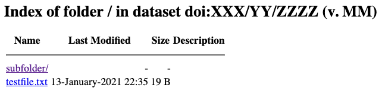
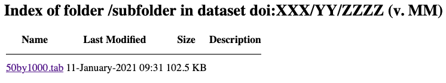

Native API
==========

The Dataverse Software exposes most of its GUI functionality via a REST-based API. This section describes that functionality. Most API endpoints require an API token that can be passed as the ``X-Dataverse-key`` HTTP header or in the URL as the ``key`` query parameter.

.. note:: |CORS| Some API endpoint allow CORS_ (cross-origin resource sharing), which makes them usable from scripts running in web browsers. These endpoints are marked with a *CORS* badge.

.. note:: Bash environment variables shown below. The idea is that you can "export" these environment variables before copying and pasting the commands that use them. For example, you can set ``$SERVER_URL`` by running ``export SERVER_URL="https://demo.dataverse.org"`` in your Bash shell. To check if the environment variable was set properly, you can "echo" it (e.g. ``echo $SERVER_URL``). See also :ref:`curl-examples-and-environment-variables`.

.. _CORS: https://www.w3.org/TR/cors/

.. warning:: The Dataverse Software's API is versioned at the URI - all API calls may include the version number like so: ``http://server-address/api/v1/...``. Omitting the ``v1`` part would default to the latest API version (currently 1). When writing scripts/applications that will be used for a long time, make sure to specify the API version, so they don't break when the API is upgraded.

.. contents:: |toctitle|
    :local:

Dataverse Collections
---------------------

.. _create-dataverse-api:

Create a Dataverse Collection
~~~~~~~~~~~~~~~~~~~~~~~~~~~~~

A Dataverse collection is a container for datasets and other Dataverse collections as explained in the :doc:`/user/dataverse-management` section of the User Guide.

The steps for creating a Dataverse collection are:

- Prepare a JSON file containing the name, description, etc, of the Dataverse collection you'd like to create.
- Figure out the alias or database id of the "parent" Dataverse collection into which you will be creating your new Dataverse collection.
- Execute a curl command or equivalent.

Download :download:`dataverse-complete.json <../_static/api/dataverse-complete.json>` file and modify it to suit your needs. The fields ``name``, ``alias``, and ``dataverseContacts`` are required. The controlled vocabulary for ``dataverseType`` is the following:

- ``DEPARTMENT``
- ``JOURNALS``
- ``LABORATORY``
- ``ORGANIZATIONS_INSTITUTIONS``
- ``RESEARCHERS``
- ``RESEARCH_GROUP``
- ``RESEARCH_PROJECTS``
- ``TEACHING_COURSES``
- ``UNCATEGORIZED``

.. literalinclude:: ../_static/api/dataverse-complete.json

The curl command below assumes you have kept the name "dataverse-complete.json" and that this file is in your current working directory.

Next you need to figure out the alias or database id of the "parent" Dataverse collection into which you will be creating your new Dataverse collection. Out of the box the top level Dataverse collection has an alias of "root" and a database id of "1" but your installation may vary. The easiest way to determine the alias of your root Dataverse collection is to click "Advanced Search" and look at the URL. You may also choose a parent under the root.

.. note:: See :ref:`curl-examples-and-environment-variables` if you are unfamiliar with the use of ``export`` below.

.. code-block:: bash

  export API_TOKEN=xxxxxxxx-xxxx-xxxx-xxxx-xxxxxxxxxxxx
  export SERVER_URL=https://demo.dataverse.org
  export PARENT=root

  curl -H X-Dataverse-key:$API_TOKEN -X POST $SERVER_URL/api/dataverses/$PARENT --upload-file dataverse-complete.json

The fully expanded example above (without environment variables) looks like this:

.. code-block:: bash

  curl -H X-Dataverse-key:xxxxxxxx-xxxx-xxxx-xxxx-xxxxxxxxxxxx -X POST https://demo.dataverse.org/api/dataverses/root --upload-file dataverse-complete.json

You should expect an HTTP 200 response and JSON beginning with "status":"OK" followed by a representation of the newly-created Dataverse collection.

.. _view-dataverse:

View a Dataverse Collection
~~~~~~~~~~~~~~~~~~~~~~~~~~~

|CORS| View a JSON representation of the Dataverse collection identified by ``$id``. ``$id`` can be the database ID of the Dataverse collection, its alias, or the special value ``:root`` for the root Dataverse collection.

To view a published Dataverse collection:

.. code-block:: bash

  export SERVER_URL=https://demo.dataverse.org
  export ID=root

  curl $SERVER_URL/api/dataverses/$ID

The fully expanded example above (without environment variables) looks like this:

.. code-block:: bash

  curl https://demo.dataverse.org/api/dataverses/root

To view an unpublished Dataverse collection:

.. code-block:: bash

  export API_TOKEN=xxxxxxxx-xxxx-xxxx-xxxx-xxxxxxxxxxxx
  export SERVER_URL=https://demo.dataverse.org
  export ID=root

  curl -H X-Dataverse-key:$API_TOKEN $SERVER_URL/api/dataverses/$ID

The fully expanded example above (without environment variables) looks like this:

.. code-block:: bash

  curl -H X-Dataverse-key:xxxxxxxx-xxxx-xxxx-xxxx-xxxxxxxxxxxx https://demo.dataverse.org/api/dataverses/root

Delete a Dataverse Collection
~~~~~~~~~~~~~~~~~~~~~~~~~~~~~

Before you may delete a Dataverse collection you must first delete or move all of its contents elsewhere.

Deletes the Dataverse collection whose database ID or alias is given:

.. code-block:: bash

  export API_TOKEN=xxxxxxxx-xxxx-xxxx-xxxx-xxxxxxxxxxxx
  export SERVER_URL=https://demo.dataverse.org
  export ID=root

  curl -H X-Dataverse-key:$API_TOKEN -X DELETE $SERVER_URL/api/dataverses/$ID

The fully expanded example above (without environment variables) looks like this:

.. code-block:: bash

  curl -H X-Dataverse-key:xxxxxxxx-xxxx-xxxx-xxxx-xxxxxxxxxxxx -X DELETE https://demo.dataverse.org/api/dataverses/root

.. _show-contents-of-a-dataverse-api:

Show Contents of a Dataverse Collection
~~~~~~~~~~~~~~~~~~~~~~~~~~~~~~~~~~~~~~~

|CORS| Lists all the Dataverse collections and datasets directly under a Dataverse collection (direct children only, not recursive) specified by database id or alias. If you pass your API token and have access, unpublished Dataverse collections and datasets will be included in the response. The list will be ordered by database id within type of object. That is, all Dataverse collections will be listed first and ordered by database id, then all datasets will be listed ordered by database id.

.. note:: See :ref:`curl-examples-and-environment-variables` if you are unfamiliar with the use of ``export`` below.

.. code-block:: bash

  export API_TOKEN=xxxxxxxx-xxxx-xxxx-xxxx-xxxxxxxxxxxx
  export SERVER_URL=https://demo.dataverse.org
  export ID=root

  curl -H X-Dataverse-key:$API_TOKEN $SERVER_URL/api/dataverses/$ID/contents

The fully expanded example above (without environment variables) looks like this:

.. code-block:: bash

  curl -H X-Dataverse-key:xxxxxxxx-xxxx-xxxx-xxxx-xxxxxxxxxxxx https://demo.dataverse.org/api/dataverses/root/contents

Report the data (file) size of a Dataverse Collection
~~~~~~~~~~~~~~~~~~~~~~~~~~~~~~~~~~~~~~~~~~~~~~~~~~~~~

Shows the combined size in bytes of all the files uploaded into the Dataverse collection ``id``:

.. code-block:: bash

  export API_TOKEN=xxxxxxxx-xxxx-xxxx-xxxx-xxxxxxxxxxxx
  export SERVER_URL=https://demo.dataverse.org
  export ID=root

  curl -H X-Dataverse-key:$API_TOKEN $SERVER_URL/api/dataverses/$ID/storagesize

The fully expanded example above (without environment variables) looks like this:

.. code-block:: bash

  curl -H X-Dataverse-key:xxxxxxxx-xxxx-xxxx-xxxx-xxxxxxxxxxxx https://demo.dataverse.org/api/dataverses/root/storagesize

The size of published and unpublished files will be summed both in the Dataverse collection specified and beneath all its sub-collections, recursively. 
By default, only the archival files are counted - i.e., the files uploaded by users (plus the tab-delimited versions generated for tabular data files on ingest). If the optional argument ``includeCached=true`` is specified, the API will also add the sizes of all the extra files generated and cached by the Dataverse installation - the resized thumbnail versions for image files, the metadata exports for published datasets, etc. 

List Roles Defined in a Dataverse Collection
~~~~~~~~~~~~~~~~~~~~~~~~~~~~~~~~~~~~~~~~~~~~

All the roles defined directly in the Dataverse collection identified by ``id``:

.. code-block:: bash

  export API_TOKEN=xxxxxxxx-xxxx-xxxx-xxxx-xxxxxxxxxxxx
  export SERVER_URL=https://demo.dataverse.org
  export ID=root

  curl -H X-Dataverse-key:$API_TOKEN $SERVER_URL/api/dataverses/$ID/roles

The fully expanded example above (without environment variables) looks like this:

.. code-block:: bash

  curl -H X-Dataverse-key:xxxxxxxx-xxxx-xxxx-xxxx-xxxxxxxxxxxx https://demo.dataverse.org/api/dataverses/root/roles

List Facets Configured for a Dataverse Collection
~~~~~~~~~~~~~~~~~~~~~~~~~~~~~~~~~~~~~~~~~~~~~~~~~

|CORS| List all the facets for a given Dataverse collection ``id``:

.. code-block:: bash

  export API_TOKEN=xxxxxxxx-xxxx-xxxx-xxxx-xxxxxxxxxxxx
  export SERVER_URL=https://demo.dataverse.org
  export ID=root

  curl -H X-Dataverse-key:$API_TOKEN $SERVER_URL/api/dataverses/$ID/facets

The fully expanded example above (without environment variables) looks like this:

.. code-block:: bash

  curl -H X-Dataverse-key:xxxxxxxx-xxxx-xxxx-xxxx-xxxxxxxxxxxx https://demo.dataverse.org/api/dataverses/root/facets

Set Facets for a Dataverse Collection
~~~~~~~~~~~~~~~~~~~~~~~~~~~~~~~~~~~~~

Assign search facets for a given Dataverse collection identified by ``id``:

.. code-block:: bash

  export API_TOKEN=xxxxxxxx-xxxx-xxxx-xxxx-xxxxxxxxxxxx
  export SERVER_URL=https://demo.dataverse.org
  export ID=root

  curl -H X-Dataverse-key:$API_TOKEN" -X POST $SERVER_URL/api/dataverses/$ID/facets --upload-file dataverse-facets.json

The fully expanded example above (without environment variables) looks like this:

.. code-block:: bash

  curl -H X-Dataverse-key:xxxxxxxx-xxxx-xxxx-xxxx-xxxxxxxxxxxx -X POST https://demo.dataverse.org/api/dataverses/root/facets --upload-file dataverse-facets.json

Where :download:`dataverse-facets.json <../_static/api/dataverse-facets.json>` contains a JSON encoded list of metadata keys (e.g. ``["authorName","authorAffiliation"]``).

List Metadata Block Facets Configured for a Dataverse Collection
~~~~~~~~~~~~~~~~~~~~~~~~~~~~~~~~~~~~~~~~~~~~~~~~~~~~~~~~~~~~~~~~

|CORS| List the metadata block facet configuration with all the metadata block configured for a given Dataverse collection ``id``:

.. code-block:: bash

  export API_TOKEN=xxxxxxxx-xxxx-xxxx-xxxx-xxxxxxxxxxxx
  export SERVER_URL=https://demo.dataverse.org
  export ID=root

  curl -H X-Dataverse-key:$API_TOKEN $SERVER_URL/api/dataverses/$ID/metadatablockfacets

The fully expanded example above (without environment variables) looks like this:

.. code-block:: bash

  curl -H X-Dataverse-key:xxxxxxxx-xxxx-xxxx-xxxx-xxxxxxxxxxxx https://demo.dataverse.org/api/dataverses/root/metadatablockfacets

Set Metadata Block Facets for a Dataverse Collection
~~~~~~~~~~~~~~~~~~~~~~~~~~~~~~~~~~~~~~~~~~~~~~~~~~~~

Sets the metadata blocks that will appear in the ``Dataset Features`` facet category for a given Dataverse collection identified by ``id``.

In order to set or clear the metadata blocks for a collection, you must first :ref:`set the metadata block facet root to true<metadata-block-facet-root-api>`.

To clear the metadata blocks set by a parent collection, submit an empty array (e.g. ``[]``):

.. code-block:: bash

  export API_TOKEN=xxxxxxxx-xxxx-xxxx-xxxx-xxxxxxxxxxxx
  export SERVER_URL=https://demo.dataverse.org
  export ID=root

  curl -H X-Dataverse-key:$API_TOKEN" -X POST -H "Content-type:application/json" $SERVER_URL/api/dataverses/$ID/metadatablockfacets --upload-file metadata-block-facets.json

The fully expanded example above (without environment variables) looks like this:

.. code-block:: bash

  curl -H X-Dataverse-key:xxxxxxxx-xxxx-xxxx-xxxx-xxxxxxxxxxxx -X POST -H "Content-type:application/json" https://demo.dataverse.org/api/dataverses/root/metadatablockfacets --upload-file metadata-block-facets.json

Where :download:`metadata-block-facets.json <../_static/api/metadata-block-facets.json>` contains a JSON encoded list of metadata block names (e.g. ``["socialscience","geospatial"]``). This endpoint supports an empty list (e.g. ``[]``)

.. _metadata-block-facet-root-api:

Configure a Dataverse Collection to Inherit Its Metadata Block Facets from Its Parent
~~~~~~~~~~~~~~~~~~~~~~~~~~~~~~~~~~~~~~~~~~~~~~~~~~~~~~~~~~~~~~~~~~~~~~~~~~~~~~~~~~~~~

Set whether the Dataverse collection is a metadata block facet root, or does it uses its parent metadata block facets. Possible values are ``true`` and ``false`` (both are valid JSON expressions).

When updating the root to false, it will clear any metadata block facets from the collection. When updating to true, it will copy the metadata block facets from the parent collection:

.. code-block:: bash

  export API_TOKEN=xxxxxxxx-xxxx-xxxx-xxxx-xxxxxxxxxxxx
  export SERVER_URL=https://demo.dataverse.org
  export ID=root

  curl -H X-Dataverse-key:$API_TOKEN -X POST -H "Content-type:application/json" $SERVER_URL/api/dataverses/$ID/metadatablockfacets/isRoot -d 'true'

The fully expanded example above (without environment variables) looks like this:

.. code-block:: bash

  curl -H X-Dataverse-key:xxxxxxxx-xxxx-xxxx-xxxx-xxxxxxxxxxxx -X POST -H "Content-type:application/json" https://demo.dataverse.org/api/dataverses/root/metadatablockfacets/isRoot -d 'true'

Create a New Role in a Dataverse Collection
~~~~~~~~~~~~~~~~~~~~~~~~~~~~~~~~~~~~~~~~~~~

Creates a new role under Dataverse collection ``id``. Needs a json file with the role description:

.. code-block:: bash

  export API_TOKEN=xxxxxxxx-xxxx-xxxx-xxxx-xxxxxxxxxxxx
  export SERVER_URL=https://demo.dataverse.org
  export ID=root

  curl -H X-Dataverse-key:$API_TOKEN -X POST $SERVER_URL/api/dataverses/$ID/roles --upload-file roles.json

The fully expanded example above (without environment variables) looks like this:

.. code-block:: bash

  curl -H X-Dataverse-key:xxxxxxxx-xxxx-xxxx-xxxx-xxxxxxxxxxxx -X POST -H "Content-type:application/json" https://demo.dataverse.org/api/dataverses/root/roles --upload-file roles.json

Where ``roles.json`` looks like this::

  {
    "alias": "sys1",
    "name": “Restricted System Role”,
    "description": “A person who may only add datasets.”,
    "permissions": [
      "AddDataset"
    ]
  } 

.. note:: Only a Dataverse installation account with superuser permissions is allowed to create roles in a Dataverse Collection.

.. _list-role-assignments-on-a-dataverse-api:

List Role Assignments in a Dataverse Collection
~~~~~~~~~~~~~~~~~~~~~~~~~~~~~~~~~~~~~~~~~~~~~~~

List all the role assignments at the given Dataverse collection:

.. code-block:: bash

  export API_TOKEN=xxxxxxxx-xxxx-xxxx-xxxx-xxxxxxxxxxxx
  export SERVER_URL=https://demo.dataverse.org
  export ID=root

  curl -H X-Dataverse-key:$API_TOKEN $SERVER_URL/api/dataverses/$ID/assignments

The fully expanded example above (without environment variables) looks like this:

.. code-block:: bash

  curl -H X-Dataverse-key:xxxxxxxx-xxxx-xxxx-xxxx-xxxxxxxxxxxx https://demo.dataverse.org/api/dataverses/root/assignments

Assign Default Role to User Creating a Dataset in a Dataverse Collection
~~~~~~~~~~~~~~~~~~~~~~~~~~~~~~~~~~~~~~~~~~~~~~~~~~~~~~~~~~~~~~~~~~~~~~~~

Assign a default role to a user creating a dataset in a Dataverse collection ``id`` where ``roleAlias`` is the database alias of the role to be assigned:

.. code-block:: bash

  export API_TOKEN=xxxxxxxx-xxxx-xxxx-xxxx-xxxxxxxxxxxx
  export SERVER_URL=https://demo.dataverse.org
  export ID=root
  export ROLE_ALIAS=curator

  curl -H X-Dataverse-key:$API_TOKEN -X PUT $SERVER_URL/api/dataverses/$ID/defaultContributorRole/$ROLE_ALIAS

The fully expanded example above (without environment variables) looks like this:

.. code-block:: bash

  curl -H X-Dataverse-key:xxxxxxxx-xxxx-xxxx-xxxx-xxxxxxxxxxxx -X PUT https://demo.dataverse.org/api/dataverses/root/defaultContributorRole/curator

Note: You may use "none" as the ``ROLE_ALIAS``. This will prevent a user who creates a dataset from having any role on that dataset. It is not recommended for Dataverse collections with human contributors.

.. _assign-role-on-a-dataverse-api:

Assign a New Role on a Dataverse Collection
~~~~~~~~~~~~~~~~~~~~~~~~~~~~~~~~~~~~~~~~~~~

Assigns a new role, based on the POSTed JSON:

.. code-block:: bash

  export API_TOKEN=xxxxxxxx-xxxx-xxxx-xxxx-xxxxxxxxxxxx
  export SERVER_URL=https://demo.dataverse.org
  export ID=root

  curl -H X-Dataverse-key:$API_TOKEN -X POST -H "Content-Type: application/json" $SERVER_URL/api/dataverses/$ID/assignments --upload-file role.json

The fully expanded example above (without environment variables) looks like this:

.. code-block:: bash

  curl -H X-Dataverse-key:xxxxxxxx-xxxx-xxxx-xxxx-xxxxxxxxxxxx -X POST -H "Content-Type: application/json" https://demo.dataverse.org/api/dataverses/root/assignments --upload-file role.json

POSTed JSON example (the content of ``role.json`` file)::

  {
    "assignee": "@uma",
    "role": "curator"
  }

.. _revoke-role-on-a-dataverse-api:

Delete Role Assignment from a Dataverse Collection
~~~~~~~~~~~~~~~~~~~~~~~~~~~~~~~~~~~~~~~~~~~~~~~~~~

Delete the assignment whose id is ``$id``:

.. code-block:: bash

  export API_TOKEN=xxxxxxxx-xxxx-xxxx-xxxx-xxxxxxxxxxxx
  export SERVER_URL=https://demo.dataverse.org
  export ID=root
  export ASSIGNMENT_ID=6

  curl -H X-Dataverse-key:$API_TOKEN -X DELETE $SERVER_URL/api/dataverses/$ID/assignments/$ASSIGNMENT_ID

The fully expanded example above (without environment variables) looks like this:

.. code-block:: bash

  curl -H X-Dataverse-key:xxxxxxxx-xxxx-xxxx-xxxx-xxxxxxxxxxxx -X DELETE https://demo.dataverse.org/api/dataverses/root/assignments/6

List Metadata Blocks Defined on a Dataverse Collection
~~~~~~~~~~~~~~~~~~~~~~~~~~~~~~~~~~~~~~~~~~~~~~~~~~~~~~

|CORS| Get the metadata blocks defined on a Dataverse collection which determine which field are available to authors when they create and edit datasets within that Dataverse collection. This feature is described in :ref:`general-information` section of Dataverse Collection Management of the User Guide.

Please note that an API token is only required if the Dataverse collection has not been published.

.. note:: See :ref:`curl-examples-and-environment-variables` if you are unfamiliar with the use of ``export`` below.

.. code-block:: bash

  export API_TOKEN=xxxxxxxx-xxxx-xxxx-xxxx-xxxxxxxxxxxx
  export SERVER_URL=https://demo.dataverse.org
  export ID=root

  curl -H X-Dataverse-key:$API_TOKEN $SERVER_URL/api/dataverses/$ID/metadatablocks

The fully expanded example above (without environment variables) looks like this:

.. code-block:: bash

  curl -H X-Dataverse-key:xxxxxxxx-xxxx-xxxx-xxxx-xxxxxxxxxxxx https://demo.dataverse.org/api/dataverses/root/metadatablocks

Define Metadata Blocks for a Dataverse Collection
~~~~~~~~~~~~~~~~~~~~~~~~~~~~~~~~~~~~~~~~~~~~~~~~~

You can define the metadata blocks available to authors within a Dataverse collection.

The metadata blocks that are available with a default Dataverse installation are in :download:`define-metadatablocks.json <../_static/api/define-metadatablocks.json>` (also shown below) and you should download this file and edit it to meet your needs. Please note that the "citation" metadata block is required. You must have "EditDataverse" permission on the Dataverse collection.

.. literalinclude:: ../_static/api/define-metadatablocks.json

.. note:: See :ref:`curl-examples-and-environment-variables` if you are unfamiliar with the use of ``export`` below.

.. code-block:: bash

  export API_TOKEN=xxxxxxxx-xxxx-xxxx-xxxx-xxxxxxxxxxxx
  export SERVER_URL=https://demo.dataverse.org
  export ID=root

  curl -H X-Dataverse-key:$API_TOKEN -X POST $SERVER_URL/api/dataverses/$ID/metadatablocks -H \"Content-type:application/json\" --upload-file define-metadatablocks.json

The fully expanded example above (without environment variables) looks like this:

.. code-block:: bash

  curl -H X-Dataverse-key:xxxxxxxx-xxxx-xxxx-xxxx-xxxxxxxxxxxx -X POST -H "Content-type:application/json" --upload-file define-metadatablocks.json https://demo.dataverse.org/api/dataverses/root/metadatablocks

Determine if a Dataverse Collection Inherits Its Metadata Blocks from Its Parent
~~~~~~~~~~~~~~~~~~~~~~~~~~~~~~~~~~~~~~~~~~~~~~~~~~~~~~~~~~~~~~~~~~~~~~~~~~~~~~~~

Get whether the Dataverse collection is a metadata block root, or does it uses its parent blocks:

.. code-block:: bash

  export API_TOKEN=xxxxxxxx-xxxx-xxxx-xxxx-xxxxxxxxxxxx
  export SERVER_URL=https://demo.dataverse.org
  export ID=root

  curl -H X-Dataverse-key:$API_TOKEN $SERVER_URL/api/dataverses/$ID/metadatablocks/isRoot

The fully expanded example above (without environment variables) looks like this:

.. code-block:: bash

  curl -H X-Dataverse-key:xxxxxxxx-xxxx-xxxx-xxxx-xxxxxxxxxxxx https://demo.dataverse.org/api/dataverses/root/metadatablocks/isRoot

Configure a Dataverse Collection to Inherit Its Metadata Blocks from Its Parent
~~~~~~~~~~~~~~~~~~~~~~~~~~~~~~~~~~~~~~~~~~~~~~~~~~~~~~~~~~~~~~~~~~~~~~~~~~~~~~~

Set whether the Dataverse collection is a metadata block root, or does it uses its parent blocks. Possible
values are ``true`` and ``false`` (both are valid JSON expressions):

.. code-block:: bash

  export API_TOKEN=xxxxxxxx-xxxx-xxxx-xxxx-xxxxxxxxxxxx
  export SERVER_URL=https://demo.dataverse.org
  export ID=root

  curl -H X-Dataverse-key:$API_TOKEN -X PUT $SERVER_URL/api/dataverses/$ID/metadatablocks/isRoot

The fully expanded example above (without environment variables) looks like this:

.. code-block:: bash

  curl -H X-Dataverse-key:xxxxxxxx-xxxx-xxxx-xxxx-xxxxxxxxxxxx -X PUT https://demo.dataverse.org/api/dataverses/root/metadatablocks/isRoot

.. note:: Previous endpoints ``$SERVER/api/dataverses/$id/metadatablocks/:isRoot`` and ``POST http://$SERVER/api/dataverses/$id/metadatablocks/:isRoot?key=$apiKey`` are deprecated, but supported.

.. _create-dataset-command: 

Create a Dataset in a Dataverse Collection
~~~~~~~~~~~~~~~~~~~~~~~~~~~~~~~~~~~~~~~~~~

A dataset is a container for files as explained in the :doc:`/user/dataset-management` section of the User Guide.

To create a dataset, you must supply a JSON file that contains at least the following required metadata fields:

- Title
- Author Name
- Point of Contact Email
- Description Text
- Subject

As a starting point, you can download :download:`dataset-finch1.json <../../../../scripts/search/tests/data/dataset-finch1.json>` and modify it to meet your needs. (:download:`dataset-create-new-all-default-fields.json <../../../../scripts/api/data/dataset-finch1_fr.json>` is a variant of this file that includes setting the metadata language (see :ref:`:MetadataLanguages`) to French (fr). In addition to this minimal example, you can download :download:`dataset-create-new-all-default-fields.json <../../../../scripts/api/data/dataset-create-new-all-default-fields.json>` which populates all of the metadata fields that ship with a Dataverse installation.)

The curl command below assumes you have kept the name "dataset-finch1.json" and that this file is in your current working directory.

Next you need to figure out the alias or database id of the "parent" Dataverse collection into which you will be creating your new dataset. Out of the box the top level Dataverse collection has an alias of "root" and a database id of "1" but your installation may vary. The easiest way to determine the alias of your root Dataverse collection is to click "Advanced Search" and look at the URL. You may also choose a parent Dataverse collection under the root Dataverse collection.

.. note:: See :ref:`curl-examples-and-environment-variables` if you are unfamiliar with the use of ``export`` below.

.. code-block:: bash

  export API_TOKEN=xxxxxxxx-xxxx-xxxx-xxxx-xxxxxxxxxxxx
  export PARENT=root
  export SERVER_URL=https://demo.dataverse.org

  curl -H X-Dataverse-key:$API_TOKEN -X POST "$SERVER_URL/api/dataverses/$PARENT/datasets" --upload-file dataset-finch1.json -H 'Content-type:application/json'

The fully expanded example above (without the environment variables) looks like this:

.. code-block:: bash

  curl -H "X-Dataverse-key:xxxxxxxx-xxxx-xxxx-xxxx-xxxxxxxxxxxx" -X POST "https://demo.dataverse.org/api/dataverses/root/datasets" --upload-file "dataset-finch1.json" -H 'Content-type:application/json'

You should expect an HTTP 200 ("OK") response and JSON indicating the database ID and Persistent ID (PID such as DOI or Handle) that has been assigned to your newly created dataset.

.. note:: Only a Dataverse installation account with superuser permissions is allowed to include files when creating a dataset via this API. Adding files this way only adds their file metadata to the database, you will need to manually add the physical files to the file system.

Import a Dataset into a Dataverse Collection
~~~~~~~~~~~~~~~~~~~~~~~~~~~~~~~~~~~~~~~~~~~~

.. note:: This action requires a Dataverse installation account with super-user permissions.

To import a dataset with an existing persistent identifier (PID), the dataset's metadata should be prepared in Dataverse installation's native JSON format. The PID is provided as a parameter at the URL. The following line imports a dataset with the PID ``PERSISTENT_IDENTIFIER`` to the Dataverse installation, and then releases it:

.. code-block:: bash

  export API_TOKEN=xxxxxxxx-xxxx-xxxx-xxxx-xxxxxxxxxxxx
  export SERVER_URL=https://demo.dataverse.org
  export DATAVERSE_ID=root
  export PERSISTENT_IDENTIFIER=doi:ZZ7/MOSEISLEYDB94

  curl -H X-Dataverse-key:$API_TOKEN -X POST $SERVER_URL/api/dataverses/$DATAVERSE_ID/datasets/:import?pid=$PERSISTENT_IDENTIFIER&release=yes --upload-file dataset.json

The fully expanded example above (without environment variables) looks like this:

.. code-block:: bash

    curl -H X-Dataverse-key:xxxxxxxx-xxxx-xxxx-xxxx-xxxxxxxxxxxx -X POST https://demo.dataverse.org/api/dataverses/root/datasets/:import?pid=doi:ZZ7/MOSEISLEYDB94&release=yes --upload-file dataset.json

The ``pid`` parameter holds a persistent identifier (such as a DOI or Handle). The import will fail if no PID is provided, or if the provided PID fails validation.

The optional ``release`` parameter tells the Dataverse installation to immediately publish the dataset. If the parameter is changed to ``no``, the imported dataset will remain in ``DRAFT`` status.

The JSON format is the same as that supported by the native API's :ref:`create dataset command<create-dataset-command>`, although it also allows packages.  For example:

.. literalinclude:: ../../../../scripts/api/data/dataset-package-files.json

Before calling the API, make sure the data files referenced by the ``POST``\ ed JSON are placed in the dataset directory with filenames matching their specified storage identifiers. In installations using POSIX storage, these files must be made readable by the app server user.

.. tip:: If possible, it's best to avoid spaces and special characters in the storage identifier in order to avoid potential portability problems. The storage identifier corresponds with the filesystem name (or bucket identifier) of the data file, so these characters may cause unpredictability with filesystem tools.

.. warning:: 
  
  * This API does not cover staging files (with correct contents, checksums, sizes, etc.) in the corresponding places in the Dataverse installation's filestore.
  * This API endpoint does not support importing *files'* persistent identifiers.
  * A Dataverse installation can import datasets with a valid PID that uses a different protocol or authority than said server is configured for. However, the server will not update the PID metadata on subsequent update and publish actions.

Import a Dataset into a Dataverse Installation with a DDI file
~~~~~~~~~~~~~~~~~~~~~~~~~~~~~~~~~~~~~~~~~~~~~~~~~~~~~~~~~~~~~~

.. note:: This action requires a Dataverse installation account with super-user permissions.

To import a dataset with an existing persistent identifier (PID), you have to provide the PID as a parameter at the URL. The following line imports a dataset with the PID ``PERSISTENT_IDENTIFIER`` to the Dataverse installation, and then releases it:

.. code-block:: bash

  export API_TOKEN=xxxxxxxx-xxxx-xxxx-xxxx-xxxxxxxxxxxx
  export SERVER_URL=https://demo.dataverse.org
  export DATAVERSE_ID=root
  export PERSISTENT_IDENTIFIER=doi:ZZ7/MOSEISLEYDB94

  curl -H X-Dataverse-key:$API_TOKEN -X POST $SERVER_URL/api/dataverses/$DATAVERSE_ID/datasets/:importddi?pid=$PERSISTENT_IDENTIFIER&release=yes --upload-file ddi_dataset.xml

The fully expanded example above (without environment variables) looks like this:

.. code-block:: bash

  curl -H X-Dataverse-key:xxxxxxxx-xxxx-xxxx-xxxx-xxxxxxxxxxxx -X POST https://demo.dataverse.org/api/dataverses/root/datasets/:importddi?pid=doi:ZZ7/MOSEISLEYDB94&release=yes --upload-file ddi_dataset.xml

The optional ``pid`` parameter holds a persistent identifier (such as a DOI or Handle). The import will fail if the provided PID fails validation.

The optional ``release`` parameter tells the Dataverse installation to immediately publish the dataset. If the parameter is changed to ``no``, the imported dataset will remain in ``DRAFT`` status.

The file is a DDI XML file. A sample DDI XML file may be downloaded here: :download:`ddi_dataset.xml <../_static/api/ddi_dataset.xml>`

Note that DDI XML does not have a field that corresponds to the "Subject" field in Dataverse. Therefore the "Import DDI" API endpoint populates the "Subject" field with ``N/A``. To update the "Subject" field one will need to call the :ref:`edit-dataset-metadata-api` API with a JSON file that contains an update to "Subject" such as :download:`subject-update-metadata.json <../_static/api/subject-update-metadata.json>`. Alternatively, the web interface can be used to add a subject.

.. warning::

  * This API does not handle files related to the DDI file.
  * A Dataverse installation can import datasets with a valid PID that uses a different protocol or authority than said server is configured for. However, the server will not update the PID metadata on subsequent update and publish actions.

.. _publish-dataverse-api:

Publish a Dataverse Collection
~~~~~~~~~~~~~~~~~~~~~~~~~~~~~~

In order to publish a Dataverse collection, you must know either its "alias" (which the GUI calls an "identifier") or its database ID.

.. note:: See :ref:`curl-examples-and-environment-variables` if you are unfamiliar with the use of ``export`` below.

.. code-block:: bash

  export API_TOKEN=xxxxxxxx-xxxx-xxxx-xxxx-xxxxxxxxxxxx
  export SERVER_URL=https://demo.dataverse.org
  export ID=root

  curl -H X-Dataverse-key:$API_TOKEN -X POST $SERVER_URL/api/dataverses/$ID/actions/:publish

The fully expanded example above (without environment variables) looks like this:

.. code-block:: bash

  curl -H X-Dataverse-key:xxxxxxxx-xxxx-xxxx-xxxx-xxxxxxxxxxxx -X POST https://demo.dataverse.org/api/dataverses/root/actions/:publish  

You should expect a 200 ("OK") response and JSON output.

.. _download-guestbook-api:

Retrieve Guestbook Responses for a Dataverse Collection
~~~~~~~~~~~~~~~~~~~~~~~~~~~~~~~~~~~~~~~~~~~~~~~~~~~~~~~

For more about guestbooks, see :ref:`dataset-guestbooks` in the User Guide.

In order to retrieve the Guestbook Responses for a Dataverse collection, you must know either its "alias" (which the GUI calls an "identifier") or its database ID. If the Dataverse collection has more than one guestbook you may provide the id of a single guestbook as an optional parameter. If no guestbook id is provided the results returned will be the same as pressing the "Download All Responses" button on the Manage Dataset Guestbook page. If the guestbook id is provided then only those responses from that guestbook will be included.  The FILENAME parameter is optional, and if it is not included, the responses will be displayed in the console.

.. note:: See :ref:`curl-examples-and-environment-variables` if you are unfamiliar with the use of ``export`` below.

.. code-block:: bash

  export API_TOKEN=xxxxxxxx-xxxx-xxxx-xxxx-xxxxxxxxxxxx
  export SERVER_URL=https://demo.dataverse.org
  export ID=root
  export GUESTBOOK_ID=1
  export FILENAME=myResponses.csv 

  curl -H  X-Dataverse-key:$API_TOKEN $SERVER_URL/api/dataverses/$ID/guestbookResponses?guestbookId=$GUESTBOOK_ID -o $FILENAME

The fully expanded example above (without environment variables) looks like this:

.. code-block:: bash

  curl -H X-Dataverse-key:xxxxxxxx-xxxx-xxxx-xxxx-xxxxxxxxxxxx https://demo.dataverse.org/api/dataverses/root/guestbookResponses?guestbookId=1 -o myResponses.csv

Datasets
--------

**Note** Creation of new datasets is done with a ``POST`` onto a Dataverse collection. See the Dataverse Collections section above.

**Note** In all commands below, dataset versions can be referred to as:

* ``:draft``  the draft version, if any
* ``:latest`` either a draft (if exists) or the latest published version.
* ``:latest-published`` the latest published version
* ``x.y`` a specific version, where ``x`` is the major version number and ``y`` is the minor version number.
* ``x`` same as ``x.0``

Get JSON Representation of a Dataset
~~~~~~~~~~~~~~~~~~~~~~~~~~~~~~~~~~~~

.. note:: Datasets can be accessed using persistent identifiers. This is done by passing the constant ``:persistentId`` where the numeric id of the dataset is expected, and then passing the actual persistent id as a query parameter with the name ``persistentId``.

Example: Getting the dataset whose DOI is *10.5072/FK2/J8SJZB*:

.. code-block:: bash

  export SERVER_URL=https://demo.dataverse.org
  export PERSISTENT_IDENTIFIER=doi:10.5072/FK2/J8SJZB

  curl -H "X-Dataverse-key:$API_TOKEN" $SERVER_URL/api/datasets/:persistentId/?persistentId=$PERSISTENT_IDENTIFIER

The fully expanded example above (without environment variables) looks like this:

.. code-block:: bash

  curl -H "X-Dataverse-key:$API_TOKEN" https://demo.dataverse.org/api/datasets/:persistentId/?persistentId=doi:10.5072/FK2/J8SJZB

Getting its draft version:

.. code-block:: bash

  export SERVER_URL=https://demo.dataverse.org
  export PERSISTENT_IDENTIFIER=doi:10.5072/FK2/J8SJZB

  curl -H "X-Dataverse-key:$API_TOKEN" http://$SERVER/api/datasets/:persistentId/versions/:draft?persistentId=$PERSISTENT_IDENTIFIER

The fully expanded example above (without environment variables) looks like this:

.. code-block:: bash

  curl -H "X-Dataverse-key:$API_TOKEN" https://demo.dataverse.org/api/datasets/:persistentId/versions/:draft?persistentId=doi:10.5072/FK2/J8SJZB

|CORS| Show the dataset whose id is passed:

.. code-block:: bash

  export SERVER_URL=https://demo.dataverse.org
  export ID=408730

  curl $SERVER_URL/api/datasets/$ID

The fully expanded example above (without environment variables) looks like this:

.. code-block:: bash

  curl https://demo.dataverse.org/api/datasets/408730

The dataset id can be extracted from the response retrieved from the API which uses the persistent identifier (``/api/datasets/:persistentId/?persistentId=$PERSISTENT_IDENTIFIER``).

List Versions of a Dataset
~~~~~~~~~~~~~~~~~~~~~~~~~~

|CORS| List versions of the dataset:

.. code-block:: bash

  export SERVER_URL=https://demo.dataverse.org
  export ID=24

  curl $SERVER_URL/api/datasets/$ID/versions

The fully expanded example above (without environment variables) looks like this:

.. code-block:: bash

  curl https://demo.dataverse.org/api/datasets/24/versions

It returns a list of versions with their metadata, and file list:

.. code-block:: bash

  {
    "status": "OK",
    "data": [
      {
        "id": 7,
        "datasetId": 24,
        "datasetPersistentId": "doi:10.5072/FK2/U6AEZM",
        "storageIdentifier": "file://10.5072/FK2/U6AEZM",
        "versionNumber": 2,
        "versionMinorNumber": 0,
        "versionState": "RELEASED",
        "lastUpdateTime": "2015-04-20T09:58:35Z",
        "releaseTime": "2015-04-20T09:58:35Z",
        "createTime": "2015-04-20T09:57:32Z",
        "license": {
          "name": "CC0 1.0",
          "uri": "http://creativecommons.org/publicdomain/zero/1.0"
        },
        "termsOfAccess": "You need to request for access.",
        "fileAccessRequest": true,
        "metadataBlocks": {...},
        "files": [...]
      },
      {
        "id": 6,
        "datasetId": 24,
        "datasetPersistentId": "doi:10.5072/FK2/U6AEZM",
        "storageIdentifier": "file://10.5072/FK2/U6AEZM",
        "versionNumber": 1,
        "versionMinorNumber": 0,
        "versionState": "RELEASED",
        "UNF": "UNF:6:y4dtFxWhBaPM9K/jlPPuqg==",
        "lastUpdateTime": "2015-04-20T09:56:34Z",
        "releaseTime": "2015-04-20T09:56:34Z",
        "createTime": "2015-04-20T09:43:45Z",
        "license": {
          "name": "CC0 1.0",
          "uri": "http://creativecommons.org/publicdomain/zero/1.0"
        },
        "termsOfAccess": "You need to request for access.",
        "fileAccessRequest": true,
        "metadataBlocks": {...},
        "files": [...]
      }
    ]
  }

Get Version of a Dataset
~~~~~~~~~~~~~~~~~~~~~~~~

|CORS| Show a version of the dataset. The output includes any metadata blocks the dataset might have:

.. code-block:: bash

  export SERVER_URL=https://demo.dataverse.org
  export ID=24
  export VERSION=1.0

  curl $SERVER_URL/api/datasets/$ID/versions/$VERSION

The fully expanded example above (without environment variables) looks like this:

.. code-block:: bash

  curl https://demo.dataverse.org/api/datasets/24/versions/1.0

.. _export-dataset-metadata-api:

Export Metadata of a Dataset in Various Formats
~~~~~~~~~~~~~~~~~~~~~~~~~~~~~~~~~~~~~~~~~~~~~~~

|CORS| Export the metadata of the current published version of a dataset in various formats.

See also :ref:`batch-exports-through-the-api` and the note below:

.. code-block:: bash

  export SERVER_URL=https://demo.dataverse.org
  export PERSISTENT_IDENTIFIER=doi:10.5072/FK2/J8SJZB
  export METADATA_FORMAT=ddi

  curl $SERVER_URL/api/datasets/export?exporter=$METADATA_FORMAT&persistentId=PERSISTENT_IDENTIFIER

The fully expanded example above (without environment variables) looks like this:

.. code-block:: bash

  curl https://demo.dataverse.org/api/datasets/export?exporter=ddi&persistentId=doi:10.5072/FK2/J8SJZB

.. note:: Supported exporters (export formats) are ``ddi``, ``oai_ddi``, ``dcterms``, ``oai_dc``, ``schema.org`` , ``OAI_ORE`` , ``Datacite``, ``oai_datacite`` and ``dataverse_json``. Descriptive names can be found under :ref:`metadata-export-formats` in the User Guide.

Schema.org JSON-LD
^^^^^^^^^^^^^^^^^^

Please note that the ``schema.org`` format has changed in backwards-incompatible ways after Dataverse Software version 4.9.4:

- "description" was a single string and now it is an array of strings.
- "citation" was an array of strings and now it is an array of objects.

Both forms are valid according to Google's Structured Data Testing Tool at https://search.google.com/structured-data/testing-tool . (This tool will report "The property affiliation is not recognized by Google for an object of type Thing" and this known issue is being tracked at https://github.com/IQSS/dataverse/issues/5029 .) Schema.org JSON-LD is an evolving standard that permits a great deal of flexibility. For example, https://schema.org/docs/gs.html#schemaorg_expected indicates that even when objects are expected, it's ok to just use text. As with all metadata export formats, we will try to keep the Schema.org JSON-LD format your Dataverse installation emits backward-compatible to made integrations more stable, despite the flexibility that's afforded by the standard.

List Files in a Dataset
~~~~~~~~~~~~~~~~~~~~~~~

|CORS| Lists all the file metadata, for the given dataset and version:

.. code-block:: bash

  export SERVER_URL=https://demo.dataverse.org
  export ID=24
  export VERSION=1.0

  curl $SERVER_URL/api/datasets/$ID/versions/$VERSION/files

The fully expanded example above (without environment variables) looks like this:

.. code-block:: bash
 
  curl https://demo.dataverse.org/api/datasets/24/versions/1.0/files

View Dataset Files and Folders as a Directory Index
~~~~~~~~~~~~~~~~~~~~~~~~~~~~~~~~~~~~~~~~~~~~~~~~~~~

|CORS| Provides a *crawlable* view of files and folders within the given dataset and version:

.. code-block:: bash

  curl $SERVER_URL/api/datasets/${ID}/dirindex/
  # or
  curl ${SERVER_URL}/api/datasets/:persistentId/dirindex?persistentId=doi:${PERSISTENT_ID}

Optional parameters:

* ``folder`` - A subfolder within the dataset (default: top-level view of the dataset)
* ``version`` - Specifies the version (default: latest published version)
* ``original=true`` - Download original versions of ingested tabular files. 
  
This API outputs a simple html listing, based on the standard Apache
directory index, with Access API download links for individual files,
and recursive calls to the API above for sub-folders.

Using this API, ``wget --recursive`` (or a similar crawling client) can
be used to download all the files in a dataset, preserving the file
names and folder structure; without having to use the download-as-zip
API. In addition to being faster (zipping is a relatively
resource-intensive operation on the server side), this process can be
restarted if interrupted (with ``wget --continue`` or equivalent) -
unlike zipped multi-file downloads that always have to start from the
beginning.

On a system that uses S3 with download redirects, the individual file
downloads will be handled by S3 directly, without having to be proxied
through the Dataverse application.

For example, if you have a dataset version with 2 files, one with the folder named "subfolder":

|image1|

or, as viewed as a tree on the dataset page:

|image2|

.. |image2| image:: ./img/dataset_page_tree_view.png

The output of the API for the top-level folder (``/api/datasets/{dataset}/dirindex/``) will be as follows:

|image3|

with the underlying html source:

.. code-block:: html

    <!DOCTYPE HTML PUBLIC "-//W3C//DTD HTML 3.2 Final//EN">
    <html><head><title>Index of folder /</title></head>
    <body><h1>Index of folder / in dataset doi:XXX/YY/ZZZZ (v. MM)</h1>
    <table>
    <tr><th>Name</th><th>Last Modified</th><th>Size</th><th>Description</th></tr>
    <tr><th colspan="4">
</th></tr>
    <tr><td><a href="/api/datasets/NNNN/dirindex/?folder=subfolder">subfolder/</a></td><td align="right"> - </td><td align="right"> - </td><td align="right">&nbsp;</td></tr>
    <tr><td><a href="/api/access/datafile/KKKK">testfile.txt</a></td><td align="right">13-January-2021 22:35</td><td align="right">19 B</td><td align="right">&nbsp;</td></tr>
    </table></body></html>

The ``/dirindex/?folder=subfolder`` link above will produce the following view:

|image4|

with the html source as follows:

.. code-block:: html

    <!DOCTYPE HTML PUBLIC "-//W3C//DTD HTML 3.2 Final//EN">
    <html><head><title>Index of folder /subfolder</title></head>
    <body><h1>Index of folder /subfolder in dataset doi:XXX/YY/ZZZZ (v. MM)</h1>
    <table>
    <tr><th>Name</th><th>Last Modified</th><th>Size</th><th>Description</th></tr>
    <tr><th colspan="4">
</th></tr>
    <tr><td><a href="/api/access/datafile/subfolder/LLLL">50by1000.tab</a></td><td align="right">11-January-2021 09:31</td><td align="right">102.5 KB</td><td align="right">&nbsp;</td></tr>
    </table></body></html>

An example of a ``wget`` command line for crawling ("recursive downloading") of the files and folders in a dataset: 

.. code-block:: bash

  wget -r -e robots=off -nH --cut-dirs=3 --content-disposition https://demo.dataverse.org/api/datasets/${ID}/dirindex/
  # or
  wget -r -e robots=off -nH --cut-dirs=3 --content-disposition https://demo.dataverse.org/api/datasets/:persistentId/dirindex?persistentId=doi:${PERSISTENT_ID}

.. note:: In addition to the files and folders in the dataset, the command line above will also save the directory index of each folder, in a separate folder "dirindex".

List All Metadata Blocks for a Dataset
~~~~~~~~~~~~~~~~~~~~~~~~~~~~~~~~~~~~~~

|CORS| Lists all the metadata blocks and their content, for the given dataset and version:

.. code-block:: bash

  export SERVER_URL=https://demo.dataverse.org
  export ID=24
  export VERSION=1.0

  curl $SERVER_URL/api/datasets/$ID/versions/$VERSION/metadata

The fully expanded example above (without environment variables) looks like this:

.. code-block:: bash

  curl https://demo.dataverse.org/api/datasets/24/versions/1.0/metadata

List Single Metadata Block for a Dataset
~~~~~~~~~~~~~~~~~~~~~~~~~~~~~~~~~~~~~~~~

|CORS| Lists the metadata block named `METADATA_BLOCK`, for the given dataset and version:

.. code-block:: bash

  export SERVER_URL=https://demo.dataverse.org
  export ID=24
  export VERSION=1.0
  export METADATA_BLOCK=citation

  curl $SERVER_URL/api/datasets/$ID/versions/$VERSION/metadata/$METADATA_BLOCK

The fully expanded example above (without environment variables) looks like this:

.. code-block:: bash

  curl https://demo.dataverse.org/api/datasets/24/versions/1.0/metadata/citation

Update Metadata For a Dataset
~~~~~~~~~~~~~~~~~~~~~~~~~~~~~

Updates the metadata for a dataset. If a draft of the dataset already exists, the metadata of that draft is overwritten; otherwise, a new draft is created with this metadata.

You must download a JSON representation of the dataset, edit the JSON you download, and then send the updated JSON to the Dataverse installation.

For example, after making your edits, your JSON file might look like :download:`dataset-update-metadata.json <../_static/api/dataset-update-metadata.json>` which you would send to the Dataverse installation like this:

.. code-block:: bash

  export API_TOKEN=xxxxxxxx-xxxx-xxxx-xxxx-xxxxxxxxxxxx
  export SERVER_URL=https://demo.dataverse.org
  export PERSISTENT_IDENTIFIER=doi:10.5072/FK2/BCCP9Z

  curl -H "X-Dataverse-key: $API_TOKEN" -X PUT $SERVER_URL/api/datasets/:persistentId/versions/:draft?persistentId=$PERSISTENT_IDENTIFIER --upload-file dataset-update-metadata.json

The fully expanded example above (without environment variables) looks like this:

.. code-block:: bash

  curl -H "X-Dataverse-key: xxxxxxxx-xxxx-xxxx-xxxx-xxxxxxxxxxxx" -X PUT https://demo.dataverse.org/api/datasets/:persistentId/versions/:draft?persistentId=doi:10.5072/FK2/BCCP9Z --upload-file dataset-update-metadata.json

Note that in the example JSON file above, there is a single JSON object with ``metadataBlocks`` as a key. When you download a representation of your dataset in JSON format, the ``metadataBlocks`` object you need is nested inside another object called ``datasetVersion``. To extract just the ``metadataBlocks`` key when downloading a JSON representation, you can use a tool such as ``jq`` like this:

.. code-block:: bash

  export API_TOKEN=xxxxxxxx-xxxx-xxxx-xxxx-xxxxxxxxxxxx
  export SERVER_URL=https://demo.dataverse.org
  export PERSISTENT_IDENTIFIER=doi:10.5072/FK2/BCCP9Z

  curl -H "X-Dataverse-key: $API_TOKEN" $SERVER_URL/api/datasets/:persistentId/versions/:latest?persistentId=$PERSISTENT_IDENTIFIER | jq '.data | {metadataBlocks: .metadataBlocks}' > dataset-update-metadata.json

The fully expanded example above (without environment variables) looks like this:

.. code-block:: bash

  curl -H "X-Dataverse-key: xxxxxxxx-xxxx-xxxx-xxxx-xxxxxxxxxxxx" https://demo.dataverse.org/api/datasets/:persistentId/versions/:latest?persistentId=doi:10.5072/FK2/BCCP9Z | jq '.data | {metadataBlocks: .metadataBlocks}' > dataset-update-metadata.json

Now that the resulting JSON file only contains the ``metadataBlocks`` key, you can edit the JSON such as with ``vi`` in the example below::

    vi dataset-update-metadata.json

Now that you've made edits to the metadata in your JSON file, you can send it to a Dataverse installation as described above.

.. _edit-dataset-metadata-api:

Edit Dataset Metadata
~~~~~~~~~~~~~~~~~~~~~

Alternatively to replacing an entire dataset version with its JSON representation you may add data to dataset fields that are blank or accept multiple values with the following:

.. code-block:: bash

  export API_TOKEN=xxxxxxxx-xxxx-xxxx-xxxx-xxxxxxxxxxxx
  export SERVER_URL=https://demo.dataverse.org
  export PERSISTENT_IDENTIFIER=doi:10.5072/FK2/BCCP9Z

  curl -H "X-Dataverse-key: $API_TOKEN" -X PUT $SERVER_URL/api/datasets/:persistentId/editMetadata/?persistentId=$PERSISTENT_IDENTIFIER --upload-file dataset-add-metadata.json

The fully expanded example above (without environment variables) looks like this:

.. code-block:: bash

  curl -H "X-Dataverse-key: xxxxxxxx-xxxx-xxxx-xxxx-xxxxxxxxxxxx" -X PUT https://demo.dataverse.org/api/datasets/:persistentId/editMetadata/?persistentId=doi:10.5072/FK2/BCCP9Z --upload-file dataset-add-metadata.json

You may also replace existing metadata in dataset fields with the following (adding the parameter replace=true):

.. code-block:: bash

  export API_TOKEN=xxxxxxxx-xxxx-xxxx-xxxx-xxxxxxxxxxxx
  export SERVER_URL=https://demo.dataverse.org
  export PERSISTENT_IDENTIFIER=doi:10.5072/FK2/BCCP9Z

  curl -H "X-Dataverse-key: $API_TOKEN" -X PUT $SERVER_URL/api/datasets/:persistentId/editMetadata?persistentId=$PERSISTENT_IDENTIFIER&replace=true --upload-file dataset-update-metadata.json

The fully expanded example above (without environment variables) looks like this:

.. code-block:: bash

  curl -H "X-Dataverse-key: xxxxxxxx-xxxx-xxxx-xxxx-xxxxxxxxxxxx" -X PUT https://demo.dataverse.org/api/datasets/:persistentId/editMetadata/?persistentId=doi:10.5072/FK2/BCCP9Z&replace=true --upload-file dataset-update-metadata.json

For these edits your JSON file need only include those dataset fields which you would like to edit. A sample JSON file may be downloaded here: :download:`dataset-edit-metadata-sample.json <../_static/api/dataset-edit-metadata-sample.json>` 

Delete Dataset Metadata
~~~~~~~~~~~~~~~~~~~~~~~

You may delete some of the metadata of a dataset version by supplying a file with a JSON representation of dataset fields that you would like to delete with the following:

.. code-block:: bash

  export API_TOKEN=xxxxxxxx-xxxx-xxxx-xxxx-xxxxxxxxxxxx
  export SERVER_URL=https://demo.dataverse.org
  export PERSISTENT_IDENTIFIER=doi:10.5072/FK2/BCCP9Z

  curl -H "X-Dataverse-key: $API_TOKEN" -X PUT $SERVER_URL/api/datasets/:persistentId/deleteMetadata/?persistentId=$PERSISTENT_IDENTIFIER --upload-file dataset-delete-author-metadata.json

The fully expanded example above (without environment variables) looks like this:

.. code-block:: bash

  curl -H "X-Dataverse-key: xxxxxxxx-xxxx-xxxx-xxxx-xxxxxxxxxxxx" -X PUT https://demo.dataverse.org/api/datasets/:persistentId/deleteMetadata/?persistentId=doi:10.5072/FK2/BCCP9Z --upload-file dataset-delete-author-metadata.json

For these deletes your JSON file must include an exact match of those dataset fields which you would like to delete. A sample JSON file may be downloaded here: :download:`dataset-delete-author-metadata.json <../_static/api/dataset-delete-author-metadata.json>` 

.. _publish-dataset-api:

Publish a Dataset
~~~~~~~~~~~~~~~~~

When publishing a dataset it's good to be aware of the Dataverse Software's versioning system, which is described in the :doc:`/user/dataset-management` section of the User Guide.

If this is the first version of the dataset, its version number will be set to ``1.0``. Otherwise, the new dataset version number is determined by the most recent version number and the ``type`` parameter. Passing ``type=minor`` increases the minor version number (2.3 is updated to 2.4). Passing ``type=major`` increases the major version number (2.3 is updated to 3.0). (Superusers can pass ``type=updatecurrent`` to update metadata without changing the version number.)

This call also supports an optional boolean query parameter: ``assureIsIndexed``. If true, the call will fail with a 409 ("CONFLICT") response if the dataset is awaiting re-indexing. If indexing occurs during publishing it could cause the publish request to fail, after a 202 response has been received. Using this parameter allows the caller to wait for indexing to occur and avoid this possibility. It is most useful in situations where edits are made immediately before publication.

.. note:: See :ref:`curl-examples-and-environment-variables` if you are unfamiliar with the use of ``export`` below.

.. code-block:: bash

  export API_TOKEN=xxxxxxxx-xxxx-xxxx-xxxx-xxxxxxxxxxxx
  export SERVER_URL=https://demo.dataverse.org
  export PERSISTENT_ID=doi:10.5072/FK2/J8SJZB
  export MAJOR_OR_MINOR=major

  curl -H "X-Dataverse-key: $API_TOKEN" -X POST "$SERVER_URL/api/datasets/:persistentId/actions/:publish?persistentId=$PERSISTENT_ID&type=$MAJOR_OR_MINOR"

The fully expanded example above (without environment variables) looks like this:

.. code-block:: bash

  curl -H "X-Dataverse-key: xxxxxxxx-xxxx-xxxx-xxxx-xxxxxxxxxxxx" -X POST "https://demo.dataverse.org/api/datasets/:persistentId/actions/:publish?persistentId=doi:10.5072/FK2/J8SJZB&type=major"

The quotes around the URL are required because there is more than one query parameter separated by an ampersand (``&``), which has special meaning to Unix shells such as Bash. Putting the ``&`` in quotes ensures that "type" is interpreted as one of the query parameters.

You should expect JSON output and a 200 ("OK") response in most cases. If you receive a 202 ("ACCEPTED") response, this is normal for installations that have workflows configured. Workflows are described in the :doc:`/developers/workflows` section of the Developer Guide. A 409 ("CONFLICT") response is also possible if you set ``assureIsIndexed=true``. (In this case, one could then repeat the call until a 200/202 response is sent.)

.. note:: POST should be used to publish a dataset. GET is supported for backward compatibility but is deprecated and may be removed: https://github.com/IQSS/dataverse/issues/2431

Delete Dataset Draft
~~~~~~~~~~~~~~~~~~~~

Deletes the draft version of dataset ``$ID``. Only the draft version can be deleted:

.. code-block:: bash

  export API_TOKEN=xxxxxxxx-xxxx-xxxx-xxxx-xxxxxxxxxxxx
  export SERVER_URL=https://demo.dataverse.org
  export ID=24

  curl -H "X-Dataverse-key: $API_TOKEN" -X DELETE $SERVER_URL/api/datasets/$ID/versions/:draft

The fully expanded example above (without environment variables) looks like this:

.. code-block:: bash

  curl -H "X-Dataverse-key: xxxxxxxx-xxxx-xxxx-xxxx-xxxxxxxxxxxx" -X DELETE https://demo.dataverse.org/api/datasets/24/versions/:draft

Set Citation Date Field Type for a Dataset
~~~~~~~~~~~~~~~~~~~~~~~~~~~~~~~~~~~~~~~~~~

Sets the dataset citation date field type for a given dataset. ``:publicationDate`` is the default.
Note that the dataset citation date field type must be a date field.

.. code-block:: bash

  export API_TOKEN=xxxxxxxx-xxxx-xxxx-xxxx-xxxxxxxxxxxx
  export SERVER_URL=https://demo.dataverse.org
  export PERSISTENT_IDENTIFIER=doi:10.5072/FK2/J8SJZB
  export DATASET_FIELD_TYPE_NAME=dateOfDeposit

  curl -H "X-Dataverse-key: $API_TOKEN" -X PUT $SERVER_URL/api/datasets/:persistentId/citationdate?persistentId=$PERSISTENT_IDENTIFIER --data "$DATASET_FIELD_TYPE_NAME"

The fully expanded example above (without environment variables) looks like this:

.. code-block:: bash

  curl -H "X-Dataverse-key: xxxxxxxx-xxxx-xxxx-xxxx-xxxxxxxxxxxx" -X PUT https://demo.dataverse.org/api/datasets/:persistentId/citationdate?persistentId=doi:10.5072/FK2/J8SJZB --data "dateOfDeposit"

Revert Citation Date Field Type to Default for Dataset
~~~~~~~~~~~~~~~~~~~~~~~~~~~~~~~~~~~~~~~~~~~~~~~~~~~~~~

Restores the default citation date field type, ``:publicationDate``, for a given dataset.

.. code-block:: bash

  export API_TOKEN=xxxxxxxx-xxxx-xxxx-xxxx-xxxxxxxxxxxx
  export SERVER_URL=https://demo.dataverse.org
  export PERSISTENT_IDENTIFIER=doi:10.5072/FK2/J8SJZB

  curl -H "X-Dataverse-key: $API_TOKEN" -X DELETE $SERVER_URL/api/datasets/:persistentId/citationdate?persistentId=$PERSISTENT_IDENTIFIER

The fully expanded example above (without environment variables) looks like this:

.. code-block:: bash

  curl -H "X-Dataverse-key: xxxxxxxx-xxxx-xxxx-xxxx-xxxxxxxxxxxx" -X DELETE https://demo.dataverse.org/api/datasets/:persistentId/citationdate?persistentId=doi:10.5072/FK2/J8SJZB

.. _list-roles-on-a-dataset-api:

List Role Assignments in a Dataset
~~~~~~~~~~~~~~~~~~~~~~~~~~~~~~~~~~

Lists all role assignments on a given dataset:

.. code-block:: bash

  export API_TOKEN=xxxxxxxx-xxxx-xxxx-xxxx-xxxxxxxxxxxx
  export SERVER_URL=https://demo.dataverse.org
  export ID=2347

  curl -H X-Dataverse-key:$API_TOKEN $SERVER_URL/api/datasets/$ID/assignments

The fully expanded example above (without environment variables) looks like this:

.. code-block:: bash

  curl -H X-Dataverse-key:xxxxxxxx-xxxx-xxxx-xxxx-xxxxxxxxxxxx  https://demo.dataverse.org/api/datasets/2347/assignments 
  
.. _assign-role-on-a-dataset-api:

Assign a New Role on a Dataset
~~~~~~~~~~~~~~~~~~~~~~~~~~~~~~

Assigns a new role, based on the POSTed JSON:

.. code-block:: bash

  export API_TOKEN=xxxxxxxx-xxxx-xxxx-xxxx-xxxxxxxxxxxx
  export SERVER_URL=https://demo.dataverse.org
  export ID=2347

  curl -H X-Dataverse-key:$API_TOKEN -X POST -H "Content-Type: application/json" $SERVER_URL/api/datasets/$ID/assignments --upload-file role.json

The fully expanded example above (without environment variables) looks like this:

.. code-block:: bash

  curl -H X-Dataverse-key:xxxxxxxx-xxxx-xxxx-xxxx-xxxxxxxxxxxx -X POST -H "Content-Type: application/json" https://demo.dataverse.org/api/datasets/2347/assignments --upload-file role.json

POSTed JSON example (the content of ``role.json`` file)::

  {
    "assignee": "@uma",
    "role": "curator"
  }
  
.. _revoke-role-on-a-dataset-api:

Delete Role Assignment from a Dataset
~~~~~~~~~~~~~~~~~~~~~~~~~~~~~~~~~~~~~

Delete the assignment whose id is ``$id``:

.. code-block:: bash

  export API_TOKEN=xxxxxxxx-xxxx-xxxx-xxxx-xxxxxxxxxxxx
  export SERVER_URL=https://demo.dataverse.org
  export ID=2347
  export ASSIGNMENT_ID=6

  curl -H X-Dataverse-key:$API_TOKEN -X DELETE $SERVER_URL/api/datasets/$ID/assignments/$ASSIGNMENT_ID

The fully expanded example above (without environment variables) looks like this:

.. code-block:: bash

  curl -H X-Dataverse-key:xxxxxxxx-xxxx-xxxx-xxxx-xxxxxxxxxxxx -X DELETE https://demo.dataverse.org/api/datasets/2347/assignments/6

Create a Private URL for a Dataset
~~~~~~~~~~~~~~~~~~~~~~~~~~~~~~~~~~

Create a Private URL (must be able to manage dataset permissions):

.. code-block:: bash

  export API_TOKEN=xxxxxxxx-xxxx-xxxx-xxxx-xxxxxxxxxxxx
  export SERVER_URL=https://demo.dataverse.org
  export ID=24

  curl -H "X-Dataverse-key: $API_TOKEN" -X POST $SERVER_URL/api/datasets/$ID/privateUrl

The fully expanded example above (without environment variables) looks like this:

.. code-block:: bash

  curl -H "X-Dataverse-key: xxxxxxxx-xxxx-xxxx-xxxx-xxxxxxxxxxxx" -X POST https://demo.dataverse.org/api/datasets/24/privateUrl
  
If Anonymized Access has been enabled on a Dataverse installation (see the :ref:`:AnonymizedFieldTypeNames` setting), an optional 'anonymizedAccess' query parameter is allowed.
Setting anonymizedAccess=true in your call will create a PrivateURL that only allows an anonymized view of the Dataset (see :ref:`privateurl`).

.. code-block:: bash

  curl -H "X-Dataverse-key: xxxxxxxx-xxxx-xxxx-xxxx-xxxxxxxxxxxx" -X POST https://demo.dataverse.org/api/datasets/24/privateUrl?anonymizedAccess=true

Get the Private URL for a Dataset
~~~~~~~~~~~~~~~~~~~~~~~~~~~~~~~~~

Get a Private URL from a dataset (if available):

.. code-block:: bash

  export API_TOKEN=xxxxxxxx-xxxx-xxxx-xxxx-xxxxxxxxxxxx
  export SERVER_URL=https://demo.dataverse.org
  export ID=24

  curl -H "X-Dataverse-key: $API_TOKEN" $SERVER_URL/api/datasets/$ID/privateUrl

The fully expanded example above (without environment variables) looks like this:

.. code-block:: bash

  curl -H "X-Dataverse-key: xxxxxxxx-xxxx-xxxx-xxxx-xxxxxxxxxxxx" https://demo.dataverse.org/api/datasets/24/privateUrl

Delete the Private URL from a Dataset
~~~~~~~~~~~~~~~~~~~~~~~~~~~~~~~~~~~~~

Delete a Private URL from a dataset (if it exists):

.. code-block:: bash

  export API_TOKEN=xxxxxxxx-xxxx-xxxx-xxxx-xxxxxxxxxxxx
  export SERVER_URL=https://demo.dataverse.org
  export ID=24

  curl -H "X-Dataverse-key: $API_TOKEN" -X DELETE $SERVER_URL/api/datasets/$ID/privateUrl

The fully expanded example above (without environment variables) looks like this:

.. code-block:: bash

  curl -H "X-Dataverse-key: xxxxxxxx-xxxx-xxxx-xxxx-xxxxxxxxxxxx" -X DELETE https://demo.dataverse.org/api/datasets/24/privateUrl

.. _add-file-api: 

Add a File to a Dataset
~~~~~~~~~~~~~~~~~~~~~~~

When adding a file to a dataset, you can optionally specify the following:

- A description of the file.
- The "File Path" of the file, indicating which folder the file should be uploaded to within the dataset.
- Whether or not the file is restricted.
- Whether or not the file skips :doc:`tabular ingest </user/tabulardataingest/index>`. If the ``tabIngest`` parameter is not specified, it defaults to ``true``.

Note that when a Dataverse installation is configured to use S3 storage with direct upload enabled, there is API support to send a file directly to S3. This is more complex and is described in the :doc:`/developers/s3-direct-upload-api` guide.
 
In the curl example below, all of the above are specified but they are optional.

.. note:: See :ref:`curl-examples-and-environment-variables` if you are unfamiliar with the use of ``export`` below.

.. code-block:: bash

  export API_TOKEN=xxxxxxxx-xxxx-xxxx-xxxx-xxxxxxxxxxxx
  export FILENAME='data.tsv'
  export SERVER_URL=https://demo.dataverse.org
  export PERSISTENT_ID=doi:10.5072/FK2/J8SJZB

  curl -H X-Dataverse-key:$API_TOKEN -X POST -F "file=@$FILENAME" -F 'jsonData={"description":"My description.","directoryLabel":"data/subdir1","categories":["Data"], "restrict":"false", "tabIngest":"false"}' "$SERVER_URL/api/datasets/:persistentId/add?persistentId=$PERSISTENT_ID"

The fully expanded example above (without environment variables) looks like this:

.. code-block:: bash

  curl -H X-Dataverse-key:xxxxxxxx-xxxx-xxxx-xxxx-xxxxxxxxxxxx -X POST -F file=@data.tsv -F 'jsonData={"description":"My description.","directoryLabel":"data/subdir1","categories":["Data"], "restrict":"false", "tabIngest":"false"}' "https://demo.dataverse.org/api/datasets/:persistentId/add?persistentId=doi:10.5072/FK2/J8SJZB"

You should expect a 201 ("CREATED") response and JSON indicating the database id that has been assigned to your newly uploaded file.

Please note that it's possible to "trick" a Dataverse installation into giving a file a content type (MIME type) of your choosing. For example, you can make a text file be treated like a video file with ``-F 'file=@README.txt;type=video/mpeg4'``, for example. If the Dataverse installation does not properly detect a file type, specifying the content type via API like this a potential workaround.

The curl syntax above to upload a file is tricky and a Python version is provided below. (Please note that it depends on libraries such as "requests" that you may need to install but this task is out of scope for this guide.) Here are some parameters you can set in the script:

* ``dataverse_server`` - e.g. https://demo.dataverse.org
* ``api_key`` - See the top of this document for a description
* ``persistentId`` - Example: ``doi:10.5072/FK2/6XACVA``
* ``dataset_id`` - Database id of the dataset

In practice, you only need one the ``dataset_id`` or the ``persistentId``. The example below shows both uses.

.. code-block:: python

    from datetime import datetime
    import json
    import requests  # http://docs.python-requests.org/en/master/

    # --------------------------------------------------
    # Update the 4 params below to run this code
    # --------------------------------------------------
    dataverse_server = 'https://your dataverse installation' # no trailing slash
    api_key = 'api key'
    dataset_id = 1  # database id of the dataset
    persistentId = 'doi:10.5072/FK2/6XACVA' # doi or hdl of the dataset

    # --------------------------------------------------
    # Prepare "file"
    # --------------------------------------------------
    file_content = 'content: %s' % datetime.now()
    files = {'file': ('sample_file.txt', file_content)}

    # --------------------------------------------------
    # Using a "jsonData" parameter, add optional description + file tags
    # --------------------------------------------------
    params = dict(description='Blue skies!',
                categories=['Lily', 'Rosemary', 'Jack of Hearts'])

    params_as_json_string = json.dumps(params)

    payload = dict(jsonData=params_as_json_string)

    # --------------------------------------------------
    # Add file using the Dataset's id
    # --------------------------------------------------
    url_dataset_id = '%s/api/datasets/%s/add?key=%s' % (dataverse_server, dataset_id, api_key)

    # -------------------
    # Make the request
    # -------------------
    print '-' * 40
    print 'making request: %s' % url_dataset_id
    r = requests.post(url_dataset_id, data=payload, files=files)

    # -------------------
    # Print the response
    # -------------------
    print '-' * 40
    print r.json()
    print r.status_code

    # --------------------------------------------------
    # Add file using the Dataset's persistentId (e.g. doi, hdl, etc)
    # --------------------------------------------------
    url_persistent_id = '%s/api/datasets/:persistentId/add?persistentId=%s&key=%s' % (dataverse_server, persistentId, api_key)

    # -------------------
    # Update the file content to avoid a duplicate file error
    # -------------------
    file_content = 'content2: %s' % datetime.now()
    files = {'file': ('sample_file2.txt', file_content)}

    # -------------------
    # Make the request
    # -------------------
    print '-' * 40
    print 'making request: %s' % url_persistent_id
    r = requests.post(url_persistent_id, data=payload, files=files)

    # -------------------
    # Print the response
    # -------------------
    print '-' * 40
    print r.json()
    print r.status_code

.. _add-remote-file-api:
    
Add a Remote File to a Dataset
~~~~~~~~~~~~~~~~~~~~~~~~~~~~~~

If your Dataverse installation has been configured to support :ref:`trusted-remote-storage`
you can add files from remote URLs to datasets. These remote files appear in your Dataverse
installation as if they were ordinary files but are stored remotely.

The location of the remote file is specified in the ``storageIdentifier`` field in JSON you supply.
The base URL of the file is contained in the "store" (e.g. "trsa" in the example below) and is followed by the
path to the file (e.g. "themes/custom...").

In the JSON example below, all fields are required except for ``description``. Other optional fields are shown under :ref:`add-file-api`.

.. code-block:: bash

  export API_TOKEN=xxxxxxxx-xxxx-xxxx-xxxx-xxxxxxxxxxxx
  export SERVER_URL=https://demo.dataverse.org
  export PERSISTENT_ID=doi:10.5072/FK2/J8SJZB
  export JSON_DATA='{"description":"A remote image.","storageIdentifier":"trsa://themes/custom/qdr/images/CoreTrustSeal-logo-transparent.png","checksumType":"MD5","md5Hash":"509ef88afa907eaf2c17c1c8d8fde77e","label":"testlogo.png","fileName":"testlogo.png","mimeType":"image/png"}'

  curl -H "X-Dataverse-key: $API_TOKEN" -X POST "$SERVER_URL/api/datasets/:persistentId/add?persistentId=$PERSISTENT_ID" -F "jsonData=$JSON_DATA"

The fully expanded example above (without environment variables) looks like this:

.. code-block:: bash

  curl -H X-Dataverse-key: xxxxxxxx-xxxx-xxxx-xxxx-xxxxxxxxxxxx -X POST https://demo.dataverse.org/api/datasets/:persistentId/add?persistentId=doi:10.5072/FK2/J8SJZB -F 'jsonData={"description":"A remote image.","storageIdentifier":"trsa://themes/custom/qdr/images/CoreTrustSeal-logo-transparent.png","checksumType":"MD5","md5Hash":"509ef88afa907eaf2c17c1c8d8fde77e","label":"testlogo.png","fileName":"testlogo.png","mimeType":"image/png"}'

Report the data (file) size of a Dataset
~~~~~~~~~~~~~~~~~~~~~~~~~~~~~~~~~~~~~~~~

Shows the combined size in bytes of all the files uploaded into the dataset ``id``.

.. code-block:: bash

  export API_TOKEN=xxxxxxxx-xxxx-xxxx-xxxx-xxxxxxxxxxxx
  export SERVER_URL=https://demo.dataverse.org
  export ID=24

  curl -H X-Dataverse-key:$API_TOKEN $SERVER_URL/api/datasets/$ID/storagesize

The fully expanded example above (without environment variables) looks like this:

.. code-block:: bash

  curl -H X-Dataverse-key:xxxxxxxx-xxxx-xxxx-xxxx-xxxxxxxxxxxx https://demo.dataverse.org/api/datasets/24/storagesize

The size of published and unpublished files will be summed in the dataset specified. 
By default, only the archival files are counted - i.e., the files uploaded by users (plus the tab-delimited versions generated for tabular data files on ingest). If the optional argument ``includeCached=true`` is specified, the API will also add the sizes of all the extra files generated and cached by the Dataverse installation - the resized thumbnail versions for image files, the metadata exports for published datasets, etc. Because this deals with unpublished files the token supplied must have permission to view unpublished drafts. 

Get the size of Downloading all the files of a Dataset Version
~~~~~~~~~~~~~~~~~~~~~~~~~~~~~~~~~~~~~~~~~~~~~~~~~~~~~~~~~~~~~~

Shows the combined size in bytes of all the files available for download from version ``versionId`` of dataset ``id``.

.. code-block:: bash

  export API_TOKEN=xxxxxxxx-xxxx-xxxx-xxxx-xxxxxxxxxxxx
  export SERVER_URL=https://demo.dataverse.org
  export ID=24
  export VERSIONID=1.0

  curl -H X-Dataverse-key:$API_TOKEN $SERVER_URL/api/datasets/$ID/versions/$VERSIONID/downloadsize

The fully expanded example above (without environment variables) looks like this:

.. code-block:: bash

  curl -H X-Dataverse-key:xxxxxxxx-xxxx-xxxx-xxxx-xxxxxxxxxxxx https://demo.dataverse.org/api/datasets/24/versions/1.0/downloadsize

The size of all files available for download will be returned. 
If :draft is passed as versionId the token supplied must have permission to view unpublished drafts. A token is not required for published datasets. Also restricted files will be included in this total regardless of whether the user has access to download the restricted file(s).

Submit a Dataset for Review
~~~~~~~~~~~~~~~~~~~~~~~~~~~

When dataset authors do not have permission to publish directly, they can click the "Submit for Review" button in the web interface (see :doc:`/user/dataset-management`), or perform the equivalent operation via API:

.. code-block:: bash

  export API_TOKEN=xxxxxxxx-xxxx-xxxx-xxxx-xxxxxxxxxxxx
  export SERVER_URL=https://demo.dataverse.org
  export PERSISTENT_ID=doi:10.5072/FK2/J8SJZB

  curl -H "X-Dataverse-key: $API_TOKEN" -X POST "$SERVER_URL/api/datasets/:persistentId/submitForReview?persistentId=$PERSISTENT_ID"

The fully expanded example above (without environment variables) looks like this:

.. code-block:: bash

  curl -H "X-Dataverse-key: xxxxxxxx-xxxx-xxxx-xxxx-xxxxxxxxxxxx" -X POST "https://demo.dataverse.org/api/datasets/:persistentId/submitForReview?persistentId=doi:10.5072/FK2/J8SJZB"

The people who need to review the dataset (often curators or journal editors) can check their notifications periodically via API to see if any new datasets have been submitted for review and need their attention. See the :ref:`Notifications` section for details. Alternatively, these curators can simply check their email or notifications to know when datasets have been submitted (or resubmitted) for review.

Return a Dataset to Author
~~~~~~~~~~~~~~~~~~~~~~~~~~

After the curators or journal editors have reviewed a dataset that has been submitted for review (see "Submit for Review", above) they can either choose to publish the dataset (see the ``:publish`` "action" above) or return the dataset to its authors. In the web interface there is a "Return to Author" button (see :doc:`/user/dataset-management`), but the interface does not provide a way to explain **why** the dataset is being returned. There is a way to do this outside of this interface, however. Instead of clicking the "Return to Author" button in the UI, a curator can write a "reason for return" into the database via API.

Here's how curators can send a "reason for return" to the dataset authors. First, the curator creates a JSON file that contains the reason for return:

.. literalinclude:: ../_static/api/reason-for-return.json

In the example below, the curator has saved the JSON file as :download:`reason-for-return.json <../_static/api/reason-for-return.json>` in their current working directory. Then, the curator sends this JSON file to the ``returnToAuthor`` API endpoint like this:

.. code-block:: bash

  export API_TOKEN=xxxxxxxx-xxxx-xxxx-xxxx-xxxxxxxxxxxx
  export SERVER_URL=https://demo.dataverse.org
  export PERSISTENT_ID=doi:10.5072/FK2/J8SJZB

  curl -H "X-Dataverse-key: $API_TOKEN" -X POST "$SERVER_URL/api/datasets/:persistentId/returnToAuthor?persistentId=$PERSISTENT_ID" -H "Content-type: application/json" -d @reason-for-return.json

The fully expanded example above (without environment variables) looks like this:

.. code-block:: bash

  curl -H "X-Dataverse-key: xxxxxxxx-xxxx-xxxx-xxxx-xxxxxxxxxxxx" -X POST "https://demo.dataverse.org/api/datasets/:persistentId/returnToAuthor?persistentId=doi:10.5072/FK2/J8SJZB" -H "Content-type: application/json" -d @reason-for-return.json

The review process can sometimes resemble a tennis match, with the authors submitting and resubmitting the dataset over and over until the curators are satisfied. Each time the curators send a "reason for return" via API, that reason is persisted into the database, stored at the dataset version level.

Link a Dataset
~~~~~~~~~~~~~~

Creates a link between a dataset and a Dataverse collection (see :ref:`dataset-linking` section of Dataverse Collection Management in the User Guide for more information):

.. code-block:: bash

  export API_TOKEN=xxxxxxxx-xxxx-xxxx-xxxx-xxxxxxxxxxxx
  export SERVER_URL=https://demo.dataverse.org
  export DATASET_ID=24
  export DATAVERSE_ID=test

  curl -H "X-Dataverse-key: $API_TOKEN" -X PUT $SERVER_URL/api/datasets/$DATASET_ID/link/$DATAVERSE_ID

The fully expanded example above (without environment variables) looks like this:

.. code-block:: bash

  curl -H "X-Dataverse-key: xxxxxxxx-xxxx-xxxx-xxxx-xxxxxxxxxxxx" -X PUT https://demo.dataverse.org/api/datasets/24/link/test

Dataset Locks
~~~~~~~~~~~~~

Manage Locks on a Specific Dataset
^^^^^^^^^^^^^^^^^^^^^^^^^^^^^^^^^^

To check if a dataset is locked:

.. code-block:: bash

  export SERVER_URL=https://demo.dataverse.org
  export ID=24

  curl $SERVER_URL/api/datasets/$ID/locks

The fully expanded example above (without environment variables) looks like this:

.. code-block:: bash

  curl https://demo.dataverse.org/api/datasets/24/locks

Optionally, you can check if there's a lock of a specific type on the dataset:

.. code-block:: bash

  export SERVER_URL=https://demo.dataverse.org
  export ID=24
  export LOCK_TYPE=Ingest

  curl "$SERVER_URL/api/datasets/$ID/locks?type=$LOCK_TYPE"

The fully expanded example above (without environment variables) looks like this:

.. code-block:: bash

  curl "https://demo.dataverse.org/api/datasets/24/locks?type=Ingest"

Currently implemented lock types are ``Ingest``, ``Workflow``, ``InReview``, ``DcmUpload``, ``finalizePublication``, ``EditInProgress`` and ``FileValidationFailed``.

The API will output the list of locks, for example:: 

  {"status":"OK","data":
    [
      {
        "lockType":"Ingest",
        "date":"Fri Aug 17 15:05:51 EDT 2018",
        "user":"dataverseAdmin",
        "dataset":"doi:12.34567/FK2/ABCDEF"
      },
      {
        "lockType":"Workflow",
        "date":"Fri Aug 17 15:02:00 EDT 2018",
        "user":"dataverseAdmin",
        "dataset":"doi:12.34567/FK2/ABCDEF"
      }
    ]
  }

If the dataset is not locked (or if there is no lock of the requested type), the API will return an empty list. 

The following API end point will lock a Dataset with a lock of specified type. Note that this requires “superuser” credentials:

.. code-block:: bash

  export API_TOKEN=xxxxxxxx-xxxx-xxxx-xxxx-xxxxxxxxxxxx
  export SERVER_URL=https://demo.dataverse.org
  export ID=24
  export LOCK_TYPE=Ingest

  curl -H "X-Dataverse-key: $API_TOKEN" -X POST $SERVER_URL/api/datasets/$ID/lock/$LOCK_TYPE

The fully expanded example above (without environment variables) looks like this:

.. code-block:: bash

  curl -H "X-Dataverse-key: xxxxxxxx-xxxx-xxxx-xxxx-xxxxxxxxxxxx" -X POST https://demo.dataverse.org/api/datasets/24/lock/Ingest

Use the following API to unlock the dataset, by deleting all the locks currently on the dataset. Note that this requires “superuser” credentials:

.. code-block:: bash

  export API_TOKEN=xxxxxxxx-xxxx-xxxx-xxxx-xxxxxxxxxxxx
  export SERVER_URL=https://demo.dataverse.org
  export ID=24

  curl -H "X-Dataverse-key: $API_TOKEN" -X DELETE $SERVER_URL/api/datasets/$ID/locks

The fully expanded example above (without environment variables) looks like this:

.. code-block:: bash

  curl -H "X-Dataverse-key: xxxxxxxx-xxxx-xxxx-xxxx-xxxxxxxxxxxx" -X DELETE https://demo.dataverse.org/api/datasets/24/locks

Or, to delete a lock of the type specified only. Note that this requires “superuser” credentials:

.. code-block:: bash

  export API_TOKEN=xxxxxxxx-xxxx-xxxx-xxxx-xxxxxxxxxxxx
  export SERVER_URL=https://demo.dataverse.org
  export ID=24
  export LOCK_TYPE=finalizePublication

  curl -H "X-Dataverse-key: $API_TOKEN" -X DELETE $SERVER_URL/api/datasets/$ID/locks?type=$LOCK_TYPE

The fully expanded example above (without environment variables) looks like this:

.. code-block:: bash

  curl -H "X-Dataverse-key: xxxxxxxx-xxxx-xxxx-xxxx-xxxxxxxxxxxx" -X DELETE https://demo.dataverse.org/api/datasets/24/locks?type=finalizePublication

If the dataset is not locked (or if there is no lock of the specified type), the API will exit with a warning message.

(Note that the API calls above all support both the database id and persistent identifier notation for referencing the dataset)

List Locks Across All Datasets
^^^^^^^^^^^^^^^^^^^^^^^^^^^^^^

Note that this API requires “superuser” credentials. You must supply the ``X-Dataverse-key`` header with the api token of an admin user (as in the example below).

The output of this API is formatted identically to the API that lists the locks for a specific dataset, as in one of the examples above. 

Use the following API to list ALL the locks on all the datasets in your installation:

  ``/api/datasets/locks``

The listing can be filtered by specific lock type **and/or** user, using the following *optional* query parameters:

* ``userIdentifier`` - To list the locks owned by a specific user
* ``type`` - To list the locks of the type specified. If the supplied value does not match a known lock type, the API will return an error and a list of valid lock types. As of writing this, the implemented lock types are ``Ingest``, ``Workflow``, ``InReview``, ``DcmUpload``, ``finalizePublication``, ``EditInProgress`` and ``FileValidationFailed``.

For example:

.. code-block:: bash

  curl -H "X-Dataverse-key: xxx" "http://localhost:8080/api/datasets/locks?type=Ingest&userIdentifier=davis4ever"

.. _dataset-metrics-api:

Dataset Metrics
~~~~~~~~~~~~~~~

Please note that these dataset level metrics are only available if support for Make Data Count has been enabled in your Dataverse installation. See the :ref:`Dataset Metrics <dataset-metrics-user>` in the :doc:`/user/dataset-management` section of the User Guide and the :doc:`/admin/make-data-count` section of the Admin Guide for details.

.. note:: See :ref:`curl-examples-and-environment-variables` if you are unfamiliar with the use of ``export`` below.

.. code-block:: bash

  export SERVER_URL=https://demo.dataverse.org

To confirm that the environment variable was set properly, you can use ``echo`` like this:

.. code-block:: bash

  echo $SERVER_URL

Please note that for each of these endpoints except the "citations" endpoint, you can optionally pass the query parameter "country" with a two letter code (e.g. "country=us") and you can specify a particular month by adding it in yyyy-mm format after the requested metric (e.g. "viewsTotal/2019-02").

Retrieving Total Views for a Dataset
^^^^^^^^^^^^^^^^^^^^^^^^^^^^^^^^^^^^

Please note that "viewsTotal" is a combination of "viewsTotalRegular" and "viewsTotalMachine" which can be requested separately.

.. code-block:: bash

  export SERVER_URL=https://demo.dataverse.org
  export PERSISTENT_ID=doi:10.5072/FK2/J8SJZB

  curl "$SERVER_URL/api/datasets/:persistentId/makeDataCount/viewsTotal?persistentId=$PERSISTENT_ID"

The fully expanded example above (without environment variables) looks like this:

.. code-block:: bash

  curl "https://demo.dataverse.org/api/datasets/:persistentId/makeDataCount/viewsTotal?persistentId=10.5072/FK2/J8SJZB"

Retrieving Unique Views for a Dataset
^^^^^^^^^^^^^^^^^^^^^^^^^^^^^^^^^^^^^

Please note that "viewsUnique" is a combination of "viewsUniqueRegular" and "viewsUniqueMachine" which can be requested separately.

.. code-block:: bash

  export SERVER_URL=https://demo.dataverse.org
  export PERSISTENT_ID=doi:10.5072/FK2/J8SJZB

  curl "$SERVER_URL/api/datasets/:persistentId/makeDataCount/viewsUnique?persistentId=$PERSISTENT_ID"

The fully expanded example above (without environment variables) looks like this:

.. code-block:: bash

  curl "https://demo.dataverse.org/api/datasets/:persistentId/makeDataCount/viewsUnique?persistentId=10.5072/FK2/J8SJZB"

Retrieving Total Downloads for a Dataset
^^^^^^^^^^^^^^^^^^^^^^^^^^^^^^^^^^^^^^^^

Please note that "downloadsTotal" is a combination of "downloadsTotalRegular" and "downloadsTotalMachine" which can be requested separately.

.. code-block:: bash

  export SERVER_URL=https://demo.dataverse.org
  export PERSISTENT_ID=doi:10.5072/FK2/J8SJZB

  curl "$SERVER_URL/api/datasets/:persistentId/makeDataCount/downloadsTotal?persistentId=$PERSISTENT_ID"

The fully expanded example above (without environment variables) looks like this:

.. code-block:: bash

  curl "https://demo.dataverse.org/api/datasets/:persistentId/makeDataCount/downloadsTotal?persistentId=10.5072/FK2/J8SJZB"

Retrieving Unique Downloads for a Dataset
^^^^^^^^^^^^^^^^^^^^^^^^^^^^^^^^^^^^^^^^^

Please note that "downloadsUnique" is a combination of "downloadsUniqueRegular" and "downloadsUniqueMachine" which can be requested separately.

.. code-block:: bash

  export SERVER_URL=https://demo.dataverse.org
  export PERSISTENT_ID=doi:10.5072/FK2/J8SJZB

  curl "$SERVER_URL/api/datasets/:persistentId/makeDataCount/downloadsUnique?persistentId=$PERSISTENT_ID"

The fully expanded example above (without environment variables) looks like this:

.. code-block:: bash

  curl "https://demo.dataverse.org/api/datasets/:persistentId/makeDataCount/downloadsUnique?persistentId=10.5072/FK2/J8SJZB"

Retrieving Citations for a Dataset
^^^^^^^^^^^^^^^^^^^^^^^^^^^^^^^^^^

.. code-block:: bash

  export SERVER_URL=https://demo.dataverse.org
  export PERSISTENT_ID=doi:10.5072/FK2/J8SJZB

  curl "$SERVER_URL/api/datasets/:persistentId/makeDataCount/citations?persistentId=$PERSISTENT_ID"

The fully expanded example above (without environment variables) looks like this:

.. code-block:: bash

  curl "https://demo.dataverse.org/api/datasets/:persistentId/makeDataCount/citations?persistentId=10.5072/FK2/J8SJZB"

Delete Unpublished Dataset
~~~~~~~~~~~~~~~~~~~~~~~~~~

Delete the dataset whose id is passed:

.. code-block:: bash

  export API_TOKEN=xxxxxxxx-xxxx-xxxx-xxxx-xxxxxxxxxxxx
  export SERVER_URL=https://demo.dataverse.org
  export ID=24

  curl -H "X-Dataverse-key: $API_TOKEN" -X DELETE $SERVER_URL/api/datasets/$ID

The fully expanded example above (without environment variables) looks like this:

.. code-block:: bash

  curl -H "X-Dataverse-key: xxxxxxxx-xxxx-xxxx-xxxx-xxxxxxxxxxxx" -X DELETE https://demo.dataverse.org/api/datasets/24

Delete Published Dataset
~~~~~~~~~~~~~~~~~~~~~~~~

Normally published datasets should not be deleted, but there exists a "destroy" API endpoint for superusers which will act on a dataset given a persistent ID or dataset database ID:

.. code-block:: bash

  export API_TOKEN=xxxxxxxx-xxxx-xxxx-xxxx-xxxxxxxxxxxx
  export SERVER_URL=https://demo.dataverse.org
  export PERSISTENT_ID=doi:10.5072/FK2/AAA000

  curl -H "X-Dataverse-key: $API_TOKEN" -X DELETE $SERVER_URL/api/datasets/:persistentId/destroy/?persistentId=$PERSISTENT_ID

The fully expanded example above (without environment variables) looks like this:

.. code-block:: bash

  curl -H "X-Dataverse-key: xxxxxxxx-xxxx-xxxx-xxxx-xxxxxxxxxxxx" -X DELETE https://demo.dataverse.org/api/datasets/:persistentId/destroy/?persistentId=doi:10.5072/FK2/AAA000

Delete with dataset identifier:

.. code-block:: bash

  export API_TOKEN=xxxxxxxx-xxxx-xxxx-xxxx-xxxxxxxxxxxx
  export SERVER_URL=https://demo.dataverse.org
  export ID=24

  curl -H "X-Dataverse-key: $API_TOKEN" -X DELETE $SERVER_URL/api/datasets/$ID/destroy

The fully expanded example above (without environment variables) looks like this:

.. code-block:: bash

  curl -H "X-Dataverse-key: xxxxxxxx-xxxx-xxxx-xxxx-xxxxxxxxxxxx" -X DELETE https://demo.dataverse.org/api/datasets/24/destroy
  
Calling the destroy endpoint is permanent and irreversible. It will remove the dataset and its datafiles, then re-index the parent Dataverse collection in Solr. This endpoint requires the API token of a superuser.

Configure a Dataset to Use a Specific File Store
~~~~~~~~~~~~~~~~~~~~~~~~~~~~~~~~~~~~~~~~~~~~~~~~

``/api/datasets/$dataset-id/storageDriver`` can be used to check, configure or reset the designated file store (storage driver) for a dataset. Please see the :doc:`/admin/dataverses-datasets` section of the guide for more information on this API.

View the Timestamps on a Dataset
~~~~~~~~~~~~~~~~~~~~~~~~~~~~~~~~

``/api/datasets/$dataset-id/timestamps`` can be used to view timestamps associated with various events in the dataset's lifecycle. For published datasets, this API call provides the ``createTime``, ``publicationTime``, ``lastMetadataExportTime`` and ``lastMajorVersionReleaseTime``, as well as two booleans - ``hasStaleIndex`` and ``hasStalePermissionIndex`` - which, if false, indicate the Dataverse displays for the dataset are up-to-date. The response is ``application/json`` with the timestamps included in the returned ``data`` object.

When called by a user who can view the draft version of the dataset, additional timestamps are reported: ``lastUpdateTime``, ``lastIndexTime``, ``lastPermissionUpdateTime``, and ``globalIdCreateTime``.

One use case where this API call could be useful is in allowing an external application to poll and wait for changes being made by the Dataverse software or other external tool to complete prior to continuing its own processing.

Set an Embargo on Files in a Dataset
~~~~~~~~~~~~~~~~~~~~~~~~~~~~~~~~~~~~

``/api/datasets/$dataset-id/files/actions/:set-embargo`` can be used to set an embargo on one or more files in a dataset. Embargoes can be set on files that are only in a draft dataset version (and are not in any previously published version) by anyone who can edit the dataset. The same API call can be used by a superuser to add an embargo to files that have already been released as part of a previously published dataset version. 

The API call requires a Json body that includes the embargo's end date (dateAvailable), a short reason (optional), and a list of the fileIds that the embargo should be set on. The dateAvailable must be after the current date and the duration (dateAvailable - today's date) must be less than the value specified by the :ref:`:MaxEmbargoDurationInMonths` setting. All files listed must be in the specified dataset. For example: 

.. code-block:: bash

  export API_TOKEN=xxxxxxxx-xxxx-xxxx-xxxx-xxxxxxxxxxxx
  export SERVER_URL=https://demo.dataverse.org
  export PERSISTENT_IDENTIFIER=doi:10.5072/FK2/7U7YBV
  export JSON='{"dateAvailable":"2021-10-20", "reason":"Standard project embargo", "fileIds":[300,301,302]}'

  curl -H "X-Dataverse-key: $API_TOKEN" -H "Content-Type:application/json" "$SERVER_URL/api/datasets/:persistentId/files/actions/:set-embargo?persistentId=$PERSISTENT_IDENTIFIER" -d "$JSON"

Remove an Embargo on Files in a Dataset
~~~~~~~~~~~~~~~~~~~~~~~~~~~~~~~~~~~~~~~

``/api/datasets/$dataset-id/files/actions/:unset-embargo`` can be used to remove an embargo on one or more files in a dataset. Embargoes can be removed from files that are only in a draft dataset version (and are not in any previously published version) by anyone who can edit the dataset. The same API call can be used by a superuser to remove embargos from files that have already been released as part of a previously published dataset version.

The API call requires a Json body that includes the list of the fileIds that the embargo should be removed from. All files listed must be in the specified dataset. For example: 

.. code-block:: bash

  export API_TOKEN=xxxxxxxx-xxxx-xxxx-xxxx-xxxxxxxxxxxx
  export SERVER_URL=https://demo.dataverse.org
  export PERSISTENT_IDENTIFIER=doi:10.5072/FK2/7U7YBV
  export JSON='{"fileIds":[300,301]}'

  curl -H "X-Dataverse-key: $API_TOKEN" -H "Content-Type:application/json" "$SERVER_URL/api/datasets/:persistentId/files/actions/:unset-embargo?persistentId=$PERSISTENT_IDENTIFIER" -d "$JSON"
  
  
Get the Archival Status of a Dataset By Version
~~~~~~~~~~~~~~~~~~~~~~~~~~~~~~~~~~~~~~~~~~~~~~~

Archiving is an optional feature that may be configured for a Dataverse installation. When that is enabled, this API call be used to retrieve the status. Note that this requires "superuser" credentials.

``GET /api/datasets/$dataset-id/$version/archivalStatus`` returns the archival status of the specified dataset version.

The response is a JSON object that will contain a "status" which may be "success", "pending", or "failure" and a "message" which is archive system specific. For "success" the message should provide an identifier or link to the archival copy. For example:

.. code-block:: bash

  export API_TOKEN=xxxxxxxx-xxxx-xxxx-xxxx-xxxxxxxxxxxx
  export SERVER_URL=https://demo.dataverse.org
  export PERSISTENT_IDENTIFIER=doi:10.5072/FK2/7U7YBV
  export VERSION=1.0

  curl -H "X-Dataverse-key: $API_TOKEN" -H "Accept:application/json" "$SERVER_URL/api/datasets/:persistentId/$VERSION/archivalStatus?persistentId=$PERSISTENT_IDENTIFIER"
  
Set the Archival Status of a Dataset By Version
~~~~~~~~~~~~~~~~~~~~~~~~~~~~~~~~~~~~~~~~~~~~~~~

Archiving is an optional feature that may be configured for a Dataverse installation. When that is enabled, this API call be used to set the status. Note that this is intended to be used by the archival system and requires "superuser" credentials.

``PUT /api/datasets/$dataset-id/$version/archivalStatus`` sets the archival status of the specified dataset version.

The body is a JSON object that must contain a "status" which may be "success", "pending", or "failure" and a "message" which is archive system specific. For "success" the message should provide an identifier or link to the archival copy. For example:

.. code-block:: bash

  export API_TOKEN=xxxxxxxx-xxxx-xxxx-xxxx-xxxxxxxxxxxx
  export SERVER_URL=https://demo.dataverse.org
  export PERSISTENT_IDENTIFIER=doi:10.5072/FK2/7U7YBV
  export VERSION=1.0
  export JSON='{"status":"failure","message":"Something went wrong"}'

  curl -H "X-Dataverse-key: $API_TOKEN" -H "Content-Type:application/json" -X PUT "$SERVER_URL/api/datasets/:persistentId/$VERSION/archivalStatus?persistentId=$PERSISTENT_IDENTIFIER" -d "$JSON"
  
Note that if the configured archiver only supports archiving a single version, the call may return 409 CONFLICT if/when another version already has a non-null status.

Delete the Archival Status of a Dataset By Version
~~~~~~~~~~~~~~~~~~~~~~~~~~~~~~~~~~~~~~~~~~~~~~~~~~

Archiving is an optional feature that may be configured for a Dataverse installation. When that is enabled, this API call be used to delete the status. Note that this is intended to be used by the archival system and requires "superuser" credentials.

``DELETE /api/datasets/$dataset-id/$version/archivalStatus`` deletes the archival status of the specified dataset version.

.. code-block:: bash

  export API_TOKEN=xxxxxxxx-xxxx-xxxx-xxxx-xxxxxxxxxxxx
  export SERVER_URL=https://demo.dataverse.org
  export PERSISTENT_IDENTIFIER=doi:10.5072/FK2/7U7YBV
  export VERSION=1.0

  curl -H "X-Dataverse-key: $API_TOKEN" -X DELETE "$SERVER_URL/api/datasets/:persistentId/$VERSION/archivalStatus?persistentId=$PERSISTENT_IDENTIFIER"
  

Files
-----

Adding Files
~~~~~~~~~~~~

.. Note:: Files can be added via the native API but the operation is performed on the parent object, which is a dataset. Please see the Datasets_ endpoint above for more information.

Accessing (downloading) files
~~~~~~~~~~~~~~~~~~~~~~~~~~~~~

.. Note:: Access API has its own section in the Guide: :doc:`/api/dataaccess`

**Note** Data Access API calls can now be made using persistent identifiers (in addition to database ids). This is done by passing the constant ``:persistentId`` where the numeric id of the file is expected, and then passing the actual persistent id as a query parameter with the name ``persistentId``.

Example: Getting the file whose DOI is *10.5072/FK2/J8SJZB*

.. code-block:: bash

  export API_TOKEN=xxxxxxxx-xxxx-xxxx-xxxx-xxxxxxxxxxxx
  export SERVER_URL=https://demo.dataverse.org
  export PERSISTENT_ID=doi:10.5072/FK2/J8SJZB

  curl "$SERVER_URL/api/access/datafile/:persistentId/?persistentId=$PERSISTENT_ID"

The fully expanded example above (without environment variables) looks like this:

.. code-block:: bash

  curl "https://demo.dataverse.org/api/access/datafile/:persistentId/?persistentId=doi:10.5072/FK2/J8SJZB"

Note: you can use the combination of cURL's ``-J`` (``--remote-header-name``) and ``-O`` (``--remote-name``) options to save the file in its original file name, such as

.. code-block:: bash

  curl -J -O "https://demo.dataverse.org/api/access/datafile/:persistentId/?persistentId=doi:10.5072/FK2/J8SJZB"

Restrict Files
~~~~~~~~~~~~~~

Restrict or unrestrict an existing file where ``id`` is the database id of the file or ``pid`` is the persistent id (DOI or Handle) of the file to restrict. Note that some Dataverse installations do not allow the ability to restrict files.

A curl example using an ``id``

.. code-block:: bash

  export API_TOKEN=xxxxxxxx-xxxx-xxxx-xxxx-xxxxxxxxxxxx
  export SERVER_URL=https://demo.dataverse.org
  export ID=24

  curl -H "X-Dataverse-key:$API_TOKEN" -X PUT -d true $SERVER_URL/api/files/$ID/restrict

The fully expanded example above (without environment variables) looks like this:

.. code-block:: bash

  curl -H "X-Dataverse-key:xxxxxxxx-xxxx-xxxx-xxxx-xxxxxxxxxxxx" -X PUT -d true https://demo.dataverse.org/api/files/24/restrict

A curl example using a ``pid``

.. code-block:: bash

  export API_TOKEN=xxxxxxxx-xxxx-xxxx-xxxx-xxxxxxxxxxxx
  export SERVER_URL=https://demo.dataverse.org
  export PERSISTENT_ID=doi:10.5072/FK2/AAA000

  curl -H "X-Dataverse-key:$API_TOKEN" -X PUT -d true $SERVER_URL/api/files/:persistentId/restrict?persistentId=$PERSISTENT_ID

The fully expanded example above (without environment variables) looks like this:

.. code-block:: bash

  curl -H "X-Dataverse-key:xxxxxxxx-xxxx-xxxx-xxxx-xxxxxxxxxxxx" -X PUT -d true "https://demo.dataverse.org/api/files/:persistentId/restrict?persistentId=doi:10.5072/FK2/AAA000"

Uningest a File
~~~~~~~~~~~~~~~

Reverse the tabular data ingest process performed on a file where ``ID`` is the database id or ``PERSISTENT_ID`` is the persistent id (DOI or Handle) of the file to process. Note that this requires "superuser" credentials.

A curl example using an ``ID``:

.. code-block:: bash

  export API_TOKEN=xxxxxxxx-xxxx-xxxx-xxxx-xxxxxxxxxxxx
  export SERVER_URL=https://demo.dataverse.org
  export ID=24

  curl -H "X-Dataverse-key:$API_TOKEN" -X POST $SERVER_URL/api/files/$ID/uningest

The fully expanded example above (without environment variables) looks like this:

.. code-block:: bash

  curl -H "X-Dataverse-key:xxxxxxxx-xxxx-xxxx-xxxx-xxxxxxxxxxxx" -X POST https://demo.dataverse.org/api/files/24/uningest

A curl example using a ``PERSISTENT_ID``:

.. code-block:: bash

  export API_TOKEN=xxxxxxxx-xxxx-xxxx-xxxx-xxxxxxxxxxxx
  export SERVER_URL=https://demo.dataverse.org
  export PERSISTENT_ID=doi:10.5072/FK2/AAA000

  curl -H "X-Dataverse-key:$API_TOKEN" -X POST "$SERVER_URL/api/files/:persistentId/uningest?persistentId=$PERSISTENT_ID"

The fully expanded example above (without environment variables) looks like this:

.. code-block:: bash

  curl -H "X-Dataverse-key:xxxxxxxx-xxxx-xxxx-xxxx-xxxxxxxxxxxx" -X POST "https://demo.dataverse.org/api/files/:persistentId/uningest?persistentId=doi:10.5072/FK2/AAA000"

Reingest a File
~~~~~~~~~~~~~~~

Attempt to ingest an existing datafile as tabular data. This API can be used on a file that was not ingested as tabular back when it was uploaded. For example, a Stata v.14 file that was uploaded before ingest support for Stata 14 was added (in Dataverse Software v.4.9). It can also be used on a file that failed to ingest due to a bug in the ingest plugin that has since been fixed (hence the name "reingest").

Note that this requires "superuser" credentials.

A curl example using an ``ID``

.. code-block:: bash

  export API_TOKEN=xxxxxxxx-xxxx-xxxx-xxxx-xxxxxxxxxxxx
  export SERVER_URL=https://demo.dataverse.org
  export ID=24

  curl -H "X-Dataverse-key:$API_TOKEN" -X POST $SERVER_URL/api/files/$ID/reingest

The fully expanded example above (without environment variables) looks like this:

.. code-block:: bash

  curl -H "X-Dataverse-key:xxxxxxxx-xxxx-xxxx-xxxx-xxxxxxxxxxxx" -X POST https://demo.dataverse.org/api/files/24/reingest

A curl example using a ``PERSISTENT_ID``

.. code-block:: bash

  export API_TOKEN=xxxxxxxx-xxxx-xxxx-xxxx-xxxxxxxxxxxx
  export SERVER_URL=https://demo.dataverse.org
  export PERSISTENT_ID=doi:10.5072/FK2/AAA000

  curl -H "X-Dataverse-key:$API_TOKEN" -X POST $SERVER_URL/api/files/:persistentId/reingest?persistentId=$PERSISTENT_ID

The fully expanded example above (without environment variables) looks like this:

.. code-block:: bash

  curl -H "X-Dataverse-key:xxxxxxxx-xxxx-xxxx-xxxx-xxxxxxxxxxxx" -X POST "https://demo.dataverse.org/api/files/:persistentId/reingest?persistentId=doi:10.5072/FK2/AAA000"

Note: at present, the API cannot be used on a file that's already successfully ingested as tabular.

.. _redetect-file-type:

Redetect File Type
~~~~~~~~~~~~~~~~~~

The Dataverse Software uses a variety of methods for determining file types (MIME types or content types) and these methods (listed below) are updated periodically. If you have files that have an unknown file type, you can have the Dataverse Software attempt to redetect the file type.

When using the curl command below, you can pass ``dryRun=true`` if you don't want any changes to be saved to the database. Change this to ``dryRun=false`` (or omit it) to save the change.

A curl example using an ``id``

.. code-block:: bash

  export API_TOKEN=xxxxxxxx-xxxx-xxxx-xxxx-xxxxxxxxxxxx
  export SERVER_URL=https://demo.dataverse.org
  export ID=24

  curl -H "X-Dataverse-key:$API_TOKEN" -X POST "$SERVER_URL/api/files/$ID/redetect?dryRun=true"

The fully expanded example above (without environment variables) looks like this:

.. code-block:: bash

  curl -H "X-Dataverse-key:xxxxxxxx-xxxx-xxxx-xxxx-xxxxxxxxxxxx" -X POST "https://demo.dataverse.org/api/files/24/redetect?dryRun=true"

A curl example using a ``pid``

.. code-block:: bash

  export API_TOKEN=xxxxxxxx-xxxx-xxxx-xxxx-xxxxxxxxxxxx
  export SERVER_URL=https://demo.dataverse.org
  export PERSISTENT_ID=doi:10.5072/FK2/AAA000

  curl -H "X-Dataverse-key:$API_TOKEN" -X POST "$SERVER_URL/api/files/:persistentId/redetect?persistentId=$PERSISTENT_ID&dryRun=true"

The fully expanded example above (without environment variables) looks like this:

.. code-block:: bash

  curl -H "X-Dataverse-key:xxxxxxxx-xxxx-xxxx-xxxx-xxxxxxxxxxxx" -X POST "https://demo.dataverse.org/api/files/:persistentId/redetect?persistentId=doi:10.5072/FK2/AAA000&dryRun=true"

Currently the following methods are used to detect file types:

- The file type detected by the browser (or sent via API).
- JHOVE: http://jhove.openpreservation.org
- The file extension (e.g. ".ipybn") is used, defined in a file called ``MimeTypeDetectionByFileExtension.properties``.
- The file name (e.g. "Dockerfile") is used, defined in a file called ``MimeTypeDetectionByFileName.properties``.

Replacing Files
~~~~~~~~~~~~~~~

Replace an existing file where ``ID`` is the database id of the file to replace or ``PERSISTENT_ID`` is the persistent id (DOI or Handle) of the file. Requires the ``file`` to be passed as well as a ``jsonString`` expressing the new metadata.  Note that metadata such as description, directoryLabel (File Path) and tags are not carried over from the file being replaced.

Note that when a Dataverse installation is configured to use S3 storage with direct upload enabled, there is API support to send a replacement file directly to S3. This is more complex and is described in the :doc:`/developers/s3-direct-upload-api` guide.

A curl example using an ``ID``

.. code-block:: bash

  export API_TOKEN=xxxxxxxx-xxxx-xxxx-xxxx-xxxxxxxxxxxx
  export SERVER_URL=https://demo.dataverse.org
  export ID=24

  curl -H "X-Dataverse-key:$API_TOKEN" -X POST -F 'file=@file.extension' -F 'jsonData={json}' $SERVER_URL/api/files/$ID/replace

The fully expanded example above (without environment variables) looks like this:

.. code-block:: bash

  curl -H "X-Dataverse-key:xxxxxxxx-xxxx-xxxx-xxxx-xxxxxxxxxxxx" -X POST -F 'file=@data.tsv' \
    -F 'jsonData={"description":"My description.","categories":["Data"],"forceReplace":false}' \
    https://demo.dataverse.org/api/files/24/replace

A curl example using a ``PERSISTENT_ID``

.. code-block:: bash

  export API_TOKEN=xxxxxxxx-xxxx-xxxx-xxxx-xxxxxxxxxxxx
  export SERVER_URL=https://demo.dataverse.org
  export PERSISTENT_ID=doi:10.5072/FK2/AAA000

  curl -H "X-Dataverse-key:$API_TOKEN" -X POST -F 'file=@file.extension' -F 'jsonData={json}' \
    "$SERVER_URL/api/files/:persistentId/replace?persistentId=$PERSISTENT_ID"

The fully expanded example above (without environment variables) looks like this:

.. code-block:: bash

  curl -H "X-Dataverse-key:xxxxxxxx-xxxx-xxxx-xxxx-xxxxxxxxxxxx" -X POST -F 'file=@data.tsv' \
    -F 'jsonData={"description":"My description.","categories":["Data"],"forceReplace":false}' \
    "https://demo.dataverse.org/api/files/:persistentId/replace?persistentId=doi:10.5072/FK2/AAA000"

Getting File Metadata
~~~~~~~~~~~~~~~~~~~~~

Provides a json representation of the file metadata for an existing file where ``ID`` is the database id of the file to get metadata from or ``PERSISTENT_ID`` is the persistent id (DOI or Handle) of the file.

A curl example using an ``ID``

.. code-block:: bash

  export API_TOKEN=xxxxxxxx-xxxx-xxxx-xxxx-xxxxxxxxxxxx
  export SERVER_URL=https://demo.dataverse.org
  export ID=24

  curl $SERVER_URL/api/files/$ID/metadata

The fully expanded example above (without environment variables) looks like this:

.. code-block:: bash

  curl https://demo.dataverse.org/api/files/24/metadata

A curl example using a ``PERSISTENT_ID``

.. code-block:: bash

  export API_TOKEN=xxxxxxxx-xxxx-xxxx-xxxx-xxxxxxxxxxxx
  export SERVER_URL=https://demo.dataverse.org
  export PERSISTENT_ID=doi:10.5072/FK2/AAA000

  curl "$SERVER_URL/api/files/:persistentId/metadata?persistentId=$PERSISTENT_ID"

The fully expanded example above (without environment variables) looks like this:

.. code-block:: bash

  curl "https://demo.dataverse.org/api/files/:persistentId/metadata?persistentId=doi:10.5072/FK2/AAA000"

The current draft can also be viewed if you have permissions and pass your API token

A curl example using an ``ID``

.. code-block:: bash

  export API_TOKEN=xxxxxxxx-xxxx-xxxx-xxxx-xxxxxxxxxxxx
  export SERVER_URL=https://demo.dataverse.org
  export ID=24

  curl -H "X-Dataverse-key:$API_TOKEN" $SERVER_URL/api/files/$ID/metadata/draft

The fully expanded example above (without environment variables) looks like this:

.. code-block:: bash

  curl -H "X-Dataverse-key:xxxxxxxx-xxxx-xxxx-xxxx-xxxxxxxxxxxx" https://demo.dataverse.org/api/files/24/metadata/draft

A curl example using a ``PERSISTENT_ID``

.. code-block:: bash

  export API_TOKEN=xxxxxxxx-xxxx-xxxx-xxxx-xxxxxxxxxxxx
  export SERVER_URL=https://demo.dataverse.org
  export PERSISTENT_ID=doi:10.5072/FK2/AAA000

  curl -H "X-Dataverse-key:$API_TOKEN" "$SERVER_URL/api/files/:persistentId/metadata/draft?persistentId=$PERSISTENT_ID"

The fully expanded example above (without environment variables) looks like this:

.. code-block:: bash

  curl -H "X-Dataverse-key:xxxxxxxx-xxxx-xxxx-xxxx-xxxxxxxxxxxx" "https://demo.dataverse.org/api/files/:persistentId/metadata/draft?persistentId=doi:10.5072/FK2/AAA000"

Note: The ``id`` returned in the json response is the id of the file metadata version.

Adding File Metadata
~~~~~~~~~~~~~~~~~~~~

This API call requires a ``jsonString`` expressing the metadata of multiple files. It adds file metadata to the database table where the file has already been copied to the storage.

The jsonData object includes values for:

* "description" - A description of the file
* "directoryLabel" - The "File Path" of the file, indicating which folder the file should be uploaded to within the dataset
* "storageIdentifier" - String
* "fileName" - String
* "mimeType" - String
* "fixity/checksum" either:

  * "md5Hash" - String with MD5 hash value, or
  * "checksum" - Json Object with "@type" field specifying the algorithm used and "@value" field with the value from that algorithm, both Strings

.. note:: See :ref:`curl-examples-and-environment-variables` if you are unfamiliar with the use of ``export`` below.

A curl example using an ``PERSISTENT_ID``

* ``SERVER_URL`` - e.g. https://demo.dataverse.org
* ``API_TOKEN`` - API endpoints require an API token that can be passed as the X-Dataverse-key HTTP header.  For more details, see the :doc:`auth` section.
* ``PERSISTENT_IDENTIFIER`` - Example: ``doi:10.5072/FK2/7U7YBV``

.. code-block:: bash

  export API_TOKEN=xxxxxxxx-xxxx-xxxx-xxxx-xxxxxxxxxxxx
  export SERVER_URL=https://demo.dataverse.org
  export PERSISTENT_IDENTIFIER=doi:10.5072/FK2/7U7YBV
  export JSON_DATA="[{'description':'My description.','directoryLabel':'data/subdir1','categories':['Data'], 'restrict':'false', 'storageIdentifier':'s3://demo-dataverse-bucket:176e28068b0-1c3f80357c42', 'fileName':'file1.txt', 'mimeType':'text/plain', 'checksum': {'@type': 'SHA-1', '@value': '123456'}}, \
                      {'description':'My description.','directoryLabel':'data/subdir1','categories':['Data'], 'restrict':'false', 'storageIdentifier':'s3://demo-dataverse-bucket:176e28068b0-1c3f80357d53', 'fileName':'file2.txt', 'mimeType':'text/plain', 'checksum': {'@type': 'SHA-1', '@value': '123789'}}]"

  curl -X POST -H "X-Dataverse-key: $API_TOKEN" "$SERVER_URL/api/datasets/:persistentId/addFiles?persistentId=$PERSISTENT_IDENTIFIER" -F "jsonData=$JSON_DATA"

The fully expanded example above (without environment variables) looks like this:

.. code-block:: bash

  curl -H "X-Dataverse-key:xxxxxxxx-xxxx-xxxx-xxxx-xxxxxxxxxxxx" -X POST https://demo.dataverse.org/api/datasets/:persistentId/addFiles?persistentId=doi:10.5072/FK2/7U7YBV -F jsonData='[{"description":"My description.","directoryLabel":"data/subdir1","categories":["Data"], "restrict":"false", "storageIdentifier":"s3://demo-dataverse-bucket:176e28068b0-1c3f80357c42", "fileName":"file1.txt", "mimeType":"text/plain", "checksum": {"@type": "SHA-1", "@value": "123456"}}, {"description":"My description.","directoryLabel":"data/subdir1","categories":["Data"], "restrict":"false", "storageIdentifier":"s3://demo-dataverse-bucket:176e28068b0-1c3f80357d53", "fileName":"file2.txt", "mimeType":"text/plain", "checksum": {"@type": "SHA-1", "@value": "123789"}}]'

Updating File Metadata
~~~~~~~~~~~~~~~~~~~~~~

Updates the file metadata for an existing file where ``ID`` is the database id of the file to update or ``PERSISTENT_ID`` is the persistent id (DOI or Handle) of the file. Requires a ``jsonString`` expressing the new metadata. No metadata from the previous version of this file will be persisted, so if you want to update a specific field first get the json with the above command and alter the fields you want.

A curl example using an ``ID``

.. code-block:: bash

  export API_TOKEN=xxxxxxxx-xxxx-xxxx-xxxx-xxxxxxxxxxxx
  export SERVER_URL=https://demo.dataverse.org
  export ID=24

  curl -H "X-Dataverse-key:$API_TOKEN" -X POST \
    -F 'jsonData={"description":"My description bbb.","provFreeform":"Test prov freeform","categories":["Data"],"restrict":false}' \
    $SERVER_URL/api/files/$ID/metadata

The fully expanded example above (without environment variables) looks like this:

.. code-block:: bash

  curl -H "X-Dataverse-key:xxxxxxxx-xxxx-xxxx-xxxx-xxxxxxxxxxxx" -X POST \
    -F 'jsonData={"description":"My description bbb.","provFreeform":"Test prov freeform","categories":["Data"],"restrict":false}' \
    http://demo.dataverse.org/api/files/24/metadata

A curl example using a ``PERSISTENT_ID``

.. code-block:: bash

  export API_TOKEN=xxxxxxxx-xxxx-xxxx-xxxx-xxxxxxxxxxxx
  export SERVER_URL=https://demo.dataverse.org
  export PERSISTENT_ID=doi:10.5072/FK2/AAA000

  curl -H "X-Dataverse-key:$API_TOKEN" -X POST \
    -F 'jsonData={"description":"My description bbb.","provFreeform":"Test prov freeform","categories":["Data"],"restrict":false}' \
    "$SERVER_URL/api/files/:persistentId/metadata?persistentId=$PERSISTENT_ID"

The fully expanded example above (without environment variables) looks like this:

.. code-block:: bash

  curl -H "X-Dataverse-key:xxxxxxxx-xxxx-xxxx-xxxx-xxxxxxxxxxxx" -X POST \
    -F 'jsonData={"description":"My description bbb.","provFreeform":"Test prov freeform","categories":["Data"],"restrict":false}' \
    "https://demo.dataverse.org/api/files/:persistentId/metadata?persistentId=doi:10.5072/FK2/AAA000"

Also note that dataFileTags are not versioned and changes to these will update the published version of the file.

.. _EditingVariableMetadata:

Editing Variable Level Metadata
~~~~~~~~~~~~~~~~~~~~~~~~~~~~~~~

Updates variable level metadata using ddi xml ``FILE``, where ``ID`` is file id.

A curl example using an ``ID``

.. code-block:: bash

  export API_TOKEN=xxxxxxxx-xxxx-xxxx-xxxx-xxxxxxxxxxxx
  export SERVER_URL=https://demo.dataverse.org
  export ID=24
  export FILE=dct.xml

  curl -H "X-Dataverse-key:$API_TOKEN" -X PUT $SERVER_URL/api/edit/$ID --upload-file $FILE

The fully expanded example above (without environment variables) looks like this:

.. code-block:: bash

  curl -H "X-Dataverse-key:xxxxxxxx-xxxx-xxxx-xxxx-xxxxxxxxxxxx" -X PUT https://demo.dataverse.org/api/edit/24 --upload-file dct.xml

You can download :download:`dct.xml <../../../../src/test/resources/xml/dct.xml>` from the example above to see what the XML looks like.

Provenance
~~~~~~~~~~

Get Provenance JSON for an uploaded file
^^^^^^^^^^^^^^^^^^^^^^^^^^^^^^^^^^^^^^^^

A curl example using an ``ID``

.. code-block:: bash

  export API_TOKEN=xxxxxxxx-xxxx-xxxx-xxxx-xxxxxxxxxxxx
  export SERVER_URL=https://demo.dataverse.org
  export ID=24

  curl -H "X-Dataverse-key:$API_TOKEN" $SERVER_URL/api/files/$ID/prov-json

The fully expanded example above (without environment variables) looks like this:

.. code-block:: bash

  curl -H "X-Dataverse-key:xxxxxxxx-xxxx-xxxx-xxxx-xxxxxxxxxxxx" https://demo.dataverse.org/api/files/24/prov-json

A curl example using a ``PERSISTENT_ID``

.. code-block:: bash

  export API_TOKEN=xxxxxxxx-xxxx-xxxx-xxxx-xxxxxxxxxxxx
  export SERVER_URL=https://demo.dataverse.org
  export PERSISTENT_ID=doi:10.5072/FK2/AAA000

  curl -H "X-Dataverse-key:$API_TOKEN" "$SERVER_URL/api/files/:persistentId/prov-json?persistentId=$PERSISTENT_ID"

The fully expanded example above (without environment variables) looks like this:

.. code-block:: bash

  curl -H "X-Dataverse-key:xxxxxxxx-xxxx-xxxx-xxxx-xxxxxxxxxxxx" "https://demo.dataverse.org/api/files/:persistentId/prov-json?persistentId=doi:10.5072/FK2/AAA000"

Get Provenance Description for an uploaded file
^^^^^^^^^^^^^^^^^^^^^^^^^^^^^^^^^^^^^^^^^^^^^^^

A curl example using an ``ID``

.. code-block:: bash

  export API_TOKEN=xxxxxxxx-xxxx-xxxx-xxxx-xxxxxxxxxxxx
  export SERVER_URL=https://demo.dataverse.org
  export ID=24

  curl -H "X-Dataverse-key:$API_TOKEN" $SERVER_URL/api/files/$ID/prov-freeform

The fully expanded example above (without environment variables) looks like this:

.. code-block:: bash

  curl -H "X-Dataverse-key:xxxxxxxx-xxxx-xxxx-xxxx-xxxxxxxxxxxx" https://demo.dataverse.org/api/files/24/prov-freeform

A curl example using a ``PERSISTENT_ID``

.. code-block:: bash

  export API_TOKEN=xxxxxxxx-xxxx-xxxx-xxxx-xxxxxxxxxxxx
  export SERVER_URL=https://demo.dataverse.org
  export PERSISTENT_ID=doi:10.5072/FK2/AAA000

  curl -H "X-Dataverse-key:$API_TOKEN" "$SERVER_URL/api/files/:persistentId/prov-freeform?persistentId=$PERSISTENT_ID"

The fully expanded example above (without environment variables) looks like this:

.. code-block:: bash

  curl -H "X-Dataverse-key:xxxxxxxx-xxxx-xxxx-xxxx-xxxxxxxxxxxx" "https://demo.dataverse.org/api/files/:persistentId/prov-freeform?persistentId=doi:10.5072/FK2/AAA000"

Create/Update Provenance JSON and provide related entity name for an uploaded file
^^^^^^^^^^^^^^^^^^^^^^^^^^^^^^^^^^^^^^^^^^^^^^^^^^^^^^^^^^^^^^^^^^^^^^^^^^^^^^^^^^

A curl example using an ``ID``

.. code-block:: bash

  export API_TOKEN=xxxxxxxx-xxxx-xxxx-xxxx-xxxxxxxxxxxx
  export SERVER_URL=https://demo.dataverse.org
  export ID=24
  export ENTITY_NAME="..."
  export FILE_PATH=provenance.json

  curl -H "X-Dataverse-key:$API_TOKEN" -X POST $SERVER_URL/api/files/$ID/prov-json?entityName=$ENTITY_NAME -H "Content-type:application/json" --upload-file $FILE_PATH

The fully expanded example above (without environment variables) looks like this:

.. code-block:: bash

  curl -H "X-Dataverse-key:xxxxxxxx-xxxx-xxxx-xxxx-xxxxxxxxxxxx" -X POST "https://demo.dataverse.org/api/files/24/prov-json?entityName=..." -H "Content-type:application/json" --upload-file provenance.json

A curl example using a ``PERSISTENT_ID``

.. code-block:: bash

  export API_TOKEN=xxxxxxxx-xxxx-xxxx-xxxx-xxxxxxxxxxxx
  export SERVER_URL=https://demo.dataverse.org
  export PERSISTENT_ID=doi:10.5072/FK2/AAA000
  export ENTITY_NAME="..."
  export FILE_PATH=provenance.json

  curl -H "X-Dataverse-key:$API_TOKEN" -X POST "$SERVER_URL/api/files/:persistentId/prov-json?persistentId=$PERSISTENT_ID&entityName=$ENTITY_NAME" -H "Content-type:application/json" --upload-file $FILE_PATH

The fully expanded example above (without environment variables) looks like this:

.. code-block:: bash

  curl -H "X-Dataverse-key:xxxxxxxx-xxxx-xxxx-xxxx-xxxxxxxxxxxx" -X POST "https://demo.dataverse.org/api/files/:persistentId/prov-json?persistentId=doi:10.5072/FK2/AAA000&entityName=..." -H "Content-type:application/json" --upload-file provenance.json

Create/Update Provenance Description for an uploaded file
^^^^^^^^^^^^^^^^^^^^^^^^^^^^^^^^^^^^^^^^^^^^^^^^^^^^^^^^^

Requires a JSON file with the description connected to a key named "text"

A curl example using an ``ID``

.. code-block:: bash

  export API_TOKEN=xxxxxxxx-xxxx-xxxx-xxxx-xxxxxxxxxxxx
  export SERVER_URL=https://demo.dataverse.org
  export ID=24
  export FILE_PATH=provenance.json

  curl -H "X-Dataverse-key:$API_TOKEN" -X POST $SERVER_URL/api/files/$ID/prov-freeform -H "Content-type:application/json" --upload-file $FILE_PATH

The fully expanded example above (without environment variables) looks like this:

.. code-block:: bash

  curl -H "X-Dataverse-key:xxxxxxxx-xxxx-xxxx-xxxx-xxxxxxxxxxxx" -X POST https://demo.dataverse.org/api/files/24/prov-freeform -H "Content-type:application/json" --upload-file provenance.json

A curl example using a ``PERSISTENT_ID``

.. code-block:: bash

  export API_TOKEN=xxxxxxxx-xxxx-xxxx-xxxx-xxxxxxxxxxxx
  export SERVER_URL=https://demo.dataverse.org
  export PERSISTENT_ID=doi:10.5072/FK2/AAA000
  export FILE_PATH=provenance.json

  curl -H "X-Dataverse-key:$API_TOKEN" -X POST "$SERVER_URL/api/files/:persistentId/prov-freeform?persistentId=$PERSISTENT_ID" -H "Content-type:application/json" --upload-file $FILE_PATH

The fully expanded example above (without environment variables) looks like this:

.. code-block:: bash

  curl -H "X-Dataverse-key:xxxxxxxx-xxxx-xxxx-xxxx-xxxxxxxxxxxx" -X POST "https://demo.dataverse.org/api/files/:persistentId/prov-freeform?persistentId=doi:10.5072/FK2/AAA000" -H "Content-type:application/json" --upload-file provenance.json

See a sample JSON file :download:`file-provenance.json <../_static/api/file-provenance.json>` from http://openprovenance.org (c.f. Huynh, Trung Dong and Moreau, Luc (2014) ProvStore: a public provenance repository. At 5th International Provenance and Annotation Workshop (IPAW'14), Cologne, Germany, 09-13 Jun 2014. pp. 275-277).

Delete Provenance JSON for an uploaded file
^^^^^^^^^^^^^^^^^^^^^^^^^^^^^^^^^^^^^^^^^^^

A curl example using an ``ID``

.. code-block:: bash

  export API_TOKEN=xxxxxxxx-xxxx-xxxx-xxxx-xxxxxxxxxxxx
  export SERVER_URL=https://demo.dataverse.org
  export ID=24

  curl -H "X-Dataverse-key:$API_TOKEN" -X DELETE $SERVER_URL/api/files/$ID/prov-json

The fully expanded example above (without environment variables) looks like this:

.. code-block:: bash

  curl -H "X-Dataverse-key:xxxxxxxx-xxxx-xxxx-xxxx-xxxxxxxxxxxx" -X DELETE https://demo.dataverse.org/api/files/24/prov-json

A curl example using a ``PERSISTENT_ID``

.. code-block:: bash

  export API_TOKEN=xxxxxxxx-xxxx-xxxx-xxxx-xxxxxxxxxxxx
  export SERVER_URL=https://demo.dataverse.org
  export PERSISTENT_ID=doi:10.5072/FK2/AAA000

  curl -H "X-Dataverse-key:$API_TOKEN" -X DELETE "$SERVER_URL/api/files/:persistentId/prov-json?persistentId=$PERSISTENT_ID"

The fully expanded example above (without environment variables) looks like this:

.. code-block:: bash

  curl -H "X-Dataverse-key:xxxxxxxx-xxxx-xxxx-xxxx-xxxxxxxxxxxx" -X DELETE "https://demo.dataverse.org/api/files/:persistentId/prov-json?persistentId=doi:10.5072/FK2/AAA000"

.. _datafile-integrity:

Datafile Integrity
~~~~~~~~~~~~~~~~~~

Starting with the release 4.10 the size of the saved original file (for an ingested tabular datafile) is stored in the database. The following API will retrieve and permanently store the sizes for any already existing saved originals:

.. code-block:: bash

  export SERVER_URL=https://localhost

  curl $SERVER_URL/api/admin/datafiles/integrity/fixmissingoriginalsizes

with limit parameter:

.. code-block:: bash

  export SERVER_URL=https://localhost
  export LIMIT=10

  curl "$SERVER_URL/api/admin/datafiles/integrity/fixmissingoriginalsizes?limit=$LIMIT"

The fully expanded example above (without environment variables) looks like this:

.. code-block:: bash

  curl https://localhost/api/admin/datafiles/integrity/fixmissingoriginalsizes"

with limit parameter:

.. code-block:: bash

  curl https://localhost/api/admin/datafiles/integrity/fixmissingoriginalsizes?limit=10"

Note the optional "limit" parameter. Without it, the API will attempt to populate the sizes for all the saved originals that don't have them in the database yet. Otherwise it will do so for the first N such datafiles. 

By default, the admin API calls are blocked and can only be called from localhost. See more details in :ref:`:BlockedApiEndpoints <:BlockedApiEndpoints>` and :ref:`:BlockedApiPolicy <:BlockedApiPolicy>` settings in :doc:`/installation/config`.

Users Token Management
----------------------

The following endpoints will allow users to manage their API tokens.

Find a Token's Expiration Date
~~~~~~~~~~~~~~~~~~~~~~~~~~~~~~

In order to obtain the expiration date of a token use::

	curl -H X-Dataverse-key:$API_TOKEN -X GET $SERVER_URL/api/users/token

Recreate a Token
~~~~~~~~~~~~~~~~

In order to obtain a new token use::

	curl -H X-Dataverse-key:$API_TOKEN -X POST $SERVER_URL/api/users/token/recreate

Delete a Token
~~~~~~~~~~~~~~

In order to delete a token use::

	curl -H X-Dataverse-key:$API_TOKEN -X DELETE $SERVER_URL/api/users/token
	
	

Builtin Users
-------------

Builtin users are known as "Username/Email and Password" users in the :doc:`/user/account` of the User Guide. The Dataverse installation stores a password (encrypted, of course) for these users, which differs from "remote" users such as Shibboleth or OAuth users where the password is stored elsewhere. See also :ref:`auth-modes` section of Configuration in the Installation Guide. It's a valid configuration of a Dataverse installation to not use builtin users at all.

Create a Builtin User
~~~~~~~~~~~~~~~~~~~~~

For security reasons, builtin users cannot be created via API unless the team who runs the Dataverse installation has populated a database setting called ``BuiltinUsers.KEY``, which is described under :ref:`securing-your-installation` and :ref:`database-settings` sections of Configuration in the Installation Guide. You will need to know the value of ``BuiltinUsers.KEY`` before you can proceed.

To create a builtin user via API, you must first construct a JSON document.  You can download :download:`user-add.json <../_static/api/user-add.json>` or copy the text below as a starting point and edit as necessary.

.. literalinclude:: ../_static/api/user-add.json

Place this ``user-add.json`` file in your current directory and run the following curl command, substituting variables as necessary. Note that both the password of the new user and the value of ``BuiltinUsers.KEY`` are passed as query parameters::

  curl -d @user-add.json -H "Content-type:application/json" "$SERVER_URL/api/builtin-users?password=$NEWUSER_PASSWORD&key=$BUILTIN_USERS_KEY"

Optionally, you may use a third query parameter "sendEmailNotification=false" to explicitly disable sending an email notification to the new user.

Roles
-----

Create a New Role in a Dataverse Collection
~~~~~~~~~~~~~~~~~~~~~~~~~~~~~~~~~~~~~~~~~~~

Creates a new role under Dataverse collection ``id``. Needs a json file with the role description:

.. code-block:: bash

  export API_TOKEN=xxxxxxxx-xxxx-xxxx-xxxx-xxxxxxxxxxxx
  export SERVER_URL=https://demo.dataverse.org
  export ID=root

  curl -H X-Dataverse-key:$API_TOKEN -X POST -H "Content-type:application/json" $SERVER_URL/api/dataverses/$ID/roles --upload-file roles.json

The fully expanded example above (without environment variables) looks like this:

.. code-block:: bash

  curl -H X-Dataverse-key:xxxxxxxx-xxxx-xxxx-xxxx-xxxxxxxxxxxx -X POST -H "Content-type:application/json" https://demo.dataverse.org/api/dataverses/root/roles --upload-file roles.json

Where ``roles.json`` looks like this::

  {
    "alias": "sys1",
    "name": “Restricted System Role”,
    "description": “A person who may only add datasets.”,
    "permissions": [
      "AddDataset"
    ]
  } 

.. note:: Only a Dataverse installation account with superuser permissions is allowed to create roles in a Dataverse Collection.

Show Role
~~~~~~~~~

Shows the role with ``id``::

  GET http://$SERVER/api/roles/$id

Delete Role
~~~~~~~~~~~

A curl example using an ``ID``

.. code-block:: bash

  export API_TOKEN=xxxxxxxx-xxxx-xxxx-xxxx-xxxxxxxxxxxx
  export SERVER_URL=https://demo.dataverse.org
  export ID=24

  curl -H "X-Dataverse-key:$API_TOKEN" -X DELETE $SERVER_URL/api/roles/$ID

The fully expanded example above (without environment variables) looks like this:

.. code-block:: bash

  curl -H "X-Dataverse-key:xxxxxxxx-xxxx-xxxx-xxxx-xxxxxxxxxxxx" -X DELETE https://demo.dataverse.org/api/roles/24

A curl example using a Role alias ``ALIAS``

.. code-block:: bash

  export API_TOKEN=xxxxxxxx-xxxx-xxxx-xxxx-xxxxxxxxxxxx
  export SERVER_URL=https://demo.dataverse.org
  export ALIAS=roleAlias

  curl -H "X-Dataverse-key:$API_TOKEN" -X DELETE "$SERVER_URL/api/roles/:alias?alias=$ALIAS"

The fully expanded example above (without environment variables) looks like this:

.. code-block:: bash

  curl -H "X-Dataverse-key:xxxxxxxx-xxxx-xxxx-xxxx-xxxxxxxxxxxx" -X DELETE https://demo.dataverse.org/api/roles/:alias?alias=roleAlias

Explicit Groups
---------------

Create New Explicit Group
~~~~~~~~~~~~~~~~~~~~~~~~~

Explicit groups list their members explicitly. These groups are defined in Dataverse collections, which is why their API endpoint is under ``api/dataverses/$id/``, where ``$id`` is the id of the Dataverse collection.

Create a new explicit group under Dataverse collection ``$id``::

  POST http://$server/api/dataverses/$id/groups

Data being POSTed is json-formatted description of the group::

  {
   "description":"Describe the group here",
   "displayName":"Close Collaborators",
   "aliasInOwner":"ccs"
  }

List Explicit Groups in a Dataverse Collection
~~~~~~~~~~~~~~~~~~~~~~~~~~~~~~~~~~~~~~~~~~~~~~

List explicit groups under Dataverse collection ``$id``::

  GET http://$server/api/dataverses/$id/groups

Show Single Group in a Dataverse Collection
~~~~~~~~~~~~~~~~~~~~~~~~~~~~~~~~~~~~~~~~~~~

Show group ``$groupAlias`` under dataverse ``$dv``::

  GET http://$server/api/dataverses/$dv/groups/$groupAlias

Update Group in a Dataverse Collection
~~~~~~~~~~~~~~~~~~~~~~~~~~~~~~~~~~~~~~

Update group ``$groupAlias`` under Dataverse collection ``$dv``. The request body is the same as the create group one, except that the group alias cannot be changed. Thus, the field ``aliasInOwner`` is ignored. ::

  PUT http://$server/api/dataverses/$dv/groups/$groupAlias

Delete Group from a Dataverse Collection
~~~~~~~~~~~~~~~~~~~~~~~~~~~~~~~~~~~~~~~~

Delete group ``$groupAlias`` under Dataverse collection ``$dv``::

  DELETE http://$server/api/dataverses/$dv/groups/$groupAlias

Add Multiple Role Assignees to an Explicit Group
~~~~~~~~~~~~~~~~~~~~~~~~~~~~~~~~~~~~~~~~~~~~~~~~

Bulk add role assignees to an explicit group. The request body is a JSON array of role assignee identifiers, such as ``@admin``, ``&ip/localhosts`` or ``:authenticated-users``::

  POST http://$server/api/dataverses/$dv/groups/$groupAlias/roleAssignees

Add a Role Assignee to an Explicit Group
~~~~~~~~~~~~~~~~~~~~~~~~~~~~~~~~~~~~~~~~

Add a single role assignee to a group. Request body is ignored::

  PUT http://$server/api/dataverses/$dv/groups/$groupAlias/roleAssignees/$roleAssigneeIdentifier

Remove a Role Assignee from an Explicit Group
~~~~~~~~~~~~~~~~~~~~~~~~~~~~~~~~~~~~~~~~~~~~~

Remove a single role assignee from an explicit group::

  DELETE http://$server/api/dataverses/$dv/groups/$groupAlias/roleAssignees/$roleAssigneeIdentifier

Shibboleth Groups
-----------------

Management of Shibboleth groups via API is documented in the :doc:`/installation/shibboleth` section of the Installation Guide.

.. _info:

Info
----

Show Dataverse Software Version and Build Number
~~~~~~~~~~~~~~~~~~~~~~~~~~~~~~~~~~~~~~~~~~~~~~~~

|CORS| Get the Dataverse installation version. The response contains the version and build numbers:

.. note:: See :ref:`curl-examples-and-environment-variables` if you are unfamiliar with the use of export below.

.. code-block:: bash

  export SERVER_URL=https://demo.dataverse.org

  curl $SERVER_URL/api/info/version

The fully expanded example above (without environment variables) looks like this:

.. code-block:: bash

  curl https://demo.dataverse.org/api/info/version

Show Dataverse Installation Server Name
~~~~~~~~~~~~~~~~~~~~~~~~~~~~~~~~~~~~~~~

Get the server name. This is useful when a Dataverse installation is composed of multiple app servers behind a load balancer:

.. note:: See :ref:`curl-examples-and-environment-variables` if you are unfamiliar with the use of export below.

.. code-block:: bash

  export SERVER_URL=https://demo.dataverse.org

  curl $SERVER_URL/api/info/server

The fully expanded example above (without environment variables) looks like this:

.. code-block:: bash

  curl https://demo.dataverse.org/api/info/server

Show Custom Popup Text for Publishing Datasets
~~~~~~~~~~~~~~~~~~~~~~~~~~~~~~~~~~~~~~~~~~~~~~

For now, only the value for the :ref:`:DatasetPublishPopupCustomText` setting from the Configuration section of the Installation Guide is exposed:

.. note:: See :ref:`curl-examples-and-environment-variables` if you are unfamiliar with the use of export below.

.. code-block:: bash

  export SERVER_URL=https://demo.dataverse.org

  curl $SERVER_URL/api/info/settings/:DatasetPublishPopupCustomText

The fully expanded example above (without environment variables) looks like this:

.. code-block:: bash

  curl https://demo.dataverse.org/api/info/settings/:DatasetPublishPopupCustomText

Get API Terms of Use URL
~~~~~~~~~~~~~~~~~~~~~~~~

Get API Terms of Use. The response contains the text value inserted as API Terms of use which uses the database setting  ``:ApiTermsOfUse``:

.. note:: See :ref:`curl-examples-and-environment-variables` if you are unfamiliar with the use of export below.

.. code-block:: bash

  export SERVER_URL=https://demo.dataverse.org

  curl $SERVER_URL/api/info/apiTermsOfUse

The fully expanded example above (without environment variables) looks like this:

.. code-block:: bash

  curl https://demo.dataverse.org/api/info/apiTermsOfUse

Metadata Blocks
---------------

Show Info About All Metadata Blocks
~~~~~~~~~~~~~~~~~~~~~~~~~~~~~~~~~~~

|CORS| Lists brief info about all metadata blocks registered in the system::

  GET http://$SERVER/api/metadatablocks

Show Info About Single Metadata Block
~~~~~~~~~~~~~~~~~~~~~~~~~~~~~~~~~~~~~

|CORS| Return data about the block whose ``identifier`` is passed. ``identifier`` can either be the block's id, or its name::

  GET http://$SERVER/api/metadatablocks/$identifier

.. _Notifications:

Notifications
-------------

See :ref:`account-notifications` in the User Guide for an overview. For a list of all the notification types mentioned below (e.g. ASSIGNROLE), see :ref:`mute-notifications` in the Admin Guide.

Get All Notifications by User
~~~~~~~~~~~~~~~~~~~~~~~~~~~~~

Each user can get a dump of their notifications by passing in their API token:

.. code-block:: bash

  curl -H "X-Dataverse-key:$API_TOKEN" $SERVER_URL/api/notifications/all

Delete Notification by User
~~~~~~~~~~~~~~~~~~~~~~~~~~~

Each user can delete notifications by passing in their API token and specifying notification ID (e.g., 555):

.. code-block:: bash

  export NOTIFICATION_ID=555

  curl -H X-Dataverse-key:$API_TOKEN -X DELETE "$SERVER_URL/api/notifications/$NOTIFICATION_ID"

Get All Muted In-app Notifications by User
~~~~~~~~~~~~~~~~~~~~~~~~~~~~~~~~~~~~~~~~~~

Each user can get a list of their muted in-app notification types by passing in their API token:

.. code-block:: bash

  curl -H X-Dataverse-key:$API_TOKEN -X GET "$SERVER_URL/api/notifications/mutedNotifications"

Mute In-app Notification by User
~~~~~~~~~~~~~~~~~~~~~~~~~~~~~~~~

Each user can mute in-app notifications by passing in their API token and specifying notification type to be muted (e.g., ASSIGNROLE):

.. code-block:: bash

  export NOTIFICATION_TYPE=ASSIGNROLE

  curl -H X-Dataverse-key:$API_TOKEN -X PUT "$SERVER_URL/api/notifications/mutedNotifications/$NOTIFICATION_TYPE"

Unmute In-app Notification by User
~~~~~~~~~~~~~~~~~~~~~~~~~~~~~~~~~~

Each user can unmute in-app notifications by passing in their API token and specifying notification type to be unmuted (e.g., ASSIGNROLE):

.. code-block:: bash

  export NOTIFICATION_TYPE=ASSIGNROLE

  curl -H X-Dataverse-key:$API_TOKEN -X DELETE "$SERVER_URL/api/notifications/mutedNotifications/$NOTIFICATION_TYPE"

Get All Muted Email Notifications by User
~~~~~~~~~~~~~~~~~~~~~~~~~~~~~~~~~~~~~~~~~

Each user can get a list of their muted email notification types by passing in their API token:

.. code-block:: bash

  curl -H X-Dataverse-key:$API_TOKEN -X GET "$SERVER_URL/api/notifications/mutedEmails"

Mute Email Notification by User
~~~~~~~~~~~~~~~~~~~~~~~~~~~~~~~

Each user can mute email notifications by passing in their API token and specifying notification type to be muted (e.g., ASSIGNROLE):

.. code-block:: bash

  export NOTIFICATION_TYPE=ASSIGNROLE

  curl -H X-Dataverse-key:$API_TOKEN -X PUT "$SERVER_URL/api/notifications/mutedEmails/$NOTIFICATION_TYPE"

Unmute Email Notification by User
~~~~~~~~~~~~~~~~~~~~~~~~~~~~~~~~~~

Each user can unmute email notifications by passing in their API token and specifying notification type to be unmuted (e.g., ASSIGNROLE):

.. code-block:: bash

  export NOTIFICATION_TYPE=ASSIGNROLE

  curl -H X-Dataverse-key:$API_TOKEN -X DELETE "$SERVER_URL/api/notifications/mutedEmails/$NOTIFICATION_TYPE"

.. _User Information:

User Information
----------------

Get User Information in JSON Format
~~~~~~~~~~~~~~~~~~~~~~~~~~~~~~~~~~~

Each user can get a dump of their basic information in JSON format by passing in their API token::

    curl -H "X-Dataverse-key:$API_TOKEN" $SERVER_URL/api/users/:me    

.. _pids-api:

Managing Harvesting Server and Sets
-----------------------------------

This API can be used to manage the Harvesting sets that your installation makes available over OAI-PMH. For more information, see the :doc:`/admin/harvestserver` section of the Admin Guide.

List All Harvesting Sets
~~~~~~~~~~~~~~~~~~~~~~~~

Shows all Harvesting Sets defined in the installation::

  GET http://$SERVER/api/harvest/server/oaisets/

List A Specific Harvesting Set
~~~~~~~~~~~~~~~~~~~~~~~~~~~~~~

Shows a Harvesting Set with a defined specname::

  GET http://$SERVER/api/harvest/server/oaisets/$specname

Create a Harvesting Set
~~~~~~~~~~~~~~~~~~~~~~~

To create a harvesting set you must supply a JSON file that contains the following fields: 

- Name: Alpha-numeric may also contain -, _, or %, but no spaces. Must also be unique in the installation.
- Definition: A search query to select the datasets to be harvested. For example, a query containing authorName:YYY would include all datasets where ‘YYY’ is the authorName.
- Description: Text that describes the harvesting set. The description appears in the Manage Harvesting Sets dashboard and in API responses. This field is optional.

An example JSON file would look like this::

  {
   "name":"ffAuthor",
   "definition":"authorName:Finch, Fiona",
   "description":"Fiona Finch’s Datasets"
  }

.. note:: See :ref:`curl-examples-and-environment-variables` if you are unfamiliar with the use of export below.

.. code-block:: bash

  export API_TOKEN=xxxxxxxx-xxxx-xxxx-xxxx-xxxxxxxxxxxx
  export SERVER_URL=https://demo.dataverse.org

  curl -H X-Dataverse-key:$API_TOKEN -X POST "$SERVER_URL/api/harvest/server/oaisets/add" --upload-file harvestset-finch.json

The fully expanded example above (without the environment variables) looks like this:

.. code-block:: bash

  curl -H "X-Dataverse-key:xxxxxxxx-xxxx-xxxx-xxxx-xxxxxxxxxxxx" -X POST "https://demo.dataverse.org/api/harvest/server/oaisets/add" --upload-file "harvestset-finch.json"

Only users with superuser permissions may create harvesting sets.

Modify an Existing Harvesting Set
~~~~~~~~~~~~~~~~~~~~~~~~~~~~~~~~~

To modify a harvesting set, you must supply a JSON file that contains one or both of the following fields:

- Definition: A search query to select the datasets to be harvested. For example, a query containing authorName:YYY would include all datasets where ‘YYY’ is the authorName.
- Description: Text that describes the harvesting set. The description appears in the Manage Harvesting Sets dashboard and in API responses. This field is optional.

Note that you may not modify the name of an existing harvesting set.

An example JSON file would look like this::

  {
   "definition":"authorName:Finch, Fiona AND subject:trees",
   "description":"Fiona Finch’s Datasets with subject of trees"
  }

.. note:: See :ref:`curl-examples-and-environment-variables` if you are unfamiliar with the use of export below.

.. code-block:: bash

  export API_TOKEN=xxxxxxxx-xxxx-xxxx-xxxx-xxxxxxxxxxxx
  export SERVER_URL=https://demo.dataverse.org
  export SPECNAME=ffAuthor

  curl -H X-Dataverse-key:$API_TOKEN -X PUT "$SERVER_URL/api/harvest/server/oaisets/$SPECNAME" --upload-file modify-harvestset-finch.json

The fully expanded example above (without the environment variables) looks like this:

.. code-block:: bash

  curl -H "X-Dataverse-key:xxxxxxxx-xxxx-xxxx-xxxx-xxxxxxxxxxxx" -X PUT "https://demo.dataverse.org/api/harvest/server/oaisets/ffAuthor" --upload-file "modify-harvestset-finch.json"

Only users with superuser permissions may modify harvesting sets.

Delete an Existing Harvesting Set
~~~~~~~~~~~~~~~~~~~~~~~~~~~~~~~~~

To delete a harvesting set, use the set's database name. For example, to delete an existing harvesting set whose database name is "ffAuthor":

.. code-block:: bash

  export API_TOKEN=xxxxxxxx-xxxx-xxxx-xxxx-xxxxxxxxxxxx
  export SERVER_URL=https://demo.dataverse.org
  export SPECNAME=ffAuthor

  curl -H X-Dataverse-key:$API_TOKEN -X DELETE "$SERVER_URL/api/harvest/server/oaisets/$SPECNAME"

The fully expanded example above (without the environment variables) looks like this:

.. code-block:: bash

  curl -H "X-Dataverse-key:xxxxxxxx-xxxx-xxxx-xxxx-xxxxxxxxxxxx" -X DELETE "https://demo.dataverse.org/api/harvest/server/oaisets/ffAuthor"

Only users with superuser permissions may delete harvesting sets.

PIDs
----

PIDs is short for Persistent IDentifiers. Examples include DOI or Handle. There are some additional PID operations listed in the :doc:`/admin/dataverses-datasets` section of the Admin Guide.

Get Info on a PID
~~~~~~~~~~~~~~~~~

Get information on a PID, especially its "state" such as "draft" or "findable". Currently, this API only works on DataCite DOIs. A superuser API token is required.

.. note:: See :ref:`curl-examples-and-environment-variables` if you are unfamiliar with the use of export below.

.. code-block:: bash

  export API_TOKEN=xxxxxxxx-xxxx-xxxx-xxxx-xxxxxxxxxxxx
  export SERVER_URL=https://demo.dataverse.org
  export PID=doi:10.70122/FK2/9BXT5O

  curl -H "X-Dataverse-key:$API_TOKEN" $SERVER_URL/api/pids?persistentId=$PID

The fully expanded example above (without environment variables) looks like this:

.. code-block:: bash

  curl -H X-Dataverse-key:xxxxxxxx-xxxx-xxxx-xxxx-xxxxxxxxxxxx https://demo.dataverse.org/api/pids?persistentId=doi:10.70122/FK2/9BXT5O

List Unreserved PIDs
~~~~~~~~~~~~~~~~~~~~

Get a list of PIDs that have not been reserved on the PID provider side. This can happen, for example, if a dataset is created while the PID provider is down. A superuser API token is required.

.. note:: See :ref:`curl-examples-and-environment-variables` if you are unfamiliar with the use of export below.

.. code-block:: bash

  export API_TOKEN=xxxxxxxx-xxxx-xxxx-xxxx-xxxxxxxxxxxx
  export SERVER_URL=https://demo.dataverse.org

  curl -H "X-Dataverse-key:$API_TOKEN" $SERVER_URL/api/pids/unreserved

The fully expanded example above (without environment variables) looks like this:

.. code-block:: bash

  curl -H X-Dataverse-key:xxxxxxxx-xxxx-xxxx-xxxx-xxxxxxxxxxxx https://demo.dataverse.org/api/pids/unreserved

Reserve a PID
~~~~~~~~~~~~~

Reserved a PID for a dataset. A superuser API token is required.

.. note:: See :ref:`curl-examples-and-environment-variables` if you are unfamiliar with the use of export below.

.. code-block:: bash

  export API_TOKEN=xxxxxxxx-xxxx-xxxx-xxxx-xxxxxxxxxxxx
  export SERVER_URL=https://demo.dataverse.org
  export PID=doi:10.70122/FK2/9BXT5O

  curl -H "X-Dataverse-key:$API_TOKEN" -X POST $SERVER_URL/api/pids/:persistentId/reserve?persistentId=$PID

The fully expanded example above (without environment variables) looks like this:

.. code-block:: bash

  curl -H X-Dataverse-key:xxxxxxxx-xxxx-xxxx-xxxx-xxxxxxxxxxxx -X POST https://demo.dataverse.org/api/pids/:persistentId/reserve?persistentId=doi:10.70122/FK2/9BXT5O

Delete a PID
~~~~~~~~~~~~

Delete PID (this is only possible for PIDs that are in the "draft" state) and within a Dataverse installation, set ``globalidcreatetime`` to null and ``identifierregistered`` to false. A superuser API token is required.

.. note:: See :ref:`curl-examples-and-environment-variables` if you are unfamiliar with the use of export below.

.. code-block:: bash

  export API_TOKEN=xxxxxxxx-xxxx-xxxx-xxxx-xxxxxxxxxxxx
  export SERVER_URL=https://demo.dataverse.org
  export PID=doi:10.70122/FK2/9BXT5O

  curl -H "X-Dataverse-key:$API_TOKEN" -X DELETE $SERVER_URL/api/pids/:persistentId/delete?persistentId=$PID

The fully expanded example above (without environment variables) looks like this:

.. code-block:: bash

  curl -H X-Dataverse-key:xxxxxxxx-xxxx-xxxx-xxxx-xxxxxxxxxxxx -X DELETE https://demo.dataverse.org/api/pids/:persistentId/delete?persistentId=doi:10.70122/FK2/9BXT5O

.. _admin:

Admin
-----

This is the administrative part of the API. For security reasons, it is absolutely essential that you block it before allowing public access to a Dataverse installation. Blocking can be done using settings. See the ``post-install-api-block.sh`` script in the ``scripts/api`` folder for details. See :ref:`blocking-api-endpoints` in Securing Your Installation section of the Configuration page of the Installation Guide.

List All Database Settings
~~~~~~~~~~~~~~~~~~~~~~~~~~

List all settings::

  GET http://$SERVER/api/admin/settings

Configure Database Setting
~~~~~~~~~~~~~~~~~~~~~~~~~~

Sets setting ``name`` to the body of the request::

  PUT http://$SERVER/api/admin/settings/$name

Get Single Database Setting
~~~~~~~~~~~~~~~~~~~~~~~~~~~

Get the setting under ``name``::

  GET http://$SERVER/api/admin/settings/$name

Delete Database Setting
~~~~~~~~~~~~~~~~~~~~~~~

Delete the setting under ``name``::

  DELETE http://$SERVER/api/admin/settings/$name
  
Manage Banner Messages
~~~~~~~~~~~~~~~~~~~~~~

Communications to users can be handled via banner messages that are displayed at the top of all pages within your Dataverse installation. Two types of banners can be configured:

- A banner message where dismissibleByUser is set to false will be displayed to anyone viewing the application. These messages will be dismissible for a given session but will be displayed in any subsequent session until they are deleted by the Admin. This type of banner message is useful for situations such as upcoming maintenance windows and other downtime.
- A banner message where dismissibleByUser is set to true is intended to be used in situations where the Admin wants to make sure that all logged in users see a certain notification. These banner messages will only be displayed to users when they are logged in and can be dismissed by the logged in user. Once they have been dismissed by a user, that user will not see the message again. This type of banner message is useful for situations where a message needs to communicated once, such as a minor terms of use update or an update about a new workflow in your Dataverse installation. 

Note that HTML can be included in banner messages.

Add a Banner Message::

  curl -H "Content-type:application/json" -X POST http://$SERVER/api/admin/bannerMessage --upload-file messages.json
  
Where ``messages.json`` looks like this::

  {
    "dismissibleByUser": "true",
    "messageTexts": [
    {
      "lang": "en",
      "message": "Dismissible Banner Message added via API"
    },
    {
      "lang": "fr",
      "message": "Message de bannière ajouté via l'API"
    }
    ]
  }
     
Get a list of active Banner Messages::

  curl  -X GET http://$SERVER/api/admin/bannerMessage
  
Delete a Banner Message by its id::

  curl  -X DELETE http://$SERVER/api/admin/bannerMessage/$id   
  
Deactivate a Banner Message by its id (allows you to hide a message while retaining information about which users have dismissed the banner)::

  curl  -X PUT http://$SERVER/api/admin/bannerMessage/$id/deactivate    

List Authentication Provider Factories
~~~~~~~~~~~~~~~~~~~~~~~~~~~~~~~~~~~~~~

List the authentication provider factories. The alias field of these is used while configuring the providers themselves. ::

  GET http://$SERVER/api/admin/authenticationProviderFactories

List Authentication Providers
~~~~~~~~~~~~~~~~~~~~~~~~~~~~~

List all the authentication providers in the system (both enabled and disabled)::

  GET http://$SERVER/api/admin/authenticationProviders

.. _native-api-add-auth-provider:

Add Authentication Provider
~~~~~~~~~~~~~~~~~~~~~~~~~~~

Add new authentication provider. The POST data is in JSON format, similar to the JSON retrieved from this command's ``GET`` counterpart. ::

  POST http://$SERVER/api/admin/authenticationProviders

Show Authentication Provider
~~~~~~~~~~~~~~~~~~~~~~~~~~~~

Show data about an authentication provider::

  GET http://$SERVER/api/admin/authenticationProviders/$id

.. _api-toggle-auth-provider:

Enable or Disable an Authentication Provider
~~~~~~~~~~~~~~~~~~~~~~~~~~~~~~~~~~~~~~~~~~~~

Enable or disable an authentication provider (denoted by ``id``)::

  PUT http://$SERVER/api/admin/authenticationProviders/$id/enabled

.. note:: The former endpoint, ending with ``:enabled`` (that is, with a colon), is still supported, but deprecated.

Check If an Authentication Provider is Enabled
~~~~~~~~~~~~~~~~~~~~~~~~~~~~~~~~~~~~~~~~~~~~~~

Check whether an authentication proider is enabled::

  GET http://$SERVER/api/admin/authenticationProviders/$id/enabled

The body of the request should be either ``true`` or ``false``. Content type has to be ``application/json``, like so::

  curl -H "Content-type: application/json"  -X POST -d"false" http://localhost:8080/api/admin/authenticationProviders/echo-dignified/:enabled

Delete an Authentication Provider
~~~~~~~~~~~~~~~~~~~~~~~~~~~~~~~~~

Deletes an authentication provider from the system. The command succeeds even if there is no such provider, as the postcondition holds: there is no provider by that id after the command returns. ::

  DELETE http://$SERVER/api/admin/authenticationProviders/$id/

List Global Roles
~~~~~~~~~~~~~~~~~

List all global roles in the system. ::

    GET http://$SERVER/api/admin/roles

Create Global Role
~~~~~~~~~~~~~~~~~~

Creates a global role in the Dataverse installation. The data POSTed are assumed to be a role JSON. ::

    POST http://$SERVER/api/admin/roles
    
Delete Global Role
~~~~~~~~~~~~~~~~~~

A curl example using an ``ID``

.. code-block:: bash

  export API_TOKEN=xxxxxxxx-xxxx-xxxx-xxxx-xxxxxxxxxxxx
  export SERVER_URL=https://demo.dataverse.org
  export ID=24

  curl -H "X-Dataverse-key:$API_TOKEN" -X DELETE $SERVER_URL/api/admin/roles/$ID

The fully expanded example above (without environment variables) looks like this:

.. code-block:: bash

  curl -H "X-Dataverse-key:xxxxxxxx-xxxx-xxxx-xxxx-xxxxxxxxxxxx" -X DELETE https://demo.dataverse.org/api/admin/roles/24

A curl example using a Role alias ``ALIAS``

.. code-block:: bash

  export API_TOKEN=xxxxxxxx-xxxx-xxxx-xxxx-xxxxxxxxxxxx
  export SERVER_URL=https://demo.dataverse.org
  export ALIAS=roleAlias

  curl -H "X-Dataverse-key:$API_TOKEN" -X DELETE "$SERVER_URL/api/admin/roles/:alias?alias=$ALIAS"

The fully expanded example above (without environment variables) looks like this:

.. code-block:: bash

  curl -H "X-Dataverse-key:xxxxxxxx-xxxx-xxxx-xxxx-xxxxxxxxxxxx" -X DELETE https://demo.dataverse.org/api/admin/roles/:alias?alias=roleAlias    

List Users
~~~~~~~~~~

List users with the options to search and "page" through results. Only accessible to superusers. Optional parameters:

* ``searchTerm`` A string that matches the beginning of a user identifier, first name, last name or email address.
* ``itemsPerPage`` The number of detailed results to return.  The default is 25.  This number has no limit. e.g. You could set it to 1000 to return 1,000 results
* ``selectedPage`` The page of results to return.  The default is 1.
* ``sortKey`` A string that represents a field that is used for sorting the results. Possible values are "id", "useridentifier" (username), "lastname" (last name), "firstname" (first name), "email" (email address), "affiliation" (affiliation), "superuser" (flag that denotes if the user is an administrator of the site), "position", "createdtime" (created time), "lastlogintime" (last login time), "lastapiusetime" (last API use time), "authproviderid" (the authentication provider ID). To sort in reverse order you can add " desc" e.g. "id desc". The default value is "useridentifier".

.. code-block:: bash

  export API_TOKEN=xxxxxxxx-xxxx-xxxx-xxxx-xxxxxxxxxxxx
  export SERVER_URL=https://demo.dataverse.org
  export ID=24

  curl -H "X-Dataverse-key:$API_TOKEN" $SERVER_URL/api/admin/list-users

  # sort by createdtime (the creation time of the account)
  curl -H "X-Dataverse-key:$API_TOKEN" "$SERVER_URL/api/admin/list-users?sortKey=createdtime"

The fully expanded example above (without environment variables) looks like this:

.. code-block:: bash

  curl -H "X-Dataverse-key:xxxxxxxx-xxxx-xxxx-xxxx-xxxxxxxxxxxx" https://demo.dataverse.org/api/admin/list-users

  # sort by createdtime (the creation time of the account)
  curl -H "X-Dataverse-key:xxxxxxxx-xxxx-xxxx-xxxx-xxxxxxxxxxxx" "https://demo.dataverse.org/api/admin/list-users?sortKey=createdtime"

Sample output appears below.

* When multiple pages of results exist, the ``selectedPage`` parameters may be specified.
* Note, the resulting ``pagination`` section includes ``pageCount``, ``previousPageNumber``, ``nextPageNumber``, and other variables that may be used to re-create the UI.

.. code-block:: text

    {
        "status":"OK",
        "data":{
            "userCount":27,
            "selectedPage":1,
            "pagination":{
                "isNecessary":true,
                "numResults":27,
                "numResultsString":"27",
                "docsPerPage":25,
                "selectedPageNumber":1,
                "pageCount":2,
                "hasPreviousPageNumber":false,
                "previousPageNumber":1,
                "hasNextPageNumber":true,
                "nextPageNumber":2,
                "startResultNumber":1,
                "endResultNumber":25,
                "startResultNumberString":"1",
                "endResultNumberString":"25",
                "remainingResults":2,
                "numberNextResults":2,
                "pageNumberList":[
                    1,
                    2
                ]
            },
            "bundleStrings":{
                "userId":"ID",
                "userIdentifier":"Username",
                "lastName":"Last Name ",
                "firstName":"First Name ",
                "email":"Email",
                "affiliation":"Affiliation",
                "position":"Position",
                "isSuperuser":"Superuser",
                "authenticationProvider":"Authentication",
                "roles":"Roles",
                "createdTime":"Created Time",
                "lastLoginTime":"Last Login Time",
                "lastApiUseTime":"Last API Use Time"
            },
            "users":[
                {
                    "id":8,
                    "userIdentifier":"created1",
                    "lastName":"created1",
                    "firstName":"created1",
                    "email":"created1@g.com",
                    "affiliation":"hello",
                    "isSuperuser":false,
                    "authenticationProvider":"BuiltinAuthenticationProvider",
                    "roles":"Curator",
                    "createdTime":"2017-06-28 10:36:29.444"
                },
                {
                    "id":9,
                    "userIdentifier":"created8",
                    "lastName":"created8",
                    "firstName":"created8",
                    "email":"created8@g.com",
                    "isSuperuser":false,
                    "authenticationProvider":"BuiltinAuthenticationProvider",
                    "roles":"Curator",
                    "createdTime":"2000-01-01 00:00:00.0"
                },
                {
                    "id":1,
                    "userIdentifier":"dataverseAdmin",
                    "lastName":"Admin",
                    "firstName":"Dataverse",
                    "email":"dataverse@mailinator2.com",
                    "affiliation":"Dataverse.org",
                    "position":"Admin",
                    "isSuperuser":true,
                    "authenticationProvider":"BuiltinAuthenticationProvider",
                    "roles":"Admin, Contributor",
                    "createdTime":"2000-01-01 00:00:00.0",
                    "lastLoginTime":"2017-07-03 12:22:35.926",
                    "lastApiUseTime":"2017-07-03 12:55:57.186"
                }

                // ... 22 more user documents ...
            ]
        }
    }

.. note:: "List all users" ``GET http://$SERVER/api/admin/authenticatedUsers`` is deprecated, but supported.

List Single User
~~~~~~~~~~~~~~~~

List user whose ``identifier`` (without the ``@`` sign) is passed::

    GET http://$SERVER/api/admin/authenticatedUsers/$identifier

Sample output using "dataverseAdmin" as the ``identifier``::

    {
      "authenticationProviderId": "builtin",
      "persistentUserId": "dataverseAdmin",
      "position": "Admin",
      "id": 1,
      "identifier": "@dataverseAdmin",
      "displayName": "Dataverse Admin",
      "firstName": "Dataverse",
      "lastName": "Admin",
      "email": "dataverse@mailinator.com",
      "superuser": true,
      "affiliation": "Dataverse.org"
    }

Create an Authenticated User
~~~~~~~~~~~~~~~~~~~~~~~~~~~~

Create an authenticatedUser::

    POST http://$SERVER/api/admin/authenticatedUsers

POSTed JSON example::

    {
      "authenticationProviderId": "orcid",
      "persistentUserId": "0000-0002-3283-0661",
      "identifier": "@pete",
      "firstName": "Pete K.",
      "lastName": "Dataversky",
      "email": "pete@mailinator.com"
    }

.. _merge-accounts-label:

Merge User Accounts
~~~~~~~~~~~~~~~~~~~

If a user has created multiple accounts and has been performed actions under both accounts that need to be preserved, these accounts can be combined.  One account can be merged into another account and all data associated with both accounts will be combined in the surviving account. Only accessible to superusers.::

    POST https://$SERVER/api/users/$toMergeIdentifier/mergeIntoUser/$continuingIdentifier

Example: ``curl -H "X-Dataverse-key: $API_TOKEN" -X POST http://demo.dataverse.org/api/users/jsmith2/mergeIntoUser/jsmith``

This action moves account data from jsmith2 into the account jsmith and deletes the account of jsmith2.

Note: User accounts can only be merged if they are either both active or both deactivated. See :ref:`deactivate a user<deactivate-a-user>`.

.. _change-identifier-label:

Change User Identifier
~~~~~~~~~~~~~~~~~~~~~~

Changes identifier for user in ``AuthenticatedUser``, ``BuiltinUser``, ``AuthenticatedUserLookup`` & ``RoleAssignment``. Allows them to log in with the new identifier. Only accessible to superusers.::

    POST http://$SERVER/api/users/$oldIdentifier/changeIdentifier/$newIdentifier

Example: ``curl -H "X-Dataverse-key: $API_TOKEN" -X POST  https://demo.dataverse.org/api/users/johnsmith/changeIdentifier/jsmith``

This action changes the identifier of user johnsmith to jsmith.

Make User a SuperUser
~~~~~~~~~~~~~~~~~~~~~

Toggles superuser mode on the ``AuthenticatedUser`` whose ``identifier`` (without the ``@`` sign) is passed. ::

    POST http://$SERVER/api/admin/superuser/$identifier

.. _delete-a-user:

Delete a User
~~~~~~~~~~~~~

Deletes an ``AuthenticatedUser`` whose ``identifier`` (without the ``@`` sign) is passed. ::

    DELETE http://$SERVER/api/admin/authenticatedUsers/$identifier
    
Deletes an ``AuthenticatedUser`` whose ``id``  is passed. ::

    DELETE http://$SERVER/api/admin/authenticatedUsers/id/$id
    
Note: If the user has performed certain actions such as creating or contributing to a Dataset or downloading a file they cannot be deleted. To see where in the database these actions are stored you can use the :ref:`show-user-traces-api` API. If a user cannot be deleted for this reason, you can choose to :ref:`deactivate a user<deactivate-a-user>`.

.. _deactivate-a-user:

Deactivate a User
~~~~~~~~~~~~~~~~~

Deactivates a user. A superuser API token is not required but the command will operate using the first superuser it finds.

.. note:: See :ref:`curl-examples-and-environment-variables` if you are unfamiliar with the use of export below.

.. code-block:: bash

  export SERVER_URL=http://localhost:8080
  export USERNAME=jdoe

  curl -X POST $SERVER_URL/api/admin/authenticatedUsers/$USERNAME/deactivate

The fully expanded example above (without environment variables) looks like this:

.. code-block:: bash

  curl -X POST http://localhost:8080/api/admin/authenticatedUsers/jdoe/deactivate

The database ID of the user can be passed instead of the username.

.. code-block:: bash

  export SERVER_URL=http://localhost:8080
  export USERID=42

  curl -X POST $SERVER_URL/api/admin/authenticatedUsers/id/$USERID/deactivate

Note: A primary purpose of most Dataverse installations is to serve an archive. In the archival space, there are best practices around the tracking of data access and the tracking of modifications to data and metadata. In support of these key workflows, a simple mechanism to delete users that have performed edit or access actions in the system is not provided. Providing a Deactivate User endpoint for users who have taken certain actions in the system alongside a Delete User endpoint to remove users that haven't taken certain actions in the system is by design.

This is an irreversible action. There is no option to undeactivate a user.

Deactivating a user with this endpoint will:

- Deactivate the user's ability to log in to the Dataverse installation. A message will be shown, stating that the account has been deactivated. The user will not able to create a new account with the same email address, ORCID, Shibboleth, or other login type.
- Deactivate the user's ability to use the API
- Remove the user's access from all Dataverse collections, datasets and files
- Prevent a user from being assigned any roles
- Cancel any pending file access requests generated by the user
- Remove the user from all groups
- No longer have notifications generated or sent by the Dataverse installation
- Prevent the account from being converted into an OAuth or Shibboleth account.
- Prevent the user from becoming a superuser.

Deactivating a user with this endpoint will keep:

- The user's contributions to datasets, including dataset creation, file uploads, and publishing.
- The user's access history to datafiles in the Dataverse installation, including guestbook records.
- The user's account information (specifically name, email, affiliation, and position)

.. _show-user-traces-api:

Show User Traces
~~~~~~~~~~~~~~~~

Show the traces that the user has left in the system, such as datasets created, guestbooks filled out, etc. This can be useful for understanding why a user cannot be deleted. A superuser API token is required.

.. note:: See :ref:`curl-examples-and-environment-variables` if you are unfamiliar with the use of export below.

.. code-block:: bash

  export API_TOKEN=xxxxxxxx-xxxx-xxxx-xxxx-xxxxxxxxxxxx
  export SERVER_URL=https://demo.dataverse.org
  export USERNAME=jdoe

  curl -H "X-Dataverse-key:$API_TOKEN" -X GET $SERVER_URL/api/users/$USERNAME/traces

The fully expanded example above (without environment variables) looks like this:

.. code-block:: bash

  curl -H X-Dataverse-key:xxxxxxxx-xxxx-xxxx-xxxx-xxxxxxxxxxxx -X GET https://demo.dataverse.org/api/users/jdoe/traces

Remove All Roles from a User
~~~~~~~~~~~~~~~~~~~~~~~~~~~~

Removes all roles from the user. This is equivalent of clicking the "Remove All Roles" button in the superuser dashboard. Note that you can preview the roles that will be removed with the :ref:`show-user-traces-api` API. A superuser API token is required.

.. note:: See :ref:`curl-examples-and-environment-variables` if you are unfamiliar with the use of export below.

.. code-block:: bash

  export API_TOKEN=xxxxxxxx-xxxx-xxxx-xxxx-xxxxxxxxxxxx
  export SERVER_URL=https://demo.dataverse.org
  export USERNAME=jdoe

  curl -H "X-Dataverse-key:$API_TOKEN" -X POST $SERVER_URL/api/users/$USERNAME/removeRoles

The fully expanded example above (without environment variables) looks like this:

.. code-block:: bash

  curl -H X-Dataverse-key:xxxxxxxx-xxxx-xxxx-xxxx-xxxxxxxxxxxx -X POST http://localhost:8080/api/users/jdoe/removeRoles

List Role Assignments of a Role Assignee
~~~~~~~~~~~~~~~~~~~~~~~~~~~~~~~~~~~~~~~~

List all role assignments of a role assignee (i.e. a user or a group)::

    GET http://$SERVER/api/admin/assignments/assignees/$identifier

Note that ``identifier`` can contain slashes (e.g. ``&ip/localhost-users``).

List Permissions a User Has on a Dataverse Collection or Dataset
~~~~~~~~~~~~~~~~~~~~~~~~~~~~~~~~~~~~~~~~~~~~~~~~~~~~~~~~~~~~~~~~

List permissions a user (based on API Token used) has on a Dataverse collection or dataset::

    GET http://$SERVER/api/admin/permissions/$identifier

The ``$identifier`` can be a Dataverse collection alias or database id or a dataset persistent ID or database id.

Show Role Assignee
~~~~~~~~~~~~~~~~~~

List a role assignee (i.e. a user or a group)::

    GET http://$SERVER/api/admin/assignee/$identifier

The ``$identifier`` should start with an ``@`` if it's a user. Groups start with ``&``. "Built in" users and groups start with ``:``. Private URL users start with ``#``.

.. _saved-search:

Saved Search
~~~~~~~~~~~~

The Saved Search, Linked Dataverses, and Linked Datasets features shipped with Dataverse 4.0, but as a "`superuser-only <https://github.com/IQSS/dataverse/issues/90#issuecomment-86094663>`_" because they are **experimental** (see `#1364 <https://github.com/IQSS/dataverse/issues/1364>`_, `#1813 <https://github.com/IQSS/dataverse/issues/1813>`_, `#1840 <https://github.com/IQSS/dataverse/issues/1840>`_, `#1890 <https://github.com/IQSS/dataverse/issues/1890>`_, `#1939 <https://github.com/IQSS/dataverse/issues/1939>`_, `#2167 <https://github.com/IQSS/dataverse/issues/2167>`_, `#2186 <https://github.com/IQSS/dataverse/issues/2186>`_, `#2053 <https://github.com/IQSS/dataverse/issues/2053>`_, and `#2543 <https://github.com/IQSS/dataverse/issues/2543>`_). The following API endpoints were added to help people with access to the "admin" API make use of these features in their current form. There is a known issue (`#1364 <https://github.com/IQSS/dataverse/issues/1364>`_) that once a link to a Dataverse collection or dataset is created, it cannot be removed (apart from database manipulation and reindexing) which is why a ``DELETE`` endpoint for saved searches is neither documented nor functional. The Linked Dataverse collections feature is `powered by Saved Search <https://github.com/IQSS/dataverse/issues/1852>`_ and therefore requires that the "makelinks" endpoint be executed on a periodic basis as well.

List all saved searches. ::

  GET http://$SERVER/api/admin/savedsearches/list

List a saved search by database id. ::

  GET http://$SERVER/api/admin/savedsearches/$id

Execute a saved search by database id and make links to Dataverse collections and datasets that are found. The JSON response indicates which Dataverse collections and datasets were newly linked versus already linked. The ``debug=true`` query parameter adds to the JSON response extra information about the saved search being executed (which you could also get by listing the saved search). ::

  PUT http://$SERVER/api/admin/savedsearches/makelinks/$id?debug=true

Execute all saved searches and make links to Dataverse collections and datasets that are found. ``debug`` works as described above. This happens automatically with a timer. For details, see :ref:`saved-search-timer` in the Admin Guide. ::

  PUT http://$SERVER/api/admin/savedsearches/makelinks/all?debug=true

Dataset Integrity
~~~~~~~~~~~~~~~~~

Recalculate the UNF value of a dataset version, if it's missing, by supplying the dataset version database id::

  POST http://$SERVER/api/admin/datasets/integrity/{datasetVersionId}/fixmissingunf
  
Datafile Integrity
~~~~~~~~~~~~~~~~~~

Recalculate the check sum value value of a datafile, by supplying the file's database id and an algorithm (Valid values for $ALGORITHM include MD5, SHA-1, SHA-256, and SHA-512)::

   curl -H X-Dataverse-key:$API_TOKEN -X POST $SERVER_URL/api/admin/computeDataFileHashValue/{fileId}/algorithm/$ALGORITHM
  
Validate an existing check sum value against one newly calculated from the saved file:: 

   curl -H X-Dataverse-key:$API_TOKEN -X POST $SERVER_URL/api/admin/validateDataFileHashValue/{fileId}

.. _dataset-files-validation-api:

Physical Files Validation in a Dataset
~~~~~~~~~~~~~~~~~~~~~~~~~~~~~~~~~~~~~~

The following validates all the physical files in the dataset specified, by recalculating the checksums and comparing them against the values saved in the database::

  $SERVER_URL/api/admin/validate/dataset/files/{datasetId}

It will report the specific files that have failed the validation. For example::
   
   curl http://localhost:8080/api/admin/validate/dataset/files/:persistentId/?persistentId=doi:10.5072/FK2/XXXXX
     {"dataFiles": [
     		  {"datafileId":2658,"storageIdentifier":"file://123-aaa","status":"valid"},
		  {"datafileId":2659,"storageIdentifier":"file://123-bbb","status":"invalid","errorMessage":"Checksum mismatch for datafile id 2669"}, 
		  {"datafileId":2659,"storageIdentifier":"file://123-ccc","status":"valid"}
		  ]
      }
  
These are only available to super users.

.. _dataset-validation-api:

Dataset Validation
~~~~~~~~~~~~~~~~~~

Validate the dataset and its components (DatasetVersion, FileMetadatas, etc.) for constraint violations::

  curl $SERVER_URL/api/admin/validate/dataset/{datasetId}

if validation fails, will report the specific database entity and the offending value. For example::
   
   {"status":"OK","data":{"entityClassDatabaseTableRowId":"[DatasetVersion id:73]","field":"archiveNote","invalidValue":"random text, not a url"}} 

If the optional argument ``variables=true`` is specified, the API will also validate the metadata associated with any tabular data files found in the dataset specified. (For example: an invalid or empty variable name). 

Validate all the datasets in the Dataverse installation, report any constraint violations found::

  curl $SERVER_URL/api/admin/validate/datasets

If the optional argument ``variables=true`` is specified, the API will also validate the metadata associated with any tabular data files. (For example: an invalid or empty variable name). Note that validating all the tabular metadata may significantly increase the run time of the full validation pass. 

This API streams its output in real time, i.e. it will start producing the output immediately and will be reporting on the progress as it validates one dataset at a time. For example:: 

     {"datasets": [
     		  {"datasetId":27,"status":"valid"},
		  {"datasetId":29,"status":"valid"},
		  {"datasetId":31,"status":"valid"},
		  {"datasetId":33,"status":"valid"},
		  {"datasetId":35,"status":"valid"},
		  {"datasetId":41,"status":"invalid","entityClassDatabaseTableRowId":"[DatasetVersion id:73]","field":"archiveNote","invalidValue":"random text, not a url"}, 
		  {"datasetId":57,"status":"valid"}
		  ]
      }

Note that if you are attempting to validate a very large number of datasets in your Dataverse installation, this API may time out - subject to the timeout limit set in your app server configuration. If this is a production Dataverse installation serving large amounts of data, you most likely have that timeout set to some high value already. But if you need to increase it, it can be done with the asadmin command. For example::
 
     asadmin set server-config.network-config.protocols.protocol.http-listener-1.http.request-timeout-seconds=3600

Workflows
~~~~~~~~~

List all available workflows in the system::

   GET http://$SERVER/api/admin/workflows

Get details of a workflow with a given id::

   GET http://$SERVER/api/admin/workflows/$id

Add a new workflow. Request body specifies the workflow properties and steps in JSON format.
Sample ``json`` files are available at ``scripts/api/data/workflows/``::

   POST http://$SERVER/api/admin/workflows

Delete a workflow with a specific id::

    DELETE http://$SERVER/api/admin/workflows/$id

.. warning:: If the workflow designated by ``$id`` is a default workflow, a 403 FORBIDDEN response will be returned, and the deletion will be canceled.

List the default workflow for each trigger type::

  GET http://$SERVER/api/admin/workflows/default/

Set the default workflow for a given trigger. This workflow is run when a dataset is published. The body of the PUT request is the id of the workflow. Trigger types are ``PrePublishDataset, PostPublishDataset``::

  PUT http://$SERVER/api/admin/workflows/default/$triggerType

Get the default workflow for ``triggerType``. Returns a JSON representation of the workflow, if present, or 404 NOT FOUND. ::

  GET http://$SERVER/api/admin/workflows/default/$triggerType

Unset the default workflow for ``triggerType``. After this call, dataset releases are done with no workflow. ::

  DELETE http://$SERVER/api/admin/workflows/default/$triggerType

Set the whitelist of IP addresses separated by a semicolon (``;``) allowed to resume workflows. Request body is a list of IP addresses allowed to send "resume workflow" messages to this Dataverse installation::

  PUT http://$SERVER/api/admin/workflows/ip-whitelist

Get the whitelist of IP addresses allowed to resume workflows::

  GET http://$SERVER/api/admin/workflows/ip-whitelist

Restore the whitelist of IP addresses allowed to resume workflows to default (localhost only)::

  DELETE http://$SERVER/api/admin/workflows/ip-whitelist

Metrics
~~~~~~~

Clear all cached metric results::

    DELETE http://$SERVER/api/admin/clearMetricsCache

Clear a specific metric cache. Currently this must match the name of the row in the table, which is named *metricName*_*metricYYYYMM* (or just *metricName* if there is no date range for the metric). For example dataversesToMonth_2018-05::

    DELETE http://$SERVER/api/admin/clearMetricsCache/$metricDbName

.. |CORS| raw:: html

      
        CORS
      

Inherit Dataverse Collection Role Assignments
~~~~~~~~~~~~~~~~~~~~~~~~~~~~~~~~~~~~~~~~~~~~~

Recursively applies the role assignments of the specified Dataverse collection, for the roles specified by the ``:InheritParentRoleAssignments`` setting, to all Dataverse collections contained within it:: 

  GET http://$SERVER/api/admin/dataverse/{dataverse alias}/addRoleAssignmentsToChildren
  
Note: setting ``:InheritParentRoleAssignments`` will automatically trigger inheritance of the parent Dataverse collection's role assignments for a newly created Dataverse collection. Hence this API call is intended as a way to update existing child Dataverse collections or to update children after a change in role assignments has been made on a parent Dataverse collection.

.. _license-management-api:

Manage Available Standard License Terms
~~~~~~~~~~~~~~~~~~~~~~~~~~~~~~~~~~~~~~~

For more context about configuring licenses, see :ref:`license-config` in the Installation Guide.

View the list of standard license terms that can be selected for a dataset:

.. code-block:: bash

  export SERVER_URL=https://demo.dataverse.org
  curl $SERVER_URL/api/licenses

View the details of the standard license with the database ID specified in ``$ID``:

.. code-block:: bash

  export ID=1
  curl $SERVER_URL/api/licenses/$ID

Superusers can add a new license by posting a JSON file adapted from this example :download:`add-license.json <../_static/api/add-license.json>`. The ``name`` and ``uri`` of the new license must be unique. If you are interested in adding a Creative Commons license, you are encouarged to use the JSON files under :ref:`adding-creative-commons-licenses`:

.. code-block:: bash

  export API_TOKEN=xxxxxxxx-xxxx-xxxx-xxxx-xxxxxxxxxxxx
  curl -X POST -H 'Content-Type: application/json' -H X-Dataverse-key:$API_TOKEN --data-binary @add-license.json $SERVER_URL/api/licenses

Superusers can change whether an existing license is active (usable for new dataset versions) or inactive (only allowed on already-published versions) specified by the license ``$ID``:

.. code-block:: bash

  export STATE=true
  curl -X PUT -H 'Content-Type: application/json' -H X-Dataverse-key:$API_TOKEN $SERVER_URL/api/licenses/$ID/:active/$STATE

Superusers may change the default license by specifying the license ``$ID``:

.. code-block:: bash

  curl -X PUT -H X-Dataverse-key:$API_TOKEN $SERVER_URL/api/licenses/default/$ID

Superusers can delete a license, provided it is not in use, by the license ``$ID``:

.. code-block:: bash

  curl -X DELETE -H X-Dataverse-key:$API_TOKEN $SERVER_URL/api/licenses/$ID
  
List Dataset Templates
~~~~~~~~~~~~~~~~~~~~~~

List all templates in the system. ::

    GET http://$SERVER/api/admin/templates
    
List templates in a given dataverse by the dataverse's alias or id. ::

    GET http://$SERVER/api/admin/templates/{alias or id}

    
Delete Dataset Template
~~~~~~~~~~~~~~~~~~~~~~~

A curl example using an ``ID``

.. code-block:: bash

  export SERVER_URL=https://demo.dataverse.org
  export ID=24

  curl -X DELETE $SERVER_URL/api/admin/template/$ID

The fully expanded example above (without environment variables) looks like this:

.. code-block:: bash

  curl -X DELETE https://demo.dataverse.org/api/admin/template/24
  
  
  
