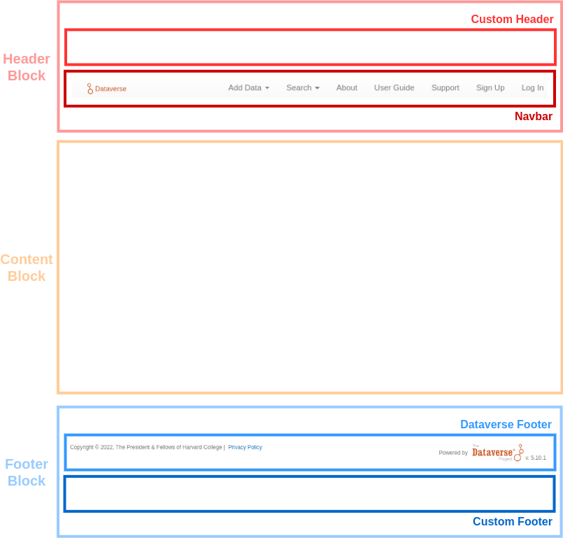
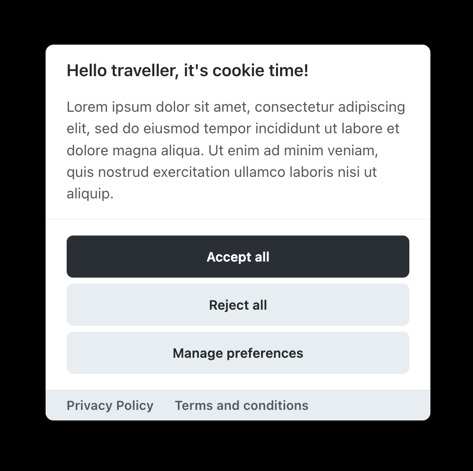

Configuration
=============

Now that you've successfully logged into your Dataverse installation with a superuser account after going through a basic :doc:`installation-main`, you'll need to secure and configure your installation.

Settings within your Dataverse installation itself are managed via JVM options or by manipulating values in the ``setting`` table directly or through API calls.

Once you have finished securing and configuring your Dataverse installation, you may proceed to the :doc:`/admin/index` for more information on the ongoing administration of a Dataverse installation. Advanced configuration topics are covered in the :doc:`shibboleth` and :doc:`oauth2` sections.

.. contents:: |toctitle|
  :local:

.. _securing-your-installation:

Securing Your Installation
--------------------------

Changing the Superuser Password
+++++++++++++++++++++++++++++++

The default password for the "dataverseAdmin" superuser account is "admin", as mentioned in the :doc:`installation-main` section, and you should change it, of course.

.. _blocking-api-endpoints:

Blocking API Endpoints
++++++++++++++++++++++

The :doc:`/api/native-api` contains a useful but potentially dangerous set of API endpoints called "admin" that allows you to change system settings, make ordinary users into superusers, and more. The "builtin-users" endpoints let admins do tasks such as creating a local/builtin user account if they know the key defined in :ref:`BuiltinUsers.KEY`.

By default in the code, most of these API endpoints can be operated on remotely and a number of endpoints do not require authentication. However, the endpoints "admin" and "builtin-users" are limited to localhost out of the box by the installer, using the JvmSettings :ref:`API_BLOCKED_ENDPOINTS <dataverse.api.blocked.endpoints>` and :ref:`API_BLOCKED_POLICY <dataverse.api.blocked.policy>`.

.. note::
   The database settings :ref:`:BlockedApiEndpoints` and :ref:`:BlockedApiPolicy` are deprecated and will be removed in a future version. Please use the JvmSettings mentioned above instead.

It is **very important** to keep the block in place for the "admin" endpoint, and to leave the "builtin-users" endpoint blocked unless you need to access it remotely. Documentation for the "admin" endpoint is spread across the :doc:`/api/native-api` section of the API Guide and the :doc:`/admin/index`.

Given how important it is to avoid exposing the "admin" and "builtin-user" APIs, sites using a proxy, e.g. Apache or Nginx, should also consider blocking them through rules in the proxy.
The following examples may be useful:

Apache/Httpd Rule:

Rewrite lines added to /etc/httpd/conf.d/ssl.conf. They can be the first lines inserted after the RewriteEngine On statement:

.. code-block:: apache

    RewriteRule   ^/api/(admin|builtin-users)           - [R=403,L]
    RewriteRule   ^/api/(v[0-9]*)/(admin|builtin-users) - [R=403,L]

Nginx Configuration Rule:

.. code-block:: nginx

    location ~ ^/api/(admin|v1/admin|builtin-users|v1/builtin-users) {
        deny all;
        return 403;
    }
 
It's also possible to prevent file uploads via API by adjusting the :ref:`:UploadMethods` database setting.

If you are using a load balancer or a reverse proxy, there are some additional considerations. If no additional configurations are made and the upstream is configured to redirect to localhost, the API will be accessible from the outside, as your installation will register as origin the localhost for any requests to the endpoints "admin" and "builtin-users". To prevent this, you have two options:

- If your upstream is configured to redirect to localhost, you will need to set the :ref:`JVM option <useripaddresssourceheader>` to one of the following values ``%client.name% %datetime% %request% %status% %response.length% %header.referer% %header.x-forwarded-for%`` and configure from the load balancer side the chosen header to populate with the client IP address.

- Another solution is to set the upstream to the client IP address. In this case no further configuration is needed.

For more information on configuring blocked API endpoints, see :ref:`dataverse.api.blocked.endpoints` and :ref:`dataverse.api.blocked.policy` in the JvmSettings documentation.

Forcing HTTPS
+++++++++++++

To avoid having your users send credentials in the clear, it's strongly recommended to force all web traffic to go through HTTPS (port 443) rather than HTTP (port 80). The ease with which one can install a valid SSL cert into Apache compared with the same operation in Payara might be a compelling enough reason to front Payara with Apache. In addition, Apache can be configured to rewrite HTTP to HTTPS with rules such as those found at https://wiki.apache.org/httpd/RewriteHTTPToHTTPS or in the section on :doc:`shibboleth`.

.. _user-ip-addresses-proxy-security:

Recording User IP Addresses
+++++++++++++++++++++++++++

By default, the Dataverse installation captures the IP address from which requests originate. This is used for multiple purposes including controlling access to the admin API, IP-based user groups and Make Data Count reporting. When the Dataverse installation is configured behind a proxy such as a load balancer, this default setup may not capture the correct IP address. In this case all the incoming requests will be logged in the access logs, MDC logs etc., as if they are all coming from the IP address(es) of the load balancer itself. Proxies usually save the original address in an added HTTP header, from which it can be extracted. For example, AWS LB records the "true" original address in the standard ``X-Forwarded-For`` header. If your Dataverse installation is running behind an IP-masking proxy, but you would like to use IP groups, or record the true geographical location of the incoming requests with Make Data Count, you may enable the IP address lookup from the proxy header using the JVM option  ``dataverse.useripaddresssourceheader``, described further below. 

Before doing so however, you must absolutely **consider the security risks involved**! This option must be enabled **only** on a Dataverse installation that is in fact fully behind a proxy that properly, and consistently, adds the ``X-Forwarded-For`` (or a similar) header to every request it forwards. Consider the implications of activating this option on a Dataverse installation that is not running behind a proxy, *or running behind one, but still accessible from the insecure locations bypassing the proxy*: Anyone can now add the header above to an incoming request, supplying an arbitrary IP address that the Dataverse installation will trust as the true origin of  the call. Thus giving an attacker an easy way to, for example, get in a privileged IP group. The implications could be even more severe if an attacker were able to pretend to be coming from ``localhost``, if a Dataverse installation is configured to trust localhost connections for unrestricted access to the admin API! We have addressed this by making it so that Dataverse installation should never accept ``localhost``, ``127.0.0.1``, ``0:0:0:0:0:0:0:1`` etc. when supplied in such a header. But if you have reasons to still find this risk unacceptable, you may want to consider turning open localhost access to the API off (See :ref:`Securing Your Installation <securing-your-installation>` for more information.)

This is how to verify that your proxy or load balancer, etc. is handling the originating address headers properly and securely: Make sure access logging is enabled in your application server (Payara) configuration. (``<http-service access-logging-enabled="true">`` in the ``domain.xml``). Add the address header to the access log format. For example, on a system behind AWS ELB, you may want to use something like ``%client.name% %datetime% %request% %status% %response.length% %header.referer% %header.x-forwarded-for%``. Once enabled, access the Dataverse installation from outside the LB. You should now see the real IP address of your remote client in the access log. For example, something like: 
``"1.2.3.4" "01/Jun/2020:12:00:00 -0500" "GET /dataverse.xhtml HTTP/1.1" 200 81082  "NULL-REFERER" "128.64.32.16"`` 

In this example, ``128.64.32.16`` is your remote address (that you should verify), and ``1.2.3.4`` is the address of your LB. If you're not seeing your remote address in the log, do not activate the JVM option! Also, verify that all the entries in the log have this header populated. The only entries in the access log that you should be seeing without this header (logged as ``"NULL-HEADER-X-FORWARDED-FOR"``) are local requests, made from localhost, etc. In this case, since the request is not coming through the proxy, the local IP address should be logged as the primary one (as the first value in the log entry, ``%client.name%``). If you see any requests coming in from remote, insecure subnets without this header - do not use the JVM option! 

Once you are ready, enable the :ref:`JVM option <useripaddresssourceheader>`. Verify that the remote locations are properly tracked in your MDC metrics, and/or your IP groups are working. As a final test, if your Dataverse installation is allowing unrestricted localhost access to the admin API, imitate an attack in which a malicious request is pretending to be coming from ``127.0.0.1``. Try the following from a remote, insecure location:

``curl https://your.dataverse.edu/api/admin/settings --header "X-FORWARDED-FOR: 127.0.0.1"``

First of all, confirm that access is denied! If you are in fact able to access the settings api from a location outside the proxy, **something is seriously wrong**, so please let us know, and stop using the JVM option.  Otherwise check the access log entry for the header value. What you should see is something like ``"127.0.0.1, 128.64.32.16"``. Where the second address should be the real IP of your remote client. The fact that the "fake" ``127.0.0.1`` you sent over is present in the header is perfectly ok. This is the proper proxy behavior - it preserves any incoming values in the ``X-Forwarded-Header``, if supplied, and adds the detected incoming address to it, *on the right*. It is only this rightmost comma-separated value that Dataverse installation should ever be using. 

Still feel like activating this option in your configuration? - Have fun and be safe!

.. _PrivacyConsiderations:

Privacy Considerations
++++++++++++++++++++++

Email Privacy
^^^^^^^^^^^^^

Out of the box, your Dataverse installation will list email addresses of the contacts for datasets when users visit a dataset page and click the "Export Metadata" button. Additionally, out of the box, the Dataverse installation will list email addresses of Dataverse collection contacts via API (see :ref:`View a Dataverse Collection <view-dataverse>` in the :doc:`/api/native-api` section of the API Guide). If you would like to exclude these email addresses from export, set :ref:`:ExcludeEmailFromExport <:ExcludeEmailFromExport>` to true.

Additional Recommendations
++++++++++++++++++++++++++

Run Payara as a User Other Than Root
^^^^^^^^^^^^^^^^^^^^^^^^^^^^^^^^^^^^

See the :ref:`payara` section of :doc:`prerequisites` for details and init scripts for running Payara as non-root.

Related to this is that you should remove ``/root/.payara/pass`` to ensure that Payara isn't ever accidentally started as root. Without the password, Payara won't be able to start as root, which is a good thing.

.. _secure-password-storage:

Secure Password Storage
^^^^^^^^^^^^^^^^^^^^^^^

In development or demo scenarios, we suggest not to store passwords in files permanently.
We recommend the use of at least environment variables or production-grade mechanisms to supply passwords.

In a production setup, permanently storing passwords as plaintext should be avoided at all cost.
Environment variables are dangerous in shared environments and containers, as they may be easily exploited; we suggest not to use them.
Depending on your deployment model and environment, you can make use of the following techniques to securely store and access passwords.

**Password Aliases**

A `password alias`_ allows you to have a plaintext reference to an encrypted password stored on the server, with the alias being used wherever the password is needed.
This method is especially useful in a classic deployment, as it does not require any external secrets management.

Password aliases are consumable as a MicroProfile Config source and can be referrenced by their name in a `property expression`_.
You may also reference them within a `variable substitution`_, e.g. in your ``domain.xml``.

Creation example for an alias named *my.alias.name*:

.. code-block:: shell

  echo "AS_ADMIN_ALIASPASSWORD=changeme" > /tmp/p.txt
  asadmin create-password-alias --passwordfile "/tmp/p.txt" "my.alias.name"
  rm /tmp/p.txt

Note: omitting the ``--passwordfile`` parameter allows creating the alias in an interactive fashion with a prompt.

**Secrets Files**

Payara has a builtin MicroProfile Config source to consume values from files in a directory on your filesystem.
This `directory config source`_ is most useful and secure with external secrets management in place, temporarily mounting cleartext passwords as files.
Examples are Kubernetes / OpenShift `Secrets <https://kubernetes.io/docs/concepts/configuration/secret/>`_ or tools like `Vault Agent <https://developer.hashicorp.com/vault/docs/agent-and-proxy/agent>`_.

Please follow the `directory config source`_ documentation to learn about its usage.

**Cloud Providers**

Running Dataverse on a cloud platform or running an external secret management system like `Vault <https://developer.hashicorp.com/vault>`_ enables accessing secrets without any intermediate storage of cleartext.
Obviously this is the most secure option for any deployment model, but it may require more resources to set up and maintain - your mileage may vary.

Take a look at `cloud sources`_ shipped with Payara to learn about their usage.

Enforce Strong Passwords for User Accounts
^^^^^^^^^^^^^^^^^^^^^^^^^^^^^^^^^^^^^^^^^^

Your Dataverse installation only stores passwords (as salted hash, and using a strong hashing algorithm) for "builtin" users. You can increase the password complexity rules to meet your security needs. If you have configured your Dataverse installation to allow login from remote authentication providers such as Shibboleth, ORCID, GitHub or Google, you do not have any control over those remote providers' password complexity rules. See the :ref:`auth-modes` section below for more on login options.

Even if you are satisfied with the out-of-the-box password complexity rules the Dataverse Software ships with, for the "dataverseAdmin" account you should use a strong password so the hash cannot easily be cracked through dictionary attacks.

Password complexity rules for "builtin" accounts can be adjusted with a variety of settings documented below. Here's a list:

- :ref:`:PVMinLength`
- :ref:`:PVMaxLength`
- :ref:`:PVNumberOfConsecutiveDigitsAllowed`
- :ref:`:PVCharacterRules`
- :ref:`:PVNumberOfCharacteristics`
- :ref:`:PVDictionaries`
- :ref:`:PVGoodStrength`
- :ref:`:PVCustomPasswordResetAlertMessage`

.. _samesite-cookie-attribute:

SameSite Cookie Attribute
^^^^^^^^^^^^^^^^^^^^^^^^^

The SameSite cookie attribute is defined in an upcoming revision to `RFC 6265 <https://datatracker.ietf.org/doc/html/rfc6265>`_ (HTTP State Management Mechanism) called `6265bis <https://datatracker.ietf.org/doc/html/draft-ietf-httpbis-rfc6265bis-19>`_ ("bis" meaning "repeated"). The possible values are "None", "Lax", and "Strict". "Strict" is intended to help prevent Cross-Site Request Forgery (CSRF) attacks, as described in the RFC proposal and an OWASP `cheetsheet <https://cheatsheetseries.owasp.org/cheatsheets/Cross-Site_Request_Forgery_Prevention_Cheat_Sheet.html#samesite-cookie-attribute>`_. We don't recommend "None" for security reasons.

By default, Payara doesn't send the SameSite cookie attribute, which browsers should interpret as "Lax" according to `MDN <https://developer.mozilla.org/en-US/docs/Web/HTTP/Cookies#controlling_third-party_cookies_with_samesite>`_.
Dataverse installations are explicity set to "Lax" out of the box by the installer (in the case of a "classic" installation) or through the base image (in the case of a Docker installation). For classic, see :ref:`http.cookie-same-site-value` and :ref:`http.cookie-same-site-enabled` for how to change the values. For Docker, you must rebuild the :doc:`base image </container/base-image>`. See also Payara's `documentation <https://docs.payara.fish/community/docs/6.2024.6/Technical%20Documentation/Payara%20Server%20Documentation/General%20Administration/Administering%20HTTP%20Connectivity.html>`_ for the settings above.

To inspect cookie attributes like SameSite, you can use ``curl -s -I http://localhost:8080 | grep JSESSIONID``, for example, looking for the "Set-Cookie" header.

.. _ongoing-security:

Ongoing Security of Your Installation
+++++++++++++++++++++++++++++++++++++

Like any application, you should keep up-to-date with patches to both the Dataverse software and the platform (usually Linux) it runs on. Dataverse releases are announced on the dataverse-community_ mailing list, the Dataverse blog_, and in chat.dataverse.org_.

.. _dataverse-community: https://groups.google.com/g/dataverse-community
.. _blog: https://dataverse.org/blog
.. _chat.dataverse.org: https://chat.dataverse.org

In addition to these public channels, you can subscribe to receive security notices via email from the Dataverse team. These notices are sent to the ``contact_email`` in the installation spreadsheet_ and you can open an issue in the dataverse-installations_ repo to add or change the contact email. Security notices are also sent to people and organizations that prefer to remain anonymous. To be added to this private list, please email support@dataverse.org.

.. _spreadsheet: https://docs.google.com/spreadsheets/d/1bfsw7gnHlHerLXuk7YprUT68liHfcaMxs1rFciA-mEo/edit#gid=0
.. _dataverse-installations: https://github.com/IQSS/dataverse-installations

For additional details about security practices by the Dataverse team, see the :doc:`/developers/security` section of the Developer Guide.

.. _reporting-security-issues:

Reporting Security Issues
+++++++++++++++++++++++++

If you have a security issue to report, please email it to security@dataverse.org.

.. _network-ports:

Network Ports
-------------

Remember how under "Decisions to Make" in the :doc:`prep` section we mentioned you'll need to make a decision about whether or not to introduce a proxy in front of the Dataverse Software such as Apache or nginx? The time has come to make that decision.

The need to redirect port HTTP (port 80) to HTTPS (port 443) for security has already been mentioned above and the fact that Payara puts these services on 8080 and 8181, respectively, was touched on in the :doc:`installation-main` section. In production, you don't want to tell your users to use your Dataverse installation on ports 8080 and 8181. You should have them use the standard HTTPS port, which is 443.

Your decision to proxy or not should primarily be driven by which features of the Dataverse Software you'd like to use. If you'd like to use Shibboleth, the decision is easy because proxying or "fronting" Payara with Apache is required. The details are covered in the :doc:`shibboleth` section.

Even if you have no interest in Shibboleth, you may want to front your Dataverse installation with Apache or nginx to simply the process of installing SSL certificates. There are many tutorials on the Internet for adding certs to Apache, including a some `notes used by the Dataverse Project team <https://github.com/IQSS/dataverse/blob/v4.6.1/doc/shib/shib.md>`_, but the process of adding a certificate to Payara is arduous and not for the faint of heart. The Dataverse Project team cannot provide much help with adding certificates to Payara beyond linking to `tips <https://stackoverflow.com/questions/906402/importing-an-existing-x509-certificate-and-private-key-in-java-keystore-to-use-i>`_ on the web.

Still not convinced you should put Payara behind another web server? Even if you manage to get your SSL certificate into Payara, how are you going to run Payara on low ports such as 80 and 443? Are you going to run Payara as root? Bad idea. This is a security risk. Under "Additional Recommendations" under "Securing Your Installation" above you are advised to configure Payara to run as a user other than root.

There's also the issue of serving a production-ready version of robots.txt. By using a proxy such as Apache, this is a one-time "set it and forget it" step as explained below in the "Going Live" section.

If you are convinced you'd like to try fronting Payara with Apache, the :doc:`shibboleth` section should be good resource for you.

If you really don't want to front Payara with any proxy (not recommended), you can configure Payara to run HTTPS on port 443 like this:

``./asadmin set server-config.network-config.network-listeners.network-listener.http-listener-2.port=443``

What about port 80? Even if you don't front your Dataverse installation with Apache, you may want to let Apache run on port 80 just to rewrite HTTP to HTTPS as described above. You can use a similar command as above to change the HTTP port that Payara uses from 8080 to 80 (substitute ``http-listener-1.port=80``). Payara can be used to enforce HTTPS on its own without Apache, but configuring this is an exercise for the reader. Answers here may be helpful: https://stackoverflow.com/questions/25122025/glassfish-v4-java-7-port-unification-error-not-able-to-redirect-http-to

If you are running an installation with Apache and Payara on the same server, and would like to restrict Payara from responding to any requests to port 8080 from external hosts (in other words, not through Apache), you can restrict the AJP listener to localhost only with:

``./asadmin set server-config.network-config.network-listeners.network-listener.http-listener-1.address=127.0.0.1``

You should **NOT** use the configuration option above if you are running in a load-balanced environment, or otherwise have the web server on a different host than the application server.

Root Dataverse Collection Permissions
-------------------------------------

The user who creates a Dataverse collection is given the "Admin" role on that Dataverse collection. The root Dataverse collection is created automatically for you by the installer and the "Admin" is the superuser account ("dataverseAdmin") we used in the :doc:`installation-main` section to confirm that we can log in. These next steps of configuring the root Dataverse collection require the "Admin" role on the root Dataverse collection, but not the much more powerful superuser attribute. In short, users with the "Admin" role are subject to the permission system. A superuser, on the other hand, completely bypasses the permission system. You can give non-superusers the "Admin" role on the root Dataverse collection if you'd like them to configure the root Dataverse collection.

In order for non-superusers to start creating Dataverse collections or datasets, you need click "Edit" then "Permissions" and make choices about which users can add Dataverse collections or datasets within the root Dataverse collection. (There is an API endpoint for this operation as well.) Again, the user who creates a Dataverse collection will be granted the "Admin" role on that Dataverse collection. Non-superusers who are not "Admin" on the root Dataverse collection will not be able to do anything useful until the root Dataverse collection has been published.

As the person installing the Dataverse Software, you may or may not be a local metadata expert. You may want to have others sign up for accounts and grant them the "Admin" role at the root Dataverse collection to configure metadata fields, templates, browse/search facets, guestbooks, etc. For more on these topics, consult the :doc:`/user/dataverse-management` section of the User Guide.

.. _pids-configuration:

Persistent Identifiers and Publishing Datasets
----------------------------------------------

Persistent identifiers (PIDs) are a required and integral part of the Dataverse Software. They provide a URL that is
guaranteed to resolve to the datasets or files they represent. The Dataverse Software currently supports creating
identifiers using any of several PID types. The most appropriate PIDs for public data are DOIs (e.g., provided by
DataCite or EZID) and Handles. Dataverse also supports PermaLinks which could be useful for intranet or catalog use
cases. A DOI provider called "FAKE" is recommended only for testing and development purposes.

Dataverse can be configured with one or more PID providers, each of which can mint and manage PIDs with a given protocol 
(e.g., doi, handle, permalink) using a specific service provider/account (e.g. with DataCite, EZId, or HandleNet) 
to manage an authority/shoulder combination, aka a "prefix" (PermaLinks also support custom separator characters as part of the prefix), 
along with an optional list of individual PIDs (with different authority/shoulders) than can be managed with that account.

Dataverse automatically manages assigning PIDs and making them findable when datasets are published. There are also :ref:`API calls that
allow updating the PID target URLs and metadata of already-published datasets manually if needed <send-metadata-to-pid-provider>`, e.g. if a Dataverse instance is
moved to a new URL or when the software is updated to generate additional metadata or address schema changes at the PID service.

Note that while some forms of PIDs (Handles, PermaLinks) are technically case sensitive, common practice is to avoid creating PIDs that differ only by case.
Dataverse treats PIDs of all types as case-insensitive (as DOIs are by definition). This means that Dataverse will find datasets (in search, to display dataset pages, etc.) 
when the PIDs entered do not match the case of the original but will have a problem if two PIDs that differ only by case exist in one instance.

Testing PID Providers
+++++++++++++++++++++

By default, the installer configures the Fake DOI provider as the registration provider. Unlike other DOI Providers, the Fake Provider does not involve any
external resolution service and is not appropriate for use beyond development and testing. You may wish instead to test with 
PermaLinks or with a DataCite test account (which uses DataCite's test infrastructure and will help assure your Dataverse instance can make network connections to DataCite.
DataCite requires that you register for a test account, which will have a username, password and your own prefix (please contact support@datacite.org for a test account.
You may wish to `contact the GDCC <https://www.gdcc.io/about.html>`_ instead - GDCC is able to provide DataCite accounts with a group discount and can also provide test accounts.).

Once you receive the login name, password, and prefix for the account,
configure the credentials as described below. 

Alternately, you may wish to configure other providers for testing: 

- EZID is available to University of California scholars and researchers. Testing can be done using the authority 10.5072 and shoulder FK2 with the "apitest" account (contact EZID for credentials) or an institutional account. Configuration in Dataverse is then analogous to using DataCite.
   
- The PermaLink provider, like the FAKE DOI provider, does not involve an external account.
  Unlike the Fake DOI provider, the PermaLink provider creates PIDs that begin with "perma:", making it clearer that they are not DOIs,
  and that do resolve to the local dataset/file page in Dataverse, making them useful for some production use cases. See :ref:`permalinks` and (for the FAKE DOI provider) the :doc:`/developers/dev-environment` section of the Developer Guide.

Provider-specific configuration is described below.

Once all is configured, you will be able to publish datasets and files, but **the persistent identifiers will not be citable**
as they, with the exception of PermaLinks, will not redirect to your dataset page in Dataverse.

Note that any datasets or files created using a test configuration cannot be directly migrated to a production PID provider 
and would need to be created again once a valid PID Provider(s) are configured.

One you are done testing, to properly configure persistent identifiers for a production installation, an account and associated namespace (e.g. authority/shoulder) must be
acquired for a fee from a DOI or HDL provider. (As noted above, PermaLinks May be appropriate for intranet and catalog uses cases.)
**DataCite** (https://www.datacite.org) is the recommended DOI provider
(see https://dataversecommunity.global for more on joining DataCite through the Global Dataverse Community Consortium) but **EZID**
(http://ezid.cdlib.org) is an option for the University of California according to
https://www.cdlib.org/cdlinfo/2017/08/04/ezid-doi-service-is-evolving/ .
**Handle.Net** (https://www.handle.net) is the HDL provider.

Once you have your DOI or Handle account credentials and a prefix, configure your Dataverse installation
using the settings below.

 
Configuring PID Providers
+++++++++++++++++++++++++

There are two required global settings to configure PID providers - the list of ids of providers and which one of those should be the default.
Per-provider settings are also required - some that are common to all types and some type specific. All of these settings are defined 
to be compatible with the MicroProfile specification which means that

1. Any of these settings can be set via system properties (see :ref:`jvm-options` for how to do this), environment variables, or other
   MicroProfile Config mechanisms supported by the app server.
   `See Payara docs for supported sources <https://docs.payara.fish/community/docs/documentation/microprofile/config/README.html#config-sources>`_.
2. Remember to protect your secrets. For passwords, use an environment variable (bare minimum), a password alias named the same
   as the key (OK) or use the `"dir config source" of Payara <https://docs.payara.fish/community/docs/documentation/microprofile/config/directory.html>`_ (best).

   Alias creation example:

   .. code-block:: shell

      echo "AS_ADMIN_ALIASPASSWORD=changeme" > /tmp/p.txt
      asadmin create-password-alias --passwordfile /tmp/p.txt dataverse.pid.datacite1.datacite.password
      rm /tmp/p.txt

3. Environment variables follow the key, replacing any dot, colon, dash, etc. into an underscore "_" and all uppercase
   letters. Example: ``dataverse.pid.default-provider`` -> ``DATAVERSE_PID_DEFAULT_PROVIDER``
   
Global Settings
^^^^^^^^^^^^^^^

The following two global settings are required to configure PID Providers in the Dataverse software:

.. _dataverse.pid.providers:

dataverse.pid.providers
^^^^^^^^^^^^^^^^^^^^^^^

A comma-separated list of the ids of the PID providers to use. IDs should be simple unique text strings, e.g. datacite1, perma1, etc.
IDs are used to scope the provider-specific settings but are not directly visible to users. 

.. _dataverse.pid.default-provider:

dataverse.pid.default-provider
^^^^^^^^^^^^^^^^^^^^^^^^^^^^^^

The ID of the default PID provider to use.

.. _dataverse.spi.pidproviders.directory:

dataverse.spi.pidproviders.directory
^^^^^^^^^^^^^^^^^^^^^^^^^^^^^^^^^^^^

The path to the directory where JAR files containing additional types of PID Providers can be added.
Dataverse includes providers that support DOIs (DataCite, EZId, or FAKE), Handles, and PermaLinks.
PID provider jar files added to this directory can replace any of these or add new PID Providers.

Per-Provider Settings
^^^^^^^^^^^^^^^^^^^^^

Each Provider listed by id in the dataverse.pid.providers setting must be configured with the following common settings and any settings that are specific to the provider type.

.. _dataverse.pid.*.type:

dataverse.pid.*.type
^^^^^^^^^^^^^^^^^^^^

The Provider type, currently one of ``datacite``, ``ezid``, ``FAKE``, ``hdl``, or ``perma``. The type defines which protocol a service supports (DOI, Handle, or PermaLink) and, for DOI Providers, which 
DOI service is used.

.. _dataverse.pid.*.label:

dataverse.pid.*.label
^^^^^^^^^^^^^^^^^^^^^

A human-readable label for the provider

.. _dataverse.pid.*.authority:

dataverse.pid.*.authority
^^^^^^^^^^^^^^^^^^^^^^^^^

.. _dataverse.pid.*.shoulder:

dataverse.pid.*.shoulder
^^^^^^^^^^^^^^^^^^^^^^^^

In general, PIDs are of the form ``<protocol>:<authority>/<shoulder>*`` where ``*`` is the portion unique to an individual PID. PID Providers must define
the authority and shoulder (with the protocol defined by the ``dataverse.pid.*.type`` setting) that defines the set of existing PIDs they can manage and the prefix they can use when minting new PIDs.
(Often an account with a PID service provider will be limited to using a single authority/shoulder. If your PID service provider account allows more than one combination that you wish to use in Dataverse, configure multiple PID Provider, one for each combination.)
 
.. _dataverse.pid.*.identifier-generation-style:

dataverse.pid.*.identifier-generation-style
^^^^^^^^^^^^^^^^^^^^^^^^^^^^^^^^^^^^^^^^^^^

By default, Pid Providers in Dataverse generate a random 6 character string,
pre-pended by the Shoulder if set, to use as the identifier for a Dataset.
Set this to ``storedProcGenerated`` to generate instead a custom *unique*
identifier (again pre-pended by the Shoulder if set) through a database
stored procedure or function (the assumed default setting is ``randomString``).
When using the ``storedProcGenerated`` setting, a stored procedure or function must be created in
the database.

As a first example, the script below (downloadable
:download:`here </_static/util/createsequence.sql>`) produces
sequential numerical values. You may need to make some changes to suit your
system setup, see the comments for more information:

.. literalinclude:: ../_static/util/createsequence.sql
   :language: plpgsql

As a second example, the script below (downloadable
:download:`here </_static/util/identifier_from_timestamp.sql>`) produces
sequential 8 character identifiers from a base36 representation of current
timestamp.

.. literalinclude:: ../_static/util/identifier_from_timestamp.sql
   :language: plpgsql

Note that the SQL in these examples scripts is Postgres-specific.
If necessary, it can be reimplemented in any other SQL flavor - the standard
JPA code in the application simply expects the database to have a saved
function ("stored procedure") named ``generateIdentifierFromStoredProcedure()``
returning a single ``varchar`` argument.

Please note that this setting interacts with the ``dataverse.pid.*.datafile-pid-format``
setting below to determine how datafile identifiers are generated.

.. _dataverse.pid.*.datafile-pid-format:

dataverse.pid.*.datafile-pid-format
^^^^^^^^^^^^^^^^^^^^^^^^^^^^^^^^^^^

This setting controls the way that the "identifier" component of a file's
persistent identifier (PID) relates to the PID of its "parent" dataset - for a give PID Provider.

By default the identifier for a file is dependent on its parent dataset.
For example, if the identifier of a dataset is "TJCLKP", the identifier for
a file within that dataset will consist of the parent dataset's identifier
followed by a slash ("/"), followed by a random 6 character string,
yielding "TJCLKP/MLGWJO". Identifiers in this format are what you should
expect if you leave ``dataverse.pid.*.datafile-pid-format`` undefined or set it to
``DEPENDENT`` and have not changed the ``dataverse.pid.*.identifier-generation-style``
setting from its default.

Alternatively, the identifier for File PIDs can be configured to be
independent of Dataset PIDs using the setting ``INDEPENDENT``.
In this case, file PIDs will not contain the PIDs of their parent datasets,
and their PIDs will be generated the exact same way that datasets' PIDs are,
based on the ``dataverse.pid.*.identifier-generation-style`` setting described above
(random 6 character strings or custom unique identifiers through a stored
procedure, pre-pended by any shoulder).

The chart below shows examples from each possible combination of parameters
from the two settings. ``dataverse.pid.*.identifier-generation-style`` can be either
``randomString`` (the default) or ``storedProcGenerated`` and
``dataverse.pid.*.datafile-pid-format`` can be either ``DEPENDENT`` (the default) or
``INDEPENDENT``. In the examples below the "identifier" for the dataset is
"TJCLKP" for ``randomString`` and "100001" for ``storedProcGenerated`` (when
using sequential numerical values, as described in
:ref:`dataverse.pid.*.identifier-generation-style` above), or "krby26qt" for
``storedProcGenerated`` (when using base36 timestamps, as described in
:ref:`dataverse.pid.*.identifier-generation-style` above).

+-----------------+---------------+----------------------+---------------------+
|                 | randomString  | storedProcGenerated  | storedProcGenerated |
|                 |               |                      |                     |
|                 |               | (sequential numbers) | (base36 timestamps) |
+=================+===============+======================+=====================+
| **DEPENDENT**   | TJCLKP/MLGWJO | 100001/1             | krby26qt/1          |
+-----------------+---------------+----------------------+---------------------+
| **INDEPENDENT** | MLGWJO        | 100002               | krby27pz            |
+-----------------+---------------+----------------------+---------------------+

As seen above, in cases where ``dataverse.pid.*.identifier-generation-style`` is set to
``storedProcGenerated`` and ``dataverse.pid.*.datafile-pid-format`` is set to ``DEPENDENT``,
each file within a dataset will be assigned a number *within* that dataset
starting with "1".

Otherwise, if ``dataverse.pid.*.datafile-pid-format`` is set to ``INDEPENDENT``, each file
within the dataset is assigned with a new PID which is the next available
identifier provided from the database stored procedure. In our example:
"100002" when using sequential numbers or "krby27pz" when using base36
timestamps.

.. _dataverse.pid.*.managed-list:

dataverse.pid.*.managed-list
^^^^^^^^^^^^^^^^^^^^^^^^^^^^

.. _dataverse.pid.*.excluded-list:

dataverse.pid.*.excluded-list
^^^^^^^^^^^^^^^^^^^^^^^^^^^^^

With at least some PID services, it is possible for the authority(permission) to manage specific individual PIDs
to be transferred between accounts. To handle these cases, the individual PIDs, written in the
standard format, e.g. doi:10.5072/FK2ABCDEF can be added to the comma-separated ``managed`` or ``excluded`` list
for a given provider. For entries on the ``managed- list``, Dataverse will assume this PID
Provider/account can update the metadata and landing URL for the PID at the service provider
(even though it does not match the provider's authority/shoulder settings). Conversely,
Dataverse will assume that PIDs on the ``excluded-list`` cannot be managed/updated by this provider
(even though they match the provider's authority/shoulder settings). These settings are optional
with the default assumption that these lists are empty.

.. _dataverse.pid.*.datacite:

DataCite-specific Settings
^^^^^^^^^^^^^^^^^^^^^^^^^^

dataverse.pid.*.datacite.mds-api-url
^^^^^^^^^^^^^^^^^^^^^^^^^^^^^^^^^^^^
dataverse.pid.*.datacite.rest-api-url
^^^^^^^^^^^^^^^^^^^^^^^^^^^^^^^^^^^^^
dataverse.pid.*.datacite.username
^^^^^^^^^^^^^^^^^^^^^^^^^^^^^^^^^
dataverse.pid.*.datacite.password
^^^^^^^^^^^^^^^^^^^^^^^^^^^^^^^^^

PID Providers of type ``datacite`` require four additional parameters that define how the provider connects to DataCite.
DataCite has two APIs that are used in Dataverse:

The base URL of the `DataCite MDS API <https://support.datacite.org/reference/overview>`_,
used to mint and manage DOIs. Current valid values for ``dataverse.pid.*.datacite.mds-api-url`` are "https://mds.datacite.org" (production) and "https://mds.test.datacite.org" (testing, the default).

The `DataCite REST API <https://support.datacite.org/reference/introduction>`_ is also used - :ref:`PIDs API <pids-api>` information retrieval and :doc:`/admin/make-data-count`.
Current valid values for ``dataverse.pid.*.datacite.rest-api-url`` are "https://api.datacite.org" (production) and "https://api.test.datacite.org" (testing, the default).

DataCite uses `HTTP Basic authentication <https://en.wikipedia.org/wiki/Basic_access_authentication>`_
for `Fabrica <https://doi.datacite.org/>`_ and their APIs. You need to provide
the same credentials (``username``, ``password``) to Dataverse software to mint and manage DOIs for you.
As noted above, you should use one of the more secure options for setting the password.

CrossRef-specific Settings
^^^^^^^^^^^^^^^^^^^^^^^^^^

dataverse.pid.*.crossref.url
^^^^^^^^^^^^^^^^^^^^^^^^^^^^
dataverse.pid.*.crossref.rest-api-url
^^^^^^^^^^^^^^^^^^^^^^^^^^^^^^^^^^^^^
dataverse.pid.*.crossref.username
^^^^^^^^^^^^^^^^^^^^^^^^^^^^^^^^^
dataverse.pid.*.crossref.password
^^^^^^^^^^^^^^^^^^^^^^^^^^^^^^^^^
dataverse.pid.*.crossref.depositor
^^^^^^^^^^^^^^^^^^^^^^^^^^^^^^^^^^
dataverse.pid.*.crossref.depositor-email
^^^^^^^^^^^^^^^^^^^^^^^^^^^^^^^^^^^^^^^^

CrossRef is an experimental provider.
PID Providers of type ``crossref`` require six additional parameters that define how the provider connects to CrossRef.
CrossRef has two APIs that are used in Dataverse:

The base URL of the `CrossRef <https://api.crossref.org>`_,
used to mint and manage DOIs. Current valid values for ``dataverse.pid.*.crossref.url`` are "https://doi.crossref.org" and ``dataverse.pid.*.crossref.rest-api-url`` are "https://api.crossref.org" (production).
``dataverse.pid.*.crossref.username=crusername``
``dataverse.pid.*.crossref.password=secret``
``dataverse.pid.*.crossref.depositor=xyz``
``dataverse.pid.*.crossref.depositor-email=xyz@example.com``

CrossRef uses `HTTP Basic authentication <https://en.wikipedia.org/wiki/Basic_access_authentication>`_
XML files can be POSTed to CrossRef where they are added to the submission queue to await processing
`Post URL <https://doi.crossref.org/>`_
REST API allows the search and reuse our members' metadata.
`Rest API <https://api.crossref.org/>`_ and their APIs.
You need to provide the same credentials (``username``, ``password``) to Dataverse software to mint and manage DOIs for you.
As noted above, you should use one of the more secure options for setting the password.
Depositor and Depositor Email are used for the generation and distribution of Depositor reports.

.. _dataverse.pid.*.ezid:

EZId-specific Settings
^^^^^^^^^^^^^^^^^^^^^^

dataverse.pid.*.ezid.api-url
^^^^^^^^^^^^^^^^^^^^^^^^^^^^
dataverse.pid.*.ezid.username
^^^^^^^^^^^^^^^^^^^^^^^^^^^^^
dataverse.pid.*.ezid.password
^^^^^^^^^^^^^^^^^^^^^^^^^^^^^

Note that use of `EZId <https://ezid.cdlib.org/>`_ is limited primarily to University of California institutions. If you have an EZId account,
you will need to configure the ``api-url`` and your account ``username`` and ``password``. As above, you should use one of the more secure 
options for setting the password.

.. _dataverse.pid.*.permalink:

PermaLink-specific Settings
^^^^^^^^^^^^^^^^^^^^^^^^^^^

dataverse.pid.*.permalink.base-url
^^^^^^^^^^^^^^^^^^^^^^^^^^^^^^^^^^

dataverse.pid.*.permalink.separator
^^^^^^^^^^^^^^^^^^^^^^^^^^^^^^^^^^^

PermaLinks are a simple PID option intended for intranet and catalog use cases. They can be used without an external service or
be configured with the ``base-url`` of a resolution service. PermaLinks also allow a custom ``separator`` to be used.

Note:

- If you configure ``base-url``, it should include a "/" after the hostname like this: ``https://demo.dataverse.org/``.
- When using multiple PermaLink providers, you should avoid ambiguous authority/separator/shoulder combinations that would result in the same overall prefix.
- Configuring PermaLink providers differing only by their separator values is not supported.
- In general, PermaLink authority/shoulder values should be alphanumeric. For other cases, admins may need to consider the potential impact of special characters in S3 storage identifiers, resolver URLs, exports, etc.

.. _dataverse.pid.*.handlenet:

Handle-specific Settings
^^^^^^^^^^^^^^^^^^^^^^^^

dataverse.pid.*.handlenet.index
^^^^^^^^^^^^^^^^^^^^^^^^^^^^^^^

dataverse.pid.*.handlenet.independent-service
^^^^^^^^^^^^^^^^^^^^^^^^^^^^^^^^^^^^^^^^^^^^^

dataverse.pid.*.handlenet.auth-handle
^^^^^^^^^^^^^^^^^^^^^^^^^^^^^^^^^^^^^

dataverse.pid.*.handlenet.key
^^^^^^^^^^^^^^^^^^^^^^^^^^^^^

dataverse.pid.*.handlenet.path
^^^^^^^^^^^^^^^^^^^^^^^^^^^^^^

dataverse.pid.*.handlenet.passphrase
^^^^^^^^^^^^^^^^^^^^^^^^^^^^^^^^^^^^

Note: If you are **minting your own handles** and plan to set up your own handle service, please refer to `Handle.Net documentation <https://handle.net/hnr_documentation.html>`_.

Configure your Handle.net ``index`` to be used registering new persistent
identifiers. Defaults to ``300``. 

Indices are used to separate concerns within the Handle system. To add data to
an index, authentication is mandatory. See also chapter 1.4 "Authentication" of
the `Handle.Net Technical Documentation <http://www.handle.net/tech_manual/HN_Tech_Manual_8.pdf>`__

Handle.Net servers use a public key authentication method where the public key
is stored in a handle itself and the matching private key is provided from this
file. Typically, the absolute path ends like ``handle/svr_1/admpriv.bin``. 
The key file may (and should) be encrypted with a passphrase (used for
encryption with AES-128). See
also chapter 1.4 "Authentication" of the `Handle.Net Technical Documentation
<http://www.handle.net/tech_manual/HN_Tech_Manual_8.pdf>`__

Provide an absolute ``key.path`` to a private key file authenticating requests to your
Handle.Net server.

Provide a ``key.passphrase`` to decrypt the private key file at ``dataverse.pid.*.handlenet.key.path``.

Set ``independent-service`` to true if you want to use a Handle service which is setup to work 'independently' (No communication with the Global Handle Registry).
By default this setting is false.

Set ``auth-handle`` to <prefix>/<suffix> to be used on a global handle service when the public key is NOT stored in the default handle.
This setting is optional. If the public key is, for instance, stored in handle: ``21.T12996/USER01``, ``auth-handle`` should be set to this value.

.. _pids-doi-configuration:

Backward-compatibility for Single PID Provider Installations
++++++++++++++++++++++++++++++++++++++++++++++++++++++++++++

While using the PID Provider configuration settings described above is recommended, Dataverse installations
only using a single PID Provider can use the settings below instead. In general, these legacy settings mirror
those above except for not including a PID Provider id. 

Configuring Your Dataverse Installation for a Single DOI Provider
^^^^^^^^^^^^^^^^^^^^^^^^^^^^^^^^^^^^^^^^^^^^^^^^^^^^^^^^^^^^^^^^^

Here are the configuration options for DOIs.:

**JVM Options for DataCite:**

- :ref:`dataverse.pid.datacite.mds-api-url`
- :ref:`dataverse.pid.datacite.rest-api-url`
- :ref:`dataverse.pid.datacite.username`
- :ref:`dataverse.pid.datacite.password`

**JVM Options for EZID:**

As stated above, with very few exceptions (e.g. University of California), you will not be able to use
this provider.

- :ref:`dataverse.pid.ezid.api-url`
- :ref:`dataverse.pid.ezid.username`
- :ref:`dataverse.pid.ezid.password`

**Database Settings:**

- :ref:`:DoiProvider <:DoiProvider>`
- :ref:`:Protocol <:Protocol>`
- :ref:`:Authority <:Authority>`
- :ref:`:Shoulder <:Shoulder>`
- :ref:`:IdentifierGenerationStyle <:IdentifierGenerationStyle>` (optional)
- :ref:`:DataFilePIDFormat <:DataFilePIDFormat>` (optional)
- :ref:`:FilePIDsEnabled <:FilePIDsEnabled>` (optional, defaults to false)

.. _pids-handle-configuration:

Configuring Your Dataverse Installation for a Single Handle Provider
^^^^^^^^^^^^^^^^^^^^^^^^^^^^^^^^^^^^^^^^^^^^^^^^^^^^^^^^^^^^^^^^^^^^

Here are the configuration options for handles. Most notably, you need to
change the ``:Protocol`` setting, as it defaults to DOI usage.

**JVM Options:**

- :ref:`dataverse.pid.handlenet.key.path`
- :ref:`dataverse.pid.handlenet.key.passphrase`
- :ref:`dataverse.pid.handlenet.index`

**Database Settings:**

- :ref:`:Protocol <:Protocol>`
- :ref:`:Authority <:Authority>`
- :ref:`:IdentifierGenerationStyle <:IdentifierGenerationStyle>` (optional)
- :ref:`:DataFilePIDFormat <:DataFilePIDFormat>` (optional)
- :ref:`:IndependentHandleService <:IndependentHandleService>` (optional)
- :ref:`:HandleAuthHandle <:HandleAuthHandle>` (optional)

Note: If you are **minting your own handles** and plan to set up your own handle service, please refer to `Handle.Net documentation <https://handle.net/hnr_documentation.html>`_.

.. _permalinks:

Configuring Your Dataverse Installation for a Single PermaLink Provider
^^^^^^^^^^^^^^^^^^^^^^^^^^^^^^^^^^^^^^^^^^^^^^^^^^^^^^^^^^^^^^^^^^^^^^^

Here are the configuration options for PermaLinks:

**JVM Options:**

- :ref:`dataverse.pid.permalink.base-url`

**Database Settings:**

- :ref:`:Protocol <:Protocol>`
- :ref:`:Authority <:Authority>`
- :ref:`:Shoulder <:Shoulder>`
- :ref:`:IdentifierGenerationStyle <:IdentifierGenerationStyle>` (optional)
- :ref:`:DataFilePIDFormat <:DataFilePIDFormat>` (optional)
- :ref:`:FilePIDsEnabled <:FilePIDsEnabled>` (optional, defaults to false)

You must restart Payara after making changes to these settings.

.. _auth-modes:

Auth Modes: Local vs. Remote vs. Both
-------------------------------------

There are three valid configurations or modes for authenticating users to your Dataverse installation:

Local Only Auth
+++++++++++++++

Out of the box, your Dataverse installation is configured in "local only" mode. The "dataverseAdmin" superuser account mentioned in the :doc:`/installation/installation-main` section is an example of a local account. Internally, these accounts are called "builtin" because they are built in to the Dataverse Software application itself.

Both Local and Remote Auth
++++++++++++++++++++++++++

The ``authenticationproviderrow`` database table controls which "authentication providers" are available within a Dataverse installation. Out of the box, a single row with an id of "builtin" will be present. For each user in a Dataverse installation, the ``authenticateduserlookup`` table will have a value under ``authenticationproviderid`` that matches this id. For example, the default "dataverseAdmin" user will have the value "builtin" under  ``authenticationproviderid``. Why is this important? Users are tied to a specific authentication provider but conversion mechanisms are available to switch a user from one authentication provider to the other. As explained in the :doc:`/user/account` section of the User Guide, a graphical workflow is provided for end users to convert from the "builtin" authentication provider to a remote provider. Conversion from a remote authentication provider to the builtin provider can be performed by a sysadmin with access to the "admin" API. See the :doc:`/api/native-api` section of the API Guide for how to list users and authentication providers as JSON.

Adding and enabling a second authentication provider (:ref:`native-api-add-auth-provider` and :ref:`api-toggle-auth-provider`) will result in the Log In page showing additional providers for your users to choose from. By default, the Log In page will show the "builtin" provider, but you can adjust this via the :ref:`conf-default-auth-provider` configuration option. Further customization can be achieved by setting :ref:`conf-allow-signup` to "false", thus preventing users from creating local accounts via the web interface. Please note that local accounts can also be created through the API by enabling the ``builtin-users`` endpoint (:ref:`:BlockedApiEndpoints`) and setting the ``BuiltinUsers.KEY`` database setting (:ref:`BuiltinUsers.KEY`).

To configure Shibboleth see the :doc:`shibboleth` section and to configure OAuth see the :doc:`oauth2` section.

Remote Only Auth
++++++++++++++++

As for the "Remote only" authentication mode, it means that:

- Shibboleth or OAuth has been enabled.
- ``:AllowSignUp`` is set to "false" to prevent users from creating local accounts via the web interface.
- ``:DefaultAuthProvider`` has been set to use the desired authentication provider
- The "builtin" authentication provider has been disabled (:ref:`api-toggle-auth-provider`). Note that disabling the "builtin" authentication provider means that the API endpoint for converting an account from a remote auth provider will not work. Converting directly from one remote authentication provider to another (i.e. from GitHub to Google) is not supported. Conversion from remote is always to "builtin". Then the user initiates a conversion from "builtin" to remote. Note that longer term, the plan is to permit multiple login options to the same Dataverse installation account per https://github.com/IQSS/dataverse/issues/3487 (so all this talk of conversion will be moot) but for now users can only use a single login option, as explained in the :doc:`/user/account` section of the User Guide. In short, "remote only" might work for you if you only plan to use a single remote authentication provider such that no conversion between remote authentication providers will be necessary.

.. _bearer-token-auth:

Bearer Token Authentication
---------------------------

Bearer tokens are defined in `RFC 6750`_ and can be used as an alternative to API tokens. This is an experimental feature hidden behind a feature flag.

.. _RFC 6750: https://tools.ietf.org/html/rfc6750

To enable bearer tokens, you must install and configure Keycloak (for now, see :ref:`oidc-dev` in the Developer Guide) and enable ``api-bearer-auth`` under :ref:`feature-flags`.

You can test that bearer tokens are working by following the example under :ref:`bearer-tokens` in the API Guide.

.. _smtp-config:

SMTP/Email Configuration
------------------------

The installer prompts you for some basic options to configure Dataverse to send email using your SMTP server, but in many cases, extra configuration may be necessary.

Make sure the :ref:`dataverse.mail.system-email` has been set. Email will not be sent without it. A hint will be logged about this fact.
If you want to separate system email from your support team's email, take a look at :ref:`dataverse.mail.support-email`.

Then check the list of commonly used settings at the top of :ref:`dataverse.mail.mta`.

If you have trouble, consider turning on debugging with :ref:`dataverse.mail.debug`.

.. _database-persistence:

Database Persistence
--------------------

The Dataverse software uses a PostgreSQL database to store objects users create.
You can configure basic and advanced settings for the PostgreSQL database connection with the help of
MicroProfile Config API.

Basic Database Settings
+++++++++++++++++++++++

1. Any of these settings can be set via system properties (see :ref:`jvm-options` starting at :ref:`dataverse.db.name`), environment variables or other
   MicroProfile Config mechanisms supported by the app server.
   `See Payara docs for supported sources <https://docs.payara.fish/community/docs/documentation/microprofile/config/README.html#config-sources>`_.
2. Remember to protect your secrets.
   See :ref:`secure-password-storage` for more information.

3. Environment variables follow the key, replacing any dot, colon, dash, etc. into an underscore "_" and all uppercase
   letters. Example: ``dataverse.db.host`` -> ``DATAVERSE_DB_HOST``

.. list-table::
   :widths: 15 60 25
   :header-rows: 1
   :align: left

   * - MPCONFIG Key
     - Description
     - Default
   * - dataverse.db.host
     - The PostgreSQL server to connect to.
     - ``localhost``
   * - dataverse.db.port
     - The PostgreSQL server port to connect to.
     - ``5432``
   * - dataverse.db.user
     - The PostgreSQL user name to connect with.
     - | ``dataverse``
       | (installer sets to ``dvnapp``)
   * - dataverse.db.password
     - The PostgreSQL users password to connect with.

       **Please note the safety advisory above.**
     - *No default*
   * - dataverse.db.name
     - The PostgreSQL database name to use for the Dataverse installation.
     - | ``dataverse``
       | (installer sets to ``dvndb``)
   * - dataverse.db.parameters
     - Connection parameters, such as ``sslmode=require``. See `Postgres JDBC docs <https://jdbc.postgresql.org/documentation/head/connect.html>`_
       Note: you don't need to provide the initial "?".
     - *Empty string*

Advanced Database Settings
++++++++++++++++++++++++++

The following options are useful in many scenarios. You might be interested in debug output during development or
monitoring performance in production.

You can find more details within the Payara docs:

- `User Guide: Connection Pool Configuration <https://docs.payara.fish/community/docs/documentation/user-guides/connection-pools/connection-pools.html>`_
- `Tech Doc: Advanced Connection Pool Configuration <https://docs.payara.fish/community/docs/documentation/payara-server/jdbc/advanced-connection-pool-properties.html>`_.

Connection Validation
^^^^^^^^^^^^^^^^^^^^^

.. list-table::
   :widths: 15 60 25
   :header-rows: 1
   :align: left

   * - MPCONFIG Key
     - Description
     - Default
   * - dataverse.db.is-connection-validation-required
     - ``true``: Validate connections, allow server to reconnect in case of failure.
     - false
   * - dataverse.db.connection-validation-method
     - | The method of connection validation:
       | ``table|autocommit|meta-data|custom-validation``.
     - *Empty string*
   * - dataverse.db.validation-table-name
     - The name of the table used for validation if the validation method is set to ``table``.
     - *Empty string*
   * - dataverse.db.validation-classname
     - The name of the custom class used for validation if the ``validation-method`` is set to ``custom-validation``.
     - *Empty string*
   * - dataverse.db.validate-atmost-once-period-in-seconds
     - Specifies the time interval in seconds between successive requests to validate a connection at most once.
     - ``0`` (disabled)

Connection & Statement Leaks
^^^^^^^^^^^^^^^^^^^^^^^^^^^^

.. list-table::
   :widths: 15 60 25
   :header-rows: 1
   :align: left

   * - MPCONFIG Key
     - Description
     - Default
   * - dataverse.db.connection-leak-timeout-in-seconds
     - Specify timeout when connections count as "leaked".
     - ``0`` (disabled)
   * - dataverse.db.connection-leak-reclaim
     - If enabled, leaked connection will be reclaimed by the pool after connection leak timeout occurs.
     - ``false``
   * - dataverse.db.statement-leak-timeout-in-seconds
     - Specifiy timeout when statements should be considered to be "leaked".
     - ``0`` (disabled)
   * - dataverse.db.statement-leak-reclaim
     - If enabled, leaked statement will be reclaimed by the pool after statement leak timeout occurs.
     - ``false``

Logging & Slow Performance
^^^^^^^^^^^^^^^^^^^^^^^^^^

.. list-table::
   :widths: 15 60 25
   :header-rows: 1
   :align: left

   * - MPCONFIG Key
     - Description
     - Default
   * - dataverse.db.statement-timeout-in-seconds
     - Timeout property of a connection to enable termination of abnormally long running queries.
     - ``-1`` (disabled)
   * - dataverse.db.slow-query-threshold-in-seconds
     - SQL queries that exceed this time in seconds will be logged.
     - ``-1`` (disabled)
   * - dataverse.db.log-jdbc-calls
     - When set to true, all JDBC calls will be logged allowing tracing of all JDBC interactions including SQL.
     - ``false``

.. _file-storage:

File Storage
------------

By default, a Dataverse installation stores all data files (files uploaded by end users) on the filesystem at ``/usr/local/payara6/glassfish/domains/domain1/files``. This path can vary based on answers you gave to the installer (see the :ref:`dataverse-installer` section of the Installation Guide) or afterward by reconfiguring the ``dataverse.files.\<id\>.directory`` JVM option described below.

A Dataverse installation can alternately store files in a Swift or S3-compatible object store, or on a Globus endpoint, and can now be configured to support multiple stores at once. With a multi-store configuration, the location for new files can be controlled on a per-Dataverse collection basis.

A Dataverse installation may also be configured to reference some files (e.g. large and/or sensitive data) stored in a web or Globus accessible trusted remote store.

A Dataverse installation can be configured to allow out of band upload by setting the ``dataverse.files.\<id\>.upload-out-of-band`` JVM option to ``true``.
By default, Dataverse supports uploading files via the :ref:`add-file-api`. With S3 stores, a direct upload process can be enabled to allow sending the file directly to the S3 store (without any intermediate copies on the Dataverse server).
With the upload-out-of-band option enabled, it is also possible for file upload to be managed manually or via third-party tools, with the :ref:`Adding the Uploaded file to the Dataset <direct-add-to-dataset-api>` API call (described in the :doc:`/developers/s3-direct-upload-api` page) used to add metadata and inform Dataverse that a new file has been added to the relevant store.

The following sections describe how to set up various types of stores and how to configure for multiple stores.

Multi-store Basics
++++++++++++++++++

To support multiple stores, a Dataverse installation now requires an id, type, and label for each store (even for a single store configuration). These are configured by defining two required jvm options:

.. code-block:: none

    ./asadmin $ASADMIN_OPTS create-jvm-options "\-Ddataverse.files.<id>.type=<type>"
    ./asadmin $ASADMIN_OPTS create-jvm-options "\-Ddataverse.files.<id>.label=<label>"

Out of the box, a Dataverse installation is configured to use local file storage in the 'file' store by default. You can add additional stores and, as a superuser, configure specific Dataverse collections to use them (by editing the 'General Information' for the Dataverse collection as described in the :doc:`/admin/dataverses-datasets` section).

Note that the "\-Ddataverse.files.directory", if defined, continues to control where temporary files are stored
(in the /temp subdir of that directory), independent of the location of any 'file' store defined above.
(See also the option reference: :ref:`dataverse.files.directory`)

If you wish to change which store is used by default, you'll need to delete the existing default storage driver and set a new one using jvm options.

.. code-block:: none

    ./asadmin $ASADMIN_OPTS delete-jvm-options "-Ddataverse.files.storage-driver-id=file"
    ./asadmin $ASADMIN_OPTS create-jvm-options "-Ddataverse.files.storage-driver-id=<id>"

It is also possible to set maximum file upload size limits per store. See the :ref:`:MaxFileUploadSizeInBytes` setting below.

.. _labels-file-stores:

Labels for File Stores
++++++++++++++++++++++

If you find yourself adding many file stores with various configurations such as per-file limits and direct upload, you might find it helpful to make the label descriptive.

For example, instead of simply labeling an S3 store as "S3"...

.. code-block:: none

    ./asadmin create-jvm-options "\-Ddataverse.files.s3xl.label=S3"

... you might want to include some extra information such as the example below.

.. code-block:: none

    ./asadmin create-jvm-options "\-Ddataverse.files.s3xl.label=S3XL, Filesize limit: 100GB, direct-upload"

Please keep in mind that the UI will only show so many characters, so labels are best kept short.

.. _storage-files-dir:

File Storage
++++++++++++

File stores have one option - the directory where files should be stored. This can be set using

.. code-block:: none

    ./asadmin $ASADMIN_OPTS create-jvm-options "\-Ddataverse.files.<id>.directory=<file directory>"

Multiple file stores should specify different directories (which would nominally be the reason to use multiple file stores), but one may share the same directory as "\-Ddataverse.files.directory" option - this would result in temp files being stored in the /temp subdirectory within the file store's root directory.

Swift Storage
+++++++++++++

Rather than storing data files on the filesystem, you can opt for an experimental setup with a `Swift Object Storage <https://swift.openstack.org>`_ backend. Each dataset that users create gets a corresponding "container" on the Swift side, and each data file is saved as a file within that container.

**In order to configure a Swift installation,** you need to complete these steps to properly modify the JVM options:

First, run all the following create commands with your Swift endpoint information and credentials:

.. code-block:: none

    ./asadmin $ASADMIN_OPTS create-jvm-options "\-Ddataverse.files.<id>.type=swift"
    ./asadmin $ASADMIN_OPTS create-jvm-options "\-Ddataverse.files.<id>.defaultEndpoint=endpoint1"
    ./asadmin $ASADMIN_OPTS create-jvm-options "\-Ddataverse.files.<id>.authType.endpoint1=your-auth-type"
    ./asadmin $ASADMIN_OPTS create-jvm-options "\-Ddataverse.files.<id>.authUrl.endpoint1=your-auth-url"
    ./asadmin $ASADMIN_OPTS create-jvm-options "\-Ddataverse.files.<id>.tenant.endpoint1=your-tenant-name"
    ./asadmin $ASADMIN_OPTS create-jvm-options "\-Ddataverse.files.<id>.username.endpoint1=your-username"
    ./asadmin $ASADMIN_OPTS create-jvm-options "\-Ddataverse.files.<id>.endpoint.endpoint1=your-swift-endpoint"

``auth_type`` can either be ``keystone``, ``keystone_v3``, or it will assumed to be ``basic``. ``auth_url`` should be your keystone authentication URL which includes the tokens (e.g. for keystone, ``https://openstack.example.edu:35357/v2.0/tokens`` and for keystone_v3, ``https://openstack.example.edu:35357/v3/auth/tokens``). ``swift_endpoint`` is a URL that looks something like ``https://rdgw.swift.example.org/swift/v1``.

Then create a password alias by running (without changes):

.. code-block:: none

    ./asadmin $ASADMIN_OPTS create-jvm-options "\-Ddataverse.files.swift.password.endpoint1='\${ALIAS=swiftpassword-alias}'"
    ./asadmin $ASADMIN_OPTS create-password-alias swiftpassword-alias

The second command will trigger an interactive prompt asking you to input your Swift password.

Note: you may choose a different way to secure this password, depending on your use case. See :ref:`secure-password-storage` for more options.

Second, update the JVM option ``dataverse.files.storage-driver-id`` by running the delete command:

``./asadmin $ASADMIN_OPTS delete-jvm-options "\-Ddataverse.files.storage-driver-id=file"``

Then run the create command:

``./asadmin $ASADMIN_OPTS create-jvm-options "\-Ddataverse.files.storage-driver-id=swift"``

You also have the option to set a **custom container name separator.** It is initialized to ``_``, but you can change it by running the create command:

``./asadmin $ASADMIN_OPTS create-jvm-options "\-Ddataverse.files.swift.folderPathSeparator=-"``

By default, your Swift installation will be public-only, meaning users will be unable to put access restrictions on their data. If you are comfortable with this level of privacy, the final step in your setup is to set the  :ref:`:PublicInstall` setting to `true`.

In order to **enable file access restrictions**, you must enable Swift to use temporary URLs for file access. To enable usage of temporary URLs, set a hash key both on your swift endpoint and in your swift.properties file. You can do so by running the create command:

``./asadmin $ASADMIN_OPTS create-jvm-options "\-Ddataverse.files.swift.hashKey.endpoint1=your-hash-key"``

You also have the option to set a custom expiration length, in seconds, for a generated temporary URL. It is initialized to 60 seconds, but you can change it by running the create command:

``./asadmin $ASADMIN_OPTS create-jvm-options "\-Ddataverse.files.swift.temporaryUrlExpiryTime=3600"``

In this example, you would be setting the expiration length for one hour.

Setting up Compute with Swift
^^^^^^^^^^^^^^^^^^^^^^^^^^^^^

Once you have configured a Swift Object Storage backend, you also have the option of enabling a connection to a computing environment. To do so, you need to configure the database settings for :ref:`:ComputeBaseUrl` and  :ref:`:CloudEnvironmentName`.

Once you have set up ``:ComputeBaseUrl`` properly in both the Dataverse installation and your cloud environment, validated users will have three options for accessing the computing environment:

- Compute on a single dataset
- Compute on multiple datasets
- Compute on a single datafile

The compute tool options on dataset and file pages will link validated users to your computing environment. If a user is computing on one dataset, the compute tool option will redirect to:

``:ComputeBaseUrl?datasetPersistentId``

If a user is computing on multiple datasets, the compute tool option will redirect to:

``:ComputeBaseUrl/multiparty?datasetPersistentId&anotherDatasetPersistentId&anotherDatasetPersistentId&...``

If a user is computing on a single file, depending on the configuration of your installation, the compute tool option will either redirect to:

``:ComputeBaseUrl?datasetPersistentId=yourObject``

if your installation's :ref:`:PublicInstall` setting is true, or:

``:ComputeBaseUrl?datasetPersistentId=yourObject&temp_url_sig=yourTempUrlSig&temp_url_expires=yourTempUrlExpiry``

You can configure this redirect properly in your cloud environment to generate a temporary URL for access to the Swift objects for computing.

Amazon S3 Storage (or Compatible)
+++++++++++++++++++++++++++++++++

The Dataverse Software supports Amazon S3 storage as well as other S3-compatible stores (like Minio, Ceph RADOS S3 Gateway and many more) for files uploaded to your Dataverse installation.

The Dataverse Software S3 driver supports multi-part upload for large files (over 1 GB by default - see the min-part-size option in the table below to change this).

**Note:** The Dataverse Project Team is most familiar with AWS S3, and can provide support on its usage with the Dataverse Software. Thanks to community contributions, the application's architecture also allows non-AWS S3 providers. The Dataverse Project Team can provide very limited support on these other providers. We recommend reaching out to the wider Dataverse Project Community if you have questions.

First: Set Up Accounts and Access Credentials
^^^^^^^^^^^^^^^^^^^^^^^^^^^^^^^^^^^^^^^^^^^^^

**Note:** As of version 5.14, if Dataverse is running in an EC2 instance it will prefer Role-Based Access Control over the S3 default profile, even if administrators configure Dataverse with programmatic access keys. Named profiles can still be used to override RBAC for specific datastores. RBAC is preferential from a security perspective as there are no keys to rotate or have stolen. If you intend to assign a role to your EC2 instance, you will still need the ``~/.aws/config`` file to specify the region but you need not generate credentials for the default profile. For more information please see https://docs.aws.amazon.com/IAM/latest/UserGuide/id_roles_use_switch-role-ec2.html

The Dataverse Software and the AWS SDK make use of the "AWS credentials profile file" and "AWS config profile file" located in
``~/.aws/`` where ``~`` is the home directory of the user you run Payara as. This file can be generated via either
of two methods described below:

1. Manually through creation of the credentials and config files or
2. Automatically via the AWS console commands.

Some usage scenarios might be eased without generating these files. You may also provide :ref:`static credentials via
MicroProfile Config <s3-mpconfig>`, see below.

Preparation When Using Amazon's S3 Service
##########################################

You'll need an AWS account with an associated S3 bucket for your installation to use. From the S3 management console
(e.g. `<https://console.aws.amazon.com/>`_), you can poke around and get familiar with your bucket.

**Make note** of the **bucket's name** and the **region** its data is hosted in.

To **create a user** with full S3 access and nothing more for security reasons, we recommend using IAM
(Identity and Access Management). See `IAM User Guide <https://docs.aws.amazon.com/IAM/latest/UserGuide/id_users.html>`_
for more info on this process.

To use programmatic access, **Generate the user keys** needed for a Dataverse installation afterwards by clicking on the created user.

Preparation When Using Custom S3-Compatible Service
###################################################

We assume you have your S3-compatible custom storage in place, up and running, ready for service.

Please make note of the following details:

- **Endpoint URL** - consult the documentation of your service on how to find it.

  * Example: https://play.minio.io:9000

- **Region:** Optional, but some services might use it. Consult your service documentation.

  * Example: *us-east-1*

- **Access key ID and secret access key:** Usually you can generate access keys within the user profile of your service.

  * Example:

    - ID: *Q3AM3UQ867SPQQA43P2F*

    - Key: *zuf+tfteSlswRu7BJ86wekitnifILbZam1KYY3TG*

- **Bucket name:** The Dataverse installation will fail opening and uploading files on S3 if you don't create one.

  * Example: *dataverse*

Manually Set Up Credentials File
################################

To create the ``~/.aws/credentials`` file manually, you will need to generate a key/secret key (see above). Once you have
acquired the keys, they need to be added to the ``credentials`` file. The format for credentials is as follows:

::

  [default]
  aws_access_key_id = <insert key, no brackets>
  aws_secret_access_key = <insert secret key, no brackets>

While using Amazon's service, you must also specify the AWS region in the ``~/.aws/config`` file, for example:

::

  [default]
  region = us-east-1

Additional profiles can be added to these files by appending the relevant information in additional blocks:

::

  [default]
  aws_access_key_id = <insert key, no brackets>
  aws_secret_access_key = <insert secret key, no brackets>

  [profilename2]
  aws_access_key_id = <insert key, no brackets>
  aws_secret_access_key = <insert secret key, no brackets>

Place these two files in a folder named ``.aws`` under the home directory for the user running your Dataverse Installation on Payara. (From the `AWS Command Line Interface Documentation <https://docs.aws.amazon.com/cli/latest/userguide/cli-config-files.html>`_:
"In order to separate credentials from less sensitive options, region and output format are stored in a separate file
named config in the same folder")

Console Commands to Set Up Access Configuration
###############################################

Begin by installing the CLI tool `pip (package installer for Python) <https://pip.pypa.io/en/latest/>`_ to install the
`AWS command line interface <https://aws.amazon.com/cli/>`_ if you don't have it.

First, we'll get our access keys set up. If you already have your access keys configured, skip this step.
From the command line, run:

- ``pip install awscli``
- ``aws configure``

You'll be prompted to enter your Access Key ID and secret key, which should be issued to your AWS account.
The subsequent config steps after the access keys are up to you. For reference, the keys will be stored in
``~/.aws/credentials``, and your AWS access region in ``~/.aws/config``.

**TIP:** When using a custom S3 URL endpoint, you need to add it to every ``aws`` call: ``aws --endpoint-url <URL> s3 ...``
  (you may omit it while configuring).

Second: Configure Your Dataverse Installation to use S3 Storage
^^^^^^^^^^^^^^^^^^^^^^^^^^^^^^^^^^^^^^^^^^^^^^^^^^^^^^^^^^^^^^^

To set up an S3 store, you must define the id, type, and label as for any store:

.. code-block:: bash

    ./asadmin $ASADMIN_OPTS create-jvm-options "\-Ddataverse.files.<id>.type=s3"
    ./asadmin $ASADMIN_OPTS create-jvm-options "\-Ddataverse.files.<id>.label=<label>"

Then, we'll need to identify which S3 bucket we're using. Replace ``<your_bucket_name>`` with, of course, your bucket:

``./asadmin create-jvm-options "-Ddataverse.files.<id>.bucket-name=<your_bucket_name>"``

Optionally, you can have users download files from S3 directly rather than having files pass from S3 through Payara to your users. To accomplish this, set ``dataverse.files.<id>.download-redirect`` to ``true`` like this:

``./asadmin create-jvm-options "-Ddataverse.files.<id>.download-redirect=true"``

If you enable ``dataverse.files.<id>.download-redirect`` as described above, note that the S3 URLs expire after an hour by default but you can configure the expiration time using the ``dataverse.files.<id>.url-expiration-minutes`` JVM option. Here's an example of setting the expiration time to 120 minutes:

``./asadmin create-jvm-options "-Ddataverse.files.<id>.url-expiration-minutes=120"``

By default, your store will use the [default] profile in you .aws configuration files. To use a different profile, which would be necessary if you have two s3 stores at different locations, you can specify the profile to use:

``./asadmin create-jvm-options "-Ddataverse.files.<id>.profile=<profilename>"``

Larger installations may want to increase the number of open S3 connections allowed (default is 256): For example, 

``./asadmin create-jvm-options "-Ddataverse.files.<id>.connection-pool-size=4096"``

.. _s3-tagging:

S3 Tagging
##########

By default, when direct upload to an S3 store is configured, Dataverse will place a ``temp`` tag on the file being uploaded for an easier cleanup in case the file is not added to the dataset after upload (e.g., if the user cancels the operation). (See :ref:`s3-tags-and-direct-upload`.)
If your S3 store does not support tagging and gives an error when direct upload is configured, you can disable the tagging by using the ``dataverse.files.<id>.disable-tagging`` JVM option. For example:

``./asadmin create-jvm-options "-Ddataverse.files.<id>.disable-tagging=true"``

Disabling the ``temp`` tag makes it harder to identify abandoned files that are not used by your Dataverse instance (i.e. one cannot search for the ``temp`` tag in a delete script). These should still be removed to avoid wasting storage space. To clean up these files and any other leftover files, regardless of whether the ``temp`` tag is applied, you can use the :ref:`cleanup-storage-api` API endpoint.

Note that if you disable tagging, you should should omit the ``x-amz-tagging:dv-state=temp`` header when using the :doc:`/developers/s3-direct-upload-api`, as noted in that section.

Finalizing S3 Configuration
###########################

In case you would like to configure Dataverse to use a custom S3 service instead of Amazon S3 services, please
add the options for the custom URL and region as documented below. Please read above if your desired combination has
been tested already and what other options have been set for a successful integration.

Lastly, go ahead and restart your Payara server. With Dataverse deployed and the site online, you should be able to upload datasets and data files and see the corresponding files in your S3 bucket. Within a bucket, the folder structure emulates that found in local file storage.

.. _list-of-s3-storage-options:

List of S3 Storage Options
##########################

.. table::
    :align: left

    ===========================================  ==================  ===================================================================================  =============
    JVM Option                                   Value               Description                                                                          Default value
    ===========================================  ==================  ===================================================================================  =============
    dataverse.files.storage-driver-id            <id>                Enable <id> as the default storage driver.                                           ``file``
    dataverse.files.<id>.type                    ``s3``              **Required** to mark this storage as S3 based.                                       (none)
    dataverse.files.<id>.label                   <?>                 **Required** label to be shown in the UI for this storage                            (none)
    dataverse.files.<id>.bucket-name             <?>                 The bucket name. See above.                                                          (none)
    dataverse.files.<id>.download-redirect       ``true``/``false``  Enable direct download or proxy through Dataverse.                                   ``false``
    dataverse.files.<id>.upload-redirect         ``true``/``false``  Enable direct upload of files added to a dataset in the S3 store.                    ``false``
    dataverse.files.<id>.upload-out-of-band      ``true``/``false``  Allow upload of files by out-of-band methods (using some tool other than Dataverse)  ``false``
    dataverse.files.<id>.ingestsizelimit         <size in bytes>     Maximum size of directupload files that should be ingested                           (none)
    dataverse.files.<id>.url-expiration-minutes  <?>                 If direct uploads/downloads: time until links expire. Optional.                      60
    dataverse.files.<id>.min-part-size           <?>                 Multipart direct uploads will occur for files larger than this. Optional.            ``1024**3``
    dataverse.files.<id>.custom-endpoint-url     <?>                 Use custom S3 endpoint. Needs URL either with or without protocol.                   (none)
    dataverse.files.<id>.custom-endpoint-region  <?>                 Only used when using custom endpoint. Optional.                                      ``dataverse``
    dataverse.files.<id>.profile                 <?>                 Allows the use of AWS profiles for storage spanning multiple AWS accounts.           (none)
    dataverse.files.<id>.proxy-url               <?>                 URL of a proxy protecting the S3 store. Optional.                                    (none)
    dataverse.files.<id>.path-style-access       ``true``/``false``  Use path style buckets instead of subdomains. Optional.                              ``false``
    dataverse.files.<id>.payload-signing         ``true``/``false``  Enable payload signing. Optional                                                     ``false``
    dataverse.files.<id>.chunked-encoding        ``true``/``false``  Disable chunked encoding. Optional                                                   ``true``
    dataverse.files.<id>.connection-pool-size    <?>                 The maximum number of open connections to the S3 server                              ``256``
    dataverse.files.<id>.disable-tagging         ``true``/``false``  Do not place the ``temp`` tag when redirecting the upload to the S3 server.          ``false``
    ===========================================  ==================  ===================================================================================  =============

.. table::
    :align: left

    ===========================================  ==================  ==========================================================================  =============
    MicroProfile Config Option                   Value               Description                                                                 Default value
    ===========================================  ==================  ==========================================================================  =============
    dataverse.files.<id>.access-key              <?>                 :ref:`Provide static access key ID. Read before use! <s3-mpconfig>`         ``""``
    dataverse.files.<id>.secret-key              <?>                 :ref:`Provide static secret access key. Read before use! <s3-mpconfig>`     ``""``
    ===========================================  ==================  ==========================================================================  =============

.. _s3-mpconfig:

Credentials via MicroProfile Config
###################################

Optionally, you may provide static credentials for each S3 storage using MicroProfile Config options:

- ``dataverse.files.<id>.access-key`` for this storage's "access key ID"
- ``dataverse.files.<id>.secret-key`` for this storage's "secret access key"

You may provide the values for these via any `supported MicroProfile Config API source`_.

**WARNING:**
*For security, do not use the sources "environment variable" or "system property" (JVM option) in a production context!*
*Rely on password alias, secrets directory or cloud based sources as described at* :ref:`secure-password-storage` *instead!*

**NOTE:**

1. Providing both AWS CLI profile files (as setup in first step) and static keys, credentials from ``~/.aws``
   will win over configured keys when valid!
2. A non-empty ``dataverse.files.<id>.profile`` will be ignored when no credentials can be found for this profile name.
   Current codebase does not make use of "named profiles" as seen for AWS CLI besides credentials.

Reported Working S3-Compatible Storage
######################################

`Minio v2018-09-12 <https://minio.io>`_
  Set ``dataverse.files.<id>.path-style-access=true``, as Minio works path-based. Works pretty smooth, easy to setup.
  **Can be used for quick testing, too:** just use the example values above. Uses the public (read: unsecure and
  possibly slow) https://play.minio.io:9000 service.

`StorJ Object Store <https://www.storj.io>`_
 StorJ is a distributed object store that can be configured with an S3 gateway. Per the S3 Storage instructions above, you'll first set up the StorJ S3 store by defining the id, type, and label. After following the general installation, set the following configurations to use a StorJ object store: ``dataverse.files.<id>.payload-signing=true`` and ``dataverse.files.<id>.chunked-encoding=false``. For step-by-step instructions see https://docs.storj.io/dcs/how-tos/dataverse-integration-guide/

 Note that for direct uploads and downloads, Dataverse redirects to the proxy-url but presigns the urls based on the ``dataverse.files.<id>.custom-endpoint-url``. Also, note that if you choose to enable ``dataverse.files.<id>.download-redirect`` the S3 URLs expire after 60 minutes by default. You can change that minute value to reflect a timeout value that’s more appropriate by using ``dataverse.files.<id>.url-expiration-minutes``.

`Surf Object Store v2019-10-30 <https://www.surf.nl/en>`_
  Set ``dataverse.files.<id>.payload-signing=true``, ``dataverse.files.<id>.chunked-encoding=false`` and ``dataverse.files.<id>.path-style-request=true`` to use Surf Object
  Store. You will need the Swift client (documented at <http://doc.swift.surfsara.nl/en/latest/Pages/Clients/s3cred.html>) to create the access key and secret key for the S3 interface.

Note that the ``dataverse.files.<id>.proxy-url`` setting can be used in installations where the object store is proxied, but it should be considered an advanced option that will require significant expertise to properly configure. 
For direct uploads and downloads, Dataverse redirects to the proxy-url but presigns the urls based on the ``dataverse.files.<id>.custom-endpoint-url``.
Additional configuration (appropriate CORS settings, proxy caching/timeout configuration, and proxy settings to pass headers to/from S3 and to avoid adding additional headers) will also be needed to enable use of a proxy with direct upload and download.
For Amazon AWS, see comments in the edu.harvard.iq.dataverse.dataaccess.S3AccessIO class about support for AWS's bucket-specific DNS names.
 
`SeaweedFS <https://github.com/chrislusf/seaweedfs>`_
  SeaweedFS is a distributed storage system that has S3 compatibility. Set the S3 storage options as explained above. Make sure to set ``dataverse.files.<id>.path-style-access`` to ``true``. You will need to create the bucket beforehand. You can do this with the filer API using curl commands. For example, to create an empty bucket called ``dataverse``:
  
.. code-block:: bash

  curl -X POST "http://localhost:8888/buckets/"
  curl -X POST "http://localhost:8888/buckets/dataverse/"
  
You will also need to set an access and secret key. One way to do this is via a `static file <https://github.com/chrislusf/seaweedfs/wiki/Amazon-S3-API#static-configuration>`_. As an example, your ``config.json`` might look like this if you're using a bucket called ``dataverse``:
  
.. code-block:: json

  {
    "identities": [
      {
        "name": "anonymous",
	"credentials": [
	  {
	    "accessKey": "secret",
	    "secretKey": "secret"
	  }
	],
	"actions": [
	  "Read:dataverse",
	  "List:dataverse",
	  "Tagging:dataverse",
	  "Write:dataverse"
	]
      }
    ]
  }

And lastly, to start up the SeaweedFS server and various components you could use a command like this:
  
.. code-block:: bash

  weed server -s3 -metricsPort=9327 -dir=/data -s3.config=/config.json

**Additional Reported Working S3-Compatible Storage**

If you are successfully using an S3 storage implementation not yet listed above, please feel free to
`open an issue at Github <https://github.com/IQSS/dataverse/issues/new>`_ and describe your setup.
We will be glad to add it.

Migrating from Local Storage to S3
##################################

Is currently documented on the :doc:`/developers/deployment` page.

.. _trusted-remote-storage:

Trusted Remote Storage
++++++++++++++++++++++

In addition to having the type "remote" and requiring a label, Trusted Remote Stores are defined in terms of a baseURL - all files managed by this store must be at a path starting with this URL, and a baseStore - a file, s3, or swift store that can be used to store additional ancillary dataset files (e.g. metadata exports, thumbnails, auxiliary files, etc.).
These and other available options are described in the table below.

Trusted remote stores can range from being a static trusted website to a sophisticated service managing access requests and logging activity
and/or managing access to a secure enclave.  See :doc:`/developers/big-data-support` for additional information on how to use a trusted remote store. For specific remote stores, consult their documentation when configuring the remote store in your Dataverse installation.

Note that in the current implementation, activites where Dataverse needs access to data bytes, e.g. to create thumbnails or validate hash values at publication will fail if a remote store does not allow Dataverse access. Implementers of such trusted remote stores should consider using Dataverse's settings to disable ingest, validation of files at publication, etc. as needed.

Once you have configured a trusted remote store, you can point your users to the :ref:`add-remote-file-api` section of the API Guide.

.. table::
    :align: left

    ===========================================  ==================  ==========================================================================  ===================
    JVM Option                                   Value               Description                                                                 Default value
    ===========================================  ==================  ==========================================================================  ===================
    dataverse.files.<id>.type                    ``remote``          **Required** to mark this storage as remote.                                (none)
    dataverse.files.<id>.label                   <?>                 **Required** label to be shown in the UI for this storage.                  (none)
    dataverse.files.<id>.base-url                <?>                 **Required** All files must have URLs of the form <baseUrl>/* .             (none)
    dataverse.files.<id>.base-store              <?>                 **Required** The id of a base store (of type file, s3, or swift).           (the default store)
    dataverse.files.<id>.download-redirect       ``true``/``false``  Enable direct download (should usually be true).                            ``false``
    dataverse.files.<id>.secret-key               <?>                 A key used to sign download requests sent to the remote store. Optional.   (none)
    dataverse.files.<id>.url-expiration-minutes  <?>                 If direct downloads and using signing: time until links expire. Optional.   60
    dataverse.files.<id>.remote-store-name       <?>                 A short name used in the UI to indicate where a file is located. Optional.  (none)
    dataverse.files.<id>.remote-store-url        <?>                 A url to an info page about the remote store used in the UI. Optional.      (none)
    
    ===========================================  ==================  ==========================================================================  ===================

.. _globus-storage:

Globus Storage
++++++++++++++

Globus stores allow Dataverse to manage files stored in Globus endpoints or to reference files in remote Globus endpoints, with users leveraging Globus to transfer files to/from Dataverse (rather than using HTTP/HTTPS).
See :doc:`/developers/big-data-support` for additional information on how to use a globus store. Consult the `Globus documentation <https://docs.globus.org/>`_ for information about using Globus and configuring Globus endpoints.

In addition to having the type "globus" and requiring a label, Globus Stores share many options with Trusted Remote Stores and options to specify and access a Globus endpoint(s). As with Remote Stores, Globus Stores also use a baseStore - a file, s3, or swift store that can be used to store additional ancillary dataset files (e.g. metadata exports, thumbnails, auxiliary files, etc.).
These and other available options are described in the table below.

There are two types of Globus stores:

- managed - where Dataverse manages the Globus endpoint, deciding where transferred files are stored and managing access control for users transferring files to/from Dataverse
- remote - where Dataverse references files that remain on trusted remote Globus endpoints

A managed Globus store connects to standard/file-based Globus endpoint. It is also possible to configure an S3 store as a managed store, if the managed endpoint uses an underlying S3 store via the Globus S3 Connector.
With the former, Dataverse has no direct access to the file contents and functionality related to ingest, fixity hash validation, etc. are not available. With the latter, Dataverse can access files internally via S3 and the functionality supported is similar to that when using S3 direct upload. 

Once you have configured a globus store, or configured an S3 store for Globus access, it is recommended that you install the `dataverse-globus app <https://github.com/scholarsportal/dataverse-globus>`_ to allow transfers in/out of Dataverse to be initated via the Dataverse user interface. Alternately, you can point your users to the :doc:`/developers/globus-api` for information about API support.

.. table::
    :align: left

    =======================================================  ==================  ==========================================================================  ===================
    JVM Option                                               Value               Description                                                                 Default value
    =======================================================  ==================  ==========================================================================  ===================
    dataverse.files.<id>.type                                ``globus``          **Required** to mark this storage as globus enabled.                        (none)
    dataverse.files.<id>.label                               <?>                 **Required** label to be shown in the UI for this storage.                  (none)
    dataverse.files.<id>.base-store                          <?>                 **Required** The id of a base store (of type file, s3, or swift).           (the default store)
    dataverse.files.<id>.remote-store-name                   <?>                 A short name used in the UI to indicate where a file is located. Optional.  (none)
    dataverse.files.<id>.remote-store-url                    <?>                 A url to an info page about the remote store used in the UI. Optional.      (none)
    dataverse.files.<id>.managed                             ``true``/``false``  Whether dataverse manages an associated Globus endpoint                     ``false``
    dataverse.files.<id>.transfer-endpoint-with-basepath     <?>                 The *managed* Globus endpoint id and associated base path for file storage  (none)
    dataverse.files.<id>.globus-token                        <?>                 A Globus token (base64 endcoded <Globus user id>:<Credential> 
                                                                                 for a managed store) - using a microprofile alias is recommended            (none)
    dataverse.files.<id>.reference-endpoints-with-basepaths  <?>                 A comma separated list of *remote* trusted Globus endpoint id/<basePath>s   (none)
    dataverse.files.<id>.files-not-accessible-by-dataverse   ``true``/``false``  Should be false for S3 Connector-based *managed* stores, true for others    ``false``
    
    =======================================================  ==================  ==========================================================================  ===================
    
.. _temporary-file-storage:

Temporary Upload File Storage
+++++++++++++++++++++++++++++

When uploading files via the API or Web UI, you need to be aware that multiple steps are involved to enable
features like ingest processing, transfer to a permanent storage, checking for duplicates, unzipping etc.

All of these processes are triggered after finishing transfers over the wire and moving the data into a temporary
(configurable) location on disk at :ref:`${dataverse.files.directory} <dataverse.files.directory>`\ ``/temp``.

Before being moved there,

- JSF Web UI uploads are stored at :ref:`${dataverse.files.uploads} <dataverse.files.uploads>`, defaulting to
  ``/usr/local/payara6/glassfish/domains/domain1/uploads`` folder in a standard installation. This place is
  configurable and might be set to a separate disk volume where stale uploads are purged periodically.
- API uploads are stored at the system's temporary files location indicated by the Java system property
  ``java.io.tmpdir``, defaulting to ``/tmp`` on Linux. If this location is backed by a `tmpfs <https://www.kernel.org/doc/html/latest/filesystems/tmpfs.html>`_
  on your machine, large file uploads via API will cause RAM and/or swap usage bursts. You might want to point this to
  a different location, restrict maximum size of it, and monitor for stale uploads.

.. _cache-rate-limiting:

Rate Limiting
-------------

Rate limiting has been added to prevent users from over taxing the system either deliberately or by runaway automated processes.
Rate limiting can be configured on a tier level with tier 0 being reserved for guest users and tiers 1-any for authenticated users.
Superuser accounts are exempt from rate limiting.
Rate limits can be imposed on command APIs by configuring the tier, the command, and the hourly limit in the database.
Two database settings configure the rate limiting.
Note: If either of these settings exist in the database rate limiting will be enabled (note that a Payara restart is required for the setting to take effect). If neither setting exists rate limiting is disabled.

- :RateLimitingDefaultCapacityTiers is the number of calls allowed per hour if the specific command is not configured. The values represent the number of calls per hour per user for tiers 0,1,...
  A value of -1 can be used to signify no rate limit. Tiers not specified in this setting will default to `-1` (No Limit). I.e., -d "10000" is equivalent to -d "10000,-1,-1,..."

.. code-block:: bash

  curl http://localhost:8080/api/admin/settings/:RateLimitingDefaultCapacityTiers -X PUT -d '10000,20000'

- :RateLimitingCapacityByTierAndAction is a JSON object specifying the rate by tier and a list of actions (commands). This allows for more control over the rate limit of individual API command calls.
  In the following example, calls made by a guest user (tier 0) for API GetLatestPublishedDatasetVersionCommand is further limited to only 10 calls per hour, while an authenticated user (tier 1) will be able to make 30 calls per hour to the same API.

:download:`rate-limit-actions.json </_static/installation/files/examples/rate-limit-actions-setting.json>`  Example JSON for RateLimitingCapacityByTierAndAction

.. code-block:: bash

  curl http://localhost:8080/api/admin/settings/:RateLimitingCapacityByTierAndAction -X PUT -d '[{"tier": 0, "limitPerHour": 10, "actions": ["GetLatestPublishedDatasetVersionCommand", "GetPrivateUrlCommand", "GetDatasetCommand", "GetLatestAccessibleDatasetVersionCommand"]}, {"tier": 0, "limitPerHour": 1, "actions": ["CreateGuestbookResponseCommand", "UpdateDatasetVersionCommand", "DestroyDatasetCommand", "DeleteDataFileCommand", "FinalizeDatasetPublicationCommand", "PublishDatasetCommand"]}, {"tier": 1, "limitPerHour": 30, "actions": ["CreateGuestbookResponseCommand", "GetLatestPublishedDatasetVersionCommand", "GetPrivateUrlCommand", "GetDatasetCommand", "GetLatestAccessibleDatasetVersionCommand", "UpdateDatasetVersionCommand", "DestroyDatasetCommand", "DeleteDataFileCommand", "FinalizeDatasetPublicationCommand", "PublishDatasetCommand"]}]'

.. _Branding Your Installation:

Branding Your Installation
--------------------------

A Dataverse installation can be branded in a number of ways.

A simple option for branding your installation is to adjust the theme of a Dataverse collection. You can change colors, add a logo, add a tagline, or add a website link to the Dataverse collection header section of the page. These options are outlined under :ref:`theme` in the :doc:`/user/dataverse-management` section of the User Guide.

More advanced customization is described below and covers the following areas.

- Custom installation name/brand
- Custom header
- Navbar settings
- Custom welcome/homepage
- Custom footer
- Footer settings
- CSS stylesheet

Downloadable sample HTML and CSS files are provided below which you can edit as you see fit. It's up to you to create a directory in which to store these files, such as ``/var/www/dataverse`` in the examples below.

Additional samples from community member Sherry Lake are available at https://github.com/shlake/LibraDataHomepage.

.. _parts-of-webpage:

Parts of a Dataverse Installation Webpage
+++++++++++++++++++++++++++++++++++++++++

Before reading about the available customization options, you might want to familiarize yourself with the parts of a Dataverse installation webpage.

The image below indicates that the page layout consists of three main blocks: a header block, a content block, and a footer block:

|dvPageBlocks|

.. To edit, use dvBrandingCustBlocks.drawio with https://app.diagrams.net

Installation Name/Brand Name
++++++++++++++++++++++++++++

It's common for a Dataverse installation to have some sort of installation name or brand name like "HeiDATA", "Libra Data", or "MELDATA".

The installation name appears in various places such as notifications, support links, and metadata exports.

Out of the box, the installation name comes from the name of root Dataverse collection ("Root" by default). You can simply change the name of this collection to set the installation name you want.

Alternatively, you can have independent names for the root Dataverse collection and the installation name by having the installation name come from the :ref:`:InstallationName` setting.

Note that you can use :ref:`systemEmail` to control the name that appears in the "from" address of email messages sent by a Dataverse installation. This overrides the name of the root Dataverse collection and :ref:`:InstallationName`.

If you have an image for your installation name, you can use it as the "Custom Navbar Logo", described below.

Header Block
++++++++++++

Within the header block, you have a navbar (which will always be displayed) and you may insert a custom header that will be displayed above the navbar.

Navbar
^^^^^^

The navbar is the component displayed by default on the header block and will be present on every Dataverse webpage.

The navbar encompasses several configurable settings (described below) that manage user interaction with a Dataverse installation.

Custom Navbar Logo
##################

The Dataverse Software allows you to replace the default Dataverse Project icon and name branding in the navbar with your own custom logo. Note that this logo is separate from the logo used in the theme of the root Dataverse collection (see :ref:`theme`).

The custom logo image file is expected to be small enough to fit comfortably in the navbar, no more than 50 pixels in height and 160 pixels in width. Create a ``navbar`` directory in your Payara ``logos`` directory and place your custom logo there. By default, your logo image file will be located at ``/usr/local/payara6/glassfish/domains/domain1/docroot/logos/navbar/logo.png``.

Given this location for the custom logo image file, run this curl command to add it to your settings:

``curl -X PUT -d '/logos/navbar/logo.png' http://localhost:8080/api/admin/settings/:LogoCustomizationFile``

To revert to the default configuration and have the Dataverse Project icon be displayed, run the following command:

``curl -X DELETE http://localhost:8080/api/admin/settings/:LogoCustomizationFile``

About URL
#########

Refer to :ref:`:NavbarAboutUrl` for setting a fully-qualified URL which will be used for the "About" link in the navbar.

User Guide URL
##############

Refer to :ref:`:NavbarGuidesUrl`, :ref:`:GuidesBaseUrl`, and :ref:`:GuidesVersion` for setting a fully-qualified URL which will be used for the "User Guide" link in the navbar.

Support URL
###########

Refer to :ref:`:NavbarSupportUrl` for setting to a fully-qualified URL which will be used for the "Support" link in the navbar.

Sign Up
#######

Refer to :ref:`:SignUpUrl` and :ref:`conf-allow-signup` for setting a relative path URL to which users will be sent for sign up and for controlling the ability for creating local user accounts.

Custom Header
^^^^^^^^^^^^^

As a starting point you can download :download:`custom-header.html </_static/installation/files/var/www/dataverse/branding/custom-header.html>` and place it at ``/var/www/dataverse/branding/custom-header.html``.

Given this location for the custom header HTML file, run this curl command to add it to your settings:

``curl -X PUT -d '/var/www/dataverse/branding/custom-header.html' http://localhost:8080/api/admin/settings/:HeaderCustomizationFile``

If you have enabled a custom header or navbar logo, you might prefer to disable the theme of the root dataverse. You can do so by setting ``:DisableRootDataverseTheme`` to ``true`` like this:

``curl -X PUT -d 'true' http://localhost:8080/api/admin/settings/:DisableRootDataverseTheme``

Please note: Disabling the display of the root Dataverse collection theme also disables your ability to edit it. Remember that Dataverse collection owners can set their Dataverse collections to "inherit theme" from the root. Those Dataverse collections will continue to inherit the root Dataverse collection theme (even though it no longer displays on the root). If you would like to edit the root Dataverse collection theme in the future, you will have to re-enable it first.

Content Block
+++++++++++++

As shown in the image under :ref:`parts-of-webpage`, the content block is the area below the header and above the footer.

By default, when you view the homepage of a Dataverse installation, the content block shows the root Dataverse collection. This page contains the data available in the Dataverse installation (e.g. dataverses and datasets) and the functionalities that allow the user to interact with the platform (e.g. search, create/edit data and metadata, etc.).

Rather than showing the root Dataverse collection on the homepage, the content block can show a custom homepage instead. Read on for details.

Custom Homepage
^^^^^^^^^^^^^^^

When you configure a custom homepage, it **replaces** the root Dataverse collection in the content block, serving as a welcome page. This allows for complete control over the look and feel of the content block for your installation's homepage.

As a starting point, download :download:`custom-homepage.html </_static/installation/files/var/www/dataverse/branding/custom-homepage.html>` and place it at ``/var/www/dataverse/branding/custom-homepage.html``.

Given this location for the custom homepage HTML file, run this curl command to add it to your settings:

``curl -X PUT -d '/var/www/dataverse/branding/custom-homepage.html' http://localhost:8080/api/admin/settings/:HomePageCustomizationFile``

Note that the ``custom-homepage.html`` file provided has multiple elements that assume your root Dataverse collection still has an alias of "root". While you were branding your root Dataverse collection, you may have changed the alias to "harvard" or "librascholar" or whatever and you should adjust the custom homepage code as needed.

Note: If you prefer to start with less of a blank slate, you can review the custom homepage used by the Harvard Dataverse Repository, which includes branding messaging, action buttons, search input, subject links, and recent dataset links. This page was built to utilize the :doc:`/api/metrics` to deliver dynamic content to the page via Javascript. The files can be found at https://github.com/IQSS/dataverse.harvard.edu

If you decide you'd like to remove this setting, use the following curl command:

``curl -X DELETE http://localhost:8080/api/admin/settings/:HomePageCustomizationFile``

Footer Block
++++++++++++

Within the footer block you have the default footer section (which will always be displayed) and you can insert a custom footer that will be displayed below the default footer.

Default Footer
^^^^^^^^^^^^^^

The default footer is the component displayed by default on the footer block and will be present on every Dataverse webpage. Its configuration options are described below.

Footer Copyright
################

Refer to :ref:`:FooterCopyright` to add customized text to the Copyright section of the default Dataverse footer

Custom Footer
^^^^^^^^^^^^^

As mentioned above, the custom footer appears below the default footer.

As a starting point, download :download:`custom-footer.html </_static/installation/files/var/www/dataverse/branding/custom-footer.html>` and place it at ``/var/www/dataverse/branding/custom-footer.html``.

Given this location for the custom footer HTML file, run this curl command to add it to your settings:

``curl -X PUT -d '/var/www/dataverse/branding/custom-footer.html' http://localhost:8080/api/admin/settings/:FooterCustomizationFile``

Custom Stylesheet
+++++++++++++++++

You can style your custom homepage, footer, and header content with a custom CSS file. With advanced CSS know-how, you can achieve custom branding and page layouts by utilizing ``position``, ``padding`` or ``margin`` properties.

As a starting point, download :download:`custom-stylesheet.css </_static/installation/files/var/www/dataverse/branding/custom-stylesheet.css>` and place it at ``/var/www/dataverse/branding/custom-stylesheet.css``.

Given this location for the custom CSS file, run this curl command to add it to your settings:

``curl -X PUT -d '/var/www/dataverse/branding/custom-stylesheet.css' http://localhost:8080/api/admin/settings/:StyleCustomizationFile``

.. _i18n:

Internationalization
--------------------

The Dataverse Software is being translated into multiple languages by the Dataverse Project Community! Please see below for how to help with this effort!

Adding Multiple Languages to the Dropdown in the Header
+++++++++++++++++++++++++++++++++++++++++++++++++++++++

The presence of the :ref:`:Languages` database setting adds a dropdown in the header for multiple languages. For example to add English and French to the dropdown:

``curl http://localhost:8080/api/admin/settings/:Languages -X PUT -d '[{"locale":"en","title":"English"},{"locale":"fr","title":"Français"}]'``

When a user selects one of the available choices, the Dataverse user interfaces will be translated into that language (assuming you also configure the "lang" directory and populate it with translations as described below).

Allowing the Language Used for Dataset Metadata to be Specified
+++++++++++++++++++++++++++++++++++++++++++++++++++++++++++++++

Since dataset metadata can only be entered in one language, and administrators may wish to limit which languages metadata can be entered in, Dataverse also offers a separate setting defining allowed metadata languages.
The presence of the :ref:`:MetadataLanguages` database setting identifies the available options (which can be different from those in the :Languages setting above, with fewer or more options).

Dataverse collection admins can select from these options to indicate which language should be used for new Datasets created with that specific collection. If they do not, users will be asked when creating a dataset to select the language they want to use when entering metadata.
Similarly, when this setting is defined, Datasets created/imported/migrated are required to specify a metadataLanguage compatible with the collection's requirement.

When creating or editing a dataset, users will be asked to enter the metadata in that language. The metadata language selected will also be shown when dataset metadata is viewed and will be included in metadata exports (as appropriate for each format) for published datasets:

``curl http://localhost:8080/api/admin/settings/:MetadataLanguages -X PUT -d '[{"locale":"en","title":"English"},{"locale":"fr","title":"Français"}]'``

Note that metadata selected from Controlled Vocabularies will also display in the metadata language of the dataset, but only if translations have been configured, i.e. you configure the "lang" directory and populate it with translations as described below). In metadata export files, controlled vocabulary values will be included in the Dataverse installations default language and in the metadata language of the dataset (if specified).

Configuring the "lang" Directory
++++++++++++++++++++++++++++++++

Translations for the Dataverse Software are stored in "properties" files in a directory on disk (e.g. ``/home/dataverse/langBundles``) that you specify with the :ref:`dataverse.lang.directory` ``dataverse.lang.directory`` JVM option, like this:

``./asadmin create-jvm-options '-Ddataverse.lang.directory=/home/dataverse/langBundles'``

Go ahead and create the directory you specified.

``mkdir /home/dataverse/langBundles``

Creating a languages.zip File
+++++++++++++++++++++++++++++

The Dataverse Software provides and API endpoint for adding languages using a zip file.

First, clone the "dataverse-language-packs" git repo.

``git clone https://github.com/GlobalDataverseCommunityConsortium/dataverse-language-packs.git``

Take a look at https://github.com/GlobalDataverseCommunityConsortium/dataverse-language-packs/branches to see if the version of the Dataverse Software you're running has translations.

Change to the directory for the git repo you just cloned.

``cd dataverse-language-packs``

Switch (``git checkout``) to the branch based on the Dataverse Software version you are running. The branch "dataverse-v4.13" is used in the example below.

``export BRANCH_NAME=dataverse-v4.13``

``git checkout $BRANCH_NAME``

Create a "languages" directory in "/tmp".

``mkdir /tmp/languages``

Copy the properties files into the "languages" directory

``cp -R en_US/*.properties /tmp/languages``

``cp -R fr_CA/*.properties /tmp/languages``

Create the zip file

``cd /tmp/languages``

``zip languages.zip *.properties``

Load the languages.zip file into your Dataverse Installation
++++++++++++++++++++++++++++++++++++++++++++++++++++++++++++

Now that you have a "languages.zip" file, you can load it into your Dataverse installation with the command below.

``curl http://localhost:8080/api/admin/datasetfield/loadpropertyfiles -X POST --upload-file /tmp/languages/languages.zip -H "Content-Type: application/zip"``

Stop and start Payara and then click on the languages using the drop down in the header to try them out.

.. _help-translate:

How to Help Translate the Dataverse Software Into Your Language
+++++++++++++++++++++++++++++++++++++++++++++++++++++++++++++++

Please join the `dataverse-internationalization-wg`_ mailing list and contribute to https://github.com/GlobalDataverseCommunityConsortium/dataverse-language-packs to help translate the Dataverse Software into various languages!

Some external tools are also ready to be translated, especially if they are using the ``{localeCode}`` reserved word in their tool manifest. For details, see the :doc:`/api/external-tools` section of the API Guide.

.. _dataverse-internationalization-wg: https://groups.google.com/forum/#!forum/dataverse-internationalization-wg

Tools for Translators
+++++++++++++++++++++

The list below depicts a set of tools that can be used to ease the amount of work necessary for translating the Dataverse software by facilitating this collaborative effort and enabling the reuse of previous work:

- `Weblate for the Dataverse Software <https://weblate.dataverse.org/>`_, made available in the scope of the `SSHOC <https://sshopencloud.eu/>`_ project.

- `easyTranslationHelper <https://github.com/universidadeaveiro/easyTranslationHelper>`_, a tool developed by `University of Aveiro <https://www.ua.pt/>`_.

- `Dataverse General User Interface Translation Guide for Weblate <https://doi.org/10.5281/zenodo.4807371>`_, a guide produced as part of the `SSHOC Dataverse Translation <https://www.sshopencloud.eu/news/workshop-notes-sshoc-dataverse-translation-follow-event/>`_ event.

.. _Web-Analytics-Code:

Web Analytics Code
------------------

Your analytics code can be added to your Dataverse installation in a similar fashion to how you brand it, by adding a custom HTML file containing the analytics code snippet and adding the file location to your settings.

Popular analytics providers Google Analytics (https://www.google.com/analytics/) and Matomo (formerly "Piwik"; https://matomo.org/) have been set up to work with the Dataverse Software. Use the documentation they provide to add the analytics code to your custom HTML file. This allows for more control of your analytics, making it easier to customize what you prefer to track.

Create your own ``analytics-code.html`` file using the analytics code snippet provided by Google or Matomo and place it somewhere on the server, outside the application deployment directory; for example: ``/var/www/dataverse/branding/analytics-code.html``. Here is an *example* of what your HTML file will look like:

.. code-block:: none

    <!-- Global Site Tag (gtag.js) - Google Analytics -->
    
    

**IMPORTANT:** Note the "async" attribute in the first script line above. In the documentation provided by Google, its value is left blank (as in ``
    

2. Add to ``analytics-code.html``:

``<link rel="stylesheet" href="https://cdn.jsdelivr.net/gh/orestbida/cookieconsent@v3.0.0/dist/cookieconsent.css">``

3. Go to https://playground.cookieconsent.orestbida.com to configure, download and copy contents of ``cookieconsent-config.js`` to ``analytics-code.html``. It should look something like this:

.. code-block:: html

    

After restarting or reloading Dataverse the cookie consent popup should appear, looking something like this:

|cookieconsent|

If you change the cookie consent config in ``CookieConsent.run()`` and want to test your changes, you should remove the cookie called ``cc_cookie`` in your browser and reload the Dataverse page to have the popup appear again. To remove cookies use Application > Cookies in the Chrome/Edge dev tool, and Storage > Cookies in Firefox and Safari.

.. _license-config:

Configuring Licenses
--------------------

On a new Dataverse installation, users may select from the following licenses or terms:

- CC0 1.0 (default)
- CC BY 4.0
- Custom Dataset Terms

(Note that existing Dataverse installations which are upgraded from 5.9 or previous will only offer CC0 1.0, added automatically during the upgrade to version 5.10.)

If the Dataverse Installation supports multiple languages, the license name/description translations should be added to the ``License`` properties files. (See :ref:`i18n` for more on properties files and internationalization in general.)
To create the key, the license name has to be converted to lowercase, replace space with underscore.

Example::

  license.cc0_1.0.description=Creative Commons CC0 1.0 Universal Public Domain Dedication.
  license.cc0_1.0.name=CC0 1.0

You have a lot of control over which licenses and terms are available. You can remove licenses and add new ones. You can decide which license is the default. You can remove "Custom Dataset Terms" as a option. You can remove all licenses and make "Custom Dataset Terms" the only option.

Before making changes, you are encouraged to read the :ref:`license-terms` section of the User Guide about why CC0 is the default and what the "Custom Dataset Terms" option allows.

Setting the Default License
+++++++++++++++++++++++++++

The default license can be set with a curl command as explained in the API Guide under :ref:`license-management-api`.

Note that "Custom Dataset Terms" is not a license and cannot be set to be the default.

Adding Licenses
+++++++++++++++

Licenses are added with curl using JSON file as explained in the API Guide under :ref:`license-management-api`.

.. _adding-creative-commons-licenses:

Adding Creative Common Licenses
^^^^^^^^^^^^^^^^^^^^^^^^^^^^^^^

JSON files for `Creative Commons licenses <https://creativecommons.org/about/cclicenses/>`_ are provided below. Note that a new installation of Dataverse already includes CC0 and CC BY.

- :download:`licenseCC0-1.0.json <../../../../scripts/api/data/licenses/licenseCC0-1.0.json>`
- :download:`licenseCC-BY-4.0.json <../../../../scripts/api/data/licenses/licenseCC-BY-4.0.json>`
- :download:`licenseCC-BY-SA-4.0.json <../../../../scripts/api/data/licenses/licenseCC-BY-SA-4.0.json>`
- :download:`licenseCC-BY-NC-4.0.json <../../../../scripts/api/data/licenses/licenseCC-BY-NC-4.0.json>`
- :download:`licenseCC-BY-NC-SA-4.0.json <../../../../scripts/api/data/licenses/licenseCC-BY-NC-SA-4.0.json>`
- :download:`licenseCC-BY-ND-4.0.json <../../../../scripts/api/data/licenses/licenseCC-BY-ND-4.0.json>`
- :download:`licenseCC-BY-NC-ND-4.0.json <../../../../scripts/api/data/licenses/licenseCC-BY-NC-ND-4.0.json>`

.. _adding-custom-licenses:

Adding Software Licenses
^^^^^^^^^^^^^^^^^^^^^^^^

JSON files for software licenses are provided below.

- :download:`licenseMIT.json <../../../../scripts/api/data/licenses/licenseMIT.json>`
- :download:`licenseApache-2.0.json <../../../../scripts/api/data/licenses/licenseApache-2.0.json>`

Adding Country-Specific Licenses
^^^^^^^^^^^^^^^^^^^^^^^^^^^^^^^^

- :download:`licenseEtalab-2.0.json <../../../../scripts/api/data/licenses/licenseEtalab-2.0.json>` used in France (Etalab Open License 2.0, CC-BY 2.0 compliant).

Contributing to the Collection of Standard Licenses Above
^^^^^^^^^^^^^^^^^^^^^^^^^^^^^^^^^^^^^^^^^^^^^^^^^^^^^^^^^

If you do not find the license JSON you need above, you are encouraged to contribute it to this documentation. Following the Dataverse 6.2 release, we have standardized on the following procedure:

- Look for the license at https://spdx.org/licenses/
- ``cd scripts/api/data/licenses``
- Copy an existing license as a starting point.
- Name your file using the SPDX identifier. For example, if the identifier is ``Apache-2.0``, you should name your file ``licenseApache-2.0.json``.
- For the ``name`` field, use the "short identifier" from the SPDX landing page (e.g. ``Apache-2.0``).
- For the ``description`` field, use the "full name" from the SPDX landing page (e.g. ``Apache License 2.0``).
- For the ``uri`` field, we encourage you to use the same resource that DataCite uses, which is often the same as the first "Other web pages for this license" on the SPDX page for the license. When these differ, or there are other concerns about the URI DataCite uses, please reach out to the community to see if a consensus can be reached.
- For the ``active`` field, put ``true``.
- For the ``sortOrder`` field, put the next sequential number after checking previous files with ``grep sortOrder scripts/api/data/licenses/*``.

Note that prior to Dataverse 6.2, various license above have been added that do not adhere perfectly with this procedure. For example, the ``name`` for the CC0 license is ``CC0 1.0`` (no dash) rather than ``CC0-1.0`` (with a dash). We are keeping the existing names for backward compatibility. For more on standarizing license configuration, see https://github.com/IQSS/dataverse/issues/8512

Adding Custom Licenses
^^^^^^^^^^^^^^^^^^^^^^

If you are interested in adding a custom license, you will need to create your own JSON file as explained in  see :ref:`standardizing-custom-licenses`.

Removing Licenses
+++++++++++++++++

Licenses can be removed with a curl command as explained in the API Guide under :ref:`license-management-api`.

Disabling Custom Dataset Terms
++++++++++++++++++++++++++++++

See :ref:`:AllowCustomTermsOfUse` for how to disable the "Custom Dataset Terms" option.

.. _ChangeLicenseSortOrder:

Sorting licenses
----------------

The default order of licenses in the dropdown in the user interface is as follows:

* The default license is shown first
* Followed by the remaining installed licenses in the order of installation
* The custom license is at the end

Only the order of the installed licenses can be changed with the API calls. The default license always remains first and the custom license last.

The order of licenses can be changed by setting the ``sortOrder`` property of a license. For the purpose of making sorting easier and to allow grouping of the licenses, ``sortOrder`` property does not have to be unique. Licenses with the same ``sortOrder`` are sorted by their ID, i.e., first by the sortOrder, then by the ID. Nevertheless, you can set a unique ``sortOrder`` for every license in order to sort them fully manually.

The ``sortOrder`` is an whole number and is used to sort licenses in ascending fashion.

Changing the sorting order of a license specified by the license ``$ID`` is done by superusers using the following API call:

.. code-block:: bash

  export SORT_ORDER=100
  curl -X PUT -H 'Content-Type: application/json' -H X-Dataverse-key:$API_TOKEN $SERVER_URL/api/licenses/$ID/:sortOrder/$SORT_ORDER
.. _BagIt File Handler:

BagIt File Handler
------------------

BagIt file handler detects and transforms zip files with a BagIt package format into Dataverse DataFiles. The system validates the checksums of the files in the package payload as described in the first manifest file with a hash algorithm that we support. Take a look at `BagChecksumType class <https://github.com/IQSS/dataverse/tree/develop/src/main/java/edu/harvard/iq/dataverse/util/bagit/BagChecksumType.java>`_ for the list of the currently supported hash algorithms.

The checksum validation uses a thread pool to improve performance. This thread pool can be adjusted to your Dataverse installation requirements.

BagIt file handler configuration settings:

- :ref:`:BagItHandlerEnabled`
- :ref:`:BagValidatorJobPoolSize`
- :ref:`:BagValidatorMaxErrors`
- :ref:`:BagValidatorJobWaitInterval`

.. _BagIt Export:

BagIt Export
------------

Your Dataverse installation may be configured to submit a copy of published Datasets, packaged as `Research Data Alliance conformant <https://www.rd-alliance.org/system/files/Research%20Data%20Repository%20Interoperability%20WG%20-%20Final%20Recommendations_reviewed_0.pdf>`_ zipped `BagIt <https://tools.ietf.org/html/draft-kunze-bagit-17>`_ archival Bags (sometimes called BagPacks) to one of several supported storage services.
Supported services include `Chronopolis <https://libraries.ucsd.edu/chronopolis/>`_ via `DuraCloud <https://duraspace.org/duracloud/>`_, Google's Cloud, and any service that can provide an S3 interface or handle files transferred to a folder on the local filesystem.

These archival Bags include all of the files and metadata in a given dataset version and are sufficient to recreate the dataset, e.g. in a new Dataverse instance, or potentially in another RDA-conformant repository. The `DVUploader <https://github.com/GlobalDataverseCommunityConsortium/dataverse-uploader>`_ includes functionality to recreate a Dataset from an archival Bag produced by Dataverse. (Note that this functionality is distinct from the :ref:`BagIt File Handler` upload files to an existing Dataset via the Dataverse user interface.)

The Dataverse Software offers an internal archive workflow which may be configured as a PostPublication workflow via an admin API call to manually submit previously published Datasets and prior versions to a configured archive such as Chronopolis. The workflow creates a `JSON-LD <http://www.openarchives.org/ore/0.9/jsonld>`_ serialized `OAI-ORE <https://www.openarchives.org/ore/>`_ map file, which is also available as a metadata export format in the Dataverse Software web interface.

At present, archiving classes include the DuraCloudSubmitToArchiveCommand, LocalSubmitToArchiveCommand, GoogleCloudSubmitToArchive, and S3SubmitToArchiveCommand , which all extend the AbstractSubmitToArchiveCommand and use the configurable mechanisms discussed below. (A DRSSubmitToArchiveCommand, which works with Harvard's DRS also exists and, while specific to DRS, is a useful example of how Archivers can support single-version-only semantics and support archiving only from specified collections (with collection specific parameters)). 

All current options support the :ref:`Archival Status API` calls and the same status is available in the dataset page version table (for contributors/those who could view the unpublished dataset, with more detail available to superusers).

.. _Duracloud Configuration:

Duracloud Configuration
+++++++++++++++++++++++

The current Chronopolis implementation generates the archival Bag and submits it to the archive's DuraCloud interface. The step to make a 'snapshot' of the space containing the archival Bag (and verify it's successful submission) are actions a curator must take in the DuraCloud interface.

The minimal configuration to support archiver integration involves adding a minimum of two Dataverse Software settings. Individual archivers may require additional settings and/or Payara jvm options and micro-profile settings. The example instructions here are specific to the DuraCloud Archiver\:

\:ArchiverClassName - the fully qualified class to be used for archiving. For example:

``curl http://localhost:8080/api/admin/settings/:ArchiverClassName -X PUT -d "edu.harvard.iq.dataverse.engine.command.impl.DuraCloudSubmitToArchiveCommand"``

\:ArchiverSettings - the archiver class can access required settings including existing Dataverse installation settings and dynamically defined ones specific to the class. This setting is a comma-separated list of those settings. For example\:

``curl http://localhost:8080/api/admin/settings/:ArchiverSettings -X PUT -d ":DuraCloudHost, :DuraCloudPort, :DuraCloudContext, :BagGeneratorThreads"``

The DuraCloud archiver defines three custom settings, one of which is required (the others have defaults):

\:DuraCloudHost - the URL for your organization's Duracloud site. For example:

``curl http://localhost:8080/api/admin/settings/:DuraCloudHost -X PUT -d "qdr.duracloud.org"``

:DuraCloudPort and :DuraCloudContext are also defined if you are not using the defaults ("443" and "duracloud" respectively). (Note\: these settings are only in effect if they are listed in the \:ArchiverSettings. Otherwise, they will not be passed to the DuraCloud Archiver class.)

It also can use one setting that is common to all Archivers: :BagGeneratorThreads

``curl http://localhost:8080/api/admin/settings/:BagGeneratorThreads -X PUT -d '8'``

By default, the Bag generator zips two datafiles at a time when creating the archival Bag. This setting can be used to lower that to 1, i.e. to decrease system load, or to increase it, e.g. to 4 or 8, to speed processing of many small files.

Archivers may require JVM options as well. For the Chronopolis archiver, the username and password associated with your organization's Chronopolis/DuraCloud account should be configured in Payara:

``./asadmin create-jvm-options '-Dduracloud.username=YOUR_USERNAME_HERE'``

``./asadmin create-jvm-options '-Dduracloud.password=YOUR_PASSWORD_HERE'``

.. _Local Path Configuration:

Local Path Configuration
++++++++++++++++++++++++

ArchiverClassName - the fully qualified class to be used for archiving. For example\:

``curl -X PUT -d "edu.harvard.iq.dataverse.engine.command.impl.LocalSubmitToArchiveCommand" http://localhost:8080/api/admin/settings/:ArchiverClassName``

\:BagItLocalPath - the path to where you want to store the archival Bags. For example\:

``curl -X PUT -d /home/path/to/storage http://localhost:8080/api/admin/settings/:BagItLocalPath``

\:ArchiverSettings - the archiver class can access required settings including existing Dataverse installation settings and dynamically defined ones specific to the class. This setting is a comma-separated list of those settings. For example\:

``curl http://localhost:8080/api/admin/settings/:ArchiverSettings -X PUT -d ":BagItLocalPath, :BagGeneratorThreads"``

:BagItLocalPath is the file path that you've set in :ArchiverSettings. See the DuraCloud  Configuration section for a description of :BagGeneratorThreads.

.. _Google Cloud Configuration:

Google Cloud Configuration
++++++++++++++++++++++++++

The Google Cloud Archiver can send Dataverse Archival Bags to a bucket in Google's cloud, including those in the 'Coldline' storage class (cheaper, with slower access) 

``curl http://localhost:8080/api/admin/settings/:ArchiverClassName -X PUT -d "edu.harvard.iq.dataverse.engine.command.impl.GoogleCloudSubmitToArchiveCommand"``

``curl http://localhost:8080/api/admin/settings/:ArchiverSettings -X PUT -d ":GoogleCloudBucket, :GoogleCloudProject, :BagGeneratorThreads"``

The Google Cloud Archiver defines two custom settings, both are required. It can also use the :BagGeneratorThreads setting as described in the DuraCloud Configuration section above. The credentials for your account, in the form of a json key file, must also be obtained and stored locally (see below):

In order to use the Google Cloud Archiver, you must have a Google account. You will need to create a project and bucket within that account and provide those values in the settings:

\:GoogleCloudBucket - the name of the bucket to use. For example:

``curl http://localhost:8080/api/admin/settings/:GoogleCloudBucket -X PUT -d "qdr-archive"``

\:GoogleCloudProject - the name of the project managing the bucket. For example:

``curl http://localhost:8080/api/admin/settings/:GoogleCloudProject -X PUT -d "qdr-project"``

The Google Cloud Archiver also requires a key file that must be renamed to 'googlecloudkey.json' and placed in the directory identified by your 'dataverse.files.directory' jvm option. This file can be created in the Google Cloud Console. (One method: Navigate to your Project 'Settings'/'Service Accounts', create an account, give this account the 'Cloud Storage'/'Storage Admin' role, and once it's created, use the 'Actions' menu to 'Create Key', selecting the 'JSON' format option. Use this as the 'googlecloudkey.json' file.)

For example:

``cp <your key file> /usr/local/payara6/glassfish/domains/domain1/files/googlecloudkey.json``

.. _S3 Archiver Configuration:

S3 Configuration
++++++++++++++++

The S3 Archiver can send Dataverse Archival Bag to a bucket at any S3 endpoint. The configuration for the S3 Archiver is independent of any S3 store that may be configured in Dataverse and may, for example, leverage colder (cheaper, slower access) storage. 

``curl http://localhost:8080/api/admin/settings/:ArchiverClassName -X PUT -d "edu.harvard.iq.dataverse.engine.command.impl.S3SubmitToArchiveCommand"``

``curl http://localhost:8080/api/admin/settings/:ArchiverSettings -X PUT -d ":S3ArchiverConfig, :BagGeneratorThreads"``

The S3 Archiver defines one custom setting, a required :S3ArchiverConfig. It can also use the :BagGeneratorThreads setting as described in the DuraCloud Configuration section above.

The credentials for your S3 account, can be stored in a profile in a standard credentials file (e.g. ~/.aws/credentials) referenced via "profile" key in the :S3ArchiverConfig setting (will default to the default entry), or can via MicroProfile settings as described for S3 stores (dataverse.s3archiver.access-key and dataverse.s3archiver.secret-key)

The :S3ArchiverConfig setting is a JSON object that must include an "s3_bucket_name" and may include additional S3-related parameters as described for S3 Stores, including "profile", "connection-pool-size","custom-endpoint-url", "custom-endpoint-region", "path-style-access", "payload-signing", and "chunked-encoding".

\:S3ArchiverConfig - minimally includes the name of the bucket to use. For example:

``curl http://localhost:8080/api/admin/settings/:S3ArchiverConfig -X PUT -d '{"s3_bucket_name":"archival-bucket"}'``

\:S3ArchiverConfig - example to also set the name of an S3 profile to use. For example:

``curl http://localhost:8080/api/admin/settings/:S3ArchiverConfig -X PUT -d '{"s3_bucket_name":"archival-bucket", "profile":"archiver"}'``

.. _Archiving API Call:

BagIt Export API Calls
++++++++++++++++++++++

Once this configuration is complete, you, as a user with the *PublishDataset* permission, should be able to use the admin API call to manually submit a DatasetVersion for processing:

``curl -X POST -H "X-Dataverse-key: <key>" http://localhost:8080/api/admin/submitDatasetVersionToArchive/{id}/{version}``

where:

``{id}`` is the DatasetId (the database id of the dataset) and

``{version}`` is the friendly version number, e.g. "1.2".

or in place of the DatasetID, you can use the string ``:persistentId`` as the ``{id}`` and add the DOI/PID as a query parameter like this: ``?persistentId="<DOI>"``. Here is how the full command would look:

``curl -X POST -H "X-Dataverse-key: <key>" http://localhost:8080/api/admin/submitDatasetVersionToArchive/:persistentId/{version}?persistentId="<DOI>"``

The submitDatasetVersionToArchive API (and the workflow discussed below) attempt to archive the dataset version via an archive specific method. For Chronopolis, a DuraCloud space named for the dataset (its DOI with ":" and "." replaced with "-", e.g. ``doi-10-5072-fk2-tgbhlb``) is created and two files are uploaded to it: a version-specific datacite.xml metadata file and a BagIt bag containing the data and an OAI-ORE map file. (The datacite.xml file, stored outside the Bag as well as inside, is intended to aid in discovery while the ORE map file is "complete", containing all user-entered metadata and is intended as an archival record.)

In the Chronopolis case, since the transfer from the DuraCloud front-end to archival storage in Chronopolis can take significant time, it is currently up to the admin/curator to submit a 'snap-shot' of the space within DuraCloud and to monitor its successful transfer. Once transfer is complete the space should be deleted, at which point the Dataverse Software API call can be used to submit a Bag for other versions of the same dataset. (The space is reused, so that archival copies of different dataset versions correspond to different snapshots of the same DuraCloud space.).

A batch version of this admin API call is also available:

``curl -X POST -H "X-Dataverse-key: <key>" 'http://localhost:8080/api/admin/archiveAllUnarchivedDatasetVersions?listonly=true&limit=10&latestonly=true'``

The archiveAllUnarchivedDatasetVersions call takes 3 optional configuration parameters.

* listonly=true will cause the API to list dataset versions that would be archived but will not take any action.
* limit=<n> will limit the number of dataset versions archived in one API call to ``<=`` <n>. 
* latestonly=true will limit archiving to only the latest published versions of datasets instead of archiving all unarchived versions.

Note that because archiving is done asynchronously, the calls above will return OK even if the user does not have the *PublishDataset* permission on the dataset(s) involved. Failures are indicated in the log and the archivalStatus calls in the native API can be used to check the status as well.

PostPublication Workflow
++++++++++++++++++++++++

To automate the submission of archival copies to an archive as part of publication, one can setup a Dataverse Software Workflow using the "archiver" workflow step - see the :doc:`/developers/workflows` guide.

The archiver step uses the configuration information discussed above including the :ArchiverClassName setting. The workflow step definition should include the set of properties defined in \:ArchiverSettings in the workflow definition.

To active this workflow, one must first install a workflow using the archiver step. A simple workflow that invokes the archiver step configured to submit to DuraCloud as its only action is included in the Dataverse Software at /scripts/api/data/workflows/internal-archiver-workflow.json.

Using the Workflow Native API (see the :doc:`/api/native-api` guide) this workflow can be installed using:

``curl -X POST -H 'Content-type: application/json' --upload-file internal-archiver-workflow.json http://localhost:8080/api/admin/workflows``

The workflow id returned in this call (or available by doing a GET of /api/admin/workflows ) can then be submitted as the default PostPublication workflow:

``curl -X PUT -d {id} http://localhost:8080/api/admin/workflows/default/PostPublishDataset``

Once these steps are taken, new publication requests will automatically trigger submission of an archival copy to the specified archiver, Chronopolis' DuraCloud component in this example. For Chronopolis, as when using the API, it is currently the admin's responsibility to snap-shot the DuraCloud space and monitor the result. Failure of the workflow, (e.g. if DuraCloud is unavailable, the configuration is wrong, or the space for this dataset already exists due to a prior publication action or use of the API), will create a failure message but will not affect publication itself.

.. _bag-info.txt:

Configuring bag-info.txt
++++++++++++++++++++++++

Out of the box, placeholder values like below will be placed in bag-info.txt:

.. code-block:: text

  Source-Organization: Dataverse Installation (<Site Url>)
  Organization-Address: <Full address>
  Organization-Email: <Email address>

To customize these values for your institution, use the following JVM options:

- :ref:`dataverse.bagit.sourceorg.name`
- :ref:`dataverse.bagit.sourceorg.address`
- :ref:`dataverse.bagit.sourceorg.email`

Going Live: Launching Your Production Deployment
------------------------------------------------

This guide has attempted to take you from kicking the tires on the Dataverse Software to finalizing your installation before letting real users in. In theory, all this work could be done on a single server but better would be to have separate staging and production environments so that you can deploy upgrades to staging before deploying to production. This "Going Live" section is about launching your **production** environment.

Before going live with your Dataverse installation, you must take the steps above under "Securing Your Installation" and you should at least review the various configuration options listed below. An attempt has been made to put the more commonly-configured options earlier in the list.

Out of the box, the Dataverse Software attempts to block search engines from crawling your Dataverse installation so that test datasets do not appear in search results until you're ready.

Letting Search Engines Crawl Your Installation
++++++++++++++++++++++++++++++++++++++++++++++

Ensure robots.txt Is Not Blocking Search Engines
^^^^^^^^^^^^^^^^^^^^^^^^^^^^^^^^^^^^^^^^^^^^^^^^

For a public production Dataverse installation, it is probably desired that search agents be able to index published pages (AKA - pages that are visible to an unauthenticated user).
Polite crawlers usually respect the `Robots Exclusion Standard <https://en.wikipedia.org/wiki/Robots_exclusion_standard>`_; we have provided an example of a production robots.txt :download:`here </_static/util/robots.txt>`).

We **strongly recommend** using the crawler rules in the sample robots.txt linked above. Note that they make the Dataverse collection and dataset pages accessible to the search engine bots; but discourage them from actually crawling the site, by following any search links - facets and such - on the Dataverse collection pages. Such crawling is very inefficient in terms of system resources, and often results in confusing search results for the end users of the search engines (for example, when partial search results are indexed as individual pages).

The recommended solution instead is to directly point the bots to the dataset and Dataverse collection pages that need to be indexed, by advertising them via an explicit sitemap (please see the next section for details on how to generate the sitemap).

You can of course modify your own robots.txt to suit your specific needs as necessary. If you don't want your datasets to be indexed at all, you can tell the bots to stay away from your site completely. But, as noted above, keep in mind that only the good, "polite" bots honor these rules! You are not really blocking anyone from accessing your site by adding a "Disallow" rule in robots.txt - it is a suggestion only. A rogue bot can and will violate it. If you are having trouble with the site being overloaded with what looks like heavy automated crawling, you may have to resort to blocking this traffic by other means - for example, via rewrite rules in Apache, or even by a Firewall.

(See the sample robots.txt file linked above for some comments on how to set up different "Allow" and "Disallow" rules for different crawler bots)

You have a couple of options for putting an updated robots.txt file into production. If you are fronting Payara with Apache as recommended above, you can place robots.txt in the root of the directory specified in your ``VirtualHost`` and to your Apache config a ``ProxyPassMatch`` line like the one below to prevent Payara from serving the version of robots.txt that is embedded in the Dataverse Software war file:

.. code-block:: text

    # don't let Payara serve its version of robots.txt
    ProxyPassMatch ^/robots.txt$ !

For more of an explanation of ``ProxyPassMatch`` see the :doc:`shibboleth` section.

If you are not fronting Payara with Apache you'll need to prevent Payara from serving the robots.txt file embedded in the war file by overwriting robots.txt after the war file has been deployed. The downside of this technique is that you will have to remember to overwrite robots.txt in the "exploded" war file each time you deploy the war file, which probably means each time you upgrade to a new version of the Dataverse Software. Furthermore, since the version of the Dataverse Software is always incrementing and the version can be part of the file path, you will need to be conscious of where on disk you need to replace the file. For example, for Dataverse Software 4.6.1 the path to robots.txt may be ``/usr/local/payara6/glassfish/domains/domain1/applications/dataverse-4.6.1/robots.txt`` with the version number ``4.6.1`` as part of the path.

Creating a Sitemap and Submitting it to Search Engines
^^^^^^^^^^^^^^^^^^^^^^^^^^^^^^^^^^^^^^^^^^^^^^^^^^^^^^

Creating a Sitemap
##################

Search engines have an easier time indexing content when you provide them a sitemap. Dataverse can generate a sitemap that includes URLs to all published collections and all published datasets that are not harvested or deaccessioned.

Create or update your sitemap by adding the following curl command to cron to run nightly or as you see fit:

``curl -X POST http://localhost:8080/api/admin/sitemap``

On a Dataverse installation with many datasets, the creation or updating of the sitemap can take a while. You can check Payara's server.log file for "BEGIN updateSiteMap" and "END updateSiteMap" lines to know when the process started and stopped and any errors in between.

For compliance with the `Sitemap protocol <https://sitemaps.org/protocol.html>`_, the generated sitemap will be a single file with 50,000 items or fewer or it will be split into multiple files.

Single Sitemap File
###################

If you have 50,000 items or fewer, a single sitemap will be generated in the following location (unless you have customized your installation directory for Payara):

``/usr/local/payara6/glassfish/domains/domain1/docroot/sitemap/sitemap.xml``

Once the sitemap has been generated in the location above, it will be served at ``/sitemap.xml`` like this: https://demo.dataverse.org/sitemap.xml

Multiple Sitemap Files (Sitemap Index File)
###########################################

According to the `Sitemaps.org protocol <https://www.sitemaps.org/protocol.html#index>`_, a sitemap file must have no more than 50,000 URLs and must be no larger than 50MiB. In this case, the protocol instructs you to create a sitemap index file called ``sitemap_index.xml`` (instead of ``sitemap.xml``), which references multiple sitemap files named ``sitemap1.xml``, ``sitemap2.xml``, etc. These referenced files are also generated in the same place as other sitemap files (``domain1/docroot/sitemap``) and there will be as many files as necessary to contain the URLs of collections and datasets present in your installation, while respecting the limit of 50,000 URLs per file.

If you have over 50,000 items, a sitemap index file will be generated in the following location (unless you have customized your installation directory for Payara):

``/usr/local/payara6/glassfish/domains/domain1/docroot/sitemap/sitemap_index.xml``

Once the sitemap has been generated in the location above, it will be served at ``/sitemap_index.xml`` like this: https://demo.dataverse.org/sitemap_index.xml

Note that the sitemap is also available at (for example) https://demo.dataverse.org/sitemap/sitemap_index.xml and in that ``sitemap`` directory you will find the files it references such as ``sitemap1.xml``, ``sitemap2.xml``, etc.

Submitting Your Sitemap to Search Engines
#########################################

Some search engines will be able to find your sitemap file at ``/sitemap.xml`` or ``/sitemap_index.xml``, but others, **including Google**, need to be **specifically instructed** to retrieve it.

As described above, Dataverse will automatically detect whether you need to create a single sitemap file or several files and generate them for you. However, when submitting your sitemap file to Google or other search engines, you must be careful to supply the correct file name (``sitemap.xml`` or ``sitemap_index.xml``) depending on your situation.

One way to submit your sitemap URL to Google is by using their "Search Console" (https://search.google.com/search-console). In order to use the console, you will need to authenticate yourself as the owner of your Dataverse site. Various authentication methods are provided; but if you are already using Google Analytics, the easiest way is to use that account. Make sure you are logged in on Google with the account that has the edit permission on your Google Analytics property; go to the Search Console and enter the root URL of your Dataverse installation, then choose Google Analytics as the authentication method. Once logged in, click on "Sitemaps" in the menu on the left. Consult `Google's "submit a sitemap" instructions`_ for more information.

.. _Google's "submit a sitemap" instructions: https://support.google.com/webmasters/answer/183668

Putting Your Dataverse Installation on the Map at dataverse.org
+++++++++++++++++++++++++++++++++++++++++++++++++++++++++++++++

Congratulations! You've gone live! It's time to announce your new data repository to the world! You are also welcome to contact support@dataverse.org to have the Dataverse Project Team add your installation to the map at http://dataverse.org . Thank you for installing the Dataverse Software!

Administration of Your Dataverse Installation
+++++++++++++++++++++++++++++++++++++++++++++

Now that you're live you'll want to review the :doc:`/admin/index` for more information about the ongoing administration of a Dataverse installation.

Setting Up Integrations
+++++++++++++++++++++++

Before going live, you might want to consider setting up integrations to make it easier for your users to deposit or explore data. See the :doc:`/admin/integrations` section of the Admin Guide for details.

.. _jvm-options:

JVM Options
-----------

JVM stands for Java Virtual Machine and as a Java application, Payara can read JVM options when it is started. A number of JVM options are configured by the installer below is a complete list of the Dataverse Software-specific JVM options. You can inspect the configured options by running:

``./asadmin list-jvm-options | egrep 'dataverse|doi'``

When changing values these values with ``asadmin``, you'll need to delete the old value before adding a new one, like this:

``./asadmin delete-jvm-options "-Ddataverse.fqdn=old.example.com"``

``./asadmin create-jvm-options "-Ddataverse.fqdn=dataverse.example.com"``

It's also possible to change these values by stopping Payara, editing ``payara6/glassfish/domains/domain1/config/domain.xml``, and restarting Payara.

In addition, JVM options enabled for "MicroProfile Config" (see docs of any option), can be used with any
`supported MicroProfile Config API source`_ to provide their values. The most notable source are environment variables;
many examples are given in detail documentation of enabled options.

.. _dataverse.fqdn:

dataverse.fqdn
++++++++++++++

If the Dataverse installation has multiple DNS names, this option specifies the one to be used as the "official"
hostname. For example, you may want to have ``dataverse.example.edu``, and not the less appealing
``server-123.example.edu`` to appear exclusively in all the registered global identifiers, etc.

- Email confirmation links
- Password reset links
- Generating a Private URL
- PID minting
- Exporting to Schema.org format (and showing JSON-LD in HTML's <meta/> tag)
- Exporting to DDI format
- Which Dataverse installation an "external tool" should return to
- URLs embedded in SWORD API responses
- ...

Usually it will follow the pattern ``https://<full-qualified-domain-name>/<some-place-to-go-to>``.
*Only* the FQDN part of your Dataverse installation URL can be determined by setting ``dataverse.fqdn``.

**Notes:**

- The URL will default to using ``https://`` and no additional port information. If that does not suit your setup, you
  can define an additional option, ``dataverse.siteUrl``, :ref:`explained below <dataverse.siteUrl>`, which always
  takes precedence.
- Can also be set via *MicroProfile Config API* sources, e.g. the environment variable ``DATAVERSE_FQDN``.
  Defaults to ``localhost`` when used with ``mp.config.profile=ct``

.. _dataverse.siteUrl:

dataverse.siteUrl
+++++++++++++++++

``dataverse.siteUrl`` is used to configure the URL for your Dataverse installation that you plan to advertise to your
users. As explained in the :ref:`installation <importance-of-siteUrl>` docs, this setting is critical for the correct
operation of your installation. For example, your site URL could be https://dataverse.example.edu . That is, even though
the server might also be available at uglier URLs such as https://server-123.example.edu, the site URL is the
"official" URL.

That said, some environments may require using a different URL pattern to access your installation. You might need to
use HTTP without "S", a non-standard port and so on. This is especially useful in development or testing environments.

You can provide any custom tailored site URL via ``dataverse.siteUrl``, which always takes precedence.
Example: ``dataverse.siteUrl=http://localhost:8080``

If you wish to change your site URL by changing the domain configuration, you should edit your ``domain.xml`` directly
to avoid problems with colons in commands. Find a line similar to
``<jvm-options>-Ddataverse.siteUrl=https://dataverse.example.edu</jvm-options>`` and change it. You can specify the
protocol, host, and port number and should not include a trailing slash.

**Notes:**

- This setting may be used in combination with variable replacement, referencing :ref:`dataverse.fqdn` with
  ``./asadmin create-jvm-options "\-Ddataverse.siteUrl=http\://\${dataverse.fqdn}\:8080"``
- Remember to restart Payara after editing ``domain.xml``.
- Can also be set via *MicroProfile Config API* sources, e.g. the environment variable ``DATAVERSE_SITEURL``.
  Defaults to ``http://${dataverse.fqdn}:8080`` when used with ``mp.config.profile=ct``
- We are absolutely aware that it's confusing to have both ``dataverse.fqdn`` and ``dataverse.siteUrl``.
  https://github.com/IQSS/dataverse/issues/6636 is about resolving this confusion.

.. _dataverse.files.directory:

dataverse.files.directory
+++++++++++++++++++++++++

Providing an explicit location here makes it easier to reuse some mounted filesystem and we recommend doing so
to avoid filled up disks, aid in performance, etc. This directory is used for a number of purposes:

1. ``<dataverse.files.directory>/temp`` after uploading, data is temporarily stored here for ingest and/or before
   shipping to the final storage destination.
2. ``<dataverse.files.directory>/sword`` a place to store uploads via the :doc:`../api/sword` before transfer
   to final storage location and/or ingest.
3. ``<dataverse.files.directory>/googlecloudkey.json`` used with :ref:`Google Cloud Configuration` for BagIt exports.
   This location is deprecated and might be refactored into a distinct setting in the future.
4. The experimental DCM feature for :doc:`../developers/big-data-support` is able to trigger imports for externally
   uploaded files in a directory tree at ``<dataverse.files.directory>/<PID Authority>/<PID Identifier>``
   under certain conditions. This directory may also be used by file stores for :ref:`permanent file storage <storage-files-dir>`,
   but this is controlled by other, store-specific settings.

Notes:

- Please provide an absolute path to a directory backed by some mounted file system.
- Can also be set via *MicroProfile Config API* sources, e.g. the environment variable ``DATAVERSE_FILES_DIRECTORY``.
- Defaults to ``/tmp/dataverse`` in a :doc:`default installation <installation-main>`.
- Defaults to ``${STORAGE_DIR}`` using our :ref:`Dataverse container <app-locations>` (resolving to ``/dv``).
- During startup, this directory will be checked for existence and write access. It will be created for you
  if missing. If it cannot be created or does not have proper write access, application deployment will fail.

.. _dataverse.files.uploads:

dataverse.files.uploads
+++++++++++++++++++++++

Configure a folder to store the incoming file stream during uploads (before transfering to ``${dataverse.files.directory}/temp``).
Providing an explicit location here makes it easier to reuse some mounted filesystem.
Please also see :ref:`temporary-file-storage` for more details.

Notes:

- Please provide an absolute path to a directory backed by some mounted file system.
- Defaults to ``${com.sun.aas.instanceRoot}/uploads`` in a :doc:`default installation <installation-main>`
  (resolving to ``/usr/local/payara6/glassfish/domains/domain1/uploads``).
- Defaults to ``${STORAGE_DIR}/uploads`` using our :ref:`Dataverse container <app-locations>` (resolving to ``/dv/uploads``).
- Can also be set via *MicroProfile Config API* sources, e.g. the environment variable ``DATAVERSE_FILES_UPLOADS``.
- During startup, this directory will be checked for existence and write access. It will be created for you
  if missing. If it cannot be created or does not have proper write access, application deployment will fail.

.. _dataverse.files.docroot:

dataverse.files.docroot
+++++++++++++++++++++++

Configure a folder to store and retrieve additional materials like user uploaded collection logos, generated sitemaps,
and so on. Providing an explicit location here makes it easier to reuse some mounted filesystem.
See also logo customization above.

Notes:

- Defaults to ``${com.sun.aas.instanceRoot}/docroot`` in a :doc:`default installation <installation-main>`
  (resolves to ``/usr/local/payara6/glassfish/domains/domain1/docroot``).
- Defaults to ``${STORAGE_DIR}/docroot`` using our :ref:`Dataverse container <app-locations>` (resolving to ``/dv/docroot``).
- Can also be set via *MicroProfile Config API* sources, e.g. the environment variable ``DATAVERSE_FILES_DOCROOT``.
- During startup, this directory will be checked for existence and write access. It will be created for you
  if missing. If it cannot be created or does not have proper write access, application deployment will fail.

dataverse.auth.password-reset-timeout-in-minutes
++++++++++++++++++++++++++++++++++++++++++++++++

Users have 60 minutes to change their passwords by default. You can adjust this value here.

.. _dataverse.db.name:

dataverse.db.name
+++++++++++++++++

The PostgreSQL database name to use for the Dataverse installation.

Defaults to ``dataverse`` (but the installer sets it to ``dvndb``).

Can also be set via *MicroProfile Config API* sources, e.g. the environment variable ``DATAVERSE_DB_NAME``.

See also :ref:`database-persistence`.

dataverse.db.user
+++++++++++++++++

The PostgreSQL user name to connect with.

Defaults to ``dataverse`` (but the installer sets it to ``dvnapp``).

Can also be set via *MicroProfile Config API* sources, e.g. the environment variable ``DATAVERSE_DB_USER``.

dataverse.db.password
+++++++++++++++++++++

The PostgreSQL users password to connect with.

See :ref:`secure-password-storage` to learn about options to securely store this password.

Can also be set via *MicroProfile Config API* sources, e.g. the environment variable ``DATAVERSE_DB_PASSWORD`` (although you shouldn't use environment variables for passwords).

dataverse.db.host
+++++++++++++++++

The PostgreSQL server to connect to.

Defaults to ``localhost``.

Can also be set via *MicroProfile Config API* sources, e.g. the environment variable ``DATAVERSE_DB_HOST``.

dataverse.db.port
+++++++++++++++++

The PostgreSQL server port to connect to.

Defaults to ``5432``, the default PostgreSQL port.

Can also be set via *MicroProfile Config API* sources, e.g. the environment variable ``DATAVERSE_DB_PORT``.

dataverse.db.parameters
+++++++++++++++++++++++

The PostgreSQL server connection parameters.

Defaults to *empty string*

Can also be set via *MicroProfile Config API* sources, e.g. the environment variable ``DATAVERSE_DB_PARAMETERS``.

.. _dataverse.solr.host:

dataverse.solr.host
+++++++++++++++++++

The hostname of a Solr server to connect to. Remember to restart / redeploy Dataverse after changing the setting
(as with :ref:`:SolrHostColonPort`).

Defaults to ``localhost``.

Can also be set via *MicroProfile Config API* sources, e.g. the environment variable ``DATAVERSE_SOLR_HOST``.
Defaults to ``solr``, when used with ``mp.config.profile=ct`` (:ref:`see below <:ApplicationServerSettings>`).

dataverse.solr.port
+++++++++++++++++++

The Solr server port to connect to. Remember to restart / redeploy Dataverse after changing the setting
(as with :ref:`:SolrHostColonPort`).

Defaults to ``8983``, the default Solr port.

Can also be set via *MicroProfile Config API* sources, e.g. the environment variable ``DATAVERSE_SOLR_PORT``.

dataverse.solr.core
+++++++++++++++++++

The name of the Solr core to use for this Dataverse installation. Might be used to switch to a different core quickly.
Remember to restart / redeploy Dataverse after changing the setting (as with :ref:`:SolrHostColonPort`).

Defaults to ``collection1``.

Can also be set via *MicroProfile Config API* sources, e.g. the environment variable ``DATAVERSE_SOLR_CORE``.

dataverse.solr.protocol
+++++++++++++++++++++++

The Solr server URL protocol for the connection. Remember to restart / redeploy Dataverse after changing the setting
(as with :ref:`:SolrHostColonPort`).

Defaults to ``http``, but might be set to ``https`` for extra secure Solr installations.

Can also be set via *MicroProfile Config API* sources, e.g. the environment variable ``DATAVERSE_SOLR_PROTOCOL``.

dataverse.solr.path
+++++++++++++++++++

The path part of the Solr endpoint URL (e.g. ``/solr/collection1`` of ``http://localhost:8389/solr/collection1``).
Might be used to target a Solr API at non-default places. Remember to restart / redeploy Dataverse after changing the
setting (as with :ref:`:SolrHostColonPort`).

Defaults to ``/solr/${dataverse.solr.core}``, interpolating the core name when used. Make sure to include the variable
when using it to configure your core name!

Can also be set via *MicroProfile Config API* sources, e.g. the environment variable ``DATAVERSE_SOLR_PATH``.

dataverse.solr.concurrency.max-async-indexes
++++++++++++++++++++++++++++++++++++++++++++

Maximum number of simultaneously running asynchronous dataset index operations.

Defaults to ``4``.

Can also be set via *MicroProfile Config API* sources, e.g. the environment variable ``DATAVERSE_SOLR_CONCURRENCY_MAX_ASYNC_INDEXES``.

dataverse.rserve.host
+++++++++++++++++++++

Host name for Rserve, used for tasks that require use of R (to ingest RData
files and to save tabular data as RData frames).

Defaults to ``localhost``.

Can also be set via *MicroProfile Config API* sources, e.g. the environment
variable ``DATAVERSE_RSERVE_HOST``.

dataverse.rserve.port
+++++++++++++++++++++

Port number for Rserve, used for tasks that require use of R (to ingest RData
files and to save tabular data as RData frames).

Defaults to ``6311`` when not configured or no valid integer.

Can also be set via *MicroProfile Config API* sources, e.g. the environment
variable ``DATAVERSE_RSERVE_PORT``.

dataverse.rserve.user
+++++++++++++++++++++

Username for Rserve, used for tasks that require use of R (to ingest RData
files and to save tabular data as RData frames).

Defaults to ``rserve``.

Can also be set via *MicroProfile Config API* sources, e.g. the environment
variable ``DATAVERSE_RSERVE_USER``.

dataverse.rserve.password
+++++++++++++++++++++++++

Password for Rserve, used for tasks that require use of R (to ingest RData
files and to save tabular data as RData frames).

Defaults to ``rserve``.

Can also be set via *MicroProfile Config API* sources, e.g. the environment
variable ``DATAVERSE_RSERVE_PASSWORD``.

dataverse.rserve.tempdir
++++++++++++++++++++++++

Temporary directory used by Rserve (defaults to ``/tmp/Rserv``). Note that this
location is local to the host on which Rserv is running (specified in
``dataverse.rserve.host`` above). When talking to Rserve, Dataverse needs to
know this location in order to generate absolute path names of the files on the
other end.

Defaults to ``/tmp/Rserv``.

Can also be set via *MicroProfile Config API* sources, e.g. the environment
variable ``DATAVERSE_RSERVE_TEMPDIR``.

.. _dataverse.dropbox.key:

dataverse.dropbox.key
+++++++++++++++++++++

Dropbox provides a Chooser app, which is a Javascript component that allows you to upload files to your Dataverse installation from Dropbox. It is an optional configuration setting, which requires you to pass it an app key and configure the ``:UploadMethods`` database setting. For more information on setting up your Chooser app, visit https://www.dropbox.com/developers/chooser.

``./asadmin create-jvm-options "-Ddataverse.dropbox.key={{YOUR_APP_KEY}}"``

dataverse.path.imagemagick.convert
++++++++++++++++++++++++++++++++++

For overriding the default path to the ``convert`` binary from ImageMagick (``/usr/bin/convert``).

dataverse.dataAccess.thumbnail.image.limit
++++++++++++++++++++++++++++++++++++++++++

For limiting the size (in bytes) of thumbnail images generated from files. The default is 3000000 bytes (3 MB).

dataverse.dataAccess.thumbnail.pdf.limit
++++++++++++++++++++++++++++++++++++++++

For limiting the size (in bytes) of thumbnail images generated from files. The default is 1000000 bytes (1 MB).

.. _dataverse.pid.datacite.mds-api-url:

Legacy Single PID Provider: dataverse.pid.datacite.mds-api-url
++++++++++++++++++++++++++++++++++++++++++++++++++++++++++++++

Configure the base URL of the `DataCite MDS API <https://support.datacite.org/reference/overview>`_,
used to mint and manage DOIs. Valid values are "https://mds.datacite.org" and "https://mds.test.datacite.org"
(see also note below).

Out of the box, the installer configures your installation to use a DataCite REST Test API base URL (see DataCite's `testing guide <https://support.datacite.org/docs/testing-guide>`_). You can delete it like this:

``./asadmin delete-jvm-options '-Ddataverse.pid.datacite.mds-api-url=https\://mds.test.datacite.org'``

Then, to switch to the production DataCite base URL (see the `DataCite MDS API Guide <https://support.datacite.org/docs/mds-api-guide>`_), you can issue the following command:

``./asadmin create-jvm-options '-Ddataverse.pid.datacite.mds-api-url=https\://mds.datacite.org'``

Without setting an option, always defaults to testing API endpoint.

**Notes:**

- See also these related database settings below: :ref:`:DoiProvider`, 
  :ref:`:Protocol`, :ref:`:Authority`, :ref:`:Shoulder`.
- Can also be set via *MicroProfile Config API* sources, e.g. the environment
  variable ``DATAVERSE_PID_DATACITE_MDS_API_URL``.
- This setting was formerly known as ``doi.baseurlstring`` and has been renamed.
  You should delete and re-add it.
- While using DataCite directly is recommended because it is tested by the Dataverse
  Project Team plus field tested with most installations, it is also possible
  to use a DataCite Client API as a proxy to DataCite. `Since the launch of DataCite Fabrica in
  2019, the only example by Australian National Data Services (ANDS) has been decommissioned
  <https://intranet.ands.org.au/display/DOC/DOI+Technical+Changes%3A+Transition+to+DataCite+DOI+services>`_.

.. _dataverse.pid.datacite.rest-api-url:

Legacy Single PID Provider: dataverse.pid.datacite.rest-api-url
+++++++++++++++++++++++++++++++++++++++++++++++++++++++++++++++

Configure the base URL endpoint of the `DataCite REST API <https://support.datacite.org/reference/introduction>`_, used for
:ref:`PIDs API <pids-api>` information retrieval and :doc:`/admin/make-data-count`.

Valid values are "https://api.datacite.org" and "https://api.test.datacite.org". When unset, the default is the testing API endpoint.

Out of the box, the installer configures your installation to use a DataCite REST test base URL (see DataCite's `testing guide <https://support.datacite.org/docs/testing-guide>`_). You can delete it like this:

``./asadmin delete-jvm-options '-Ddataverse.pid.datacite.rest-api-url=https\://api.test.datacite.org'``

Then, to switch to the production DataCite base URL (see the `DataCite REST API Guide <https://support.datacite.org/docs/api>`_),
you can issue the following command:

``./asadmin create-jvm-options '-Ddataverse.pid.datacite.rest-api-url=https\://api.datacite.org'``

**Notes:**

- See also these related database settings below: :ref:`:MDCLogPath`,
  :ref:`:DisplayMDCMetrics`.
- Can also be set via *MicroProfile Config API* sources, e.g. the environment
  variable ``DATAVERSE_PID_DATACITE_REST_API_URL``.
- This setting was formerly known as ``doi.dataciterestapiurlstring`` or
  ``doi.mdcbaseurlstring`` and has been renamed. You should delete these and re-add it (once) under the new name.

.. _dataverse.pid.datacite.username:

Legacy Single PID Provider: dataverse.pid.datacite.username
+++++++++++++++++++++++++++++++++++++++++++++++++++++++++++

DataCite uses `HTTP Basic authentication <https://en.wikipedia.org/wiki/Basic_access_authentication>`_
for `Fabrica <https://doi.datacite.org/>`_ and their APIs. You need to provide
the same credentials to Dataverse software to mint and manage DOIs for you.

Once you have a username from DataCite, you can enter it like this:

``./asadmin create-jvm-options '-Ddataverse.pid.datacite.username=YOUR_USERNAME_HERE'``

**Notes:**

- Used in conjuction with :ref:`dataverse.pid.datacite.mds-api-url`, 
  :ref:`dataverse.pid.datacite.rest-api-url` and :ref:`dataverse.pid.datacite.password`.
- Can also be set via *MicroProfile Config API* sources, e.g. the environment
  variable ``DATAVERSE_PID_DATACITE_USERNAME``.
- This setting was formerly known as ``doi.username`` and has been renamed.
  You should delete and re-add it.

.. _dataverse.pid.datacite.password:

Legacy Single PID Provider: dataverse.pid.datacite.password
+++++++++++++++++++++++++++++++++++++++++++++++++++++++++++

Once you have a password from your provider, you should create a password alias called *dataverse.pid.datacite.password* or use another method described at :ref:`secure-password-storage` to safeguard it.

**Notes:**

- Used in conjuction with :ref:`dataverse.pid.datacite.mds-api-url`, 
  :ref:`dataverse.pid.datacite.rest-api-url` and :ref:`dataverse.pid.datacite.username`.
- Can also be set via *MicroProfile Config API* sources, e.g. the environment
  variable ``DATAVERSE_PID_DATACITE_PASSWORD`` (although you shouldn't use
  environment variables for passwords).
- This setting was formerly known as ``doi.password`` and has been renamed.
  You should delete the old JVM option and the wrapped password alias, then recreate
  as described above.

.. _dataverse.pid.handlenet.key.path:

Legacy Single PID Provider: dataverse.pid.handlenet.key.path
++++++++++++++++++++++++++++++++++++++++++++++++++++++++++++

Related to :ref:`Handle.Net PID provider usage <pids-handle-configuration>`.

Provide an absolute path to a private key file authenticating requests to your
Handle.Net server.

Handle.Net servers use a public key authentication method where the public key
is stored in a handle itself and the matching private key is provided from this
file. Typically, the absolute path ends like ``handle/svr_1/admpriv.bin``. See
also chapter 1.4 "Authentication" of the `Handle.Net Technical Documentation
<http://www.handle.net/tech_manual/HN_Tech_Manual_8.pdf>`__

Can also be set via *MicroProfile Config API* sources, e.g. the environment
variable ``DATAVERSE_PID_HANDLENET_KEY_PATH``. This setting was formerly known
as ``dataverse.handlenet.admcredfile`` and has been renamed. You should delete
and re-add it.

.. _dataverse.pid.handlenet.key.passphrase:

Legacy Single PID Provider: dataverse.pid.handlenet.key.passphrase
++++++++++++++++++++++++++++++++++++++++++++++++++++++++++++++++++

Related to :ref:`Handle.Net PID provider usage <pids-handle-configuration>`.

Provide a passphrase to decrypt the :ref:`private key file <dataverse.pid.handlenet.key.path>`.
See :ref:`secure-password-storage` for ways to do this securely.

The key file may (and should) be encrypted with a passphrase (used for
encryption with AES-128). See also chapter 1.4 "Authentication" of the
`Handle.Net Technical Documentation <http://www.handle.net/tech_manual/HN_Tech_Manual_8.pdf>`__

Can also be set via *MicroProfile Config API* sources, e.g. the environment
variable ``DATAVERSE_PID_HANDLENET_KEY_PASSPHRASE`` (although you shouldn't use
environment variables for passwords).

This setting was formerly known as ``dataverse.handlenet.admprivphrase`` and has been renamed.
You should delete the old JVM option and the wrapped password alias, then recreate as shown for :ref:`dataverse.pid.datacite.password` but with this option as alias name.

.. _dataverse.pid.handlenet.index:

Legacy Single PID Provider: dataverse.pid.handlenet.index
+++++++++++++++++++++++++++++++++++++++++++++++++++++++++

Related to :ref:`Handle.Net PID provider usage <pids-handle-configuration>`.

Configure your *Handle.Net Index* to be used registering new persistent
identifiers. Defaults to ``300``. 

Indices are used to separate concerns within the Handle system. To add data to
an index, authentication is mandatory. See also chapter 1.4 "Authentication" of
the `Handle.Net Technical Documentation <http://www.handle.net/tech_manual/HN_Tech_Manual_8.pdf>`__

Can also be set via *MicroProfile Config API* sources, e.g. the environment
variable ``DATAVERSE_PID_HANDLENET_INDEX``. This setting was formerly known as
``dataverse.handlenet.index`` and has been renamed. You should delete and
re-add it.

.. _dataverse.pid.permalink.base-url:

Legacy Single PID Provider: dataverse.pid.permalink.base-url
++++++++++++++++++++++++++++++++++++++++++++++++++++++++++++

When using :ref:`PermaLinks <permalinks>`, this setting can be used to configure an external resolver. Dataverse will associate a PermaLink PID with the URL:
``<dataverse.pid.permalink.base-url>/citation?persistentId=perma:<permalink>``. The default value is your Dataverse site URL, which will result in PermaLinks correctly resolving to the appropriate dataset page.

To set this option, issue a command such as:

``./asadmin create-jvm-options '-Ddataverse.pid.permalink.base-url=https\://localresolver.yourdataverse.org'``

See also these related database settings:

- :ref:`:Protocol`
- :ref:`:Authority`
- :ref:`:Shoulder`

Can also be set via *MicroProfile Config API* sources, e.g. the environment
variable ``DATAVERSE_PID_PERMALINK_BASE_URL``. This setting was formerly known as
``perma.baseurlstring`` and has been renamed. You should delete and re-add it.

.. _dataverse.pid.ezid.api-url:

Legacy Single PID Provider: dataverse.pid.ezid.api-url
++++++++++++++++++++++++++++++++++++++++++++++++++++++

The EZID DOI provider is likely not an option if you are `not associated with
California Digital Library (CDL) or Purdue University 
<https://www.cdlib.org/cdlinfo/2017/08/04/ezid-doi-service-is-evolving/>`_.

Defaults to ``https://ezid.cdlib.org``.

Can also be set via *MicroProfile Config API* sources, e.g. the environment
variable ``DATAVERSE_PID_EZID_API_URL``. This setting was formerly known as
``doi.baseurlstring`` and has been renamed. You should delete and re-add it.

.. _dataverse.pid.ezid.username:

Legacy Single PID Provider: dataverse.pid.ezid.username
+++++++++++++++++++++++++++++++++++++++++++++++++++++++

The EZID DOI provider is likely not an option if you are `not associated with
California Digital Library (CDL) or Purdue University 
<https://www.cdlib.org/cdlinfo/2017/08/04/ezid-doi-service-is-evolving/>`_.

Works the same way as :ref:`dataverse.pid.datacite.username`, but for the EZID DOI
provider.

Can also be set via *MicroProfile Config API* sources, e.g. the environment
variable ``DATAVERSE_PID_EZID_USERNAME``.

This setting was formerly known as ``doi.username`` and has been renamed. You
should delete and re-add it.

.. _dataverse.pid.ezid.password:

Legacy Single PID Provider: dataverse.pid.ezid.password
+++++++++++++++++++++++++++++++++++++++++++++++++++++++

The EZID DOI provider is likely not an option if you are `not associated with
California Digital Library (CDL) or Purdue University 
<https://www.cdlib.org/cdlinfo/2017/08/04/ezid-doi-service-is-evolving/>`_.

Works the same way as :ref:`dataverse.pid.datacite.password`, but for the EZID DOI
provider.

Can also be set via *MicroProfile Config API* sources, e.g. the environment
variable ``DATAVERSE_PID_EZID_PASSWORD`` (although you shouldn't use
environment variables for passwords). 

This setting was formerly known as ``doi.password`` and has been renamed. You
should delete the old JVM option and the wrapped password alias, then recreate
as shown for :ref:`dataverse.pid.datacite.password` but with the EZID alias
name.

.. _dataverse.timerServer:

dataverse.timerServer
+++++++++++++++++++++

This JVM option is only relevant if you plan to run multiple Payara servers for redundancy. Only one Payara server can act as the dedicated timer server and for details on promoting or demoting a Payara server to handle this responsibility, see :doc:`/admin/timers`.

.. _dataverse.lang.directory:

dataverse.lang.directory
++++++++++++++++++++++++

This JVM option is used to configure the path where all the language specific property files are to be stored.  If this option is set then the English property file must be present in the path along with any other language property file. You can download language property files from https://github.com/GlobalDataverseCommunityConsortium/dataverse-language-packs

``./asadmin create-jvm-options '-Ddataverse.lang.directory=PATH_LOCATION_HERE'``

If this value is not set, by default, a Dataverse installation will read the English language property files from the Java Application.

See also :ref:`i18n`.

dataverse.files.hide-schema-dot-org-download-urls
+++++++++++++++++++++++++++++++++++++++++++++++++

Please note that this setting is experimental.

By default, download URLs to files will be included in Schema.org JSON-LD output. To prevent these URLs from being included in the output, set ``dataverse.files.hide-schema-dot-org-download-urls`` to true as in the example below.

``./asadmin create-jvm-options '-Ddataverse.files.hide-schema-dot-org-download-urls=true'``

For more on Schema.org JSON-LD, see the :doc:`/admin/metadataexport` section of the Admin Guide.

.. _useripaddresssourceheader:

dataverse.useripaddresssourceheader
+++++++++++++++++++++++++++++++++++

**Make sure** to read the section about the :ref:`Security Implications 
<user-ip-addresses-proxy-security>` of using this option earlier in the guide!

If set, specifies an HTTP Header such as X-Forwarded-For to use to retrieve the user's IP address. For example:

``./asadmin create-jvm-options '-Ddataverse.useripaddresssourceheader=X-Forwarded-For'``

This setting is useful in cases such as running your Dataverse installation behind load balancers where the default option of getting the Remote Address from the servlet isn't correct (e.g. it would be the load balancer IP address). Note that unless your installation always sets the header you configure here, this could be used as a way to spoof the user's address. Allowed values are: 

.. code::

	"X-Forwarded-For",
	"Proxy-Client-IP",
	"WL-Proxy-Client-IP",
	"HTTP_X_FORWARDED_FOR",
	"HTTP_X_FORWARDED",
	"HTTP_X_CLUSTER_CLIENT_IP",
	"HTTP_CLIENT_IP",
	"HTTP_FORWARDED_FOR",
	"HTTP_FORWARDED",
	"HTTP_VIA",
	"REMOTE_ADDR"
	
.. _dataverse.personOrOrg.assumeCommaInPersonName:

dataverse.personOrOrg.assumeCommaInPersonName
+++++++++++++++++++++++++++++++++++++++++++++

Please note that this setting is experimental.

The Schema.org metadata and OpenAIRE exports and the Schema.org metadata included in DatasetPages try to infer whether each entry in the various fields (e.g. Author, Contributor) is a Person or Organization. If you are sure that
users are following the guidance to add people in the recommended family name, given name order, with a comma, you can set this true to always assume entries without a comma are for Organizations. The default is false.

.. _dataverse.personOrOrg.orgPhraseArray:

dataverse.personOrOrg.orgPhraseArray
++++++++++++++++++++++++++++++++++++

Please note that this setting is experimental.

The Schema.org metadata and OpenAIRE exports and the Schema.org metadata included in DatasetPages try to infer whether each entry in the various fields (e.g. Author, Contributor) is a Person or Organization.
If you have examples where an orgization name is being inferred to belong to a person, you can use this setting to force it to be recognized as an organization.
The value is expected to be a JsonArray of strings. Any name that contains one of the strings is assumed to be an organization. For example, "Project" is a word that is not otherwise associated with being an organization. 

.. _dataverse.api.signature-secret:

dataverse.api.signature-secret
++++++++++++++++++++++++++++++

Context: Dataverse has the ability to create "Signed URLs" for it's API calls. Using a signed URLs is more secure than
providing API tokens, which are long-lived and give the holder all of the permissions of the user. In contrast, signed URLs
are time limited and only allow the action of the API call in the URL. See :ref:`api-exttools-auth` and
:ref:`api-native-signed-url` for more details. 

The key used to sign a URL is created from the API token of the creating user plus a signature-secret provided by an administrator.
**Using a signature-secret is highly recommended.** This setting defaults to an empty string. Using a non-empty 
signature-secret makes it impossible for someone who knows an API token from forging signed URLs and provides extra security by 
making the overall signing key longer.

**WARNING**:
*Since the signature-secret is sensitive, you should treat it like a password.*
*See* :ref:`secure-password-storage` *to learn about ways to safeguard it.*

Can also be set via any `supported MicroProfile Config API source`_, e.g. the environment variable ``DATAVERSE_API_SIGNATURE_SECRET`` (although you shouldn't use environment variables for passwords) .

.. _dataverse.api.allow-incomplete-metadata:

dataverse.api.allow-incomplete-metadata
+++++++++++++++++++++++++++++++++++++++

When enabled, dataset with incomplete metadata can be submitted via API for later corrections.
See :ref:`create-dataset-command` for details.

Defaults to ``false``.

Can also be set via any `supported MicroProfile Config API source`_, e.g. the environment variable
``DATAVERSE_API_ALLOW_INCOMPLETE_METADATA``. Will accept ``[tT][rR][uU][eE]|1|[oO][nN]`` as "true" expressions.

.. _dataverse.api.blocked.endpoints:

dataverse.api.blocked.endpoints
+++++++++++++++++++++++++++++++

A comma-separated list of API endpoints that should be blocked. For example:

``./asadmin create-jvm-options '-Ddataverse.api.blocked.endpoints=api/datasets/:persistentId/versions/:versionId/files,api/files/:id'``

Defaults to an empty string (no endpoints blocked), but, in almost all cases, should include at least ``admin, builtin-users`` as a security measure.

For more information on API blocking, see :ref:`blocking-api-endpoints` in the Admin Guide.

Can also be set via any `supported MicroProfile Config API source`_, e.g. the environment variable ``DATAVERSE_API_BLOCKED_ENDPOINTS``.

.. _dataverse.api.blocked.policy:

dataverse.api.blocked.policy
++++++++++++++++++++++++++++

Specifies how to treat blocked API endpoints. Valid values are:

- ``drop``: Blocked requests are dropped (default).
- ``localhost-only``: Blocked requests are only allowed from localhost.
- ``unblock-key``: Blocked requests are allowed if they include a valid unblock key.

For example:

``./asadmin create-jvm-options '-Ddataverse.api.blocked.policy=localhost-only'``

Can also be set via any `supported MicroProfile Config API source`_, e.g. the environment variable ``DATAVERSE_API_BLOCKED_POLICY``.

.. _dataverse.api.blocked.key:

dataverse.api.blocked.key
+++++++++++++++++++++++++

When the blocked API policy is set to ``unblock-key``, this setting specifies the key that allows access to blocked endpoints. For example:

``./asadmin create-jvm-options '-Ddataverse.api.blocked.key=your-secret-key-here'``

**WARNING**:
*Since the blocked API key is sensitive, you should treat it like a password.*
*See* :ref:`secure-password-storage` *to learn about ways to safeguard it.*

Can also be set via any `supported MicroProfile Config API source`_, e.g. the environment variable ``DATAVERSE_API_BLOCKED_KEY`` (although you shouldn't use environment variables for sensitive information).

.. _dataverse.ui.show-validity-label-when-published:

dataverse.ui.show-validity-label-when-published
+++++++++++++++++++++++++++++++++++++++++++++++

Even when you do not allow incomplete metadata to be saved in dataverse, some metadata may end up being incomplete, e.g., after making a metadata field mandatory. Datasets where that field is
not filled out, become incomplete, and therefore can be labeled with the ``incomplete metadata`` label. By default, this label is only shown for draft datasets and published datasets that the
user can edit. This option can be disabled by setting it to ``false`` where only draft datasets with incomplete metadata will have that label. When disabled, all published dataset will not have
that label. Note that you need to reindex the datasets after changing the metadata definitions. Reindexing will update the labels and other dataset information according to the new situation.

When enabled (by default), published datasets with incomplete metadata will have an ``incomplete metadata`` label attached to them, but only for the datasets that the user can edit.
You can list these datasets, for example, with the validity of metadata filter shown in "My Data" page that can be turned on by enabling the :ref:`dataverse.ui.show-validity-filter` option.

Defaults to ``true``.

Can also be set via any `supported MicroProfile Config API source`_, e.g. the environment variable
``DATAVERSE_API_SHOW_LABEL_FOR_INCOMPLETE_WHEN_PUBLISHED``. Will accept ``[tT][rR][uU][eE]|1|[oO][nN]`` as "true" expressions.

.. _dataverse.signposting.level1-author-limit:

dataverse.signposting.level1-author-limit
+++++++++++++++++++++++++++++++++++++++++

See :ref:`discovery-sign-posting` for details.

Can also be set via any `supported MicroProfile Config API source`_, e.g. the environment variable ``DATAVERSE_SIGNPOSTING_LEVEL1_AUTHOR_LIMIT``.

.. _dataverse.signposting.level1-item-limit:

dataverse.signposting.level1-item-limit
+++++++++++++++++++++++++++++++++++++++

See :ref:`discovery-sign-posting` for details.

Can also be set via any `supported MicroProfile Config API source`_, e.g. the environment variable ``DATAVERSE_SIGNPOSTING_LEVEL1_ITEM_LIMIT``.

.. _systemEmail:
.. _dataverse.mail.system-email:

dataverse.mail.system-email
+++++++++++++++++++++++++++

This is the email address that "system" emails are sent from such as password reset links, notifications, etc.
It replaces the database setting :ref:`legacySystemEmail` since Dataverse 6.2.

**WARNING**: Your Dataverse installation will not send mail without this setting in place.

Note that only the email address is required, which you can supply without the ``<`` and ``>`` signs, but if you include the text, it's the way to customize the name of your support team, which appears in the "from" address in emails as well as in help text in the UI.
If you don't include the text, the installation name (see :ref:`Branding Your Installation`) will appear in the "from" address.
In case you want your system email address to of no-reply style, have a look at :ref:`dataverse.mail.support-email` setting, too.

Please note that if you're having any trouble sending email, you can refer to "Troubleshooting" under :doc:`installation-main`.

Can also be set via any `supported MicroProfile Config API source`_, e.g. the environment variable ``DATAVERSE_MAIL_SYSTEM_EMAIL``.

See also :ref:`smtp-config`.

.. _dataverse.mail.support-email:

dataverse.mail.support-email
++++++++++++++++++++++++++++

This provides an email address distinct from the :ref:`systemEmail` that will be used as the email address for Contact Forms and Feedback API.
This address is used as the To address when the Contact form is launched from the Support entry in the top navigation bar and, if configured via :ref:`dataverse.mail.cc-support-on-contact-email`, as a CC address when the form is launched from a Dataverse/Dataset Contact button.
This allows configuration of a no-reply email address for :ref:`systemEmail` while allowing feedback to go to/be cc'd to the support email address, which would normally accept replies.
If not set, the :ref:`systemEmail` is used for the feedback API/contact form email.

Note that only the email address is required, which you can supply without the ``<`` and ``>`` signs, but if you include the text, it's the way to customize the name of your support team, which appears in the "from" address in emails as well as in help text in the UI.
If you don't include the text, the installation name (see :ref:`Branding Your Installation`) will appear in the "from" address.

Also note that the support email address is used at the end of notification mails where it states; "contact us for support at", followed by the support mail address if configured and the system email otherwise.

Can also be set via any `supported MicroProfile Config API source`_, e.g. the environment variable ``DATAVERSE_MAIL_SUPPORT_EMAIL``.

See also :ref:`smtp-config`.

.. _dataverse.mail.cc-support-on-contact-email:

dataverse.mail.cc-support-on-contact-email
++++++++++++++++++++++++++++++++++++++++++

If this boolean setting is true, the contact forms and feedback API will cc the system (``dataverse.mail.support-mail`` if set, ``dataverse.mail.system-email`` if not) when sending email to the collection, dataset, or datafile contacts.
A CC line is added to the contact form when this setting is true so that users are aware that the cc will occur.
The default is false.

Can also be set via *MicroProfile Config API* sources, e.g. the environment variable ``DATAVERSE_MAIL_CC_SUPPORT_ON_CONTACT_EMAIL``.

See also :ref:`smtp-config`.

.. _dataverse.mail.debug:

dataverse.mail.debug
++++++++++++++++++++

When this boolean setting is true, sending an email will generate more verbose logging, enabling you to analyze mail delivery malfunctions.
Defaults to ``false``.

Can also be set via *MicroProfile Config API* sources, e.g. the environment variable ``DATAVERSE_MAIL_DEBUG``.

See also :ref:`smtp-config`.

.. _dataverse.mail.mta:

dataverse.mail.mta.*
++++++++++++++++++++

The following options allow you to configure a target Mail Transfer Agent (MTA) to be used for sending emails to users.
Be advised: as the mail server connection (session) is cached once created, you need to restart Payara when applying configuration changes.

All can also be set via any `supported MicroProfile Config API source`_, e.g. the environment variable ``DATAVERSE_MAIL_MTA_HOST``.
(For environment variables: simply replace "." and "-" with "_" and write as all caps.)

The following table describes the most important settings commonly used.

.. list-table::
    :widths: 15 60 25
    :header-rows: 1
    :align: left

    * - Setting Key
      - Description
      - Default Value
    * - ``dataverse.mail.mta.host``
      - The SMTP server to connect to.
      - *No default*
    * - ``dataverse.mail.mta.port``
      - The SMTP server port to connect to. (Common are ``25`` for plain, ``587`` for SSL, ``465`` for legacy SSL)
      - ``25``
    * - ``dataverse.mail.mta.ssl.enable``
      - Enable if your mail provider uses SSL.
      - ``false``
    * - ``dataverse.mail.mta.auth``
      - If ``true``, attempt to authenticate the user using the AUTH command.
      - ``false``
    * - ``dataverse.mail.mta.user``
      - The username to use in an AUTH command.
      - *No default*
    * - ``dataverse.mail.mta.password``
      - The password to use in an AUTH command. (Might be a token when using XOAUTH2 mechanism)
      - *No default*
    * - ``dataverse.mail.mta.allow-utf8-addresses``
      - If set to ``true``, UTF-8 strings are allowed in message headers, e.g., in addresses.
        This should only be set if the mail server also supports UTF-8.
        (Quoted from `Jakarta Mail Javadoc <https://jakarta.ee/specifications/mail/2.1/apidocs/jakarta.mail/jakarta/mail/internet/package-summary>`_)
        Setting to ``false`` will also make mail address validation in UI/API fail on UTF-8 chars.
      - ``true``

**WARNING**:
*For security of your password use only safe ways to store and access it.*
*See* :ref:`secure-password-storage` *to learn about your options.*

Find below a list of even more options you can use to configure sending mails.
Detailed description for every setting can be found in the table included within the `Jakarta Mail Documentation <https://eclipse-ee4j.github.io/angus-mail/docs/api/org.eclipse.angus.mail/org/eclipse/angus/mail/smtp/package-summary.html>`_.
(Simply replace ``dataverse.mail.mta.`` with ``mail.smtp.``.)

* Timeouts:
    ``dataverse.mail.mta.connectiontimeout``,
    ``dataverse.mail.mta.timeout``,
    ``dataverse.mail.mta.writetimeout``
* SSL/TLS:
    ``dataverse.mail.mta.starttls.enable``,
    ``dataverse.mail.mta.starttls.required``,
    ``dataverse.mail.mta.ssl.checkserveridentity``,
    ``dataverse.mail.mta.ssl.trust``,
    ``dataverse.mail.mta.ssl.protocols``,
    ``dataverse.mail.mta.ssl.ciphersuites``
* Proxy Connection:
    ``dataverse.mail.mta.proxy.host``,
    ``dataverse.mail.mta.proxy.port``,
    ``dataverse.mail.mta.proxy.user``,
    ``dataverse.mail.mta.proxy.password``,
    ``dataverse.mail.mta.socks.host``,
    ``dataverse.mail.mta.socks.port``
* SMTP EHLO command details:
    ``dataverse.mail.mta.ehlo``,
    ``dataverse.mail.mta.localhost``,
    ``dataverse.mail.mta.localaddress``,
    ``dataverse.mail.mta.localport``
* Authentication details:
    ``dataverse.mail.mta.auth.mechanisms``,
    ``dataverse.mail.mta.auth.login.disable``,
    ``dataverse.mail.mta.auth.plain.disable``,
    ``dataverse.mail.mta.auth.digest-md5.disable``,
    ``dataverse.mail.mta.auth.ntlm.disable``,
    ``dataverse.mail.mta.auth.xoauth2.disable``,
    ``dataverse.mail.mta.auth.ntlm.domain``,
    ``dataverse.mail.mta.auth.ntlm.flag``,
    ``dataverse.mail.mta.sasl.enable``,
    ``dataverse.mail.mta.sasl.usecanonicalhostname``,
    ``dataverse.mail.mta.sasl.mechanisms``,
    ``dataverse.mail.mta.sasl.authorizationid``,
    ``dataverse.mail.mta.sasl.realm``
* Miscellaneous:
    ``dataverse.mail.mta.allow8bitmime``,
    ``dataverse.mail.mta.submitter``,
    ``dataverse.mail.mta.dsn.notify``,
    ``dataverse.mail.mta.dsn.ret``,
    ``dataverse.mail.mta.sendpartial``,
    ``dataverse.mail.mta.quitwait``,
    ``dataverse.mail.mta.quitonsessionreject``,
    ``dataverse.mail.mta.userset``,
    ``dataverse.mail.mta.noop.strict``,
    ``dataverse.mail.mta.mailextension``

See also :ref:`smtp-config`.

dataverse.ui.allow-review-for-incomplete
++++++++++++++++++++++++++++++++++++++++

Determines if dataset submitted via API with incomplete metadata (for later corrections) can be submitted for review
from the UI.

Defaults to ``false``.

Can also be set via any `supported MicroProfile Config API source`_, e.g. the environment variable
``DATAVERSE_UI_ALLOW_REVIEW_FOR_INCOMPLETE``. Will accept ``[tT][rR][uU][eE]|1|[oO][nN]`` as "true" expressions.

.. _dataverse.ui.show-validity-filter:

dataverse.ui.show-validity-filter
+++++++++++++++++++++++++++++++++

When enabled, the filter for validity of metadata is shown in "My Data" page.
**Note:** When you wish to use this filter, you must reindex the datasets first, otherwise datasets with valid metadata
will not be shown in the results.

Defaults to ``false``.

Can also be set via any `supported MicroProfile Config API source`_, e.g. the environment variable
``DATAVERSE_UI_SHOW_VALIDITY_FILTER``. Will accept ``[tT][rR][uU][eE]|1|[oO][nN]`` as "true" expressions.

.. _dataverse.spi.exporters.directory:

dataverse.spi.exporters.directory
+++++++++++++++++++++++++++++++++

For some background, see :ref:`external-exporters` and :ref:`inventory-of-external-exporters`.

This JVM option is used to configure the file system path where external exporter JARs should be loaded from. For example:

``./asadmin create-jvm-options '-Ddataverse.spi.exporters.directory=/var/lib/dataverse/exporters'``

If this value is set, Dataverse will examine all JARs in the specified directory and will use them to add new metadata export formats or (if the machine-readable name used in :ref:`export-dataset-metadata-api` is the same) replace built-in metatadata export formats.

If this value is not set (the default), Dataverse will not load any external exporters.

If you place a new JAR in this directory, you must restart Payara for Dataverse to load it.

If the JAR is for an exporter that replaces built-in format, you must delete the cached exports and/or use a reExport API call (see :ref:`batch-exports-through-the-api`) for the new format to be visible for existing datasets.

Can also be set via *MicroProfile Config API* sources, e.g. the environment variable ``DATAVERSE_SPI_EXPORTERS_DIRECTORY``.

.. _dataverse.netcdf.geo-extract-s3-direct-upload:

dataverse.netcdf.geo-extract-s3-direct-upload
+++++++++++++++++++++++++++++++++++++++++++++

This setting was added to keep S3 direct upload lightweight. When that feature is enabled and you still want NetCDF and HDF5 files to go through metadata extraction of a Geospatial Bounding Box (see :ref:`netcdf-and-hdf5`), which requires the file to be downloaded from S3 in this scenario, make this setting true.

See also :ref:`s3-direct-upload-features-disabled`.

.. _dataverse.storageuse.disable-storageuse-increments:

dataverse.storageuse.disable-storageuse-increments
++++++++++++++++++++++++++++++++++++++++++++++++++

This setting serves the role of an emergency "kill switch" that will disable maintaining the real time record of storage use for all the datasets and collections in the database. Because of the experimental nature of this feature (see :doc:`/admin/collectionquotas`) that hasn't been used in production setting as of this release, v6.1 this setting is provided in case these updates start causing database race conditions and conflicts on a busy server. 

dataverse.auth.oidc.*
+++++++++++++++++++++

Provision a single :doc:`OpenID Connect authentication provider <oidc>` using MicroProfile Config. You can find a list of
all available options at :ref:`oidc-mpconfig`.

.. _dataverse.files.guestbook-at-request:

dataverse.files.guestbook-at-request
++++++++++++++++++++++++++++++++++++

This setting enables functionality to allow guestbooks to be displayed when a user requests access to a restricted data file(s) or when a file is downloaded (the historic default). Providing a true/false value for this setting enables the functionality and provides a global default. The behavior can also be changed at the collection level via the user interface and by a superuser for a give dataset using the API.

See also :ref:`guestbook-at-request-api` in the API Guide, and .

Can also be set via *MicroProfile Config API* sources, e.g. the environment variable ``DATAVERSE_FILES_GUESTBOOK_AT_REQUEST``.

.. _dataverse.bagit.sourceorg.name:

dataverse.bagit.sourceorg.name
++++++++++++++++++++++++++++++

The name for your institution that you'd like to appear in bag-info.txt. See :ref:`bag-info.txt`.

Can also be set via *MicroProfile Config API* sources, e.g. the environment variable ``DATAVERSE_BAGIT_SOURCEORG_NAME``.

.. _dataverse.bagit.sourceorg.address:

dataverse.bagit.sourceorg.address
+++++++++++++++++++++++++++++++++

The mailing address for your institution that you'd like to appear in bag-info.txt. See :ref:`bag-info.txt`. The example in https://datatracker.ietf.org/doc/html/rfc8493 uses commas as separators: ``1 Main St., Cupertino, California, 11111``.

Can also be set via *MicroProfile Config API* sources, e.g. the environment variable ``DATAVERSE_BAGIT_SOURCEORG_ADDRESS``.

.. _dataverse.bagit.sourceorg.email:

dataverse.bagit.sourceorg.email
+++++++++++++++++++++++++++++++

The email for your institution that you'd like to appear in bag-info.txt. See :ref:`bag-info.txt`.

Can also be set via *MicroProfile Config API* sources, e.g. the environment variable ``DATAVERSE_BAGIT_SOURCEORG_EMAIL``.

.. _dataverse.files.globus-monitoring-server:

dataverse.files.globus-monitoring-server
++++++++++++++++++++++++++++++++++++++++

This setting is required in conjunction with the ``globus-use-experimental-async-framework`` feature flag (see :ref:`feature-flags`). Setting it to true designates the Dataverse instance to serve as the dedicated polling server. It is needed so that the new framework can be used in a multi-node installation. 

.. _dataverse.csl.common-styles:

dataverse.csl.common-styles
+++++++++++++++++++++++++++

This setting allows admins to highlight a few of the 1000+ CSL citation styles available from the dataset page. The value should be a comma-separated list of styles.
These will be listed above the alphabetical list of all styles in the "View Styled Citations" pop-up.
The default value when not set is "chicago-author-date, ieee". 

.. _dataverse.cors:

CORS Settings
-------------

The following settings control Cross-Origin Resource Sharing (CORS) for your Dataverse installation.

.. _dataverse.cors.origin:

dataverse.cors.origin
+++++++++++++++++++++

Allowed origins for CORS requests. The default with no value set is to not include CORS headers. However, if the deprecated :AllowCors setting is explicitly set to true the default is "\*" (all origins).
When the :AllowsCors setting is not used, you must set this setting to "\*" or a list of origins to enable CORS headers.

Multiple origins can be specified as a comma-separated list.

Example:

``./asadmin create-jvm-options '-Ddataverse.cors.origin=https://example.com,https://subdomain.example.com'``

Can also be set via any `supported MicroProfile Config API source`_, e.g. the environment variable ``DATAVERSE_CORS_ORIGIN``.

.. _dataverse.cors.methods:

dataverse.cors.methods
++++++++++++++++++++++

Allowed HTTP methods for CORS requests. The default when this setting is missing is "GET,POST,OPTIONS,PUT,DELETE".
Multiple methods can be specified as a comma-separated list.

Example:

``./asadmin create-jvm-options '-Ddataverse.cors.methods=GET,POST,OPTIONS'``

Can also be set via any `supported MicroProfile Config API source`_, e.g. the environment variable ``DATAVERSE_CORS_METHODS``.

.. _dataverse.cors.headers.allow:

dataverse.cors.headers.allow
++++++++++++++++++++++++++++

Allowed headers for CORS requests. The default when this setting is missing is "Accept,Content-Type,X-Dataverse-Key,Range".
Multiple headers can be specified as a comma-separated list.

Example:

``./asadmin create-jvm-options '-Ddataverse.cors.headers.allow=Accept,Content-Type,X-Custom-Header'``

Can also be set via any `supported MicroProfile Config API source`_, e.g. the environment variable ``DATAVERSE_CORS_HEADERS_ALLOW``.

.. _dataverse.cors.headers.expose:

dataverse.cors.headers.expose
+++++++++++++++++++++++++++++

Headers to expose in CORS responses. The default when this setting is missing is "Accept-Ranges,Content-Range,Content-Encoding".
Multiple headers can be specified as a comma-separated list.

Example:

``./asadmin create-jvm-options '-Ddataverse.cors.headers.expose=Accept-Ranges,Content-Range,X-Custom-Header'``

Can also be set via any `supported MicroProfile Config API source`_, e.g. the environment variable ``DATAVERSE_CORS_HEADERS_EXPOSE``.

.. note::
   A server restart is required for changes to these settings to take effect.

.. _feature-flags:

Feature Flags
-------------

Certain features might be deactivated because they are experimental and/or opt-in capabilities. If you want to enable these,
please find all known feature flags below. Any of these flags can be activated using a boolean value
(case-insensitive, one of "true", "1", "YES", "Y", "ON") for the setting.

.. list-table::
    :widths: 35 50 15
    :header-rows: 1
    :align: left

    * - Flag Name
      - Description
      - Default status
    * - api-session-auth
      - Enables API authentication via session cookie (JSESSIONID). **Caution: Enabling this feature flag exposes the installation to CSRF risks!** We expect this feature flag to be temporary (only used by frontend developers, see `#9063 <https://github.com/IQSS/dataverse/issues/9063>`_) and for the feature to be removed in the future.
      - ``Off``
    * - api-bearer-auth
      - Enables API authentication via Bearer Token.
      - ``Off``
    * - api-bearer-auth-provide-missing-claims
      - Enables sending missing user claims in the request JSON provided during OIDC user registration, when these claims are not returned by the identity provider and are required for registration. This feature only works when the feature flag ``api-bearer-auth`` is also enabled. **Caution: Enabling this feature flag exposes the installation to potential user impersonation issues.**
      - ``Off``
    * - api-bearer-auth-handle-tos-acceptance-in-idp
      - Specifies that Terms of Service acceptance is handled by the IdP, eliminating the need to include ToS acceptance boolean parameter (termsAccepted) in the OIDC user registration request body. This feature only works when the feature flag ``api-bearer-auth`` is also enabled.
      - ``Off``
    * - api-bearer-auth-use-builtin-user-on-id-match
      - Allows the use of a built-in user account when an identity match is found during API bearer authentication. This feature enables automatic association of an incoming IdP identity with an existing built-in user account, bypassing the need for additional user registration steps. This feature only works when the feature flag ``api-bearer-auth`` is also enabled. **Caution: Enabling this feature flag exposes the installation to potential user impersonation issues depending on the specifics of the IdP configured (For example, if it is configured such that an attacker can create a new account in the IdP, or configured social login account, matching a Dataverse built-in account).**
      - ``Off``
    * - avoid-expensive-solr-join
      - Changes the way Solr queries are constructed for public content (published Collections, Datasets and Files). It removes a very expensive Solr join on all such documents, improving overall performance, especially for large instances under heavy load. Before this feature flag is enabled, the corresponding indexing feature (see next feature flag) must be turned on and a full reindex performed (otherwise public objects are not going to be shown in search results). See :doc:`/admin/solr-search-index`. 
      - ``Off``
    * - add-publicobject-solr-field
      - Adds an extra boolean field `PublicObject_b:true` for public content (published Collections, Datasets and Files). Once reindexed with these fields, we can rely on it to remove a very expensive Solr join on all such documents in Solr queries, significantly improving overall performance (by enabling the feature flag above, `avoid-expensive-solr-join`). These two flags are separate so that an instance can reindex their holdings before enabling the optimization in searches, thus avoiding having their public objects temporarily disappear from search results while the reindexing is in progress. 
      - ``Off``
    * - reduce-solr-deletes
      - Avoids deleting and recreating solr documents for dataset files when reindexing. 
      - ``Off``
    * - disable-return-to-author-reason
      - Removes the reason field in the `Publish/Return To Author` dialog that was added as a required field in v6.2 and makes the reason an optional parameter in the :ref:`return-a-dataset` API call. 
      - ``Off``
    * - disable-dataset-thumbnail-autoselect
      - Turns off automatic selection of a dataset thumbnail from image files in that dataset. When set to ``On``, a user can still manually pick a thumbnail image or upload a dedicated thumbnail image.
      - ``Off``
    * - globus-use-experimental-async-framework
      - Activates a new experimental implementation of Globus polling of ongoing remote data transfers that does not rely on the instance staying up continuously for the duration of the transfers and saves the state information about Globus upload requests in the database. Added in v6.4; extended in v6.6 to cover download transfers, in addition to uploads. Affects :ref:`:GlobusPollingInterval`. Note that the JVM option :ref:`dataverse.files.globus-monitoring-server` described above must also be enabled on one (and only one, in a multi-node installation) Dataverse instance. 
      - ``Off``
    * - index-harvested-metadata-source
      - Index the nickname or the source name (See the optional ``sourceName`` field in :ref:`create-a-harvesting-client`) of the harvesting client as the "metadata source" of harvested datasets and files. If enabled, the Metadata Source facet will show separate groupings of the content harvested from different sources (by harvesting client nickname or source name) instead of the default behavior where there is one "Harvested" grouping for all harvested content.
      - ``Off``
    * - enable-version-note
      - Turns on the ability to add/view/edit/delete per-dataset-version notes intended to provide :ref:`provenance` information about why the dataset/version was created.  
      - ``Off``

**Note:** Feature flags can be set via any `supported MicroProfile Config API source`_, e.g. the environment variable
``DATAVERSE_FEATURE_XXX`` (e.g. ``DATAVERSE_FEATURE_API_SESSION_AUTH=1``). These environment variables can be set in your shell before starting Payara. If you are using :doc:`Docker for development </container/dev-usage>`, you can set them in the `docker compose <https://docs.docker.com/compose/environment-variables/set-environment-variables/>`_ file.

To check the status of feature flags via API, see :ref:`list-all-feature-flags` in the API Guide.

.. _:ApplicationServerSettings:

Application Server Settings
---------------------------

http.request-timeout-seconds
++++++++++++++++++++++++++++

To facilitate large file upload and download, the Dataverse Software installer bumps the Payara **server-config.network-config.protocols.protocol.http-listener-1.http.request-timeout-seconds** setting from its default 900 seconds (15 minutes) to 1800 (30 minutes). Should you wish to shorten or lengthen this window, issue for example:

``./asadmin set server-config.network-config.protocols.protocol.http-listener-1.http.request-timeout-seconds=3600``

and restart Payara to apply your change.

.. _http.cookie-same-site-value:

http.cookie-same-site-value
++++++++++++++++++++++++++++

See :ref:`samesite-cookie-attribute` for context.

The Dataverse installer configures the Payara **server-config.network-config.protocols.protocol.http-listener-1.http.cookie-same-site-value** setting to "Lax". From `Payara's documentation <https://docs.payara.fish/community/docs/6.2024.6/Technical%20Documentation/Payara%20Server%20Documentation/General%20Administration/Administering%20HTTP%20Connectivity.html>`_, the other possible values are "Strict" or "None". To change this to "Strict", for example, you could run the following command...

``./asadmin set server-config.network-config.protocols.protocol.http-listener-1.http.cookie-same-site-value=Strict``

... and restart Payara to apply your change.

.. _http.cookie-same-site-enabled:

http.cookie-same-site-enabled
+++++++++++++++++++++++++++++

See :ref:`samesite-cookie-attribute` for context.

The Dataverse installer configures the Payara **server-config.network-config.protocols.protocol.http-listener-1.http.cookie-same-site-enabled** setting to true. To change this to false, you could run the following command...

``./asadmin set server-config.network-config.protocols.protocol.http-listener-1.http.cookie-same-site-enabled=true``

... and restart Payara to apply your change.

mp.config.profile
+++++++++++++++++

MicroProfile Config 2.0 defines the `concept of "profiles" <https://download.eclipse.org/microprofile/microprofile-config-2.0/microprofile-config-spec-2.0.html#configprofile>`_.
They can be used to change configuration values by context. This is used in Dataverse to change some configuration
defaults when used inside container context rather classic installations.

As per the spec, you will need to set the configuration value ``mp.config.profile`` to ``ct`` as early as possible.
This is best done with a system property:

``./asadmin create-system-properties 'mp.config.profile=ct'``

*Note: the* :doc:`../container/app-image` *uses an (overrideable) environment variable to activate this.*

You might also create your own profiles and use these, please refer to the upstream documentation linked above.

.. _database-settings:

Database Settings
-----------------

These settings are stored in the ``setting`` database table but can be read and modified via the "admin" endpoint of the :doc:`/api/native-api` for easy scripting.

The most commonly used configuration options are listed first.

The pattern you will observe in curl examples below is that an HTTP ``PUT`` is used to add or modify a setting. If you perform an HTTP ``GET`` (the default when using curl), the output will contain the value of the setting, if it has been set. You can also do a ``GET`` of all settings with ``curl http://localhost:8080/api/admin/settings`` which you may want to pretty-print by piping the output through a tool such as jq by appending ``| jq .``. If you want to remove a setting, use an HTTP ``DELETE`` such as ``curl -X DELETE http://localhost:8080/api/admin/settings/:GuidesBaseUrl`` .

.. _:BlockedApiPolicy:

:BlockedApiPolicy (Deprecated)
++++++++++++++++++++++++++++++

.. note::
   This setting is deprecated. Please use the JvmSetting :ref:`API_BLOCKED_POLICY <dataverse.api.blocked.policy>` instead. This legacy setting will only be used if the newer JvmSetting is not set.

``:BlockedApiPolicy`` affects access to the list of API endpoints defined in :ref:`:BlockedApiEndpoints`.

Out of the box, ``localhost-only`` is the default policy, as mentioned in :ref:`blocking-api-endpoints`. The other valid options are the following.

- localhost-only: Allow from localhost.
- unblock-key: Require a key defined in :ref:`:BlockedApiKey`.
- drop: Disallow the blocked endpoints completely.

Below is an example of setting ``localhost-only``.

``curl -X PUT -d localhost-only http://localhost:8080/api/admin/settings/:BlockedApiPolicy``

Note that new values for this setting will only be used after a server restart.

.. _:BlockedApiEndpoints:

:BlockedApiEndpoints (Deprecated)
+++++++++++++++++++++++++++++++++

.. note::
   This setting is deprecated. Please use the JvmSetting :ref:`API_BLOCKED_ENDPOINTS <dataverse.api.blocked.endpoints>` instead. This legacy setting will only be used if the newer JvmSetting is not set. 

A comma-separated list of API endpoints to be blocked. For a standard production installation, the installer blocks both "admin" and "builtin-users" by default per the security section above:

``curl -X PUT -d "admin,builtin-users" http://localhost:8080/api/admin/settings/:BlockedApiEndpoints``

Note that new values for this setting will only be used after a server restart.

See the :ref:`list-of-dataverse-apis` for lists of API endpoints.

.. _:BlockedApiKey:

:BlockedApiKey (Deprecated)
+++++++++++++++++++++++++++

.. note::
   This setting is deprecated. Please use the JvmSetting :ref:`API_BLOCKED_KEY <dataverse.api.blocked.key>` instead. This legacy setting will only be used if the newer JvmSetting is not set.

``:BlockedApiKey`` is used in conjunction with :ref:`:BlockedApiEndpoints` and :ref:`:BlockedApiPolicy` and will not be enabled unless the policy is set to ``unblock-key`` as demonstrated below. Please note that the order is significant. You should set ``:BlockedApiKey`` first to prevent locking yourself out.

``curl -X PUT -d s3kretKey http://localhost:8080/api/admin/settings/:BlockedApiKey``

``curl -X PUT -d unblock-key http://localhost:8080/api/admin/settings/:BlockedApiPolicy``

Now that ``:BlockedApiKey`` has been enabled, blocked APIs can be accessed using the header ``X-Dataverse-unblock-key: theKeyYouChoose`` or, less securely, the query parameter ``unblock-key=theKeyYouChose`` as in the examples below.

``curl -H 'X-Dataverse-unblock-key:theKeyYouChoose' https://demo.dataverse.org/api/admin/settings``

``curl https://demo.dataverse.org/api/admin/settings?unblock-key=theKeyYouChose``
.. _BuiltinUsers.KEY:

Note that new values for this setting will only be used after a server restart.

BuiltinUsers.KEY
++++++++++++++++

The key required to create users via API as documented at :doc:`/api/native-api`. Unlike other database settings, this one doesn't start with a colon.

``curl -X PUT -d builtInS3kretKey http://localhost:8080/api/admin/settings/BuiltinUsers.KEY``

:SearchApiRequiresToken
+++++++++++++++++++++++

In Dataverse Software 4.7 and lower, the :doc:`/api/search` required an API token, but as of Dataverse Software 4.7.1 this is no longer the case. If you prefer the old behavior of requiring API tokens to use the Search API, set ``:SearchApiRequiresToken`` to ``true``.

``curl -X PUT -d true http://localhost:8080/api/admin/settings/:SearchApiRequiresToken``

.. _legacySystemEmail:

:SystemEmail
++++++++++++

Please note that this setting is deprecated since Dataverse 6.2.
It will be picked up for backward compatibility, but please migrate to usage of :ref:`dataverse.mail.system-email`.

:HomePageCustomizationFile
++++++++++++++++++++++++++

See :ref:`Branding Your Installation` above.

:LogoCustomizationFile
++++++++++++++++++++++

See :ref:`Branding Your Installation` above.

:HeaderCustomizationFile
++++++++++++++++++++++++

See :ref:`Branding Your Installation` above.

:DisableRootDataverseTheme
++++++++++++++++++++++++++

See :ref:`Branding Your Installation` above.

:FooterCustomizationFile
++++++++++++++++++++++++

See :ref:`Branding Your Installation` above.

:StyleCustomizationFile
+++++++++++++++++++++++

See :ref:`Branding Your Installation` above.

:WebAnalyticsCode
+++++++++++++++++

See :ref:`Web-Analytics-Code` above.

.. _:FooterCopyright:

:FooterCopyright
++++++++++++++++

By default the footer says "Copyright © [YYYY]" but you can add text after the year, as in the example below.

``curl -X PUT -d ", Your Institution" http://localhost:8080/api/admin/settings/:FooterCopyright``

.. _:DoiProvider:

Legacy Single PID Provider: :DoiProvider
++++++++++++++++++++++++++++++++++++++++

As of this writing "DataCite" and "EZID" are the only valid options for production installations. Developers using
Dataverse Software 4.10+ are welcome to use the keyword "FAKE" to configure a non-production installation with an
non-resolving, in-code provider, which will basically short-circuit the DOI publishing process. ``:DoiProvider``
is only needed if you are using DOI.

``curl -X PUT -d DataCite http://localhost:8080/api/admin/settings/:DoiProvider``

This setting relates to the ``:Protocol``, ``:Authority``, ``:Shoulder``, and
``:IdentifierGenerationStyle`` database settings below as well as the following
JVM options:

- :ref:`dataverse.pid.datacite.mds-api-url`
- :ref:`dataverse.pid.datacite.rest-api-url`
- :ref:`dataverse.pid.datacite.username`
- :ref:`dataverse.pid.datacite.password`

.. _:Protocol:

Legacy Single PID Provider: :Protocol
+++++++++++++++++++++++++++++++++++++

As of this writing "doi","hdl", and "perma" are the only valid option for the protocol for a persistent ID.

``curl -X PUT -d doi http://localhost:8080/api/admin/settings/:Protocol``

.. _:Authority:

Legacy Single PID Provider: :Authority
++++++++++++++++++++++++++++++++++++++

Use the authority assigned to you by your DoiProvider or HandleProvider, or your choice if using PermaLinks.

Please note that a DOI or Handle authority cannot have a slash ("/") in it (slash is also not recommended for PermaLink authorities).

``curl -X PUT -d 10.xxxx http://localhost:8080/api/admin/settings/:Authority``

.. _:Shoulder:

Legacy Single PID Provider: :Shoulder
+++++++++++++++++++++++++++++++++++++

The shoulder is used with DOIs and PermaLinks. Out of the box, the shoulder is set to "FK2/" but this is for testing only! When you apply for your DOI authority/namespace, you may have been assigned a shoulder. The following is only an example and a trailing slash is optional.

``curl -X PUT -d "MyShoulder/" http://localhost:8080/api/admin/settings/:Shoulder``

.. _:IdentifierGenerationStyle:

Legacy Single PID Provider: :IdentifierGenerationStyle
++++++++++++++++++++++++++++++++++++++++++++++++++++++

By default, the Dataverse Software generates a random 6 character string,
pre-pended by the Shoulder if set, to use as the identifier for a Dataset.
Set this to ``storedProcGenerated`` to generate instead a custom *unique*
identifier (again pre-pended by the Shoulder if set) through a database
stored procedure or function (the assumed default setting is ``randomString``).
In addition to this setting, a stored procedure or function must be created in
the database.

As a first example, the script below (downloadable
:download:`here </_static/util/createsequence.sql>`) produces
sequential numerical values. You may need to make some changes to suit your
system setup, see the comments for more information:

.. literalinclude:: ../_static/util/createsequence.sql
   :language: plpgsql

As a second example, the script below (downloadable
:download:`here </_static/util/identifier_from_timestamp.sql>`) produces
sequential 8 character identifiers from a base36 representation of current
timestamp.

.. literalinclude:: ../_static/util/identifier_from_timestamp.sql
   :language: plpgsql

Note that the SQL in these examples scripts is Postgres-specific.
If necessary, it can be reimplemented in any other SQL flavor - the standard
JPA code in the application simply expects the database to have a saved
function ("stored procedure") named ``generateIdentifierFromStoredProcedure()``
returning a single ``varchar`` argument.

Please note that ``:IdentifierGenerationStyle`` also plays a role for the
"identifier" for files. See the section on :ref:`:DataFilePIDFormat` below for
more details.

.. _:DataFilePIDFormat:

Legacy Single PID Provider: :DataFilePIDFormat
++++++++++++++++++++++++++++++++++++++++++++++

This setting controls the way that the "identifier" component of a file's
persistent identifier (PID) relates to the PID of its "parent" dataset.

By default the identifier for a file is dependent on its parent dataset.
For example, if the identifier of a dataset is "TJCLKP", the identifier for
a file within that dataset will consist of the parent dataset's identifier
followed by a slash ("/"), followed by a random 6 character string,
yielding "TJCLKP/MLGWJO". Identifiers in this format are what you should
expect if you leave ``:DataFilePIDFormat`` undefined or set it to
``DEPENDENT`` and have not changed the ``:IdentifierGenerationStyle``
setting from its default.

Alternatively, the identifier for File PIDs can be configured to be
independent of Dataset PIDs using the setting ``INDEPENDENT``.
In this case, file PIDs will not contain the PIDs of their parent datasets,
and their PIDs will be generated the exact same way that datasets' PIDs are,
based on the ``:IdentifierGenerationStyle`` setting described above
(random 6 character strings or custom unique identifiers through a stored
procedure, pre-pended by any shoulder).

The chart below shows examples from each possible combination of parameters
from the two settings. ``:IdentifierGenerationStyle`` can be either
``randomString`` (the default) or ``storedProcGenerated`` and
``:DataFilePIDFormat`` can be either ``DEPENDENT`` (the default) or
``INDEPENDENT``. In the examples below the "identifier" for the dataset is
"TJCLKP" for ``randomString`` and "100001" for ``storedProcGenerated`` (when
using sequential numerical values, as described in
:ref:`:IdentifierGenerationStyle` above), or "krby26qt" for
``storedProcGenerated`` (when using base36 timestamps, as described in
:ref:`:IdentifierGenerationStyle` above).

+-----------------+---------------+----------------------+---------------------+
|                 | randomString  | storedProcGenerated  | storedProcGenerated |
|                 |               |                      |                     |
|                 |               | (sequential numbers) | (base36 timestamps) |
+=================+===============+======================+=====================+
| **DEPENDENT**   | TJCLKP/MLGWJO | 100001/1             | krby26qt/1          |
+-----------------+---------------+----------------------+---------------------+
| **INDEPENDENT** | MLGWJO        | 100002               | krby27pz            |
+-----------------+---------------+----------------------+---------------------+

As seen above, in cases where ``:IdentifierGenerationStyle`` is set to
``storedProcGenerated`` and ``:DataFilePIDFormat`` is set to ``DEPENDENT``,
each file within a dataset will be assigned a number *within* that dataset
starting with "1".

Otherwise, if ``:DataFilePIDFormat`` is set to ``INDEPENDENT``, each file
within the dataset is assigned with a new PID which is the next available
identifier provided from the database stored procedure. In our example:
"100002" when using sequential numbers or "krby27pz" when using base36
timestamps.

.. _:FilePIDsEnabled:

:FilePIDsEnabled
++++++++++++++++

Toggles publishing of file-level PIDs for the entire installation. By default this setting is absent and Dataverse Software assumes it to be false. If enabled, the registration will be performed asynchronously (in the background) during publishing of a dataset.

It is possible to override the installation-wide setting for specific collections, see :ref:`:AllowEnablingFilePIDsPerCollection <:AllowEnablingFilePIDsPerCollection>`. For example, registration of PIDs for files can be enabled in a specific collection when it is disabled instance-wide. Or it can be disabled in specific collections where it is enabled by default. See :ref:`collection-attributes-api` for details. 

To enable file-level PIDs for the entire installation::

``curl -X PUT -d 'true' http://localhost:8080/api/admin/settings/:FilePIDsEnabled``

If you don't want to register file-based PIDs for your entire installation::

``curl -X PUT -d 'false' http://localhost:8080/api/admin/settings/:FilePIDsEnabled``

.. _:AllowEnablingFilePIDsPerCollection:

:AllowEnablingFilePIDsPerCollection
+++++++++++++++++++++++++++++++++++

Toggles whether superusers can change the File PIDs policy per collection. By default this setting is absent and Dataverse Software assumes it to be false.

For example, if this setting is true, registration of PIDs for files can be enabled in a specific collection when it is disabled instance-wide. Or it can be disabled in specific collections where it is enabled by default. See :ref:`collection-attributes-api` for details. 

To enable setting file-level PIDs per collection::

``curl -X PUT -d 'true' http://localhost:8080/api/admin/settings/:AllowEnablingFilePIDsPerCollection``

When :AllowEnablingFilePIDsPerCollection is true, setting File PIDs to be enabled/disabled for a given collection can be done via the Native API - see :ref:`collection-attributes-api` in the Native API Guide.

.. _:IndependentHandleService:

Legacy Single PID Provider: :IndependentHandleService
+++++++++++++++++++++++++++++++++++++++++++++++++++++

Specific for Handle PIDs. Set this setting to true if you want to use a Handle service which is setup to work 'independently' (No communication with the Global Handle Registry).
By default this setting is absent and the Dataverse Software assumes it to be false.

``curl -X PUT -d 'true' http://localhost:8080/api/admin/settings/:IndependentHandleService``

.. _:HandleAuthHandle:

Legacy Single PID Provider: :HandleAuthHandle
+++++++++++++++++++++++++++++++++++++++++++++

Specific for Handle PIDs. Set this setting to <prefix>/<suffix> to be used on a global handle service when the public key is NOT stored in the default handle.
By default this setting is absent and the Dataverse Software assumes it to be not set. If the public key for instance is stored in handle: 21.T12996/USER01.
For this handle the prefix is '21.T12996' and the suffix is 'USER01'. The command to execute is then:

``curl -X PUT -d '21.T12996/USER01' http://localhost:8080/api/admin/settings/:HandleAuthHandle``

.. _:FileValidationOnPublishEnabled:

:FileValidationOnPublishEnabled
+++++++++++++++++++++++++++++++

Toggles validation of the physical files in the dataset when it's published, by recalculating the checksums and comparing against the values stored in the DataFile table. By default this setting is absent and the Dataverse Software assumes it to be true. If enabled, the validation will be performed asynchronously, similarly to how we handle assigning persistent identifiers to datafiles, with the dataset locked for the duration of the publishing process. 

If you don't want the datafiles to be validated on publish, set:

``curl -X PUT -d 'false' http://localhost:8080/api/admin/settings/:FileValidationOnPublishEnabled``

:ApplicationTermsOfUse
++++++++++++++++++++++

Upload an default language HTML file containing the Terms of Use to be displayed at sign up. Supported HTML tags are listed under the :doc:`/user/dataset-management` section of the User Guide.

``curl -X PUT -d@/tmp/apptou.html http://localhost:8080/api/admin/settings/:ApplicationTermsOfUse``

To upload a language specific Terms of Use file,

``curl -X PUT -d@/tmp/apptou_fr.html http://localhost:8080/api/admin/settings/:ApplicationTermsOfUse/lang/fr``

To delete language specific option,

``curl -X DELETE http://localhost:8080/api/admin/settings/:ApplicationTermsOfUse/lang/fr``

:ApplicationPrivacyPolicyUrl
++++++++++++++++++++++++++++

Specify a URL where users can read your Privacy Policy, linked from the bottom of the page.

``curl -X PUT -d https://dataverse.org/best-practices/harvard-dataverse-privacy-policy http://localhost:8080/api/admin/settings/:ApplicationPrivacyPolicyUrl``

:ApiTermsOfUse
++++++++++++++

Specify a URL where users can read your API Terms of Use.
API users can retrieve this URL from the SWORD Service Document or the :ref:`info` section of our :doc:`/api/native-api` documentation.

``curl -X PUT -d https://dataverse.org/best-practices/harvard-api-tou http://localhost:8080/api/admin/settings/:ApiTermsOfUse``

.. _:ExcludeEmailFromExport:

:ExcludeEmailFromExport
+++++++++++++++++++++++

See also :ref:`Privacy Considerations <PrivacyConsiderations>` above.

Set ``:ExcludeEmailFromExport`` to prevent email addresses for contacts from being exposed in XML or JSON representations of dataset and Dataverse collection metadata. For a list exported formats such as DDI, see the :doc:`/admin/metadataexport` section of the Admin Guide.

``curl -X PUT -d true http://localhost:8080/api/admin/settings/:ExcludeEmailFromExport``

Note: After making a change to this setting, a reExportAll needs to be run before the changes will be reflected in the exports:

``curl http://localhost:8080/api/admin/metadata/reExportAll``

This will *force* a re-export of every published, local dataset, regardless of whether it has already been exported or not.

The call returns a status message informing the administrator, that the process has been launched (``{"status":"WORKFLOW_IN_PROGRESS"}``). The administrator can check the progress of the process via log files: ``[Payara directory]/glassfish/domains/domain1/logs/export_[time stamp].log``.

.. _:NavbarAboutUrl:

:NavbarAboutUrl
+++++++++++++++

Set ``:NavbarAboutUrl`` to a fully-qualified URL which will be used for the "About" link in the navbar.

Note: The "About" link will not appear in the navbar until this option is set.

``curl -X PUT -d http://dataverse.example.edu http://localhost:8080/api/admin/settings/:NavbarAboutUrl``

.. _:NavbarGuidesUrl:

:NavbarGuidesUrl
++++++++++++++++

Set ``:NavbarGuidesUrl`` to a fully-qualified URL which will be used for the "User Guide" link in the navbar.

Note: by default, the URL is composed from the settings ``:GuidesBaseUrl`` and ``:GuidesVersion`` below.

``curl -X PUT -d http://example.edu/fancy-dataverse-guide http://localhost:8080/api/admin/settings/:NavbarGuidesUrl``

.. _:GuidesBaseUrl:

:GuidesBaseUrl
++++++++++++++

Set ``:GuidesBaseUrl`` to override the default value "https://guides.dataverse.org". If you are interested in writing your own version of the guides, you may find the :doc:`/contributor/documentation` section of the Contributor Guide helpful.

``curl -X PUT -d http://dataverse.example.edu http://localhost:8080/api/admin/settings/:GuidesBaseUrl``

.. _:GuidesVersion:

:GuidesVersion
++++++++++++++

Set ``:GuidesVersion`` to override the version number in the URL of guides. For example, rather than http://guides.dataverse.org/en/4.6/user/account.html the version is overriden to http://guides.dataverse.org/en/1234-new-feature/user/account.html in the example below:

``curl -X PUT -d 1234-new-feature http://localhost:8080/api/admin/settings/:GuidesVersion``

.. _:NavbarSupportUrl:

:NavbarSupportUrl
+++++++++++++++++
Set ``:NavbarSupportUrl`` to a fully-qualified URL which will be used for the "Support" link in the navbar.

Note that this will override the default behaviour for the "Support" menu option, which is to display the Dataverse collection 'feedback' dialog.

``curl -X PUT -d https://dataverse.example.edu/supportpage.html http://localhost:8080/api/admin/settings/:NavbarSupportUrl``

:MetricsUrl
+++++++++++

Make the metrics component on the root Dataverse collection a clickable link to a website where you present metrics on your Dataverse installation, perhaps one of the community-supported tools mentioned in the :doc:`/admin/reporting-tools-and-queries` section of the Admin Guide.

``curl -X PUT -d https://metrics.dataverse.example.edu http://localhost:8080/api/admin/settings/:MetricsUrl``

.. _:MaxFileUploadSizeInBytes:

:MaxFileUploadSizeInBytes
+++++++++++++++++++++++++

This setting controls the maximum size of uploaded files.
- To have one limit for all stores, set `MaxFileUploadSizeInBytes` to "2147483648", for example, to limit the size of files uploaded to 2 GB:

``curl -X PUT -d 2147483648 http://localhost:8080/api/admin/settings/:MaxFileUploadSizeInBytes``

- To have limits per store with an optional default, use a serialized json object for the value of `MaxFileUploadSizeInBytes` with an entry per store, as in the following example, which maintains a 2 GB default and adds higher limits for stores with ids "fileOne" and "s3".

``curl -X PUT -d '{"default":"2147483648","fileOne":"4000000000","s3":"8000000000"}' http://localhost:8080/api/admin/settings/:MaxFileUploadSizeInBytes``

Notes:

- For SWORD, this size is limited by the Java Integer.MAX_VALUE of 2,147,483,647. (see: https://github.com/IQSS/dataverse/issues/2169)

- If the MaxFileUploadSizeInBytes is NOT set, uploads, including SWORD may be of unlimited size.

- For larger file upload sizes, you may need to configure your reverse proxy timeout. If using apache2 (httpd) with Shibboleth, add a timeout to the ProxyPass defined in etc/httpd/conf.d/ssl.conf (which is described in the :doc:`/installation/shibboleth` setup).

:MultipleUploadFilesLimit
+++++++++++++++++++++++++

This setting controls the number of files that can be uploaded through the UI at once. The default is 1000. It should be set to 1 or higher since 0 has no effect. To limit the number of files in a zip file, see ``:ZipUploadFilesLimit``.

``curl -X PUT -d 500 http://localhost:8080/api/admin/settings/:MultipleUploadFilesLimit``

.. _:ZipDownloadLimit:

:ZipDownloadLimit
+++++++++++++++++

For performance reasons, your Dataverse installation will only allow creation of zip files up to 100 MB, but the limit can be increased. Here's an example of raising the limit to 1 GB:

``curl -X PUT -d 1000000000 http://localhost:8080/api/admin/settings/:ZipDownloadLimit``

In the UI, users trying to download a zip file larger than the Dataverse installation's :ZipDownloadLimit will receive messaging that the zip file is too large, and the user will be presented with alternate access options. 

:TabularIngestSizeLimit
+++++++++++++++++++++++

Threshold in bytes for limiting whether or not "ingest" it attempted for tabular files (which can be resource intensive). For example, with the below in place, files greater than 2 GB in size will not go through the ingest process:

``curl -X PUT -d 2000000000 http://localhost:8080/api/admin/settings/:TabularIngestSizeLimit``

(You can set this value to 0 to prevent files from being ingested at all.)

You can override this global setting on a per-format basis for the following formats:

- DTA
- POR
- SAV
- Rdata
- CSV
- XLSX (in lower-case)

For example :

* if you want your Dataverse installation to not attempt to ingest Rdata files larger than 1 MB, use this setting:

``curl -X PUT -d 1000000 http://localhost:8080/api/admin/settings/:TabularIngestSizeLimit:Rdata``

* if you want your Dataverse installation to not attempt to ingest XLSX files at all, use this setting:

``curl -X PUT -d 0 http://localhost:8080/api/admin/settings/:TabularIngestSizeLimit:xlsx``

:ZipUploadFilesLimit
++++++++++++++++++++

Limit the number of files in a zip that your Dataverse installation will accept. In the absence of this setting, your Dataverse instalation defaults to a limit of 1,000 files per zipfile.

``curl -X PUT -d 2048 http://localhost:8080/api/admin/settings/:ZipUploadFilesLimit``

.. _:SolrHostColonPort:

:SolrHostColonPort
++++++++++++++++++

By default your Dataverse installation will attempt to connect to Solr on port 8983 on localhost. Use this setting to change the hostname or port. You must restart Payara after making this change.

``curl -X PUT -d localhost:8983 http://localhost:8080/api/admin/settings/:SolrHostColonPort``

**Note:** instead of using a database setting, you could alternatively use JVM settings like :ref:`dataverse.solr.host`.

:SolrFullTextIndexing
+++++++++++++++++++++

Whether or not to index the content of files such as PDFs. The default is false.

``curl -X PUT -d true http://localhost:8080/api/admin/settings/:SolrFullTextIndexing``

:SolrMaxFileSizeForFullTextIndexing
+++++++++++++++++++++++++++++++++++

If ``:SolrFullTextIndexing`` is set to true, the content of files of any size will be indexed. To set a limit in bytes for which files to index in this way:

``curl -X PUT -d 314572800 http://localhost:8080/api/admin/settings/:SolrMaxFileSizeForFullTextIndexing``

.. _:DisableSolrFacets:

:DisableSolrFacets
++++++++++++++++++

Setting this to ``true`` will make the collection ("dataverse") page start showing search results without the usual search facets on the left side of the page. A message will be shown in that column informing the users that facets are temporarily unavailable. Generating the facets may in some cases be more resource-intensive for Solr than the main search results themselves, so applying this measure will significantly reduce the load on the search engine when its performance becomes an issue.

This setting can be used in combination with the "circuit breaker" mechanism on the Solr side (see the "Installing Solr" section of the Installation Prerequisites guide). An admin can choose to enable it, or even create an automated system for enabling it in response to Solr beginning to drop incoming requests with the HTTP code 503.

To enable the setting::

  curl -X PUT -d true "http://localhost:8080/api/admin/settings/:DisableSolrFacets"

:DisableSolrFacetsForGuestUsers
+++++++++++++++++++++++++++++++

Similar to the above, but will disable the facets for Guest (unauthenticated) users only. 

:DisableSolrFacetsWithoutJsession
+++++++++++++++++++++++++++++++++

Same idea as with the 2 settings above. For the purposes of this setting, a request is considered "anonymous", if it came in without the JSESSION cookie supplied. A UI user who is browsing the holdings without logging in will have a valid JSESSION cookie, tied to a guest session. The main purpose of this setting is to hide the facets from bots, scripted crawlers and such (most of which - though not all - do not use cookies). Not letting the bots anywhere near the facets can serve a dual purpose on a busy instance experiencing problems with such abuse - some CPU cycles and resources can be saved by not having to generate the facets. And, even more importantly, it can prevent bots from attempting to crawl the facet trees, which has a potential for multiplying the service load. 

.. _:DisableUncheckedTypesFacet:

:DisableUncheckedTypesFacet
+++++++++++++++++++++++++++

Another option for reducing the load on solr on a busy instance. Rather than disabling all the search facets, this setting affects only one - the facet on the upper left of the collection page, where users can select the type of objects to search - Collections ("Dataverses"), Datasets and/or Files. With this option set to true, the numbers of results will only be shown for the types actually  selected (i.e. only for the search results currently shown to the user). This minor feature - being able to tell the user how many files (for example) they *would* find, *if* they chose to search for files, by clicking the Files facet - essentially doubles the expense of running the search. That may still be negligible on an instance with lighter holdings, but can make a significant difference for a large and heavily used archive.  

.. _:SignUpUrl:

:SignUpUrl
++++++++++

The relative path URL to which users will be sent for sign up. The default setting is below.

``curl -X PUT -d '/dataverseuser.xhtml?editMode=CREATE' http://localhost:8080/api/admin/settings/:SignUpUrl``

:LoginSessionTimeout
++++++++++++++++++++

Session timeout (in minutes) for logged-in users. The default is 8 hours (480 minutes). For the anonymous user sessions, the timeout is set to the default value, configured in the web.xml file of the Dataverse installation.

In the example below we reduce the timeout to 4 hours:

``curl -X PUT -d 240 http://localhost:8080/api/admin/settings/:LoginSessionTimeout``

.. _:DatasetPublishPopupCustomText:

:DatasetPublishPopupCustomText
++++++++++++++++++++++++++++++

Set custom text a user will view when publishing a dataset. Note that this text is exposed via the "Info" endpoint of the :doc:`/api/native-api`.

``curl -X PUT -d "Deposit License Requirements" http://localhost:8080/api/admin/settings/:DatasetPublishPopupCustomText``

If you have a long text string, you can upload it as a file as in the example below.

``curl -X PUT --upload-file /tmp/long.txt http://localhost:8080/api/admin/settings/:DatasetPublishPopupCustomText``

:DatasetPublishPopupCustomTextOnAllVersions
+++++++++++++++++++++++++++++++++++++++++++

Set whether a user will see the custom text when publishing all versions of a dataset

``curl -X PUT -d true http://localhost:8080/api/admin/settings/:DatasetPublishPopupCustomTextOnAllVersions``

:SearchHighlightFragmentSize
++++++++++++++++++++++++++++

Set ``:SearchHighlightFragmentSize`` to override the default value of 100 from https://wiki.apache.org/solr/HighlightingParameters#hl.fragsize . In practice, a value of "320" seemed to fix the issue at https://github.com/IQSS/dataverse/issues/2191

``curl -X PUT -d 320 http://localhost:8080/api/admin/settings/:SearchHighlightFragmentSize``

:ScrubMigrationData
+++++++++++++++++++

Allow for migration of non-conformant data (especially dates) from Dataverse Software 3.x to Dataverse Software 4.x

:MinutesUntilConfirmEmailTokenExpires
+++++++++++++++++++++++++++++++++++++

The duration in minutes before "Confirm Email" URLs expire. The default is 1440 minutes (24 hours).  See also the :doc:`/admin/user-administration` section of our Admin Guide.

.. _conf-default-auth-provider:

:DefaultAuthProvider
++++++++++++++++++++

If you have enabled Shibboleth and/or one or more OAuth providers, you may wish to make one of these authentication providers the default when users visit the Log In page. If unset, this will default to ``builtin`` but these valid options (depending if you've done the setup described in the :doc:`shibboleth` or :doc:`oauth2` sections) are:

- ``builtin``
- ``shib``
- ``orcid``
- ``github``
- ``google``

Here is an example of setting the default auth provider back to ``builtin``:

``curl -X PUT -d builtin http://localhost:8080/api/admin/settings/:DefaultAuthProvider``

.. _conf-allow-signup:

:AllowSignUp
++++++++++++

Set to false to disallow local accounts from being created. See also the sections on :doc:`shibboleth` and :doc:`oauth2`.

``curl -X PUT -d 'false' http://localhost:8080/api/admin/settings/:AllowSignUp``

.. _:AllowRemoteAuthSignUp:

:AllowRemoteAuthSignUp
++++++++++++++++++++++

This is a **compound** setting that enables or disables sign up for new accounts for individual OAuth2 authentication methods (such as Orcid, Google and GitHub). This way it is possible to continue allowing logins via an OAuth2 provider for already existing accounts, without letting new users create accounts with this method.

By default, if the setting is not present, all configured OAuth sign ups are allowed. If the setting is present, but the value for this specific method is not specified, it is assumed that the sign ups are allowed for it.

Examples:

This curl command...

``curl -X PUT -d '{"default":"false"}' http://localhost:8080/api/admin/settings/:AllowRemoteAuthSignUp``

...disables all OAuth sign ups.

This curl command...

``curl -X PUT -d '{"default":"true","google":"false"}' http://localhost:8080/api/admin/settings/:AllowRemoteAuthSignUp``

...keeps sign ups open for all the OAuth login providers except google. (That said, note that the ``"default":"true"`` part in this example is redundant, since it would default to true anyway for all the methods other than google.)

See also :doc:`oauth2`.

.. _:FileFixityChecksumAlgorithm:

:FileFixityChecksumAlgorithm
++++++++++++++++++++++++++++

The Dataverse Software calculates checksums for uploaded files so that users can determine if their file was corrupted via upload or download. This is sometimes called "file fixity": https://en.wikipedia.org/wiki/File_Fixity

The default checksum algorithm used is MD5 and should be sufficient for establishing file fixity. "SHA-1", "SHA-256" and "SHA-512" are alternate values for this setting. For example:

``curl -X PUT -d 'SHA-512' http://localhost:8080/api/admin/settings/:FileFixityChecksumAlgorithm``

To update the algorithm used for existing files, see :ref:`UpdateChecksums`

The fixity checksum algorithm in use can be discovered via API. See :ref:`get-fixity-algorithm` in the API Guide.

.. _:PVMinLength:

:PVMinLength
++++++++++++

Password policy setting for builtin user accounts: a password's minimum valid character length. The default is 6.

``curl -X PUT -d 6 http://localhost:8080/api/admin/settings/:PVMinLength``

.. _:PVMaxLength:

:PVMaxLength
++++++++++++

Password policy setting for builtin user accounts: a password's maximum valid character length.

``curl -X PUT -d 0 http://localhost:8080/api/admin/settings/:PVMaxLength``

.. _:PVNumberOfConsecutiveDigitsAllowed:

:PVNumberOfConsecutiveDigitsAllowed
+++++++++++++++++++++++++++++++++++

By default, passwords can contain an unlimited number of digits in a row. However, if your password policy specifies otherwise (e.g. only four digits in a row are allowed), then you can issue the following curl command to set the number of consecutive digits allowed (this example uses 4):

``curl -X PUT -d 4 http://localhost:8080/api/admin/settings/:PVNumberOfConsecutiveDigitsAllowed``

.. _:PVCharacterRules:

:PVCharacterRules
+++++++++++++++++

Password policy setting for builtinuser accounts: dictates which types of characters can be required in a password. This setting goes hand-in-hand with :ref:`:PVNumberOfCharacteristics`. The default setting contains two rules:

- one letter
- one digit

The default setting above is equivalent to specifying "Alphabetical:1,Digit:1".

By specifying "UpperCase:1,LowerCase:1,Digit:1,Special:1", for example, you can put the following four rules in place instead:

- one uppercase letter
- one lowercase letter
- one digit
- one special character

If you have implemented 4 different character rules in this way, you can also optionally increase ``:PVNumberOfCharacteristics`` to as high as 4. However, please note that ``:PVNumberOfCharacteristics`` cannot be set to a number higher than the number of character rules or you will see the error, "Number of characteristics must be <= to the number of rules".

Also note that the Alphabetical setting should not be used in tandem with the UpperCase or LowerCase settings. The Alphabetical setting encompasses both of those more specific settings, so using it with them will cause your password policy to be unnecessarily confusing, and potentially easier to bypass.

``curl -X PUT -d 'UpperCase:1,LowerCase:1,Digit:1,Special:1' http://localhost:8080/api/admin/settings/:PVCharacterRules``

``curl -X PUT -d 3 http://localhost:8080/api/admin/settings/:PVNumberOfCharacteristics``

.. _:PVNumberOfCharacteristics:

:PVNumberOfCharacteristics
++++++++++++++++++++++++++

Password policy setting for builtin user accounts: the number indicates how many of the character rules defined by ``:PVCharacterRules`` are required as part of a password. The default is 2. ``:PVNumberOfCharacteristics`` cannot be set to a number higher than the number of rules or you will see the error, "Number of characteristics must be <= to the number of rules".

``curl -X PUT -d 2 http://localhost:8080/api/admin/settings/:PVNumberOfCharacteristics``

.. _:PVDictionaries:

:PVDictionaries
+++++++++++++++

Password policy setting for builtin user accounts: set a comma separated list of dictionaries containing words that cannot be used in a user password. ``/usr/share/dict/words`` is suggested and shown modified below to not contain words 3 letters or less. You are free to choose a different dictionary. By default, no dictionary is checked.

``DIR=THE_PATH_YOU_WANT_YOUR_DICTIONARY_TO_RESIDE``
``sed '/^.\{,3\}$/d' /usr/share/dict/words > $DIR/pwdictionary``
``curl -X PUT -d "$DIR/pwdictionary" http://localhost:8080/api/admin/settings/:PVDictionaries``

.. _:PVGoodStrength:

:PVGoodStrength
+++++++++++++++

Password policy setting for builtin user accounts: passwords of equal or greater character length than the :PVGoodStrength setting are always valid, regardless of other password constraints.

``curl -X PUT -d 20 http://localhost:8080/api/admin/settings/:PVGoodStrength``

Recommended setting: 20.

.. _:PVCustomPasswordResetAlertMessage:

:PVCustomPasswordResetAlertMessage
++++++++++++++++++++++++++++++++++

Changes the default info message displayed when a user is required to change their password on login. The default is:

``{0} Reset Password{1} – Our password requirements have changed. Please pick a strong password that matches the criteria below.``

Where the {0} and {1} denote surrounding HTML **bold** tags. It's recommended to put a single space before your custom message for better appearance (as in the default message above). Including the {0} and {1} to bolden part of your message is optional.

Customize the message using the following curl command's syntax:

``curl -X PUT -d '{0} Action Required:{1} Your current password does not meet all requirements. Please enter a new password meeting the criteria below.' http://localhost:8080/api/admin/settings/:PVCustomPasswordResetAlertMessage``

:ShibPassiveLoginEnabled
++++++++++++++++++++++++

Set ``:ShibPassiveLoginEnabled`` to true to enable passive login for Shibboleth. When this feature is enabled, an additional Javascript file (isPassive.js) will be loaded for every page. It will generate a passive login request to your Shibboleth SP when an anonymous user navigates to the site. A cookie named "_check_is_passive_dv" will be created to keep track of whether or not a passive login request has already been made for the user.

This implementation follows the example on the Shibboleth wiki documentation page for the isPassive feature: https://wiki.shibboleth.net/confluence/display/SHIB2/isPassive

It is recommended that you configure additional error handling for your Service Provider if you enable passive login. A good way of doing this is described in the Shibboleth wiki documentation:

- *In your Service Provider 2.x shibboleth2.xml file, add redirectErrors="#THIS PAGE#" to the Errors element.*

You can set the value of "#THIS PAGE#" to the URL of your Dataverse installation homepage, or any other page on your site that is accessible to anonymous users and will have the isPassive.js file loaded.

``curl -X PUT -d true http://localhost:8080/api/admin/settings/:ShibPassiveLoginEnabled``

:ShibAffiliationAttribute
+++++++++++++++++++++++++

The Shibboleth affiliation attribute holds information about the affiliation of the user (e.g. "OU") and is read from the DiscoFeed at each login. ``:ShibAffiliationAttribute`` is a name of a Shibboleth attribute in the Shibboleth header which your Dataverse installation will read from instead of DiscoFeed. If this value is not set or empty, your Dataverse installation uses the DiscoFeed.

If the attribute is not yet set for the Shibboleth, please consult the Shibboleth Administrators at your institution. Typically it requires changing of the `/etc/shibboleth/attribute-map.xml` file by adding an attribute request, e.g.

.. code::

    <Attribute name="urn:oid:2.5.4.11" id="ou">
        <AttributeDecoder xsi:type="StringAttributeDecoder" caseSensitive="false"/>
    </Attribute>

In order to implement the change, you should restart Shibboleth and Apache2 services:

.. code::

	sudo service shibd restart
	sudo service apache2 restart

To check if the attribute is sent, you should log in again to the Dataverse installation and check Shibboleth's transaction log. You should see something like this:

.. code::

	INFO Shibboleth-TRANSACTION [25]: Cached the following attributes with session (ID: _9d1f34c0733b61c0feb0ca7596ef43b2) for (applicationId: default) {
	INFO Shibboleth-TRANSACTION [25]: 	givenName (1 values)
	INFO Shibboleth-TRANSACTION [25]: 	ou (1 values)
	INFO Shibboleth-TRANSACTION [25]: 	sn (1 values)
	INFO Shibboleth-TRANSACTION [25]: 	eppn (1 values)
	INFO Shibboleth-TRANSACTION [25]: 	mail (1 values)
	INFO Shibboleth-TRANSACTION [25]: 	displayName (1 values)
	INFO Shibboleth-TRANSACTION [25]: }

If you see the attribue you requested in this list, you can set the attribute in the Dataverse installation.

To set ``:ShibAffiliationAttribute``:

``curl -X PUT -d "ou" http://localhost:8080/api/admin/settings/:ShibAffiliationAttribute``

To delete ``:ShibAffiliationAttribute``:

``curl -X DELETE http://localhost:8080/api/admin/settings/:ShibAffiliationAttribute``

To check the current value of ``:ShibAffiliationAttribute``:

``curl -X GET http://localhost:8080/api/admin/settings/:ShibAffiliationAttribute``

:ShibAttributeCharacterSetConversionEnabled
+++++++++++++++++++++++++++++++++++++++++++

It seems that the application server (usually Glassfish or Payara) will interpret all Shibboleth attributes that come through AJP as ISO-8859-1, even if they where originally UTF-8.
To circumvent that, we re-encode all received Shibboleth attributes manually as UTF-8 by default. 
In the case you get garbled characters in Shibboleth-supplied fields (e.g. given name, surname, affiliation), you can disable this behaviour by setting ShibAttributeCharacterSetConversionEnabled to false:

``curl -X PUT -d false http://localhost:8080/api/admin/settings/:ShibAttributeCharacterSetConversionEnabled``

If you managed to get correct accented characters from shibboleth while this setting is _false_, please contact us with your application server and Shibboleth configuration!

:ShibAffiliationOrder
+++++++++++++++++++++

Will select the last or first value of an array in affiliation, the array separator can be set using ``:ShibAffiliationSeparator`` .

To select the last value : 

``curl -X PUT -d "lastAffiliation" http://localhost:8080/api/admin/settings/:ShibAffiliationOrder``

To select the first value :

``curl -X PUT -d "firstAffiliation" http://localhost:8080/api/admin/settings/:ShibAffiliationOrder``

:ShibAffiliationSeparator
+++++++++++++++++++++++++

Set the separator to be used for ``:ShibAffiliationOrder``.
Default separator : ";"

To change the separator :

``curl -X PUT -d ";" http://localhost:8080/api/admin/settings/:ShibAffiliationSeparator``

.. _:ComputeBaseUrl:

:ComputeBaseUrl
+++++++++++++++

Set the base URL for the "Compute" button for a dataset.

``curl -X PUT -d 'https://giji.massopencloud.org/application/dataverse' http://localhost:8080/api/admin/settings/:ComputeBaseUrl``

.. _:CloudEnvironmentName:

:CloudEnvironmentName
+++++++++++++++++++++

Set the name of the cloud environment you've integrated with your Dataverse installation.

``curl -X PUT -d 'Massachusetts Open Cloud (MOC)' http://localhost:8080/api/admin/settings/:CloudEnvironmentName``

.. _:PublicInstall:

:PublicInstall
++++++++++++++

Setting an installation to public will remove the ability to restrict data files or datasets. This functionality of the Dataverse Software will be disabled from your installation.

This is useful for specific cases where an installation's files are stored in public access. Because files stored this way do not obey the Dataverse Software's file restrictions, users would still be able to access the files even when they're restricted. In these cases it's best to use :PublicInstall to disable the feature altogether.

``curl -X PUT -d true http://localhost:8080/api/admin/settings/:PublicInstall``

.. _:UploadMethods:

:UploadMethods
++++++++++++++

This setting controls which upload methods are available to users of your Dataverse installation. The following upload methods are available:

- ``native/http``: Corresponds to "Upload with HTTP via your browser" and APIs that use HTTP (SWORD and native).
- ``dvwebloader``: Corresponds to :ref:`folder-upload`. Note that ``dataverse.files.<id>.upload-redirect`` must be set to "true" on an S3 store for this method to show up in the UI. In addition, :ref:`:WebloaderUrl` must be set. CORS allowed on the S3 bucket. See :ref:`cors-s3-bucket`.

Out of the box only ``native/http`` is enabled and will work without further configuration. To add multiple upload method, separate them using a comma like this:

``curl -X PUT -d 'native/http,dvwebloader' http://localhost:8080/api/admin/settings/:UploadMethods``

You'll always want at least one upload method, so the easiest way to remove one of them is to simply ``PUT`` just the one you want, like this:

``curl -X PUT -d 'native/http' http://localhost:8080/api/admin/settings/:UploadMethods``

:GuestbookResponsesPageDisplayLimit
+++++++++++++++++++++++++++++++++++

Limit on how many guestbook entries to display on the guestbook-responses page. By default, only the 5000 most recent entries will be shown. Use the standard settings API in order to change the limit. For example, to set it to 10,000, make the following API call:

``curl -X PUT -d 10000 http://localhost:8080/api/admin/settings/:GuestbookResponsesPageDisplayLimit``

.. _:CustomDatasetSummaryFields:

:CustomDatasetSummaryFields
+++++++++++++++++++++++++++

You can replace the default dataset metadata fields that are displayed above files table on the dataset page with a custom list separated by commas (with optional spaces) using the curl command below.
Note that the License is always displayed and that the description, subject, keywords, etc. will NOT be displayed if you do not include them in the :CustomDatasetSummaryFields.

``curl http://localhost:8080/api/admin/settings/:CustomDatasetSummaryFields -X PUT -d 'producer,subtitle, alternativeTitle'``

You have to put the datasetFieldType name attribute in the :CustomDatasetSummaryFields setting for this to work.

The default fields are ``dsDescription,subject,keyword,publication,notesText``.

This setting can be retrieved via API. See :ref:`get-dataset-summary-field-names` in the API Guide.

:AllowApiTokenLookupViaApi
++++++++++++++++++++++++++

The Dataverse Software 4.8.1 and below allowed API Token lookup via API but for better security this has been disabled by default. Set this to true if you really want the old behavior.

``curl -X PUT -d 'true' http://localhost:8080/api/admin/settings/:AllowApiTokenLookupViaApi``

:ProvCollectionEnabled
++++++++++++++++++++++

Enable the collection of provenance metadata on your Dataverse installation via the provenance popup.

``curl -X PUT -d 'true' http://localhost:8080/api/admin/settings/:ProvCollectionEnabled``

:MetricsCacheTimeoutMinutes
+++++++++++++++++++++++++++

Sets how long a cached metrics result is used before re-running the query for a request. This timeout is only applied to some of the metrics that query the current state of the system, previous months queries are cached indefinitely. See :doc:`/api/metrics` for more info. The default timeout value is 7 days (10080 minutes).

``curl -X PUT -d 10080 http://localhost:8080/api/admin/settings/:MetricsCacheTimeoutMinutes``

.. _:MDCLogPath:

:MDCLogPath
+++++++++++

Sets the path where the raw Make Data Count logs are stored before being processed. If not set, no logs will be created for Make Data Count. See also the :doc:`/admin/make-data-count` section of the Admin Guide.

``curl -X PUT -d '/usr/local/payara6/glassfish/domains/domain1/logs' http://localhost:8080/api/admin/settings/:MDCLogPath``

.. _:DisplayMDCMetrics:

:DisplayMDCMetrics
++++++++++++++++++

``:DisplayMDCMetrics`` can be set to false to disable display of MDC metrics (e.g. to enable collection of MDC metrics for some period prior to completing the set-up of Counter and performing the other steps described in the :doc:`/admin/make-data-count` section of the Admin Guide).

``curl -X PUT -d 'false' http://localhost:8080/api/admin/settings/:DisplayMDCMetrics``

.. _:MDCStartDate:

:MDCStartDate
+++++++++++++

It is possible to display MDC metrics (as of the start date of MDC logging) along with legacy download counts, generated before MDC was enabled.
This is enabled via the new setting `:MDCStartDate` that specifies the cut-over date. If a dataset has any legacy access counts collected prior to that date, those numbers will be displayed in addition to the MDC views and downloads recorded since then.
(Nominally, this date should be when your installation started logging MDC metrics but it can be any date after that if desired.)

``curl -X PUT -d '2019-10-01' http://localhost:8080/api/admin/settings/:MDCStartDate``

:ContactFeedbackMessageSizeLimit
++++++++++++++++++++++++++++++++

Maximum length of the text body that can be sent to the contacts of a Collection, Dataset, or DataFile. Setting this limit to Zero will denote unlimited length.

``curl -X PUT -d 1080 http://localhost:8080/api/admin/settings/:ContactFeedbackMessageSizeLimit``

.. _:Languages:

:Languages
++++++++++

Sets which languages should be available. If there is more than one, a dropdown is displayed
in the header.

See :ref:`i18n` for a curl example and related settings.

.. _:MetadataLanguages:

:MetadataLanguages
++++++++++++++++++

Sets which languages can be used when entering dataset metadata.

See :ref:`i18n` for further discussion, a curl example, and related settings.

:InheritParentRoleAssignments
+++++++++++++++++++++++++++++

``:InheritParentRoleAssignments`` can be set to a comma-separated list of role aliases or '*' (all) to cause newly created Dataverse collections to inherit the set of users and/or internal groups who have assignments for those role(s) on the parent Dataverse collection, i.e. those users/groups will be assigned the same role(s) on the new Dataverse collection (in addition to the creator of the new Dataverse collection having an admin role).
This can be helpful in situations where multiple organizations are sharing one Dataverse installation. The default, if ``:InheritParentRoleAssignments`` is not set is for the creator of the new Dataverse collection to be the only one assigned a role.

``curl -X PUT -d 'admin, curator' http://localhost:8080/api/admin/settings/:InheritParentRoleAssignments``
or
``curl -X PUT -d '*' http://localhost:8080/api/admin/settings/:InheritParentRoleAssignments``

:AllowCors (Deprecated)
+++++++++++++++++++++++

.. note::
   This setting is deprecated. Please use the JVM settings above instead.
   This legacy setting will only be used if the newer JVM settings are not set.

Enable or disable support for Cross-Origin Resource Sharing (CORS) by setting ``:AllowCors`` to ``true`` or ``false``.

``curl -X PUT -d true http://localhost:8080/api/admin/settings/:AllowCors``

Note that new values for this setting will only be used after a server restart.

:ChronologicalDateFacets
++++++++++++++++++++++++

Unlike other facets, those indexed by Date/Year are sorted chronologically by default, with the most recent value first. To have them sorted by number of hits, e.g. with the year with the most results first, set this to false 

If you don’t want date facets to be sorted chronologically, set:

``curl -X PUT -d 'false' http://localhost:8080/api/admin/settings/:ChronologicalDateFacets``

:CustomZipDownloadServiceUrl
++++++++++++++++++++++++++++

The location of the "Standalone Zipper" service. If this option is specified, the Dataverse installation will be
redirecing bulk/multi-file zip download requests to that location, instead of serving them internally.
See :ref:`zipdownloader` of the Advanced Installation guide for information on how to install the external zipper.
(This is still an **experimental** feature, as of Dataverse Software 5.0).

To enable redirects to the zipper installed on the same server as the main Dataverse Software application: 

``curl -X PUT -d '/cgi-bin/zipdownload' http://localhost:8080/api/admin/settings/:CustomZipDownloadServiceUrl``

To enable redirects to the zipper on a different server: 

``curl -X PUT -d 'https://zipper.example.edu/cgi-bin/zipdownload' http://localhost:8080/api/admin/settings/:CustomZipDownloadServiceUrl``

:CreateDataFilesMaxErrorsToDisplay
++++++++++++++++++++++++++++++++++

Number of errors to display to the user when creating DataFiles from a file upload. It defaults to 5 errors.

``curl -X PUT -d '1' http://localhost:8080/api/admin/settings/:CreateDataFilesMaxErrorsToDisplay``

.. _:BagItHandlerEnabled:

:BagItHandlerEnabled
++++++++++++++++++++

Part of the database settings to configure the BagIt file handler. Enables the BagIt file handler. By default, the handler is disabled.

``curl -X PUT -d 'true' http://localhost:8080/api/admin/settings/:BagItHandlerEnabled``

.. _:BagValidatorJobPoolSize:

:BagValidatorJobPoolSize
++++++++++++++++++++++++

Part of the database settings to configure the BagIt file handler. The number of threads the checksum validation class uses to validate a single zip file. Defaults to 4 threads

``curl -X PUT -d '10' http://localhost:8080/api/admin/settings/:BagValidatorJobPoolSize``

.. _:BagValidatorMaxErrors:

:BagValidatorMaxErrors
++++++++++++++++++++++

Part of the database settings to configure the BagIt file handler. The maximum number of errors allowed before the validation job aborts execution. This is to avoid processing the whole BagIt package. Defaults to 5 errors.

``curl -X PUT -d '2' http://localhost:8080/api/admin/settings/:BagValidatorMaxErrors``

.. _:BagValidatorJobWaitInterval:

:BagValidatorJobWaitInterval
++++++++++++++++++++++++++++

Part of the database settings to configure the BagIt file handler. This is the period in seconds to check for the number of errors during validation. Defaults to 10.

``curl -X PUT -d '60' http://localhost:8080/api/admin/settings/:BagValidatorJobWaitInterval``

:ArchiverClassName
++++++++++++++++++

Your Dataverse installation can export archival "Bag" files to an extensible set of storage systems (see :ref:`BagIt Export` above for details about this and for further explanation of the other archiving related settings below).
This setting specifies which storage system to use by identifying the particular Java class that should be run. Current configuration options include DuraCloudSubmitToArchiveCommand, LocalSubmitToArchiveCommand, GoogleCloudSubmitToArchiveCommand, and S3SubmitToArchiveCommand.

For examples, see the specific configuration above in :ref:`BagIt Export`.
 
:ArchiverSettings
+++++++++++++++++

Each Archiver class may have its own custom settings. Along with setting which Archiver class to use, one must use this setting to identify which setting values should be sent to it when it is invoked. The value should be a comma-separated list of setting names.
For example, the LocalSubmitToArchiveCommand only uses the :BagItLocalPath setting. To allow the class to use that setting, this setting must set as:

``curl -X PUT -d ':BagItLocalPath' http://localhost:8080/api/admin/settings/:ArchiverSettings`` 

:BagGeneratorThreads
++++++++++++++++++++

An archiver setting shared by several implementations (e.g. DuraCloud, Google, and Local) that can make Bag generation use fewer or more threads in zipping datafiles that the default of 2
 
``curl http://localhost:8080/api/admin/settings/:BagGeneratorThreads -X PUT -d '8'``

:DuraCloudHost
++++++++++++++
:DuraCloudPort
++++++++++++++
:DuraCloudContext
+++++++++++++++++

These three settings define the host, port, and context used by the DuraCloudSubmitToArchiveCommand. :DuraCloudHost is required. The other settings have default values as noted in the :ref:`Duracloud Configuration` section above.

:BagItLocalPath
+++++++++++++++

This is the local file system path to be used with the LocalSubmitToArchiveCommand class. It is recommended to use an absolute path. See the :ref:`Local Path Configuration` section above.

:GoogleCloudBucket
++++++++++++++++++
:GoogleCloudProject
+++++++++++++++++++

These are the bucket and project names to be used with the GoogleCloudSubmitToArchiveCommand class. Further information is in the :ref:`Google Cloud Configuration` section above.

:S3ArchiverConfig
+++++++++++++++++

This is the JSON configuration object setting to be used with the S3SubmitToArchiveCommand class. Further information is in the :ref:`S3 Archiver Configuration` section above.

.. _:InstallationName:

:InstallationName
+++++++++++++++++

As explained under :ref:`Branding Your Installation`, by default, the name of the root Dataverse collection is used as the "brand name" of the installation, i.e. in emails and metadata exports. If set, ``:InstallationName`` overrides this default, allowing the root collection name and brandname to be set independently. (Note that, since metadata export files are cached, they will have to be reexported (see :doc:`/admin/metadataexport`) before they incorporate a change in this setting.)

:ExportInstallationAsDistributorOnlyWhenNotSet
++++++++++++++++++++++++++++++++++++++++++++++

In the DDI metadata exports, the default behavior is to always add the repository (using its brandname - the root collection name or the value of :ref:`:InstallationName <:InstallationName>`) to the stdyDscr/distStmt/distrbtr element. If this setting is true, this will only be done when a Distributor is not already defined in the Dataset metadata. (Note that, since metadata export files are cached, they will have to be reexported (see :doc:`/admin/metadataexport`) before they incorporate a change in this setting.) 

.. _:AnonymizedFieldTypeNames:

:AnonymizedFieldTypeNames
+++++++++++++++++++++++++

A comma-separated list of field type names that should be 'withheld' when dataset access occurs via a Private Url with Anonymized Access (e.g. to support anonymized review). 
A suggested minimum includes author, datasetContact, and contributor, but additional fields such as depositor, grantNumber, and publication might also need to be included.

``curl -X PUT -d 'author, datasetContact, contributor, depositor, grantNumber, publication' http://localhost:8080/api/admin/settings/:AnonymizedFieldTypeNames``

:DatasetChecksumValidationSizeLimit
+++++++++++++++++++++++++++++++++++

Setting ``DatasetChecksumValidationSizeLimit`` to a threshold in bytes, disables the checksum validation while publishing for any dataset size greater than the limit.

For example, if you want your Dataverse installation to skip validation for any dataset larger than 5 GB while publishing, use this setting:

``curl -X PUT -d 5000000000 http://localhost:8080/api/admin/settings/:DatasetChecksumValidationSizeLimit``

When this option is used to disable the checksum validation, it's strongly recommended to perform periodic asynchronous checks via the integrity API

Refer to "Physical Files Validation in a Dataset" API :ref:`dataset-files-validation-api` section of our :doc:`/api/native-api` documentation.

Also refer to the "Datafile Integrity" API  :ref:`datafile-integrity`

:DataFileChecksumValidationSizeLimit
++++++++++++++++++++++++++++++++++++

Setting ``DataFileChecksumValidationSizeLimit`` to a threshold in bytes, disables the checksum validation while publishing for any datafiles greater than the limit.

For example, if you want your Dataverse installation to skip validation for any data files larger than 2 GB while publishing, use this setting:

``curl -X PUT -d 2000000000 http://localhost:8080/api/admin/settings/:DataFileChecksumValidationSizeLimit``

When this option is used to disable the checksum validation, it's strongly recommended to perform periodic asynchronous checks via the integrity API

Refer to "Physical Files Validation in a Dataset" API :ref:`dataset-files-validation-api` section of our :doc:`/api/native-api` documentation.

Also refer to the "Datafile Integrity" API  :ref:`datafile-integrity`

:SendNotificationOnDatasetCreation
++++++++++++++++++++++++++++++++++

A boolean setting that, if true, will send an email and notification to users when a Dataset is created. Messages go to those, other than the dataset creator, who have the ability/permission necessary to publish the dataset. The intent of this functionality is to simplify tracking activity and planning to follow-up contact.
  
``curl -X PUT -d true http://localhost:8080/api/admin/settings/:SendNotificationOnDatasetCreation``

.. _:CVocConf:

:CVocConf
+++++++++

The ``:CVocConf`` database setting is used to allow metadatablock fields to look up values in external vocabulary services. For example, you could configure the "Author Affiliation" field to look up organizations in the `Research Organization Registry (ROR) <https://ror.org>`_. For a high-level description of this feature, see :ref:`using-external-vocabulary-services` in the Admin Guide.

The expected format for the ``:CVocConf`` database setting is JSON but the details are not documented here. Instead, please refer to `docs/readme.md <https://github.com/gdcc/dataverse-external-vocab-support/blob/main/docs/readme.md>`_ in the https://github.com/gdcc/dataverse-external-vocab-support repo.

That repository also includes scripts that implement the lookup for specific service protocols, a JSON Schema for validating the structure required by this setting, and an example metadatablock with a sample ``:CVocConf`` config that associates fields in the example block with ORCID and SKOSMOS based services.

The commands below should give you an idea of how to load the configuration, but you'll want to study the examples and make decisions about which configuration to use:

``wget https://gdcc.github.io/dataverse-external-vocab-support/examples/config/cvoc-conf.json``

``curl -X PUT --upload-file cvoc-conf.json http://localhost:8080/api/admin/settings/:CVocConf``

Since external vocabulary scripts can change how fields are indexed (storing an identifier and name and/or values in different languages),
updating the Solr schema as described in :ref:`update-solr-schema` should be done after adding new scripts to your configuration.

.. _:ControlledVocabularyCustomJavaScript:

:ControlledVocabularyCustomJavaScript
+++++++++++++++++++++++++++++++++++++

``:ControlledVocabularyCustomJavaScript`` allows a JavaScript file to be loaded into the dataset page for the purpose of showing controlled vocabulary as a list (with optionally translated values) such as author names.

To specify the URL for a custom script ``covoc.js`` to be loaded from an external site:

``curl -X PUT -d 'https://example.com/js/covoc.js' http://localhost:8080/api/admin/settings/:ControlledVocabularyCustomJavaScript``

To remove the custom script URL:

``curl -X DELETE http://localhost:8080/api/admin/settings/:ControlledVocabularyCustomJavaScript``

Please note that :ref:`:CVocConf` is a better option if the list is large or needs to be searchable from an external service using protocols such as SKOSMOS.

.. _:AllowedCurationLabels:

:AllowedCurationLabels
++++++++++++++++++++++

A JSON Object containing lists of allowed labels (up to 32 characters, spaces allowed) that can be set, via API or UI by users with the permission to publish a dataset. The set of labels allowed
for datasets can be selected by a superuser - via the Dataverse collection page (Edit/General Info) or set via API call.
The labels in a set should correspond to the states in an organization's curation process and are intended to help users/curators track the progress of a dataset through a defined curation process.
A dataset may only have one label at a time and if a label is set, it will be removed at publication time.
This functionality is disabled when this setting is empty/not set.
Each set of labels is identified by a curationLabelSet name and a JSON Array of the labels allowed in that set.

``curl -X PUT -d '{"Standard Process":["Author contacted", "Privacy Review", "Awaiting paper publication", "Final Approval"], "Alternate Process":["State 1","State 2","State 3"]}' http://localhost:8080/api/admin/settings/:AllowedCurationLabels``

If the Dataverse Installation supports multiple languages, the curation label translations should be added to the ``CurationLabels`` properties files. (See :ref:`i18n` for more on properties files and internationalization in general.)
Since the Curation labels are free text, while creating the key, it has to be converted to lowercase, replace space with underscore.

Example::

  standard_process=Standard Process
  author_contacted=Author contacted

.. _:AllowCustomTermsOfUse:

:AllowCustomTermsOfUse
++++++++++++++++++++++

By default, custom terms of data use and access can be specified after selecting "Custom Terms" from the License/DUA dropdown on the Terms tab. When ``:AllowCustomTermsOfUse`` is  set to ``false`` the "Custom Terms" item is not made available to the depositor.

``curl -X PUT -d false http://localhost:8080/api/admin/settings/:AllowCustomTermsOfUse``

.. _:MaxEmbargoDurationInMonths:

:MaxEmbargoDurationInMonths
+++++++++++++++++++++++++++

This setting controls whether embargoes are allowed in a Dataverse instance and can limit the maximum duration users are allowed to specify. A value of 0 months or non-existent
setting indicates embargoes are not supported. A value of -1 allows embargoes of any length. Any other value indicates the maximum number of months (from the current date) a user
can enter for an embargo end date. This limit will be enforced in the popup dialog in which users enter the embargo date. For example, to set a two year maximum:

``curl -X PUT -d 24 http://localhost:8080/api/admin/settings/:MaxEmbargoDurationInMonths``

.. _:MinRetentionDurationInMonths:

:MinRetentionDurationInMonths
+++++++++++++++++++++++++++++

This setting controls whether retention periods are allowed in a Dataverse instance and can limit the minimum duration users are allowed to specify. A value of 0 months or non-existent
setting indicates retention periods are not supported. A value of -1 allows retention periods of any length. Any other value indicates the minimum number of months (from the current date) a user
can enter for a retention period end date. This limit will be enforced in the popup dialog in which users enter the retention period end date. For example, to set a ten year minimum:

``curl -X PUT -d 120 http://localhost:8080/api/admin/settings/:MinRetentionDurationInMonths``

:DataverseMetadataValidatorScript
+++++++++++++++++++++++++++++++++

An optional external script that validates Dataverse collection metadata as it's being updated or published. The script provided should be an executable that takes a single command line argument, the name of the file containing the metadata exported in the native json format. I.e., Dataverse application will be exporting the collection metadata in json format, saving it in a temp file, and passing the name of the temp file to the validation script as the command line argument. The script should exit with a non-zero error code if the validation fails. If that happens, a failure message (customizable in the next two settings below, `:DataverseMetadataPublishValidationFailureMsg` and `:DataverseMetadataUpdateValidationFailureMsg`) will be shown to the user.

For example, once the following setting is created:

``curl -X PUT -d /usr/local/bin/dv_validator.sh http://localhost:8080/api/admin/settings/:DataverseMetadataValidatorScript``

:DataverseMetadataPublishValidationFailureMsg
+++++++++++++++++++++++++++++++++++++++++++++

Specifies a custom error message shown to the user when a Dataverse collection fails an external metadata validation (as specified in the setting above) during an attempt to publish. If not specified, the default message "This dataverse collection cannot be published because it has failed an external metadata validation test" will be used.

For example: 

``curl -X PUT -d "This content needs to go through an additional review by the Curation Team before it can be published." http://localhost:8080/api/admin/settings/:DataverseMetadataPublishValidationFailureMsg``

:DataverseMetadataUpdateValidationFailureMsg
++++++++++++++++++++++++++++++++++++++++++++

Same as above, but specifies a custom error message shown to the user when an external metadata validation check fails during an attempt to modify a Dataverse collection. If not specified, the default message "This dataverse collection cannot be updated because it has failed an external metadata validation test" will be used.

:DatasetMetadataValidatorScript
+++++++++++++++++++++++++++++++

An optional external script that validates dataset metadata during publishing. The script provided should be an executable that takes a single command line argument, the name of the file containing the metadata exported in the native json format. I.e., Dataverse application will be exporting the dataset metadata in json format, saving it in a temp file, and passing the name of the file to the validation script as the command line argument. The script should exit with a non-zero error code if the validation fails. If that happens, the dataset is left unpublished, and a failure message (customizable in the next setting below, `:DatasetMetadataValidationFailureMsg`) will be shown to the user.

For example:

``curl -X PUT -d /usr/local/bin/ds_validator.sh http://localhost:8080/api/admin/settings/:DatasetMetadataValidatorScript``

In some ways this duplicates a workflow mechanism, since it is possible to define a workflow with additional validation steps. But please note that the important difference is that this external validation happens *synchronously*, while the user is wating; while a workflow is performed asynchronously with a lock placed on the dataset. This can be useful to some installations, in some situations. But it also means that the script provided should be expected to always work reasonably fast - ideally, in seconds, rather than minutes, etc.

:DatasetMetadataValidationFailureMsg
++++++++++++++++++++++++++++++++++++

Specifies a custom error message shown to the user when a dataset fails an external metadata validation (as specified in the setting above) during an attempt to publish. If not specified, the default message "This dataset cannot be published because it has failed an external metadata validation test" will be used.

For example: 

``curl -X PUT -d "This content needs to go through an additional review by the Curation Team before it can be published." http://localhost:8080/api/admin/settings/:DatasetMetadataValidationFailureMsg``

:ExternalValidationAdminOverride
++++++++++++++++++++++++++++++++

When set to ``true``, this setting allows a superuser to publish and/or update Dataverse collections and datasets bypassing the external validation checks (specified by the settings above). In an event where an external script is reporting validation failures that appear to be in error, this option gives an admin with superuser privileges a quick way to publish the dataset or update a collection for the user. 

.. _:FileCategories:

:FileCategories
+++++++++++++++

Overrides the default list of file categories that is used in the UI when adding tags to files. The default list is Documentation, Data, and Code.

This setting is a comma-separated list of the new tags.

To override the default list with Docs, Data, Code, and Workflow:

``curl -X PUT -d 'Docs,Data,Code,Workflow' http://localhost:8080/api/admin/settings/:FileCategories``

To remove the override and go back to the default list:

``curl -X PUT -d '' http://localhost:8080/api/admin/settings/:FileCategories``

.. _:ShowMuteOptions:

:ShowMuteOptions
++++++++++++++++

Allows users to mute notifications by showing additional configuration options in the Notifications tab of the account page (see :ref:`account-notifications` in the User Guide). By default, this setting is "false" and users cannot mute any notifications (this feature is not shown in the user interface).

For configuration details, see :ref:`mute-notifications`.

.. _:AlwaysMuted:

:AlwaysMuted
++++++++++++

Overrides the default empty list of always muted notifications. Always muted notifications cannot be unmuted by the users. Always muted notifications are not shown in the notification settings for the users.

For configuration details, see :ref:`mute-notifications`.

.. _:NeverMuted:

:NeverMuted
+++++++++++

Overrides the default empty list of never muted notifications. Never muted notifications cannot be muted by the users. Always muted notifications are grayed out and are not adjustable by the user.

For configuration details, see :ref:`mute-notifications`.

:LDNMessageHosts
++++++++++++++++

The comma-separated list of hosts allowed to send Dataverse Linked Data Notification messages. See :doc:`/api/linkeddatanotification` for details. ``*`` allows messages from anywhere (not recommended for production). By default, messages are not accepted from anywhere.

:LDN_TARGET
+++++++++++

The URL of an LDN Inbox to which the LDN Announce workflow step will send messages. See :doc:`/developers/workflows` for details.

:LDNAnnounceRequiredFields
++++++++++++++++++++++++++

The list of parent dataset field names for which the LDN Announce workflow step should send messages. See :doc:`/developers/workflows` for details.

.. _:GlobusSettings:

:GlobusAppUrl
+++++++++++++

The URL where the `dataverse-globus <https://github.com/scholarsportal/dataverse-globus>`_ "transfer" app has been deployed to support Globus integration. See :ref:`globus-support` for details.

.. _:GlobusPollingInterval:

:GlobusPollingInterval
++++++++++++++++++++++

The interval in seconds between Dataverse calls to Globus to check on upload progress. Defaults to 50 seconds (or to 10 minutes, when the ``globus-use-experimental-async-framework`` feature flag is enabled). See :ref:`globus-support` for details.

.. _:GlobusBatchLookupSize:

:GlobusBatchLookupSize
++++++++++++++++++++++

In the initial implementation, when files were added to the dataset upon completion of a Globus upload task, Dataverse would make a separate Globus API call to look up the size of every new file. This proved to be a significant bottleneck at Harvard Dataverse with users transferring batches of many thousands of files (this in turn was made possible by the Globus improvements in v6.4). An optimized lookup mechanism was added in response, where the Globus Service makes a listing API call on the entire remote folder, then populates the file sizes for all the new file entries before passing them to the Ingest service. This approach however may in fact slow things down in a scenario where there are already thousands of files in the Globus folder for the dataset, and only a small number of new files are being added. To address this, the number of files in a batch for which this method should be used was made configurable. If not set, it will default to 50 (a completely arbitrary number). Setting it to 0 will always use this method with Globus uploads. Setting it to some very large number will disable it completely. This was made a database setting, as opposed to a JVM option, in order to make it configurable in real time. 

:GlobusSingleFileTransfer
+++++++++++++++++++++++++

A true/false option to add a Globus transfer option to the file download menu which is not yet fully supported in the dataverse-globus app. See :ref:`globus-support` for details.

.. _:WebloaderUrl:

:WebloaderUrl
+++++++++++++

The URL of `dvuploader <https://github.com/gdcc/dvwebloader>`'s HTML file when dvuploader is enabled in :ref:`:UploadMethods`.

To use the current GDCC version directly:

``curl -X PUT -d 'https://gdcc.github.io/dvwebloader/src/dvwebloader.html' http://localhost:8080/api/admin/settings/:WebloaderUrl``

:CategoryOrder
++++++++++++++

A comma separated list of Category/Tag names defining the order in which files with those tags should be displayed. 
The setting can include custom tag names along with the pre-defined tags (Documentation, Data, and Code are the defaults but the :ref:`:FileCategories` setting can be used to use a different set of tags).
The default is category ordering disabled.

``curl -X PUT -d 'Documentation,Data,Code' http://localhost:8080/api/admin/settings/:CategoryOrder``

:OrderByFolder
++++++++++++++

A true(default)/false option determining whether datafiles listed on the dataset page should be grouped by folder.

``curl -X PUT -d true http://localhost:8080/api/admin/settings/:OrderByFolder``

:AllowUserManagementOfOrder
+++++++++++++++++++++++++++

A true/false (default) option determining whether the dataset datafile table display includes checkboxes enabling users to turn folder ordering and/or category ordering (if an order is defined by :CategoryOrder) on and off dynamically. 

``curl -X PUT -d true http://localhost:8080/api/admin/settings/:AllowUserManagementOfOrder``

.. _:UseStorageQuotas:

:UseStorageQuotas
+++++++++++++++++

Enables storage use quotas in collections. See the :doc:`/api/native-api` for details.

.. _:StoreIngestedTabularFilesWithVarHeaders:

:StoreIngestedTabularFilesWithVarHeaders
++++++++++++++++++++++++++++++++++++++++

With this setting enabled, tabular files produced during Ingest will
be stored with the list of variable names added as the first
tab-delimited line. As the most significant effect of this feature,
Access API will be able to take advantage of Direct Download for
tab. files saved with these headers on S3 - since they no longer have
to be generated and added to the streamed file on the fly.

The setting is ``false`` by default, preserving the legacy behavior. 

:RateLimitingDefaultCapacityTiers
+++++++++++++++++++++++++++++++++
Number of calls allowed per hour if the specific command is not configured. The values represent the number of calls per hour per user for tiers 0,1,...
A value of -1 can be used to signify no rate limit. Also, by default, a tier not defined would receive a default of no limit.

See also :ref:`cache-rate-limiting`.

:RateLimitingCapacityByTierAndAction
++++++++++++++++++++++++++++++++++++
JSON object specifying the rate by tier and a list of actions (commands). This allows for more control over the rate limit of individual API command calls.
In the following example, calls made by a guest user (tier 0) for API GetLatestPublishedDatasetVersionCommand is further limited to only 10 calls per hour, while an authenticated user (tier 1) will be able to make 30 calls per hour to the same API.

.. code-block:: shell

  {"rateLimits":[
    {"tier": 0, "limitPerHour": 10, "actions": ["GetLatestPublishedDatasetVersionCommand", "GetPrivateUrlCommand", "GetDatasetCommand", "GetLatestAccessibleDatasetVersionCommand"]},
    {"tier": 0, "limitPerHour": 1, "actions": ["CreateGuestbookResponseCommand", "UpdateDatasetVersionCommand", "DestroyDatasetCommand", "DeleteDataFileCommand", "FinalizeDatasetPublicationCommand", "PublishDatasetCommand"]},
    {"tier": 1, "limitPerHour": 30, "actions": ["CreateGuestbookResponseCommand", "GetLatestPublishedDatasetVersionCommand", "GetPrivateUrlCommand", "GetDatasetCommand", "GetLatestAccessibleDatasetVersionCommand", "UpdateDatasetVersionCommand", "DestroyDatasetCommand", "DeleteDataFileCommand", "FinalizeDatasetPublicationCommand", "PublishDatasetCommand"]}
  ]}

See also :ref:`cache-rate-limiting`.

.. _supported MicroProfile Config API source: https://docs.payara.fish/community/docs/Technical%20Documentation/MicroProfile/Config/Overview.html
.. _password alias: https://docs.payara.fish/community/docs/Technical%20Documentation/Payara%20Server%20Documentation/Server%20Configuration%20And%20Management/Configuration%20Options/Password%20Aliases.html
.. _variable substitution: https://docs.payara.fish/community/docs/Technical%20Documentation/Payara%20Server%20Documentation/Server%20Configuration%20And%20Management/Configuration%20Options/Variable%20Substitution/Usage%20of%20Variables.html
.. _property expression: https://download.eclipse.org/microprofile/microprofile-config-3.1/microprofile-config-spec-3.1.html#property-expressions
.. _directory config source: https://docs.payara.fish/community/docs/Technical%20Documentation/MicroProfile/Config/Directory.html
.. _cloud sources: https://docs.payara.fish/community/docs/Technical%20Documentation/MicroProfile/Config/Cloud/Overview.html
