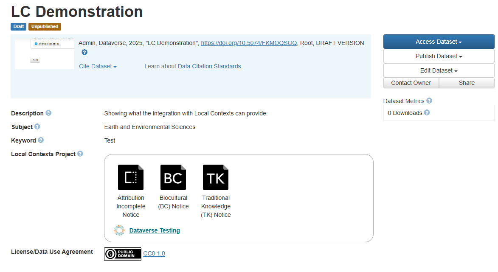

LocalContexts Integration
=========================

.. contents:: |toctitle|
  :local:

`Local Contexts <https://localcontexts.org/>`_ is a global initiative that supports Indigenous communities in the management and sharing of their cultural heritage and data.
The `Local Contexts Hub <https://localcontextshub.org/>`_ is a platform that enables the creation and application of Traditional Knowledge (TK) and Biocultural (BC) Labels and Notices.
These labels and notices help to communicate the cultural context and appropriate use of Indigenous data and cultural heritage materials.

Dataverse supports integration with the Local Contexts Hub so that Labels and Notices associated with a dataset can be displayed on the dataset page:

Configuration
-------------

There are several steps to LocalContexts integration.

First, you need to configure the LOCALCONTEXTS_URL and LOCALCONTEXTS_API_KEY as described in the :ref:`localcontexts` section of the Configuration Guide.
API Keys are available to Local Contexts Integration Partners - see https://localcontexts.org/hub-agreements/integration-partners/ for details.

Next, you should add the Local Contexts metadatablock and configure the associated external vocabulary script.
The metadatablock contains one field allowing Dataverse to store the URL of an associated Local Contexts Hub project.
The external vocabulary script interacts with the Local Contexts Hub (via the Dataverse server) to display the Labels and Notices associated with the proect and provide a link to it.
The script also supports adding/removing such a link from the dataset's metadata. Note that only a project that references the dataset in its `publication_doi` field can be linked to a dataset. 
See https://github.com/gdcc/dataverse-external-vocab-support/blob/main/packages/local_contexts/README.md for details on these steps.

Lastly, if you wish the Local Contexts information to be shown in the summary section of the dataset page, as shown in the image above, you should add `LCProjectUrl` to list of custom summary fields via use of the :ref:`:CustomDatasetSummaryFields` setting.

Optionally, one could also set the dataverse.feature.add-local-contexts-permission-check FeatureFlag to true. This assures that only users editing datasets can use the LocalContexts search functionality.
However, as this currently would also require setting the dataverse.feature.api-session-auth, the security implications of which haven't been fully explored, it is not recommended unless problematic use is seen.
(When API access via OpenIdConnect is available, use of api-session-auth would not be required.)

