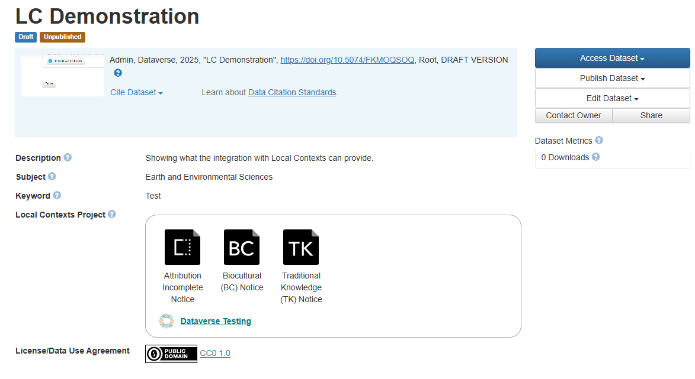

LocalContexts Integration
=========================

.. contents:: |toctitle|
  :local:

`Local Contexts <https://localcontexts.org/>`_ is a global initiative that supports Indigenous communities in the management and sharing of their cultural heritage and data.
The `Local Contexts Hub <https://localcontextshub.org/>`_ is a platform that enables the creation and application of Traditional Knowledge (TK) and Biocultural (BC) Labels and Notices.
These labels and notices help to communicate the cultural context and appropriate use of Indigenous data and cultural heritage materials.

Dataverse supports integration with the Local Contexts Hub so that Labels and Notices associated with a dataset can be displayed on the dataset page:

Configuration
-------------

There are several steps to LocalContexts integration.

- A Local Contexts Hub Institutional or Integration Partner account is required. See https://localcontexts.org/hub-agreements for more information and the associated costs.
  (Institutions may wish to connect their Institutional accounts with `The Dataverse Project Integration Partner <https://localcontexts.org/integration-partners/view/12>`_ rather than having their own Integration Partner account.)
  (Free accounts for testing can be created at https://sandbox.localcontextshub.org/.)
- Create an API key in your Local Contexts account.
- Configure the DATAVERSE_LOCALCONTEXTS_URL and DATAVERSE_LOCALCONTEXTS_API_KEY as described in the :ref:`localcontexts` section of the Configuration Guide.
- Add the Local Contexts metadatablock and configure the associated external vocabulary script. Both are available, along with installation instructions, in the `Dataverse External Vocabulary GitHub Repository <https://github.com/gdcc/dataverse-external-vocab-support/blob/main/packages/local_contexts/README.md>`_.
  The metadatablock contains one field allowing Dataverse to store the URL of an associated Local Contexts Hub project. Be sure to update the Solr schema after installing the metadatablock (see :ref:`update-solr-schema`).
  The external vocabulary script interacts with the Local Contexts Hub (via the Dataverse server) to display the Labels and Notices associated with the proect and provide a link to it.
  The script also supports adding/removing such a link from the dataset's metadata. Note that only a project that references the dataset's PID in its `Optional Project Information` field can be linked to a dataset.
  Note that the Local Contexts script configuration JSON must be edited to include your Dataverse server's URL and the Local Contexts API key you use in Dataverse. (The latter is optional but it must be included for Dataverse to add information about Notices and Labels to exported metadata and the metadata sent to DataCite for DOIs.) 
- Lastly, to show Local Contexts information in the summary section of the dataset page, as shown in the image above, you should add `LCProjectUrl` to list of custom summary fields via use of the :ref:`:CustomDatasetSummaryFields` setting.
- Optionally, one can also set the dataverse.feature.add-local-contexts-permission-check FeatureFlag to true. This assures that only users editing datasets can use the LocalContexts search functionality (e.g. via API).
  This is not recommended unless problematic use is seen.

