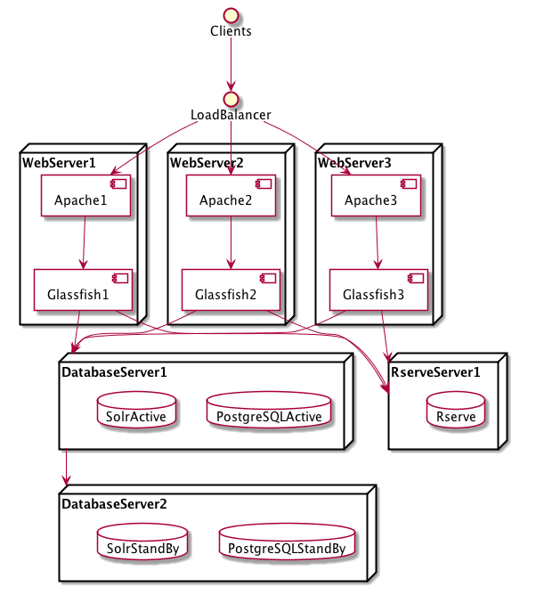

===========
Preparation
===========

::

> "What are you preparing? You're always preparing! Just go!" -- Spaceballs

We'll try to get you up and running as quickly as possible, but we thought you might like to hear about your options. :)

.. contents:: |toctitle|
	:local:

Choose Your Own Installation Adventure
--------------------------------------

Standard Installation
+++++++++++++++++++++

Installing the Dataverse Software involves some system configuration followed by executing an installation script that will guide you through the installation process as described in :doc:`installation-main`, but reading about the :ref:`architecture` of the Dataverse Software is recommended first.

.. _advanced:

Advanced Installation
+++++++++++++++++++++

There are some community-lead projects to use configuration management tools such as Ansible and Puppet to automate the installation and configuration of the Dataverse Software, but support for these solutions is limited to what the Dataverse Community can offer as described in each project's webpage:

- https://github.com/GlobalDataverseCommunityConsortium/dataverse-ansible
- https://gitlab.com/lip-computing/dataverse
- https://github.com/IQSS/dataverse-puppet

(Please note that the "dataverse-ansible" repo is used in a script that allows the Dataverse Software to be installed on Amazon Web Services (AWS) from arbitrary GitHub branches as described in the :doc:`/developers/deployment` section of the Developer Guide.)

The Dataverse Project team is happy to "bless" additional community efforts along these lines (i.e. Docker, Chef, Salt, etc.) by creating a repo under https://github.com/gdcc and managing team access.

The Dataverse Software permits a fair amount of flexibility in where you choose to install the various components. The diagram below shows a load balancer, multiple proxies and web servers, redundant database servers, and offloading of potentially resource intensive work to a separate server. (Glassfish is shown rather than Payara.)

|3webservers|

A setup such as this is advanced enough to be considered out of scope for this guide (apart from a stub in the :doc:`advanced` section) but you are welcome to ask questions about similar configurations via the support channels listed in the :doc:`intro`.

.. _architecture:

Architecture and Components
---------------------------

The Dataverse Software is a Java Enterprise Edition (EE) web application that is shipped as a WAR (Web ARchive) file. This WAR file is deployed to an application server or app server.

Required Components
+++++++++++++++++++

When planning your installation you should be aware of the following components of the Dataverse Software architecture:

- Linux: RHEL or derivative is highly recommended since all development and QA happens on this distribution.
- App server: Payara is the recommended Jakarta EE application server.
- PostgreSQL: a relational database.
- Solr: a search engine. A Dataverse Software-specific schema is provided.
- SMTP server: for sending mail for password resets and other notifications.
- Persistent identifier service: DOI and Handle support are provided. Production use requires a registered DOI or Handle.net authority.
- Rserve: runs as a daemon to execute R code.

Optional Components
+++++++++++++++++++

There are a number of optional components you may choose to install or configure, including:

- External Tools: Third party tools for data exploration can be added to the Dataverse installation by following the instructions in the :doc:`/admin/external-tools` section of the Admin Guide.
- Dropbox integration :ref:`dataverse.dropbox.key`: for uploading files from the Dropbox API.
- Apache: a web server that can "reverse proxy" Jakarta EE applications (like the Dataverse Software) and rewrite HTTP traffic.
- Shibboleth: an authentication system described in :doc:`shibboleth`. Its use with a Dataverse installation requires Apache.
- OAuth2: an authentication system described in :doc:`oauth2`.

See also the :doc:`/admin/integrations` section of the Admin Guide.

System Requirements
-------------------

Hardware Requirements
+++++++++++++++++++++

A basic Dataverse installation runs fine on modest hardware. For example, in the recent past we had a test instance backed by a single virtual machine with two 2.8 GHz processors, 8 GB of RAM and 50 GB of disk.

In contrast, before we moved it to the Amazon Cloud, the production installation at https://dataverse.harvard.edu was backed by six servers with two Intel Xeon 2.53 Ghz CPUs and either 48 or 64 GB of RAM. The three servers with 48 GB of RAM run were web frontends running Glassfish 4 and Apache and were load balanced by a hardware device. The remaining three servers with 64 GB of RAM were the primary and backup database servers and a server dedicated to running Rserve. Multiple TB of storage were mounted from a SAN via NFS.

Currently, the Harvard Dataverse Repository is served by four AWS server nodes

- two instances for web frontends running Payara fronted by Apache ("m4.4xlarge" with 64 GB RAM and 16 vCPUs)

  - these are sitting behind an AWS ELB load balancer

- one instance for the Solr search engine ("m4.2xlarge" with 32 GB RAM and 8 vCPUs)
- one instance for R ("m4.xlarge" instances with 16 GB RAM and 4 vCPUs)

The PostgreSQL database is served by Amazon RDS.

Physical files are stored on Amazon S3. The primary bucket is replicated in real-time to a secondary bucket, which is backed up to Glacier. Deleted files are kept around on the secondary bucket for a little while for convenient recovery. In addition, we use a backup script mentioned under :doc:`/admin/backups`.

Experimentation and testing with various hardware configurations is encouraged, or course. Note that the installation script will attempt to give your app server (the web frontend) the right amount of RAM based on your system.

Software Requirements
+++++++++++++++++++++

See :ref:`architecture` for an overview of required and optional components. The :doc:`prerequisites` section is oriented toward installing the software necessary to successfully run the Dataverse Software installation script. Pages on optional components contain more detail of software requirements for each component.

Clients are expected to be running a relatively modern browser.

Decisions to Make
-----------------

Here are some questions to keep in the back of your mind as you test and move into production:

- How much storage do I need?
- Which features do I want based on :ref:`architecture`?
- How do I want my users to log in to the Dataverse installation? With local accounts? With Shibboleth/SAML? With OAuth providers such as ORCID, GitHub, or Google?
- Do I want to to run my app server on the standard web ports (80 and 443) or do I want to "front" my app server with a proxy such as Apache or nginx? See "Network Ports" in the :doc:`config` section.
- How many points of failure am I willing to tolerate? How much complexity do I want?
- How much does it cost to subscribe to a service to create persistent identifiers such as DOIs or handles?
- What licenses should I make available to my users?

Next Steps
----------

Proceed to the :doc:`prerequisites` section which will help you get ready to run the Dataverse Software installation script.

