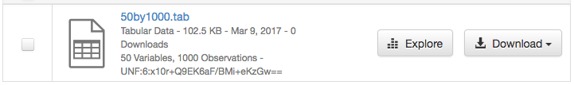
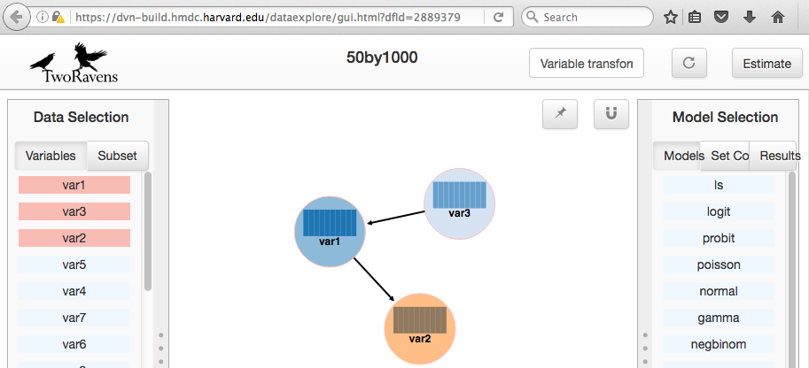
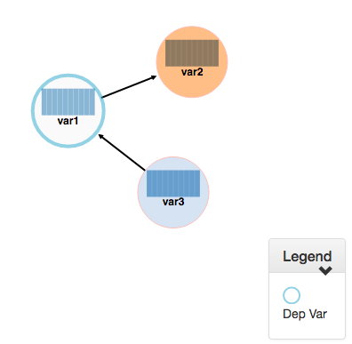
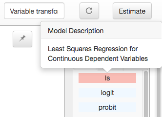
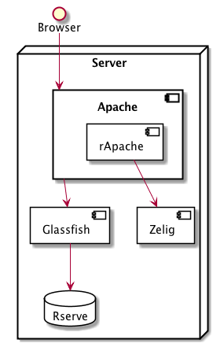

.. role:: fixedwidthplain

TwoRavens
=========

TwoRavens is a web application for tabular data exploration and statistical analysis.
It can be integrated with your Dataverse installation, as an **optional** component.  While TwoRavens was originally created at IQSS, its developers have since left the organization. Plans for the future of the Dataverse Project/TwoRavens collaboration are still being worked out. As such, **support for TwoRavens is somewhat limited at the
moment (as of Spring of 2017).**

Please note that in the text below, Glassfish was changed to Payara but not tested.

Any questions regarding the features of TwoRavens, bug reports and
such, should be addressed directly to the developers of the
application.  The `TwoRavens GitHub repository
<https://github.com/IQSS/TwoRavens>`_ and the `TwoRavens project page
<http://2ra.vn/community/index.html>`_ are good places to start.

For now, the Dataverse Project team will continue providing 
installation and integration support. We have created a new (as
of Dataverse Software 4.6.1) version of the installer scripts and updated this guide. We have tried to improve and simplify the
installation process, particularly the difficult process of installing
correct versions of the required third party R packages.

**Note that the installation process below supersedes the basic R
setup described in the "Prerequisites" portion of the Installation
Guide. Meaning that once completed, it installs everything needed to
run TwoRavens, PLUS all the libraries and components required to
ingest RData files and export as RData.**

Please be warned: 

- This process may still require some system administration skills. 
- The guide below is very Linux-specific. This process has been tested
  on RedHat/CentOS servers only. In some ways it *may* actually be
  easier to get it all installed on MacOS X (because
  MacOS X versions of third party R packages are available
  pre-compiled), or even on Windows. But it hasn't been attempted, and
  is not supported by the Dataverse Project team.

In addition to the TwoRavens web application proper, several required
components need to be installed and configured. This includes R,
rApache and a collection of required third-party R packages. The
installation steps for these components are described in the
individual sections of the document below.

.. contents:: |toctitle|
  :local:

0. Overview
+++++++++++

TwoRavens is itself a compact JavaScript application that **runs on the user's 
browser**. These JavaScript files, and the accompanying HTML, CSS, etc. files 
are served by an HTTP server (Apache) as static objects. 

The statistical calculations are performed by R programs that run **on the server**. 
`rApache <http://rapache.net/>`_ is used as the web front end for R on the server, so 
that the browser application can talk to R over HTTP. 

See the :ref:`advanced` section of :doc:`prep` for an example of running various components on more than one server.

TwoRavens will need to obtain some tabular-data-specific metadata from 
the Dataverse installation -- the DDI fragment that describes the variables and some pre-processed summary statistics for the data vectors. In order to produce the latter, the Dataverse Software application also needs to be able to execute some R code on the server. Instead of 
``rApache``, the Dataverse Software uses `Rserve <https://rforge.net/Rserve/>`_ to 
communicate to R. Rserve is installed as a "contributor" R package. It runs as a 
daemon process on the server, accepting network connections on a dedicated port. 
The Dataverse Software supplies an :fixedwidthplain:`init.d`-style startup file for the 
daemon. The R setup in step ``2.`` will set it up so that the daemon gets started
automatically when the system boots. 

When a user requests to run 
a statistical model on a data file, TwoRavens will instruct the R code on the 
server to download the file **directly from the Dataverse Software application**. Access 
URLs need to be configured for this to work properly (this is done by the TwoRavens 
installer script in step ``3.``)  

If you install all components on a single server and front the app server with Apache 
(see :ref:`network-ports` under the :doc:`config` section), the component and 
data flow diagram might looks something like this:

|tworavens_components|

In addition to Rserve, there are 14 more R library packages that the TwoRavens R 
code requires in order to run. These in turn require 30 more as their own dependencies, 
so a total of 45 packages must be installed. "Installed" in the 
context of an R package means R must download the **source code** from the `CRAN 
<https://cran.r-project.org/>`_ code repository and compile it locally. This
historically has been the trickiest, least stable part of the installation process, 
since the packages in question are being constantly (and independently) developed. 
This means that every time you attempt to install these packages, you are building  
from potentially different versions of the source code. An incompatibility introduced 
between any two of the packages can result in a failure to install. In this release 
we have attempted to resolve this by installing the **specific  versions of the R 
packages that have been proven** to work together. If you have attempted to 
install TwoRavens in the past, and it didn't work, please see the part of 
section ``1.b.`` where we explain how to completely erase all the previously 
built packages.
 
1. Prerequisites
++++++++++++++++

a. httpd (Apache): 
------------------

It's probably installed already, but if not: 

``yum install httpd``

This rApache configuration does not work with SELinux. Execute the following commands 
to disable SELinux: 

``setenforce permissive``

``getenforce``

(Note: If you can get rApache to work with SELinux, we encourage you to make a pull request! Please see the :doc:`/developers/selinux` section of the Developer Guide to get started.)

If you choose to serve TwoRavens and run rApache under :fixedwidthplain:`https`, a "real" signed certificate (as opposed to self-signed) is recommended. 

For security reasons, directory listing needs to be disabled on the web documents folder served by Apache: 

In the main Apache configuration file (``/etc/httpd/conf/httpd.conf`` in the default setup), find the section that configures your web directory. For example, if the ``DocumentRoot``, defined elsewhere in the file, is set to the default ``"/var/www/html"``, the opening line of the section will look like this:

``<Directory "/var/www/html">`` 

Find the ``Options`` line in that section, and make sure that it doesn't contain the ``Indexes`` statement. 
For example, if the options line in your configuration is 

``Options Indexes FollowSymLinks``

change it to 

``Options FollowSymLinks``

b. R:
-----

The simplest way to install R on RHEL/CentOS systems is with yum, using the EPEL repository::

       yum install epel-release
       yum install R-core R-core-devel

Both EPEL6 and EPEL7 currently provide R 3.5, which has been tested and appears to work well. R 3.4, offered by EPEL until also works well. We recommend using the currently available EPEL version for all the new installations. But if you already have a working R 3.4 installation from EPEL and you don't have a specific need to upgrade, you may lock that version in place using the ``yum-versionlock`` yum plugin, or simply add this line to the "epel" section of /etc/yum.repos.d/epel.repo::

	exclude=R-*,openblas-*,libRmath*

RHEL users may need to log in to their organization's respective RHN interface, find the particular machine in question and:

• click on "Subscribed Channels: Alter Channel Subscriptions"
• enable EPEL, Server Extras, Server Optional

If you are upgrading an existing installation of TwoRavens, or if you have attempted to 
install it in the past and it didn't work, **we strongly recommend reinstalling 
R completely**, erasing all the extra R packages that may have been already built. 

Uninstall R::

        yum erase R-core R-core-devel

Wipe clean any R packages that were left behind:: 

        rm -rf /usr/lib64/R/library/*
        rm -rf /usr/share/R/library/*

... then re-install R with :fixedwidthplain:`yum install`

c. rApache: 
-----------

We maintain the following rpms of rApache, built for the following version of RedHat/CentOS distribution:

For RHEL/CentOS 6 and R 3.4, download :download:`rapache-1.2.6-rpm0.x86_64.rpm <../_static/installation/files/home/rpmbuild/rpmbuild/RPMS/x86_64/rapache-1.2.6-rpm0.x86_64.rpm>` and install it with::

	yum install rapache-1.2.6-rpm0.x86_64.rpm

For RHEL/CentOS 6 and R 3.5, download :download:`rapache-1.2.9_R-3.5-RH6.x86_64.rpm <../_static/installation/files/home/rpmbuild/rpmbuild/RPMS/x86_64/rapache-1.2.9_R-3.5-RH6.x86_64.rpm>` and install it with::

	yum install rapache-1.2.9_R-3.5-RH6.x86_64.rpm

If you are using RHEL/CentOS 7 and R 3.4, download :download:`rapache-1.2.7-rpm0.x86_64.rpm <../_static/installation/files/home/rpmbuild/rpmbuild/RPMS/x86_64/rapache-1.2.7-rpm0.x86_64.rpm>` and install it with::

	yum install apache-1.2.7-rpm0.x86_64.rpm

If you are using RHEL/CentOS 7 in combination with R 3.5, download :download:`rapache-1.2.9_R-3.5.x86_64.rpm <../_static/installation/files/home/rpmbuild/rpmbuild/RPMS/x86_64/rapache-1.2.9_R-3.5.x86_64.rpm>` and install it with::

       	yum install rapache-1.2.9_R-3.5.x86_64.rpm

**Please note:** 
The rpms above cannot be *guaranteed* to work on your
system. You may have a collection of system libraries installed on
your system that will create a version conflict. If that's the case,
or if you are trying to install on an operating system that's listed
above, do not despair: simply build rApache from `source
<http://rapache.net/downloads.html>`_ . **Make sure** to build with
the R that's the same version you are planning on using.

d. Install the build environment for R:
---------------------------------------

Once again, extra R packages will need to be built from sources. Make sure you have the standard GNU compilers installed: ``gcc``, ``gcc-c++`` and ``gcc-gfortran``. 

One of the required packages needed :fixedwidthplain:`/bin/ed`. The R package build script needs :fixedwidthplain:`/usr/bin/wget`. If these are missing, the rpms can be installed with::

        yum install ed wget

Depending on how your system was originally set up, you may end up needing to install some other missing rpms. We'll explain how to troubleshoot compiler errors caused by missing libraries and/or executables. 

2. Install Extra R Packages
+++++++++++++++++++++++++++

We provide a shell script (``r-setup.sh``) that will try to install all the needed packages. **Note:** the script is now part of the TwoRavens distribution (it **used to be** in the Dataverse Software source tree). 

The script will attempt to download the packages from CRAN (or a mirror), so the system must have access to the Internet.

In order to run the script: 

Download the current snapshot of the "dataverse-distribution" branch
of TwoRavens from github:
`https://github.com/IQSS/TwoRavens/archive/dataverse-distribution.zip
<https://github.com/IQSS/TwoRavens/archive/dataverse-distribution.zip>`_.
Once again, it is important that you download the
"dataverse-distribution" branch, and NOT the master distribution!
Unpack the zip file, then run the script::

        unzip dataverse-distribution.zip
        cd TwoRavens-dataverse-distribution/r-setup
        chmod +x r-setup.sh
        ./r-setup.sh

See the section ``II.`` of the Appendix for trouble-shooting tips. 

For the Rserve package the setup script will also create a system user
:fixedwidthplain:`rserve`, and install the startup script for the
daemon (``/etc/init.d/rserve``).  The script will skip this part, if
this has already been done on this system (i.e., it should be safe to
run it repeatedly).

Note that the setup will set the Rserve password to :fixedwidthplain:`"rserve"`. 
Rserve daemon runs under a non-privileged user id, and there appears to be a 
very limited potential for security damage through unauthorized access. It is however 
still a good idea **to change the password**. The password is specified in ``/etc/Rserv.pwd``. 
Please see `Rserve documentation <https://rforge.net/Rserve/doc.html>`_ for more 
information on password encryption and access security. 
 
Make sure the rserve password is correctly specified in the ``domain.xml`` of your Dataverse installation::

        <jvm-options>-Ddataverse.rserve.password=...</jvm-options>

3. Install the TwoRavens Application
++++++++++++++++++++++++++++++++++++

a. download and unzip the application
-------------------------------------

(though you may have already done so, in step ``2.`` above - see the instructions there). 

b. Rename the resulting directory "dataexplore" ...
--------------------------------------------------------

...and place it in the web root directory of your apache server. We'll assume ``/var/www/html/dataexplore`` in the examples below::

        mv TwoRavens-dataverse-distribution /var/www/html/dataexplore

c. run the installer
--------------------

A scripted, interactive installer is provided at the top level of the TwoRavens 
distribution. 

The installer will ask you to provide the following:

===================== ================================    ===========  
Setting               default                             Comment
===================== ================================    ===========  
TwoRavens directory   ``/var/www/html/dataexplore``       File directory where TwoRavens is installed.
Apache config dir.    ``/etc/httpd``                      rApache config file for TwoRavens will be placed under ``conf.d/`` there.
Apache web dir.       ``/var/www/html``                   
rApache/TwoRavens URL ``http://{your hostname}:80``       URL of the Apache server hosting TwoRavens and rApache.
Dataverse URL         ``http://{your hostname}:8080``     URL of the Dataverse installation that integrates with this TwoRavens installation.
===================== ================================    =========== 

Please note the default values above. The installer assumes 

- that you are running both the Dataverse installation and TwoRavens/rApache on the same host; 
- the default ports for Apache (80) and the app server that is serving your Dataverse installation (8080); 
- ``http`` (not ``https``!) for both . 

This configuration is recommended if you are simply trying out/testing Dataverse Software
and TwoRavens. Accept all the defaults, and you should have a working installation 
in no time.

However, if you are planning to use this installation to actually serve data to 
users, you'll most likely want to run under HTTPS. Please refer to the discussion 
in the Appendix, ``I.`` for more information on setting it up. Configuring HTTPS 
takes a little extra work. But note that the TwoRavens configuration 
can actually end up being simpler. If you use our recommended configuration for 
HTTPS (described in the Appendix), both the "TwoRavens URL" and "Dataverse URL" 
**will be the same**: ``https://{your hostname}``.

Run the installer as::

   cd /var/www/html/dataexplore
   chmod +x install.pl
   ./install.pl

Once everything is installed and configured, the installer script will print out a confirmation message with the URL of the TwoRavens application. For example:: 

        The application URL is https://server.dataverse.edu/dataexplore/gui.html

d. Version conflict check  (preprocess.R)
-----------------------------------------

One of the R files in the TwoRavens distribution, ``rook/preprocess/preprocess.R`` is used by both TwoRavens and 
the Dataverse installation. The Dataverse installation maintains its own copy of the file, ``<DOMAIN DIRECTORY>/applications/dataverse-<VERSION>/WEB-INF/classes/edu/harvard/iq/dataverse/rserve/scripts/preprocess.R``. 
(Why not share the file from the same location? Because the two applications 
can potentially be installed on 2 different servers).
Compare the two files. **It is important that the two copies are identical**. 

**If different**: 

- the **TwoRavens version wins**. Meaning, you need to copy the version supplied with this TwoRavens distribution and overwrite the app server version (above); then restart the app server. 

- unless this is a brand new Dataverse installation, it may have cached summary statistics fragments that were produced with the older version of this R code. You **must remove** all such cached files::

        cd <DATAVERSE FILES DIRECTORY>
        find . -name '*.prep' | while read file; do /bin/rm $file; done

*(Yes, this is a HACK! We are working on finding a better way to ensure this compatibility between 
TwoRavens and the Dataverse Software!)*

e. Enable TwoRavens in a Dataverse Installation
-----------------------------------------------

Now that you have installed TwoRavens, you can make it available to your users by adding it an "external tool" for your Dataverse installation. (For more on external tools in general, see the :doc:`/admin/external-tools` section of the Admin Guide.)

First, download :download:`twoRavens.json <../_static/installation/files/root/external-tools/twoRavens.json>` as a starting point and edit ``toolUrl`` in that external tool manifest file to be the URL where you want TwoRavens to run. This is the URL reported by the installer script (as in the example at the end of step ``c.``, above).

Once you have made your edits, make the tool available within your Dataverse installation with the following curl command (assuming ``twoRavens.json`` is in your current working directory):

``curl -X POST -H 'Content-type: application/json' --upload-file twoRavens.json http://localhost:8080/api/admin/externalTools``

Once enabled, TwoRavens will display as an explore tool option for tabular data files. Clicking it will redirect the user to the instance of TwoRavens, initialized with the data variables from the selected file.

f. Perform a quick test of TwoRavens functionality
--------------------------------------------------

Ingest the dummy data file ``50by1000.dta`` (supplied in the Dataverse Software source tree in ``dataverse/scripts/search/data/tabular``). If successfully ingested as tabular data, 
the file should appear on the Dataset page as follows: 

|tworavens_test_file_ingested|

If the file does NOT appear as Tabular Data - if it is shown as Stata/dta, 
and no tabular attributes - the numbers of Variables and Observations and the UNF - 
are being displayed, try to refresh the page a couple of times. If that doesn't 
change the view to Tabular, it likely means that something went very wrong with the 
tabular ingest. Consult the app server log for any error messages that may 
explain the failure. 

If the file type is tabular data, but TwoRavens is not displayed as an explore tool option, 
double-check that the steps in ``e.``, above, were correctly performed. 

Selecting the TwoRavens explore tool option will open TwoRavens in a new browser window.
If the application initializes successfully, you should see the "data pebbles" representing 
the first 3 variables in the file: 

|tworavens_test_init| 

If instead TwoRavens opens with an empty view - no variables listed on the left, and/or no "data pebbles" in the middle panel, we'll provide some diagnostics tips further below.

Otherwise, mouse over ``var1``, and click on ``Dep Var``, selecting the variable as "dependent": 

|tworavens_test_select_var| 

Then select ``ls`` from the list of models on the right: 

|tworavens_test_select_model|

Then click the ``Estimate`` button, above. If the model is successfully executed, 
the results will appear in a new popup panel, with some generated graph images, as shown below:

|tworavens_test_output|

**Troubleshooting:**

If TwoRavens fails to initialize properly: 

Symptom: instead of the "data pebbles" display shown in the second image, above, you are getting an empty view: 

|tworavens_test_empty|

A very likely cause of this condition is TwoRavens not being able to obtain the metadata describing the variables from your Dataverse installation. 
Specifically, the "preprocessed summary statistics". 

To diagnose: note the value of the ``dfId`` URL parameter in the view above. 
Try to request the preprocessed fragment by going to the API end point directly:: 

        <YOUR DATAVERSE INSTALLATION URL>/api/access/datafile/<FILE ID>?format=prep

Where the :fixedwidthplain:`<FILE ID>` is the value of the :fixedwidthplain:`dfId` parameter from the previous view. 
You should get the output that looks like this::

        {"dataset":{"private":false},"variables":{"var1":{"plottype":"bar","plotvalues":{"1":100,"2":100,"3":100,"4":100,"5":100,"6":100,"7":100,"8":100,"9":100,"10":100},"varnamesSumStat":"var1","median":5.5,"mean":5.5,"mode":"1","max":10,"min":1,"invalid":0,"valid":1000,"sd":2.87371854193452,"uniques":10,"herfindahl":0.1,"freqmode":100,"fewest":"1","mid":"1","freqfewest":"100","freqmid":"100","numchar":"numeric","nature":"ordinal","binary":"no","interval":"discrete","varnamesTypes":"var1","defaultInterval":"discrete","defaultNumchar":"numeric","defaultNature":"ordinal","defaultBinary":"no"},"var3":{"plottype":"bar","plotvalues":
        ...

If you are getting an error message instead, this is likely an Rserve connection problem. 
Consult the app server log for any Rserve-related "connection refused" messages. 
See if Rserve is running, and start it with ``service rserve start``, if necessary. 
Check if the Rserve host name, username and password in the app server configuration match 
the actual Rserve configuration. (this is discussed in the section ``2.`` of the guide). 
Correct this, if necessary, then try again. 

If you ARE getting JSON output, but the TwoRavens view is still broken: 

- Look closely at the very beginning of the JSON fragment. Does it have the ``{"private":false}`` entry, as shown in the example above? If not, this likely an R code version mismatch, described in section ``3.d.``, above. Correct the problem as described there, then try again. 

- If the JSON looks *exactly* as the fragment above, yet still no data pebbles - enable the JavaScript error console in the TwoRavens window, and try again. Look for any error messages; and, specifically, for any URLs that TwoRavens is failing to access. Look for the debugging entry that shows TwoRavens attempting to download the ``format=prep`` fragment. Does the URL have the correct host name, port and/or the protocol (http vs. https)? If not, re-run the installer, specifying the correct Dataverse installation URL, and try again. 

Symptom: the variables view is initialized properly, but no model output appears when you click ``Estimate``, with or without error messages. 

- Make sure you properly selected the dependent variable (:fixedwidthplain:`var1`) and the model (:fixedwidthplain:`ls`). 

- Consult the Apache error log files (``error_log`` and/or ``ssl_error_log``, in ``/var/log/httpd``) for any error messages. Possible error condition may include: missing R packages (double-check that the R setup, in step ``2.`` completed without errors); ``selinux`` ("Secure Linux") errors related to the rApache shared libraries, or directory permissions (disable Selinux, as described in ``1.a.``)

4. Appendix
+++++++++++

I. Ports configuration discussion
---------------------------------

By default, the app server will install itself on ports 8080 and 8181 (for
``HTTP`` and ``HTTPS``, respectively). Apache will install itself on port 80 
(the default port for ``HTTP``). Under this configuration, your Dataverse installation will 
be accessible at ``http://{your host}:8080``, and rApache at 
``http://{your host}/``. The TwoRavens installer, above, will default to these 
values (and assume you are running both the Dataverse installation and TwoRavens/rApache on 
the same host).

This configuration is the easiest to set up if you are simply
trying out/testing the Dataverse Software and TwoRavens integration. Accept all the
defaults, and you should have a working installation in no
time. However, if you are planning to use this installation to
actually serve data to real users, you will most likely want to run your Dataverse installation on a standard port; and to use ``HTTPS``. It is definitely possible to configure 
the app server to serve the application under ``HTTPS`` on port 443. However, we 
**do not recommend** this setup! For at least 2 reasons: 1. Running the app server on 
port 443 will require you to **run it as root** user; which should be avoided, 
if possible, for reasons of security. Also, 2) installing ``SSL`` certificates under 
the app server is unnecessarily complicated. The alternative configuration that 
we recommend is to "hide" your app server behind Apache. In this setup Apache 
serves as the ``HTTPS`` front running on port 443, proxying the traffic to 
the app server using ``mod_proxy_ajp``; and the app server is running as 
an non-privileged user on a high port that's not accessible from the outside. 
Unlike the app server, Apache has a mechanism for running on a privileged port (in 
this case, 443) as a non-privileged user. It is possible to use this 
configuration, and have this Apache instance serve TwoRavens and rApache too, 
all on the same server. Please see :ref:`network-ports` under the :doc:`config` 
section, and the :doc:`shibboleth` section of the Installation Guide for more 
information and configuration instructions.  

II. What the r-setup.sh script does:
------------------------------------

The script uses the list of 45 R library packages and specified
package versions, supplied in ``TwoRavens/r-setup/package-versions.txt`` to 
replicate the library environment that has been proven to work on Dataverse
installations.

If any packages fail to build, the script will alert the user. 

For every package, the (potentially verbose) output of the build process is saved in 
its own file, ``RINSTALL.{PACKAGE NAME}.LOG``. So if, for example, the package 
Zelig fails to install, the log file :fixedwidthplain:`RINSTALL.Zelig.LOG` should 
be consulted for any error messages that may explain the reason for the failure; 
such as a missing library, or a missing compiler, etc. Be aware that diagnosing 
compiler errors will require at least some programming and/or system administration 
skills. 

III. What the install.pl script does:
-------------------------------------

The steps below are performed by the ``install.pl`` script. **Provided for reference only!** 
The instruction below could be used to configure it all by hand, if necessary, or 
to verify that the installer has done it correctly. 
Once again: **normally you would NOT need to individually perform the steps below**!

TwoRavens is distributed with a few hard-coded host and directory names. So these 
need to be replaced with  the values specific to your system. 

**In the file** ``/var/www/html/dataexplore/app_ddi.js`` **the following 3 lines need to be 
edited:**

1. ``var production=false;``

   changed to ``true``;

2. ``hostname="localhost:8080";``

   changed to point to the Dataverse installation, from which TwoRavens will be obtaining the metadata and data files. (don't forget to change 8080 to the correct port number!)

3. ``var rappURL = "http://0.0.0.0:8000/custom/";``

   changed to the URL of your rApache server, i.e.

   ``"http(s)://<rapacheserver>:<rapacheport>/custom/";``

**In** ``dataexplore/rook`` **the following files need to be edited:**

``rookdata.R, rookzelig.R, rooksubset.R, rooktransform.R, rookselector.R, rooksource.R``

replacing *every* instance of ``production<-FALSE`` line with ``production<-TRUE``.
 
(yeah, that's why we provide that installer script...)

**In** ``dataexplore/rook/rooksource.R`` **the following line:**

``setwd("/usr/local/payara5/glassfish/domains/domain1/docroot/dataexplore/rook")``

needs to be changed to: 

``setwd("/var/www/html/dataexplore/rook")``

(or your :fixedwidthplain:`dataexplore` directory, if different from the above)

**In** ``dataexplore/rook/rookutils.R`` **the following lines need to be edited:**

``url <- paste("https://beta.dataverse.org/custom/preprocess_dir/preprocessSubset_",sessionid,".txt",sep="")``

and 

``imageVector[[qicount]]<<-paste("https://beta.dataverse.org/custom/pic_dir/", mysessionid,"_",mymodelcount,qicount,".png", sep = "")``

changing the URL to reflect the correct location of your rApache instance. make sure that the protocol (http vs. https) and the port number are correct too, not just the host name!

**Next, in order to configure rApache to serve several TwoRavens "mini-apps",** 

the installer creates the file ``tworavens-rapache.conf`` in the Apache's ``/etc/httpd/conf.d`` directory with the following configuration:

.. code-block:: none

   RSourceOnStartup "/var/www/html/dataexplore/rook/rooksource.R"
   <Location /custom/zeligapp>
      SetHandler r-handler
      RFileEval /var/www/html/dataexplore/rook/rookzelig.R:Rook::Server$call(zelig.app)
   </Location>
   <Location /custom/subsetapp>
      SetHandler r-handler
      RFileEval /var/www/html/dataexplore/rook/rooksubset.R:Rook::Server$call(subset.app)
   </Location>
   <Location /custom/transformapp>
      SetHandler r-handler
      RFileEval /var/www/html/dataexplore/rook/rooktransform.R:Rook::Server$call(transform.app)
   </Location>
   <Location /custom/dataapp>
      SetHandler r-handler
      RFileEval /var/www/html/dataexplore/rook/rookdata.R:Rook::Server$call(data.app)
   </Location>

**The following directories are created by the installer to store various output files produced by TwoRavens:**

.. code-block:: none

   mkdir --parents /var/www/html/custom/pic_dir
   
   mkdir --parents /var/www/html/custom/preprocess_dir
   
   mkdir --parents /var/www/html/custom/log_dir

**The ownership of the TwoRavens directories is changed to user** ``apache``:

.. code-block:: none

   chown -R apache.apache /var/www/html/custom

   chown -R apache /var/www/html/dataexplore

**Finally, the installer restarts Apache, for all the changes to take effect:**

``service httpd restart``

.. |tworavens_test_output| image:: ./img/tworavens_test_output.png
   :class: img-responsive

.. |tworavens_test_empty| image:: ./img/tworavens_test_empty.png
   :class: img-responsive

