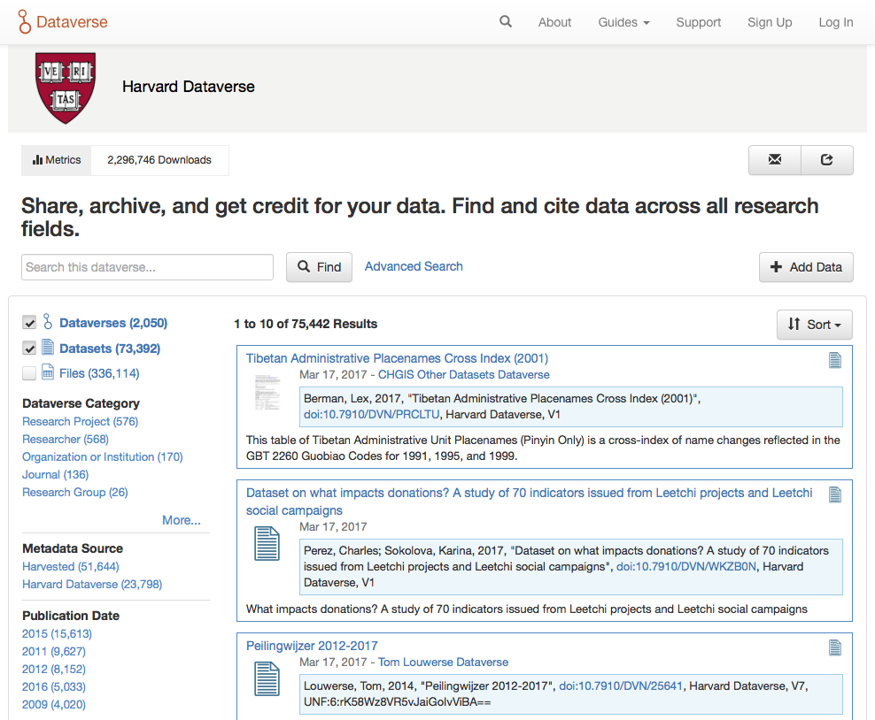

Foundations
+++++++++++

Words words words words. Words words words words.

|image1|

Grid Layout
===========

Words words words words. Words words words words.

* .container (fixed-width)
* .col-md-* Medium devices Desktops (≥992px)

Typography
==========

Words words words words. Words words words words.

* font-family: "Helvetica Neue",Helvetica,Arial,sans-serif;
* font-size: 14px;
* line-height: 1.42857143;

Colors
======

Words words words words. Words words words words.

Primary/Brand
-------------

Words words words words. Words words words words.

* .text-brand {color:#C55B28;}
* .bg-brand {background:#C55B28;}

Text
----

Words words words words. Words words words words.

* {color: #333;}

Links
-----

Words words words words. Words words words words.

* a {color: #337AB7;}
* a:hover {color: #23527C;}
* .ui-widget-content a {color: #428BCA;}
* .ui-widget-content a:hover, .ui-widget-content a:focus {color: #2A6496;}

Logos
=====

Words words words words. Words words words words.

* Dataverse (app)
* Dataverse (repository)
* Dataverse Project

Icons
=====

Words words words words. Words words words words.

Bootstrap
---------

Words words words words. Words words words words.

* Search
* Buttons
* Account
* Info
* Message block Help/Error/Success

Font Custom
-----------

Words words words words. Words words words words.

* Default dataverse, dataset
* File type

Socicon Font
------------

Words words words words. Words words words words.

* Footer icons Twitter, Github
* Sharrre icons Facebook, Twitter, Google Plus

