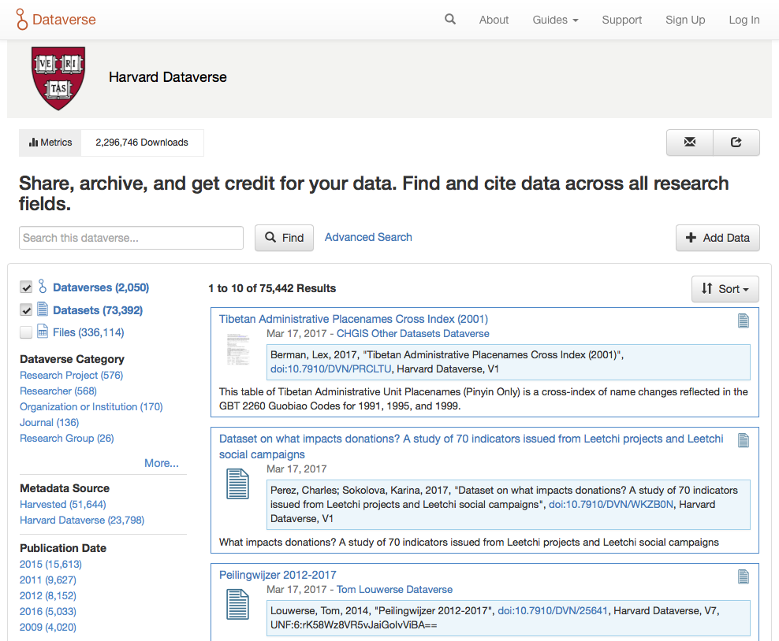

Patterns
++++++++

"A pattern is any self-contained set of markup and styles to make some of your site’s basic objects, like a call-out box used repeatedly, buttons, or the way you lay out a list of links horizontally."

Code samples can be found on the `Bootstrap <http://getbootstrap.com/css/>`_ and `PrimeFaces <https://www.primefaces.org/showcase/>`_ sites.

"Go through your site and add in patterns as you see them; you may use particular layouts over and over, or a media-object pattern, or a vertical list pattern. Below is an example for feature blocks. Look for similar things on your own site to document in your guide."

|image1|

Above The Fold
==============

Words words words words. Words words words words.

Navbar
------

Words words words words. Words words words words.

* Logo/Branding
* Search
* Links

Header
------

Words words words words. Words words words words.

* Name
* Logo
* Tagline

Breadcrumbs
-----------

Words words words words. Words words words words.

Title
-----

Words words words words. Words words words words.

* Dataset Title
* File Name

Description
-----------

Words words words words. Words words words words.

Content
=======

Words words words words. Words words words words.

Tabs
----

Words words words words. Words words words words.

* Dataset
* Files

Tables
------

Words words words words. Words words words words.

* DataTable
* Search Results
* Dataset Files

Panels
------

Words words words words. Words words words words.

* Citation
* Citation Summary Metadata
* Metrics
* "Why?" Manage Pg Default Text

Images
------

Words words words words. Words words words words.

* Responsive
* Dataverse Logo
* Dataset Thumbnail
* File Thumbnail + Preview

Buttons
-------

Words words words words. Words words words words.

* Action Buttons
* Form Buttons
* Textless-Icon-Only Buttons

.. raw:: html

	

	  

		<!-- Single button -->
		

		  <button type="button" class="btn btn-default dropdown-toggle" data-toggle="dropdown" aria-haspopup="true" aria-expanded="false">
		  	 
		    Action 
		  </button>
		  <ul class="dropdown-menu">
		    <li><a href="#">Action</a></li>
		    <li><a href="#">Another action</a></li>
		    <li><a href="#">Something else here</a></li>
		    <li role="separator" class="divider"></li>
		    <li><a href="#">Separated link</a></li>
		  </ul>
		

	  

	

.. code-block:: html

	<!-- Single button -->
	

	  <button type="button" class="btn btn-default dropdown-toggle" data-toggle="dropdown" aria-haspopup="true" aria-expanded="false">
	  	 
	    Action 
	  </button>
	  <ul class="dropdown-menu">
	    <li><a href="#">Action</a></li>
	    <li><a href="#">Another action</a></li>
	    <li><a href="#">Something else here</a></li>
	    <li role="separator" class="divider"></li>
	    <li><a href="#">Separated link</a></li>
	  </ul>
	

Forms
-----

Words words words words. Words words words words.

* Horizontal
* Labels
* Tooltips
* Inputs
* Validation

Alerts
------

Words words words words. Words words words words.

* Help
* Error
* Validation

.. raw:: html

	

	  

		

			
bg-primary

			
bg-success

			
bg-info

			
bg-warning

			
bg-danger

		

	  

	  
CODE HERE

	

.. code-block:: html

	
...

	
...

	
...

	
...

	
...

Popups
------

Words words words words. Words words words words.

* Small vs Large
* Confirmation vs Manage/Edit/Add

Footer
======

Words words words words. Words words words words.

Copyright
---------

Words words words words. Words words words words.

* Date + Owner

Links
-----

Words words words words. Words words words words.

* Privacy Policy

Dataverse Project
-----------------

Words words words words. Words words words words.

* Logo
* Version #

