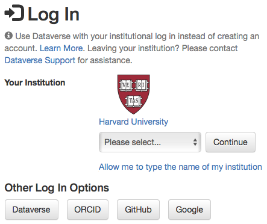
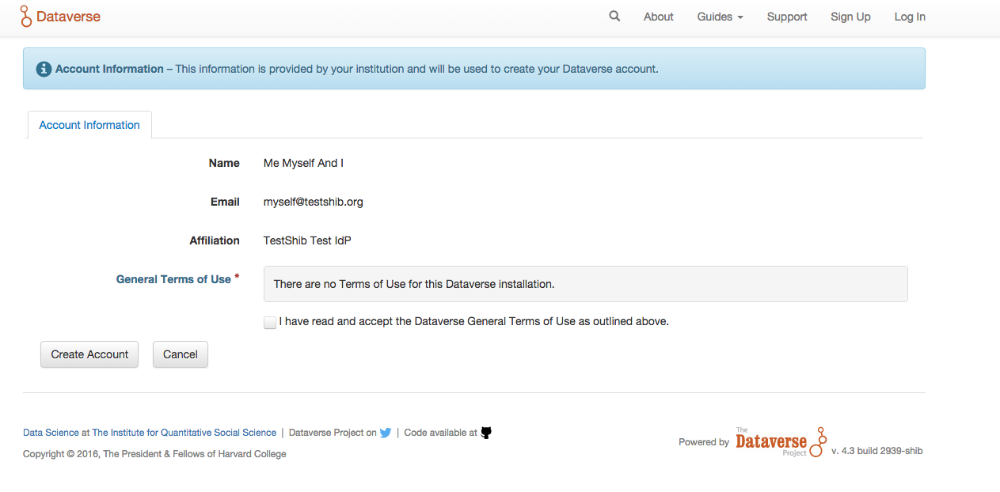
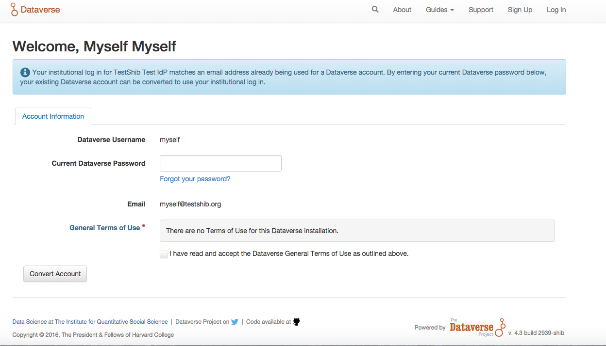
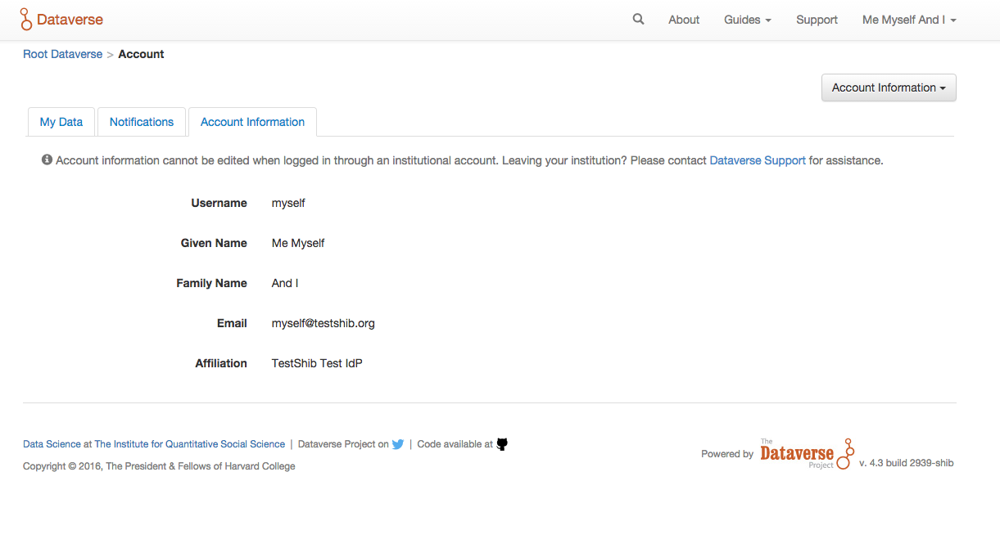

Account Creation & Management
+++++++++++++++++++++++++++++

As a registered user, you can:

-  Create your own dataverse and customize it
-  Add datasets to dataverses, if available
-  Contribute to existing datasets, if available
-  Request access to restricted files, if available

Create User Account
===================

#. In the top right corner of each page, click on the Sign Up link.
#. Fill out all the fields, then click the Create Account button at the end. Please note that the Username field does not support email addresses but will allow the following characters: a-Z, 0-9, _ (underscores), - (hyphens), and . (periods). Congrats you now have a Dataverse account!

Edit Your Account 
==================
#. To edit your account after you have logged in, click on your account name in the header on the right hand side and click on Account Information.
#. On the top right of your account page, click on the "Edit Account" button and from there you can select to edit either your Account Information or your Account Password.
#. Select "Save Changes" when you are done.

Institutional Log In
========================

Institutional log in allows you to use your log in information for your university (e.g. HarvardKey at Harvard) to log into your Dataverse account. By using your institutional log in, you won't have to remember your password for Dataverse or manage another account.

How to create a new Dataverse account using Institutional Log In
-------------------------------------------------------------------------------------------------

#. Go to “Log In” in the upper right corner of Dataverse.
#. Find this Institutional Log In box:|image1|
#. Using the dropdown menu, select your institution then click the Continue button.
#. You will be brought to your institution's log in page. After you put in your institutional information successfully, you will be brought back to Dataverse to confirm your account. |image2|

How to use your Institutional Log In for your Dataverse account
-------------------------------------------------------------------------------------------------

If you already have a Dataverse account, but you want to change it to use your institutional log in, you can easily do so as long as your account uses an email address from that institution.

#. Go to the Account Information page to confirm your account email address is the same as your institution email address. If not, you will need to update your account email address to be the same as your institution email address.
#. Log out of Dataverse.
#. Go to “Log In” in the upper right corner of Dataverse.
#. Find this Institutional Log In box: |image1|
#. Using the dropdown menu, select your institution then click the Continue button.
#. You will be brought to your institution's log in page. After you successfully input your institutional information, you will be brought back to Dataverse to review your account information. Enter your previous password for your Dataverse account to ensure that you have changed your login. |image3|
#. Once you click Change/Convert Account, you will have completed changing your Dataverse account to you use your institutional log in.

How to change your Dataverse account to no longer use Institutional Log In
-------------------------------------------------------------------------------------------------

If you are leaving your institution and need to change your account back to a Dataverse account, you will need to contact support for the Dataverse installation you are using. On your account page, there is a link that will open the contact form for Support: |image4|

Create Your API Token
========================
#. To create your API token, click on your name in the header on right hand side and then click on API Token.
#. In this tab, you can create your API Token for the first time as well as recreate it if you need a new API Token or your API Token becomes compromised.

My Data
========================
The My Data section of your account page displays a listing of all the dataverses, datasets, and files you have either created, uploaded or that you have access to edit. You are able to filter through all the dataverses, datasets, and files listed there using the filter box. You may also use the facets on the left side to only view a specific Publication Status or Role.

Notifications: Setup & Maintainance
===================================
Notifications appear in the notifications tab on your account page and are also displayed as a number next to your account name.

You will receive a notification when:

- You've created your account
- You've created a dataverse or added a dataset
- Another Dataverse user has requested access to a restricted file in one of your datasets

Dataverse will email your unread notifications once a day. Notifications will only be emailed one time even if you haven't read the notification on the Dataverse site.

Reset Your Account Password
==============================
If you cannot remember the password for your Dataverse account, click on Log In in the top right corner of any page. Once on that page, click on the "Forgot Password?" link below where you would enter your username and password. Enter your email address and click "Submit Password Request" to receive an email with a link to reset your password.

\*Note: if you have forgotten your username, you can do this same process to receive your username in an email.

