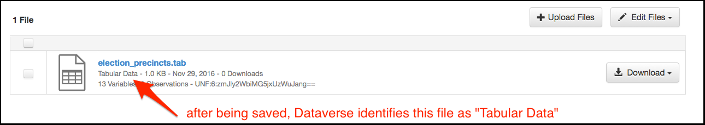
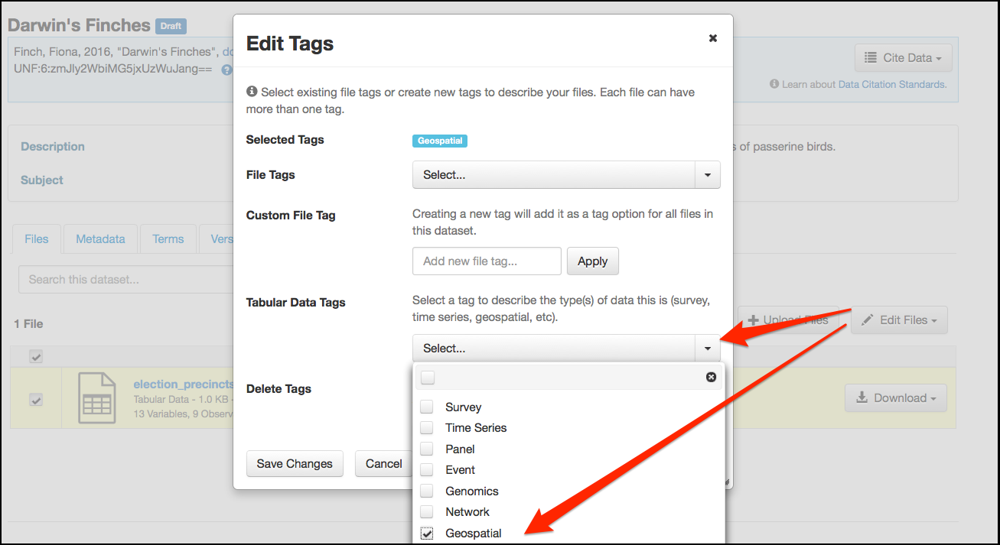
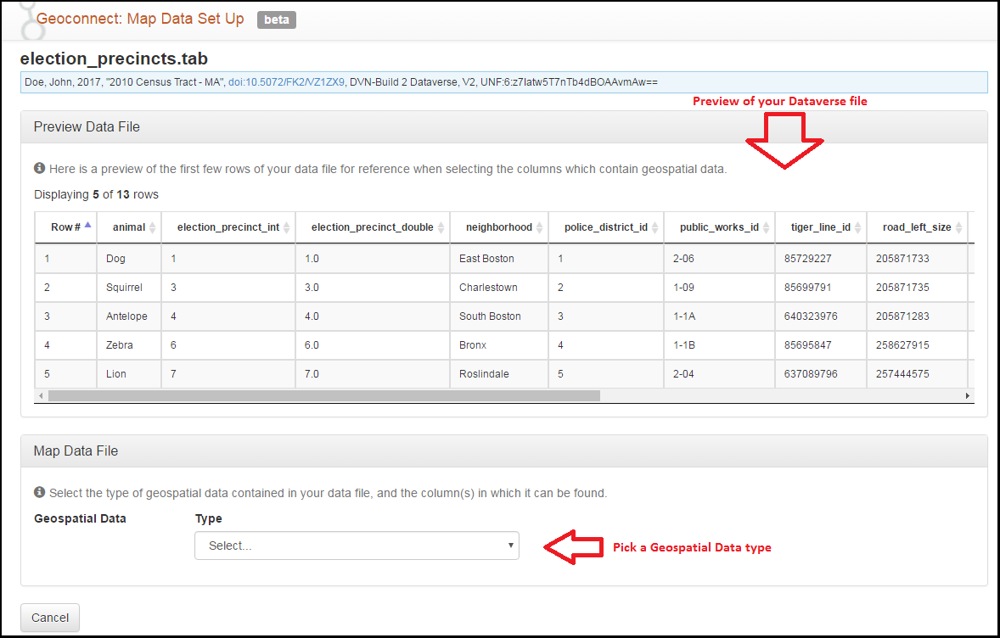
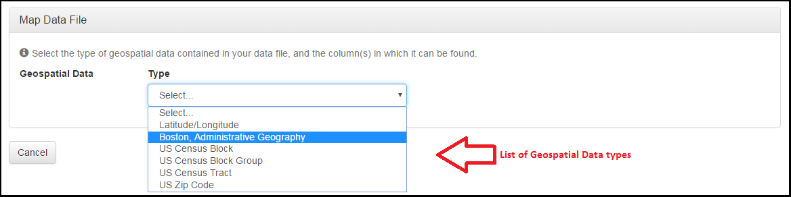
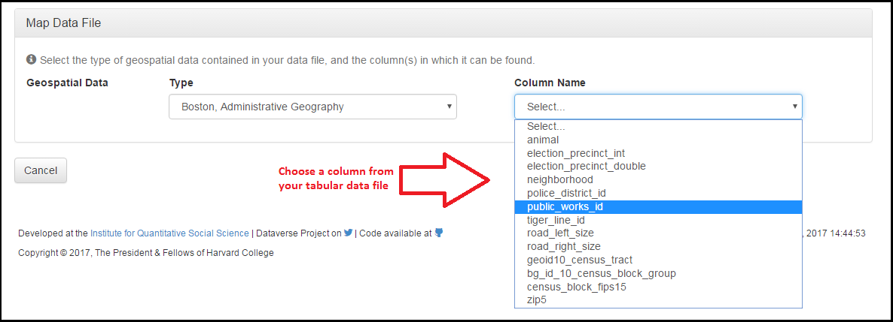
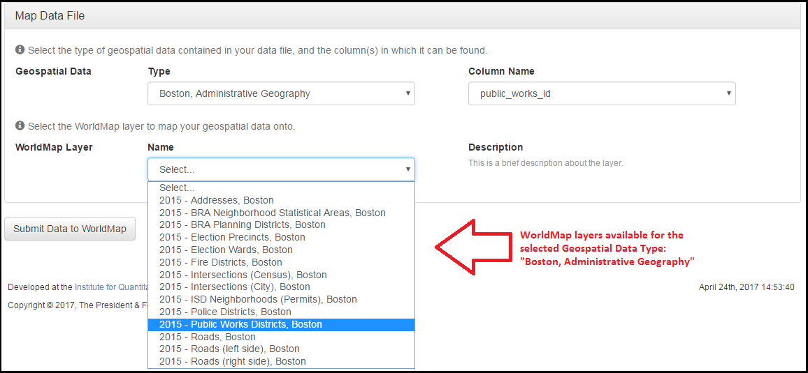
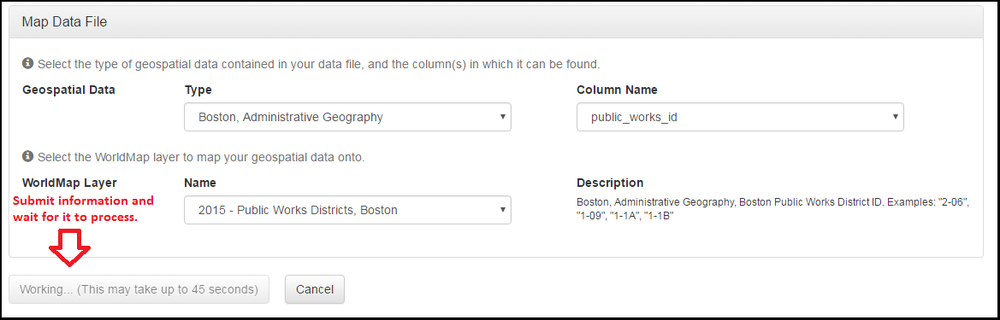
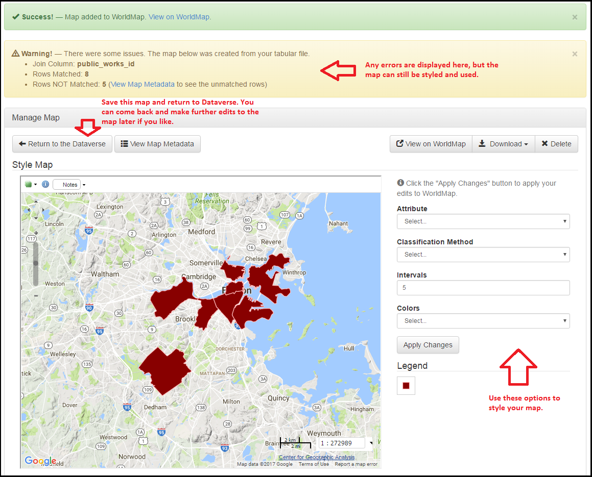

.. _world-map:

WorldMap: Geospatial Data Exploration
+++++++++++++++++++++++++++++++++++++

.. contents:: |toctitle|
   :local:

Dataverse and WorldMap
======================

`WorldMap <http://worldmap.harvard.edu/>`_ is developed by the Center for Geographic Analysis (CGA) at Harvard and is open source software that helps researchers visualize and explore their data in maps. The WorldMap and Dataverse collaboration allows researchers to upload shapefiles or tabular files to Dataverse for long term storage and receive a persistent identifier (through DOI), then easily navigate into WorldMap to interact with the data.

Note: WorldMap hosts their own `user guide <http://worldmap.harvard.edu/static/docs/WorldMap_Help_en.pdf>`_ that covers some of the same material as this page.

What is Geoconnect?
===================

Geoconnect is a platform that integrates Dataverse and WorldMap, allowing researchers to visualize their geospatial data. Geoconnect can be used to create maps of shapefiles or of tabular files containing geospatial information. Geoconnect is an optional component of Dataverse, so if you are interested in this feature but don't see it in the installation of Dataverse you are using, you should contact the support team for that installation and ask them to enable the Geoconnect feature.

If a data file's owner has created a map of that data using Geoconnect, you can view the map by clicking the "Explore" button. If the data is in the form of a shapefile, the button takes you right to the map. If it's a tabular file, the Explore button will be a dropdown, and you'll need to select "Worldmap".

Mapping shapefiles with Geoconnect
==================================

Geoconnect is capable of mapping shapefiles which are uploaded to Dataverse in .zip format. Specifically, Dataverse recognizes a zipped shapefile by:

1. Examining the contents of the .zip file

2. Checking for the existence of four similarly named files with the following extensions: .dbf, .prj, .shp, .shx

Once you have uploaded your .zip shapefile, a Map Data button will appear next to the file in the dataset. In order to use this button, you'll need to publish your dataset. Once your dataset has been published, you can click on the Map Data button to be brought to Geoconnect, the portal between Dataverse and WorldMap that will allow you to create your map. 

To get started with visualizing your shapefile, click on the blue "Visualize on WorldMap" button in Geoconnect. It may take up to 45 seconds for the data to be sent to WorldMap and then back to Geoconnect.

Once this process has finished, you will be taken to a new page where you can style your map through Attribute, Classification Method, Number of Intervals, and Colors. Clicking "Apply Changes" will send your map to both Dataverse and WorldMap, creating a preview of your map that will be visible on your file page and your dataset page. 

Clicking "View on WorldMap" will open WorldMap in a new tab, allowing you to see how your map will be displayed there.

You can delete your map with the "Delete" button. If you decide to delete the map, it will no longer appear on WorldMap, and your dataset in Dataverse will no longer display the map preview.

When you're satisfied with your map, you may click "Return to the Dataverse" to go back to Dataverse.

In the future, to replace your shapefile's map with a new one, simply click the Map Data button on the dataset or file page to return to the Geoconnect edit map page. 

Mapping tabular files with Geoconnect
=====================================

Geoconnect can map tabular files that contain geospatial information such as latitude/longitude coordinates, census tracts, zip codes, Boston election wards, etc.

Preparing a tabular file to be mapped
-------------------------------------

**1. Ingest**

Geospatial tabular files need a bit of preparation in Dataverse before they can be mapped in Geoconnect. When you upload your file, Dataverse will take about ten seconds to ingest it. During the ingest process it will identify the file as tabular data. 

|image1|

**2.Tag as Geospatial**

Next, you'll need to let Dataverse know that your tabular file contains geospatial data. Select your file, click the "Edit Files" button, and select "Tags" from the dropdown menu. This will take you to the Edit Tags menu (pictured below). Under the "Tabular Data Tags" dropdown, select "Geospatial". Then click "Save Changes".

|image2|

**3. Publish & Map Data**

At this point, a "Map data" button will appear next to your file. Publish this new version of your dataset to activate this button.

|image3|

Creating the map
----------------

If your tabular file contains **latitude and longitude** columns, then the process is simple: those columns may be directly mapped. Otherwise, you will need to use a *spatial join*. Spatial joins tell WorldMap how to read your tabular data file in order to create a map that accurately represents it. 

To carry out a spatial join, you'll manually connect

- Geospatial column(s) from your Dataverse tabular file
	- e.g., a census tract column from your table

with

- A WorldMap "target layer" that contains the same geospatial information
	- e.g., WorldMap's "target layer" containing census tract parameters

The following screenshots illustrate the mapping process:

**1. Once you've pressed the "Map Data" button, you're brought to this page:**

|image4|

**2. Choose a Geospatial Data Type**

|image5|

**3. Choose a column from your file to match the WorldMap Layer you selected**

|image6|

**4. Choose from the list of WorldMap Layers available for the Geospatial Data Type you selected**

|image7|

**5.Submit the data for mapping!**

|image8|

**6. View Results**

At this point you will be presented with a basic map that can be styled to your specifications. The example pictured below includes an error message - some of the rows weren't able to be matched properly. In this case, you could still go forward with your map, but without the information from the unmatched rows.

|image9|

Finalizing your map
===================

Now that you have created your map:

- It exists on the WorldMap platform and may be viewed there -- with all of WorldMap's capabilities.

- Dataverse will contain a preview of the map and links to the larger version on WorldMap.

The map editor (pictured above) provides a set of options you can use to style your map. Clicking "Apply Changes" saves the current version of your map to Dataverse and Worldmap. The "Return to the Dataverse" button brings you back to Dataverse. "View on WorldMap" takes you to the map's page on WorldMap, which offers additional views and options. 

If you'd like to make further changes to your map in the future, you can return to the editor by clicking the "Map Data" button on your file.

Removing your map
=================

You can delete your map at any time. If you are on Dataverse, click "Map Data" and click the "Delete Map" button on the upper right. This completely removes the map and underlying data from the WorldMap platform.

.. |image3| image:: ./img/geoconnect-tabular-3.png
   :class: img-responsive

