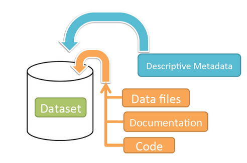

Dataset + File Management
+++++++++++++++++++++++++++++

A dataset in Dataverse is a container for your data, documentation, code, and the metadata describing this Dataset.

|image1|

Supported Metadata
====================

A dataset contains three levels of metadata: 

#. **Citation Metadata**: any metadata that would be needed for generating a data citation and other general metadata that could be applied to any dataset;
#. **Domain specific Metadata**: with specific support currently for Social Science, Life Science, Geospatial, and Astronomy datasets; and
#. **File-level Metadata**: varies depending on the type of data file - see *File Handling and Uploading* section below for more details). 

For more details about what Citation and Domain specific metadata is supported please see our `Appendix <../user/appendix.html#metadata-references>`_.

File Handling + Uploading
===============================

All file formats are supported, up to 10GB per file for the Harvard Dataverse. Please contact support@dataverse.org if you need to upload a file that is larger than 10GB. You can also add descriptions and categorize each of them by adding tags.

The file types listed below are supported by additional functionality, which can include downloading in different formats, subsets, file-level metadata preservation, file-level data citation; and exploration 
through data visualization and analysis. 

Tabular
--------------------

Tabular files of recognized formats (Stata, SPSS, RData, Excel, CSV) can be further explored and manipulated through 
`TwoRavens <../user/data-exploration/tworavens.html>`_ (a statistical data exploration application integrated with Dataverse) by performing various statistical analyses and downloading subsets of variables.
To perform various statistical analyses on the data (including summary statistics) click on the "Explore" button, found next to 
each relevant tabular file and this will take you to the `TwoRavens <../user/data-exploration/tworavens.html>`_ application in a new window. To download subsets of variables click on the "Download" button found next
to a relevant tabular file and select "Data Subset" in the dropdown menu, which will open a new window that is powered by 
TwoRavens for you to create your subset. For more information on `TwoRavens <../user/data-exploration/tworavens.html>`_ please read their `documentation <../user/data-exploration/tworavens.html>`_. Furthermore,
within the "Download" button for tabular data you will find additional options including downloading: in the original file format,
RDATA Format, Variable Metadata (`DDI Codebook <http://www.ddialliance.org/Specification/DDI-Codebook/>`_ XML file), Data Subset (as described earlier) and Data File Citation (currently in either RIS format or EndNote XML).

|image2|

Geospatial
--------------------

Geospatial `shapefiles <http://en.wikipedia.org/wiki/Shapefile>`_ can be further explored and manipulated through our integration
with `WorldMap <../user/data-exploration/worldmap.html>`_, a geospatial data visualization
and analysis tool developed by the `Center for Geographic Analysis <http://gis.harvard.edu/>`_ at Harvard University. Once you publish 
your dataset with your shape files, you will be able to use the "Map Data" button using `GeoConnect <https://github.com/IQSS/geoconnect>`_ to visualize and manipulate these files
for users to Explore this geospatial data using the `WorldMap <http://worldmap.harvard.edu/>`_ interface.
Please note: In order to map your data file, a copy will be sent to Harvard's `WorldMap <http://worldmap.harvard.edu/>`_ platform. You have the ability to delete any maps, and associated data, from the Harvard WorldMap platform, at any time.

Astronomy (FITS)
--------------------

Metadata found in the header section of `Flexible Image Transport System (FITS) files <http://fits.gsfc.nasa.gov/fits_primer.html>`_ are automatically extracted by Dataverse, 
aggregated and displayed in the Astronomy Domain-Specific Metadata of the Dataset that the file belongs to. This FITS file metadata, is therefore searchable
and browsable (facets) at the Dataset-level.

Compressed Files: tar & zip
----------------------------------------

Compressed files in tar and zip format are unpacked automatically. If it fails to unpack, for whatever reason, it will upload as 
is. If the number of files inside are more than a set limit (1,000), you will get an error message and the file will uploads as is.

Advanced Options
---------------------------------------------
There are several advanced options available for certain file types.

- Image files: jpgs, pngs, and tiff files are able to be selected as the default thumbnail for a dataset. The selected thumbnail will appear on the search result card for that dataset.
- SPSS files: SPSS files can be tagged with the language they were originally coded in. This is found by clicking on Advanced Options and selecting the language from the list provided.

Adding a New Dataset
============================

#. Navigate to the dataverse in which you want to add a dataset. 
#. Click on the "Add Data" button and select "New Dataset" in the dropdown menu.
#. To quickly get started, enter at minimum all the required fields with an asterisk to get a Data Citation with a DOI (e.g., the Dataset Title, Author, 
   Description, Contact Email and Subject).
#. Scroll down to the "Files" section and click on "Select Files to Add" to add all the relevant files to your Dataset. 
   You can also upload your files directly from your Dropbox. **Tip:** You can drag and drop or select multiple files at a time from your desktop,
   directly into the upload widget. Your files will appear below the "Select Files to Add" button where you can add a
   description and tags (via the "Edit Tag" button) for each file. Additionally, an MD5 checksum will be added for each file. If you upload a tabular file a :ref:`Universal Numerical Fingerprint (UNF) <unf>` will be added to this file.
#. Click the "Add Dataset" button when you are done. Your unpublished dataset is now created. 

Note 1: You can add additional metadata once you have completed the initial dataset creation by going to Edit Dataset > Metadata. 

Supported HTML Fields
------------------------

We currently only support the following HTML tags for any of our textbox meatdata fields (i.e., Description) : <a>, <b>, <blockquote>, 
 , <code>, <del>, <dd>, <dl>, <dt>, <em>, 
, <h1>-<h3>, <i>, , <kbd>, <li>, <ol>, 
, <pre>, <s>, , , 
<strong>, <strike>, <ul>.

Edit Dataset
==================

Go to your dataset page and click on the "Edit Dataset" button. There, depending on your level of permissions for this dataset,
you will have the following options:

- Files (Upload or Edit Data): to add or edit files in this dataset.
- Metadata: to add/edit metadata including additional metadata than was not previously available during Dataset Creation.
- Terms: to view or modify the Waiver (if using CC0), Terms of Use, Terms of Access and Guestbook of this dataset.
- Permissions: to view or modify the permissions and roles of this dataset and for individual files within.
- Delete Dataset (only available before your Dataset is published)
- Deaccession Dataset (only when your Dataset is published, see below)

You can also directly select the Files, Metadata, Terms or Versions tabs found below the dataset summary information
to specifically edit any of those parts of your dataset.

.. _license-terms:

Terms
=======================

In the Terms tab, which can also be found by clicking on the Edit dropdown button of a Dataset, you can setup how users can use your data 
once they have downloaded it (CC0 waiver or custom Terms of Use), how they can access your data if you have files that 
are restricted (terms of access), and enable a Guestbook for your dataset so that you can track who is using your data and for
what purposes. These are explained in further detail below:

CC0 Waiver + Dataset Terms of Use 
---------------------------------------------------------------

Starting with Dataverse version 4.0, all new datasets will default to a `CC0 public domain dedication 
<https://creativecommons.org/publicdomain/zero/1.0/>`_ . CC0 facilitates reuse and extensibility of research data. 
Our `Community Norms <http://best-practices.dataverse.org/harvard-policies/community-norms.html>`_ as well as good scientific
practices expect that proper credit is given via citation. If you are unable to give your datasets a CC0 waiver you may enter 
your own custom Terms of Use for your Datasets.

\* **Legal Disclaimer:** these `Community Norms <http://best-practices.dataverse.org/harvard-policies/community-norms.html>`_ are not a substitute for the CC0 waiver or custom terms and licenses applicable to each dataset. Please be advised that the Community Norms are not a binding contractual agreement, and that downloading datasets from Dataverse does not create a legal obligation to follow these policies.  

Setting up Custom Terms of Use for Datasets
--------------------------------------------

If you are unable to use a CC0 waiver for your datasets you are able to set your own custom terms of use. To do so, select 
"No, do not apply CC0 - "Public Domain Dedication" and a Terms of Use textbox will show up allowing you to enter your own custom terms of use for your dataset. To add more information about the Terms of Use, click on "Additional Information \[+]".

Here is an `example of a Data Usage Agreement <http://best-practices.dataverse.org/harvard-policies/sample-dua.html>`_ for datasets that have de-identified human subject data.

Restricted Files + Terms of Access 
-----------------------------------------------

If you restrict any files in your dataset, you will be prompted by a pop-up to enter Terms of Access for the data. This can also be edited in the Terms tab or selecting Terms in the "Edit" dropdown button in the dataset. You may also allow users to request access for your restricted files by enabling "Request Access". To add more information about the Terms of Access, click on "Additional Information \[+]".

Guestbook
--------------

This is where you will enable a particular Guestbook for your dataset, which is setup at the Dataverse-level. For specific instructions please visit the Dataverse Management Guide > `Dataset Guestbook section <../user/dataverse-management.html#dataset-guestbooks>`_.

.. _permissions:

Permissions
=============================

Dataset-Level 
-----------------

Dataset permissions are located under Permissions in the Edit button on a dataset page. The dataset permissions page has two 
sections: Users/Groups and Roles.

To give someone access to view your unpublished dataset or edit your published or unpublished dataset, click on the Assign 
Roles to Users/Groups button in the Users/Groups section. 

File-Level
----------------------

If you have restricted specific files the file-level permissions is where you will need to go to grant users/groups access to
specific restricted files. Dataset file permissions are located under Permissions in the Edit button on a dataset page. 
The file permissions page has two sections: Users/Groups and Files.

To give someone access to your restricted files, click on the Grant Access to Users/Groups button in the Users/Groups section. 

Publish Dataset
====================

When you publish a dataset (available to an Admin, Curator, or any custom role which has this level of permission assigned), you make it available to the public so that other users can browse or search for it. Once your dataset is ready to go public, go to your dataset page and click on the "Publish" button on the right hand side of the page. A pop-up will appear to confirm that you are ready to actually Publish since once a dataset is made public it can no longer be unpublished. 

Whenever you edit your dataset, you are able to publish a new version of the dataset. The publish dataset button will reappear whenever you edit the metadata of the dataset or add a file.

Note: Prior to publishing your dataset the Data Citation will indicate that this is a draft but the "DRAFT VERSION" text
will be removed as soon as you Publish.

Submit for Review
=====================

If you have a Contributor role (can edit metadata, upload files, and edit files, edit Terms, Guestbook, and Submit datasets 
for review) in a Dataverse you can submit your dataset for review when you have finished uploading your files
and filling in all of the relevant metadata fields. To Submit for Review, go to your dataset and click on the "Submit for Review" button, 
which is located next to the "Edit" button on the upper-right. Once Submitted for Review: the Admin or Curator for this Dataverse will be notified to review this
dataset before they decide to either "Publish" the dataset or "Return to Author". If the dataset is published the contributor
will be notified that it is now published. If the dataset is returned to the author, the contributor of this dataset will be 
notified that they need to make modifications before it can be submitted for review again.

Dataset Versioning
======================

Versioning is important for long term-research data management where metadata and/or files are updated over time.

Once you have published a dataset, any metadata or file changes (e.g, by uploading a new file, changing file metadata, adding 
or editing metadata) will be tracked in our versioning feature. For example if you were at version 1 of your dataset, and you
edit your dataset a new draft version of this dataset will be created. To get to the already published version 1 of your dataset,
click on the "View Dataset Versions" button on the top left section of your dataset. To go back to the unpublished version
click on the same button. Once you are ready to publish this new version of your dataset, select the "Publish Dataset" button 
on the top right side of the page. If you were at version 1 of your dataset, and depending on the types of changes you have 
made, you will be asked to select to publish your draft as either version 1.1 or version 2.0 (**important note**: if you add 
a file, your dataset will automatically be bumped up to a major version (example: if you were at 1.0 you will go to 2.0). 

|image3|

**Dataset Versions Tab**

To view what has exactly changed starting from the originally published version to any subsequent published versions: click on the Versions tab on the dataset page to see all versions and changes made for that particular dataset. Once you have more than one version (can be version 1 and a draft), you can click the Show Details link in the Versions tab to learn more about the metadata fields and files that were either added or edited. 

If you have more than two versions of a dataset, you can select any two versions to compare the differences between them. After selecting two versions, click on the "Show Differences" button to see the version differences details.

.. _deaccession:

Deaccession Your Dataset [not recommended]
===============================================

Deaccessioning a dataset or a version of a dataset is a very serious action that should only occur if there is a legal or valid reason for the dataset to no longer be accessible to the public. If you absolutely must deaccession, you can deaccession a version of a dataset or an entire dataset. To deaccession, go to a dataset you’ve already published (or add a new one and publish it), click on Edit Dataset, then Deaccession Dataset. If you have multiple versions of a dataset, you can select here which versions you want to deaccession or choose to deaccession the entire dataset. You must also include a reason as to why this dataset was deaccessioned from a dropdown list of options. There is also a free-text box to add more details as to why this was deaccessioned. If the dataset has moved to a different repository or site you are encouraged to include a URL (preferably persistent) for users to continue to be able to access this dataset in the future.

**Important Note**: A tombstone landing page with the basic citation metadata will always be accessible to the public if they use the persistent URL (Handle or DOI) provided in the citation for that dataset.  Users will not be able to see any of the files or additional metadata that were previously available prior to deaccession.

.. |image2| image:: ./img/data-download.png 
.. |image3| image:: http://static.projects.iq.harvard.edu/files/styles/os_files_xxlarge/public/datascience/files/data_publishing_version_workflow.png?itok=8Z0PM-QC

