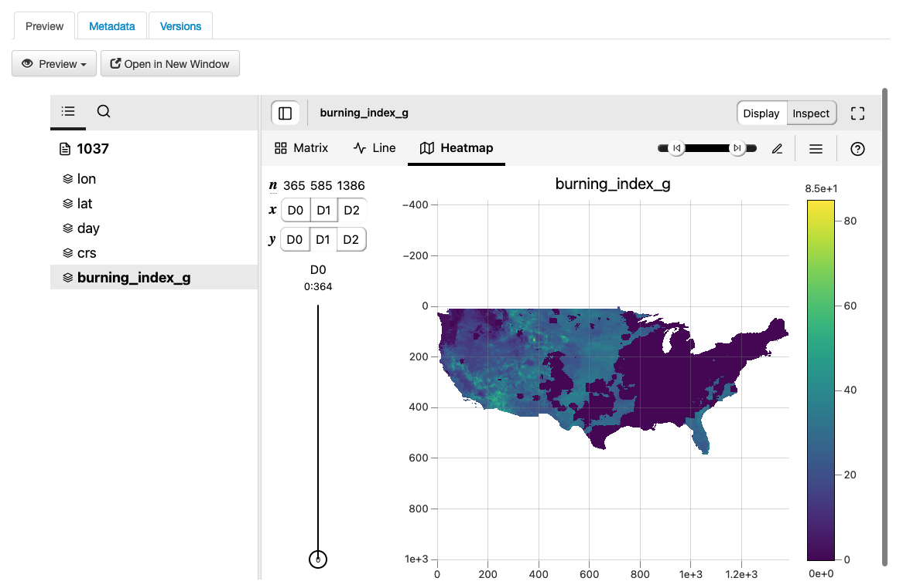

Dataset + File Management
+++++++++++++++++++++++++

A dataset in a Dataverse installation is a container for your data, documentation, code, and the metadata describing this Dataset.

|image1|

.. contents:: |toctitle|
	:local:

Supported Metadata
==================

A dataset contains three levels of metadata: 

#. **Citation Metadata**: any metadata that would be needed for generating a data citation and other general metadata that could be applied to any dataset;
#. **Domain Specific Metadata**: with specific support currently for Social Science, Life Science, Geospatial, and Astronomy datasets; and
#. **File-level Metadata**: varies depending on the type of data file - for more details see :ref:`File Handling <file-handling>` section below).

For more details about what Citation and Domain Specific Metadata is supported please see our :ref:`user-appendix`.

.. _metadata-export-formats:

Supported Metadata Export Formats
---------------------------------

Once a dataset has been published, its metadata can be exported in a variety of other metadata standards and formats, which help make datasets more discoverable and usable in other systems, such as other data repositories. On each dataset page's metadata tab, the following exports are available:

- Dublin Core
- DDI (Data Documentation Initiative Codebook 2.5)
- DDI HTML Codebook (A more human-readable, HTML version of the DDI Codebook 2.5 metadata export)
- DataCite 4
- JSON (native Dataverse Software format)
- OAI_ORE
- OpenAIRE
- Schema.org JSON-LD

Each of these metadata exports contains the metadata of the most recently published version of the dataset.

.. _adding-new-dataset:

Adding a New Dataset
====================

#. Navigate to the Dataverse collection in which you want to add a dataset.
#. Click on the "Add Data" button and select "New Dataset" in the dropdown menu. **Note:** If you are on the root Dataverse collection, your My Data page or click the "Add Data" link in the navbar, the dataset you create will be hosted in the root Dataverse collection. You can change this by selecting another Dataverse collection you have proper permissions to create datasets in, from the Host Dataverse collection dropdown in the create dataset form. This option to choose will not be available after you create the dataset.
#. To quickly get started, enter at minimum all the required fields with an asterisk (e.g., the Dataset Title, Author Name, 
   Description Text, Point of Contact Email, and Subject) to get a Data Citation with a DOI.
#. Scroll down to the "Files" section and click on "Select Files to Add" to add all the relevant files to your Dataset. 
   You can also upload your files directly from your Dropbox. **Tip:** You can drag and drop or select multiple files at a time from your desktop
   directly into the upload widget. Your files will appear below the "Select Files to Add" button where you can add a
   description and tags (via the "Edit Tag" button) for each file. Additionally, an MD5 checksum will be added for each file. If you upload a tabular file a :ref:`Universal Numerical Fingerprint (UNF) <unf>` will be added to this file.
#. Click the "Save Dataset" button when you are done. Your unpublished dataset is now created. 

Note: You can add additional metadata once you have completed the initial dataset creation by going to clicking the Edit button and selecting Metadata from the dropdown menu.

.. _supported-html-fields:

Supported HTML Fields
---------------------

We currently only support the following HTML tags for any of our textbox metadata fields (i.e., Description) : <a>, <b>, <blockquote>, 
 , <code>, <del>, <dd>, <dl>, <dt>, <em>, 
, <h1>-<h3>, <i>, , <kbd>, <li>, <ol>, 
, <pre>, <s>, , , 
<strong>, <strike>, <u>, <ul>.

.. _dataset-file-upload:

File Upload
===========

The Dataverse Software offers multiple methods of uploading files to a dataset. These upload methods are configurable by the administrator of a Dataverse installation, so you might not see some of these options on the Dataverse installation you're using.

If there are multiple upload options available, then you must choose which one to use for your dataset. A dataset may only use one upload method. Once you upload a file using one of the available upload methods, that method is locked in for that dataset. If you need to switch upload methods for a dataset that already contains files, then please contact Support by clicking on the Support link at the top of the application.

You can upload files to a dataset while first creating that dataset. You can also upload files after creating a dataset by clicking the "Edit" button at the top of the dataset page and from the dropdown list selecting "Files (Upload)" or clicking the "Upload Files" button above the files table in the Files tab. From either option you will be brought to the Upload Files page for that dataset.

Certain file types in a Dataverse installation are supported by additional functionality, which can include downloading in different formats, previews, file-level metadata preservation, file-level data citation with UNFs, and exploration through data visualization and analysis. See the :ref:`File Handling <file-handling>` section of this page for more information.

HTTP Upload
-----------

HTTP Upload is a common browser-based file upload tool you may be familiar with from other web applications. You can upload files via HTTP by selecting them from your browser or dragging and dropping them into the upload widget.

Once you have uploaded files, you will be able to edit file metadata, restrict access to files [#f1]_ , and/or add tags. Click "Save Changes" to complete the upload. If you uploaded a file by mistake, you can delete it before saving by clicking the checkbox to select the file, and then clicking the "Delete" button above the Files Table.

File upload limit size varies based on Dataverse installation. The file upload size limit can be found in the text above the HTTP upload widget. If you need to upload a very large file or a very large *number* of files, consider using rsync + SSH upload if your Dataverse installation offers it.

.. [#f1] Some Dataverse installations do not allow this feature.

Dropbox Upload
--------------

Some Dataverse installations support the ability to upload files directly from Dropbox. To do so, click the "Upload from Dropbox" button, log in to Dropbox in the pop-up window, and select the files you'd like to transfer over.

.. _folder-upload:

Folder Upload
-------------

Some Dataverse installations support the ability to upload files from a local folder and subfolders. To do this, click the "Upload from Folder" button, select the folder you wish to upload, select/unselect specific files, and click "Start Uploads". More detailed instructions are available in the `DVWebloader wiki <https://github.com/gdcc/dvwebloader/wiki#use>`_.

.. _rsync_upload:

rsync + SSH Upload
------------------

rsync is typically used for synchronizing files and directories between two different systems, using SSH to connect rather than HTTP. Some Dataverse installations allow uploads using rsync, to facilitate large file transfers in a reliable and secure manner.

File Upload Script
~~~~~~~~~~~~~~~~~~

An rsync-enabled Dataverse installation has a file upload process that differs from the traditional browser-based upload process you may be used to. In order to transfer your data to the Dataverse installation's storage, you will need to complete the following steps:

1. Create your dataset. In rsync-enabled Dataverse installations, you cannot upload files until the dataset creation process is complete. After you hit "Save Dataset" on the Dataset Creation page, you will be taken to the page for your dataset.

2. On the dataset page, click the "+ Upload Files" button. This will open a box with instructions and a link to the file upload script.

3. Make sure your files are ready for upload. You will need to have one directory that you can point the upload script to. All files in this directory and in any subdirectories will be uploaded. The directory structure will be preserved, and will be reproduced when your dataset is downloaded from the Dataverse installation. Note that your data will be uploaded in the form of a data package, and each dataset can only host one such package. Be sure that all files you want to include are present before you upload.

4. Download the rsync file upload script by clicking the "Download Script" button in the Upload Files instruction box. There are no requirements for where you save the script; put it somewhere you can find it. Downloading the upload script will put a temporary lock on your dataset to prepare it for upload. While your dataset is locked, you will not be able to delete or publish your dataset, or edit its metadata. Once you upload your files and Dataverse installation processes them, your dataset will be automatically unlocked and these disabled functions will be enabled again. If you have downloaded the script and locked your dataset, but you have then changed your mind and decided *not* to upload files, please contact Support about unlocking your dataset.

5. To begin the upload process, you will need to run the script you downloaded. For this, you will have to go outside your browser and open a terminal (AKA command line) window on your computer. Use the terminal to navigate to the directory where you saved the upload script, and run the command that the Upload Files instruction box provides. This will begin the upload script. Please note that this upload script will expire 7 days after you downloaded it. If it expires and you still need to use it, simply download the script from the Dataverse installation again.

**Note:** Unlike other operating systems, Windows does not come with rsync supported by default. We have not optimized this feature for Windows users, but you may be able to get it working if you install the right Unix utilities. (If you have found a way to get this feature working for you on Windows, you can contribute it to our project. Please reference our `Contributing to the Dataverse Project <https://github.com/IQSS/dataverse/blob/master/CONTRIBUTING.md>`_ document in the root of the source tree.)

6. Follow the instructions provided by the upload script running in your terminal. It will direct you to enter the full path of the directory where your dataset files are located, and then it will start the upload process. Once you've initiated the upload, if you need to cancel it then you can do so by canceling the script running in your terminal window. If your upload gets interrupted, you can resume it from the same point later.

7. Once the upload script completes its job, the Dataverse installation will begin processing your data upload and running a checksum validation. This may take some time depending on the file size of your upload. During processing, you will see a blue bar at the bottom of the dataset page that reads "Upload in progress..." 

8. Once processing is complete, you will be notified. At this point you can publish your dataset and your data will be available for download on the dataset page.

**Note:** A dataset can only hold one data package. If you need to replace the data package in your dataset, contact Support.

Command-line DVUploader
-----------------------

The open-source DVUploader tool is a stand-alone command-line Java application that uses the Dataverse installation's API to upload files to a specified Dataset. Since it can be installed by users, and requires no server-side configuration, it can be used with any Dataverse installation. It is intended as an alternative to uploading files through the Dataverse installation's web interface in situations where the web interface is inconvenient due to the number of files or file locations (spread across multiple directories, mixed with files that have already been uploaded or file types that should be excluded) or the need to automate uploads. Since it uses the Dataverse installation's API, transfers are limited in the same ways as HTTP uploads through the Dataverse installation's web interface in terms of size and performance. The DVUploader logs its activity and can be killed and restarted as desired. If stopped and resumed, it will continue processing from where it left off.

Usage
~~~~~

The DVUploader is open source and is available as source, as a Java jar, and with documentation at https://github.com/GlobalDataverseCommunityConsortium/dataverse-uploader. The DVUploader requires Java 1.8+. Users will need to install Java if they don't already have it and then download the latest release of the DVUploader - jar file. Users will need to know the URL of the Dataverse installation, the DOI of their existing dataset, and have generated an API Key for the Dataverse installation (an option in the user's profile menu). 

Basic usage is to run the command: ::

    java -jar DVUploader-*.jar -server=<Dataverse Installation URL> -did=<Dataset DOI> -key=<User's API Key> <file or directory list>

Additional command line arguments are available to make the DVUploader list what it would do without uploading, limit the number of files it uploads, recurse through sub-directories, verify fixity, exclude files with specific extensions or name patterns, and/or wait longer than 60 seconds for any Dataverse installation ingest lock to clear (e.g. while the previously uploaded file is processed, as discussed in the :ref:`File Handling <file-handling>` section below). 

DVUploader is a community-developed tool, and its creation was primarily supported by the Texas Digital Library. Further information and support for DVUploader can be sought at `the project's GitHub repository <https://github.com/GlobalDataverseCommunityConsortium/dataverse-uploader>`_ . 

Integrations Dashboard Uploader
-------------------------------

There is an experimental uploader described at :ref:`integrations-dashboard` that provides a graphical user interface (GUI) for uploading files from a local file system and various remote locations such as GitHub.

.. _duplicate-files:

Duplicate Files
---------------

Beginning with Dataverse Software 5.0, the way a Dataverse installation handles duplicate files (filename and checksums) is changing to be more flexible. Specifically:

- Files with the same checksum can be included in a dataset, even if the files are in the same directory.
- Files with the same filename can be included in a dataset as long as the files are in different directories.
- If a user uploads a file to a directory where a file already exists with that directory/filename combination, the Dataverse installation will adjust the file path and names by adding "-1" or "-2" as applicable. This change will be visible in the list of files being uploaded. 
- If the directory or name of an existing or newly uploaded file is edited in such a way that would create a directory/filename combination that already exists, the Dataverse installation will display an error.
- If a user attempts to replace a file with another file that has the same checksum, an error message will be displayed and the file will not be able to be replaced.
- If a user attempts to replace a file with a file that has the same checksum as a different file in the dataset, a warning will be displayed.

BagIt Support
-------------

BagIt is a set of hierarchical file system conventions designed to support disk-based storage and network transfer of arbitrary digital content. It offers several benefits such as integration with digital libraries, easy implementation, and transfer validation. See `the Wikipedia article <https://en.wikipedia.org/wiki/BagIt>`__ for more information.

If the Dataverse installation you are using has enabled BagIt file handling, when uploading BagIt files the repository will validate the checksum values listed in each BagIt’s manifest file against the uploaded files and generate errors about any mismatches. The repository will identify a certain number of errors, such as the first five errors in each BagIt file, before reporting the errors.

|bagit-image1|

You can fix the errors and reupload the BagIt files.

More information on how your admin can enable and configure the BagIt file handler can be found in the :ref:`Installation Guide <BagIt File Handler>`.

.. _file-handling:

File Handling
=============

Certain file types in the Dataverse installation are supported by additional functionality, which can include downloading in different formats, previews, file-level metadata preservation, file-level data citation; and exploration through data visualization and analysis. See the sections below for information about special functionality for specific file types.

.. _file-previews:

File Previews
-------------

Dataverse installations can add previewers for common file types uploaded by their research communities. The previews appear on the file page. If a preview tool for a specific file type is available, the preview will be created and will display automatically, after terms have been agreed to or a guestbook entry has been made, if necessary. File previews are not available for restricted files unless they are being accessed using a Private URL. See also :ref:`privateurl`.

Previewers are available for the following file types:

- Text
- PDF
- Tabular (CSV, Excel, etc., see :doc:`tabulardataingest/index`)
- Code (R, etc.)
- Images (PNG, GIF, JPG)
- Audio (MP3, MPEG, WAV, OGG, M4A)
- Video (MP4, OGG, Quicktime)
- Zip (preview and extract/download)
- HTML
- GeoJSON
- GeoTIFF
- Shapefile
- NetCDF/HDF5
- Hypothes.is

Additional file types will be added to the `dataverse-previewers <https://github.com/gdcc/dataverse-previewers>`_ repo before they are listed above so please check there for the latest information or to request (or contribute!) an additional file previewer.

Installation of previewers is explained in the :doc:`/admin/external-tools` section of in the Admin Guide.

Tabular Data Files
------------------

Files in certain formats - Stata, SPSS, R, Excel (xlsx), CSV and TSV - may be ingested as tabular data (see :doc:`/user/tabulardataingest/index` section of the User Guide for details). Tabular data files can be further explored and manipulated with :doc:`/admin/external-tools` if they have been enabled in the Dataverse installation you are using.

Additional download options available for tabular data (found in the same drop-down menu under the "Download" button): 

- As tab-delimited data (with the variable names in the first row); 
- The original file uploaded by the user; 
- Saved as R data (if the original file was not in R format); 
- Variable Metadata (as a `DDI Codebook <http://www.ddialliance.org/Specification/DDI-Codebook/>`_ XML file);
- Data File Citation (currently in either RIS, EndNote XML, or BibTeX format). 

Differentially Private (DP) Metadata can also be accessed for restricted tabular files if the data depositor has created a DP Metadata Release. See :ref:`dp-release-create` for more information.

.. _research-code:

Research Code
-------------

Code files - such as Stata, R, MATLAB, or Python files or scripts - have become a frequent addition to the research data deposited in Dataverse repositories. Research code is typically developed by few researchers with the primary goal of obtaining results, while its reproducibility and reuse aspects are sometimes overlooked. Because several independent studies reported issues trying to rerun research code, please consider the following guidelines if your dataset contains code.

The following are general guidelines applicable to all programming languages.

- Create a README text file in the top-level directory to introduce your project. It should answer questions that reviewers or reusers would likely have, such as how to install and use your code. If in doubt, consider using existing templates such as `a  README template for social science replication packages <https://social-science-data-editors.github.io/template_README/template-README.html>`_.
- Depending on the number of files in your dataset, consider having data and code in distinct directories, each of which should have some documentation like a README. 
- Consider adding a license to your source code. You can do that by creating a LICENSE file in the dataset or by specifying the license(s) in the README or directly in the code. Find out more about code licenses at `the Open Source Initiative webpage <https://opensource.org/licenses>`_.
- If possible, use free and open-source file formats and software to make your research outputs more reusable and accessible.
- Consider testing your code in a clean environment before sharing it, as it could help you identify missing files or other errors. For example, your code should use relative file paths instead of absolute (or full) file paths, as they can cause an execution error.
- Consider providing notes (in the README) on the expected code outputs or adding tests in the code, which would ensure that its functionality is intact.

Capturing code dependencies will help other researchers recreate the necessary runtime environment. Without it, your code will not be able to run correctly (or at all). 
One option is to use platforms such as `Whole Tale <https://wholetale.org>`_, `Jupyter Binder <https://mybinder.org>`_ or `Renku <https://renkulab.io>`_, which facilitate research reproducibility. For more information, have a look at :doc:`/admin/integrations` in the Admin Guide, especially the sections on :ref:`wholetale`, :ref:`binder`, and :ref:`renku`.
Another option is to use an automatic code dependency capture, which is often supported through the programming language. Here are a few examples:

- If you are using the conda package manager, you can export your environment with the command ``conda env export > environment.yml``. For more information, see the `official documentation <https://docs.conda.io/projects/conda/en/latest/user-guide/tasks/manage-environments.html#sharing-an-environment>`__.
- Python has multiple conventions for capturing its dependencies, but probably the best-known one is with the ``requirements.txt`` file, which is created using the command ``pip freeze > requirements. txt``. Managing environments with ``pip`` is explained in the `official documentation <https://docs.python.org/3/tutorial/venv.html#managing-packages-with-pip>`__.
- If you are using the R programming language, create a file called ``install.R``, and list all library dependencies that your code requires. This file should be executable in R to set up the environment. See also other strategies for capturing the environment proposed by RStudio in the `official documentation <https://environments.rstudio.com>`__.
- In case you are using multiple programming languages or different versions of the same language, consider using a containerization technology such as Docker. You can create a Dockerfile that builds your environment and deposit it within your dataset (see `the official documentation <https://docs.docker.com/language/python/build-images/>`__). It is worth noting that creating a reliable Dockerfile may be tricky. If you choose this route, make sure to specify dependency versions and check out `Docker's best practices <https://docs.docker.com/develop/develop-images/dockerfile_best-practices/>`_.

Finally, automating your code can be immensely helpful to the code and research reviewers. Here are a few options on how to automate your code.

- A simple way to automate your code is using a bash script or Make. The Turing Way Community has `a detailed guide <https://the-turing-way.netlify.app/reproducible-research/make.html>`_ on how to use the Make build automation tool.
- Consider using research workflow tools to automate your analysis. A popular workflow tool is called Common Workflow Language, and you can find more information about it `from the Common Workflow Language User Guide <https://www.commonwl.org/user_guide/>`_.

**Note:** Capturing code dependencies and automating your code will create new files in your directory. Make sure to include them when depositing your dataset.

Computational Workflow
----------------------

Computational Workflow Definition
~~~~~~~~~~~~~~~~~~~~~~~~~~~~~~~~~

Computational workflows precisely describe a multi-step process to coordinate multiple computational tasks and their data dependencies that lead to data products in a scientific application. The computational tasks take different forms, such as running code (e.g. Python, C++, MATLAB, R, Julia), invoking a service, calling a command-line tool, accessing a database (e.g. SQL, NoSQL), submitting a job to a compute cloud (e.g. on-premises cloud, AWS, GCP, Azure), and execution of data processing scripts or workflow. The following diagram shows an example of a computational workflow with multiple computational tasks.

|cw-image1|

FAIR Computational Workflow
~~~~~~~~~~~~~~~~~~~~~~~~~~~

The FAIR Principles (Findable, Accessible, Interoperable, Reusable) apply to computational workflows (https://doi.org/10.1162/dint_a_00033) in two areas: as FAIR data and as FAIR criteria for workflows as digital objects. In the FAIR data area, "*properly designed workflows contribute to FAIR data principles since they provide the metadata and provenance necessary to describe their data products, and they describe the involved data in a formalized, completely traceable way*" (https://doi.org/10.1162/dint_a_00033). Regarding the FAIR criteria for workflows as digital objects, "*workflows are research products in their own right, encapsulating methodological know-how that is to be found and published, accessed and cited, exchanged and combined with others, and reused as well as adapted*" (https://doi.org/10.1162/dint_a_00033).

How to Create a Computational Workflow
~~~~~~~~~~~~~~~~~~~~~~~~~~~~~~~~~~~~~~

There are multiple approaches to creating computational workflows. You may consider standard frameworks and tools such as Common Workflow Language (CWL), Snakemake, Galaxy, Nextflow, Ruffus or *ad hoc* methods using different programming languages (e.g. Python, C++, MATLAB, Julia, R), notebooks (e.g. Jupyter Notebook, R Notebook, and MATLAB Live Script) and command-line interpreters (e.g. Bash). Each computational task is defined differently, but all meet the definition of a computational workflow and all result in data products. You can find a few examples of computational workflows in the following GitHub repositories, where each follows several aspects of FAIR principles:

- Common Workflow Language (`GitHub Repository URL <https://github.com/fasrc/epa_cwl_airflow>`__)
- R Notebook (`GitHub Repository URL <https://github.com/fasrc/R_computational_workflow>`__)
- Jupyter Notebook (`GitHub Repository URL <https://github.com/fasrc/python-computational-workflow>`__)
- MATLAB Script (`GitHub Repository URL <https://github.com/fasrc/Matlab_computational_workflow>`__)

You are encouraged to review these examples when creating a computational workflow and publishing in a Dataverse repository.

At https://workflows.community, the Workflows Community Initiative offers resources for computational workflows, such as a list of workflow systems (https://workflows.community/systems) and other workflow registries (https://workflows.community/registries). The initiative also helps organize working groups related to workflows research, development and application.

How to Upload Your Computational Workflow
~~~~~~~~~~~~~~~~~~~~~~~~~~~~~~~~~~~~~~~~~

After you :ref:`upload your files <dataset-file-upload>`, you can apply a "Workflow" tag to your workflow files, such as your Snakemake or R Notebooks files, so that you and others can find them more easily among your deposit’s other files.

|cw-image3|

|cw-image4|

How to Describe Your Computational Workflow
~~~~~~~~~~~~~~~~~~~~~~~~~~~~~~~~~~~~~~~~~~~

The Dataverse installation you are using may have enabled Computational Workflow metadata fields for your use. If so, when :ref:`editing your dataset metadata <adding-new-dataset>`, you will see the fields described below.

|cw-image2|

As described in the :ref:`metadata-references` section of the :doc:`/user/appendix`, the three fields are adapted from `Bioschemas Computational Workflow Profile, version 1.0 <https://bioschemas.org/profiles/ComputationalWorkflow/1.0-RELEASE>`__ and `Codemeta <https://codemeta.github.io/terms/>`__:

- **Workflow Type**: The kind of Computational Workflow, which is designed to compose and execute a series of computational or data manipulation steps in a scientific application
- **External Code Repository URL**: A link to another public repository where the un-compiled, human-readable code and related code is also located (e.g., GitHub, GitLab, SVN)
- **Documentation**: A link (URL) to the documentation or text describing the Computational Workflow and its use

How to Search for Computational Workflows
~~~~~~~~~~~~~~~~~~~~~~~~~~~~~~~~~~~~~~~~~

If the search page of the Dataverse repository you are using includes a "Dataset Feature" facet with a Computational Workflows link, you can follow that link to find only datasets that contain computational workflows.

You can also search on the "Workflow Type" facet, if the Dataverse installation has the field enabled, to find datasets that contain certain types of computational workflows, such as workflows written in Common Workflow Language files or Jupyter Notebooks.

|cw-image5|

You can also search for files within datasets that have been tagged as "Workflow" files by clicking the Files checkbox to show only files and using the File Tag facet to show only files tagged as "Workflow".

|cw-image6|

.. _fits:

Astronomy (FITS)
----------------

Metadata found in the header section of `Flexible Image Transport System (FITS) files <http://fits.gsfc.nasa.gov/fits_primer.html>`_ are automatically extracted by the Dataverse Software, aggregated and displayed in the Astronomy Domain-Specific Metadata of the Dataset that the file belongs to. This FITS file metadata, is therefore searchable and browsable (facets) at the Dataset-level.

.. _geojson:

GeoJSON
-------

A map will be shown as a preview of GeoJSON files when the previewer has been enabled (see :ref:`file-previews`). See also a `video demo <https://www.youtube.com/watch?v=EACJJaV3O1c&t=588s>`_ of the GeoJSON previewer by its author, Kaitlin Newson.

.. _geotiff:

GeoTIFF
-------

A map is also displayed as a preview of GeoTiFF image files, whose previewer must be enabled (see :ref:`file-previews`). Since GeoTIFFs do not have their own mimetype, it is advisable to use this previewer only when GeoTIFFs are used (and not "normal" TIFs). For performance reasons, this previewer has a file size limit of 15 MB and a row/column limit of 50,000 so that larger files are not loaded.

.. _shapefile:

Shapefile
---------

Another previewer can be enabled for shapefiles (see :ref:`file-previews`). This previewer only works with zipped shapefiles (see :doc:`/developers/geospatial`). A file size limit of 20 MB is set for this previewer (also because of performance reasons).

.. _netcdf-and-hdf5:

NetCDF and HDF5
---------------

H5Web Previewer
~~~~~~~~~~~~~~~

NetCDF and HDF5 files can be explored and visualized with H5Web_, which has been adapted into a file previewer tool (see :ref:`file-previews`) that can be enabled in your Dataverse installation.

.. _H5Web: https://h5web.panosc.eu

|h5web|

NcML
~~~~

For NetCDF and HDF5 files, an attempt will be made to extract metadata in NcML_ (XML) format and save it as an auxiliary file. (See also :doc:`/developers/aux-file-support` in the Developer Guide.) A previewer for these NcML files is available (see :ref:`file-previews`).

Please note that only modern versions of these formats, the ones based on HDF5 such as NetCDF 4+ and HDF5 itself (rather than HDF4), will yield an NcML auxiliary file.

.. _NcML: https://docs.unidata.ucar.edu/netcdf-java/current/userguide/ncml_overview.html

Geospatial Bounding Box
~~~~~~~~~~~~~~~~~~~~~~~

An attempt will be made to extract a geospatial bounding box (west, south, east, north) from NetCDF and HDF5 files and then insert these values into the geospatial metadata block, if enabled.

This is the mapping that is used:

- geospatial_lon_min: West Longitude
- geospatial_lon_max: East Longitude
- geospatial_lat_max: North Latitude
- geospatial_lat_min: South Latitude

Please note the following rules regarding these fields:

- West Longitude and East Longitude are expected to be in the range of -180 and 180. (When using :ref:`geospatial-search`, you should use this range for longitude.)
- If West Longitude and East Longitude are both over 180 (outside the expected -180:180 range), 360 will be subtracted to shift the values from the 0:360 range to the expected -180:180 range.
- If either West Longitude or East Longitude are less than zero but the other longitude is greater than 180 (which would imply an indeterminate domain, a lack of clarity of if the domain is -180:180 or 0:360), metadata will be not be extracted.
- If the bounding box was successfully populated, the subsequent removal of the NetCDF or HDF5 file from the dataset does not automatically remove the bounding box from the dataset metadata. You must remove the bounding box manually, if desired.
- This feature is disabled if S3 direct upload is enabled (see :ref:`s3-direct-upload-features-disabled`) unless :ref:`dataverse.netcdf.geo-extract-s3-direct-upload` has been set to true.

If the bounding box was successfully populated, :ref:`geospatial-search` should be able to find it.

.. _compressed-files:

Compressed Files
----------------

Compressed files in .zip format are unpacked automatically. If a .zip file fails to unpack for whatever reason, it will upload as is. If the number of files inside are more than a set limit (1,000 by default, configurable by the Administrator), you will get an error message and the .zip file will upload as is.

If the uploaded .zip file contains a folder structure, the Dataverse installation will keep track of this structure. A file's location within this folder structure is displayed in the file metadata as the File Path. When you download the contents of the dataset, this folder structure will be preserved and files will appear in their original locations. 

These folder names are subject to strict validation rules. Only the following characters are allowed: the alphanumerics, '_', '-', '.' and ' ' (white space). When a zip archive is uploaded, the folder names are automatically sanitized, with any invalid characters replaced by the '.' character. Any sequences of dots are further replaced with a single dot. For example, the folder name ``data&info/code=@137`` will be converted to ``data.info/code.137``. When uploading through the Web UI, the user can change the values further on the edit form presented, before clicking the 'Save' button. 

.. note:: If you upload multiple .zip files to one dataset, any subdirectories that are identical across multiple .zips will be merged together when the user downloads the full dataset.

Other File Types
----------------

There are several advanced options available for certain file types.

- Image files: .jpg, .png, and .tif files are able to be selected as the default thumbnail for a dataset. The selected thumbnail will appear on the search result card for that dataset.
- SPSS files: SPSS files can be tagged with the language they were originally coded in. This is found by clicking on Advanced Options and selecting the language from the list provided.

.. _restricted-files:

Restricted Files
================

When you restrict a file it cannot be downloaded unless permission has been granted.

Differentially Private (DP) Metadata can be accessed for restricted tabular files if the data depositor has created a DP Metadata Release. See :ref:`dp-release-create` for more information.

See also :ref:`terms-of-access` and :ref:`permissions`.

Edit Files
==========

Edit File Metadata
------------------

Go to the dataset you would like to edit, where you will see the listing of files. Select the files you would like to edit by using either the Select All checkbox or individually selecting files. Next, click the "Edit Files" button above the file table and from the dropdown menu select if you would like to:

- Delete the selected files
- Edit the file metadata (file name, description) for the selected files
- Restrict the selected files
- Unrestrict the selected files (only if the selected files are restricted)
- Add tags to the selected files

You will not have to leave the dataset page to complete these action, except for editing file metadata, which will bring you to the Edit Files page. There you will have to click the "Save Changes" button to apply your edits and return to the dataset page.

If you restrict files, you will also prompted with a popup asking you to fill out the Terms of Access for the files. If Terms of Access already exist, you will be asked to confirm them. Note that some Dataverse installations do not allow for file restrictions.

Edit File Variable Metadata
---------------------------

Variable Metadata can be edited directly through an API call (:ref:`API Guide: Editing Variable Level Metadata <EditingVariableMetadata>`) or by using the  `Dataverse Data Curation Tool <https://github.com/scholarsportal/Dataverse-Data-Curation-Tool>`_.

File Path
---------

The File Path metadata field is a Dataverse installation's way of representing a file's location in a folder structure. When a user uploads a .zip file containing a folder structure, the Dataverse installation automatically fills in the File Path information for each file contained in the .zip. If a user downloads the full dataset or a selection of files from it, they will receive a folder structure with each file positioned according to its File Path. Only one file with a given path and name may exist in a dataset. Editing a file to give it the same path and name as another file already existing in the dataset will cause an error.

A file's File Path can be manually added or edited on the Edit Files page. Changing a file's File Path will change its location in the folder structure that is created when a user downloads the full dataset or a selection of files from it.

If there is more than one file in the dataset, and once at least one of them has a non-empty directory path, the Dataset Page will present an option for switching between the traditional table view, and the tree-like view of the files showing the folder structure, as in the example below: 

|image-file-tree-view|

File Tags
---------

File tags are comprised of custom, category (i.e. Documentation, Data, Code) and tabular data tags (i.e. Event, Genomics, Geospatial, Network, Panel, Survey, Time Series). Use the dropdown select menus as well as the custom file tag input to apply these tags to the selected files. There is also a Delete Tags feature that, if checked, will allow you to delete unused file tags within that dataset.

Replace Files
=============

In cases where you would like to revise an existing file rather than add a new one, you can do so using our Replace File feature. This will allow you to track the history of this file across versions of your dataset, both before and after replacing it. This could be useful for updating your data or fixing mistakes in your data. Because replacing a file creates an explicit link between the previous dataset version and the current version, the file replace feature is not available for unpublished dataset drafts. Also note that replacing a file will not automatically carry over that file's metadata, but once the file is replaced then its original metadata can still be found by referencing the previous version of the file under the "Versions" tab of the file page.

To replace a file, go to the file page for that file, click on the "Edit" button, and from the dropdown list select "Replace". This will bring you to the Replace File page, where you can see the metadata for the most recently published version of the file and you can upload your replacement file. Once you have uploaded the replacement file, you can edit its name, description, and tags. When you're finished, click the "Save Changes" button.

After successfully replacing a file, a new dataset draft version will be created. A summary of your actions will be recorded in the "Versions" tab on on both the dataset page and file page. The Versions tab allows you to access all previous versions of the file across all previous versions of your dataset, including the old version of the file before you replaced it.

.. _license-terms:

Terms
=====

Dataset terms can be viewed and edited from the Terms tab of the dataset page, or under the Edit dropdown button of a Dataset. There, you can set up how users can use your data once they have downloaded it (via a standard license or, if allowed, custom terms), how they can access your data if you have files that are restricted (terms of access), and enable a Guestbook for your dataset so that you can track who is using your data and for what purposes. These are explained in further detail below:

Choosing a License
------------------

Each Dataverse installation provides a set of license(s) data can be released under, and whether users can specify custom terms instead (see below). 
One of the available licenses (often the `Creative Commons CC0 Public Domain Dedication <http://creativecommons.org/publicdomain/zero/1.0>`_) serves as the default if you do not make an explicit choice.
If you want to apply one of the other available licenses to your dataset, you can change it on the Terms tab of your Dataset page.

License Selection and Professional Norms
~~~~~~~~~~~~~~~~~~~~~~~~~~~~~~~~~~~~~~~~

When selecting a license, data depositors should recognize that their data will be available internationally and, over the long term, may be used in new forms of research (for example, in machine learning where millions of datasets might be used in training).
It is therefore useful to consider licenses that have been developed with awareness of international law and that place minimal restrictions on reuse.
 
For example, the `Creative Commons <https://creativecommons.org>`_ organization defines a number of `licenses <https://creativecommons.org/licenses/>`_ that allow copyright holders to release their intellectual property more openly, with fewer legal restrictions than standard copyright enforces.
(These licenses may or may not be available in the Dataverse instance you are using, but we expect them to be common in the community.)
Each Creative Commons license typically specifies simple terms for how the IP must be used, reused, shared, and attributed and includes language intended to address variations in the laws of different countries.

In addition to these licenses, Creative Commons also provides the `CC0 1.0 Universal (CC0 1.0) Public Domain Dedication <https://creativecommons.org/share-your-work/public-domain/cc0>`_ which allows you to unambiguously waive all copyright control over your data in all jurisdictions worldwide.
Data released with CC0 can be freely copied, modified, and distributed (even for commercial purposes) without violating copyright. 
In most parts of the world, factual data is exempt from copyright anyway, but applying CC0 removes all ambiguity and makes the legal copyright status of the data as clear as possible. 

When available. CC0 can be a good choice for datasets because it facilitates reuse, extensibility, and long-term preservation of research data by assuring that the data can be safely handled by anyone without fear of potential copyright pitfalls. 

Data depositors and data users should also understand that while licenses define legal use, they do not exempt a Dataverse installation's users from following ethical and professional norms in scholarly communications.
For example, though CC0 waives a dataset owner's legal copyright controls over the data, users, as scholarly researchers, are still expected to cite the data they use, giving credit to the data's authors following ethical and professional norms in scholarly communications.
This is true of other licenses as well - users should cite data as appropriate even if the specified license does not require it. 
The `Dataverse Community Norms <https://dataverse.org/best-practices/dataverse-community-norms>`_\* detail additional areas where data users should follow societal norms and scientific best practices.

\* **Legal Disclaimer:** these `Community Norms <https://dataverse.org/best-practices/dataverse-community-norms>`_ are not a substitute for the CC0 waiver or custom terms and licenses applicable to each dataset. The Community Norms are not a binding contractual agreement, and downloading datasets from a Dataverse installation does not create a legal obligation to follow these policies.

Custom Terms of Use for Datasets
--------------------------------

If the Dataverse you are using allows it, you may specify your own Custom Dataset Terms. To do so, select Custom Dataset Terms for your license, and a panel will appear allowing you to enter custom Terms of Use. You can also enter information in additional fields including Special Permissions, Restrictions, and Citation Requirements to further clarify how your Dataset may be accessed and used.

Here is an `example of a Data Usage Agreement <https://support.dataverse.harvard.edu/sample-data-usage-agreement>`_ for datasets that have de-identified human subject data.

.. _terms-of-access:

Restricted Files + Terms of Access
----------------------------------

If you restrict any files in your dataset, you will be prompted by a pop-up to enter Terms of Access for the data. This can also be edited in the Terms tab or selecting Terms in the "Edit" dropdown button in the dataset. You may also allow users to request access for your restricted files by enabling "Request Access". To add more information about the Terms of Access, we have provided fields like Data Access Place, Availability Status, Contact for Access, etc. If you restrict a file, it will not have a preview shown on the file page.

**Note:** Some Dataverse installations do not allow for file restriction.

See also :ref:`restricted-files`.

.. _dp-release-create:

Creating and Depositing Differentially Private Metadata (Experimental)
----------------------------------------------------------------------

Through an integration with tools from the OpenDP Project (opendp.org), the Dataverse Software offers an experimental workflow that allows a data depositor to create and deposit Differentially Private (DP) Metadata files, which can then be used for exploratory data analysis. This workflow allows researchers to view the DP metadata for a tabular file, determine whether or not the file contains useful information, and then make an informed decision about whether or not to request access to the original file.

If this integration has been enabled in your Dataverse installation, you can follow these steps to create a DP Metadata Release and make it available to researchers, while still keeping the files themselves restricted and able to be accessed after a successful access request.

- Deposit a tabular file and let the ingest process complete
- Restrict the File
- In the kebab next to the file on the dataset page, or from the "Edit Files" dropdown on the file page, click "OpenDP Tool"
- Go through the process to create a DP Metadata Release in the OpenDP tool, and at the end of the process deposit the DP Metadata Release back to the Dataverse installation
- Publish the Dataset

Once the dataset is published, users will be able to request access using the normal process, but will also have the option to download DP Statistics in order to get more information about the file. 

Guestbook
---------

This is where you will enable a particular Guestbook for your dataset, which is setup at the Dataverse collection level. For specific instructions please visit the :ref:`Dataset Guestbooks <dataset-guestbooks>` section of the Dataverse Collection Management page.

.. _permissions:

Roles & Permissions
===================

Dataverse installation user accounts can be granted roles that define which actions they are allowed to take on specific Dataverse collections, datasets, and/or files. Each role comes with a set of permissions, which define the specific actions that users may take.

Roles and permissions may also be granted to groups. Groups can be defined as a set of Dataverse user accounts, a collection of IP addresses (e.g. all users of a library's computers), or a collection of all users who log in using a particular institutional login (e.g. everyone who logs in with a particular university's account credentials).

Dataset-Level
-------------

Admins or curators of a dataset can assign roles and permissions to the users of that dataset. If you are an admin or curator of a dataset, then you can get to the dataset permissions page by clicking the "Edit" button, highlighting "Permissions" from the dropdown list, and clicking "Dataset".

When you access a dataset's permissions page, you will see two sections:

**Users/Groups:** Here you can assign roles to specific users or groups, determining which actions they are permitted to take on your dataset. You can also reference a list of all users who have roles assigned to them for your dataset and remove their roles if you please. Some of the users listed may have roles assigned at the Dataverse collection level, in which case those roles can only be removed from the Dataverse collection permissions page.

**Roles:** Here you can reference a full list of roles that can be assigned to users of your dataset. Each role lists the permissions that it offers.

File-Level
----------

If specific files in your dataset are restricted access, then you can grant specific users or groups access to those files while still keeping them restricted to the general public. If you are an admin or curator of a dataset, then you can get to the file-level permissions page by clicking the "Edit" button, highlighting "Permissions" from the dropdown list, and clicking "File".

When you access a dataset's file-level permissions page, you will see two sections:

**Users/Groups:** Here you can see which users or groups have been granted access to which files. You can click the "Grant Access to Users/Groups" button to see a box where you can grant access to specific files within your dataset to specific users or groups. If any users have requested access to a file in your dataset, you can grant or reject their access request here.

**Restricted Files:** In this section, you can see the same information, but broken down by each individual file in your dataset. For each file, you can click the "Assign Access" button to see a box where you can grant access to that file to specific users or groups.

.. _provenance:

Data Provenance
===============

Data Provenance is a record of where your data came from and how it reached its current form. It describes the origin of a data file, any transformations that have been made to that file, and any persons or organizations associated with that file. A data file's provenance can aid in reproducibility and compliance with legal regulations. The Dataverse Software can help you keep track of your data's provenance. Currently, the Dataverse Software only makes provenance information available to those who have edit permissions on your dataset, but in the future we plan to expand this feature to make provenance information available to the public. 

.. COMMENTED OUT UNTIL PROV FILE DOWNLOAD IS ADDED: , and make it available to those who need it.

A Dataverse installation accepts provenance information in two forms: a *Provenance File* or a free-text *Provenance Description*. You can attach this provenance information to your data files in a Dataverse installation as part of the file upload process, by clicking Edit -> Provenance:

|file-upload-prov-button|

This will open a window where you can add your Provenance File and/or Provenance Description:

|file-upload-prov-window|  

A **Provenance File** is the preferred way of submitting provenance information to a Dataverse installation because it provides a detailed and trustworthy record. Provenance files are typically generated during the process of data analysis, using provenance capture tools like provR, RDataTracker, NoWorkFlow, recordr, or CamFlow.

Once you upload a provenance file, the Dataverse installation will need some additional information in order to accurately connect it to your data file. Once provenance file upload finishes, an input box labeled "Connect entity" will appear under the file. Provenance files contain a list of "entities", which include your data file as well as any objects associated with it (e.g. a chart, a spellchecker, etc.). You will need to tell the Dataverse installation which entity within the provenance file represents your data file. You may type the name of the entity into the box, or click the arrow next to the box and select the entity from a list of all entities in the provenance file. 

For more information on entities and the contents of provenance files, see `the W3C PROV Model Primer  <https://www.w3.org/TR/prov-primer/#intuitive-overview-of-prov>`_.

Once you've uploaded your Provenance File and connected the proper entity, you can hit the Preview button to view the raw JSON of the Provenance File. This can help you confirm that you've uploaded the right file. Be sure to double-check it, because the Provenance File will made *permanent* once it's finalized. At that point you will not be able to *replace*, *remove*, or otherwise *edit* the Provenance File. This ensures that the Provenance File maintains a stable, immutable record of the data file's history. This finalization of the Provenance File happens at different points depending on the status of your data file. If this is a brand new data file that has never been published before, then its associated Provenance File will be made permanent once you publish the dataset. If this data file *has* been published in a previous version of your dataset, then its associated Provenance File will be made permanent as soon as you upload the Provenance File and click "Save Changes" on the warning popup.

.. COMMENTED OUT UNTIL PROV GRAPH IS ADDED:  A **Provenance File** is the preferred way of submitting provenance information to a Dataverse installation, as it allows the Dataverse installation to automatically generate a detailed graph of the data file's provenance. Provenance files are typically generated during the process of data analysis, using provenance capture tools like provR, RDataTracker, NoWorkFlow, recordr, or CamFlow. Each data file in a Dataverse installation can have one provenance file attached to it. A Dataverse installation uses this provenance file to generate a provenance graph that can be viewed under the Provenance tab of the file page. Once you've added your provenance file, you can click the Preview button to make sure it's accurate.

A **Provenance Description** allows you to add more provenance information in addition to or in place of a provenance file. This is a free-text field that allows you to enter any information you feel might be relevant to those interested in learning about the provenance of your data. This might be a good place to describe provenance factors like what operating system you used when working with the data file, what functions or libraries you used, how data was merged into the file, what version of the file you used, etc. The Provenance Description is not as useful or trustworthy as a provenance file, but it can still provide value. Unlike the Provenance File, the Provenance Description is never made permanent: you can always edit, remove, or replace it at any time.

You can return to attach provenance to your data file later on by clicking the "Add + Edit Metadata" button on the file page, and then clicking the "Edit -> Provenance" button.

..	COMMENTED OUT UNTIL PROV TAB IS ADDED: 
..	You can also attach provenance to your data file later on by clicking the "Add Provenance" button on the file page, under the Provenance tab: 
..
..	**(Insert screenshot of Provenance Tab's "Add Provenance button" here, once that functionality is developed)**

.. COMMENTED OUT UNTIL PROV GRAPH IS ADDED: 
.. Once a data file with an attached provenance file is published, you can see a graph of that file's provenance under the Provenance tab on the file page.

.. _thumbnails-widgets:

Thumbnails + Widgets
====================

Thumbnails
----------

Thumbnail images can be assigned to a dataset manually or automatically. The thumbnail for a dataset appears on the search result card for that dataset and on the dataset page itself. If a dataset contains one or more data files that a Dataverse installation recognizes as an image, then one of those images is automatically selected as the dataset thumbnail. 

If you would like to manually select your dataset's thumbnail, you can do so by clicking the "Edit" button on your dataset, and selecting "Thumbnails + Widgets" from the dropdown menu.

On this page, under the Thumbnail tab you will see three possible actions.

**Select Available File:** Click the "Select Thumbnail" button to choose an image from your dataset to use as the dataset thumbnail.

**Upload New File:** Upload an image file from your computer to use as the dataset thumbnail. While by default your thumbnail image is drawn from a file in your dataset, this will allow you to upload a separate image file to use as your dataset thumbnail. This uploaded image file will only be used as the dataset thumbnail; it will not be stored as a data file in your dataset.

**Remove Thumbnail:** If you click the "Remove" button under the thumbnail image, you will remove the dataset's current thumbnail. The Dataset will then revert to displaying a basic default icon as the dataset thumbnail.

When you're finished on this page, be sure to click "Save Changes" to save what you've done.

Note: If you prefer, it is also possible to set an image file in your dataset as your thumbnail by selecting the file, going to Edit Files -> Metadata, and using the "Set Thumbnail" button.

Widgets
-------

The Widgets feature provides you with code for your personal website so your dataset can be displayed. There are two types of Widgets for a dataset: the Dataset Widget and the Dataset Citation Widget. Widgets are found by going to your dataset page, clicking the "Edit" button (the one with the pencil icon) and selecting "Thumbnails + Widgets" from the dropdown menu.

In the Widgets tab, you can copy and paste the code snippets for the widget you would like to add to your website. If you need to adjust the height of the widget on your website, you may do so by editing the `heightPx=500` parameter in the code snippet.

Dataset Widget
~~~~~~~~~~~~~~

The Dataset Widget allows the citation, metadata, files and terms of your dataset to be displayed on your website. When someone downloads a data file in the widget, it will download directly from the datasets on your website. If a file is restricted, they will be directed to your Dataverse installation to log in, instead of logging in through the widget on your site. 

To edit your dataset, you will need to return to the Dataverse installation where the dataset is stored. You can easily do this by clicking on the link that says "Data Stored in (Name) Dataverse Collection" found in the bottom of the widget.

Dataset Citation Widget
~~~~~~~~~~~~~~~~~~~~~~~

The Dataset Citation Widget will provide a citation for your dataset on your personal or project website. Users can download the citation in various formats by using the Cite Data button. The persistent URL in the citation will direct users to the dataset in your Dataverse installation.

.. _openscholar-dataset-level:

Adding Widgets to an OpenScholar Website
~~~~~~~~~~~~~~~~~~~~~~~~~~~~~~~~~~~~~~~~

#. Log in to your OpenScholar website
#. Either build a new page or navigate to the page you would like to use to show the Dataverse collection and dataset widgets.
#. Click on the Settings Cog and select Layout
#. At the top right, select Add New Widget and under Misc. you will see the Dataverse Collection and the Dataverse Dataset Citation Widgets. Click on the widget you would like to add, fill out the form, and then drag it to where you would like it to display in the page.

Publish Dataset
===============

When you publish a dataset (available to an Admin, Curator, or any custom role which has this level of permission assigned), you make it available to the public so that other users can browse or search for it. Once your dataset is ready to go public, go to your dataset page and click on the "Publish" button on the right hand side of the page. A pop-up will appear to confirm that you are ready to actually Publish since once a dataset is made public it can no longer be unpublished. 

Before the Dataverse installation finalizes the publication of the dataset, it will attempt to validate all the physical files in it, to make sure they are present and intact. In an unlikely event that any files fail the validation, you will see an error message informing you that the problem must be fixed by the local Dataverse Installation Admin before the dataset can be published. 

Whenever you edit your dataset, you are able to publish a new version of the dataset. The publish dataset button will reappear whenever you edit the metadata of the dataset or add a file.

Note: Prior to publishing your dataset the Data Citation will indicate that this is a draft but the "DRAFT VERSION" text
will be removed as soon as you Publish.

Submit for Review
=================

If you have a Contributor role (can edit metadata, upload files, and edit files, edit Terms, Guestbook, and submit datasets for review) in a Dataverse collection you can submit your dataset for review when you have finished uploading your files and filling in all of the relevant metadata fields. To submit your dataset for review, go to your dataset and click the "Submit for Review" button, which is located next to the "Edit" button on the upper-right. In the confirmation popup, you can review your selection of license (or custom terms, if available). Once you have confirmed the submission, the Admin or Curator for this Dataverse collection will be notified to review this dataset before they decide to either publish the dataset or click "Return to Author". If the dataset is published, the contributor will be notified that it is now published. If the dataset is returned to the author, the contributor of this dataset will be notified that they need to make modifications before it can be submitted for review again.

.. _privateurl:

Private URL to Review Unpublished Dataset
=========================================

Creating a Private URL for your dataset allows you to share your dataset (for viewing and downloading of files) before it is published to a wide group of individuals who may not have a user account on the Dataverse installation. Anyone you send the Private URL to will not have to log into the Dataverse installation to view the dataset.

**Note:** To create a Private URL, you must have the *ManageDatasetPermissions* permission for your dataset, usually given by the :ref:`roles <permissions>` *Curator* or *Administrator*.

#. Go to your unpublished dataset
#. Select the “Edit” button
#. Select “Private URL” in the dropdown menu
#. In the pop-up select “Create Private URL” or "Create URL for Anonymized Access". The latter supports anonymous review by removing author names and other potentially identifying information from citations, version history tables, and some metadata fields (as configured by the administrator).
#. Copy the Private URL which has been created for this dataset and it can now be shared with anyone you wish to have access to view or download files in your unpublished dataset.

To disable a Private URL and to revoke access, follow the same steps as above until step #3 when you return to the popup, click the “Disable Private URL” button.
Note that only one PrivateURL (normal or with anonymized access) can be configured per dataset at a time. 

Embargoes
=========

A Dataverse instance may be configured to support file-level embargoes. Embargoes make file content inaccessible after a dataset version is published  - until the embargo end date.
This means that file previews and the ability to download files will be blocked. The effect is similar to when a file is restricted except that the embargo will end at the specified date without further action and during the embargo, requests for file access cannot be made. 
Embargoes of files in a version 1.0 dataset may also affect the date shown in the dataset and file citations. The recommended practice is for the citation to reflect the date on which all embargoes on files in version 1.0 end. (Since Dataverse creates one persistent identifier per dataset and doesn't create new ones for each version, the publication of later versions, with or without embargoed files, does not affect the citation date.)

Embargoes are intended to support use cases where, for example, a journal or project team allows a period after publication of a dataset and/or the associated paper, during which the authors still have sole access to the data. Setting an embargo on relevant files and publishing the dataset in Dataverse publicizes the persistent identifier (e.g. DOI or Handle) for the dataset (and files if the instance is configured to create persistent identifiers for them ) and makes the metadata, and any the content of un-embargoed files immediately available, but automatically denies access to any embargoed files until the specified embargoes expire. 
Once a dataset with embargoed files has been published, no further action is needed to cause the embargoed files to become accessible as of the specified embargo end date. (Note that embargoes can be set along with using the 'restrict' functionality on files. The restricted status will affect their availability as normal (and described elsewhere) once the embargo expires.)

- Setting the same embargo on all files in the dataset can be seen as providing a dataset-level embargo - making the dataset persistent identifier and metadata available but restricting access to all files.

- "Rolling" embargoes on time-series data can be supported by publishing multiple dataset versions and adding new embargoes on the files added in that version. For example, every year, files containing the prior year's results can be added to a dataset and given an embargo ending one year later than the embargoes set in the last dataset version, and the new dataset version can then be published. The datafiles published in the different versions will become available when their individual embargoes expire at yearly intervals.

As the primary use case of embargoes is to make the existence of data known now, with a promise (to a journal, project team, etc.) that the data itself will become available at a given future date, users cannot change an embargo once a dataset version is published. Dataverse instance administrators do have the ability to correct mistakes and make changes if/when circumstances warrant.

Dataset Versions
================

Versioning is important for long-term research data management where metadata and/or files are updated over time. It is used to track any metadata or file changes (e.g., by uploading a new file, changing file metadata, adding or editing metadata) once you have published your dataset.

|image3|

Once you edit your published dataset a new draft version of this dataset will be created. To publish this new version of your dataset, select the "Publish Dataset" button on the top right side of the page. If you were at version 1 of your dataset, depending on the types of changes you had made, you would be asked to publish your draft as either version 1.1 or version 2.0.

**Important Note:** If you add a file, your dataset will automatically be bumped up to a major version (e.g., if you were at 1.0 you will go to 2.0).

On the Versions tab of a dataset page, there is a versions table that displays the version history of the dataset. You can use the version number links in this table to navigate between the different versions of the dataset, including the unpublished draft version, if you have permission to access it.

There is also a Versions tab on the file page. The versions table for a file displays the same information as the dataset, but the summaries are filtered down to only show the actions related to that file. If a new dataset version were created without any changes to an individual file, that file's version summary for that dataset version would read "No changes associated with this version".

Version Details
---------------

To view exactly what has changed, starting from the originally published version to any subsequent published versions: click the Versions tab on the dataset page to see all versions and changes made for that particular dataset.

Once you have more than one version (this can simply be version 1 and a draft), you can click the "View Details" link next to each summary to learn more about the metadata fields and files that were either added or edited. You can also click the checkboxes to select any two dataset versions, then click the "View Differences" button to open the Version Differences Details popup and compare the differences between them.

.. _dataset-metrics-user:

Dataset Metrics and Make Data Count
===================================

All Dataverse installations count file downloads. These file download counts are aggregated and reported at the Dataset level as well as at the file level.

Some Dataverse installations also have support for expanded metrics at the dataset level for views, file downloads, and citations using Make Data Count standards. `Make Data Count`_ is a project to collect and standardize metrics on data use, especially views, downloads, and citations. Citations for datasets are retrieved from `Crossref`_ via DataCite using Make Data Count standards.

For the specific API calls for Make Data Count, see :ref:`Dataset Metrics <dataset-metrics-api>` in the :doc:`/api/native-api` section of the API Guide.

.. _cloud-storage:

Cloud Storage + Computing
=========================

Dataverse installations can be configured to facilitate cloud-based storage and/or computing (this feature is considered experimental at this time, and some of the kinks are still being worked out). While the default configuration for the Dataverse Software uses a local file system for storing data, a cloud-enabled Dataverse installation can use a Swift object storage database for its data. This allows users to perform computations on data using an integrated cloud computing environment.

Cloud Computing
---------------

The "Compute" button on dataset and file pages will allow you to compute on a single dataset, multiple datasets, or a single file. You can use it to build a compute batch and go directly to the cloud computing environment that is integrated with a Dataverse installation.

Cloud Storage Access
--------------------

If you need to access a dataset in a more flexible way than the Compute button provides, then you can use the Cloud Storage Access box on the dataset page to copy the dataset's container name. This unique identifer can then be used to allow direct access to the dataset.

.. _deaccession:

Dataset Deaccession
===================

.. warning:: It is not recommended that you deaccession a dataset or a version of a dataset. This is a very serious action that should only occur if there is a legal or valid reason for the dataset to no longer be accessible to the public. If you absolutely must deaccession, you can deaccession a version of a dataset or an entire dataset.

To deaccession, go to your published dataset (or add a new one and publish it), click the "Edit" button, and from the dropdown menu select "Deaccession Dataset". If you have multiple versions of a dataset, you can select here which versions you want to deaccession or choose to deaccession the entire dataset.

You must also include a reason as to why this dataset was deaccessioned. Select the most appropriate reason from the dropdown list of options. If you select "Other", you must also provide additional information.

Add more information as to why this was deaccessioned in the free-text box. If the dataset has moved to a different repository or site you are encouraged to include a URL (preferably persistent) for users to continue to be able to access this dataset in the future.

If you deaccession the most recently published version of the dataset but not all versions of the dataset, you may then revisit an earlier version and create a new non-deaccessioned draft for the dataset. For example, imagine you have a version 1 and version 2 of a dataset, both published, and you deaccession version 2. You may then edit version 1 of the dataset and a new draft version will be created.

**Important Note**: A tombstone landing page with the basic citation metadata will always be accessible to the public if they use the persistent URL (Handle or DOI) provided in the citation for that dataset.  Users will not be able to see any of the files or additional metadata that were previously available prior to deaccession.

.. |image1| image:: ./img/DatasetDiagram.png
   :class: img-responsive
.. |image3| image:: ./img/data_publishing_version_workflow.png
   :class: img-responsive

.. |file-upload-prov-window| image:: ./img/prov1.png
   :class: img-responsive
.. |image-file-tree-view| image:: ./img/file-tree-view.png
   :class: img-responsive

   
.. _Make Data Count: https://makedatacount.org
.. _Crossref: https://crossref.org
