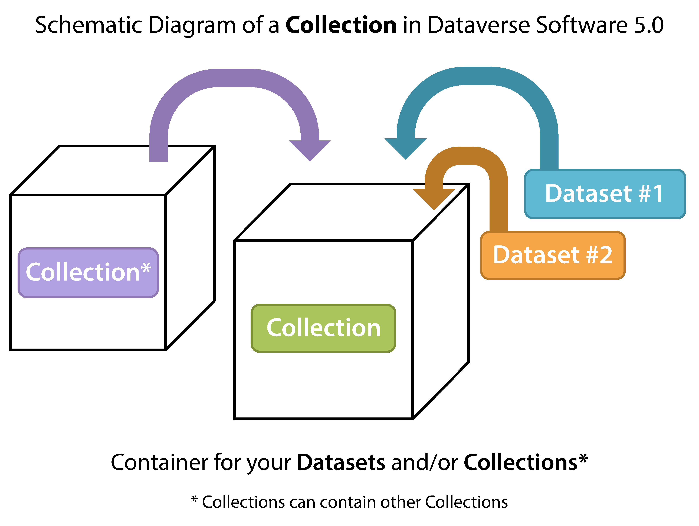

Dataverse Management
++++++++++++++++++++++++++++

A dataverse is a container for datasets (research data, code, documentation, and metadata) and other dataverses, which can be setup for individual researchers, departments, journals and organizations.

|image1|

Once a user creates a dataverse they, by default, become the
administrator of that dataverse. The dataverse administrator has access
to manage the settings described in this guide.

.. contents:: |toctitle|
  :local:

Create a Dataverse (Within the "Root" Dataverse)
===================================================

Creating a dataverse is easy but first you must be a registered user (see :doc:`/user/account`).

#. Once you are logged in click on the "Add Data" button and in the dropdown menu select "New Dataverse".
#. Once on the "New Dataverse" page fill in the following fields:
    * **Name**: Enter the name of your dataverse.
    * **Identifier**: This is an abbreviation, usually lower-case, that becomes part of the URL for the new dataverse. Special characters (~,\`, !, @, #, $, %, ^, &, and \*) and spaces are not allowed. **Note**: if you change the Dataverse URL field, the URL for your Dataverse changes (http//.../'url'), which affects links to this page.
    * **Email**: This is the email address that will be used as the contact for this particular dataverse. You can have more than one contact email address for your dataverse.
    * **Affiliation**: Add any Affiliation that can be associated to this particular dataverse (e.g., project name, institute name, department name, journal name, etc). This is automatically filled out if you have added an affiliation for your user account.
    * **Description**: Provide a description of this dataverse. This will display on the home page of your dataverse and in the search result list. The description field supports certain HTML tags (<a>, <b>, <blockquote>,  , <code>, <del>, <dd>, <dl>, <dt>, <em>, 
, <h1>-<h3>, <i>, , <kbd>, <li>, <ol>, 
, <pre>, <s>, , , <strong>, <strike>, <ul>).
    * **Category**: Select a category that best describes the type of dataverse this will be. For example, if this is a dataverse for an individual researcher's datasets, select Researcher. If this is a dataverse for an institution, select Organization & Institution.
    * **Choose the sets of Metadata Elements for datasets in this dataverse**: By default the metadata elements will be from the host dataverse that this new dataverse is created in. Dataverse offers metadata standards for multiple domains. To learn more about the metadata standards in Dataverse please check out the :doc:`/user/appendix`.
    * **Select facets for this dataverse**: by default the facets that will appear on your dataverse landing page will be from the host dataverse that this new dataverse was created in. The facets are simply metadata fields that can be used to help others easily find dataverses and datasets within this dataverse. You can select as many facets as you would like.
#. Selected metadata elements are also used to pick which metadata fields you would like to use for creating templates for your datasets. Metadata fields can be hidden, or selected as required or optional. Once you have selected all the fields you would like to use, you can create your template(s) after you finish creating your dataverse.
#. Click "Create Dataverse" button and you're done! 

\*Required fields are denoted by a red asterisk.

Edit Dataverse 
=================

To edit your dataverse, navigate to your dataverse homepage and select the "Edit Dataverse" button, 
where you will be presented with the following editing options: 

- :ref:`General Information <general-information>`: edit name, identifier, category, contact email, affiliation, description, Metadata Elements, and facets for your dataverse
- :ref:`Theme <theme>`: upload a logo for your dataverse, add a link to your department or personal website, and select colors for your dataverse in order to brand it
- :ref:`Widgets <dataverse-widgets>`: get code to add to your website to have your dataverse display on it
- :ref:`Permissions <dataverse-permissions>`: give Dataverse users permissions to your dataverse, i.e.-can edit datasets, and see which users already have which permissions for your dataverse
- :ref:`Dataset Templates <dataset-templates>`: these are useful when you have several datasets that have the same information in multiple metadata fields that you would prefer not to have to keep manually typing in
- :ref:`Dataset Guestbooks <dataset-guestbooks>`: allows you to collect data about who is downloading the files from your datasets
- :ref:`Featured Dataverses <featured-dataverses>`: if you have one or more dataverses, you can use this option to show them at the top of your dataverse page to help others easily find interesting or important dataverses
- **Delete Dataverse**: you are able to delete your dataverse as long as it is not published and does not have any draft datasets 

.. _general-information:

General Information
=====================================================

The General Information page is how you edit the information you filled in while creating your dataverse. If you need to change or add a contact email address, this is the place to do it. Additionally, you can update the metadata elements used for datasets within the dataverse, change which metadata fields are hidden, required, or optional, and update the facets you would like displayed for browsing the dataverse. If you plan on using templates, you need to select the metadata fields on the General Information page.

Tip: The metadata fields you select as required will appear on the Create Dataset form when someone goes to add a dataset to the dataverse. 

.. _theme:

Theme 
====================================================

The Theme feature provides you with a way to customize the look of your dataverse. You can decide either to use the theme from the dataverse containing your dataverse (even up to the root dataverse, AKA the homepage), or upload your own image file. Supported image types are JPEG, TIFF, or PNG and should be no larger than 500 KB. The maximum display size for an image file in a dataverse's theme is 940 pixels wide by 120 pixels high. Additionally, you can select the colors for the header of your dataverse and the text that appears in your dataverse. You can also add a link to your personal website, the website for your organization or institution, your department, journal, etc.

.. _dataverse-widgets:

Widgets
=================================================

The Widgets feature provides you with code for you to put on your personal website to have your dataverse displayed there. There are two types of Widgets for a dataverse, a Dataverse Search Box widget and a Dataverse Listing widget. From the Widgets tab on the Theme + Widgets page, you can copy and paste the code snippets for the widget you would like to add to your website. If you need to adjust the height of the widget on your website, you may do so by editing the `heightPx=500` parameter in the code snippet.

Dataverse Search Box Widget
--------------------------------

The Dataverse Search Box Widget will add a search box to your website that is linked to your dataverse. Users are directed to your dataverse in a new browser window, to display the results for search terms entered in the input field. 

Dataverse Listing Widget
-------------------------------

The Dataverse Listing Widget provides a listing of all your dataverses and datasets for users to browse, sort, filter and search. When someone clicks on a dataverse or dataset in the widget, it displays the content in the widget on your website. They can download data files directly from the datasets within the widget. If a file is restricted, they will be directed to your dataverse to log in, instead of logging in through the widget on your website.

Adding Widgets to an OpenScholar Website
----------------------------------------------
#. Log in to your OpenScholar website
#. Either build a new page or navigate to the page you would like to use to show the Dataverse widgets.
#. Click on the Settings Cog and select Layout
#. At the top right, select Add New Widget and under Misc. you will see the Dataverse Search Box and the Dataverse Listing Widgets. Click on the widget you would like to add, fill out the form, and then drag it to where you would like it to display in the page.

.. _dataverse-permissions:

Roles & Permissions 
=======================================================
Dataverse user accounts can be granted roles that define which actions they are allowed to take on specific dataverses, datasets, and/or files. Each role comes with a set of permissions, which define the specific actions that users may take.

Roles and permissions may also be granted to groups. Groups can be defined as a collection of Dataverse user accounts, a collection of IP addresses (e.g. all users of a library's computers), or a collection of all users who log in using a particular institutional login (e.g. everyone who logs in with a particular university's account credentials).

Admins of a dataverse can assign roles and permissions to the users of that dataverse. If you are an admin on a dataverse, then you will find the link to the Permissions page under the Edit dropdown on the dataverse page. 

|image2|

Clicking on Permissions will bring you to this page:

|image3|

When you access a dataverse's permissions page, you will see three sections:

**Permissions:** Here you can decide the requirements that determine which types of users can add datasets and sub dataverses to your dataverse, and what permissions they'll be granted when they do so.

**Users/Groups:** Here you can assign roles to specific users or groups, determining which actions they are permitted to take on your dataverse. You can also reference a list of all users who have roles assigned to them for your dataverse and remove their roles if you please.

**Roles:** Here you can reference a full list of roles that can be assigned to users of your dataverse. Each role lists the permissions that it offers.

Setting Access Configurations
---------------------------------------------
Under the Permissions tab, you can click the "Edit Access" button to open a box where you can add to your dataverse and what permissions are granted to those who add to your dataverse.

|image4|

The first question on this page allows you to determine how open your dataverse is to new additions - you can set whether or not the entire userbase (all logged in users) has the ability to add datasets or sub dataverses to your dataverse. 

The second question on this page allows you to choose the role (and thus the permissions) granted to users who add a dataset to your dataverse. The role you select will be automatically granted to any user who creates a dataset on your dataverse, on that dataset, at the moment that he or she creates it. The role the user is given determines his or her permissions for the dataset they've created. The key difference between the two roles is that curators can publish their own datasets, while contributors must submit the dataset to be reviewed before publication. Additionally, curators can manage dataset permissions. Note that this setting does not retroactively apply roles to users who have previously added datasets to your dataverse; it only applies to users adding new datasets going forward.

Both of these settings can be changed at any time.

Assigning Roles to Users and Groups
------------------------------------------
Under the Users/Groups tab, you can add, edit, or remove the roles granted to users and groups on your dataverse. A role is a set of permissions granted to a user or group when they're using your dataverse. For example, giving your research assistant the "Contributor" role would give her the following self-explanatory permissions on your dataverse and all datasets within your dataverse: "ViewUnpublishedDataset", "DownloadFile", "EditDataset", and "DeleteDatasetDraft". She would, however, lack the "PublishDataset" permission, and thus would be unable to publish datasets on your dataverse. If you wanted to give her that permission, you would give her a role with that permission, like the Curator role. Users and groups can hold multiple roles at the same time if needed. Roles can be removed at any time. All roles and their associated permissions are listed under the "Roles" tab of the same page.

|image5|

Note that the Dataset Creator role and Contributor role are sometimes confused. The Dataset Creator role is assigned at the dataverse level and allows a user to create new datasets in that dataverse. The Contributor role can be assigned at the dataset level, granting a user the ability to edit *that specific* dataset. Alternatively, the Contributor role can be assigned at the dataverse level, granting the user the ability to edit *all* datasets in that dataverse.

|image6|

Note: If you need to assign a role to ALL Dataverse user accounts, you can assign the role to the ":authenticated-users" group.

.. _dataset-templates: 

Dataset Templates
======================
Templates are useful when you have several datasets that have the same information in multiple metadata fields that you would prefer not to have to keep manually typing in, or if you want to use a custom set of Terms of Use and Access for multiple datasets in a dataverse. In Dataverse 4.0, templates are created at the dataverse level, can be deleted (so it does not show for future datasets), set to default (not required), or can be copied so you do not have to start over when creating a new template with similar metadata from another template. When a template is deleted, it does not impact the datasets that have used the template already.

How do you create a template? 

#. Navigate to your dataverse, click on the Edit Dataverse button and select Dataset Templates. 
#. Once you have clicked on Dataset Templates, you will be brought to the Dataset Templates page. On this page, you can 1) decide to use the dataset templates from your parent dataverse 2) create a new dataset template or 3) do both.
#. Click on the Create Dataset Template to get started. You will see that the template is the same as the create dataset page with an additional field at the top of the page to add a name for the template.
#. After adding information into the metadata fields you have information for and clicking Save and Add Terms, you will be brought to the page where you can add custom Terms of Use and Access. If you do not need custom Terms of Use and Access, click the Save Dataset Template, and only the metadata fields will be saved.
#. After clicking Save Dataset Template, you will be brought back to the Manage Dataset Templates page and should see your template listed there now with the make default, edit, view, or delete options. 
#. A dataverse does not have to have a default template and users can select which template they would like to use while on the Create Dataset page. 
#. You can also click on the View button on the Manage Dataset Templates page to see what metadata fields have information filled in.

\* Please note that the ability to choose which metadata fields are hidden, required, or optional is done on the General Information page for the dataverse.

.. _dataset-guestbooks:

Dataset Guestbooks
===========================================================
Guestbooks allow you to collect data about who is downloading the files from your datasets. You can decide to collect account information (username, given name & last name, affiliation, etc.) as well as create custom questions (e.g., What do you plan to use this data for?). You are also able to download the data collected from the enabled guestbooks as Excel files to store and use outside of Dataverse.

How do you create a guestbook?

#. After creating a dataverse, click on the Edit Dataverse button and select Dataset Guestbook
#. By default, guestbooks created in the dataverse your dataverse is in, will appear. If you do not want to use or see those guestbooks, uncheck the checkbox that says Include Guestbooks from Root Dataverse.
#. To create a new guestbook, click the Create Dataset Guestbook button on the right side of the page. 
#. Name the guestbook, determine the account information that you would like to be required (all account information fields show when someone downloads a file), and then add Custom Questions (can be required or not required). 
#. Hit the Create Dataset Guestbook button once you have finished.

What can you do with a guestbook?
After creating a guestbook, you will notice there are several options for a guestbook and appear in the list of guestbooks. 

- If you want to use a guestbook you have created, you will first need to click the button in the Action column that says Enable. Once a guestbook has been enabled, you can go to the License + Terms for a dataset and select a guestbook for it.

- There are also options to view, copy, edit, or delete a guestbook.

- Once someone has downloaded a file in a dataset where a guestbook has been assigned, an option to download collected data will appear. 

.. _featured-dataverses:

Featured Dataverses
======================================================

Featured Dataverses is a way to display sub dataverses in your dataverse that you want to feature for people to easily see when they visit your dataverse. 

Click on Featured Dataverses and a pop up will appear. Select which sub dataverses you would like to have appear. 

Note: Featured Dataverses can only be used with published dataverses.

Dataset Linking
===============

Dataset linking allows a dataverse owner to "link" their dataverse to a dataset that exists outside of that dataverse, so it appears in the dataverse’s list of contents without actually *being* in that dataverse. You can link other users' datasets to your dataverse, but that does not transfer editing or other special permissions to you. The linked dataset will still be under the original user's control. 

For example, researchers working on a collaborative study across institutions can each link their own individual institutional dataverses to the one collaborative dataset, making it easier for interested parties from each institution to find the study.

In order to link a dataset, you will need your account to have the "Add Dataset" permission on the Dataverse that is doing the linking. If you created the dataverse then you should have this permission already, but if not then you will need to ask the admin of that dataverse to assign that permission to your account. You do not need any special permissions on the dataset being linked.

To link a dataset to your dataverse, you must navigate to that dataset and click the white "Link" button in the upper-right corner of the dataset page. This will open up a window where you can type in the name of the dataverse that you would like to link the dataset to. Select your dataverse and click the save button. This will establish the link, and the dataset will now appear under your dataverse.

There is currently no way to remove established links in the UI. If you need to remove a link between a dataverse and a dataset, please contact the support team for the Dataverse installation you are using.

Dataverse Linking
======================================================

Similarly to dataset linking, dataverse linking allows a dataverse owner to "link" their dataverse to another dataverse, so the dataverse being linked will appear in the linking dataverse's list of contents without actually *being* in that dataverse. Currently, the ability to link a dataverse to another dataverse is a superuser only feature. 

If you need to have a dataverse linked to your dataverse, please contact the support team for the Dataverse installation you are using.

Publish Your Dataverse
=================================================================

Once your dataverse is ready to go public, go to your dataverse page, click on the "Publish" button on the right 
hand side of the page. A pop-up will appear to confirm that you are ready to actually Publish, since once a dataverse
is made public, it can no longer be unpublished.

.. |image2| image:: ./img/dvperms1.png
   :class: img-responsive
.. |image3| image:: ./img/dv2.png
   :class: img-responsive
.. |image4| image:: ./img/dv3.png
   :class: img-responsive
.. |image5| image:: ./img/dv4.png
   :class: img-responsive
.. |image6| image:: ./img/dv5.png
   :class: img-responsive

