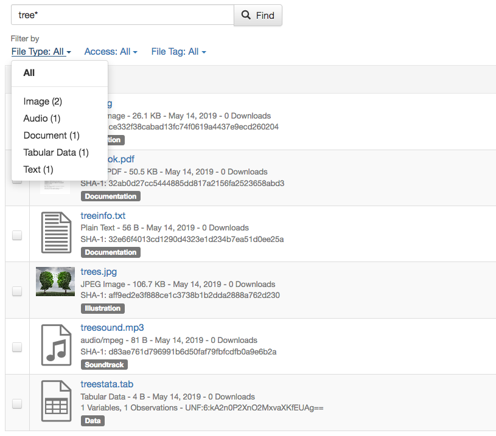

Finding and Using Data
+++++++++++++++++++++++

.. contents:: |toctitle|
    :local:

Finding Data
============

Without logging in, users can browse a Dataverse installation and search for Dataverse collections, datasets, and files, view dataset descriptions and files for
published datasets, and subset, analyze, and visualize data for published (restricted & not restricted) data files. To view an unpublished Dataverse collection, dataset, or file, a user will need to be given permission from that Dataverse installation's administrator to access it.

A user can search within a specific Dataverse collection for the Dataverse collections, datasets, and files it contains by using the search bar and facets displayed on that Dataverse collection's page.

Basic Search
------------
You can search the entire contents of the Dataverse installation, including Dataverse collections, datasets, and files. You can access the search by clicking the "Search" button in the header of every page. The search bar accepts search terms, queries, or exact phrases (in quotations).

Sorting and Viewing Search Results
^^^^^^^^^^^^^^^^^^^^^^^^^^^^^^^^^^

Facets: to the left of the search results, there are several facets a user can click on to narrow the number of results displayed.
    - Choosing a facet: to choose a facet to narrow your results by, click on that facet.
    - Removing a facet: A chosen facet can be removed by clicking on the X on it, either in the facets panel to the left, or above the results.
    - Viewing more or fewer facets: Each category in the facets panel lists the top 5 most common facets from that category. To view more, click on "More..." in the bottom right of that category. Once you've chosen to see more, an option to view less will appear in the bottom left of the facet.
   
Result cards: after entering a search term or query, result cards that match your term or query appear underneath the search bar and to the right of the facets.
    - Relevancy of results: each result card shows which metadata fields match the search query or term you entered into the search bar, with the matching term or query bolded. If the search term or query was found in the title or name of the Dataverse collection, dataset, or file, the search term or query will be bolded within it.

Other basic search features: 
    - Sorting results: search results can be sorted by name (A-Z or Z-A), by date (newest or oldest), or by relevancy of results. The sort button can be found above the search results, in the top right.
    - Bookmarkable URLs: search URLs can be copied and sent to a fellow researcher, or can be bookmarked for future sessions.

Advanced Search 
---------------

To perform an advanced search, click the "Advanced Search" link next to the search bar. There you will have the ability to 
enter search terms for Dataverse collections, dataset metadata (citation and domain-specific), and file-level 
metadata. If you are searching for tabular data files you can also search at the variable level for name and label. To find 
out more about what each field searches, hover over the field name for a detailed description of the field.

Browsing a Dataverse Installation
---------------------------------

In a Dataverse installation, browsing is the default view when a user hasn't begun a search on the root Dataverse collection page or on a specific Dataverse collection's page.  When browsing, only Dataverse collections and datasets appear in the results list and the results can be sorted by Name (A-Z or Z-A) and by Newest or Oldest. You can toggle the "Files" facet on the left to include files in the results list.

Saved Search
------------

Saved Search is currently an experimental feature only available to superusers. Please see :ref:`saved-search` in the API Guide for more information.

Using Data
==========

View Dataverse Collections + Datasets
-------------------------------------

After performing a search and finding the Dataverse collection or dataset you are looking for, click on the name of the Dataverse collection or dataset or on the thumbnail image to be taken to the page for that Dataverse collection or dataset. Once on a Dataverse collection page, you can view the Dataverse collections, datasets, and files within that Dataverse collection.

Once on a dataset page, you will see the title, citation, description, and several other fields, as well as a button to email the dataset contact and a button to share the dataset on social media. Below that information, the files, metadata, terms of use, and version information for the dataset are available. 

View Files
----------

Files in a Dataverse installation each have their own landing page that can be reached through the search results or through the Files table on their parent dataset's page. The dataset page and file page offer much the same functionality in terms of viewing and editing files, with a few small exceptions. 

- In installations that have enabled support for persistent identifers (PIDs) at the file level, the file page includes the file's DOI or handle, which can be found in the file citation and also under the Metadata tab.
- Previewers for several common file types are available and can be added by installation administrators.
- The file page's Versions tab gives you a version history that is more focused on the individual file rather than the dataset as a whole. 

File Search within Datasets
---------------------------

Datasets containing multiple files offer a file search function. On the Dataset page, under the Files tab, you'll see a search bar you can use to locate an individual file. It searches within the filename and file description. Performing a search will filter the file table to list only files matching your search. After you perform a search, if you'd like to return to the full list of files, just perform an empty search. 

Under the search bar, you'll see file search facets you can use to filter the dataset's files by file type, access level, and file tags (see the example below). 

|image-file-search-facets|

(To provide these search facets, we rely on the Solr search engine. Only the latest published version and any draft version of each dataset are indexed in Solr. Because of that, facets cannot be offered for older versions of a dataset.)

Tree View
---------

Files can be organized in one or more folders (directories) within a dataset. If the folder structure is defined, the Dataset Page will present an option for switching between the traditional table view, and the tree-like view showing folder and file hierarchy, as in the example below: 

|image-file-tree-view|

Cite Data
---------

You can find the citation for the dataset at the top of the dataset page in a blue box. Additionally, there is a Cite Data button that offers the option to download the citation as EndNote XML, RIS Format, or BibTeX Format.

.. _download_files:

In installations that have added file-level citations, you can find and download the file's citation on the file page in a similar manner.

Download Files
--------------

If you want to download all files in a dataset, you can click the Access Dataset dropdown on the dataset page and select one of the download options. The dataset's files will download in .zip format and will preserve any folder structure that the dataset owner had set up. 

If you'd like to download a single file or some subset of the dataset's files, you can use the Files tab. To download more than one file at a time, select the files you would like to download and then click the Download button above the files. The dataset's files will download in .zip format and will preserve any folder structure that the dataset owner had set up.

You may also download a file from the Access File button on its file page or by :ref:`url_download` under the Metadata tab.

Tabular data files offer additional options: You can explore using any data exploration or visualization :doc:`/admin/external-tools` (if they have been enabled), or choose from a number of tabular-data-specific download options available.

Tabular Data
^^^^^^^^^^^^

Ingested files can be downloaded in several different ways. 

- The default option is to download a tab-separated-value file which is an easy and free standard to use.

- The original file, which may be in a proprietary format which requires special software

- RData format if the installation has configured this

- The variable metadata for the file in DDI format

.. _url_download:

Downloading via URL
^^^^^^^^^^^^^^^^^^^^

The Dataverse installation displays a plaintext URL for the location of the file under the Metadata tab on the file page. This Download URL can be used to directly access the file via API (or in a web browser, if needed). When downloading larger files, in order to ensure a reliable, resumable download, we recommend using `GNU Wget <https://www.gnu.org/software/wget/>`_ in a command line terminal or using a download manager software of your choice.
 
Certain files do not provide Download URLs for technical reasons: those that are restricted, have terms of use associated with them, or are part of a Dataverse collection with a guestbook enabled. 

.. _package_download_url:

Downloading a Dataverse File Package via URL
^^^^^^^^^^^^^^^^^^^^^^^^^^^^^^^^^^^^^^^^^^^^

Dataverse File Packages are typically used to represent extremely large files or bundles containing a large number of files. Dataverse File Packages are often too large to be reliably downloaded using a web browser. When you click to download a Dataverse File Package, instead of automatically initiating the download in your web browser, the Dataverse installation displays a plaintext URL for the location of the file. To ensure a reliable, resumable download, we recommend using `GNU Wget <https://www.gnu.org/software/wget/>`_ in a command line terminal or using a download manager software of your choice. If you try to simply paste the URL into your web browser then the download may overwhelm your browser, resulting in an interrupted, timed out, or otherwise failed download.

.. _rsync_download:

Downloading a Dataverse File Package via rsync
^^^^^^^^^^^^^^^^^^^^^^^^^^^^^^^^^^^^^^^^^^^^^^

rsync is typically used for synchronizing files and directories between two different systems. Some Dataverse installations allow downloads using rsync, to facilitate large file transfers in a reliable and secure manner.

rsync-enabled Dataverse installations offer a new file download process that differs from traditional browser-based downloading. Instead of multiple files, each dataset uploaded via rsync contains a single "Dataverse File Package". When you download this package you will receive a folder that contains all files from the dataset, arranged in the exact folder structure in which they were originally uploaded.

In a dataset containing a Dataverse File Package, the information to download and/or access is in outlined the **Data Access** listed under the Access File button. If the data is locally available to you (on a shared drive, for example) you will find the folder path to access the data locally. To download, use one of the rsync commands provided. There may be multiple commands, each corresponding to a different mirror that hosts the Dataverse File Package. Go outside your browser and open a terminal (AKA command line) window on your computer. Use the terminal to run the command that corresponds with the mirror of your choice. It’s usually best to choose the mirror that is geographically closest to you. Running this command will initiate the download process.

After you've downloaded the Dataverse File Package, you may want to double-check that your download went perfectly. Under **Verify Data**, you'll find a command that you can run in your terminal that will initiate a checksum to ensure that the data you downloaded matches the data in the Dataverse installation precisely. This way, you can ensure the integrity of the data you're working with. 

Explore Data
------------

Some file types and datasets offer data exploration options if external tools have been installed. The tools are described in the :doc:`/admin/external-tools` section of the Admin Guide.

.. |image-file-tree-view| image:: ./img/file-tree-view.png
   :class: img-responsive

