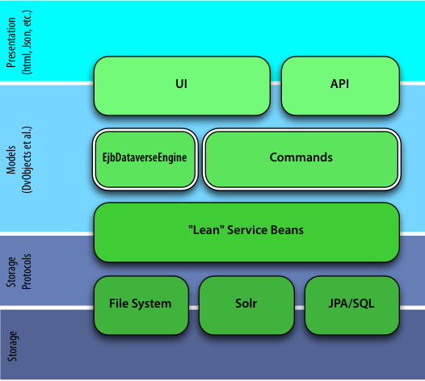
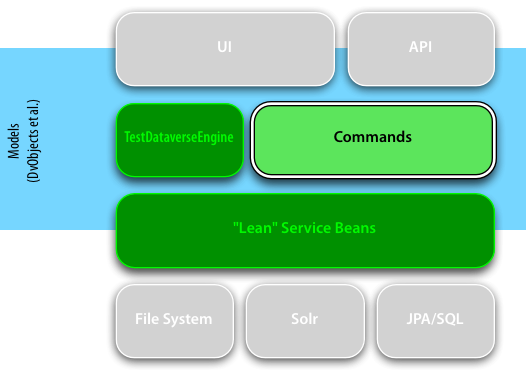
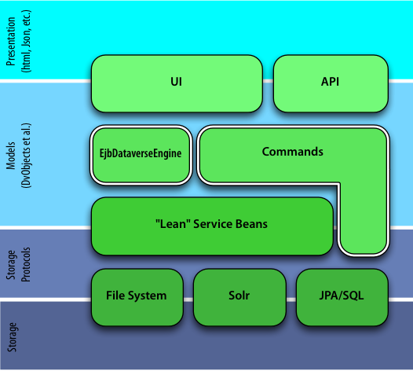
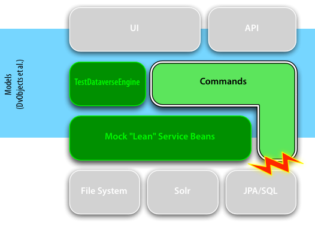

# The Testable Command

> This document was started as a result of [Issue #2746 - Improve automated testing](https://github.com/IQSS/dataverse/issues/2746),
> started by @pdurbin.

* _2016-01-07_ `v3` More tips.
* _2016-01-07_ `v2` Added references to CI and code coverage. Limited scope to `DvObject`s.
* _2016-01-03_ `v1` Initial Version

_Michael Bar-Sinai_

Dataverse is a rather complex system, implementing a rather complex set of requirements. There are many moving parts within the application itself, and many moving parts in it's infrastructure (Glassfish, Solr, etc.). Thus, it's hard to detect erroneous behaviors, let alone find a way to reproduce them and spot the point in the code where the failure happens. Moreover, testing a web application requires setup and scripting of its UI or its API - which makes the tests hard to write, laborious to set up, and to make matters worse, brittle. That's not saying that these tests are not important; they are. But it is unrealistic for developers to create, maintain and run these tests very often.

On the other hand, developers can create, maintain and frequently run unit tests.

## Unit Tests

The term "unit test" has been reused, confused and abused since it became popular, so let's start with a definition of what it means in the scope of this document. A unit test is a short piece of code that tests a small and distinct part of a system - the "unit". Executing a unit test does not take long (typically less than a second) and requires no configuration. This implies that during a unit test all activities are limited to the application memory - no reading files, no going to the network, and no querying another process in the same machine.

While they can't replace end-to-end tests, unit tests are a great way to validate small portions of a system and protect against regressions. But having unit tests improves application code in more ways. First off, to have unit tests one needs to have units. That is, the code has to be designed in modules with clear boundaries that can be reused in at least two contexts - run and test. This aids code comprehension and reuse. Unit tests also serve as an example of how the tested units are used by client code, and provide some examples of inputs and outputs. Sort of a poor man's specification document, if you will. Additionally, when writing tests the developer uses a reverse mindset, trying to break her code rather than make it work. This process makes the code much more resilient.

Because unit tests are easy to create (Java only, no configuration needed) and quick to run, it is possible to write many of them, such that many aspects of the code are tested. Normally, a single unit test would test a single use case of the unit. This way, when a unit test fails, the failure describes exactly what part stopped functioning. Other unit tests are not blocked by the failure, and so by running the entire test suite, the developer can get a good overview of which parts are broken and which parts are functioning well.

Because unit tests are easy to execute, it is recommended to get in the habit of running them prior to committing code changes to the repository. These tests are also integrated into Dataverse's automatic build processes (on [Travis-ci](https://travis-ci.org/IQSS/dataverse)). A failed test halts the build. Dataverse's build process also collects data about code coverage during the unit tests, using [Coveralls](https://coveralls.io/github/IQSS/dataverse). While code coverage is a problematic measure for Java EE applications (and has some inherent problems as well), generally speaking larger coverage means better testing.

Unit Testing of application logic in Java EE applications is normally hard to do, as the application logic lives in the service beans, which rely on dependency injections. Writing unit tests for service beans is possible, but as it involves a test container, and a persistent context (read: in-memory database) these unit tests are not very unit-y.

Luckily for Dataverse, most of the application logic regarding `DvObject`s lives in sub-classes of `Command<R>`. As these classes are plain old Java classes that get their service beans through another plain old Java class, `CommandContext`, unit testing them is pretty straightforward. That is, if we write them to be testable.

## Writing Testable Commands

Ideally, commands should only handle domain model objects, such as `DvObject`s. In particular, they should not talk directly to any of the persistence systems (JPA etc.) or rely on objects from the presentation layer, such as `HTTPRequest` or `FacesContext`.

Dataverse has both service beans and commands. When deciding whether an action on the models should go in the bean or in a command, remember that beans are not unit-testible and commands can't talk to JPA. This normally boils down to keeping straightforward storage and retrieval logic in the beans, and possibly complex application logic in the command. We call it the "lean bean" pattern (more about this pattern [in this Java One presentation](http://iqss.github.io/javaone2014-bof5619/)). An application with testable, well-behaved commands will look like the image in figure 1:

<div style="text-align:center; margin:2em">
  <br/>
  <strong>Fig. 1: </strong>Dataverse application layers inside a Java EE container, when commands are testable.
</div>


When testing, the production environment commands live in can be easily replaced by mock objects, as shown in figure 2. The presentation and storage layers are not present. The mock objects implement the same interface as the runtime objects, and thus the command runs during testing exactly as it does in production ([enter your VW joke here](http://www.slate.com/articles/technology/future_tense/2015/09/volkswagen_s_cheating_emissions_software_and_the_threat_of_black_boxes.html)).

<div style="text-align:center; margin:2em">
  <br/>
  <strong>Fig. 2: </strong>Dataverse application layers inside during unit testing, when commands are testable.
</div>

When a command directly accesses a storage-level module (as figure 3), mocking its environment becomes much harder. While technically possible, creating a mock file system, database, or a remote server is a lot of work and defects the object of creating lots of small tests.

<div style="text-align:center; margin:2em">
  
  <br/>
  <strong>Fig. 3: </strong>A Command that directly accesses storage-level modules is much harder to unit-test.
</div>

> In the early days of the commands in Dataverse, I've added the `em()` method in the `CommandContext` interface, which allows commands to directly access a JPA entity manager. The idea was to try and remove all service beans, and replace them with commands. That worked, but it made the commands too detailed, and non-testable. So in hind sight, not the best move.
> If all goes well, `em()` will be removed after we migrate all commands that use it to use service bean methods instead.

## Testing Commands

Writing unit test for a (testable) command is not very different from writing unit tests for other classes. There are some utility code that can be reused for mocking the environment, and a `TestDataverseEngine` class that executes the command in a test context.

A unit test for a command would might follow the below pattern:

1. Set up the domain objects on which the command will work.
  * Use `MocksFactory` (lives in the test folder, not in src) to create sensible default objects for the business logic context (e.g. metadata blocks and dataverses when testing a `DatasetVersion` object).
  * Hand-craft the instances needed for the test, to make sure the test case really tests what it needs to test
1. Create a `TestCommandContext` subclass, and override the methods providing the required service beans. The service beans might need to be subclassed as well, typically replacing database calls with actions on in-memory data structures.
  * Often, the context can be reused across tests.
  ````Java
  class MockDatasetServiceBean extends DatasetServiceBean {
      @Override
      public DatasetVersion storeVersion(DatasetVersion dsv) {
        dsv.setId( nextId() );
        return dsv;
      }
  }
  final DatasetServiceBeans serviceBean = new MockDatasetServiceBean();
  CommandContext ctxt = new TestCommandContext(){
        @Override public DatasetServiceBean datasets() { return serviceBean; }
  };
  ````
1. Create a new `TestDataverseEngine` instance, with the context as a parameter.
  ````Java
  TestDataverseEngine testEngine = new TestDataverseEngine( ctxt );
  ````
1. Submit the command to the engine
  ````Java
  Dataverse result = testEngine.submit(sut);
  ````
1. `Assert` all that needs assertion.
  * It is also possible to assert the permissions required by the command using `TestDataverseEngine#getReqiredPermissionsForObjects`

## Tips for Unit Testing

Numerous blogs, books and tweets have been written about creating good unit tests. Here are some non-exhaustive tips, that might be more relevant to the context of Dataverse and its commands.

* Commands that might throw an `IllegalCommandException` should get a unit test validating that they indeed throw it. Use the `expected` parameter of the `@Test` annotation, like so:
  ````Java
  @Test(expected=IllegalCommandException.class)
  public void testSomethingThatShouldNotBeDoneCantBeDone() throws Exception ...
  ````
* The old adage about "testing the right thing, and testing the thing right" holds, and it is good to keep it in mind when asserting equality of complex objects. One common pitfall when testing such objects is to use naïve `toString` on the actual and expected objects, and then test the string for equality. Sadly, this would create many false negatives. The following two XML snippets are semantically equal, but a string-level test would fail:

  ````XML
  <element attA="a" attB="b"/>
  <element attB="b" attA="a"/>
  ````

* The notion of *now* is an issue. Assume that a test needs to validate that the `creationTime` field on some `DvObject` is set to the time it is created. The naïve approach would be storing the time just before the execution of the `Create` command, and then testing that the stored time is equal to the value in the `creationTime`. This approach will fail, seemingly at random, when the command is executed at a different millisecond. The solution is to test for a reasonable delta:

  ````Java
  assertTrue( Math.abs(System.currentTimeMillis()
              - result.getCreateDate().toInstant().toEpochMilli()) < 1000 );
  ````

* Unit tests for Dataverse Commands live [here](/src/test/java/edu/harvard/iq/dataverse/engine/command/impl).

Happy Testing!

-- Michael
