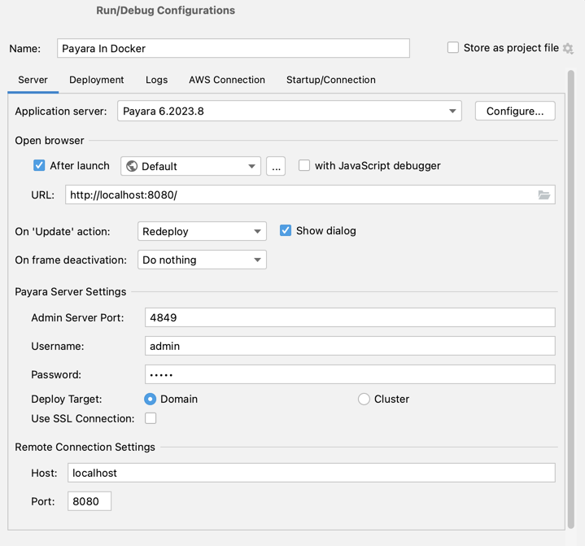

# nginx proxy

nginx can be used to proxy various services at other ports/protocols from docker.

Currently, this is used to work around a problem with the IntelliJ Payara plugin, which doesn't allow remote redeployment in case the Payara admin is served via HTTPS using a self-signed certificate, which is the case of the default dataverse container installation. This configuration provides an HTTP endpoint at port 4849, and proxies requests to the Payara admin console's HTTPS 4848 endpoint. From the IntelliJ Payara plugin one has to specify the localhost 4849 port (without SSL).

