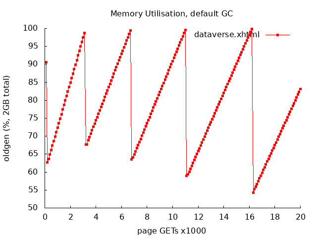
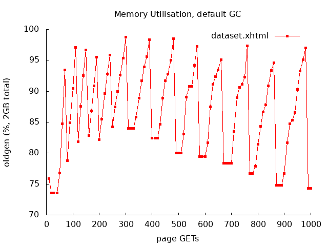

## Automated Memory Benchmark Test

In order to run the benchmark test you will need the following: 

* The two scripts from this directory: `ec2-memory-benchmark-remote.sh` and `ec2-memory-benchmark.sh`

* Have the aws command line utilities installed.

* Have your AWS credentials configured, so that you can spin up EC2 instances. 

All the other pieces will be downloaded automatically (from the
`IQSS/dataverse-ansible` and `IQSS/dataverse-sample-data` GitHub repos),
either locally, where you're running the script, or on the newly
created instance.

Run the script as follows: 

```
./ec2-memory-benchmark.sh [DATAVERSE_BRANCH]
```

Once the instance is created and populated with the data from
`dataverse-sample-data`, the script will run a memory-intensive stress
test and record some information about the memory utilisation. We are
using the approach tested in #6035 (bombarding the system with GETs on
select pages, then taking snapshots of the allocated classes on the
heap and the garbage collection stats; see the issue for more info).

In the curret implementation we are testing the two most used pages -
dataverse and dataset. Once (and if) it completes, the script will
provide links to the produced output (downloadable from the EC2
instance).

This should be considered work in progress. We'll be working on
creating more tests and figuring out how much/what else to include in
the reports.

The goal, for now is to be able to test a release (or a branch) and
produce a quantifiable benchmark that can be compared to the result
from the previous release/parent branch.

In addition to the raw text output the script will produce simple heap
utilisation plots like the examples below:

<div style="text-align:center; margin:2em">
  
</div>

<div style="text-align:center; margin:2em">
  
</div>

The immediate value of the examples above is that they confirm
visually that the memory allocated by the pages is recoverable by the
garbage collector (the line drawn through the lowest points of each
"saw tooth" is pointing down, not up). It will be even more useful to
superimpose a graph like this on something produced by another
release, for comparison.

