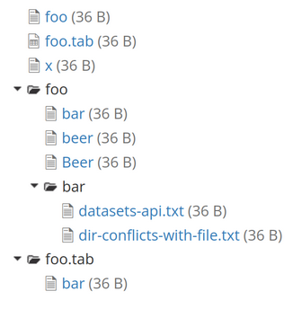
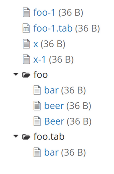

Semi-automated test
===================

This is a semi-automated test to check the API endpoints that changed by this [pull request](https://github.com/IQSS/dataverse/pull/12407).

Adjust the configuration variables at the start of the script. 
* Run the _python3_ script before deploying the pull request.
* Download all files from the dataset, the resulting zip will not extract.
* Try to add a non-conflicting file to the dataset, saving the changes succeeds.
* Deploy the pull request.
* Again try to add a non-conflicting file to the dataset, saving the changes now fails.
* Remove the resulting draft version of the dataset.
* Run the script again.

Result before deploy
--------------------

All requests to the API endpoints return 200-OK status code.
As a result the dataset will contain conflicting file/directorry paths for foo and foo/bar.

Running `scripts/issues/12407/find_duplicates.py` should show the conflicting dataset and file metadata. Note that a draft dataset has no version number.

### Example of results

| datasetversion_id | path    | protocol  | authority  | dataset_id  | versionnumber | minorversionnumber |
|-------------------|---------|-----------|------------|-------------|---------------|--------------------|
| 4                 | foo     | doi       | 10.5072    | DAR/HBGPN5  |               |                    |
| 4                 | foo/bar | doi       | 10.5072    | DAR/HBGPN5  |               |                    |
| 4                 | foo.tab | doi       | 10.5072    | DAR/HBGPN5  |               |                    |

`select directorylabel,label,datasetversion_id from filemetadata;`

| directorylabel   | label                       | datasetversion_id |
|------------------|-----------------------------|-------------------|
|                  | original-metadata.zip       | 4                 |
|  foo             | bar                         | 4                 |
|  accessibilities | anonymous.txt               | 4                 |
|  accessibilities | request.txt                 | 4                 |
|  foo.tab         | bar                         | 4                 |
|                  | foo                         | 4                 |
|                  | foo.tab                     | 4                 |
|  foo/bar         | datasets-api.txt            | 4                 |
|                  | x                           | 4                 |
|  foo/bar         | dir-conflicts-with-file.txt | 4                 |
|  foo             | beer                        | 4                 |
|  foo             | Beer                        | 4                 |

Result after deploy
-------------------
Output with dashed lines show expected status codes and further notes.

